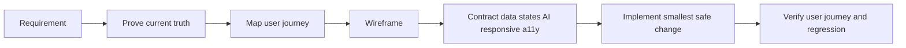

# iPix Wireframe — Turn Product Ideas Into Buildable, Testable Screens

## Start here

**What this changes:** turn a feature idea or existing screen into a verified, buildable UI contract before code.

**Real-world example:** a producer asks for a new Shoot Wizard. The agent first proves what route, components, data, and AI behavior already exist; maps the operator journey; creates the wireframe and Mermaid flow; defines states, approvals, responsive behavior, and data ownership; then hands engineering the smallest safe implementation and QA proof.

**Faster/better approach:** at task start and each major phase ask: **“Is there a better, faster, more efficient way to complete this without weakening evidence?”** Use that path.

**Production-ready when:** another agent can implement the screen without guessing, every important state has a source of truth, consequential AI writes require approval, and the real user journey can be verified.

**Canonical workflow:** `Prove → Journey → Wireframe → Contract → Implement → Verify`.

## Core rules

1. **Current iPix V2 is authoritative.** Lumina is reference-only unless a task explicitly says otherwise.
2. **Inspect before drawing.** Never design from memory when the route, component, data source, or prior design may already exist.
3. **Reuse before creating.** Existing iPix components, hooks, styles, routes, RPCs, and approved design patterns outrank new custom UI.
4. **Wireframes must reflect real data.** Do not invent fields, scores, states, or images that the product cannot supply.
5. **Humans decide. AI assists.** Consequential AI actions must be visibly reviewable and approved before durable writes.
6. **Figma and Mermaid are outputs, not separate workflows.** They should express the same verified journey and contract.
7. **A screen is not ready because it looks good.** It is ready when engineering and QA can implement and verify it without guessing.

## When to use

Use this skill for:
- New iPix screens or flows.
- Existing screens that need redesign or structural changes.
- Brand intake, campaigns, shoots, assets, DNA, product linking, matching, booking, CRM, analytics, approvals, and mobile flows.
- AI-native interactions involving CopilotKit, Mastra, streaming, generative UI, or HITL.
- Converting requirements into wireframe + component/data/state contracts.
- Preparing a screen for Figma, implementation, Linear, or Playwright verification.

Do not use it as a replacement for `tasks`, `nextjs-developer`, `copilotkit`, `mastra`, `ipix-supabase`, `cloudinary`, or `task-verifier`. Route to those skills when implementation reaches their layer. `design-to-production` is intentionally not part of current iPixai; do not reference it as an available skill.

## Current iPix tech stack — verify before each task

Read `package.json` and current repo state before relying on versions. Current product layers are:

| Layer | Technology | Wireframe concern |
|---|---|---|
| App/UI | Next.js + React | routes, server/client boundaries, layout, states |
| AI UI | CopilotKit + AG-UI | context, streaming, generative UI, approvals |
| Agent runtime | Mastra | agents, tools, workflows, suspend/resume |
| Durable truth | Supabase/Postgres | fields, RLS, RPCs, tenant-safe writes |
| Media | Cloudinary | real asset slots, uploads, transforms |
| QA | Vitest + Playwright | contract tests, user journeys, traces |
| Design | Figma + approved DC HTML | fidelity, components, annotations |
| Diagrams | Mermaid | journey, sequence, state, ownership, failure paths |
| Delivery | GitHub + Linear | PR evidence, CI, task status, post-merge proof |

## Skills, MCPs, CLIs, and tools

Use only what the task actually needs.

| Need | Use | Why |
|---|---|---|
| Task execution / PR / post-merge | `tasks` | canonical iPix lifecycle |
| Dependency/path discovery | `graphify` + Graphify CLI | fastest current-state map before broad reading |
| Wireframe contract | `ipix-wireframe` | this workflow |
| Diagrams | `mermaid-diagrams` | reasoning + defect discovery |
| Next.js UI | `nextjs-developer` | current App Router contract |
| React performance | `vercel-react-best-practices` | client/render/bundle decisions |
| Data/RLS/RPC | `ipix-supabase` | schema and authorization truth |
| Agent UI | `copilotkit` | AG-UI, context, generative UI, HITL |
| Agents/workflows | `mastra` | tools, memory, workflow authority |
| Media | `cloudinary` | image/video ownership and delivery |
| Independent Done proof | `task-verifier` | challenge unproven claims |
| GitHub state/actions | GitHub connector or `gh` | PR, reviews, CI, exact-head evidence |
| Figma artifact | Figma connector | inspect/create design artifacts when needed |
| Current vendor docs | Context7 + official docs | fast current API lookup; verify load-bearing claims from official/version-specific sources |
| Local repo/runtime | Remote Desktop Commander | inspect code, run commands, verify files |

If Linear/Supabase MCPs are connected, use them for the relevant task, but repository/runtime truth and authorization rules still win.

## Source-of-truth order

When sources conflict, resolve in this order:

1. Live/current iPix route, data contract, and repository state.
2. `docs/prd.md` + canonical sitemap/accepted ADRs.
3. Approved `Universal-design-prompt-4/Pages/*.dc.html` for visual layout truth.
4. Existing iPix components and design tokens.
5. Screen task + conversion plan + current wireframe/diagram.
6. Lumina/reference implementations for proven UX/business logic only.
7. External templates/examples last.

Never let a stale wireframe override a working route, current schema, or accepted architecture.

## Fidelity selection

### Level 1 — Flow sketch
Use for new concepts, screen count, route planning, or stakeholder discussion.
Output: ASCII flow + Mermaid journey/state diagram.

### Level 2 — Implementation wireframe — default
Use for engineering work.
Output: layout, real component targets, data zones, states, AI/HITL behavior, responsive rules, accessibility, reuse map, acceptance criteria, and test scenarios.

### Level 3 — High fidelity
Use after flow/layout are approved or when visual parity matters.
Output: Figma or approved DC design, using the real iPix design system/components where possible.

## 1. PROVE — inspect before drawing

Before creating or changing a wireframe, verify the current state.

Check:
- Canonical route and whether it already exists.
- Current page/workspace implementation.
- Existing components, hooks, CSS modules, utilities, dialogs, sheets, and shells.
- Data source: table/view/RPC/API and nullability.
- Existing AI surface, agent, tools, and approval behavior.
- Existing DC/Figma/wireframe/diagram for the screen.
- Active PR/worktree that may already own the change.
- Related Linear task and dependencies when known.

Use Graphify/repository search before broad reading. Read only load-bearing files first.

### Prove table

| Area | Current truth | Change needed? |
|---|---|---|
| Route | | |
| Workspace/page | | |
| Reusable components | | |
| Data source | | |
| AI/agent behavior | | |
| Existing design | | |
| PR/worktree collision | | |

If the reported gap no longer exists, stop and report that instead of redesigning it.

## 2. JOURNEY — define the outcome before the screen

State the real user and observable outcome in plain language.

Example:
`Operator opens New Shoot → selects brand → enters objective → AI proposes deliverables → operator edits → operator approves → AI proposes shot list → operator approves → shoot is created.`

Required journey questions:
1. Who starts the flow?
2. What triggers it?
3. What must the user understand or decide?
4. What does the system/AI return?
5. Where can the user edit, reject, retry, or leave?
6. What action commits durable state?
7. What visible success confirms completion?

For multi-step, cross-system, approval, or failure-heavy flows, produce Mermaid.

### Mermaid rule

Use Mermaid to explain behavior, not decorate documentation.
Prefer:
- `flowchart` for navigation/decision paths.
- `sequenceDiagram` for UI → agent → approval → data interactions.
- `stateDiagram-v2` for lifecycle/state machines.
- `journey` for persona experience when useful.

The Mermaid diagram and wireframe must describe the same flow.

## 3. WIREFRAME — show hierarchy and behavior

Wireframe from the verified journey, not from a component wish list.

For each screen:
- Mark primary task and primary CTA.
- Organize information by priority: `P0` required, `P1` important, `P2` supporting, `P3` advanced/optional.
- Show major zones and navigation.
- Annotate interaction, dynamic content, validation, and transitions.
- Keep lo-fi work visually simple; do not spend time polishing color/branding before structure is approved.

### Preferred outputs

**Default:** ASCII + spec tables for fast engineering communication.

**Clickable prototype:** use approved HTML/Figma when interaction needs validation.

**Figma:** first-class output for high-fidelity or collaborative design; use real iPix components/design-system constraints where available rather than generic boxes.

**DC HTML:** when an approved `.dc.html` exists, treat it as visual layout truth and make the wireframe describe it rather than inventing a competing layout.

Current screen wireframes live under:
`Universal-design-prompt-4/tasks/screens/wireframes/`

Current approved design references live under:
`Universal-design-prompt-4/Pages/`

## 4. CONTRACT — make the wireframe buildable

Every implementation wireframe must include these contracts.

### A. Component reuse map

Search before creating.

| Wireframe block | Existing React target | Decision | Notes |
|---|---|---|---|
| | | Reuse / Adapt / Create / Defer | |

Search components, hooks, CSS, utilities, routes, RPCs/views, and design-system primitives.

### B. Data contract

| Zone | Source of truth | Missing/empty state | Write path |
|---|---|---|---|
| | | | |

Rules:
- No fake business values when the source can be null.
- Do not duplicate mutable truth just to satisfy a wireframe.
- Cloudinary owns media bytes/transforms; Supabase owns iPix business metadata; commerce systems own commerce facts where specified.
- Existing route wiring is preserved unless the Prove step shows it is wrong.

### C. State matrix

Cover relevant states: initial, loading, populated, selected, editing, empty, no-results, error+retry, unavailable access, offline/interrupted, AI streaming, awaiting approval, rejected, committing, and success.

### D. AI / HITL contract

Use explicit annotations in AI-native wireframes:

`[AI READS]` → context the agent may inspect
`[AI PROPOSES]` → draft/recommendation only
`[HUMAN EDITS]` → operator may change proposal
`[HUMAN APPROVES]` → explicit decision gate
`[SYSTEM WRITES]` → approved durable mutation

For consequential actions, show this sequence:

`AI proposes → human reviews/edits → human approves → approved action executes → system records result`.

Do not design silent AI publishing, payments, destructive actions, tenant-critical mutation, or direct durable writes when approval is appropriate.

For CopilotKit/Mastra work, identify:
- What page state is visible to the agent.
- Which output appears in the right rail vs center workspace.
- Streaming/progress states.
- Approval card surface.
- Reject/edit/retry behavior.
- Resume/commit success state.

### E. Responsive contract

Specify behavior, not just screenshots.

Minimum checkpoints:
- Desktop: 1440px.
- Tablet: about 1024px.
- Mobile: 390px.

Define what stays visible, collapses, becomes a drawer/sheet, stacks, scrolls, or moves to bottom navigation. Never assume desktop simply shrinks.

### F. Accessibility contract

Annotate before high fidelity:
- Heading hierarchy and landmark regions.
- Button vs link semantics.
- Keyboard order and focus behavior.
- Form labels and validation placement.
- Dialog/sheet focus management.
- Screen-reader names for icon controls.
- Live announcements for AI/loading/status updates when needed.
- Image alt purpose: informative vs decorative.

### G. Information priority

Use priority markers when space or mobile tradeoffs matter:
`P0` task-critical · `P1` important · `P2` supporting · `P3` optional/advanced.

## 5. IMPLEMENT — hand off the smallest safe change

The wireframe skill does not own production implementation. Its job is to make implementation deterministic.

Before handoff, identify:
- Existing files/components to reuse.
- New components genuinely required.
- Data/API/RPC dependencies.
- AI/CopilotKit/Mastra dependencies.
- Explicit out-of-scope work.
- Acceptance criteria tied to the journey.

**Faster/better approach:** prefer the smallest change that reuses current iPix architecture and components. Do not redesign unrelated systems or copy legacy Lumina infrastructure.

Route implementation to the relevant skills only when needed:
- `tasks` — canonical implementation, PR, CI, and post-merge workflow.
- `nextjs-developer` — routes, App Router, server/client boundaries.
- `vercel-react-best-practices` — React performance.
- `ipix-supabase` — tables, views, RPCs, RLS, types.
- `copilotkit` — agent UI, generative UI, context, approvals.
- `mastra` — agents, tools, workflows, memory.
- `task-verifier` — final Done gate.

Do not load unrelated skills for a screen that does not touch those layers.

## 6. VERIFY — design intent must be testable

Every implementation wireframe should produce acceptance criteria and QA scenarios.

Minimum verification targets:
- Primary journey completes.
- Loading/empty/error states are honest.
- AI proposal can be edited/rejected/approved as designed.
- Rejection does not commit a durable write.
- Approval commits once and shows visible confirmation.
- Responsive behavior matches the contract.
- Keyboard/focus behavior works.
- Existing routes/data behavior does not regress.

Convert important states directly into Playwright scenarios.

Example:
`No shoots → /app/shoots shows EmptyState → Create Shoot CTA is keyboard reachable.`

AI example:
`Generate proposal → approval card appears → reject writes nothing → regenerate/edit → approve → one committed record.`

For an approved DC/Figma target, also perform visual comparison at the required desktop/mobile widths.

## Wireframe red-flag audit

Before calling a wireframe Ready, confirm:
- User goal is obvious quickly.
- Every primary CTA has a defined result.
- AI authority and human authority are visibly separated.
- Sensitive/destructive actions have an appropriate confirmation gate.
- No fake business data is assumed.
- Every dynamic block has a source of truth.
- Loading, empty, error, and recovery states are represented.
- Tenant/org context is not treated as a browser-authority shortcut.
- Existing components were checked before creating new ones.
- Mobile interaction is realistic, not a scaled desktop screenshot.
- Keyboard navigation is possible.
- QA can derive deterministic tests from the spec.

If any required item fails, the wireframe is not Ready.

## Forensic audit — mandatory before Ready

Act like a forensic auditor. Do not assume the requested screen, gap, component, or data contract is correct.

Check for:
- stale route/design/task assumptions;
- duplicate components or a second source of truth;
- fields shown in UI that current data cannot supply;
- missing loading/empty/error/retry states;
- browser-controlled org/tenant authority;
- AI writes without exact human approval;
- approval detached from the exact proposal/revision;
- duplicate retry/resume side effects;
- inaccessible controls, broken focus, or mobile-only dead ends;
- unsupported skill/tool references;
- existing PR/worktree collisions;
- acceptance criteria with no observable test/readback.

For each finding record: **error/red flag → impact → evidence → smallest fix → verification**. A blocker cannot be overridden by a high score.

## Readiness score

When useful, grade each area `/100`: Current-state proof · User journey · Reuse · Data correctness · States/recovery · AI/HITL safety · Responsive · Accessibility · Testability. Mark scores **provisional** when evidence is incomplete.

- `90–100`: Ready only if no blocker remains.
- `80–89`: Conditional; fix named gaps before implementation/merge.
- `<80`: Not ready.
- Any security, tenant, destructive-write, or approval blocker: **BLOCKED regardless of score**.

## Definition of Ready

- [ ] Goal and persona are explicit.
- [ ] Prove table is complete.
- [ ] Current route/data/component state was inspected.
- [ ] Existing wireframe/DC/Figma reference was checked.
- [ ] User journey is defined.
- [ ] Component reuse map is complete.
- [ ] Data and state contracts are complete.
- [ ] AI/HITL contract is explicit where applicable.
- [ ] Responsive and accessibility behavior are defined.
- [ ] Acceptance criteria and test scenarios exist.

## Pre-merge production-ready checklist

Before merging an implementation derived from the wireframe:
- [ ] exact-head diff matches approved scope; no unrelated files;
- [ ] targeted tests for changed behavior pass;
- [ ] `npm test` when relevant;
- [ ] `npm run typecheck` passes;
- [ ] `npm run build` when risk/CI requires it and dev ports are free;
- [ ] Playwright real user journey passes when UI behavior changed;
- [ ] responsive checks cover desktop/tablet/mobile contract;
- [ ] keyboard/focus/accessibility behavior is verified;
- [ ] AI rejection writes nothing and approval commits once when HITL applies;
- [ ] tenant isolation proof exists when org-scoped data is touched;
- [ ] visual comparison exists when DC/Figma is the approved target;
- [ ] CI is green and review threads are resolved;
- [ ] residual risks and rollback/recovery are documented.

Playwright tests should prefer user-facing locators (`getByRole`, labels/text where appropriate), web-first assertions, and traces on first retry rather than brittle CSS/XPath or fixed sleeps.

## Post-merge actions

After merge:
1. Verify the exact `main` commit contains the intended change.
2. Re-run the cheapest decisive tests against `main`.
3. Run the real authenticated user journey/preview when the task changes user-visible behavior.
4. Confirm logs/network/write readback for the final state when applicable.
5. Recheck tenant isolation/HITL side effects for high-risk changes.
6. Update Linear/evidence only after observable proof passes.
7. If post-merge proof fails, reopen/follow up immediately; merged is not the same as Done.

## Official and reference links

Use these only when relevant; installed source/types and current repo/runtime evidence outrank generic docs.

- Agent Skills specification: https://github.com/agentskills/agentskills
- Anthropic skill creator: https://github.com/anthropics/skills/blob/main/skills/skill-creator/SKILL.md
- Figma developer handoff: https://help.figma.com/hc/en-us/articles/360040521453-Optimize-design-files-for-developer-handoff
- Figma component/accessibility guidance: https://help.figma.com/hc/en-us/articles/39747637290263-Components-collection-Tips-for-component-management
- Mermaid docs: https://mermaid.js.org/intro/
- Mermaid flowcharts: https://mermaid.js.org/syntax/flowchart.html
- Mermaid sequence diagrams: https://mermaid.js.org/syntax/sequenceDiagram.html
- Mermaid state diagrams: https://mermaid.js.org/syntax/stateDiagram.html
- Mermaid user journeys: https://mermaid.js.org/syntax/userJourney.html
- Playwright best practices: https://playwright.dev/docs/best-practices
- Playwright locators: https://playwright.dev/docs/locators
- Playwright assertions: https://playwright.dev/docs/test-assertions
- Playwright trace viewer: https://playwright.dev/docs/trace-viewer
- GitHub reviewable PR guidance: https://docs.github.com/en/pull-requests/concepts/helping-others-review-your-changes
- GitHub PR standardization: https://docs.github.com/en/pull-requests/reference/managing-and-standardizing-pull-requests
- Linear issue templates: https://linear.app/docs/issue-templates
- Community wireframe spec reference: https://www.skills.sh/owl-listener/designer-skills/wireframe-spec
- Community sketch reference: https://www.skills.sh/nexu-io/open-design/wireframe-sketch
- Technical wireframe reference: https://www.skills.sh/mengto/skills/technical-wireframe-info-layout
- Figma low-fi reference: https://www.figma.com/community/file/829375674987486138/low-fi-wireframe-template
- Figma high-fi reference: https://www.figma.com/community/file/966471912164196917/high-fidelity-wireframes

## Required output package

Keep the package concise but complete:
1. Goal and user outcome.
2. Current-state findings.
3. User journey.
4. ASCII implementation wireframe.
5. Component reuse map.
6. State matrix.
7. Data contract.
8. AI/HITL contract, when applicable.
9. Responsive behavior.
10. Accessibility notes.
11. Risks/blockers.
12. Acceptance criteria.
13. Playwright/verification scenarios.
14. Mermaid diagram when the flow crosses systems, approvals, or meaningful branches.
15. Figma/DC artifact when fidelity or collaboration requires it.

## Canonical principle

A good iPix wireframe is not a disposable drawing. It is the smallest shared contract connecting product intent, current system truth, design, engineering, AI governance, and QA.
