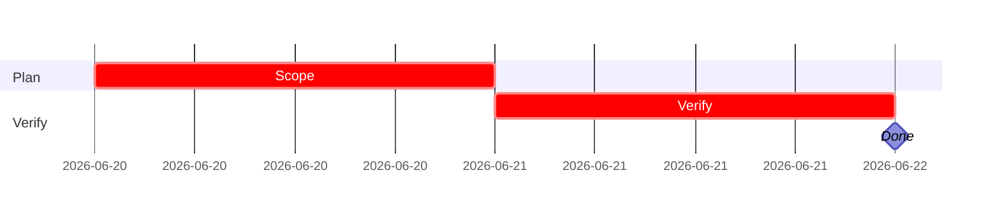

# iPix Linear workflow

Use this reference for all iPix / Lumina Studio Linear work.

## Context

- Linear workspace: `linear.app/ipix`
- Team: `IPI`
- Issue format: `IPI-###`
- Spec IDs: `PLT-###`, `AI-###`, `COM-###`, `UI-###`, `DNA-###`
- Task/progress source of truth: live Linear issue
- Canonical task standard: `.claude/skills/tasks/SKILL.md`
- Supabase policy: remote-only for MVP; do not run local Supabase Docker.

## Read first for iPix tasks

1. `.claude/skills/tasks/SKILL.md`.
2. Live Linear issue, dependencies, and current progress.
3. Current repository/runtime evidence relevant to the task.
4. Affected domain skills.
5. Relevant project docs, PRDs, or diagrams only when they materially inform the task.

## Executable Linear description

Every executable iPix issue should include:

```markdown
## SPEC-ID — short title

**In plain terms:** …

**Blocked by:** … · **Unblocks:** …

**Skills:** `tasks` · `task-verifier` · `linear` · <affected domain skills>

---

### Flow

```mermaid
flowchart TD
  …
```

---

### Completion steps

#### A. Scope and setup
- [ ] **A1** Confirm spec and Linear issue — proof

#### B. Implement
- [ ] **B1** Code change — proof

#### C. Integrate
- [ ] **C1** Wire dependent systems — proof

#### D. Verify
- [ ] **D1** Run relevant commands — proof

#### E. Ship
- [ ] **E1** Record verified evidence/progress in Linear; Done only after applicable post-merge proof

---

### Gantt — IPI-NNN


```

## Spec file template

```markdown
# IPI-<n> — <SPEC-ID> <title>

**Linear:** IPI-<n>
**Track:** Platform | Commerce | UI | DNA | AI
**Blocked by:** … · **Unblocks:** …
**Skills:** tasks · task-verifier · linear · <affected domain skills>
**MVP proof:** #N

## In plain terms
…

## Acceptance criteria
- [ ] **AC1** … — proof
- [ ] **AC2** … — proof

## Wiring plan
| Action | Path | Notes |
|--------|------|-------|
| Create | `src/...` | … |
| Modify | `supabase/...` | … |

## Verify
- [ ] `npm run build`
- [ ] `npm run test` if applicable
- [ ] `npm run supabase:verify-rls` if auth/RLS touched
- [ ] Browser smoke or script evidence
```

## Plain-language rules

| Do not write | Write |
|--------------|-------|
| Add RLS policies | Operator can sign in, has a profiles row, and cannot read another user's brands |
| Deploy edge function | Operator pastes a brand URL and AI profile JSON lands in Supabase without exposing Gemini key in browser |
| Validate env vars | App fails fast at startup if Supabase URL is missing and Engineer sees a clear error |

Personas:

- **Operator:** dashboard user.
- **Engineer:** CLI/CI user.
- **Shopper:** B2C commerce user, COM track only.

## Scripts

Update the live Linear issue directly through the connected Linear tool/API. Do not require a nonexistent local spec sync layer. If Linear is unavailable, report the update as blocked.

## Verification gates

Use `.claude/skills/tasks/references/pre-merge-tests.md` plus the affected domain skill. Re-read current `package.json` / CI before naming commands; do not maintain a second command matrix here.

## Done definition

An iPix issue is done only when:

- Applicable acceptance criteria are proved with current evidence.
- Risk-matched verification passed.
- Applicable post-merge proof passed.
- Linear progress/state matches reality.
- `task-verifier` Full has no unresolved blocker before Done.
