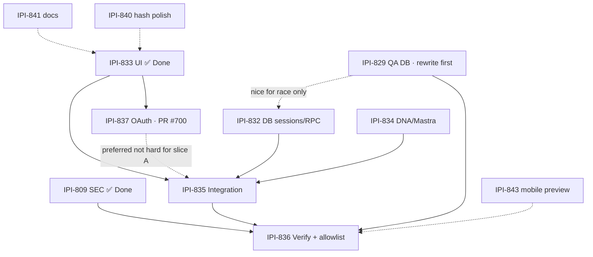

# iPix Linear Task Verification Audit — Onboarding v2

**Date:** 2026-08-01  
**Mode:** Full task-verifier (spec quality + dependency safety — **not** a Done gate)  
**Auditor:** Cursor agent · READ-ONLY (no Linear / GitHub / Supabase / repo mutations)  
**Baseline:** `origin/main` @ `aa047ad1` · Project [DESIGN V2 — Operator React Parity](https://linear.app/amo100/project/design-v2-operator-react-parity-e276f28e26a0)  
**Per-task audits:** `ipi-829.md` · `ipi-832.md` · `ipi-834.md` · `ipi-835.md` · `IPI-836.md` · `ipi-837.md` · `summary.md`

Legend: 🟢 correct/ready · 🟡 correct but incomplete · 🔴 incorrect/blocked · ⚪ not verified

---

## Summary table

| Task | Status accuracy | Technical correctness | Dependency readiness | Production readiness | Score | Verdict |
| ---- | --------------: | --------------------: | -------------------: | -------------------: | ----: | ------- |
| **IPI-837** AUTH-OAUTH-001 | 🟢 In Progress + PR #700 | 🟢 Premise live on `main` (`successUrl=/app`) | 🟢 Unblocked (833 Done) | 🟡 Needs Google smoke + merge | **88** | 🟢 finish & merge |
| **IPI-832** ONB2-DB-001 | 🟢 Todo | 🟢 Spec excellent; sessions absent | 🟢 A/B can start; C needs QA | ⚪ N/A until migrate | **86** | 🟢 start A now |
| **IPI-834** ONB2-AI-001 | 🟢 Todo | 🟢 Mastra `{ok}`/`{enriched}` confirmed | 🟢 No hard blockers | ⚪ N/A | **84** | 🟢 start now ∥ 832 |
| **IPI-829** ONB-QA-001 | 🟢 Todo | 🔴 Correction vs Steps 5–6 contradict | 🟢 Independent lane | 🔴 Unsafe as written | **58** | 🔴 rewrite first |
| **IPI-835** ONB2-INT-001 | 🟢 Todo | 🟢 Realtime bugs true | 🔴 Hard-blocks 837 overstated; mega-scope | 🔴 Not ready | **68** | 🟡 wait + reslice |
| **IPI-836** ONB2-VERIFY-001 | 🟢 Todo | 🟡 Flag AC contradicts correction | 🔴 Blocked by 835+829 | 🔴 Final gate | **72** | 🟡 scaffold only |
| **IPI-843** QA-001 mobile/reduced-motion | 🟢 Todo | 🟢 Valid polish | 🟢 Can run early | ⚪ Preview | **78** | 🟡 optional early |
| **IPI-840** ONB2-UI-002 hash sync | 🟢 Todo (rescoped) | 🟢 Mostly fixed; popstate hole | 🟢 Independent | ⚪ Polish | **82** | 🟡 tiny polish |
| **IPI-841** DOC-001 COMPONENTS.md | 🟢 Todo | 🟢 Stale WizardStep claim confirmed | 🟢 Docs-only | ⚪ N/A | **90** | 🟢 docs PR anytime |
| **IPI-831** ONB2-EPIC-001 | 🟡 In Progress | 🔴 Body claims tenant leak still live | 🟡 Graph stale vs children | 🟡 Tracker only | **55** | 🔴 refresh epic body |

**Composite plan health (after corrections):** ~74/100

---

## Verification report — 2026-08-01 · auditor

| Task | Spec /100 | Execution /100 | Skills /100 | Composite | Blockers | Safe? |
|------|----------:|---------------:|------------:|----------:|----------|-------|
| IPI-837 | 90 | 85* | 88 | 87 | 0 (smoke pending) | Yes* merge after smoke |
| IPI-832 | 92 | 15 | 90 | 62 | 0 for A/B | Yes* A/B |
| IPI-834 | 90 | 10 | 88 | 58 | 0 | Yes |
| IPI-829 | 45 | 5 | 70 | 35 | Steps 5–6 P0 | **No** |
| IPI-835 | 75 | 5 | 85 | 50 | 832+834 | **No** (full) |
| IPI-836 | 70 | 0 | 80 | 45 | 835+829 | **No** |
| IPI-831 | 40 | 40 | 70 | 48 | Stale premise | Tracker only |

\*837 execution high on PR branch; **not** on `origin/main` yet (`successUrl` still hardcoded).

### Skills compliance (epic-wide)

| Skill | Required | On disk | MUSTs | Failures |
|-------|:--------:|:-------:|:-----:|----------|
| `task-verifier` | ✅ | ✅ | evidence-first | — |
| `ipix-supabase` | ✅ 829/832/835 | ✅ | no fake repair | 829 Steps violate |
| `mastra` / `mastra-agent-reviewer` | ✅ 834 | ✅ | fail-closed | — |
| `nextjs-developer` | ✅ 837/835 | ✅ | — | — |
| `ponytail` | ✅ | ✅ | smallest change | 835 scope bomb |
| `tasks` | ✅ | ✅ | one concern/PR | — |

**Skills compliance score:** ~78/100 (dragged by 829 unsafe steps + 835 packaging)

---

## 1. Executive verdict

| Question | Answer |
| --- | --- |
| Are the tasks correct? | **Mostly** — 832/834/837 are strong; 829/831/836 have internal contradictions; 835 is right destination, dangerous packaging |
| Will the complete task graph succeed? | **Yes, after corrections** — reject unified mega-status enum; rewrite 829; soften 835←837; fix 836 flag AC; drop blocks→808 |
| Can tasks safely run in parallel? | **Four lanes yes** (837 ∥ 832A ∥ 834 ∥ 829-rewrite) **if** shared **ID** contract is locked — **not** a fake `OnboardingStatus` mega-enum |
| Current completion % | **~38%** product (UI+security Done; OAuth PR open; DB/AI/INT/VERIFY not started). Prod readiness **~28%** |
| Chance of success after corrections | **~75%** |
| Single biggest blocker | **No durable session/materialize path** (IPI-832) — without it 835 cannot assemble; secondary: **829 Steps that lie about schema** |

**User parallel plan:** accepted with one P0 correction — do **not** adopt the proposed unified status enum that mixes session + intake + UI phases.

---

## 2. Confirmed errors

| Severity | Task | Incorrect claim | Evidence | Correct version | Required fix |
| -------- | ---- | --------------- | -------- | --------------- | ------------ |
| P0 | **User parallel prompt** | Shared `OnboardingStatus` with `materializing`/`awaiting_approval`/… | IPI-832 SQL: `draft\|materialized` only; live `brand_intake_status` has no `pending_approval` | Split: session status vs `brands.intake_status` vs UI phase | Publish ID contract only before parallel coding |
| P0 | **IPI-829** | Steps 5–6 `migration repair --status applied` for absent Mastra/Hyperdrive | Correction banner forbids it; Steps still prescribe it; staging 219 vs prod **~277** (MCP `list_migrations`) | Option A prod-like QA **or** apply real SQL; never fake ledger | Rewrite Steps 2–11; delete repair loop |
| P1 | **IPI-831** | Tenant leak live; no `(onboarding)` route; 809 unapplied | Prod has `20260727020000_org_tenant_isolation` + revoke migrations; `(onboarding)` on `origin/main`; 809 Done | Epic is tracker; body is stale as of 2026-07-26 | Refresh “Verified current state” |
| P1 | **IPI-832 / 834** | Linear `blocks` → **IPI-808** | IPI-808 `Canceled` 2026-07-27 | blocks → **IPI-835** only | Remove 808 edges |
| P1 | **IPI-836** | AC #9 / Files create `NEXT_PUBLIC_ONBOARDING_V2_ENABLED` | Correction forbids NEXT_PUBLIC allowlist; `git grep` empty on flag | Server `ONBOARDING_V2_ALLOWLIST` (+ optional server enable) | Rewrite AC #9–14 + Files |
| P1 | **IPI-835** | Hard `blockedBy` IPI-837 for whole issue | Relations: blockedBy includes 837; slice A is publication-only | Soften: 837 preferred for Google cutover; A unblocked | Edit Linear relation / body |
| P1 | **IPI-835** | Fix Brand Hub banner only | Onboarding screen 12 = `analysis-progress-screen.tsx` (fake timer) | Wire **onboarding** progress + banner | Add AC |
| P1 | **IPI-835** | Delete `/app/onboarding` in this task | Legacy still create path; 836 not green | Defer delete until 836 or redirect behind allowlist | Move to post-verify |
| P2 | **IPI-836** | “Highest e2e is 13; next is 14” | Repo `e2e/` highest numbered = **12-*** this run | Re-probe at implement; pick free `NN-` | Fix numbering claim |
| P2 | **IPI-840** | Full hash bug still open | `use-screen-history.ts` initial load already `replaceState`; popstate fallback may not | Tiny popstate + tests | Keep rescoped AC |
| P3 | **IPI-829** | “25 pending” / latest target `20260726220514` | Gap grew (~58+); prod latest `20260730232458` | Re-baseline counts | Update table |

---

## 3. Failure points and red flags

1. **Double Continue / multi-tab materialize** — without unique `(user_id, idempotency_key)` + RPC `FOR UPDATE`, two orgs appear (orphan org risk today in `createOrgAndBrand` two-round-trip).
2. **Google OAuth drops `/onboarding`** — operators bounce to `/app`; every E2E for Google path fails until #700 merges (`callback/route.ts:108` on `main`).
3. **Fake progress → Ready feel** — screen 12 timer hits 100% while crawl idle; partners approve vibes.
4. **Realtime silent death** — `brands` not published; `CHANNEL_ERROR` swallowed → “still working” forever.
5. **Client timeout marks failed** — next engineer “helps” and races with `expire_stale_brand_analysis`.
6. **Mastra fail-open** — `{ ok: true }` with garbage profile → Edge may catch later, approval UI still confuses.
7. **Prompt injection via crawl quotes** — evidence text treated as instructions if not sandboxed in prompts/UI.
8. **QA schema lie** — `migration repair` without schema → Playwright passes on incomplete DB, prod breaks.
9. **NEXT_PUBLIC flag** — cannot allowlist one org; whole build flips.
10. **Legacy + v2 both writable** — dual create paths → duplicate brands.
11. **Unified status enum collision** — 832/834/835 diverge silently until integration week.
12. **Delete legacy early** — no rollback for partners still on `/app/onboarding`.
13. **Mobile tests at desktop width** — IPI-843 premise; false green.
14. **Suspend/resume auth** — approve route must keep actor checks (already exists — do not bypass).

---

## 4. Missing requirements (prefer add AC, not new tickets)

| Owning task | AC to add | Required test | Why |
| --- | --- | --- | --- |
| **IPI-832** | Shared ID types exported; session status **only** `draft\|materialized` | Unit: zod rejects other session statuses | Parallel contract |
| **IPI-834** | Crawl quotes are untrusted; no tool/exec from quote | Workflow fixture with hostile quote | Prompt injection |
| **IPI-835** | Wire `analysis-progress-screen.tsx` to crawl truth | Component: timer path removed | Onboarding UX |
| **IPI-835** | Resume must not start second crawl if lock held | Orchestration test | Duplicates |
| **IPI-835** | Do not delete `/app/onboarding` until 836 green | Explicit out-of-scope / slice note | Rollback |
| **IPI-836** | Server allowlist only | Config test: NEXT_PUBLIC absent | Rollout safety |
| **IPI-829** | Step 0 human A/B decision dated | Comment + PR | Plan choice |
| **IPI-831** | Refresh verified state (809 Done, UI Done, 837 In Progress) | — | Epic honesty |

---

## 5. Correct dependency graph



**Plain-text order**

```text
DONE:     IPI-809, IPI-833
NOW ∥:    IPI-837 (smoke→merge) · IPI-832-A/B · IPI-834 · IPI-829 (rewrite then exec) · IPI-841
EARLY:    IPI-840 · IPI-843 (optional) · IPI-836 fixtures (non-claiming)
THEN:     IPI-835 (after 832+834; prefer 837 merged)
LAST:     IPI-836 (after 835+829)
```

---

## 6. Parallel execution plan

| Lane | Full Linear task name | Can start now? | Files/schemas likely touched | Collision risk | Merge order |
| ---- | --------------------- | -------------: | ---------------------------- | -------------- | ----------- |
| A | **IPI-837 · AUTH-OAUTH-001 — Preserve Safe Post-Login Redirect Through Google OAuth** | ✅ (finish) | `login-form.tsx`, `auth/callback/*`, cookie helper | Low vs others | **1** merge #700 |
| B | **IPI-832 · ONB2-DB-001 — Onboarding Sessions, Atomic Materialization RPC, and Database Authorization Proof** | ✅ A/B | migration, `onboarding_sessions`, RPC, `lib/onboarding*` | Med vs 834 types | **2** migration before module |
| C | **IPI-834 · ONB2-AI-001 — Evidence-Backed Brand DNA Schema and Mastra Workflow Contract Enforcement** | ✅ | `brand-profile.schema.json`, Mastra workflow | Med vs 832 IDs only | **2** ∥ 832 |
| D | **IPI-829 · ONB-QA-001 — Provision a QA Supabase Project and Wire QA_DATABASE_URL** | 🟡 after rewrite | staging/QA project, CI secrets | Low vs code | **Any** before 836 |
| E | **IPI-841 · DOC-001** | ✅ | `COMPONENTS.md` | None | Anytime docs PR |
| — | **IPI-835 · ONB2-INT-001** | ❌ full | onboarding page, Realtime mig, banner, screen 12 | High | After B+C |
| — | **IPI-836 · ONB2-VERIFY-001** | scaffolding only | `e2e/NN-onboarding.spec.ts`, server allowlist | Med flag vs 835 | After 835+829 |

### Shared contract before parallel coding (LOCK THIS — not the mega-enum)

```ts
// IDs
type OnboardingSessionId = string;
type BrandId = string;
type OrganizationId = string;
type CrawlId = string;
type IntakeDraftId = string;

// IPI-832 owns
type OnboardingSessionStatus = "draft" | "materialized";

// DB owns — IPI-834/835 consume, do not invent pending_approval
type BrandIntakeStatus =
  | "brand_created" | "crawl_running" | "crawl_complete"
  | "analysis_running" | "scores_complete" | "ready"
  | "failed" | "draft_ready";

// Error shape (app)
type OnboardingError = { code: string; message: string; retryable: boolean };
```

Also lock: ownership = `auth.uid()` on sessions; materialize idempotency key; crawl kickoff uses existing analysis lock; DNA SSOT = `brand-profile.schema.json`.

---

## 7. Corrected task specifications (material deltas only)

### IPI-837 · AUTH-OAUTH-001
- **Purpose:** Preserve safe redirect through Google OAuth.  
- **Verified state:** Broken on `main` (`successUrl=/app`); fixed in PR #700 (open).  
- **Scope:** Cookie carrier + `safeRedirect` + failure path preserve + smoke.  
- **Exclusions:** Onboarding screens, DB.  
- **Deps:** 833 Done. Blocks 835 cutover quality (not publication).  
- **DoD:** Google smoke on preview; merge; `main` no longer hardcodes `/app` only.

### IPI-832 · ONB2-DB-001
- Keep Linear body (excellent).  
- **Add:** export session status + ID types; **remove** blocks→808.  
- **Slices:** A migration → B module → C race (QA).  
- **Do not** expand session status beyond `draft|materialized`.

### IPI-834 · ONB2-AI-001
- Keep SSOT strategy.  
- **Add:** hostile evidence quote AC; **remove** blocks→808.  
- No `pending_approval` migration.

### IPI-829 · ONB-QA-001
- **Delete Steps 5–6 repair loop.**  
- Re-baseline: prod ~277 / staging 219 / latest prod `20260730232458`.  
- Step 0: choose A (prod-like) or B (honest catch-up).  
- Blocks **only** 836 (and 832-C race).

### IPI-835 · ONB2-INT-001
- Soften 837 hard block for slice A.  
- AC: replace fake timer in **onboarding** screen 12.  
- Defer delete of `/app/onboarding` until 836.  
- Four PR slices; no Playwright.

### IPI-836 · ONB2-VERIFY-001
- Remove NEXT_PUBLIC from AC/Files.  
- Server allowlist rollout.  
- Drop forced-failure E2E unless harness exists; keep SQL uniqueness.  
- Re-probe e2e number. Fold 843 evidence.

### IPI-831 · ONB2-EPIC-001
- Tracker only. Refresh verified state: 809 Done, 833 Done, 837 In Progress/#700, 832/834/829/835/836 Todo.  
- Update mermaid: QA does **not** hard-block DB A/B.

### IPI-840 / 841 / 843
- 840: popstate hash sync + tests.  
- 841: docs-only COMPONENTS.md.  
- 843: preview mobile + reduced-motion; fold into 836 for launch evidence.

---

## 8. Recommended execution order

**Start today**

1. Google smoke → merge **IPI-837** / PR #700  
2. **IPI-832** slice A (migration)  
3. **IPI-834** schema extend + Mastra fail-closed  
4. **Rewrite IPI-829** Linear Steps, then execute Option A/B  
5. **IPI-841** docs PR (optional bandwidth)

**Parallel ok:** 1–4 above.

**Wait:** full **IPI-835** (until 832+834 stable); completion of **IPI-836**.

**Merge first:** #700 (OAuth) · 832-A before 832-B · 834 before 835 DNA UI · 829 before 836 Playwright.

**Final beta gate:** **IPI-836** allowlisted prod brand → `ready` + evidence pack.

---

## 9. Final go/no-go checklist

| Gate | Owner | Status |
| --- | --- | --- |
| Authentication (Google → `/onboarding`) | 837 | 🟡 PR open |
| Database atomicity / idempotency | 832 | 🔴 not built |
| RLS / grants on sessions + RPC | 832 | 🔴 not built |
| Org tenant isolation | 809 | ✅ Done |
| AI output validation + evidence | 834 | 🔴 not built |
| Workflow recovery / Realtime recovery | 835 | 🔴 not built |
| Honest progress (no fake 100%) | 835 | 🔴 timer still |
| Browser journeys on QA | 836+829 | 🔴 |
| Mobile + reduced-motion | 843/836 | ⚪ |
| QA parity (no ledger lies) | 829 | 🔴 rewrite |
| Staged rollout (server allowlist) | 836 | 🔴 AC conflict |
| Rollback (flag/allowlist off) | 836 | ⚪ design ok |
| Observability (Mastra run trace) | 836 evidence | ⚪ |

---

## Claims verified / stale

| Claim | Result |
| --- | --- |
| OAuth success hardcodes `/app` on `main` | ✅ `git show origin/main:…/callback/route.ts` |
| Mastra `ok`/`enriched` booleans | ✅ `brand-intelligence-workflow.ts` |
| Staging 219 / prod ahead | ✅ Supabase MCP `list_migrations` |
| IPI-808 Canceled | ✅ Linear |
| PR #700 open, not merged | ✅ `gh pr view 700` |
| e2e `13-` exists | 🔴 stale — highest numbered `12-` |
| Epic “tenant leak live” | 🔴 stale — isolation migrations on prod |
| Local worktree has full migrations checkout | ⚪ this agent cwd sparse; used MCP + `git show` |

### Stop condition

> **Not ready for Done on any incomplete child.**  
> **Safe to execute (with corrections):** IPI-837 finish · IPI-832 A/B · IPI-834 · IPI-841 · IPI-829 **after rewrite**.  
> **Not ready:** IPI-829 as written · IPI-835 full · IPI-836 complete · IPI-831 body as SSOT.

---

```text
Overall task correctness: 74/100
Current implementation readiness: 38%
Parallel execution safety: 70/100
Chance the plan succeeds after corrections: 75%
Verdict: GO WITH CORRECTIONS

Start now:
1. IPI-837 · AUTH-OAUTH-001 — Preserve Safe Post-Login Redirect Through Google OAuth
2. IPI-832 · ONB2-DB-001 — Onboarding Sessions, Atomic Materialization RPC, and Database Authorization Proof
3. IPI-834 · ONB2-AI-001 — Evidence-Backed Brand DNA Schema and Mastra Workflow Contract Enforcement
4. IPI-829 · ONB-QA-001 — Provision a QA Supabase Project and Wire QA_DATABASE_URL (rewrite Steps first)
5. IPI-841 · DOC-001 — Correct COMPONENTS.md Claims About Onboarding Marketing Screens and WizardStep

Do not start yet:
1. IPI-835 · ONB2-INT-001 — Real Session, Crawl, Realtime Progress, and Approval Integration With Recovery (full wiring)
2. IPI-836 · ONB2-VERIFY-001 — Playwright QA Journeys and Controlled Production Verification (completion)

Top blocker:
IPI-832 sessions + materialize RPC absent — integration cannot assemble without them.

Top correction:
Reject the unified OnboardingStatus mega-enum; rewrite IPI-829 Steps 5–6 (no fake migration repair); remove blocks→IPI-808; fix IPI-836 NEXT_PUBLIC AC; soften IPI-835←IPI-837 for publication slice A.
```
