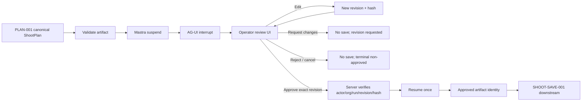
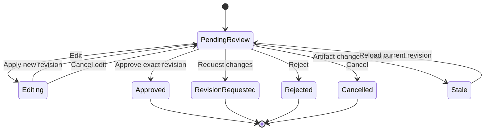
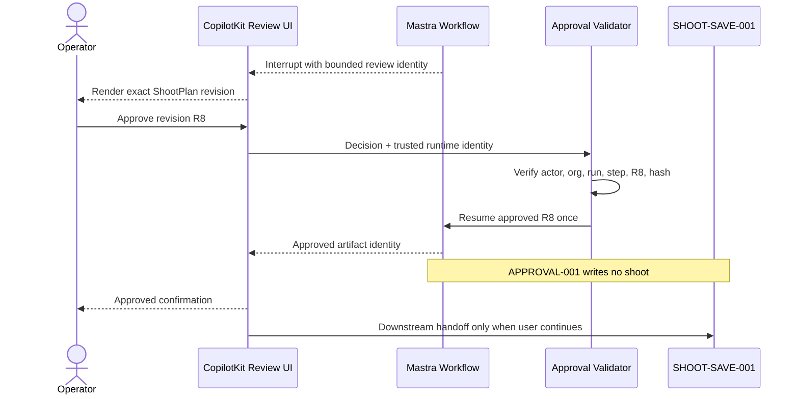
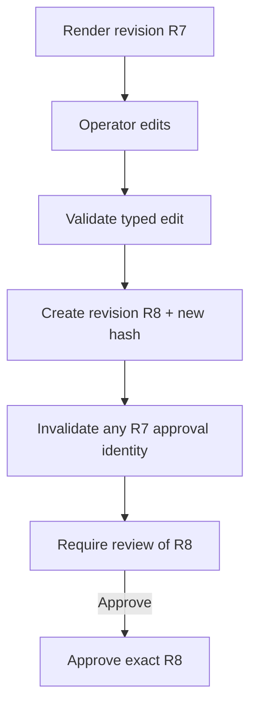
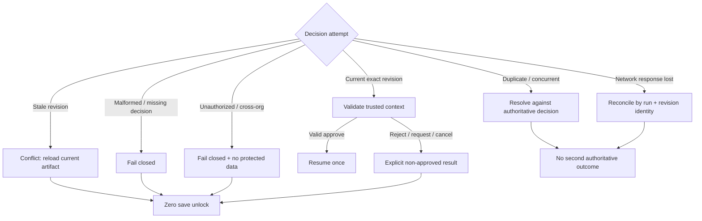
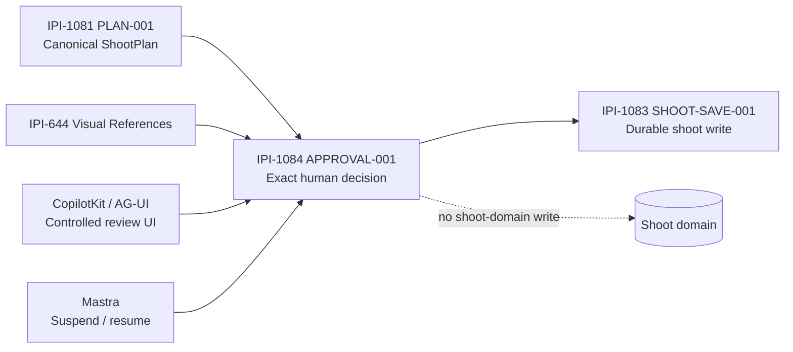
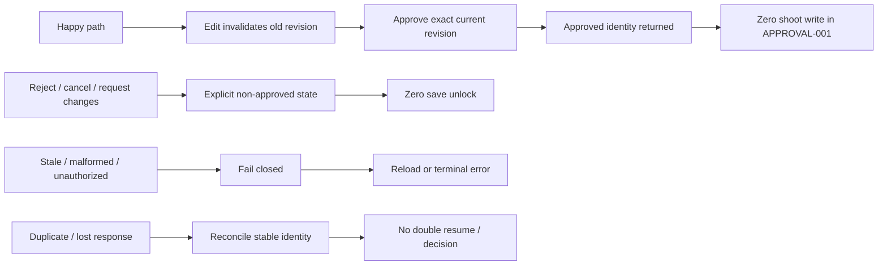

# IPI-1084 · APPROVAL-001 — Mermaid diagrams

> These diagrams describe the same contract as `../wireframes/IPI-1084-approval-001.md`. Current iPix V2 runtime/data ownership wins; Lumina is reference-only.

## End-to-end decision flow

## State machine

## Trust / resume sequence

## Edit invalidation

## Negative / recovery paths

## Ownership boundaries

## Verification map

