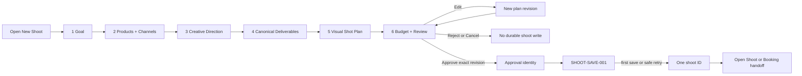
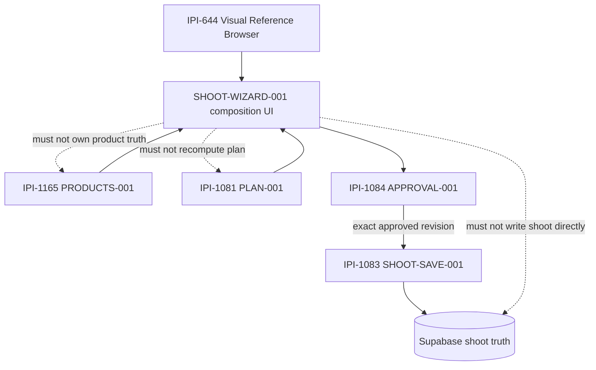
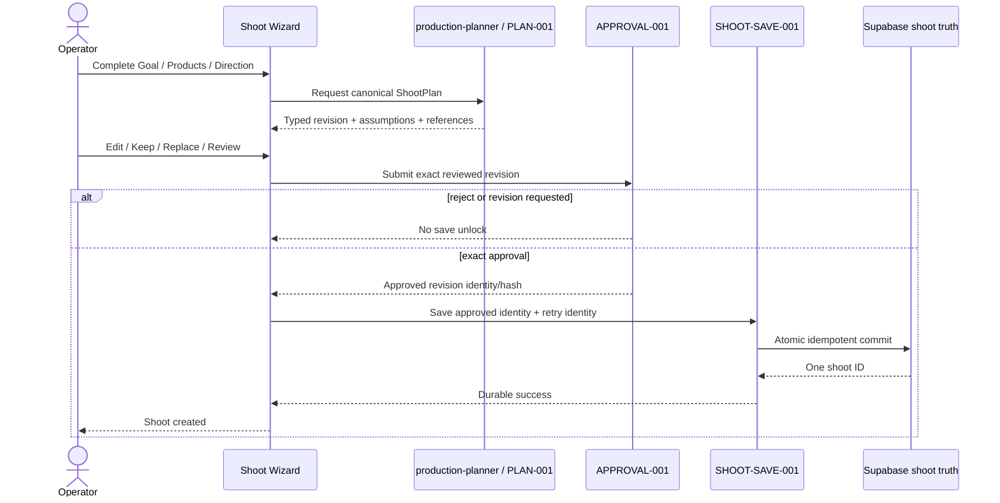
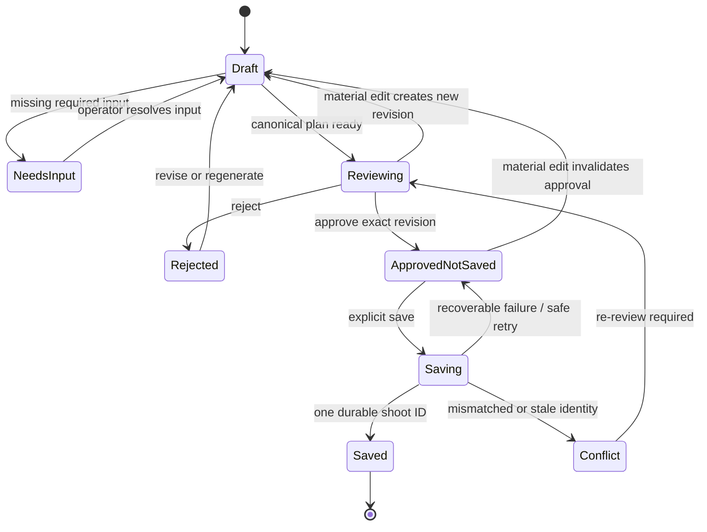
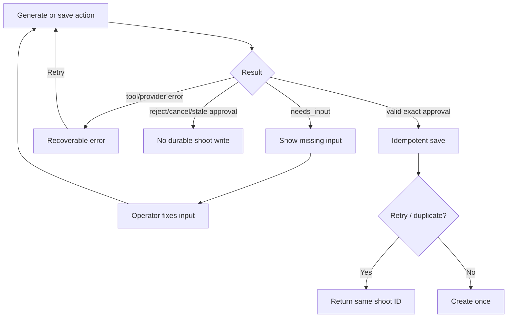
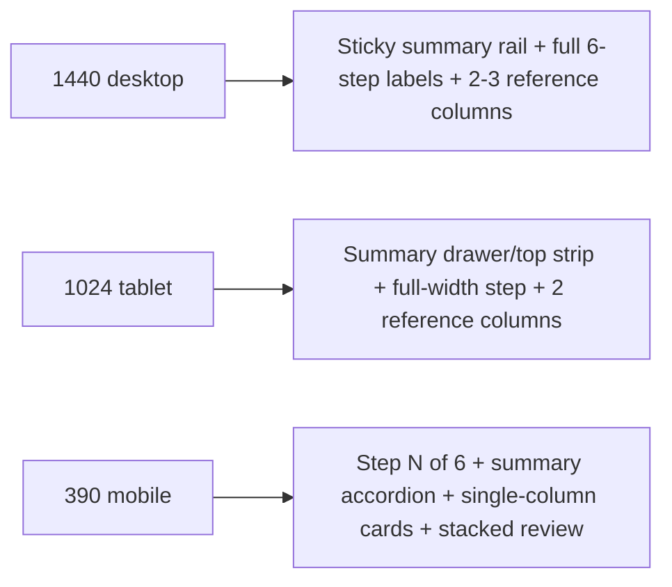
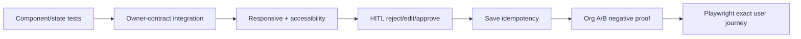

# SCR-06 diagrams — Shoot Wizard

> Current V2 behavior contract for `IPI-1085 · SHOOT-WIZARD-001 — Let Operators Build and Review a Complete Production-Ready Shoot`.
>
> Linear wireframe: https://linear.app/amo100/document/ipi-1085-shoot-wizard-001-implementation-ready-wireframe-1af361bf203c
>
> Visual DC remains reference-only; current iPix route/data/security owners win.

## User journey

## Ownership / dependency map

## AI / approval / save sequence

## Review / save state machine

## Negative / recovery path

## Responsive layout decisions

## Verification path

_Validate Mermaid syntax in the target renderer before merge._
