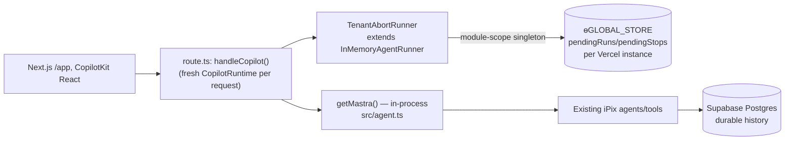
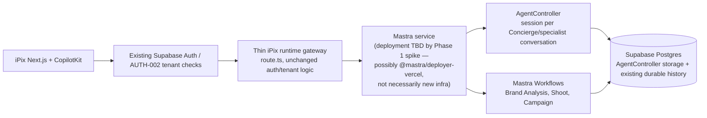

# iPix Agent Platform — PRD

**Status:** Draft for review. No production code changed by this document.
**Date:** 2026-09-20
**Companion docs:** [IPIX-AGENT-PLATFORM-ROADMAP.md](IPIX-AGENT-PLATFORM-ROADMAP.md) · [IPIX-REFERENCE-REUSE-MATRIX.md](IPIX-REFERENCE-REUSE-MATRIX.md) · [IPIX-MIGRATION-PLAN.md](IPIX-MIGRATION-PLAN.md)

## 1. Problem

iPix's CopilotKit runtime keeps live-run state (who's running, can you reconnect, can you stop it) in process memory. Vercel runs many stateless instances with no shared memory between them, so a request that lands on a different instance than the one that started a run cannot see it, stream it, or stop it. This is proven, not assumed — see [PR #238](https://github.com/amoai-tech/ipixai/pull/238) and IPI-1117's live Intelligence-mode experiment.

The team has now spent multiple review passes patching this at the runner-class level (`TenantAbortRunner`, `pendingRuns`/`pendingStops`, per-request runner construction, an Intelligence-mode experiment). Each patch fixed a real, confirmed bug — **git archaeology below proves this, it is not assumed cruft** — but the layer being patched (a process-local `AgentRunner` subclass) cannot structurally solve cross-instance ownership no matter how many times it's patched.

## 2. Current architecture (verified 2026-09-20)



- `src/app/api/copilotkit/[[...slug]]/route.ts` builds `CopilotRuntime` fresh inside `handleCopilot()`, per request (not module scope — see §3 for why).
- Runner: `TenantAbortRunner` (SSE mode) or `IntelligenceAgentRunner` via `CopilotKitIntelligence` (Intelligence mode, gated on `CPK_INTELLIGENCE_API_KEY`).
- Mastra runs fully in-process via `getMastra()` (`src/agent.ts`). No separate Mastra deployment exists today. `@mastra/client-js` is an installed but **unused** dependency (confirmed via repo-wide grep).
- Durable history: Supabase Postgres via `@mastra/pg`, already correct and already ahead of every reference implementation reviewed for replay quality (see [reference matrix](IPIX-REFERENCE-REUSE-MATRIX.md)).

## 3. Why repair-only is becoming expensive — with evidence, not assumption

**Git archaeology (2026-08-24 → 2026-09-15), `src/app/api/copilotkit/[[...slug]]/route.ts` and `src/lib/copilotkit/tenant-abort-runner.ts`:**

| Date | Commit | What changed | Why (verified from the commit's own message) |
|---|---|---|---|
| 2026-08-24 | `3b0cc62` | Bootstrap: `CopilotRuntime` built **once at module scope**, plain `InMemoryAgentRunner`, `identifyUser: () => ({id:"demo-user"})` | Matches CopilotKit's own `examples/integrations/mastra` shape almost exactly — this genuinely was the "simple, proven" starting point |
| 2026-08-29 → 09-01 | `596622f`…`d24aead` | Real Supabase auth required; org/tenant `resourceId` scoping added (AUTH-001, ACCESS-001) | Demo `identifyUser` stub would have let every operator share one thread history — a real multi-tenant defect, not cosmetic |
| 2026-09-01 | `f3e6abb` (STREAM-002) | Stop made to finish cleanly | Confirmed real Stop/save-race bug at the time |
| 2026-09-01 | `098da64` | Brand Intelligence added | Feature work, not runner complexity |
| 2026-09-10–13 | IPI-1191, IPI-1210 | Intelligence credential wiring fixed, then a duration override reverted | Both are real incident fixes (see code comments citing live production symptoms) |
| **2026-09-15** | **`3773ba3` (IPI-1217)** | **`TenantAbortRunner` introduced**, moved out of `route.ts` into its own file | **Fixes a confirmed, reproduced bug**: `CopilotKitCore.connectAgent()` wipes `agent.messages` on every fresh page load and expects the runner's `connect()` to supply a full replay; plain `InMemoryAgentRunner.connect()` only replays its own non-durable, process-local store — so a thread resumed on a process that didn't run the original conversation replayed **zero events**, and the client-side wipe was never refilled. The commit's own verification log shows this RED (assistant message never appears) before the fix, GREEN after, confirmed against real CopilotKit source (`react-core/v2` `hasExplicitThreadId`/`connectAgent` internals) — not a guess. |

**Conclusion, stated plainly:** there is no "simple, pre-complexity" commit that is also correct. The 2026-08-24 bootstrap is architecturally simple but has the exact same-process reconnect bug that was later fixed, plus zero tenant isolation. Every later addition closed a real, reproduced gap. **"Revert to the known-good state" is not a valid strategy** — that state was never actually good once real users and real reload behavior were tested against it. This PRD's Strategy A (§14 in the roadmap/migration plan) is scored accordingly: restore the *simple wiring shape*, never the *pre-fix reconnect behavior*.

The genuine cost driver is different: `route.ts` moved from module-scope to per-request `CopilotRuntime` construction specifically because `resourceId`/`request.signal` (both request-derived) are needed to construct `TenantAbortRunner` safely — a real, necessary coupling, not an accident. The debt is that **the runner class itself still has no shared, cross-instance backing store** — that's the one problem five iterations of patching couldn't fix, because it's not fixable at that layer.

## 4. Goals

- Give `isRunning`/`connect`/`stop` real cross-instance meaning, proven with iPix's own two-OS-process harness (already exists: `tests/copilot-runner-cross-process.test.ts`).
- Reduce the amount of iPix-authored distributed-lifecycle code by adopting proven first-party CopilotKit/Mastra pieces wherever they hold up under verification — not by assumption.
- Preserve every currently-correct, already-better-than-reference piece of iPix's own code (AUTH-002 tenant scoping, durable-replay `connect()` fallback) rather than rebuilding what already works.
- Give iPix a real architectural split between open-ended agents (Concierge/specialists) and predictable business workflows (Brand Analysis, Shoot approval), matching Mastra's own stated design intent.

## 5. Non-goals

- Not a rewrite of Brand/Shoot/CRM domain logic, Supabase schema, or Cloudinary pipelines.
- Not an immediate multi-surface (Slack/mobile) rollout — `agents-everywhere-starter-kit` is a hackathon scaffold (confirmed, see [reference matrix](IPIX-REFERENCE-REUSE-MATRIX.md)), reference only, not a near-term target.
- Not a commitment to any specific hosting choice for a separate Mastra service until Phase 1's spike (roadmap) proves the architecture works at all.
- Not a mandate to delete `TenantAbortRunner` before a replacement has passed the same proof bar it originally had to pass.

## 6. Personas

- **Operator** — brand/production staff using `/app` for Planner chat, Brand Intelligence, Shoot planning, CRM, Campaigns.
- **Org admin** — manages tenant membership; needs tenant isolation to hold under every architecture change (AUTH-002 is non-negotiable, not up for redesign).
- **On-call engineer** — needs observable failure/recovery behavior when a run's owning process dies mid-turn.

## 7. Core user journeys

See [IPIX-MIGRATION-PLAN.md](IPIX-MIGRATION-PLAN.md) §"Required user journeys" for the full, testable versions (Planner, Refresh, Stop, Brand Intelligence, Shoot planning, CRM).

## 8. Agent catalog (target, per Mastra's own agents-vs-workflows guidance — verified real: `mastra-ai/mastra/docs/src/content/en/docs/agents/overview.mdx`)

```text
Concierge            — routes/delegates, open-ended
Brand Expert          — Brand Intelligence conversation
Shoot Planner Expert   — open-ended planning conversation
CRM Expert            — record-aware recommendations
Ecommerce Expert       — PDP/catalog-aware conversation
Campaign Expert        — campaign planning conversation
Research Expert        — general research delegate
```

Only **Concierge** and the domain conversation agents above exist as "agents" (open-ended, `AgentController`-shaped). Everything with a fixed, auditable sequence is a **workflow** (§9) — this split is new; today iPix mixes both under ad hoc tool calls inside single agents.

## 9. Workflow catalog (target)

```text
Brand Analysis pipeline     — research → competitors → visual → evaluate → HITL approval → persist
Shoot creation/approval     — proposal → shot list → operator edit → approval → booking
Campaign creation           — brief → channel plan → content → approval → launch
Asset ingestion             — upload → Cloudinary process → tag → link
Vendor/location onboarding  — intake → verification → approval → persist
```

## 10. Reference repositories (verified, not assumed — see full evidence in the reuse-audit docs and roadmap)

| Repo | Verified state | Use |
|---|---|---|
| `CopilotKit/CopilotKit` — `examples/integrations/mastra` | Real, `runtime@1.72.0`/`@ag-ui/client@0.0.59` — one patch behind iPix's PR #239 branch | Base wiring model |
| `mastra-ai/mastra` — `packages/core/src/agent-controller/` | Real, 28,209★, pushed same day, 40+ dedicated test files, pluggable `threadLock` interface confirmed | Lifecycle/control candidate |
| `mastra-ai/template-agent-harness` | Real, 2★ (low adoption, official org) | Concierge task/approval pattern reference |
| `mastra-ai/template-deep-search` | Real, 6★ | Brand Intelligence research-workflow reference |
| `mastra-ai/template-company-knowledge` | Real, 2★, last pushed July 2026 | Knowledge-layer reference (Neon → must adapt to Supabase pgvector) |
| `mastra-ai/template-browsing-agent` | Real, 43★ (highest of the templates) | Browser research reference — prefer over `template-browser-agent` (3★, likely superseded/duplicate) |
| `CopilotKit/OpenBot` | Real, 5,216★, pushed same day | Governance/audit/permission architecture reference — **not a runner fix**, confirmed its own Stop is process-local |
| `CopilotKit/generative-ui` | Real, 836★, pushed 2026-03 | Generative UI pattern reference |
| `CopilotKit/mastra-pm-canvas` | **Archived**, 53★ — superseded by in-monorepo `examples/canvas/mastra-pm` (which itself runs old `runtime@1.10.3` — reference UX only, not code) | UX reference only |
| `mastra-ai/mastra-auth-examples`, `mastra-ai/mastra-agui-dojo` | **Stale** — both last pushed May 2025 (16+ months). The `supabase` example inside `mastra-auth-examples` is just Supabase's own generic Next.js starter README, not Mastra-specific auth guidance | Do not treat as current reference |

## 11. Reuse strategy

Applied per-component, per the rule this PRD was scoped against: find → verify actual current source → COPY if compatible → ADAPT for iPix auth/storage/domain → MODEL if only the architecture transfers → custom code only for the residual gap. Full per-file breakdown is in [IPIX-REFERENCE-REUSE-MATRIX.md](IPIX-REFERENCE-REUSE-MATRIX.md).

## 12. Proposed architecture



**Explicitly unresolved, by design, until Phase 1:** whether "Mastra service" means a dedicated standalone deployment or Mastra's own `@mastra/deployer-vercel` serverless functions backed by Postgres storage. Firecrawl-verified: `@mastra/deployer-vercel` is real and documented, but Vercel Functions remain ephemeral per-instance — so this only helps if `AgentController`'s state is Postgres-backed, not the default in-memory. This is a Phase 1 spike question, not a decision this PRD makes.

## 13. Data/storage architecture

- Supabase Postgres remains the single durable source of truth for application data (unchanged, per AGENTS.md).
- `AgentController`'s `storage` option, if adopted, must point at `@mastra/pg` (already provisioned), not `LibSQLStore` (the reference example's default) — using SQLite/LibSQL would reintroduce the exact single-instance limitation this whole effort exists to remove.
- pgvector for the knowledge layer stays Supabase, not Neon (the `template-company-knowledge` reference's default) — explicit adaptation, not a new dependency.

## 14. Auth/tenant architecture

Unchanged: AUTH-002 org-scoped `resourceId`, RLS, `requestToken` ALS pattern. Every candidate architecture must thread `resourceId` into whatever replaces the runner layer — `AgentController`'s `session(resourceId, scope)` shape (confirmed in `@mastra/client-js`) maps directly onto iPix's existing `resourceId` concept, which is a genuine point in its favor, not an assumption.

## 15. Runtime lifecycle

`run` / `connect` / `isRunning` / `stop` stay the four operations that must work cross-instance — this contract doesn't change even if the implementation underneath does. See IPI-1117's own P0-1/P0-2/P0-3 definitions and the roadmap's Phase 1.

## 16. Reconnect/cancel requirements

Unchanged from IPI-1117 and IPI-1292: real two-OS-process proof required, not single-process or simulated. See [IPIX-MIGRATION-PLAN.md](IPIX-MIGRATION-PLAN.md) §"Testing requirements."

## 17. Observability

New requirement surfaced by this pass, not previously scoped: Mastra's own `mastra-ai/mastra-smoke` repo (0★, pushed 2026-09-18) exists specifically for version/upgrade smoke testing — worth studying its shape for iPix's own upgrade-safety checks, low priority.

## 18. Failure/recovery

Two concrete, verified risks to design against, not hypothetical:
- **Mastra issue [#23707](https://github.com/mastra-ai/mastra/issues/23707)** (open, filed 2026-09-12): a background task/subagent finishing while its `AgentController` Session is idle does not wake the Session until the next user message. Directly relevant to Brand Analysis's long-running research pattern.
- **Mastra issue [#23116](https://github.com/mastra-ai/mastra/issues/23116)** (closed as fixed 2026-09-17, via several follow-up PRs): durable tool-approval resume could broadcast the same final answer twice. Relevant to iPix's HITL approval flow — confirmed fixed, but recent enough (3 days before this pass) to warrant a dedicated regression test before relying on it.

## 19. Security

No change to iPix's threat model. Any new Mastra deployment surface (Phase 1+) needs the same secrets handling as `AGENTS.md § Secrets / Infisical` — do not duplicate that policy here.

## 20. Migration strategy

See [IPIX-MIGRATION-PLAN.md](IPIX-MIGRATION-PLAN.md).

## 21. Acceptance criteria

See [IPIX-MIGRATION-PLAN.md](IPIX-MIGRATION-PLAN.md) §"Production success criteria."

## 22. Rollback

`TenantAbortRunner` is not deleted until its replacement has passed the identical P0-1/P0-2/P0-3 bar plus full regression (typecheck, Vitest, build, Preview real-LLM journey) — see roadmap Phase 9.

## 23. Risks

- Candidate 0 (`AgentController`) is Mastra's own dogfooded tool for their internal coding-agent product ("Mastra Code," confirmed via their blog) — vendor asserts broader applicability, but iPix would be an early non-coding-agent adopter. Budget spike time for genuine surprises, not just wiring.
- Every template repo cited (`template-agent-harness`, `template-deep-search`, `template-company-knowledge`, `template-browsing-agent`) has low external star counts (2–43) — official but thin adoption signal. Treat as "official reference," not "battle-tested."
- Two named repos are confirmed stale (`mastra-auth-examples`, `mastra-agui-dojo`, both 16+ months old) — do not let them anchor the auth or AG-UI protocol sections of implementation.

## 24. Open questions

1. Standalone Mastra deployment vs. `@mastra/deployer-vercel` — resolved by Phase 1 spike, not this PRD.
2. Does `AgentController`'s coding-agent-flavored vocabulary (`modes`, `Workspace`, `submit_plan`) fit a single-mode wrapping of iPix's existing Planner agent cleanly, or does it need real adaptation work? Spike question.
3. Timeline/ownership for standing up a new Mastra deployment, if Phase 1 concludes one is needed — an infra decision beyond this PRD's scope, needs explicit sign-off before Phase 2.
