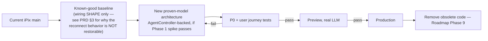

# iPix Agent Platform — Migration Plan

**Status:** Draft. No production code changed by this document.
**Date:** 2026-09-20
**Companion:** [IPIX-AGENT-PLATFORM-PRD.md](IPIX-AGENT-PLATFORM-PRD.md) · [IPIX-AGENT-PLATFORM-ROADMAP.md](IPIX-AGENT-PLATFORM-ROADMAP.md) · [IPIX-REFERENCE-REUSE-MATRIX.md](IPIX-REFERENCE-REUSE-MATRIX.md)

## Migration strategy



`main` is never force-reverted. A clean worktree reconstructs the baseline shape, adds the proven architecture, and only production traffic migrates once every journey below passes — matching the process already committed to in [IPI-1292](https://linear.app/amo100/issue/IPI-1292).

## Required user journeys

### Planner
```text
open /app → ask Concierge → delegate if needed → stream response → tool executes → final result
```

### Refresh
```text
start run → refresh → new runtime instance → reconnect → continue receiving output
```

### Stop
```text
start long run → Stop from another runtime → original execution terminates → immediately start new run
```

### Brand Intelligence
```text
brand URL → research → competitors → evaluate gaps → clarify if necessary → operator approval → persist Brand DNA
```

### Shoot planning
```text
choose shoot type → agent proposes direction → references → shot list → operator edits → approval → booking
```

### CRM
```text
open company/deal → agent understands record context → recommends action → operator approves → persisted activity
```

## Testing requirements

**Before selecting an architecture (already tracked in IPI-1292):**
```text
P0-1  Runtime B sees Runtime A's running run
P0-2  Runtime B receives a NEW live event from A's run
P0-3  Runtime B stops A's run, A actually terminates
```

**After a candidate passes P0, before production migration:**
```text
cross-tenant denial               — Org B cannot see/connect/stop Org A's run (AUTH-002 adversarial proof)
stale Stop cannot kill new run    — fencing
owner restart/recovery            — owning process dies mid-run, no phantom "active" state left behind
browser refresh / history replay  — matches iPix's already-correct durable-replay behavior, must not regress
normal tool execution
Brand Analysis (full journey)
HITL (approval, resume, no duplicate answer — regression-tests Mastra issue #23116)
Planner (full journey)
multi-agent delegation            — once Concierge exists (Roadmap Phase 3+)
```

**Commands, in order:**
```text
npm run typecheck
npm test              (full Vitest)
npm run build
tests/copilot-runner-cross-process.test.ts   (or its post-migration equivalent)
Playwright (e2e/*.spec.ts)
Preview — real-agent journey, real LLM calls, not mocked
```

## Final decision table

| Strategy | Proven-code reuse | Custom code | P0 likelihood | Migration risk | Long-term fit | Score /100 |
|---|---:|---:|---:|---:|---:|---:|
| **Repair current runner** (patch `TenantAbortRunner` further) | Low — no example anywhere solves cross-instance `stop` (exhaustively checked: AgentCoreRunner, SqliteAgentRunner, IntelligenceAgentRunner, OpenBot's own Stop) | High — every remaining gap is iPix-authored | Low — same structural ceiling as today | Low (no architecture change) | Poor — provably cannot solve the actual requirement at this layer | **30/100** |
| **Restore simple integration** (revert to 2026-08-24 bootstrap shape) | Medium — matches CopilotKit's own reference shape | Low, initially | **Zero** — the pre-`TenantAbortRunner` state is confirmed broken for same-process reconnect, let alone cross-instance | **High** — reopens IPI-1217/IPI-1088-class regressions, confirmed via git archaeology | Poor — doesn't address the actual problem, reintroduces a fixed one | **20/100** |
| **Mastra AgentController service** | High — first-party, already-installed, heavily tested (40+ files), pluggable lock interface confirmed | Medium — real adapter code, but far less than a from-scratch distributed runner | **Unproven, most promising** — real architectural reasons to expect success, no cross-process proof yet (Phase 1 spike pending) | Medium — new deployment surface, but `@mastra/deployer-vercel` confirmed real (no new infra class required) | Strong — matches Mastra's own stated design intent and iPix's existing dependency investment | **75/100 (provisional — pending Phase 1 spike result)** |
| **Custom shared runner** (Supabase registry + Realtime relay) | Low-medium — schema pattern borrowed from `SqliteAgentRunner`, but the hard part (abort-signal delivery) has zero precedent anywhere | High | Medium — buildable, but genuinely novel engineering, no reference implementation to lean on | Low (no new deployment target) | Moderate — works, but iPix owns 100% of the distributed-systems risk going forward | **55/100 — real fallback, not first choice** |

### Decision

```text
RECOMMENDED:    Mastra AgentController service (pending Phase 1 spike proof)
SECOND CHOICE:  Custom shared runner (Supabase-backed) — if Phase 1 spike fails
FALLBACK:       CopilotKit Intelligence mode for the ownership/ isRunning half only —
                already confirmed insufficient for Stop alone (PR #238), never a
                complete solution by itself
DO NOT CONTINUE: Repairing TenantAbortRunner further, or reverting to the 2026-08-24
                baseline — both scored and evidenced above as dead ends
```

This ranking is **not** based on elegance or repo star counts. It's based on: (1) working source actually read this session, not assumed from a README; (2) the only P0 evidence that exists today (Intelligence mode partially live-tested, everything else confirmed absent); (3) how much of the remaining gap is iPix-authored vs. reused; (4) migration safety, concretely — git archaeology proved the "simple restore" option would reopen fixed bugs; (5) existing iPix compatibility — AUTH-002, durable Mastra history, and the P0 test harness are all already better than or equal to anything found in the wider ecosystem and are preserved in every scored strategy above; (6) production reliability, matching AGENTS.md's Done rule: no strategy above is marked Done or produciton-ready without the post-merge proof in the Roadmap.

## Executive summary

**Should iPix keep repairing the current architecture, restore the simpler working architecture, or move to a dedicated Mastra/AgentController architecture built from proven CopilotKit + Mastra reference implementations?**

Move toward the Mastra AgentController architecture — but as a proven spike first, not a committed rewrite yet. Two pieces of hard evidence settle the other two options: git archaeology proves the "simpler working architecture" was never actually correct (it had a confirmed, since-fixed reconnect bug, verified from the fixing commit's own reproduction log) — restoring it would be a regression, not a fix. And this session's exhaustive check of the wider CopilotKit/Mastra ecosystem — AgentCoreRunner, SqliteAgentRunner, IntelligenceAgentRunner, and the most heavily-adopted real production app found (CopilotKit/OpenBot, 5,216★) — found that continuing to repair `TenantAbortRunner` cannot work: none of them, including iPix's own runner, have ever made remote Stop reach a live process on another instance, because that's a property of *where the process lives*, not how the runner class is written.

Mastra's own `AgentController`, already installed and unusually well-tested (40+ dedicated test files, a pluggable distributed-lock interface built in), is the first real candidate with architectural reasons to expect success rather than just hope. It is not proven yet — nothing in this investigation, including Mastra's own test suite, has run it across two real processes. [IPI-1292](https://linear.app/amo100/issue/IPI-1292) already commits to testing it first, with the custom Supabase runner as the funded fallback if it fails. That spike, not this document, is what actually answers the question.
