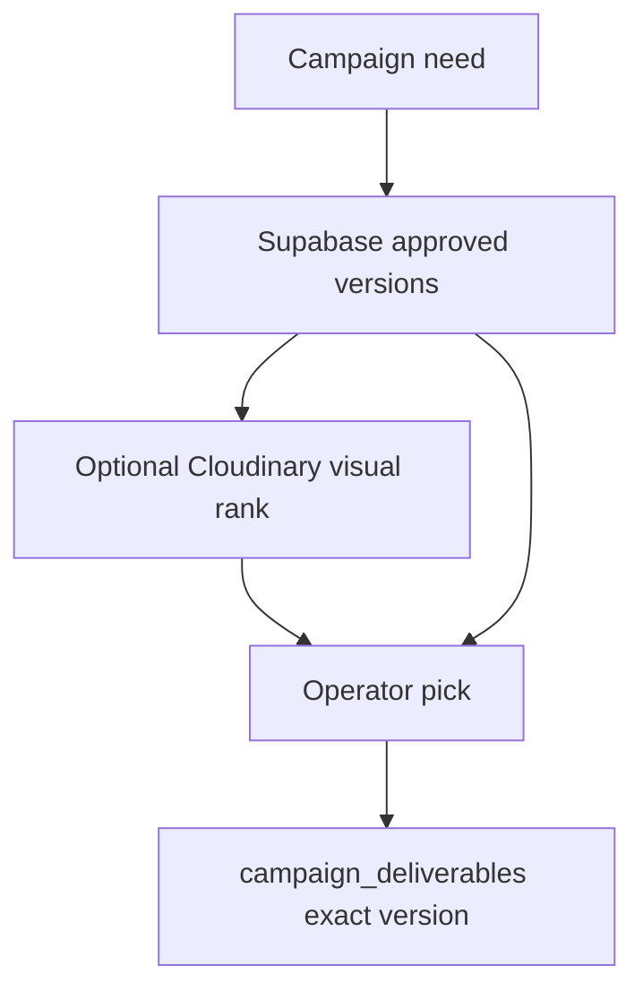

# Cloudinary Advanced PRD — only features with operator value

Parent: [cloudinary-prd.md](./cloudinary-prd.md). Do not mint Linear tickets until **IPI-1120 · MEDIA-DELIVERY-001** is proven and a duplicate search is clean.

**Plan gates (hub §25):** Visual / Natural Language Search is Assets **Enterprise**. Media Library Widget is Assets/Enterprise with **seat** implications. Analyze API is **Public Beta** + add-ons. Structured metadata: limited on Free; **100 fields** per product environment. Do not hide these in Core/MVP ACs.

---

## 1. Executive Summary

After the season rack works, the expensive problem is **reuse**: “Did we already shoot a navy tailored jacket on brand for TikTok?” Advanced adds **structured metadata**, optional **visual/semantic search**, a single `findAssets` tool, video, and native AI add-ons — each behind a cost/HITL gate.

**Solution:** keep Supabase as the library SoT. Use Cloudinary Admin/Search, structured metadata, Analyze, and official agent **patterns** as accelerators — never as a second DAM.

---

## 2. Problem Statement

Producers reshoot because search is filename-only. Campaign OS essays in `docs/archive/cloudinary/` over-promised MediaFlows and launch agents. Those are optional after Brand Core + approved media.

---

## 3. Goals

Reuse before reshoot. Channel packs. Video selects. Optional fashion attributes from `cld_fashion`. One media tool, not an agent farm.

---

## 4. Non-goals

- Replacing Postgres filters with Cloudinary Search
- Autopublish to Postiz
- Custom visual-search index
- Generative on the live approval path without HITL
- n8n **and** MediaFlows for the same job
- Second orchestration framework besides Mastra

---

## 5. Target Users

Campaign producer, DAM-savvy producer, video editor, brand strategist.

---

## 6. User Outcomes

Find last season’s approved hero; generate IG 4:5 from approved master with named transform; attach a clip; ask Copilot “what do we already have?” and get **org-scoped** hits with evidence.

---

## 7. Current State

Live unused named transforms (`t_Banner 9:16`, `t_Banner 16:9`, `t_Thumbnail`) exist but **used=false**. `asset_variants` 0 rows. No `next-cloudinary` video. Analyze API documented as **Beta** / add-on. Product-launch-agent repos **not archived** (updated 2026-08-23) — **patterns only**.

---

## 8. Source-of-Truth Ownership

Unchanged. Cloudinary structured metadata = **media attributes**. Org/approval/campaign membership = Supabase. Search: query **approved IDs from Postgres**, optionally rank with Cloudinary visual search.

---

## 9. Routes / Directory Structure

```text
src/lib/cloudinary/admin-search.ts     # ops/reconcile/advanced find
src/mastra/tools/find-assets.ts
src/components/media/cld-video-player.tsx
```

Media Library Widget: official React example only — **CLD-MLW-001** later.

---

## 10. Core Features (evaluate)

| Feature | User value | Native | Class | Phase | Verdict |
| --- | --- | --- | --- | --- | --- |
| Structured metadata | season, garment role | Cloudinary SMD | CONFIGURE | after library | **yes if** org stays in Postgres |
| Visual/semantic search | similar stills | visual search | CONFIGURE | **Enterprise** | **only if** plan paid — else DEFER |
| `findAssets` | reuse | Postgres + optional Cld | BUILD thin | after 1120 + Brand | **yes** MEDIA-AGENT-001 |
| Campaign reuse | pick approved | campaign tables | ADAPT | after 1120 | **yes** product; not new DAM |
| Media Library Widget | pick existing Cld asset | ML widget | COPY+CLEAN | Enterprise + seats | **maybe** after MVP; must not bypass webhook |
| Video | motion selects | `CldVideoPlayer` | CONFIGURE | after 1069+1112 | **yes** CLD-VIDEO-001 |
| AI moderation/tagging | less manual | add-ons | CONFIGURE | optional | **not** critical path |
| Analyze API | fashion attrs | Analyze **Beta** | optional | add-on | **DEFER** unless fallback |
| Product-launch-agent | campaign kit | official example | ADAPT patterns | after findAssets | **HITL only** |
| Generative transforms | fill/replace/remove | URL API | CONFIGURE | Advanced | HITL; never auto-approve |
| MediaFlows | approve→tag | native | CONFIGURE | named workflow | **or** n8n, not both |
| Smart collections | Console | DAM | CONFIGURE | ops | Console, not app |
| Export/manifests | Postiz/ecom pack | named URLs | BUILD manifest | after 1120 | JSON of approved URLs |
| Bulk | N events | Admin | BUILD | after 1119 | N audit rows |
| Advanced intelligence | DNA 2.0 | Gemini + optional Cld | ADAPT | after DNA MVP | multimodal only when native insufficient |

---

## 11. AI Features

| Capability | Status | GA/Beta | Cost | iPix use | MVP? |
| --- | --- | --- | --- | --- | --- |
| Upload tagging add-ons | add-on | paid tiers | add-on | optional keywords | no |
| AI Vision general/tagging/moderation | add-on | add-on (was Beta historically) | credits | DNA questions | no |
| Analyze `cld_fashion` | Analyze API | add-on Content Analysis | add-on | garment attributes | no |
| Quality analysis | mixed | check account | — | QA enrich | no |
| OCR | add-on | add-on | labels | no |
| Face / g_auto | core transforms | GA | transform | crop | already in named |
| Object-aware crop | Content Analysis | add-on | gravity | optional |
| Background removal | add-on / gen | add-on | ecom | HITL |
| Visual search | plan | often Enterprise | plan | find similar | no |
| Generative fill/replace/remove/restore/recolor | URL | plan/add-on | transform | HITL |
| Product photography | examples | — | — | FashionistaAI pattern | no |

**Fallback:** if add-on missing, QA + human + Gemini Brand DNA only.

---

## 12. Use Cases

Campaign producer asks “what navy jacket did we already approve?” Video editor attaches a clip. Ops exports a Postiz manifest of approved named URLs.

## 13. Real-World Fashion Examples

See campaign reuse + channel derivative below. Generative fill of a hem is a **new version** — new QA/DNA/approval.

## 14. User Stories

- As a campaign producer, I want org-scoped `findAssets` so I do not reshoot. **AC:** Postgres approved set first; Cloudinary visual rank optional; Org B empty.
- As a producer, I want IG 4:5 from an approved master. **AC:** named transform is **eager** on that version; HITL before Postiz.

## 15. User Journey

```text
Approved library → filter in Supabase → optional visual rank → pick exact version → channel eager → human publish
```

## 16. Workflows

**Campaign reuse (Advanced):**

```text
campaign requirement
→ Supabase approved assets for tenant/brand
→ metadata match
→ optional visual rank
→ operator chooses
→ campaign links exact version
```

**Channel derivative:** IG 4:5 / TikTok 9:16 / Meta / PDP — **named transforms** (promote unused `t_Banner *` only after product names them). Preview → human publish approval → Postiz (campaign epic).

**findAssets:** input `{ query, brandId, approvedOnly: true }` → output `{ assetId, version, score, why }` → CopilotKit list → operator opens Asset Detail. **No write.**

---

## 17. Mermaid — campaign reuse



---

## 18. Website Pages

Still public `CldImage` only. Advanced DAM never on marketing.

## 19. Dashboard Pages

Assets: similarity grid. Campaign: reuse picker. Channel Preview: eager named packs.

## 20. Three-Panel Layout

| Region | Assets (Advanced) |
| --- | --- |
| Left | season, role, SMD + Postgres filters |
| Main | similarity / video |
| Right | already-shot suggestions — not the picker |

## 21. Wizards

Bulk approve is **dangerous**. If built: N HITL confirmations, N `asset_events`.

Assets left: season/role filters (SMD + Postgres). Main: similarity grid. Right: “already shot” suggestions. Wizards: bulk approve is **dangerous** — if built, N HITL confirmations.

---

## 22. Chat / CopilotKit

Add `findAssets` and `suggestChannelTransforms` (read named transform list; do not invent URLs). `findReusableAssets` = alias of `findAssets` with `approvedOnly`.

Launch agent: adapt [product-launch-agent-single-tool](https://github.com/cloudinary-devs/product-launch-agent-single-tool) **find_launch_assets** idea — **must** filter by iPix org. Full [product-launch-agent](https://github.com/cloudinary-devs/product-launch-agent) after Brand Core. HITL on any publish.

---

## 23. Cloudinary capabilities

Media Library Widget, video player, Search API, SMD MCP, MediaFlows MCP, FashionistaAI **eager + poll** (not sync GenAI in request). Event Gallery **UX only**.

---

## 24. Mastra

Still **one** media capability. Do not add a second framework. Workflow only for async Analyze poll.

---

## 25. Data Model

SMD fields on Cloudinary; copy **denormalized display** fields to `assets` only if list UX needs them. Do not store embeddings in Postgres unless product proves pgvector — default **no**.

---

## 26. Security

Visual search must not return Org B. Generative output = **new version** → new QA/DNA/approval. ML widget unsigned pick forbidden.

---

## 27. Failure / Recovery

Analyze 429 → skip enrichment. Visual search down → Postgres filters only. Generative fail → keep master.

---

## 28. Integrations

Postiz consumes **manifest of approved named URLs**. PostHog = product events. Cloudinary analytics = delivery/bandwidth — do not duplicate social metrics.

---

## 29. Technical Reference Pack

| Repo | Active | Solves | iPix | Reuse | Do not build | Phase |
| --- | --- | --- | --- | --- | --- | --- |
| [structured-metadata-mcp](https://github.com/cloudinary/structured-metadata-mcp) | yes 2026-04 | SMD | CLD-META | CONFIGURE | custom meta DB | later |
| [asset-management-js](https://github.com/cloudinary/asset-management-js) | yes 2026-08 | list/search | reconcile / ops | Search-as-DB | later |
| [api-schemas](https://github.com/cloudinary/api-schemas) | yes 2026-08 | contracts | types | handmade OpenAPI | later |
| [mcp-servers](https://github.com/cloudinary/mcp-servers) | yes 2026-07 | env/assets | inspect | custom admin UI | now read-only |
| [cloudinary-cli](https://github.com/cloudinary/cloudinary-cli) | yes 2026-08 | CLI | named transforms | custom scripts | now |
| [cloudinary-devs/skills](https://github.com/cloudinary-devs/skills) | yes 2026-08 | agent skills | 1108 | vendored 652k docs | now |
| product-launch-agent* | yes 2026-08 | agent example | patterns | copy whole agent | later |
| [analyze_api_reference](https://cloudinary.com/documentation/analyze_api_reference) | docs | fashion model | optional DNA | Core path | later |
| [cloudinary_ai_vision_addon](https://cloudinary.com/documentation/cloudinary_ai_vision_addon) | add-on | prompts | optional | Core | later |

Do not add `cloudinary_js` / `cloudinary-react` to `package.json`.

---

## 30. Implementation Notes

Faster: Console SMD + named channel transforms **before** app search UI. COPY+CLEAN Event Gallery UX only.

---

## 31. Testing

Org isolation on search. Generative version ≠ inherited approval. Video auth same as images.

---

## 32. Success Metrics

% campaigns using existing approved assets; reshoot reduction; add-on spend vs reshoot cost.

---

## 33. Risks

Beta Analyze on critical path; Enterprise visual search assumed; double automation (MediaFlows + n8n).

---

## 34. Pricing

Classify: Free/Core-safe vs Paid MVP-acceptable vs Optional add-on vs Advanced vs Experimental/Beta. **Do not invent prices.** Visual search / AI search often plan-gated. Add-on free tiers are **eval**, not production volume ([pricing](https://cloudinary.com/pricing)).

---

## 35. Acceptance Criteria (when a later ticket exists)

- [ ] Supabase remains library SoT
- [ ] findAssets org-scoped, read-only
- [ ] Add-on missing → graceful fallback
- [ ] No new Linear mint until 1120 + dup search

---

## 36. Production Readiness

Advanced features must not change production notification URI.

---

## 37. Linear Task Mapping

Tracker **Add later** rows are correct: **CLD-SEARCH-001**, **CLD-META-001**, **MEDIA-AGENT-001**, **MEDIA-LAUNCH-AGENT-001**, **CLD-VIDEO-001**, **CLD-MLW-001**, **CLD-MEDIAFLOWS-001**, **CLD-AI-*** . **Do not mint now.**

---

## 38. Missing Tasks

None now. After 1120, mint at most **MEDIA-AGENT-001** if Brand Core is Done.

---

## 39. Deferred Features

Everything in §10 marked DEFER. R2 backup is Production-ready exit, not Advanced UX.

---

## 40. Scores /100

| Axis | Score |
| --- | --- |
| Product design | 84 |
| Cloudinary architecture | 88 |
| Security | 80 |
| Data ownership | 90 |
| AI design | 82 |
| Reuse efficiency | 86 |
| Cost efficiency | 75 |
| Testing | 60 |
| Production readiness | 50 |
| Overall | 78 |

**Correctness confidence: 74/100.** Docs + GitHub activity verified; account add-on entitlements **UNVERIFIED**.
