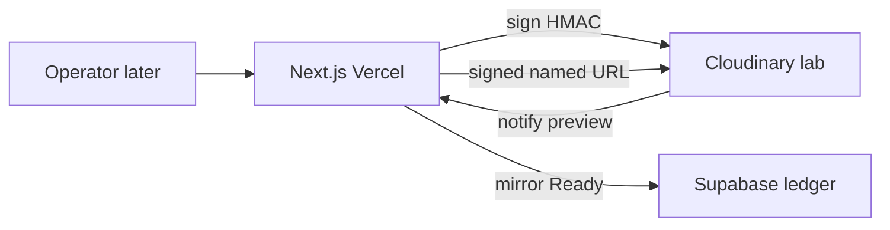
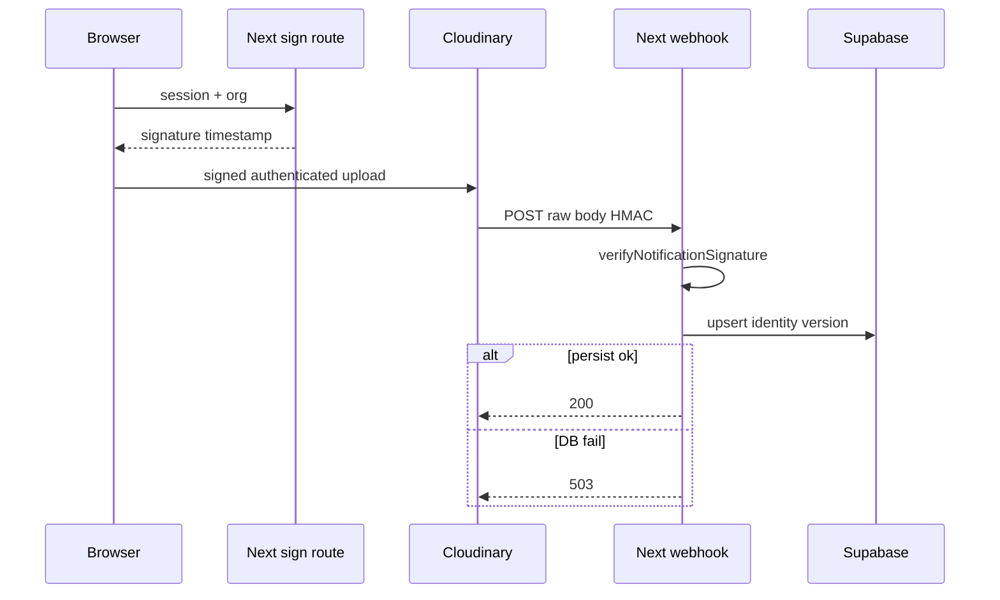
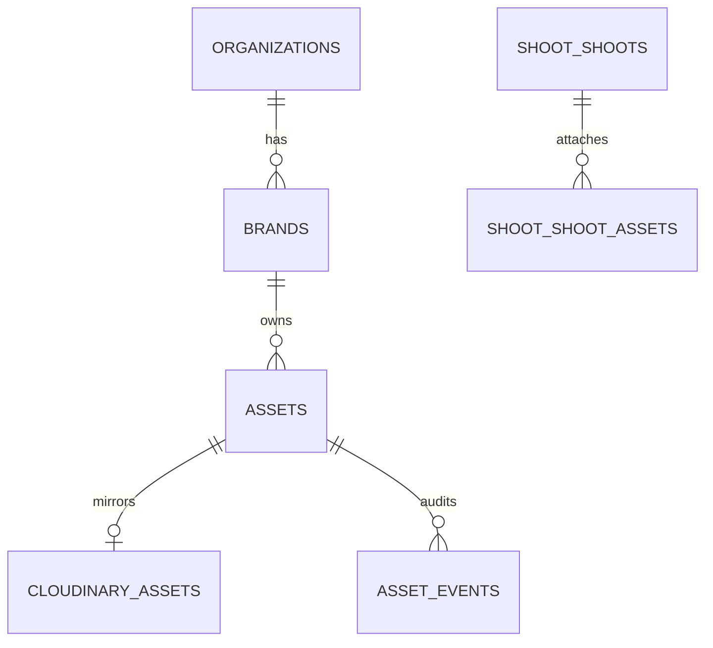

# Cloudinary Core PRD — smallest secure media foundation

Think of Cloudinary as the **photo lab**: it keeps the negatives, named prints, and courier. Supabase is the **studio ledger**. Next.js on Vercel is the **front desk** that signs for packages. This document is only the lab plumbing — not QA, Brand DNA, or a media agent.

Parent research: [cloudinary-prd.md](./cloudinary-prd.md). **Host:** Vercel / Next.js App Router (`next@16.1.2`). Cloudflare Workers are **not** the CopilotKit/Mastra host.

**Authenticated DAM rule:** Cloudinary cannot create **on-the-fly** derivatives for `type=authenticated`. Core previews must be **eager (or explicit) derived assets + signed URL** — not `CldImage` and not a signed URL of a transform that was never generated. Official: [control access to media](https://cloudinary.com/documentation/control_access_to_media).

**Execution order:** pipe → widget → cutover. Cutover is **not** Core.

---

## 1. Executive Summary

iPix V2 has org-safe **tables** for media and a live Cloudinary product environment, but this repo has **no** `cloudinary` / `next-cloudinary` packages, no sign route, and no Vercel webhook. Production notifications still hit [`https://www.ipix.co/api/assets/cloudinary/webhook`](https://www.ipix.co). Operators cannot prove a tenant-safe upload in the new app.

**Proposed solution:** install official SDKs, document the env contract, render **public** marketing imagery with `CldImage`, and build the **signed upload + HMAC webhook + authenticated preview** pipe against existing `assets` / `cloudinary_assets` / `asset_events` — without retargeting production triggers.

**Success:**

- Packages and secrets stay on the correct side of the browser.
- One disposable signed upload reaches Supabase **Ready** on preview.
- Org A cannot read Org B’s mirrored rows.
- Production `www.ipix.co` triggers unchanged.

---

## 2. Problem Statement

The old lab still receives Cloudinary mail. The new studio has a ledger (`assets` 55 rows, `cloudinary_assets` 27, `asset_events` 15 on hosted `fashionos`, 2026-09-02 read-only) and no V2 front desk. Brand “reuse before shoot” and campaign crops stay demos until identity, signing, and the webhook contract exist.

---

## 3. Goals

1. Prove Cloudinary tooling against the **existing** product environment (cloud public name `dzqy2ixl0` — reuse; do not mint a second cloud).
2. Install `cloudinary` + `next-cloudinary` only if missing (they are missing today — **[VERIFIED]** `package.json`).
3. Public/provider-safe image rendering for M2 screens.
4. Server-only signing using `api_sign_request`.
5. Preview webhook: raw body → `verifyNotificationSignature` → persist → **200**; DB fail **503**.
6. Authenticated DAM previews via **eager derived + server-signed URL**, not `CldImage` and not on-the-fly named transforms.
7. Reuse existing tables; no second DAM.
8. Document Free-plan ceilings (10 MB image, Admin ~500/hour) so E2E does not surprise fashion originals.

---

## 4. Non-goals

- Upload Widget UI (**IPI-1116 · CLD-UPLOAD-001**).
- Brand DNA / QA / human approval product UI.
- Visual search, Media Library Widget, video player, MediaFlows.
- Analyze API / AI Vision / auto-tagging on the Core path.
- EdDSA `X-Cld-Signature_v2` as the Core verifier (observe header; HMAC via SDK).
- Production notification cutover (**IPI-1115 · CLD-CUTOVER-001**).
- `create-cloudinary-next` over this repo.
- Cloudinary Search as the business library database.
- Mutating production Supabase or production Cloudinary triggers.

---

## 5. Target Users

| Persona | Core job |
| --- | --- |
| Operator (later UI) | Needs a lab that will accept signed selects |
| Approver | Needs exact `asset_id` + `version` on the ledger |
| Platform engineer | Needs HMAC, 503 retry, secret isolation |
| Marketing site | Public `CldImage` only |

---

## 6. User Outcomes

| Outcome | Core proof |
| --- | --- |
| Signed-in Org A can cause a disposable authenticated upload (API or widget-less E2E) | **IPI-1113 · CLD-E2E-001** |
| Preview URL never ships `CLOUDINARY_API_SECRET` | grep + build |
| Org B cannot fetch Org A’s signed preview | **IPI-1112 · CLD-DELIVERY-001** |
| Production photographers keep using `www.ipix.co` | MCP `list-triggers` unchanged |

---

## 7. Current State

| Claim | Evidence 2026-09-02 | Label |
| --- | --- | --- |
| Vercel + App Router | `package.json` `next@16.1.2` | **VERIFIED** |
| Cloudinary packages | **not** on `origin/main`; [PR #40](https://github.com/amoai-tech/ipixai/pull/40) has `cloudinary@2.11.0` + `next-cloudinary@6.18.8` + `server-only` | **STALE if you only look at main** |
| `.env.example` Cloudinary names | Present on this docs branch / PR #40 (`CLOUDINARY_*` + `NEXT_PUBLIC_CLOUDINARY_CLOUD_NAME`) | **VERIFIED** |
| Auth foundation Done | Linear **IPI-1037 / 1046** | **VERIFIED** |
| Hosted tables exist | Supabase `fashionos` read-only: `public.assets`, `cloudinary_assets`, `asset_events`, `asset_variants`, `asset_links`; `shoot.shoot_assets` (0 rows) | **VERIFIED** |
| Dual shoot namespaces | `public.shoots` (8) and `shoot.shoots` (4) | **VERIFIED** — **IPI-1122** |
| Upload preset `ipix-signed-upload` | signed, `type=authenticated`, eager thumbs, `notification_url` → `www.ipix.co` | **VERIFIED** MCP |
| Named transforms | `t_asset-review`, `t_asset-masonry`, `t_asset-detail` **used** | **VERIFIED** MCP — **1112 must eager them** |
| Free plan ceilings | Hub §2.2: 10 MB image / 100 MB video / 25 credits; Admin hourly 500 on public Free table | **VERIFIED in hub** — recheck Console on **1108** |
| Production triggers | upload + delete → `www.ipix.co`, `auth_scheme=legacy_hmac`, `additive=true`; moderation + summary `default` | **VERIFIED** MCP |
| This repo webhook | none | **VERIFIED** (no route) |
| IPI-1108 | Linear **Done**; GitHub **not** on `main` — see [audit-2026-09-02.md](./audit-2026-09-02.md) | **FAKE-DONE RISK** |
| IPI-1110 / 1111 / 1112 | Linear **Todo** | **VERIFIED** |

---

## 8. Source-of-Truth Ownership

| System | Owns | Must not own |
| --- | --- | --- |
| Cloudinary | Bytes, `asset_id`, `public_id`, `version`, transforms, CDN, widget transport | Org membership, approval, library search SoT |
| Supabase + RLS | Org/brand/shoot, business status, audit, campaign links | Pixels |
| Next.js / Vercel | Sign route, webhook Route Handler, signed DAM URLs | Custom uploader; Worker signer |
| CopilotKit / Mastra | Out of Core | Media writes |

**Cloudinary access control ≠ iPix authorization.** Authenticated delivery only proves “this URL was signed.” Org membership is JWT + RLS.

---

## 9. Routes / Directory Structure

Proposed (do not invent extra wrappers):

```text
src/app/api/cloudinary/sign/route.ts          # IPI-1110 — api_sign_request
src/app/api/cloudinary/webhook/route.ts        # IPI-1111 — preview only
src/lib/cloudinary/env.ts                     # names; server vs public
src/lib/cloudinary/sign-url.ts                 # IPI-1112 — named transform + sign
src/components/marketing/cld-image.tsx        # public CldImage only
```

Widget components wait for MVP. Do not put secrets in `src/app` client components.

**Env contract (names only in `.env.example`):**

| Name | Side |
| --- | --- |
| `NEXT_PUBLIC_CLOUDINARY_CLOUD_NAME` | browser-safe |
| `CLOUDINARY_API_KEY` | server |
| `CLOUDINARY_API_SECRET` | server |
| `CLOUDINARY_NOTIFICATION_API_SECRET` | server — only if Console dedicated webhook key differs |

`CLOUDINARY_URL` is acceptable for server/CLI; never `NEXT_PUBLIC_*` secret.

---

## 10. Core Features

| Feature | Purpose | SoT | Cloudinary | Custom gap | Phase | Deps | Failure | AC |
| --- | --- | --- | --- | --- | --- | --- | --- | --- |
| Environment / SDKs | Compile + inspect | Console + CLI | Power Start, CLI, MCP | Env names in `.env.example` | M1 | none | Skip stages already true | **IPI-1108** |
| Public rendering | Marketing / provider art | Cloudinary public IDs | `CldImage`, `f_auto/q_auto` | none | M2 | 1108 | Broken image, not auth | **IPI-1064** not DAM |
| Media data audit | Prove RLS | Supabase | — | Grants/FK if 1109 fails | M3 data | 1040 | Stop; no new DAM | **IPI-1109** |
| Harden grants | Canonical `shoot.shoots` links | Supabase | — | Forward migration only | M3 | 1040, 1109 | Dual-write confusion | **IPI-1122** |
| Signed upload | Browser never holds secret | Next server | `api_sign_request` | Org + folder/context params | M3 pipe | 1108 | 401 stale timestamp | **IPI-1110** |
| Webhook mirror | Ledger Ready | Supabase mirror | HMAC notify | Idempotency + 503 | M3 pipe | 1108, 1109 | Retry storm if false 200 | **IPI-1111** |
| Private preview | Org-safe thumbs | Next + RLS | **eager** `t_asset-*` or preset `c_limit` + signed URL | AuthZ before sign; no on-the-fly authenticated transform | M3 pipe | 1108, 1109 | 404 if derived missing | **IPI-1112** |
| E2E | Disposable Ready | both | upload + destroy | Fixture cleanup | M3 | 1110–1112 | Leave trash | **IPI-1113** |
| Reconcile | Drift report | Admin/list | asset-management-js or Admin | Read-only | M3 | 1111 | False positives | **IPI-1114** |

**Classification:** CONFIGURE (presets/transforms exist) · BUILD (routes in this repo) · REUSE (tables, named transforms) · DROP (unsigned preset, custom hash, Worker).

---

## 11. AI Features

**None in Core.** No Mastra media tools. No Gemini vision. Deterministic identity only: `asset_id` + `version` + `resource_type` + `delivery_type`.

---

## 12. Use Cases

1. Engineer runs `cld login` and confirms the same cloud as MCP.
2. Marketing page loads a public Cloudinary image.
3. Preview Route Handler signs an authenticated upload for Org A.
4. Cloudinary POSTs to **preview** webhook; HMAC matches; row Ready.
5. Org A requests a `t_asset-masonry` signed URL; anonymous request fails.

---

## 13. Real-World Fashion Examples

SS26 lookbook selects must not appear on a public `res.cloudinary.com/.../upload/` URL. The lab already has preset `ipix-signed-upload` with `type=authenticated` and eager `c_limit` 600/1200/1600. Core must **reuse** that, not invent `type=upload` for DAM.

---

## 14. User Stories

- As a platform engineer, I want official SDKs in the lockfile so we do not hand-roll HMAC.
- As Org A, I want my selects invisible to Org B and to the anonymous web.
- As ops, I want production photographers to keep delivering to `www.ipix.co` until cutover.

---

## 15. User Journey

```text
Engineer: Power Start / CLI / MCP
  → packages + env names
  → (parallel) 1109 audit
  → sign ∥ webhook ∥ signed preview
  → disposable E2E
  → read-only reconcile
```

Operators do not need the widget yet.

---

## 16. Workflows

**Webhook (preview):**

```text
Cloudinary POST
→ request.text()
→ verifyNotificationSignature(raw, timestamp, X-Cld-Signature)
→ reject 401 if fail / stale timestamp
→ parse JSON
→ upsert by notification_id or (asset_id, version, event)
→ persist assets + cloudinary_assets + asset_events
→ 200 only after commit
→ 503 if DB fail (Cloudinary retries ~3/6/9 min)
```

**Sign + eager:**

```text
Authenticated session + org (server-derived, never from browser org claim)
→ allowlist params (folder, timestamp, type=authenticated, eager named or preset, context)
→ api_sign_request
→ never sign arbitrary transformation strings from the client
→ DAM preview only after derived exists (upload eager or explicit)
```

---

## 17. Mermaid Diagrams

### System architecture (Core)



### Upload + webhook sequence



---

## 18. Website Pages

Marketing / public site: **`CldImage` only**. **IPI-1064 · MARKETING-MEDIA-001** is not DAM. Do not use authenticated signed URLs on the marketing site.

---

## 19. Dashboard Pages

Core does not ship operator Assets UI. Shell **IPI-1065 · APP-001** may proceed in parallel. Home/Brand/Shoot may show **public** imagery after **IPI-1108**.

---

## 20. Three-Panel Layout

Not in Core. Intelligence panel must not appear until there is a Ready asset.

---

## 21. Wizards

None.

---

## 22. Chat / CopilotKit interactions

None. Do not add `findAssets`.

---

## 23. Cloudinary capabilities (Core)

| Capability | Use | Class |
| --- | --- | --- |
| Upload API signed | yes | CONFIGURE + BUILD sign |
| Upload Widget | no | DEFER |
| Authenticated type | yes — already on `ipix-signed-upload` | REUSE |
| Private type | only if product requires original-only lock | DEFER unless 1109 says so |
| Folders / context / tags | folder + context for org/brand/shoot **hints** | ADAPT — org SoT stays Postgres |
| Structured metadata | no | DEFER |
| Search / Admin | reconcile list only | REUSE Admin or asset-management-js |
| Media Library | no | DEFER |
| Named transforms `t_asset-*` | yes | REUSE |
| Eager eager_async | already on preset | REUSE |
| Strict transformations | keep `allowed_for_strict` on named | CONFIGURE if not already |
| f_auto / q_auto | public + eager | REUSE |
| Notifications HMAC | yes `legacy_hmac` on upload/delete | REUSE scheme; new **URI** only at 1115 |
| Analyze / Vision | no | DROP from Core |

Official docs: [notifications](https://cloudinary.com/documentation/notifications), [notification signatures](https://cloudinary.com/documentation/notification_signatures), [control access](https://cloudinary.com/documentation/control_access_to_media), [AI Power Start](https://cloudinary.com/documentation/ai_powerstart).

---

## 24. Mastra agents/tools/workflows

None.

---

## 25. Data Model

**Do not create new tables until 1109 proves insufficiency.** Existing hosted model:

- `public.assets` — business asset (55 rows)
- `public.cloudinary_assets` — provider mirror; brand via `assets.brand_id` (comment IPI-962)
- `public.asset_events` — append-only; `cloudinary_asset_id` + `version` (IPI-441)
- `public.asset_variants` — 0 rows — do not treat as channel SoT yet
- `public.asset_links` — 22 rows; backfill from shoot/event
- `shoot.shoot_assets` — 0 rows — canonical attach target for V2 (**IPI-1122**)
- `public.shoot_assets` — legacy; do not dual-write

**Mirror in Postgres (allowed):** `asset_id`, `public_id`, `resource_type`, `delivery_type`, `version`, `format`, `width`, `height`, `bytes`, provider timestamps, `notification_id`.

**Must not duplicate:** pixels, derived URL zoo, Cloudinary Search index, approval as a Cloudinary tag SoT.



Mirror fields: `asset_id`, `public_id`, `resource_type`, `delivery_type`, `version`, `format`, `width`, `height`, `bytes`, timestamps, `notification_id`. No pixels.

---

## 26. Security

| Rule | How |
| --- | --- |
| Secret never in browser | no `NEXT_PUBLIC_` secret; sign route server-only |
| Unsigned DAM upload rejected | signed preset only; `unsigned: false` **VERIFIED** |
| Stale signature | SDK timestamp window |
| Tenant | JWT org; RLS on assets |
| Guessed IDs | UUID + RLS; signed URL still requires org check before minting |
| Webhook spoof | HMAC on **raw** body |
| Replay | timestamp + idempotency key |
| Arbitrary transform sign | allowlist named transforms only |
| Malicious files | format/size on preset; Core does not enable unsigned |

Observe `X-Cld-Signature_v2` on `default` scheme (moderation triggers). Core verifier remains HMAC for upload/delete (`legacy_hmac`).

---

## 27. Failure / Recovery

| Failure | Behavior |
| --- | --- |
| Upload fails | no ledger row; operator retries |
| Cloudinary ok, webhook never arrives | E2E/reconcile detects; do not fake Ready from widget callback alone |
| Webhook ok, DB fail | 503; retry |
| Duplicate webhook | idempotent 200 |
| Rate limit | surface 429; no silent drop |
| Outage Cloudinary | sign/upload fail closed |
| Outage Supabase | 503 webhook |

---

## 28. Integrations

- Cloudinary Node SDK, next-cloudinary
- Cloudinary CLI / MCP (read-only until 1115)
- Supabase RLS
- Vercel Route Handlers
- Not Postiz, PostHog, Stripe

---

## 29. Technical Reference Pack

| Reference | Provides | iPix use | Avoids building | Limits |
| --- | --- | --- | --- | --- |
| [AI Power Start](https://cloudinary.com/documentation/ai_powerstart) | Stack detect + SDK install | **IPI-1108** | Custom onboarding | Confirmation pauses |
| [cloudinary_npm](https://github.com/cloudinary/cloudinary_npm) | `api_sign_request`, `verifyNotificationSignature`, signed URLs | 1110–1112 | Hand-rolled HMAC | HMAC not EdDSA |
| [next-cloudinary](https://github.com/cloudinary-community/next-cloudinary) | `CldImage`, later widget | Public images now | Extra React SDK | `CldImage` ≠ DAM ACL |
| [control_access_to_media](https://cloudinary.com/documentation/control_access_to_media) | Authenticated = eager + signed | On-the-fly DAM | Missing derived 404 |
| [notifications](https://cloudinary.com/documentation/notifications) | Retry 3/6/9, `auth_scheme` | Webhook contract | Custom retry bus | Additive vs global URL |

Per-ticket cap is **five** URLs. Eager docs: [eager and incoming](https://cloudinary.com/documentation/eager_and_incoming_transformations). Sign-route shape: [cloudinary-examples](https://github.com/cloudinary-community/cloudinary-examples) `nextjs-clduploadwidget-signed` — do **not** copy post-upload public `CldImage` for DAM.

Cap **five** URLs per implementation ticket.

---

## 30. Implementation Notes

Faster path used: **Dashboard/MCP already have preset + named transforms + HMAC triggers** — do not recreate them. Install SDKs in-repo. COPY+CLEAN sign/webhook **shape** from official examples and pinned GitHub — never from local `/home/sk/ipix`.

Webhook `notification_url` on presets currently points at production. Preview E2E must use **request-level** `notification_url` (or a preview-only preset) so Core does not retarget production.

`additive: true` on upload/delete: a per-request `notification_url` may **also** fire the global trigger. Preview tests must use disposable assets and must not confuse production ledger rows.

---

## 31. Testing Strategy

```text
static → unit HMAC/sign allowlist → RLS → webhook signature → typecheck → build → preview E2E → not production
```

Must fail:

- Org A / Org B isolation
- unsigned upload
- stale sign
- anonymous private fetch
- spoof webhook
- duplicate webhook
- DB fail → 503
- secret in client bundle

---

## 32. Success Metrics

- Unsigned private exposure = 0
- Secret in client = 0
- Duplicate processing rate measurable via `asset_events`
- Preview E2E Ready within Cloudinary retry window
- Production trigger URI still `www.ipix.co`

---

## 33. Risks / Constraints

- **Additive notifications** can double-write if preview `notification_url` is used carelessly.
- Dual `public.shoots` vs `shoot.shoots`.
- Tracker vs Linear status drift.
- Analyze API Beta/add-on — not Core.
- Plan quotas **UNVERIFIED** until **IPI-1108** re-reads Console (hub listed Free 10 MB / 25 credits).
- **Authenticated + on-the-fly:** official docs forbid on-the-fly authenticated derivatives — 1112 fails if we only sign a named URL that was never eager-generated.

---

## 34. Pricing / Plan Restrictions

| Item | Class |
| --- | --- |
| Upload API, signed widget, HMAC webhooks, authenticated + **eager** delivery | Free/Core-safe |
| Fashion original **> 10 MB** | Paid plan or reject with operator message — **not silent fail** |
| Admin/Search list for reconcile | Free ~500 Admin calls/hour — read-only, paged |
| Automatic backup | **Off by default** — Production PRD, not Core |

Do not invent dollar amounts. See [Cloudinary pricing](https://cloudinary.com/pricing).

---

## 35. Acceptance Criteria

- [ ] **IPI-1108** packages + env names; Power Start used or skip proven
- [ ] No API secret in client
- [ ] **IPI-1109** org-safe tables documented; no new DAM
- [ ] **IPI-1122** only if 1109 needs DDL; forward-only after **IPI-1040**
- [ ] Sign route uses SDK; stale rejected
- [ ] Webhook raw HMAC; 200 after persist; 503 on DB fail
- [ ] Authenticated named-transform preview is an **eager/explicit derived** + signed URL; `CldImage` not used as DAM ACL; missing derived → visible fail (not unsigned fallback)
- [ ] File > plan max rejected with a clear error (10 MB on Free until upgraded)
- [ ] Disposable E2E Ready; fixture destroyed
- [ ] Reconcile read-only
- [ ] Production triggers untouched

---

## 36. Production Readiness (this phase)

Core is **preview-ready plumbing**, not production cutover. Production photographers stay on `www.ipix.co`.

---

## 37. Linear Task Mapping

| Task | Correct? | Notes |
| --- | --- | --- |
| **IPI-1108 · CLD-FOUNDATION-001** | yes M1 | Execute first; not parented under 1102 |
| **IPI-1109 · MEDIA-DATA-001** | yes | Not parallel with 1108 per tracker |
| **IPI-1122 · SB-MEDIA-HARDEN-001** | yes | Dual shoot schemas confirmed live |
| **IPI-1110 · CLD-SIGN-001** | yes | Linear Todo |
| **IPI-1111 · CLD-WEBHOOK-001** | yes | Preview URI only |
| **IPI-1112 · CLD-DELIVERY-001** | yes M3 | Reuse `t_asset-*` **as eager derived + signed URL** |
| **IPI-1113 · CLD-E2E-001** | yes | After pipe |
| **IPI-1114 · CLD-RECONCILE-001** | yes | Read-only |
| **IPI-1115 · CLD-CUTOVER-001** | last | Not Core |
| **IPI-1064 · MARKETING-MEDIA-001** | related | Public only |

Update tracker statuses to match Linear (1110–1112 Todo).

---

## 38. Missing Tasks

None for Core. Do not mint CLD-OPS or EdDSA tickets.

---

## 39. Deferred Features

Widget, DNA, QA, approval UI, video, visual search, MediaFlows, structured metadata, launch agent.

---

## 40. Scores /100

| Axis | Score | Gap |
| --- | --- | --- |
| Product design | 88 | Operator UI not in phase |
| Cloudinary architecture | 94 | Reuses live preset/transforms; authenticated = eager |
| Security | 86 | Additive notify + dual shoots |
| Data ownership | 90 | Tables exist; attach path empty |
| AI design | n/a | Intentionally empty |
| Reuse efficiency | 94 | |
| Cost efficiency | 90 | No add-ons |
| Testing | 82 | E2E not run |
| Production readiness | 40 | Cutover last by design |
| Overall | 86 | Preview Core, not prod |

**Correctness confidence: 82/100.** Live MCP + hosted tables + lockfile verified. Account plan limits and exact RLS policy text **UNVERIFIED** until 1109 dumps policies.
