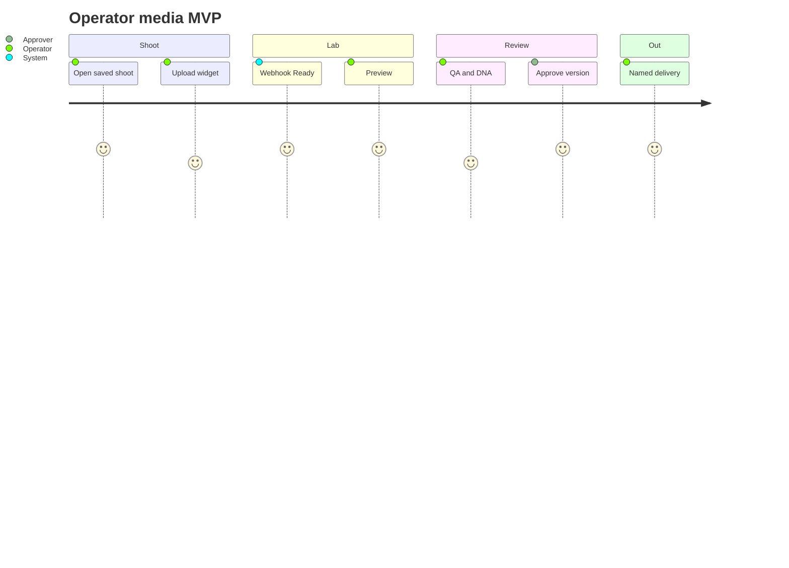
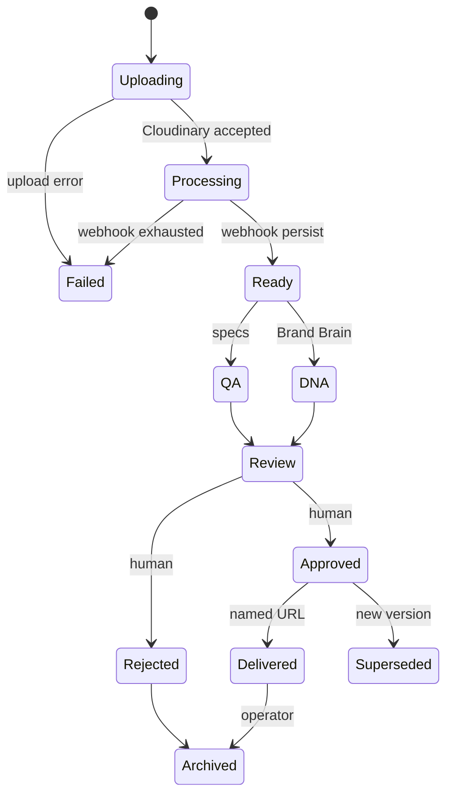
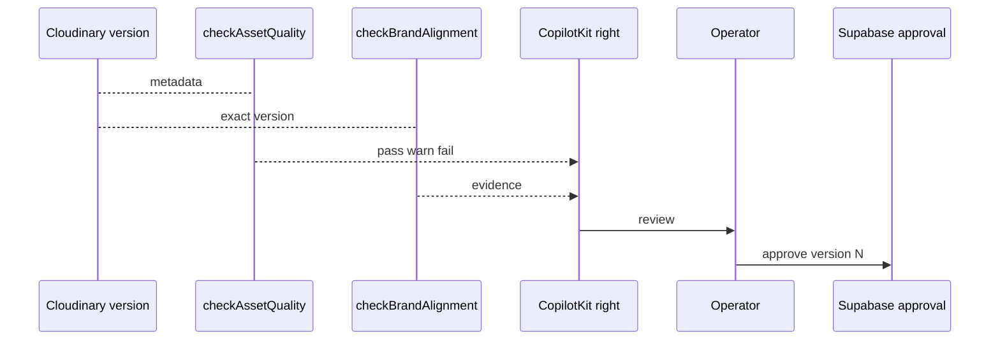

# Cloudinary MVP PRD — operator media journey

The Core pipe is the lab’s loading dock. MVP is the **season rack**: photographer uploads SS26 selects onto a **saved shoot**, the operator sees them, quality and Brand DNA run in parallel as **advice**, a human locks **that exact Cloudinary version**, and only then may a named print leave the building.

Parent: [cloudinary-prd.md](./cloudinary-prd.md). **Pipe → widget → cutover.** Widget needs **IPI-1065 · APP-001** and a saved shoot (**IPI-1067 · SHOOT-001**). Production notifications stay on `www.ipix.co` until Production-ready.

**Authenticated DAM:** channel/review previews are **eager derived + signed**, same as Core. Do not sign a named transform that was never generated.

---

## 1. Executive Summary

Operators cannot complete “shoot → upload → attach → preview → QA ∥ DNA → approve → deliver” in this repo. Tables exist; `shoot.shoot_assets` has **0** rows. The Cloudinary Upload Widget and exact-version approval are the product, not a custom dropzone.

**Solution:** `CldUploadWidget` + Core sign/webhook + Assets workspace + attach + deterministic QA + Brand Brain DNA as HITL + approval row + approved named-transform delivery.

**Success:** one Org A shoot select becomes Approved and deliverable; Org B cannot see it; a newer Cloudinary version is not auto-approved.

---

## 2. Problem Statement

Fashion production still dumps selects into Drive/email. iPix must make the **saved shoot** the only legal place to hang Cloudinary identity, then force a human to approve **version N**, not “whatever is newest.”

---

## 3. Goals

```text
Shoot → Upload → Attach → Preview → QA ∥ Brand DNA → Review → Approve exact version → Deliver
```

Reuse: `CldUploadWidget`, named `t_asset-*`, `image_specs` / `platforms` (not deprecated `media_size_specs`), existing `assets` + `cloudinary_assets` + `asset_events`.

---

## 4. Non-goals

- Production webhook cutover
- Media Library Widget, visual search, MediaFlows, bulk ops
- Analyze API / AI Vision on the **critical path** (optional enrichment only)
- Cloudinary Search as library SoT
- CopilotKit replacing the gallery
- Planner HITL (**IPI-1084 · APPROVAL-001**) as asset approval — assets are **IPI-1119**
- Gemini for dimensions/format/version

---

## 5. Target Users

Photographer/operator, producer, brand approver, producer who picks campaign stills.

---

## 6. User Outcomes

| Journey | Outcome |
| --- | --- |
| Photographer | Widget on saved shoot; Ready gallery |
| Producer | Attach is the shoot they opened, not last-used org |
| QA | Pass/warn/fail from specs + native signals |
| Brand | DNA vs approved Brand Brain; human decides |
| Delivery | Only approved version + named transform |

---

## 7. Current State

| Item | Evidence |
| --- | --- |
| No widget in this repo | no `next-cloudinary` |
| Preset `ipix-signed-upload` | authenticated, eager, manual moderation, notify `www.ipix.co` |
| Named transforms used | `t_asset-review`, `t_asset-masonry`, `t_asset-detail` |
| `image_specs` 9 / `platforms` 7 | live fashionos |
| DNA / QA tickets | **IPI-1136**, **IPI-1138** Backlog, children of **IPI-1097** |
| **IPI-1116 / 1118 / 1119 / 1120** | Backlog, children of 1097 |
| **IPI-1069 · ASSETS-001** | Backlog — list/detail, not upload |

---

## 8. Source-of-Truth Ownership

Same as Core. Plus:

| Fact | Owner |
| --- | --- |
| Shoot attachment | `shoot.shoot_assets` (after 1122) |
| QA result | Supabase evidence (not Cloudinary tag) |
| DNA result | Supabase evidence + Brand Brain |
| Approval | Supabase exact version |
| Channel crop | Named transform in Cloudinary; **allowed** only if approval matches |

---

## 9. Routes / Directory Structure

```text
src/app/app/assets/page.tsx
src/app/app/assets/[id]/page.tsx
src/app/app/shoots/[id]/page.tsx
src/components/media/cld-upload-widget.tsx
src/app/api/cloudinary/sign/route.ts
src/app/api/assets/[id]/approve/route.ts
src/app/api/assets/[id]/delivery-url/route.ts
```

Routes match the hub (`/app/...`). If the live sitemap uses a different group, **sitemap wins** — keep one Assets + one Shoot Detail.

---

## 10. Core Features (MVP)

| # | Feature | Purpose | SoT | Native | Gap | Phase | Deps | Failure | AC |
| --- | --- | --- | --- | --- | --- | --- | --- | --- | --- |
| 7 | Assets library | Browse org assets | Supabase list | signed thumbs via 1112 | IA | M3 | 1112, 1065 | empty state | **IPI-1069** |
| 8 | Shoot attach | Hang Ready asset on shoot | `shoot.shoot_assets` | context hints only | FK + RLS | M3 | 1067, 1116 | attach wrong shoot | **IPI-1118** |
| 5–6 | Widget upload | Selects in | Cloudinary + webhook | `CldUploadWidget` | org/shoot in sign | M3 | 1110, 1111, 1067 | widget success ≠ Ready | **IPI-1116** |
| 9 | QA | Channel readiness | `image_specs` + bytes/w/h | quality/format from upload payload | scoring UI | M3 | Ready | warn ≠ block unless policy | **IPI-1138** |
| 10 | Brand DNA | Alignment advice | Brand Brain | optional Analyze later | Mastra tool read-only | M3 | Brand Core + Ready | DNA fail still human | **IPI-1136** |
| 11 | Approval | Lock version | `asset` approval fields or events | none | HITL | M3 | QA/DNA optional complete | wrong version | **IPI-1119** |
| 12 | Approved delivery | Named print | server URL | **eager** `t_*` + signed authenticated | check approval **and** derived exists | M3 | 1119 | unapproved or missing derived 403 | **IPI-1120** |
| 13 | Reconcile | Drift | Admin | 1114 | report UI later | M3 | 1111 | stale row | **IPI-1114** |

QA ∥ DNA: **parallel after Ready**, both HITL. Neither auto-approves.

---

## 11. AI Features

**Mastra (one bounded capability, not an agent per feature):**

| Tool | Read/write | HITL |
| --- | --- | --- |
| `checkAssetQuality` | read specs + provider metadata | no write |
| `checkBrandAlignment` | read Brand Brain + exact version | propose only |
| `getAsset` | org-scoped | no |

CopilotKit renders explanations on the **right** panel. Main gallery stays human work. No delete/upload/publish tools.

**Gemini / Claude:** only semantic Brand DNA when native signals are insufficient. Never for width/height/format/version.

Cloudinary AI Vision / `cld_fashion` Analyze: **optional**, add-on, **not** MVP blocker. Fallback = deterministic QA + human.

---

## 12. Use Cases

Photographer on set; producer reviewing selects; brand signing off e-comm hero; campaign pulling an approved still.

---

## 13. Real-World Fashion Examples

### Workflow 1 — Photographer upload

```text
Operator opens saved SS26 shoot
→ CldUploadWidget (fresh sign if shoot changes)
→ Cloudinary authenticated + eager thumbs
→ preview webhook (not prod URI)
→ Supabase Ready
→ shoot gallery
```

**Failure:** widget `onSuccess` must not mark Ready. If webhook 503, gallery shows Processing until retry or reconcile.

### Workflow 2 — Asset QA

```text
Ready asset
→ deterministic: format, bytes, w/h vs image_specs / channel (never LLM)
→ native: format, moderation status already on preset
→ pass / warn / fail / **unknown**
→ operator review
```

Reject uploads over plan max (**10 MB** on current Free) in the widget/sign allowlist with an operator-visible error.

Manual moderation is already on `ipix-signed-upload`. MVP **stores** status; it does not require Amazon Rekognition.

### Workflow 3 — Brand DNA

```text
exact version
→ approved Brand Brain
→ Mastra checkBrandAlignment
→ evidence row
→ recommendations
→ operator decision (not auto-reject)
```

### Workflow 4 — Approval

```text
QA + DNA visible
→ approve/reject exact (asset_id, version)
→ audit asset_events
→ newer upload = new version, no inherited approval
```

### Workflow 5 — Campaign-ready (MVP slice)

Campaign may **link** an approved version. Semantic/visual match is Advanced. MVP filter = org + brand + approved + shoot/campaign metadata in **Supabase**.

### Workflow 6 — Channel derivative

```text
approved master
→ named transform (reuse t_asset-* ; add channel names later)
→ preview
→ human publishing approval is campaign epic, not this PRD
```

---

## 14. User Stories

- As a photographer, I want the official widget so I do not fight a custom dropzone. **AC:** `CldUploadWidget` + `signatureEndpoint`; secret absent from client bundle.
- As a producer, I want selects stuck to **this** shoot. **AC:** attach writes `shoot.shoot_assets`; Org B forbidden.
- As an approver, I want to lock version `1739…` so a re-upload cannot sneak through. **AC:** approval row stores `cloudinary_asset_id` + `version`; v2 is not approved.
- As Org B, I must never see Org A’s masonry URL. **AC:** anonymous and Org B fetch fail.

---

## 15. User Journey



---

## 16. Workflows

See §13. HITL: AI proposes; writes to business approval only from the approve route.

---

## 17. Mermaid Diagrams

### Asset lifecycle



### QA ∥ DNA then approval



---

## 18. Website Pages

Marketing still public-only. Approved DAM URLs never on the marketing site.

---

## 19. Dashboard Pages

| Screen | Purpose | Main data | Cloudinary | AI | HITL | Actions |
| --- | --- | --- | --- | --- | --- | --- |
| Home | command | org work | public/provider only | later | — | nav |
| Brand | profile | brand | public refs | DNA later | — | open |
| Shoot List | browse | shoots | covers via 1112 if private | — | — | open |
| Shoot Detail | work | gallery | widget + thumbs | QA/DNA | upload | upload, attach |
| Shoot Wizard | create shoot | draft | none | — | — | save then upload |
| Assets | library | Supabase | signed thumbs | filters | — | open |
| Asset Detail | review | identity+version | `t_asset-detail` | QA/DNA | approve | approve/reject |
| Campaign | plan | links | approved only | reuse later | pick | link version |
| Channel Preview | crop | named | named transform | suggest later | — | copy URL |
| Analytics | not Cloudinary SoT | PostHog/business | usage pointer later | — | — | — |

---

## 20. Three-Panel Layout

| Region | Shoot Detail | Asset Detail |
| --- | --- | --- |
| **Left — Context** | org, brand, shoot, status filters | org, brand, shoot, version, delivery_type |
| **Main — Work** | gallery, widget, attach | hero preview, metadata, approve |
| **Right — Intelligence** | missing shots, QA summary | DNA explanation, quality warnings, reuse later |

AI must not replace the gallery.

---

## 21. Wizards

Shoot create wizard ends in **saved shoot** before widget (1118). No “upload then invent shoot.”

---

## 22. Chat / CopilotKit interactions

Right-rail: “Why did QA warn?” / “How does this miss Brand color?” Tools: `getAsset`, `checkAssetQuality`, `checkBrandAlignment`. No autonomous approve.

| Tool | Input | Output | AuthZ | Write | HITL |
| --- | --- | --- | --- | --- | --- |
| `getAsset` | `assetId` | identity + version + status | org RLS | no | no |
| `checkAssetQuality` | `assetId`, optional `platformId` | `AssetQaResult` | org | evidence optional | no |
| `checkBrandAlignment` | `assetId`, `version`, `brandId` | scores + citations | org + approved brain | evidence optional | no |
| `prepareMediaApproval` | `assetId`, `version` | review payload | org | no | no |
| `commitMediaApproval` | `assetId`, `version`, `decision` | audit row | org + role | **yes** | **yes — CopilotKit card, never silent** |

Do **not** ship `findAssets` in MVP (Advanced / **MEDIA-AGENT-001**).

```ts
type AssetQaResult = {
  status: "pass" | "warn" | "fail" | "unknown";
  assetId: string;
  version: number;
  checks: Array<{
    code: string;
    status: "pass" | "warn" | "fail" | "unknown";
    message: string;
    evidence?: unknown;
  }>;
};
```

`unknown` is required when Cloudinary native/add-on signals are missing — never invent pass.

---

## 23. Cloudinary capabilities

| Capability | MVP |
| --- | --- |
| `CldUploadWidget` + `signatureEndpoint` | **required** |
| Authenticated + **eager** named/preset derivatives | **required** |
| Channel IG/TikTok named transforms | **DEFER** unless already eager on the approved master |
| File size / format on sign + preset | **required** (Free 10 MB until upgrade) |
| Tags/context | hints; SoT Postgres |
| Moderation manual | already on preset — display only |
| Video `CldVideoPlayer` | DEFER |
| Generative fill/replace | DEFER |
| Visual search | DEFER |

---

## 24. Mastra agents/tools/workflows

One media analysis **workflow step** only if async DNA is slow; otherwise tools. No Product Launch Agent. No MediaFlows.

---

## 25. Data Model

Reuse Core tables. MVP writes:

- Ready from webhook
- `shoot.shoot_assets` attach
- QA/DNA evidence (prefer existing `asset_events` or brand evidence tables — **1109 must name the column**, do not mint `asset_approvals` unless missing)
- Approval: exact `cloudinary_asset_id` + `version` + actor + timestamp

`asset_variants` is empty — **do not** require it for MVP channel delivery; named transforms are enough.

Campaign: `campaigns` / `campaign_deliverables` exist (3 / 6 rows). Link **approved** asset versions; do not invent `campaign_assets` until 1109 says the join is missing.

---

## 26. Security

All Core threats plus:

- Approval applied to wrong/newer version → persist version in approval row; delivery checks both
- Widget callback trusted as Ready → forbidden
- Cross-tenant thumbs → 1112 + RLS
- Rejected cannot be delivered

---

## 27. Failure / Recovery

| Case | Behavior |
| --- | --- |
| Transform unavailable | 404/fail visible; no unsigned fallback |
| DNA/Analyze fail | QA still works; DNA status `unavailable` |
| Version replaced | new Ready row/version; old approval unchanged; gallery shows superseded |
| Approved deleted at provider | reconcile; delivery fail closed |
| Campaign stale | delivery check fails |

---

## 28. Integrations

CopilotKit review surface. Mastra tools. Brand Brain. Postiz **out of MVP** (publishing epic).

---

## 29. Technical Reference Pack

| Reference | Use | Avoids |
| --- | --- | --- |
| [CldUploadWidget signed](https://github.com/cloudinary-community/next-cloudinary) | Widget | Custom uploader |
| [examples nextjs-clduploadwidget-signed](https://github.com/cloudinary-community/cloudinary-examples) | Pattern | Dropzone |
| [control_access_to_media](https://cloudinary.com/documentation/control_access_to_media) | Authenticated vs private | Using `CldImage` as ACL |
| [image_upload_api_reference](https://cloudinary.com/documentation/image_upload_api_reference) | Upload params | |
| Brand Brain issue **IPI-1136** | DNA | LLM for pixels |

---

## 30. Implementation Notes

COPY+CLEAN widget from official example; bind AUTH org + shoot_id into signed params (folder/context) **and** Supabase attach. Never implement from `/home/sk/ipix`.

Do not copy example’s post-upload public `CldImage` for DAM.

---

## 31. Testing Strategy

Core tests plus:

- Widget stale sign after shoot switch
- Attach wrong org forbidden
- Approve v1; upload v2; v2 not approved
- Rejected delivery 403
- QA without LLM still pass/fail
- DNA down does not block QA
- Browser: login → shoot → upload → Ready → approve → signed URL

---

## 32. Success Metrics

- Upload → Ready time (webhook)
- Ready → approved time
- Wrong-version approvals = 0
- Cross-tenant leaks = 0
- % assets attached to a shoot (not orphan Ready)

---

## 33. Risks / Constraints

- Brand Core must exist before DNA is meaningful
- Manual moderation on preset may delay “visible” in Cloudinary Console — ledger Ready is webhook, not Console
- Additive production notify if preview URL set wrong

---

## 34. Pricing / Plan Restrictions

Widget + authenticated + named transforms: Core-safe. AI Vision / fashion model: add-on — **optional**. Do not block **IPI-1138** on add-ons.

---

## 35. Acceptance Criteria

- [ ] Widget signed; secret never client
- [ ] Fresh sign on brand/shoot change
- [ ] Webhook Ready before gallery claims success
- [ ] Org isolation
- [ ] QA deterministic path
- [ ] DNA HITL; no auto-approve
- [ ] Exact version approval
- [ ] Approved delivery is exact version + **existing eager derived** + signed URL
- [ ] Oversized original rejected before Cloudinary (or Cloudinary error mapped), not a blank gallery
- [ ] Browser proof on preview

---

## 36. Production Readiness (this phase)

MVP is **preview operator journey**. Production cutover is the Production-ready PRD.

---

## 37. Linear Task Mapping

| Task | Verdict |
| --- | --- |
| **IPI-1097 · MEDIA-001** | Gate, not one PR — **correct** |
| **IPI-1116 · CLD-UPLOAD-001** | correct; needs 1110+1111 |
| **IPI-1069 · ASSETS-001** | thumbs via 1112; no upload in that PR |
| **IPI-1118 · SHOOT-ASSETS-001** | after 1067 |
| **IPI-1138 · ASSET-QA-001** | parallel with 1136 after Ready |
| **IPI-1136 · ASSET-DNA-001** | after Brand Brain; not Core |
| **IPI-1119 · MEDIA-APPROVAL-001** | after attach; QA/DNA not hard-block if marked skipped |
| **IPI-1120 · MEDIA-DELIVERY-001** | after 1119 |
| **IPI-1115** | still last |

**Should not merge** 1116+1069 (different IA). **Should not split** 1097 (already a gate).

Milestone: DNA/QA on M3 is **correct**. Do not pull into M1.

---

## 38. Missing Tasks

None required to mint now. Optional later: **CLD-RECONCILE-UI-001** after 1114.

If 1109 finds **no approval columns**, strengthen **IPI-1119** ACs rather than a new epic.

---

## 39. Deferred Features

Visual search, `findAssets` agent, ML widget, video, generative, MediaFlows, structured metadata, Postiz publish.

---

## 40. Scores /100

| Axis | Score | Gap |
| --- | --- | --- |
| Product design | 90 | Campaign reuse thin by intent |
| Cloudinary architecture | 91 | Widget + named transforms native |
| Security | 88 | Version lock must be proven in 1119 |
| Data ownership | 85 | shoot_assets empty; dual shoots |
| AI design | 88 | HITL; no add-on on path |
| Reuse efficiency | 92 | |
| Cost efficiency | 88 | |
| Testing | 80 | Browser not run |
| Production readiness | 35 | Preview MVP |
| Overall | 87 | |

**Correctness confidence: 80/100.** Live presets/transforms/tables verified. Exact approval schema columns **UNVERIFIED** until 1109 verbose dump.
