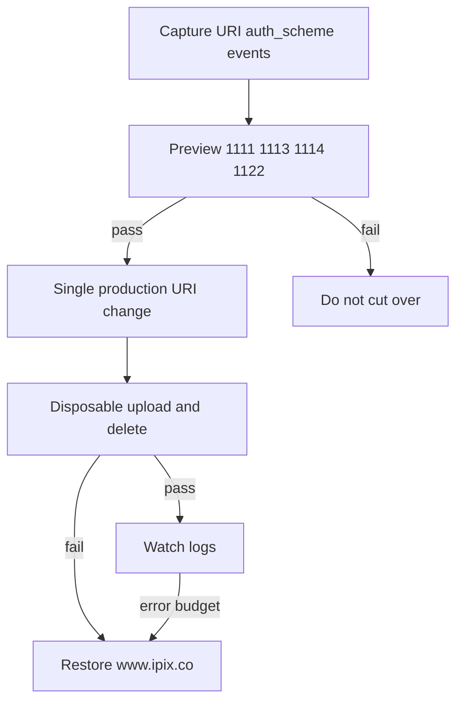
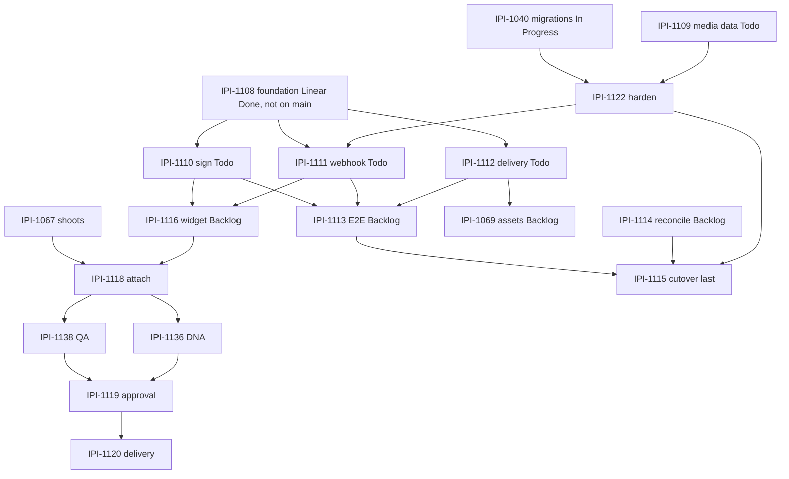

# Cloudinary Production Readiness PRD — cutover last

Parent: [cloudinary-prd.md](./cloudinary-prd.md). The new lab can be perfect on preview and still wreck production if the **notification address** is moved too early. Today four triggers still POST to [`https://www.ipix.co/api/assets/cloudinary/webhook`](https://www.ipix.co) (**VERIFIED** Environment Config MCP, 2026-09-02).

**IPI-1115 · CLD-CUTOVER-001 — Cut Cloudinary Notifications Over to V2 Safely** stays **last** unless a live incident proves the old endpoint is already dead. Research does **not** justify moving it earlier.

---

## 1. Executive Summary

Production photographers already upload through signed presets into Cloudinary; the **mail** goes to V1. V2 must take that mail only after preview HMAC, 200-after-commit, disposable E2E, reconcile, and media grants are green — with an exact rollback URI.

---

## 2. Problem Statement

A false 200 on a broken V2 webhook drops retries. A silent double-write (`additive: true` on upload/delete) can fork the ledger. Cutover is an ops procedure, not a feature PR.

---

## 3. Goals

Capture current trigger config; prove V2; one recorded Dashboard/MCP change; smoke; rollback if any gate fails; monitoring and runbooks.

---

## 4. Non-goals

- Rewriting V1
- Custom webhook-config service
- Enabling EdDSA-only until HMAC path is proven in prod
- Customer media as test fixtures
- Invented analytics dashboards when Console usage exists

---

## 5. Target Users

On-call engineer, photographer (must not notice except a better app), security reviewer.

---

## 6. User Outcomes

Production upload still becomes Ready — now in V2 Supabase. Rollback restores `www.ipix.co` in minutes. No Org leaks. No unexplained drift.

---

## 7. Current State (live)

| Trigger | Event | URI | auth_scheme | additive |
| --- | --- | --- | --- | --- |
| upload | upload | `https://www.ipix.co/api/assets/cloudinary/webhook` | `legacy_hmac` | true |
| delete | delete | same | `legacy_hmac` | true |
| moderation | moderation | same | `default` (HMAC + v2 header) | false |
| moderation_summary | moderation_summary | same | `default` | false |

Preset `ipix-signed-upload` and `ipix_manual_moderation` also set `notification_url` to the same V1 path.

**Rollback target:** those four trigger URIs + preset notification URLs.

---

## 8. Source-of-Truth Ownership

Cutover config: **Cloudinary Console / Environment Config MCP**. Business rows: **Supabase**. Evidence of the change: Linear comment + runbook, not Slack lore.

---

## 9. Routes / Directory Structure

Production uses the same `src/app/api/cloudinary/webhook/route.ts` as preview, with production env secrets. No second verifier.

---

## 10. Core Features (ops)

| Feature | Purpose |
| --- | --- |
| Trigger capture | exact URI, events, `auth_scheme` |
| Preview proof | 1111 + 1113 + 1114 + 1122 green |
| Cutover | one MCP/Dashboard update |
| Smoke | disposable upload + delete |
| Rollback | restore captured URI |
| Monitoring | Vercel logs, 401/503 rates, Cloudinary retries |
| Quotas | Console usage; no fake KPI UI |
| HTTP | When |
| --- | --- |
| **2xx (200)** | Signature valid **and** durable Supabase commit |
| **401** | Bad/stale signature — **do not retry** as if it were persistence (permanent rejection of that payload) |
| **503** | Valid event, persist failed — Cloudinary retries ~3/6/9 min |

Automatic **backup is off by default** ([backups](https://cloudinary.com/documentation/backups_and_version_management)). Enabling it is a Production checklist item, not a Core ticket. External backup storage is plan-gated.

**Rollback RTO:** restore captured trigger URIs **and** preset `notification_url` within **15 minutes** of a failed smoke.

**Load:** Free Admin ~500/hour — reconcile must page; do not burst-list the whole cloud on cutover night.

---

## 11. AI Features

None. Do not “AI ops” the cutover.

---

## 12. Use Cases

On-call cuts over after preview green. Photographer uploads one disposable file. Ops watches 401 vs 503.

## 13. Real-World Fashion Examples

Friday before a lookbook drop: do **not** cut over. Cut over on a quiet window with rollback owner on call.

## 14. User Stories

- As on-call, I want an exact previous URI so I can restore `www.ipix.co` without guessing. **AC:** capture table in Linear before mutate.
- As a photographer, I should not notice except V2 Ready. **AC:** disposable smoke Ready in V2; no customer media.

## 15. User Journey

Capture → gates → one change → smoke → watch → rollback or close.

## 16. Workflows

**Happy path:** capture → preview green → change URI to Vercel production webhook → disposable upload Ready in V2 → delete smoke → watch 15–30 min.

**Fail path:** non-200 spike → restore `www.ipix.co` → Linear incident.

**Do not** leave V1 and V2 both receiving customer uploads unless an **explicit** overlap test with idempotency is written. Current `additive: true` makes overlap extra dangerous.

---

## 17. Mermaid — cutover / rollback

### Development dependency (verified vs Linear)

Hard blockers to cutover: **1111, 1113, 1114, 1122**. Widget/approval improve product but **cutover can proceed** after pipe E2E if ops accepts V1 UI remaining on old app — **prefer** 1120 green so V2 is the operator surface. Linear 1115 currently blockedBy **1113** and **1114** only; **relatedTo 1111, 1122**. **Recommend** adding hard `blockedBy` **1111** and **1122** (issue already lists them as gates in the body).

---

## 18. Website Pages

N/A.

## 19. Dashboard Pages

Optional read-only drift report (**CLD-RECONCILE-UI-001** later). Console usage is the quota dashboard — do not invent a second one.

## 20. Three-Panel Layout

Not a customer screen. Runbook is the “main work.”

## 21. Wizards

None. Cutover is a checklist, not a wizard.

Ops: internal runbook, not a customer wizard. Optional read-only drift report screen (**CLD-RECONCILE-UI-001** later).

---

## 22. Chat / CopilotKit

None for cutover.

---

## 23. Cloudinary capabilities

[Notifications](https://cloudinary.com/documentation/notifications): retries ~3/6/9 minutes if not HTTP 200. `auth_scheme` `legacy_hmac` | `default` | `eddsa_v2`. Dedicated webhook API key in Console. `POST /triggers/:id/test` for filters (2026-05-28 PM notes). **Do not** switch production to `eddsa_v2` until Node SDK verification is proven — Core stays HMAC.

---

## 24. Mastra

Not in cutover.

---

## 25. Data Model

Idempotency: `processed` notification id (or equivalent) — **1109 must confirm column**. `asset_events` already append-only with version binding.

---

## 26. Security threat review

| Risk | Attack/failure | Prevention | Detection | Recovery | Test |
| --- | --- | --- | --- | --- | --- |
| Unsigned uploads | public preset | signed only | Admin unsigned list | disable preset | unsigned rejected |
| Stale signatures | replay sign | timestamp window | 401 logs | — | stale rejected |
| Org A→B | IDOR | RLS + server AuthZ | access logs | revoke | Org B 403 |
| Guessed IDs | enum | UUID + RLS | 404/403 | — | |
| Public private asset | `type=upload` | authenticated + strict | anonymous fetch | invalidate | anon fail |
| Wrong version approval | overwrite | version in row | audit | reject v2 | 1119 test |
| Webhook spoof | fake POST | HMAC raw | 401 | — | spoof |
| Replay | replay POST | timestamp + idempotency | dup events | 200 idempotent | |
| Dup events | retries | idempotency | unique violation | 200 | |
| Out of order | delete before upload | state machine | reconcile | repair | |
| Deleted provider / live row | desync | 1114 | drift report | archive row | |
| DB row / missing provider | desync | 1114 | drift | do not fake CDN | |
| Exposed secret | NEXT_PUBLIC | grep CI | secret scan | rotate | |
| Arbitrary transform sign | open sign | named allowlist | URL audit | revoke | |
| Malicious upload | malware | format/size/moderation | moderation events | destroy | |
| Rate limit | 429 | backoff | 429 metrics | queue later | |
| Cutover dual-write | additive + two URIs | no overlap unless designed | two ledgers | pick SoT | |

---

## 27. Failure / Recovery

Documented in Core + MVP. Production extras:

- Cloudinary outage: fail closed; photographers retry
- Supabase outage: 503 → Cloudinary retries
- Approved asset deleted: fail delivery; incident
- Transform quota: Console; stop eager spam

---

## 28. Integrations

Vercel runtime logs. Cloudinary Console usage/bandwidth. Not PostHog as CDN truth. Not Stripe.

---

## 29. Technical Reference Pack

| Reference | Use | Avoids |
| --- | --- | --- |
| [notifications](https://cloudinary.com/documentation/notifications) | retries, auth_scheme | custom bus |
| [notification_signatures](https://cloudinary.com/documentation/notification_signatures) | HMAC | homemade hash |
| [cloudinary_npm verifyNotificationSignature](https://github.com/cloudinary/cloudinary_npm) | verify | |
| [MCP env-config](https://github.com/cloudinary/mcp-servers) | list/update triggers | custom deploy tool |
| [IPI-1115](https://linear.app/amo100/issue/IPI-1115) | gates | early cutover |

---

## 30. Implementation Notes

Native trigger update only. Capture **before** mutate. Preset `notification_url` must move **with** triggers or additive/global behavior will surprise you — checklist both.

---

## 31. Testing Strategy

Full matrix in user prompt. Production proof **only** at approved cutover with disposable assets. Rollback drill on preview first.

---

## 32. Success Metrics

Webhook success %; duplicate processing; drift count; signed delivery failure; cross-tenant = 0; rollback RTO.

---

## 33. Risks / Constraints

Additive triggers; four event types; moderation `default` scheme vs upload `legacy_hmac` — verifier must accept HMAC for all Core events. V2 header present on moderation — observe, do not require EdDSA.

---

## 34. Pricing / Plan Restrictions

Retries and webhooks are platform features. Bandwidth/storage from production DAM will rise when V2 is the operator surface — watch Console, do not guess dollars.

---

## 35. Acceptance Criteria

All **IPI-1115** ACs plus:

- [ ] Trigger + preset URLs captured
- [ ] 200 only after persist proven in prod smoke
- [ ] 503 retry proven on preview
- [ ] Rollback documented and drilled
- [ ] No customer media
- [ ] Automatic backup setting recorded (on/off); do not claim recovery if still off
- [ ] 401 spoof vs 503 persist distinguished in logs

---

## 36. Production Readiness checklist

- [ ] Authenticated user journey on **preview**
- [ ] Tenant isolation tests
- [ ] Signed uploads
- [ ] Webhook verification
- [ ] Idempotency
- [ ] Exact version identity
- [ ] Human approval (if V2 is operator SoT)
- [ ] Safe named transforms
- [ ] Rollback
- [ ] Reconciliation
- [ ] Logging / monitoring
- [ ] Rate limits visible
- [ ] Secrets rotated procedure
- [ ] Failure recovery
- [ ] Tests + typecheck + build
- [ ] Browser proof preview
- [ ] Production disposable smoke at cutover
- [ ] Runbook

Nothing is Done because code exists.

---

## 37. Linear Task Mapping

| Task | Change |
| --- | --- |
| **IPI-1115 · CLD-CUTOVER-001** | Keep last; Backlog correct |
| blockedBy | Live: 1113, 1114. **Add 1111 + 1122** as hard blockers to match the issue body |
| **IPI-1111** | Todo — must be green first |
| **IPI-1122** | Todo — no milestone on issue (**fix**: M3 or Parallel security) |
| **IPI-1040** | In Progress — hard for DDL |

---

## 38. Missing Tasks

**Genuine gap:** cutover must update **preset notification_url** as well as triggers — fold into **1115** ACs (update issue, do not mint). Optional later **CLD-BACKUP-001**, **CLD-OPS-001** (usage pointer).

---

## 39. Deferred Features

EdDSA-only auth_scheme; R2 backup; reconcile UI.

---

## 40. Scores /100

| Axis | Score | Gap |
| --- | --- | --- |
| Product design | 88 | ops-complete |
| Cloudinary architecture | 90 | live triggers known |
| Security | 85 | additive + dual scheme |
| Data ownership | 88 | |
| AI design | n/a | |
| Reuse efficiency | 92 | native MCP cutover |
| Cost efficiency | 88 | |
| Testing | 70 | prod not run |
| Production readiness | 55 | cannot be 100 until smoke |
| Overall | 84 | |

**Correctness confidence: 88/100** on **procedure**; **0/100** on “production cutover already safe” — it has not happened.
