| ID | Team | Title | Description | Status | Estimate | Priority | Project ID | Project | Creator | Assignee | Labels | Cycle Number | Cycle Name | Cycle Start | Cycle End | Created | Updated | Started | Triaged | Completed | Canceled | Archived | Due Date | Parent issue | Initiatives | Project Milestone ID | Project Milestone | SLA Status | UUID | Time in status (minutes) | Related to | Blocked by | Duplicate of |
| :--- | :--- | :--- | :--- | :--- | :--- | :--- | :--- | :--- | :--- | :--- | :--- | :--- | :--- | :--- | :--- | :--- | :--- | :--- | :--- | :--- | :--- | :--- | :--- | :--- | :--- | :--- | :--- | :--- | :--- | :--- | :--- | :--- | :--- |
| IPI-999 | iPix1 | IPI-999 · MASTRA-WF-006 — Harden Long-Lived Workflow Recovery, Reconnect & Idempotency | ## Pass 3 contract — 2026-08-31 (implementation SSOT)

**This task is dormant until the first real Mastra workflow exists in ipixai.** There is no brand-intelligence / shoot-wizard workflow tree in `/home/sk/ipixai` today.

**Not this ticket:** Planner browser refresh / reconnect / replay remain owned by [IPI-1084](<https://linear.app/amo100/issue/IPI-1084>) (interrupt restore or fail closed), [IPI-1050](<https://linear.app/amo100/issue/IPI-1050>) (Mastra storage/memory), and [IPI-1088](<https://linear.app/amo100/issue/IPI-1088>) (CopilotKit UI hydration).

**When activated:** use **native** Mastra Postgres workflow snapshots + suspend/resume ([snapshots](<https://mastra.ai/docs/workflows/snapshots>), [suspend-and-resume](<https://mastra.ai/docs/workflows/suspend-and-resume>), [PostgreSQL](<https://mastra.ai/integrations/databases/postgresql>)). Reuse existing `PostgresStore` (`schemaName: mastra`, `disableInit: true`). Resume must be **idempotent**: double resume must **never** double-save, double-publish, or double-pay.

Do not: `/api/workflows/status`, `localStorage` as durable truth, Temporal, DurableAgent PubSub, or old `app/src` workflow routes.

Historical body below is old-app context. **DO NOT IMPLEMENT **`/api/workflows/status`, `localStorage` runId truth, Temporal, DurableAgent, or `approval_events` if those appear in Linear history. Execute **only** this Pass 3 contract and Acceptance Criteria.

---

# IPI-999 · MASTRA-WF-006 — Harden Long-Lived Workflow Recovery, Reconnect & Idempotency

**Team:** iPix1 · **Type:** Feature · **Labels:** MASTRA · AI · PLATFORM · DURABLE
**Priority:** P0 · **Level:** CORE · **Epic:** IPI-993 · MASTRA-WF-000 — **Depends:** MASTRA-WF-001, MASTRA-WF-005

## Purpose

Support workflows that wait minutes, hours or days (campaign proposal waiting for client, shoot proposal waiting for operator), verify state survives suspension, resume from correct step, prevent duplicate execution, handle refresh/reconnect and recoverable errors. Focus: double resume, browser refresh, stale approval, restart recovery, authorization on resume, idempotent commit, status recovery.

## User Value

Operator starts brand analysis, closes laptop, comes back 2 hours later after Firecrawl crawl finishes and Gemini analysis completes — draft still waiting in Brand Hub with Approve button, not lost. Client proposal for Summer Campaign sits pending client approval over weekend, Monday operator resumes with one click, no re-running 10 min of AI work. Shoots that need operator input after budget estimation don't vanish on deploy restart.

## Real-World Example

Brand Intelligence: operator starts crawl for [everlane.com](<http://everlane.com>) at 9am, Firecrawl webhook fires at 9:15 (crawlId), but workflow suspended at wait-for-crawl step waiting for resume. PostgresStore persists snapshot. At 9:15 edge function calls mastra.getWorkflow('brand-intelligence').createRun({runId}).resume({ resumeData: {crawlId} }). If resume fails due to network, retry with idempotency (crawlId same). At 9:16 extractProfile runs, then fanOutEnrichment, then saveDraftAndWait suspends with draftId. Operator sees draft at 9:17, goes to lunch, returns 2pm, clicks Approve — resume with { approved: true } → commitOrReject promotes draft, intake_status ready. If Vercel deploy happens at 1pm during suspension, snapshot still in Postgres, runId same, resume after deploy still works. If operator double-clicks Approve, second resume gets "not suspended" error and falls through to snapshot polling returning current gate (already committed) — no duplicate brand promotion.

## Current State

* Suspend/resume implemented: brand-intelligence waitForCrawl (resumeSchema crawlId + failed flag) and saveDraftAndWait (resumeSchema approved bool), shoot-wizard 3 gates (resumeSchema approved + deliverables/shots/budget_override)
* Persistence: PostgresStore via getMastraStorage() → getStore("workflows") → loadWorkflowSnapshot({workflowName, runId}) used in /api/workflows/resume polling fallback (15 attempts *2s=30s)
* Routes: /api/workflows/brand-intelligence/start creates run and awaits through first suspend (start not startAsync so checkpoint persistence completes before response, per IPI-803 comment), /api/workflows/brand-intelligence/approve and /api/workflows/resume call run.resume({step, resumeData})
* Idempotency: brand-intelligence validateBrand has guard: .not("intake_status", "in", "(crawl_running,crawl_complete,analysis_running,scores_complete,draft_ready)") → prevents duplicate run, but not generic; commitOrReject checks IDEMPOTENT_DRAFT_STATE_ERROR from promote/discard, but no generic duplicate execution guard
* No verification for hours/days wait, no refresh/reconnect robustness test beyond 30s polling, no audit of approval state
* No handling of workflow state surviving deploy restart beyond PostgresStore (which does survive, but not tested for long suspension)
* No duplicate execution prevention for shoot-wizard (could double-commit shoot if resume double-called? saveApprovedShootDraft checks? Need check)

## Gap

* Missing verification that workflow state survives suspension for hours/days (not just minutes)
* Missing duplicate execution prevention generic guard (not just brand_intake_drafts upsert onConflict brand_id)
* Missing refresh/reconnect proof (operator closes tab, reopens, draft still there, resume works)
* Missing error recoverability (if extractProfile fails after resume, intake_status failed recorded, but can user restart? need failed → retry path)
* Missing auditable approval state (who approved, when, what was suspended payload)
* Missing test for Vercel deploy restart scenario (snapshot persistence)

> **ARCHIVED — DO NOT IMPLEMENT.** Old-app Scope and Architecture (`/api/workflows/status`, `localStorage` runId, DurableAgent PubSub, `approval_events`) were removed 2026-09-01. Linear history retains them. Use native Mastra Postgres snapshots only.

## Acceptance Criteria (ipixai — Pass 3)

- [ ] **Start gate:** a real Mastra workflow exists in this repo (not weather-agent chat). Until then keep Backlog; do not invent a workflow just to satisfy this ticket
- [ ] Native PostgresStore workflow snapshot survives storage close/reopen; resume continues from the suspended step (not InMemoryStore)
- [ ] Resume is idempotent: second resume / double-click does not double-save, publish, or pay
- [ ] Resume is authorized (org membership); forged `approved: true` fails closed
- [ ] Planner chat refresh/reconnect is **not** proven here (owners: [IPI-1084](https://linear.app/amo100/issue/IPI-1084/ipi-1084-approval-001-let-operators-review-edit-approve-or-reject-ai), [IPI-1050](https://linear.app/amo100/issue/IPI-1050/ipi-1050-mem-001-let-the-planner-remember-the-conversation-after), [IPI-1088](https://linear.app/amo100/issue/IPI-1088/ipi-1088-copilot-replay-001-reload-the-planner-ui-from-the-saved))
- [ ] No `/api/workflows/status`, no `localStorage` durable runId, no Temporal, no DurableAgent
- [ ] Targeted snapshot + double-resume tests against real Postgres

## Tests

* When a real Mastra workflow exists: snapshot survives storage close/reopen on **PostgresStore**; double-resume does not double-write
* Do **not** require shoot-wizard `localStorage` restore or `/api/workflows/status`
* Until that workflow exists, keep Backlog — no tests invented for a missing workflow

## Dependencies (Pass 3)

* Hard blocked by [IPI-998](https://linear.app/amo100/issue/IPI-998/ipi-998-mastra-wf-005-standardize-human-in-the-loop-approval) only after 998 is the reuse-of-1084 ticket (Linear already). Also needs [IPI-1084](https://linear.app/amo100/issue/IPI-1084/ipi-1084-approval-001-let-operators-review-edit-approve-or-reject-ai) proven if the first workflow's human gate uses that contract.
* Planner persistence/replay: [IPI-1050](https://linear.app/amo100/issue/IPI-1050/ipi-1050-mem-001-let-the-planner-remember-the-conversation-after) + [IPI-1088](https://linear.app/amo100/issue/IPI-1088/ipi-1088-copilot-replay-001-reload-the-planner-ui-from-the-saved) (related, not this implementation).
* Historical WF-001 / brand-intelligence routes are old-app — do not port them to start this ticket.

## Risks

* Security: resumeData from client could be forged (client says approved:true without being org member) - must verify actorId via resolveJwtActor + org membership check via is_org_editor_or_above RPC before resume, already done in brand-intelligence approve route, need same for generic resume route
* Data integrity: long suspension with stale data (brand_url changed while suspended) - on resume, re-validate brandUrl still same or re-read? For MVP, allow stale but log warning
* Duplicate execution: shoot-wizard saveApprovedShootDraft could create duplicate shoot if resume double-called - need idempotency via shoot_id + runId or check shoot already exists for brand + name
* Cost: long-running workflows holding Postgres connection? No, snapshot is persisted, no active connection held during suspend

## Skills / Tools

* `mastra` skill (workflows human-in-the-loop suspend/resume docs, snapshot persistence, resume API)
* `ipix-supabase` skill (PostgresStore workflows domain, RLS, approval audit)
* `copilotkit` skill (durable.ts PubSub cache, reconnect)
* `gen-test` for suspend-resume.test.ts

## Verification

* Native PostgresStore snapshot + authorized idempotent resume
* No `/api/workflows/status`, no `localStorage` durable runId, no Temporal, no DurableAgent
* Do **not** verify `SELECT * FROM approval_events` or shoot-wizard localStorage restore

## Efficiency Review

Is there a better, faster, or more efficient way?

Reuse native Mastra Postgres snapshots. Do **not** add a status API, localStorage runId, or approval_events table. Persistence proof must use real PostgresStore, not InMemoryStore.

## Labels

MASTRA, AI, PLATFORM, DURABLE, CORE, SUSPEND-RESUME | Backlog |  | Urgent | dec7d249-6d54-4d04-ba20-46e31aede088 | v2-ipix | ai@socialmediaville.ca |  | AI, MASTRAV2, POSTMVP2, SUPAV2 |  |  |  |  | 2026-08-16T06:11:01.747Z | 2026-09-01T10:53:06.659Z |  |  |  |  |  | 2026-08-17T06:11:02.175Z | IPI-993 | iPix V2 — AI-Native Production Platform |  |  | Breached | ada76d55-a98d-40f2-9a9e-5c44e426bb82 | 23760 | IPI-1050, IPI-1088, IPI-1084 | IPI-998, IPI-994, IPI-1005 |  |
| IPI-998 | iPix1 | IPI-998 · MASTRA-WF-005 — Standardize Human-in-the-Loop Approval | ## Current dependency correction — 2026-09-01

`IPI-998` is still needed, but only as a **POSTMVP2 reuse/standardization task after** `IPI-1084 · APPROVAL-001` **is proven**. The old hard blockers on `IPI-994`, `IPI-995`, and umbrella `IPI-1005` were not required for this reuse contract and have been removed.

Do not start this before `IPI-1084` is Done. Do not create a second HITL framework.

---

## Pass 3 contract — 2026-08-31 (implementation SSOT)

**DO NOT build another HITL framework.** Reuse the **exact** approval contract from [IPI-1084](<https://linear.app/amo100/issue/IPI-1084>) · APPROVAL-001:

* consequential / code-enforced approval: Mastra `suspend()` → `@ag-ui/mastra` → AG-UI interrupt → CopilotKit `useInterrupt`
* optional LLM-initiated human questions: CopilotKit `useHumanInTheLoop` (not obsolete; wrong for mandatory checkpoints)
* server validates `resumeSchema`; approve/edit/reject fail closed
* durable Mastra storage for suspended-run recovery
* no custom `approval.ts`, `createApprovalStep`, or `/api/workflows/resume` in ipixai

This issue is hard blocked by [IPI-1084](https://linear.app/amo100/issue/IPI-1084/ipi-1084-approval-001-let-operators-review-edit-approve-or-reject-ai). Work here is: apply that contract to later domains **after** Planner approval is proven — not a parallel architecture.

Historical body below (brand-intelligence, shoot-wizard, `app/src`) is **old-app context**. DO NOT IMPLEMENT `approval.ts`, `createApprovalStep`, or `/api/workflows/resume` if those appear in Linear history. Execute **only** this Pass 3 contract and Acceptance Criteria.

Official: [useInterrupt](<https://docs.copilotkit.ai/mastra/human-in-the-loop/useInterrupt>) · [HITL](<https://docs.copilotkit.ai/human-in-the-loop>) · [headless](<https://docs.copilotkit.ai/mastra/human-in-the-loop/headless>) · [Mastra agent approval](<https://mastra.ai/docs/agents/agent-approval>)

---

# IPI-998 · MASTRA-WF-005 — Standardize Human-in-the-Loop Approval

**Team:** iPix1 · **Type:** Feature · **Labels:** MASTRA · AI · COPILOTKIT · HITL
**Priority:** P0 · **Level:** CORE · **Epic:** IPI-993 · MASTRA-WF-000 — **Depends:** MASTRA-WF-001, MASTRA-WF-002

## Purpose

Reuse the [IPI-1084](https://linear.app/amo100/issue/IPI-1084/ipi-1084-approval-001-let-operators-review-edit-approve-or-reject-ai) Planner approval contract (APPROVE / EDIT / REJECT, fail closed, server `resumeSchema`) so later domains do not invent a second HITL stack. Humans decide; AI assists. Consequential durable writes must not bypass that contract.

## User Value

Operator sees consistent approval experience everywhere: Brand Hub draft approval card, Shoot wizard deliverables/shot list/budget gates, CRM follow-up draft, Campaign brief, Asset bulk approval all share same ApprovalCard shell, same actions (Approve/Edit/Reject), same audit trail. Operator never wonders "will this save without me confirming?"

## Real-World Example

Campaign Brief flow: AI generates draft via draftCampaignBrief (proposal-only, no persist) → workflow suspends with suspendSchema { draftId, brief, moodboard } → CopilotKit ApprovalCard shows artifact (brief + moodboard notes + evidence: Brand DNA 92/100, evidence quality 89/100) → operator sees 3 buttons: [Approve] [Edit] [Reject] → if Edit, text area opens for inline edits, submit sends edited brief → workflow resumes with resumeSchema { approved: true, editedBrief? } or { approved: false, reason } → if approved, commit step calls edge function that persists campaign draft (requiresApproval guard). Audit logged in asset_events or brand_intake_drafts status. If operator rejects, draft discarded, no DB write, workflow ends with status rejected.

## Current State

* Brand-intelligence: saveDraftAndWait suspends with { brandId, draftId }, resumeSchema { approved: boolean }, commitOrReject reads draft status from DB (approved → promoteBrandDraft, else discardBrandDraft). HITL via /api/workflows/brand-intelligence/approve route + processBrandIntelligenceDraftApproval, and via approveDraftTool in brand-intelligence-tools.ts. Frontend: brand-detail-workspace? Actually approval card on brand page (ApprovalCard shell)
* Shoot-wizard: 3 gates each suspend with different payloads (deliverables, shots, budget), resume with approved + approved_deliverables / approved_shots + budget_override, uses /api/workflows/resume + /api/workflows/shoot-wizard start that returns suspendPayload immediately, polling fallback 15 attempts * 2s = 30s for shot list (AI generation 15-20s)
* CRM: follow-up-draft-card.tsx uses useRenderTool for draftFollowUp, HITL but not standardized
* Components: app/src/components/approval-card/approval-card-shell.tsx, approval-evidence.tsx, approval-actions.tsx, plus shoot/hitl Budget/Deliverable/ShotListApprovalCard
* No shared approval contract: each route has own resumeData shape, no EDIT support (only APPROVE/REJECT bool), no audit trail unification
* No reusable bail() for reject path (Mastra supports bail in suspend pattern per docs/src/content/en/integrations/agentic-ui/ai-sdk-ui.mdx)

## Gap

Old-app only. ipixai does **not** invent a shared `approval.ts` to fill this gap. Reuse [IPI-1084](https://linear.app/amo100/issue/IPI-1084/ipi-1084-approval-001-let-operators-review-edit-approve-or-reject-ai).

> **ARCHIVED — DO NOT IMPLEMENT.** Old-app Scope and Architecture (`approval.ts`, `createApprovalStep`, `/api/workflows/resume`) were removed 2026-09-01. Linear history retains them. Reuse [IPI-1084](https://linear.app/amo100/issue/IPI-1084/ipi-1084-approval-001-let-operators-review-edit-approve-or-reject-ai) only.

## Acceptance Criteria (ipixai — Pass 3)

- [ ] [IPI-1084](https://linear.app/amo100/issue/IPI-1084/ipi-1084-approval-001-let-operators-review-edit-approve-or-reject-ai) is Done and this ticket **reuses** its suspend / `useInterrupt` / `resumeSchema` / fail-closed contract — no second framework
- [ ] No new `src/mastra/workflows/approval.ts`, `createApprovalStep`, or custom `/api/workflows/resume` in ipixai
- [ ] Deterministic consequential approval uses `suspend` + `useInterrupt`
- [ ] Optional LLM-initiated questions may use `useHumanInTheLoop`
- [ ] A later domain (when it exists) apply/edit/reject through the same schemas; untrusted `editedData` cannot set org/brand ids
- [ ] Double resume does not double-commit (idempotency owned with [IPI-999](https://linear.app/amo100/issue/IPI-999/ipi-999-mastra-wf-006-harden-long-lived-workflow-recovery-reconnect) / save owners — do not invent a new audit table here unless none exists)
- [ ] Tests prove reuse of 1084 types/helpers, not a parallel approval module

## Tests

* Prove reuse of [IPI-1084](https://linear.app/amo100/issue/IPI-1084/ipi-1084-approval-001-let-operators-review-edit-approve-or-reject-ai) types/helpers — no `approval.test.ts` for a parallel `createApprovalStep` module
* No new `src/mastra/workflows/approval.ts` in ipixai
* Fail-closed resume tests belong on [IPI-1084](https://linear.app/amo100/issue/IPI-1084/ipi-1084-approval-001-let-operators-review-edit-approve-or-reject-ai); this ticket only asserts reuse

## Dependencies (Pass 3)

* Hard blocked by [IPI-1084](https://linear.app/amo100/issue/IPI-1084/ipi-1084-approval-001-let-operators-review-edit-approve-or-reject-ai) **· APPROVAL-001** (Linear `blockedBy`).
* Related: [IPI-995](https://linear.app/amo100/issue/IPI-995/ipi-995-mastra-wf-002-standardize-and-govern-the-existing-ipix-tool) for `requiresApproval` metadata when WRITE tools exist. Historical WF-001 is old-app — do not port `workflow-contract.ts` to satisfy this ticket.

## Risks

* Security: EDIT could allow injection of untrusted content via editedData that bypasses RLS or writes HTML to DB - validate editedData against strict zod schema, fence untrusted content via fenceUntrusted (existing in shoot-wizard-context.tsx), never trust editedData for brand_id/org_id, only for content fields
* Data integrity: duplicate resume calls could cause double commit - need idempotency via draft status check (already in commitOrReject: IDEMPOTENT_DRAFT_STATE_ERROR pattern) + asset_events request_id check
* UX: too many approval gates cause fatigue - only require approval where existing iPix approval rules require (brand draft, shoot gates, bulk asset, CRM won/lost, campaign publish) - reuse existing HITL patterns, don't add new gates arbitrarily

## Skills / Tools

* `mastra` skill (human-in-the-loop docs, suspend/resume + bail pattern, createStep resumeSchema/suspendSchema)
* `copilotkit` skill (useRenderTool, generative-ui-registry, useAgentContext, useFrontendTool, HITL patterns)
* `ipix-supabase` skill (process-draft-approval, asset_events idempotency, RLS checks)

## Verification

* [IPI-1084](https://linear.app/amo100/issue/IPI-1084/ipi-1084-approval-001-let-operators-review-edit-approve-or-reject-ai) contract reused; no second HITL stack
* No `approval.ts`, `createApprovalStep`, or custom `/api/workflows/resume` in ipixai
* Do **not** verify `approval.ts exists` or brand-intelligence `/api/workflows/.../approve` as Done for this ticket

## Efficiency Review

Is there a better, faster, or more efficient way?

Reuse [IPI-1084](https://linear.app/amo100/issue/IPI-1084/ipi-1084-approval-001-let-operators-review-edit-approve-or-reject-ai) interrupt + card patterns. Do **not** add `approval.ts`, generalize `/api/workflows/resume`, or build ApprovalCardRenderer as a second framework. Smallest change after 1084 is Done: apply the same contract to the next domain when it exists.

## Labels

MASTRA, AI, COPILOTKIT, HITL, CORE, APPROVAL | Backlog |  | Urgent | dec7d249-6d54-4d04-ba20-46e31aede088 | v2-ipix | ai@socialmediaville.ca |  | AI, COPILOTKITV2, HITL, MASTRAV2, POSTMVP2 |  |  |  |  | 2026-08-16T06:11:00.762Z | 2026-09-01T11:15:31.210Z |  |  |  |  |  | 2026-08-17T06:11:01.186Z | IPI-993 | iPix V2 — AI-Native Production Platform |  |  | Breached | ea471e25-1f36-47dd-9d52-81785630e727 | 23760 | IPI-1078, IPI-1010, IPI-1004 | IPI-1084 |  |
| IPI-996 | iPix1 | IPI-996 · MASTRA-WF-003 — Add Mastra Task Tracking & Progress UI | ## Current scope / need — 2026-09-01

`IPI-996` is still useful as a **POSTMVP2** capability, but it is not needed to ship Core or the first Launch journey. Start it only after the Planner has a proven multi-step flow where structured progress materially improves operator UX.

Use the current `ipixai` runtime and installed Mastra APIs when implementation starts. Historical `app/src`, `durable.ts`, and old production-planner assumptions below are reference only. Do not port them as requirements.

Current hard dependency is the governed tool/runtime surface (`IPI-995`) when needed; the old hard blockers on `IPI-994` and umbrella `IPI-1005` are removed.

---

# IPI-996 · MASTRA-WF-003 — Add Mastra Task Tracking & Progress UI

**Team:** iPix1 · **Type:** Feature · **Labels:** MASTRA · AI · COPILOTKIT · UX
**Priority:** P0 · **Level:** CORE · **Epic:** IPI-993 · MASTRA-WF-000 — **Depends:** MASTRA-WF-002, MASTRA-WF-001

## Purpose

Replace vague "AI is thinking" with structured, understandable progress using Mastra task signals (task_write, task_update, task_complete, task_check) exposed through CopilotKit generative UI. Requires @mastra/core ≥1.42.0 — blocked until the upgrade gate (MASTRA-WF-000A) lands.

## User Value

When operator asks for Summer Campaign, instead of spinner, they see checklist: ✓ Analyze Brand, ✓ Analyze Products, ✓ Research Competitors, ● Generate Creative Concepts (active), ○ Generate Moodboard, ○ Generate Shot List, ○ Prepare Publishing Plan. Clicking a task shows evidence. Progress is perceivable, cancellable, auditable.

## Real-World Example

Reformation Summer Campaign: agent calls taskWriteTool 8 tasks from plan, then as it runs Brand DNA analysis calls taskUpdateTool to mark "Analyze Brand" in_progress → completed with confidence 92/100, then parallel tasks for Products/Competitors, then creative concepts active. CopilotKit renders <TaskList> via useRenderTool for task_* tools, persisting in thread memory. If operator closes tab, durable agent PubSub cache (durable.ts) keeps task state, reconnect via observe(runId) replays progress.

## Current State

* No task tools: grep task_write/task_update/task_complete/task_check across app/src/mastra returns 0
* Mastra has built-in tools: taskWriteTool, taskUpdateTool, taskCompleteTool, taskCheckTool in @mastra/core/tools (requires memory-backed thread per docs)
* Existing progress: brand-intelligence workflow has intake_status (crawl_running, analysis_running, draft_ready), shoot wizard has step state but frontend shows spinner via loading boolean in new/page.tsx, no structured task list
* CopilotKit: generative-ui-registry.tsx centralizes useRenderTool, but no task renderer
* Durable: durable.ts supports reconnect via PubSub cache, but tasks not integrated

## Gap

* Missing task tool wiring to agents (need memory thread)
* Missing task UI via CopilotKit useRenderTool + useAgentContext
* Missing mapping from workflow steps to tasks (PLAN → CREATE TASK LIST → EXECUTE should auto-create tasks)
* No persistence of tasks across suspend/resume

## Scope

* Verify installed @mastra/core has task tools: check node_modules/@mastra/core/dist/tools/ and reference docs src/content/en/reference/tools/task-tools.mdx
* Enable task signals for the production-planner agent ONLY (pilot — no creative-director changes yet):
  * Register `signals: [new TaskSignalProvider()]` on the agent (registers task_write/update/complete/check automatically — do NOT add task tools manually to the registry)
  * Ensure agent has memory (getPlannerMemory already provides Memory with thread scope) — task signals require memory-backed thread per Mastra docs, so verify Memory instance wiring
  * Update agent instructions to "Track progress with task signals: task_write first, then task_update in_progress, then task_complete"
* Add frontend: app/src/components/copilot/task-list-renderer.tsx
  * useRenderTool for taskWrite, taskUpdate, taskComplete, taskCheck, render TaskList checklist with states ✓ ● ○, evidence col
  * Integrate with generative-ui-registry.tsx
  * Handle streaming via RunOutput
* Verify task persistence: tasks survive suspend/resume and tab close/reconnect (durable.ts observe(runId) replays progress)
* Separate AG-UI/CopilotKit rendering verification from signal emission verification (two distinct test gates)
* Test: task tools unit test via Memory mock, frontend renderer snapshot test
* Document: update workflows/README.md with task tracking pattern

Out of scope: full planner UI with voting (IPI-483), publishing plan scheduling — only task progress. No manual task-tool registration in the tool registry (WF-002).

## Architecture

```
USER: "Plan Summer Campaign"
  ↓
Agent: taskWriteTool([
  {id:"analyze-brand", title:"Analyze Brand", status:"pending"},
  {id:"analyze-products", title:"Analyze Products", status:"pending"},
  {id:"research-competitors", title:"Research Competitors", status:"pending"},
  ...
])
  ↓
CopilotKit: TaskListRenderer (useRenderTool taskWrite) → shows 8 ○

Agent: taskUpdateTool(id:"analyze-brand", status:"in_progress")
  ↓ runs getBrandProfile + getBrandScores
  ↓ taskUpdateTool(id:"analyze-brand", status:"completed", output:"DNA 92/100")

... parallel tasks ...

Agent: taskCheckTool() → returns list for summary

UI: ✓ Analyze Brand, ✓ Analyze Products, ● Generating Concepts...

Storage: Memory thread persists tasks, PubSub cache allows reconnect
```

## Acceptance Criteria

- [ ] TaskSignalProvider registered via `signals: [new TaskSignalProvider()]` on production-planner (no manual task-tool registry adds)
- [ ] production-planner instructions mention tracking progress with task signals
- [ ] TaskListRenderer exists, registered in generative-ui-registry.tsx, renders ○ pending, ● active, ✓ done from signal events
- [ ] End-to-end: asking agent to plan campaign triggers task_write → shows checklist in CopilotKit panel, tasks update as agent progresses
- [ ] Tasks survive tab close/reconnect via durable agent observe(runId) (reuse durable.ts)
- [ ] No secrets exposed, no silent writes
- [ ] Tests: task tools smoke test + renderer snapshot

## Tests

* Targeted: app/src/mastra/tools/task-tools.test.ts - mock Memory thread, verify taskWriteTool creates tasks, taskUpdate marks in_progress, taskComplete marks done
* Frontend: app/src/components/copilot/task-list-renderer.test.tsx - snapshot of ○ → ● → ✓ states
* Existing: npm test -- agent-workflow-bindings.test.ts (ensure agents still list workflows)

## Dependencies

* Requires @mastra/core ≥1.42.0 (TaskSignalProvider / task signals) — blocked until MASTRA-WF-000A upgrade gate lands
* WF-001 foundation (error handling, no silent writes pattern)
* @mastra/memory 1.0.1-alpha.1 thread support (already in getPlannerMemory)

## Risks

* Security: task tools store data in Memory thread - ensure org::user resourceId isolation (makeMemoryResourceId) prevents cross-org task list leakage (IPI-146 pattern)
* Data integrity: taskCheck should not leak tasks from other orgs - verify thread ownership via assertThreadOwnership already in copilotkit route
* UX: tool calls may flood UI if agent writes too many tasks - limit to 15 tasks max per plan, dedupe by id

## Skills / Tools

* `mastra` skill (task tools reference docs/reference/tools/task-tools.mdx)
* `copilotkit` skill (useRenderTool, generative-ui-registry.tsx)
* `gen-test` for task tools tests

## Verification

* Code: app/src/mastra/tools/ imports taskWriteTool etc., registry includes them
* Runtime: in operator chat, ask "plan summer campaign" → CopilotKit shows task list with 8 items, statuses transition
* Test: task-tools.test.ts green, task-list-renderer snapshot green
* Reconnect: close tab mid-task, reopen thread, tasks replay from cache (durable.ts observe)

## Efficiency Review

Is there a better, faster, or more efficient way?

Check installed package source first: `grep -R "TaskSignalProvider" app/node_modules/@mastra/core/dist/` to confirm export names before web fetch. Reuse existing generative-ui-registry pattern for renderer (one new component, not new architecture). Use Memory mock for unit test, no DB. Agent-driven task updates first (simpler than workflow auto-integration). Targeted tests before full app suite.

## Labels

MASTRA, AI, COPILOTKIT, UX, CORE, TASK | Backlog |  | Urgent | dec7d249-6d54-4d04-ba20-46e31aede088 | v2-ipix | ai@socialmediaville.ca |  | AI, COPILOTKITV2, MASTRAV2, POSTMVP2 |  |  |  |  | 2026-08-16T06:10:59.280Z | 2026-09-01T11:15:19.977Z |  |  |  |  |  | 2026-08-17T06:10:59.741Z | IPI-993 | iPix V2 — AI-Native Production Platform |  |  | Breached | c533690f-4261-4b7d-8516-d3d82c5ee622 | 23760 | IPI-1009 | IPI-995 |  |
| IPI-995 | iPix1 | IPI-995 · MASTRA-WF-002 — Standardize and Govern the Existing iPix Tool Registry | ## Current dependency correction — 2026-09-01

`IPI-995` is still needed, but its old hard blockers on `IPI-994` and the umbrella `IPI-1005` were stale. For the current ipixai path, tool-registry governance should start only when the Core runtime/tool surface is stable enough to inspect; `IPI-1042` / `IPI-1009` / `IPI-1049` remain the practical evidence sources, not artificial hard blockers from the old app.

Keep this task `POSTMVP2`. It does not block the MVP Planner or Launch journey.

---

## Pass 3 contract — 2026-08-31 (implementation SSOT)

Canonical workspace: `/home/sk/ipixai` ([amoai-tech/ipixai](<https://github.com/amoai-tech/ipixai>)). Do not implement from `/home/sk/ipix` or `app/src/mastra/tools`.

**Govern current ipixai tools only.** Today that is the weather `createTool` fixture. The four initial planning tools (shoot type, deliverables, shot list, budget) are implemented by [IPI-1049](<https://linear.app/amo100/issue/IPI-1049>) · TOOL-001 — this ticket **governs** them (typed schemas, descriptions, authorization metadata), it does not rebuild them.

Native Mastra `createTool` **only.** Thin metadata / authorization layer (`requiresApproval`, READ/WRITE/COMPUTE/EXTERNAL) **only where needed**. No `createIpixTool` factory. **No** Tool Search / Skill Search / `ToolSearchProcessor` in this PR.

Historical sections below (25-tool `agentTools`, `callEdgeFunction`) are **old-app context only**. **DO NOT IMPLEMENT** any `registry.ts` / `createIpixTool` / `app/src/mastra` instructions if they appear in Linear history. Execute **only** this Pass 3 contract and Acceptance Criteria.

Official: [Mastra tools](<https://mastra.ai/docs>) · [createTool / agent approval](<https://mastra.ai/docs/agents/agent-approval>) · [mastra-ai/mastra](<https://github.com/mastra-ai/mastra>)

---

## CURRENT IPIXAI NOTE — 2026-08-31

This task remains the **tool-registry prerequisite for Tool Search**. It does **not** implement `ToolSearchProcessor`.

Canonical workspace for new work: `/home/sk/ipixai` ([https://github.com/amoai-tech/ipixai](<https://github.com/amoai-tech/ipixai>)). Historical `app/src/mastra/tools` paths below describe the **old operator app**. After the Mastra 1.63.2 family is certified ([IPI-1042](https://linear.app/amo100/issue/IPI-1042/ipi-1042-runtime-001-make-the-new-ipix-ai-runtime-compile-and-build) then [IPI-1009](https://linear.app/amo100/issue/IPI-1009/ipi-1009-mastra-upg-004-verify-copilotkit-hitl-and-cloudflare-runtime)), govern whatever tool registry actually exists on ipixai (today: weather `createTool` only) using the same taxonomy — do not wait for a 25-tool port before writing the registry contract.

Do **not** create a duplicate TOOL-REGISTRY-NEW issue. Do **not** create Tool Search until this task’s readiness ACs are green.

Official Tool Search (follow-up only): [https://mastra.ai/blog/introducing-tool-search-processor](<https://mastra.ai/blog/introducing-tool-search-processor>) — requires `@mastra/core@1.58.0+`.

---

# IPI-995 · MASTRA-WF-002 — Standardize and Govern the Existing iPix Tool Registry

**Team:** iPix1 · **Type:** Feature · **Labels:** MASTRA · AI · TOOLS
**Priority:** P0 · **Level:** CORE · **Epic:** IPI-993 · MASTRA-WF-000 — **Depends:** MASTRA-WF-001

## Purpose

Standardize and govern the existing iPix tool registry. IPI-113 already built agentTools (~20 tools, WRITE via callEdgeFunction); the remaining work is taxonomy, schema consistency, approval metadata, tool descriptions, ownership, and reuse — not building a new registry from scratch. Agents THINK, Tools DO, Workflows COORDINATE. Use existing approved service/RPC/API boundaries rather than duplicating business logic.

## User Value

Creative director asking "why is this asset flagged?" hits getAssetDnaEvidence (deterministic read) not a hallucinated guess. Production planner estimating budget calls estimateShootBudget (pure function) not invented numbers. Operators get consistent, auditable tool calls that show in CopilotKit UI with predictable latencies.

## Real-World Example

Operator on /app/assets selects 20 lookbook images flagged for DNA compliance. Creative-director agent: 1) getAssetDnaEvidence with explicit IDs (reads ai_dna table via RLS), 2) suggestAssetRetakes pillar-to-advice deterministic mapping, 3) draftBulkAssetApproval with IDs + action (proposal-only, no persist). Each tool typed, categorized under asset domain, uses existing service boundaries (no new Supabase tables). New tool getCampaignDraftForReview reuses same pattern: read via RLS, return structured draft.

## Current State

* agentTools in app/src/mastra/tools/index.ts ~25 entries, single flat map, no domain grouping, no typed categories
* Tools: getCurrentPageContext (Promise.all brands/shoots), recommendShootType, planDeliverables, lookupShotReferences (DB query), lookupChannelSpecs (Promise.all fetch), generateShotListDraft (validation rejects empty deliverables), saveApprovedShootDraft (requires approved_deliverables + reference_shot_types), approveShotList, estimateShootBudget, explainShootDnaAlerts, discoverSocialChannels, searchTalentByFilters/computeTalentMatchScore/manageShortlist, CRM searchCompanies/searchContacts/logActivity/moveDealStage/scoreDealHealth/summarizeRelationship/draftFollowUp, booking checkTalentAvailability/draftBookingQuote/createBookingDraft, asset getAssetDnaEvidence/suggestAssetRetakes/draftBulkAssetApproval, draftCampaignBrief
* Pattern: READ tools use userClient() RLS or adminClient() service-role (server-only), WRITE via callEdgeFunction -> Edge Functions (fail closed if SUPABASE_FUNCTIONS_URL missing, 30s timeout, 204 handling)
* No taxonomy: getBrand + getProducts + getAssets + getCampaign + getShoot + getAnalytics not grouped, createCampaignDraft/createShootDraft/analyzeAsset/schedulePost not standardized
* No decision matrix: when to use native tool vs existing service/API vs RPC vs MCP

## Gap

* Missing audit of existing tools vs desired 11 deterministic examples
* No typed registry with domain buckets (brand, product, asset, campaign, shoot, analytics, commerce, CRM, publishing)
* No typed contracts per tool (inputSchema/outputSchema strict, not loose z.object loose)
* No reuse guard: tools duplicating business logic that lives in Supabase RPCs or Edge Functions
* No allowlist for safe tools vs write tools requiring HITL

> **ARCHIVED — DO NOT IMPLEMENT.** Old-app Scope and Architecture (`registry.ts`, `createIpixTool`, `app/src/mastra/tools`) were removed 2026-09-01. Linear history retains them. Execute only the Pass 3 contract and Acceptance Criteria below.

## Acceptance Criteria (ipixai — Pass 3)

- [ ] Audit lists actual `src/mastra/tools` entries (weather now; four TOOL-001 tools when [IPI-1049](https://linear.app/amo100/issue/IPI-1049/ipi-1049-tool-001-let-the-planner-build-shoot-type-deliverables-shot) lands) — not a 25-tool old-app inventory as a Done requirement
- [ ] Every governed tool uses native Mastra `createTool` with Zod input/output (and suspend/resume schemas only when HITL applies)
- [ ] Thin metadata only: unique id, non-empty description, category (read/write/compute/external), `requiresApproval` for consequential WRITE tools
- [ ] No `createIpixTool` (or equivalent custom tool factory)
- [ ] No Tool Search / Skill Search / `search_tools` / `load_tool` / `ToolSearchProcessor`
- [ ] [IPI-1049](https://linear.app/amo100/issue/IPI-1049/ipi-1049-tool-001-let-the-planner-build-shoot-type-deliverables-shot) owns the four compute-tool implementations; this ticket does not duplicate them
- [ ] Consequential WRITE tools cannot auto-run without the [IPI-1084](https://linear.app/amo100/issue/IPI-1084/ipi-1084-approval-001-let-operators-review-edit-approve-or-reject-ai) approval contract (when those tools exist)
- [ ] Targeted uniqueness/description/no-silent-write tests for the **current** registry; `npx tsc --noEmit` in repo root (not `cd app`)

## Tests

* Targeted uniqueness/description/no-silent-write tests for current `src/mastra/tools` (repo root, not `cd app`)
* `npx tsc --noEmit` in repo root
* Do **not** require `registry.ts` or `createIpixTool`

## Dependencies (Pass 3)

* Related: [IPI-1042](https://linear.app/amo100/issue/IPI-1042/ipi-1042-runtime-001-make-the-new-ipix-ai-runtime-compile-and-build) / [IPI-1009](https://linear.app/amo100/issue/IPI-1009/ipi-1009-mastra-upg-004-verify-copilotkit-hitl-and-cloudflare-runtime) (certified Mastra family before expanding tools). [IPI-1049](https://linear.app/amo100/issue/IPI-1049/ipi-1049-tool-001-let-the-planner-build-shoot-type-deliverables-shot) implements the four compute tools this registry will govern.
* Historical WF-001 (`workflow-contract.ts`) is **old-app**; do not block ipixai registry work on porting that file.
* Still usefully blocks later MCP/tool-search follow-ups: no Tool Search until these ACs are green.

## Risks

* Security: creating new READ tools that use service-role adminClient bypass RLS — must enforce userClient() RLS path for tenant isolation, only allow adminClient in server-only Mastra runtime with actorId verification (same as brand-intelligence workflow validateBrand)
* Data integrity: WRITE tools must remain proposal-only until HITL approval (draftBulkAssetApproval pattern), never persist directly
* Breaking agents: changing agentTools shape could break production-planner instructions that list specific tool names — keep backward compat export

## Skills / Tools

* `mastra` skill (createTool API, tools overview)
* `ipix-supabase` skill (RLS, RPC, Edge Functions inventory)
* `graphify` for tool dependency path discovery
* `gen-test` for targeted tests on current `src/mastra/tools` (not `registry.test.ts`)

## Verification

* Current `src/mastra/tools` uses native Mastra `createTool` only
* No `createIpixTool` (or equivalent factory) in the ipixai tree
* Targeted tests + `npx tsc --noEmit` in repo root
* Do **not** verify `registry.ts` exists, grouped old-app exports, or `createIpixTool` validates

## Efficiency Review

Is there a better, faster, or more efficient way?

Reuse the **existing** ipixai `createTool` entries. Do **not** add `registry.ts` or `createIpixTool`. Audit via `src/mastra/tools` only. Cheapest proof: list current tools vs ACs — weather now; four compute tools when [IPI-1049](https://linear.app/amo100/issue/IPI-1049/ipi-1049-tool-001-let-the-planner-build-shoot-type-deliverables-shot) lands.

## Labels

MASTRA, AI, TOOLS, PLATFORM, CORE

---

## Tool Search readiness (add — do not implement Tool Search here)

This task answers: **are the tools clean enough to search?** A later issue answers: **should we turn Tool Search on?**

- [ ] Every searchable tool has a concise semantic description
- [ ] Tool descriptions distinguish similar tools clearly
- [ ] Tool domain/category metadata is machine-readable
- [ ] READ / WRITE / COMPUTE / EXTERNAL classification complete
- [ ] `requiresApproval` metadata complete
- [ ] Duplicate/near-duplicate tools identified
- [ ] Registry exposes a deterministic list suitable for `ToolSearchProcessor`
- [ ] Sensitive/write tools cannot become autonomous merely because Tool Search found them
- [ ] Baseline token count / tool count / tool-selection accuracy recorded (eager catalog)

No `search_tools` / `load_tool` / `ToolSearchProcessor` code in this PR. | Backlog |  | Urgent | dec7d249-6d54-4d04-ba20-46e31aede088 | v2-ipix | ai@socialmediaville.ca |  | COPILOTKITV2, MASTRAV2, POSTMVP2 |  |  |  |  | 2026-08-16T06:10:58.588Z | 2026-09-01T11:15:31.195Z |  |  |  |  |  | 2026-08-17T06:10:58.971Z | IPI-993 | iPix V2 — AI-Native Production Platform |  |  | Breached | 50790e8a-5dd8-4366-86ab-f92771513b75 | 23760 | IPI-1049, IPI-1084, IPI-1042, IPI-1009, IPI-1079 |  |  |
| IPI-994 | iPix1 | IPI-994 · MASTRA-WF-001 — Establish Reusable iPix Workflow Foundation | # IPI-994 · MASTRA-WF-001 — Establish Reusable iPix Workflow Foundation

**Team:** iPix1 · **Type:** Feature · **Labels:** MASTRA · AI · PLATFORM
**Priority:** P0 · **Level:** CORE · **Epic:** MASTRA-WF-000

## Purpose

Stop every iPix feature from inventing its own workflow architecture. Create the common conventions, schemas, error handling, retry strategy, state, result format, typed step contracts, registration, and test strategy that all future workflows inherit — using native Mastra primitives (createWorkflow, createStep, .then, .parallel, .branch, .commit) directly, with a thin shared contract file for domain metadata and error normalization only. No custom step factories or wrapper abstractions.

## User Value

Operators get predictable workflow behavior: same error messages, same retry signals, same result shape for Brand Intelligence, Campaigns, Shoots, Assets. Engineers add a new workflow in hours by copying a template, not weeks by re-discovering suspend/resume pitfalls.

## Real-World Example

Brand Intelligence currently has 7 steps with bespoke adminClient() + boundDetail() + failAnalysis() helpers. Shoot wizard has CHANNEL_DEFAULTS + deliverableGateStep with different suspend payload shape. A new "Asset Ingestion → DNA → Variants" workflow should reuse: the shared workflow-contract.ts (domain metadata, error normalization, approval metadata, audit helpers), native createWorkflow/createStep with zod inputSchema/outputSchema/resumeSchema/suspendSchema, and the documented conventions in app/src/mastra/workflows/README.md. Result: 3rd workflow ships with same auditability as first two, without inheriting bespoke wrappers.

## Current State

* Workflows: brand-intelligence-workflow.ts (24654 lines test), shoot-wizard.ts (10444), index.ts exports 2, README.md describes snapshot pattern
* Mastra: createWorkflow, createStep, z, getInitData, runId, suspend, resumeData, suspendData, commit() pattern
* No shared factory: each workflow defines own adminClient, boundDetail, retry, result shape
* No conventions file, no typed step contract interface, no registration helper beyond manual list in app/src/mastra/index.ts workflows: { "shoot-wizard": ..., "brand-intelligence": ... }
* Tests: registry.test.ts checks REQUIRED_AGENT_IDS, agent-workflow-bindings.test.ts checks listWorkflows, but no contract test for workflow result shape

## Gap

* Missing: workflow conventions doc, input/output schema standard, error handling wrapper (failAnalysis pattern not reused), retry strategy (attempts/delay), workflow state schema, unified result format, typed step contracts (StepParams generic), workflow registration helper that validates id uniqueness, test strategy for new workflows
* Risk of drift: third workflow will copy-paste yet another adminClient variant

## Scope

* Audit app/src/mastra/workflows/*.ts and app/src/app/api/workflows/* routes for common patterns
* Create app/src/mastra/workflows/workflow-contract.ts (thin, no step wrappers):
  * IpixWorkflowMeta type: id, description, domain (brand\|campaign\|shoot\|asset\|commerce\|crm\|publishing\|analytics), requiresApproval boolean
  * Error normalization helper (boundDetail pattern: bound upstream text to 500 chars, record intake_status failed) reused from brand-intelligence failAnalysis
  * Approval metadata helpers (approval artifact shape shared with WF-005)
  * Audit helpers (agent_decision_log / audit write pattern)
* Document conventions in app/src/mastra/workflows/README.md: input/output schemas, retry (per-step, no universal default), state, result format, typed contracts, registration, test strategy
* Migrate brand-intelligence and shoot-wizard to use native createWorkflow/createStep/.then/.parallel/.branch/.commit directly where safe (smallest delta, no behavior change)
* Add contract tests: workflows/workflow-contract.test.ts checks meta shape, error normalization, id uniqueness

Out of scope: custom step factories or wrappers (createIpixStep, IpIxResult, registerIpixWorkflow, assertIpixSchema, createParallelIpixSteps), parallel execution (WF-004), dynamic workflows (WF-008), observability (WF-010).

## Architecture

```
BEFORE (bespoke):
brand-intelligence-workflow.ts  → custom adminClient, boundDetail, failAnalysis, own result shape
shoot-wizard.ts                 → CHANNEL_DEFAULTS, own suspend payloads, own guards

AFTER (foundation):
workflow-contract.ts (IpixWorkflowMeta, error normalization, approval metadata, audit helpers)
  ↓ reused by
brand-intelligence-workflow.ts → native createWorkflow/createStep/.then/.parallel/.branch/.commit
shoot-wizard.ts                → native createWorkflow/createStep/.then/.parallel/.branch/.commit
new workflows                  → same pattern, 1 file to audit

REGISTRATION:
app/src/mastra/index.ts → workflows: { "shoot-wizard": ..., "brand-intelligence": ... } (existing, unchanged)
```

## Acceptance Criteria

- [ ] workflow-contract.ts exists with IpixWorkflowMeta, error normalization, approval metadata, audit helpers
- [ ] Input/output schemas use zod, resumeSchema/suspendSchema typed; retry configured per-step (no universal default)
- [ ] Error handling bounds upstream text to 500 chars (boundDetail pattern) and records intake_status failed
- [ ] Workflow state persisted via PostgresStore workflows domain (existing), result format includes timings + errors[]
- [ ] Typed step contracts: StepParams generic enforces TPrevSchema assignable to TStepInput (Mastra type error if mismatch)
- [ ] Workflows use native createWorkflow/createStep/.then/.parallel/.branch/.commit — no custom step factories
- [ ] README.md updated with conventions + example
- [ ] Existing 2 workflows still pass: npm test -- app/src/mastra/workflows/
- [ ] No new Mastra agent IDs, no new env vars

## Tests

* Targeted first: app/src/mastra/workflows/workflow-contract.test.ts (contract tests for meta shape, error normalization, id uniqueness)
* app/src/mastra/workflows/brand-intelligence-workflow.test.ts still green
* app/src/mastra/registry.test.ts still green (registry keys unchanged)
* typecheck: npx tsc --noEmit in app/

## Dependencies

* None — this is the root. Blocks WF-002, WF-003, WF-005, WF-006, WF-004, WF-007, WF-010, WF-008, WF-009

## Risks

* Security: shared adminClient uses service-role key — must keep actorId verification (getInitData) not JWT passthrough (IPI-817 lesson)
* Data integrity: new error wrapper must not overwrite draft_ready with failed incorrectly (same bug as IPI-807 pre-fix) — fail closed, record failed before throw
* Duplicate execution: registerIpixWorkflow must be idempotent on HMR (dev reuse __ipixMastraPgStore pattern from storage.ts)

## Skills / Tools

* `mastra` skill (docs/src/content/en/docs/workflows/overview.mdx, createWorkflow/createStep API)
* `ipix-supabase` skill (PostgresStore workflows domain, storage.test.ts)
* `graphify` for workflow dependency discovery
* `gen-test` for foundation.test.ts

## Verification

* Code: app/src/mastra/workflows/workflow-contract.ts exists, exports IpixWorkflowMeta + error normalization
* Test: npm run test -- workflow-contract.test.ts → passes with 5+ contract assertions
* Runtime: getMastra().getWorkflow('brand-intelligence') and getMastra().getWorkflow('shoot-wizard') still resolve
* Docs: README.md contains "Workflow Conventions" section with input/output/error/retry/result/contract/registration headers

## Efficiency Review

Is there a better, faster, or more efficient way to complete this task safely?

Cheapest-proof-first: read only brand-intelligence-workflow.ts (first 200 lines shows adminClient, boundDetail, failAnalysis patterns) + shoot-wizard.ts gate steps + storage.ts PostgresStore logic + existing README. Reuse failAnalysis + boundDetail verbatim into workflow-contract.ts, don't rewrite. Use installed @mastra/core types for StepParams to enforce typing, no web search. One contract file + README update = smallest correct change. Targeted test before broad suite.

## Labels

MASTRA, AI, PLATFORM, CORE | Backlog |  | Urgent | dec7d249-6d54-4d04-ba20-46e31aede088 | v2-ipix | ai@socialmediaville.ca |  | AI, MASTRAV2, POSTMVP2 |  |  |  |  | 2026-08-16T06:10:57.809Z | 2026-09-01T11:15:31.028Z |  |  |  |  |  | 2026-08-17T06:10:58.323Z | IPI-993 | iPix V2 — AI-Native Production Platform |  |  | Breached | 66f631dd-7415-459a-bd69-627e2faa17a7 | 23760 | IPI-817, IPI-807 | IPI-1005 |  |
| IPI-1138 | iPix1 | IPI-1138 · ASSET-QA-001 — Check Asset Quality and Channel Readiness Before Approval | ## AUTHORITATIVE AUDIT CORRECTION — 2026-09-01

**Status:** Ready after asset attach. This task is the technical/channel-readiness gate before media approval. It runs **in parallel** with `IPI-1136 · ASSET-DNA-001 — Analyze Uploaded Shoot Assets Against the Approved Brand Brain`; neither blocks the other.

### Faster/better approach

Use the cheapest trustworthy check first:

```text
trusted asset metadata
→ deterministic geometry/spec checks
→ Cloudinary built-in analysis/metadata where useful
→ vision inference only for semantic ambiguity
→ operator review
```

Do not build a second image-processing pipeline, generic QA service, or copy channel-preview logic.

### Hard dependencies

* `IPI-1118 · SHOOT-ASSETS-001 — Attach Uploaded Assets to the Correct Saved Shoot` is the hard blocker: QA must resolve an exact trusted asset/version through a saved shoot.
* This task blocks `IPI-1119 · MEDIA-APPROVAL-001 — Approve or Reject the Exact Cloudinary Asset Version`.
* `IPI-1136 · ASSET-DNA-001` is related/parallel, not a blocker.
* `IPI-172 · AI-EVIDENCE-001 — Persist Provider-Neutral Evidence and Citations for iPix AI Decisions` supplies the reusable evidence envelope when durability is required; do not duplicate it.

### Source-of-truth boundaries

* Cloudinary owns exact media identity, bytes, metadata, transforms, and available quality analysis.
* Supabase owns requested channel/format requirements and app relationships.
* Channel requirements must come from current iPix config/data, never from model memory.
* Mastra may orchestrate semantic checks; deterministic checks should remain pure functions.
* CopilotKit/UI presents findings; [IPI-1119](https://linear.app/amo100/issue/IPI-1119/media-approval-001-approve-or-reject-the-exact-cloudinary-asset) owns the human approval decision.

### Skills + MCP gate

`ipix-task-lifecycle → worktrees → graphify → research → cloudinary → fashion-production → mastra → copilotkit → ipix-supabase → tdd → mermaid-diagrams → code-review → task-verifier → pr-workflow`

Use Cloudinary MCP to inspect quality/accessibility/image metadata and existing transformations, Supabase MCP read-only for current channel-spec/asset relationships, GitHub/code search for existing QA/spec logic, Linear for live dependencies, Context7/official docs for current APIs. No Cloudflare skills.

### Exact implementation plan — do not code until audit passes

1. Audit current channel/format source of truth and media-size-spec data/config.
2. Audit exact asset/version metadata available from Cloudinary and current Supabase mirror.
3. Implement pure deterministic checks first: dimensions, aspect ratio, format, pixel count/resolution, expected transform availability, duplicate/broken metadata where reliable.
4. Add crop/safe-zone checks only from current trusted channel spec data.
5. Reuse Cloudinary quality/accessibility/analysis fields when available.
6. Add vision inference only for questions deterministic metadata cannot answer reliably (e.g. subject unintentionally cropped/obscured).
7. Return bounded typed `pass \| warn \| fail \| unknown` findings + severity + recommended action + evidence.
8. Render in the existing asset-review surface; no approval side effect.
9. Persist through existing domain storage / [IPI-172](https://linear.app/amo100/issue/IPI-172/ipi-172-ai-evidence-001-persist-provider-neutral-evidence-and) contract only if audit/replay requires it.

### Dependency / parallelism diagram

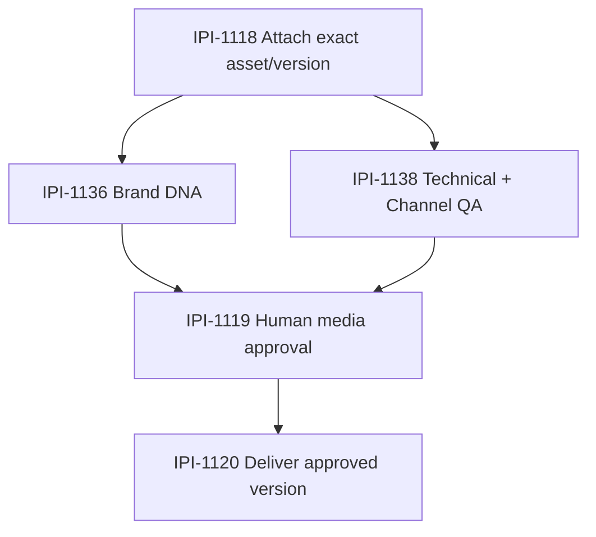

### QA lifecycle

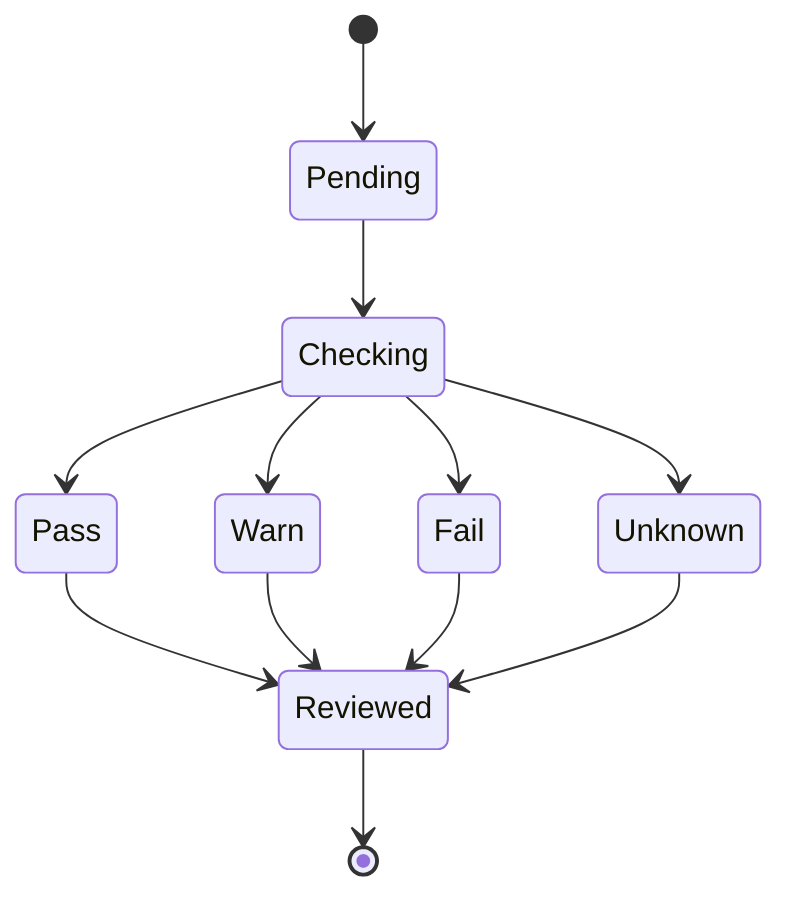

### Test strategy — cheapest proof first

```text
static channel-spec/asset audit
→ pure deterministic table-driven tests
→ boundary tests for exact dimensions/aspect ratios
→ unknown/missing-spec tests
→ Cloudinary metadata adapter tests
→ vision adapter tests only where used
→ Org A allow / Org B deny
→ provider/API timeout fallback
→ typecheck
→ build
→ browser asset-review proof
```

### Production-ready acceptance criteria

- [ ] Exact immutable asset/version is checked; not a mutable latest alias.
- [ ] Asset belongs to the authenticated org and correct saved shoot.
- [ ] Only channels/formats actually requested by the shoot/campaign context are evaluated.
- [ ] Channel dimensions/safe zones come from current trusted iPix source data/config; model memory is never the source of truth.
- [ ] Deterministic checks run before vision inference where practical.
- [ ] Results are bounded and schema-validated: status, finding code, severity, evidence, recommended action, checker/version.
- [ ] Missing spec/metadata yields `unknown/not evaluated`, never fabricated readiness guidance.
- [ ] Cloudinary quality/accessibility analysis is reused when available instead of duplicating the capability.
- [ ] Cloudinary Analyze API/add-ons remain optional and are not required for deterministic MVP QA.
- [ ] Org A cannot run/read QA for Org B assets or signed URLs.
- [ ] QA cannot approve, publish, deliver, mutate Brand Brain, or modify channel specs.
- [ ] DNA and QA can run concurrently after [IPI-1118](https://linear.app/amo100/issue/IPI-1118/shoot-assets-001-attach-uploaded-assets-to-the-correct-saved-shoot).
- [ ] Same asset/version + same QA contract can be safely retried without duplicate side effects.
- [ ] Existing upload/attach/approval/delivery flows regress zero.
- [ ] Unit/integration/security/typecheck/build/browser proof green.

### Technical Research & Reference Pack

\| Reference \| What it provides \| Exact iPix use \| What to reuse \| Custom code avoided \| Limits/cost \|
\| -- \| -- \| -- \| -- \| -- \| -- \|
\| [https://cloudinary.com/documentation/analyze_assets](<https://cloudinary.com/documentation/analyze_assets>) \| Built-in quality/accessibility/semantic media analysis \| Reuse existing media QA signals \| quality/accessibility/image analysis fields \| Custom quality engine \| Availability/features vary \|
\| [https://cloudinary.com/documentation/analyze_api_guide](<https://cloudinary.com/documentation/analyze_api_guide>) \| Optional structured AI analysis + exact `asset_id` source \| Semantic QA only when deterministic rules are insufficient \| asset_id, JSON Schema response, async tasks \| Custom CV transport \| Public Beta; add-on subscription may be required \|
\| [https://cloudinary.com/documentation/transformation_reference](<https://cloudinary.com/documentation/transformation_reference>) \| Canonical media transformations \| Validate/produce named delivery profiles instead of custom image processing \| Cloudinary transforms \| Custom resizing/cropping service \| Existing account limits apply \|
\| [https://cloudinary.com/documentation/admin_api](<https://cloudinary.com/documentation/admin_api>) \| Exact media metadata \| Resolve width/height/format/version/metadata server-side \| Admin API metadata \| Duplicate media inventory \| Server-only credentials \|
\| [https://docs.copilotkit.ai/agent-spec/human-in-the-loop](<https://docs.copilotkit.ai/agent-spec/human-in-the-loop>) \| Human review boundary \| Findings inform [IPI-1119](https://linear.app/amo100/issue/IPI-1119/media-approval-001-approve-or-reject-the-exact-cloudinary-asset) approval \| HITL pattern \| Autonomous/custom approval \| Approval remains separate \|

### Failure points / red flags

* Hard-coded Instagram/TikTok/etc. dimensions copied from model knowledge.
* Vision model used for simple width/height/aspect checks.
* ASSET-DNA forced to finish before QA even though checks are independent.
* QA automatically changes approval/delivery state.
* Custom image transformations duplicate Cloudinary.
* Missing spec silently treated as pass.

---

# ASSET-QA-001 — Check Asset Quality and Channel Readiness Before Approval

## Purpose

Before an operator approves a shoot asset, check the exact asset version for technical quality and channel readiness so obvious delivery problems are caught early.

## Faster/better approach

Reuse Cloudinary metadata/named transforms, current channel spec data, deterministic geometry checks first, and vision AI only where deterministic checks cannot answer reliably. Do not build a second image-processing pipeline or generic QA platform.

## User journey

```text
uploaded exact asset version
→ attached to saved shoot
→ Brand DNA analysis ∥ technical/channel QA
→ operator reviews findings
→ approve/reject exact version
→ deliver/use downstream
```

## User value

Example:

```text
Instagram Feed — Ready 92/100
✓ Aspect ratio valid
✓ Resolution sufficient
✓ Subject inside safe area
⚠ Headroom close to crop boundary

TikTok — Needs adjustment 68/100
✕ Wrong aspect ratio
⚠ Text too close to lower UI safe zone
```

The system recommends. The operator decides.

## Checks

Prefer deterministic checks where possible:

* dimensions/resolution
* aspect ratio
* file format / delivery compatibility
* named transform availability
* crop/safe-zone geometry
* text/subject bounds when reliable metadata exists
* duplicate/obviously broken asset metadata

Use vision analysis only for checks such as:

* subject/face unintentionally cropped
* product obscured
* obvious blur/exposure problems
* visual text outside a practical safe area when geometry alone is insufficient

Channel specs must come from current iPix source-of-truth data/config. Never invent platform dimensions or safe zones.

## Scope

### In

* Audit current Cloudinary metadata, named transforms, channel specs, and historical asset QA implementation first
* Resolve the exact asset version through trusted shoot/asset ownership
* Evaluate readiness for only the channels/formats actually requested by the shoot/campaign context
* Return structured status, score, findings, severity, recommended action, and evidence
* Reuse `IPI-172 · AI-EVIDENCE-001 — Persist Provider-Neutral Evidence and Citations for iPix AI Decisions` when durable evidence is needed
* Surface findings in the current asset review UI before operator approval

### Out

* Automatic asset approval
* Automatic publishing
* Replacing Cloudinary transforms
* Rebuilding channel preview UI
* Generic computer-vision platform
* Brand DNA scoring itself — owned by `IPI-1136 · ASSET-DNA-001 — Analyze Uploaded Shoot Assets Against the Approved Brand Brain`

## Security

* Server derives organization and verifies shoot/asset ownership
* Browser asset/channel IDs are locators, not authorization
* Org A cannot inspect Org B asset metadata or signed delivery URLs
* No Cloudinary/provider secrets in browser code

## Dependencies / sequence

```text
IPI-1116 upload
→ IPI-1118 attach
   ├→ IPI-1136 ASSET-DNA-001 ─┐
   └→ IPI-1138 ASSET-QA-001 ──┤
                               ↓
                    IPI-1119 approve/reject
                               ↓
                    IPI-1120 deliver
```

DNA and QA are parallel evidence gates after attach; neither blocks the other.

Related:

* `IPI-1136 · ASSET-DNA-001 — Analyze Uploaded Shoot Assets Against the Approved Brand Brain`
* `IPI-172 · AI-EVIDENCE-001 — Persist Provider-Neutral Evidence and Citations for iPix AI Decisions`
* `IPI-338 · CHANNEL-PREVIEW-001 — Preview Approved Campaign Content Before Publishing`

## Acceptance criteria

- [ ] Current asset/channel spec sources are audited before adding new logic
- [ ] Exact asset version is checked, not a mutable/latest alias
- [ ] Requested channel requirements are loaded from current trusted iPix data/config
- [ ] Deterministic checks are used before vision inference where practical
- [ ] Result includes pass/warn/fail findings and actionable explanation
- [ ] Missing channel/spec data returns unknown/not-evaluated, never fabricated guidance
- [ ] Org A cannot run/read QA for Org B assets
- [ ] QA never approves, publishes, or mutates Brand Brain autonomously
- [ ] Existing upload/attach/DNA/approval/delivery flows regress zero
- [ ] Targeted tests, typecheck, build, and one browser asset-review proof pass

## Verification

```text
current-code/data audit
→ deterministic QA unit tests
→ vision check tests only where needed
→ channel-spec mapping tests
→ org allow/deny integration
→ exact-version proof
→ typecheck/build
→ browser review proof
```

## Done definition

Done means an operator can open an exact uploaded asset version and see trustworthy channel-specific technical readiness findings before deciding whether to approve it. | Backlog |  | High | dec7d249-6d54-4d04-ba20-46e31aede088 | v2-ipix | ai@socialmediaville.ca |  | AI, CLOUDINARYV2, COPILOTKITV2, DASHV2, MASTRAV2, MVP2 |  |  |  |  | 2026-09-01T17:42:01.534Z | 2026-09-01T18:04:25.986Z |  |  |  |  |  | 2026-09-08T17:42:02.879Z | IPI-1097 | iPix V2 — AI-Native Production Platform | 436520b7-15e2-49af-8293-bf32137359e4 | M3 · Production — Approve, Produce & Deliver a Shoot | MediumRisk | fcab538c-f44a-4a9a-8d4b-1ceb1a4fc8ec | 29 | IPI-338, IPI-1040, IPI-1136, IPI-172 | IPI-1118 |  |
| IPI-1137 | iPix1 | IPI-1137 · SHOOT-BRIEF-IMPORT-001 — Turn an Existing Shoot Brief or PDF Into Editable Planner Context | ## AUTHORITATIVE AUDIT CORRECTION — 2026-09-01

**Status:** Optional M3 input path. Implement only after the Production Planner and canonical Planner-context contract exist. This ticket must plug into that contract; it must not create a second context database, document platform, or shoot-save path.

### Faster/better approach

Audit the current upload/file handling and installed dependencies first. For machine-readable PDFs, prefer the smallest page-aware extraction path already available in the stack. Use schema-validated AI extraction only after text/source extraction. Use OCR **only** when the PDF is actually image-only/scanned and the normal extraction path proves insufficient.

```text
existing private file/reference
→ page-aware source extraction
→ typed ShootBriefDraft
→ operator review/edit
→ explicit context approval
→ IPI-1087 canonical Planner context
→ normal IPI-1081 plan flow
```

Do not create a shoot from import. Do not treat extracted facts as truth before review.

### Hard dependencies

* `IPI-1048 · PLANNER-001 — Make the Production Planner the Main iPix AI Assistant` — the target Planner must exist.
* `IPI-1087 · PLANNER-CONTEXT-001 — Keep the Active Brand and Shoot Brief Available During Planning` — this owns the canonical Planner-context path; import feeds it rather than inventing a parallel system.
* This task is **optional**. It must not block `IPI-1081 · PLAN-001 — Make the Planner Return a Complete Structured Shoot Plan`; operators can plan without an uploaded brief.
* `IPI-172 · AI-EVIDENCE-001 — Persist Provider-Neutral Evidence and Citations for iPix AI Decisions` may be reused for durable source/page provenance when needed; do not duplicate its evidence contract.

### Two separate human decisions

```text
Brief import:
AI extracts → operator reviews/edits → operator approves context

Shoot planning:
Planner proposes ShootPlan → operator reviews/edits → IPI-1084 approves/rejects → IPI-1083 saves
```

Approval of imported **context** is not approval of the generated ShootPlan.

### Source-of-truth boundaries

* Existing iPix private file/media ownership remains file truth; do not create a generic DMS.
* Supabase owns tenant-safe document/reference metadata and approved context if current data model requires durability.
* Mastra owns structured extraction/mapping into the existing Planner contract.
* CopilotKit/UI owns editable review and approval interaction.
* Approved Planner context flows through [IPI-1087](https://linear.app/amo100/issue/IPI-1087/ipi-1087-planner-context-001-keep-the-active-brand-and-shoot-brief).

### Skills + MCP gate

`ipix-task-lifecycle → worktrees → graphify → research → fashion-production → mastra → copilotkit → ipix-supabase → nextjs-developer → tdd → mermaid-diagrams → code-review → task-verifier → pr-workflow`

Run `cloudinary` only if the current file audit proves briefs/PDFs are represented as Cloudinary raw assets. Use Linear for blockers, GitHub/code search + Graphify for current file/context paths, Supabase MCP read-only for file/document ownership and RLS, Context7/current official docs for parser/model APIs. Do not use Cloudflare skills.

### Verify-before-implement

1. Search current routes/components for upload/file/document/PDF handling.
2. Inspect `package.json`/lockfile and installed source for a page-aware PDF parser or supported model file-input path.
3. Inspect Supabase tables/storage buckets/asset records that can safely reference a private brief.
4. Inspect [IPI-1087](https://linear.app/amo100/issue/IPI-1087/ipi-1087-planner-context-001-keep-the-active-brand-and-shoot-brief) context type and [IPI-1081](https://linear.app/amo100/issue/IPI-1081/ipi-1081-plan-001-make-the-planner-return-a-complete-structured-shoot) ShootPlan input contract.
5. Determine whether source/page provenance is required to persist; reuse [IPI-172](https://linear.app/amo100/issue/IPI-172/ipi-172-ai-evidence-001-persist-provider-neutral-evidence-and) if yes.
6. Choose the least-custom extraction route based on evidence.

**Current repository audit note (2026-09-01):** direct dependencies include Mastra, CopilotKit, Supabase, Zod and `@ai-sdk/openai`, but no dedicated PDF parser is declared in the inspected `package.json`. Do not assume a parser exists; verify lockfile/transitive/runtime APIs before adding one.

### Decision tree

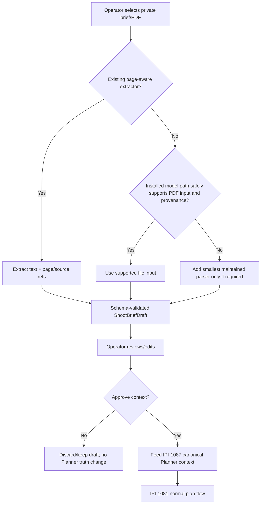

### Context state lifecycle

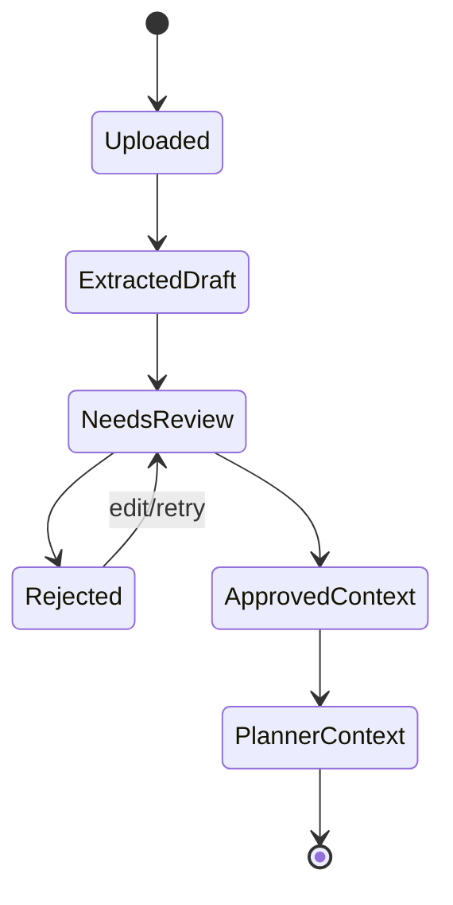

### Exact implementation plan — no code until audit passes

1. Reuse existing secure file selection/upload surface.
2. Resolve the file through server-derived org authorization.
3. Extract source text/page refs with the selected existing/smallest mechanism.
4. Map only fields supported by current Planner context schema into `ShootBriefDraft`; unknowns remain explicit.
5. Show source references and editable values in the existing Planner/operator UI.
6. Persist draft/approval only if retry/refresh/user journey requires it and current domain storage supports it.
7. On explicit approval, write/attach only the approved context through [IPI-1087](https://linear.app/amo100/issue/IPI-1087/ipi-1087-planner-context-001-keep-the-active-brand-and-shoot-brief)'s canonical path.
8. Continue to [IPI-1081](https://linear.app/amo100/issue/IPI-1081/ipi-1081-plan-001-make-the-planner-return-a-complete-structured-shoot); no automatic shoot/save/booking/payment/publish.

### Test strategy — cheapest proof first

```text
static dependency/file/context audit
→ pure mapping/schema tests
→ representative machine-readable PDF fixture
→ ambiguous/missing-field tests
→ source/page provenance tests
→ malformed/oversized/unsupported-file tests
→ Org A allow / Org B deny
→ reject = zero approved-context writes
→ retry/refresh idempotency
→ typecheck
→ build
→ browser import → edit → approve context → Planner proof
```

If scanned PDFs are later supported, add one explicit scanned fixture and OCR failure test; do not make OCR a hidden dependency for normal PDFs.

### Production-ready acceptance criteria

- [ ] Existing file/PDF/context implementation and dependencies audited first.
- [ ] The selected extraction mechanism is documented with version/current API evidence.
- [ ] Supported file type/size limits are explicit and enforced server-side.
- [ ] Private brief ownership is resolved from authenticated tenant context; browser IDs are locators only.
- [ ] Machine-readable PDFs use page/source-aware extraction where feasible.
- [ ] OCR is used only for proven image-only input and has an explicit failure/unknown path.
- [ ] `ShootBriefDraft` uses a bounded Zod/schema contract derived from current Planner context fields.
- [ ] Every ambiguous/unsupported field is marked unresolved; the system never invents client requirements.
- [ ] Operator can edit every extracted planning field before approval.
- [ ] Rejection creates zero approved Planner-context writes.
- [ ] Approval writes/attaches context only through [IPI-1087](https://linear.app/amo100/issue/IPI-1087/ipi-1087-planner-context-001-keep-the-active-brand-and-shoot-brief)'s canonical context path.
- [ ] Import never creates a shoot, booking, payment, campaign, or publication.
- [ ] Refresh/retry does not duplicate an approved context association.
- [ ] Org A cannot access/import Org B files/context/source text.
- [ ] Provider/parser failures are visible and retryable without losing the original private file.
- [ ] Unit/integration/security/typecheck/build/browser proof green.
- [ ] Rollback is documented: remove import/context association without deleting the original source file unless separately requested.

### Technical Research & Reference Pack

\| Reference \| What it provides \| Exact iPix use \| What to reuse \| Custom code avoided \| Limits/cost \|
\| -- \| -- \| -- \| -- \| -- \| -- \|
\| [https://ai-sdk.dev/cookbook/next/generate-object-with-file-prompt](<https://ai-sdk.dev/cookbook/next/generate-object-with-file-prompt>) \| Official Next.js file/PDF → schema-validated object pattern \| Reference option if the installed/provider path supports PDF input \| server-side file handling + structured output pattern \| Custom multipart/model plumbing \| Verify installed direct dependencies/provider support before use \|
\| [https://ai-sdk.dev/docs/ai-sdk-core/generating-structured-data](<https://ai-sdk.dev/docs/ai-sdk-core/generating-structured-data>) \| Schema-validated structured extraction \| Map extracted brief data into `ShootBriefDraft` \| Zod/JSON Schema validation \| Manual JSON parsing \| Model/provider support varies \|
\| [https://mastra.ai/docs/agents/mcp-guide](<https://mastra.ai/docs/agents/mcp-guide>) \| Typed Mastra tool pattern \| Wrap extraction/mapping as the smallest Planner capability if needed \| `createTool` schemas \| Custom tool framework \| Installed Mastra source/types win \|
\| [https://supabase.com/docs/guides/database/postgres/row-level-security](<https://supabase.com/docs/guides/database/postgres/row-level-security>) \| Tenant isolation \| Protect any persisted draft/context/document metadata \| RLS + server-derived ownership \| App-only auth filters \| New DDL follows [IPI-1040](https://linear.app/amo100/issue/IPI-1040/ipi-1040-migration-001-prove-new-ipix-database-changes-can-be-added) \|
\| [https://docs.copilotkit.ai/agent-spec/human-in-the-loop](<https://docs.copilotkit.ai/agent-spec/human-in-the-loop>) \| Review/approval interaction \| Editable draft must be human-approved before Planner context \| official HITL pattern \| Autonomous import/custom approval protocol \| Context approval remains separate from plan approval \|

### Failure points / red flags

* New `planner_context_imports` architecture created before inspecting [IPI-1087](https://linear.app/amo100/issue/IPI-1087/ipi-1087-planner-context-001-keep-the-active-brand-and-shoot-brief).
* Model directly reads a file and writes shoot truth without editable review.
* OCR used for every PDF.
* Page/source provenance discarded when available.
* Duplicate file/document storage introduced unnecessarily.
* Brief approval confused with ShootPlan approval.
* Import becomes a hard blocker for operators who start from scratch.

---

# SHOOT-BRIEF-IMPORT-001 — Turn an Existing Shoot Brief or PDF Into Editable Planner Context

## Purpose

Let an operator bring an existing client/creative shoot brief into iPix instead of retyping it. iPix extracts structured planning context, shows the operator what it understood, and nothing becomes saved shoot truth until the operator reviews/approves it.

## Faster/better approach

Reuse the current Planner, current upload/file handling, existing PDF/text extraction capability if already installed, approved Brand Brain, and current Mastra structured-output tools. Do not create a separate document-processing platform or autonomous import pipeline.

## User journey

```text
Operator uploads/selects brief
→ extract text/structured facts
→ map into Planner context
→ show editable review
→ operator corrects/approves
→ Planner uses approved context
→ later shoot plan/save flow continues normally
```

## Input examples

* PDF creative brief
* production brief
* client shot list
* text/markdown brief where current upload surface supports it

## Structured context

Extract only fields supported by the current Planner/shoot contract, for example:

```text
campaign / shoot objective
brand / product
required deliverables
channels/formats
shot requirements
locations
model/talent requirements
styling / creative direction
schedule/deadlines
budget constraints
special instructions
source references / page numbers
```

Unknown or ambiguous values remain unresolved and are surfaced for operator review; do not invent them.

## Scope

### In

* Audit current `ipixai` file/PDF handling and Planner context contract first
* Reuse an existing parser/SDK/module before adding custom extraction
* Extract structured draft context with source/page references where possible
* Associate the draft with the trusted organization/brand/session
* Present an editable review before use as approved planning context
* Feed approved values into the existing Planner context path
* Preserve original file/reference according to current media/document ownership rules

### Out

* Automatic shoot creation
* Automatic budget/payment/publishing
* Generic enterprise document management
* New RAG platform
* Cloudflare Worker dependency
* Treating model extraction as authoritative truth

## Security

* Server derives the authenticated org/user context
* Uploaded file IDs/brand IDs are locators, not authorization
* Org A cannot import/read Org B documents
* Private files remain private
* No provider/file-service secrets in browser code
* Extracted content is a draft until human approval

## Human approval rule

```text
AI extracts
→ operator reviews/edits
→ operator approves
→ approved context becomes Planner input
```

No consequential write from extraction alone.

## Acceptance criteria

- [ ] Current Planner context/schema and existing file/PDF capabilities are audited first
- [ ] Operator can provide a supported existing shoot brief/PDF
- [ ] System returns structured editable draft context with provenance/page references where available
- [ ] Unsupported/ambiguous facts are clearly marked instead of fabricated
- [ ] Operator can edit before approval
- [ ] Planner receives only approved/reviewed context
- [ ] Org A cannot read/import Org B files or attach them to Org A planning
- [ ] Import does not create a shoot, booking, payment, or publish anything automatically
- [ ] Refresh/retry does not duplicate an approved import if persistence is used
- [ ] Targeted tests, typecheck, build, and one browser import→review→Planner proof pass

## Related v2 tasks

* [IPI-1081](https://linear.app/amo100/issue/IPI-1081/ipi-1081-plan-001-make-the-planner-return-a-complete-structured-shoot) · PLAN-001 — Make the Planner Return a Complete Structured Shoot Plan
* [IPI-1087](https://linear.app/amo100/issue/IPI-1087/ipi-1087-planner-context-001-keep-the-active-brand-and-shoot-brief) · PLANNER-CONTEXT-001 — Keep the Active Brand and Shoot Brief Available During Planning
* [IPI-1084](https://linear.app/amo100/issue/IPI-1084/ipi-1084-approval-001-let-operators-review-edit-approve-or-reject-ai) · APPROVAL-001 — Let Operators Review, Edit, Approve, or Reject AI Plans Before Anything Is Saved
* [IPI-1083](https://linear.app/amo100/issue/IPI-1083/ipi-1083-shoot-save-001-save-an-approved-shoot-once-and-under-the) · SHOOT-SAVE-001 — Save an Approved Shoot Once and Under the Correct Organization
* [IPI-172](https://linear.app/amo100/issue/IPI-172/ipi-172-ai-evidence-001-persist-provider-neutral-evidence-and) · AI-EVIDENCE-001 — Persist Provider-Neutral Evidence and Citations for iPix AI Decisions

## Verification

```text
current-code/dependency audit
→ parser/extractor unit tests
→ structured mapping tests
→ org allow/deny integration
→ approval-state test
→ typecheck/build
→ browser upload/import/review/Planner proof
```

## Done definition

Done means an operator can import a real shoot brief, correct what iPix extracted, approve it, and then use that reviewed context in the Planner without retyping the brief or allowing unreviewed AI extraction to become application truth. | Backlog |  | High | dec7d249-6d54-4d04-ba20-46e31aede088 | v2-ipix | ai@socialmediaville.ca |  | AI, COPILOTKITV2, HITL, MASTRAV2, MVP2, SHOOT, SUPAV2 |  |  |  |  | 2026-09-01T17:38:23.520Z | 2026-09-01T18:03:37.778Z |  |  |  |  |  | 2026-09-08T17:38:24.919Z | IPI-1079 | iPix V2 — AI-Native Production Platform | 436520b7-15e2-49af-8293-bf32137359e4 | M3 · Production — Approve, Produce & Deliver a Shoot | MediumRisk | 481f9e80-0e53-440e-b4f4-cc8c6ec23617 | 33 | IPI-1040, IPI-1081, IPI-1084, IPI-1083, IPI-172 | IPI-1087, IPI-1048 |  |
| IPI-1136 | iPix1 | IPI-1136 · ASSET-DNA-001 — Analyze Uploaded Shoot Assets Against the Approved Brand Brain | ## AUTHORITATIVE AUDIT CORRECTION — 2026-09-01

**Status:** Ready after prerequisites. This task is an analysis gate inside the existing media journey; it is not a new media store, vision platform, or approval engine.

### Faster/better approach

Reuse exact Cloudinary asset identity/version + approved Brand Knowledge + current asset review UI. Run deterministic/media metadata checks first, then only the minimum vision analysis needed for brand-fit questions. Prefer existing Cloudinary metadata/analysis and the installed Mastra tool pattern before custom image-processing code.

```text
IPI-1116 upload
→ IPI-1118 attach exact asset/version to saved shoot
→ IPI-1136 ASSET-DNA
→ IPI-1119 human approve/reject
→ IPI-1120 deliver
```

`IPI-1138 · ASSET-QA-001 — Check Asset Quality and Channel Readiness Before Approval` runs **in parallel** with this task after attach; DNA and QA do not block one another.

### Hard dependencies

* `IPI-1118 · SHOOT-ASSETS-001 — Attach Uploaded Assets to the Correct Saved Shoot` — exact trusted shoot/asset/version relationship must exist first.
* `IPI-1128 · BRAND-KNOWLEDGE-001 — Give AI Decisions Approved Brand Evidence With Citations` — approved Brand evidence is the reference contract; do not analyze against draft/unapproved Brand Brain.
* This task **blocks **`IPI-1119 · MEDIA-APPROVAL-001 — Approve or Reject the Exact Cloudinary Asset Version` because the operator must see the requested DNA result before final media approval.
* `IPI-172 · AI-EVIDENCE-001 — Persist Provider-Neutral Evidence and Citations for iPix AI Decisions` is reusable evidence infrastructure/contract; do not duplicate it. If [IPI-172](https://linear.app/amo100/issue/IPI-172/ipi-172-ai-evidence-001-persist-provider-neutral-evidence-and) persistence is not yet done, use its typed envelope contract locally and persist only where current domain storage safely supports it.

### Source-of-truth boundaries

* Cloudinary owns bytes, immutable asset identity/version and media metadata.
* Supabase owns iPix asset/shoot/brand relationships and durable review records.
* Approved Brand Knowledge owns brand-reference evidence.
* Mastra owns typed analysis orchestration/tooling.
* CopilotKit/UI presents findings; **human decides** approve/reject.

### Skills + MCP gate

Run task-relevant skills only:

`ipix-task-lifecycle → worktrees → graphify → research → cloudinary → fashion-production → mastra → copilotkit → ipix-supabase → tdd → mermaid-diagrams → code-review → task-verifier → pr-workflow`

Use Cloudinary MCP read/search for current asset metadata/analysis capabilities, Supabase MCP read-only for ownership/RLS, GitHub/code search for existing DNA/compliance logic, Linear for live blockers, Context7/official docs for current APIs. Do not use Cloudflare skills.

### Exact implementation plan — no code until audit passes

1. Graphify/search existing asset review, DNA/compliance scoring, Brand Knowledge and Cloudinary metadata code.
2. Confirm canonical exact asset/version identity and saved-shoot relationship from [IPI-1118](https://linear.app/amo100/issue/IPI-1118/shoot-assets-001-attach-uploaded-assets-to-the-correct-saved-shoot).
3. Confirm the approved Brand Knowledge read contract and tenant authorization.
4. Define bounded typed result: overall score/status, dimensions of fit, findings, confidence, evidence, analysis version.
5. Reuse deterministic metadata/features before vision inference.
6. Use one Mastra tool/capability for analysis; do not create one agent per score.
7. Normalize durable evidence through [IPI-172](https://linear.app/amo100/issue/IPI-172/ipi-172-ai-evidence-001-persist-provider-neutral-evidence-and) contract when persistence is required.
8. Render result in existing media review UI beside the exact asset version.
9. Keep approval/rejection exclusively in [IPI-1119](https://linear.app/amo100/issue/IPI-1119/media-approval-001-approve-or-reject-the-exact-cloudinary-asset).

### User/architecture sequence

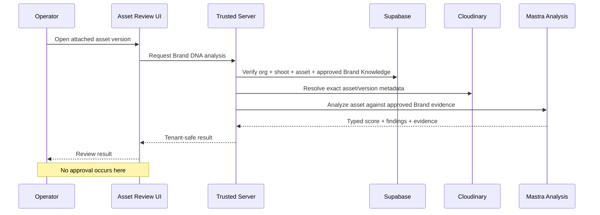

### Test strategy — cheapest proof first

```text
static ownership/schema/code audit
→ pure score/result schema tests
→ provider/vision adapter contract tests
→ exact-version lookup integration
→ missing Brand Knowledge / unknown result test
→ Org A allow / Org B deny
→ provider timeout/failure fallback
→ typecheck
→ build
→ browser exact-asset review proof
```

### Production-ready acceptance criteria

- [ ] Current code/schema and historical DNA logic audited before new implementation.
- [ ] Exact Cloudinary `asset_id`/version is the analysis target; mutable latest aliases are not sufficient proof.
- [ ] Asset is attached to the correct saved shoot before analysis.
- [ ] Only approved Brand Knowledge is used as brand truth.
- [ ] Result is schema-validated and bounded: status/score, findings, confidence/evidence, analysis version.
- [ ] Missing Brand Knowledge or unsupported analysis returns `unknown/not evaluated`, never invented fit claims.
- [ ] Org A cannot request/read Org B analysis, metadata, asset URL, or Brand Knowledge.
- [ ] Deterministic/Cloudinary metadata is reused before custom vision inference where it answers the question.
- [ ] Cloudinary Analyze API/add-ons are optional enhancements, not a hidden MVP dependency.
- [ ] Analysis does not approve, publish, deliver, mutate Brand Brain, or create a second media record.
- [ ] [IPI-1138](https://linear.app/amo100/issue/IPI-1138/asset-qa-001-check-asset-quality-and-channel-readiness-before-approval) QA may run concurrently; no artificial DNA→QA serialization.
- [ ] Existing upload/attach/approval/delivery tests regress zero.
- [ ] Failure/retry is idempotent for the same exact asset/version and analysis contract.
- [ ] Unit/integration/security/typecheck/build/browser proof green.

### Technical Research & Reference Pack

\| Reference \| What it provides \| Exact iPix use \| What to reuse \| Custom code avoided \| Limits/cost \|
\| -- \| -- \| -- \| -- \| -- \| -- \|
\| [https://cloudinary.com/documentation/analyze_assets](<https://cloudinary.com/documentation/analyze_assets>) \| Existing asset analysis options/metadata \| Reuse media analysis before custom CV \| quality/accessibility/semantic analysis options \| Separate analysis pipeline \| Some features/add-ons vary by plan \|
\| [https://cloudinary.com/documentation/analyze_api_guide](<https://cloudinary.com/documentation/analyze_api_guide>) \| Analyze API, asset_id input, structured schema, async workflow \| Optional brand-fit visual analysis on exact Cloudinary asset \| immutable `asset_id`, JSON-schema responses, async task pattern \| Custom image-hosting/analysis transport \| Public Beta; relevant add-on subscription required \|
\| [https://cloudinary.com/documentation/admin_api](<https://cloudinary.com/documentation/admin_api>) \| Exact asset metadata/identity \| Resolve trusted asset/version metadata server-side \| Admin API asset identity/metadata \| Duplicate media catalog \| Server-side credentials only \|
\| [https://mastra.ai/docs/agents/mcp-guide](<https://mastra.ai/docs/agents/mcp-guide>) \| Typed Mastra tools \| One bounded analysis tool/capability \| `createTool` + Zod contracts \| Custom tool framework \| Verify installed version/types \|
\| [https://docs.copilotkit.ai/agent-spec/human-in-the-loop](<https://docs.copilotkit.ai/agent-spec/human-in-the-loop>) \| Human decision gate \| Keep analysis advisory; approval is separate \| official HITL pattern \| Autonomous approval/custom protocol \| Approval remains [IPI-1119](https://linear.app/amo100/issue/IPI-1119/media-approval-001-approve-or-reject-the-exact-cloudinary-asset) \|

### Failure points / red flags

* Analyzing public_id/latest instead of exact immutable asset/version.
* Using draft Brand Brain or another organization's Brand evidence.
* Making Cloudinary Analyze API Beta/add-on a mandatory launch dependency.
* Letting DNA score automatically approve an asset.
* Duplicating [IPI-172](https://linear.app/amo100/issue/IPI-172/ipi-172-ai-evidence-001-persist-provider-neutral-evidence-and) evidence persistence or [IPI-1138](https://linear.app/amo100/issue/IPI-1138/asset-qa-001-check-asset-quality-and-channel-readiness-before-approval) QA logic.
* Raw provider/Cloudinary secrets in browser/logs.

---

# ASSET-DNA-001 — Analyze Uploaded Shoot Assets Against the Approved Brand Brain

## Purpose

After shoot assets are uploaded and attached to the correct shoot, analyze each exact asset version against the approved Brand Brain before the operator approves it for delivery or campaign use.

## Faster/better approach

Reuse current Cloudinary asset metadata/transform pipeline, approved Brand Brain truth, existing historical DNA/compliance patterns, and the current Mastra/CopilotKit stack. Do not build a second media store, generic vision platform, or autonomous approval agent.

## User journey

```text
Cloudinary upload
→ attach exact version to shoot
→ retrieve approved Brand Brain
→ analyze visual/brand fit
→ return DNA/compliance score + evidence
→ operator reviews
→ approve/reject exact version
→ deliver/use downstream
```

## User value

An operator should immediately understand whether an asset matches the brand and why.

Example:

```text
Brand fit: 91/100
Visual language: 95
Color/lighting: 90
Product prominence: 88
Tone: 92

Evidence
✓ Matches approved warm-neutral palette
✓ Product remains primary subject
⚠ Background styling is busier than Brand Brain guidance
```

The score assists the operator; it does not approve the asset automatically.

## Scope

### In

* Inspect current asset/Brand Brain schema and existing historical DNA implementation first
* Analyze the exact Cloudinary asset version attached to a saved shoot
* Use approved Brand Brain only as the canonical brand reference
* Produce structured score(s), findings, confidence, and evidence
* Persist the analysis only if current data model requires durable review/audit
* Reuse `IPI-172 · AI-EVIDENCE-001 — Persist Provider-Neutral Evidence and Citations for iPix AI Decisions` for durable evidence shape when applicable
* Surface results in the existing asset/shoot review UI
* Human approves/rejects separately

### Out

* Automatic approval/publishing
* Replacing Cloudinary as media truth
* Rebuilding Brand Intelligence
* Generic RAG platform
* Cross-org asset analysis
* Channel-specific crop/readiness QA unless required by this Brand DNA analysis

## Security

* Server derives active organization and verifies shoot/asset/brand ownership
* Browser asset IDs are locators, not authorization
* Org A asset can never be analyzed using Org B Brand Brain or returned to Org B
* Signed/private Cloudinary access only where required
* No provider or Cloudinary secrets in browser code

## Acceptance criteria

- [ ] Exact asset version is resolved from the trusted shoot/asset relationship
- [ ] Approved Brand Brain is the reference source
- [ ] Analysis returns structured score, findings, confidence, and evidence
- [ ] Missing/insufficient Brand Brain returns a clear non-fabricated result
- [ ] Org A cannot analyze or read Org B assets/Brand Brain
- [ ] Operator can review the result before approval/rejection
- [ ] Analysis never approves, publishes, or mutates Brand Brain autonomously
- [ ] Existing asset upload/attach/approval flows regress zero
- [ ] Targeted tests, typecheck, build, and one real asset browser proof pass

## Dependencies / related

Expected sequence:

```text
IPI-1116 upload
→ IPI-1118 attach to shoot
→ ASSET-DNA-001 analyze
→ IPI-1119 approve/reject
→ IPI-1120 deliver
```

Related:

* [IPI-172](https://linear.app/amo100/issue/IPI-172/ipi-172-ai-evidence-001-persist-provider-neutral-evidence-and) · AI-EVIDENCE-001 — Persist Provider-Neutral Evidence and Citations for iPix AI Decisions
* [IPI-1093](https://linear.app/amo100/issue/IPI-1093/ipi-1093-brand-intel-001-turn-a-brand-website-into-an-approved-brand) · BRAND-INTEL-001 — Turn a Brand Website Into an Approved Brand DNA Profile
* [IPI-1131](https://linear.app/amo100/issue/IPI-1131/ipi-1131-brand-check-001-check-copy-and-media-against-the-approved) · BRAND-CHECK-001 — Check Copy and Media Against the Approved Brand Brain

## Verification

```text
current-code/schema audit
→ deterministic contract tests
→ vision/analysis tool test
→ org allow/deny integration
→ exact-version persistence/read proof if used
→ typecheck/build
→ browser review proof
```

## Done definition

Done means an operator can open a real uploaded shoot asset, see a tenant-safe evidence-backed Brand DNA assessment of that exact version, and then independently approve or reject it. | Backlog |  | High | dec7d249-6d54-4d04-ba20-46e31aede088 | v2-ipix | ai@socialmediaville.ca |  | AI, BRANDV2, CLOUDINARYV2, COPILOTKITV2, HITL, MASTRAV2, MVP2 |  |  |  |  | 2026-09-01T17:37:55.989Z | 2026-09-01T18:03:50.532Z |  |  |  |  |  | 2026-09-08T17:37:58.458Z | IPI-1097 | iPix V2 — AI-Native Production Platform | 436520b7-15e2-49af-8293-bf32137359e4 | M3 · Production — Approve, Produce & Deliver a Shoot | MediumRisk | db3f58ea-df8c-4a53-b9ae-c434ea146af2 | 34 | IPI-1040, IPI-1138, IPI-1120, IPI-1116, IPI-172, IPI-1093, IPI-1131 | IPI-1118, IPI-1128 |  |
| IPI-1135 | iPix1 | IPI-1135 · IPI-EPIC · LEARNING — Turn Proven Results Into Reviewed Brand Improvements | ## Purpose

Own the feedback loop after measurement is trustworthy.

Measurement answers: **What happened?**
Learning answers: **What should we change?**

## Journey

trusted deterministic metric snapshot
→ approved Brand Knowledge/evidence
→ Mastra structured analysis
→ evidence-backed proposed Brand Brain diff
→ CopilotKit review
→ human edit/reject/approve
→ one atomic audited Brand Brain version update

## Initial child

* `IPI-1133 · LEARN-001 — Recommend Brand Brain Improvements From Real Campaign Results`

## Rules

* M5 Measurement must be proven first.
* Correlation is not causation.
* Unsupported metrics remain absent/null.
* No autonomous Brand Brain writes.
* AI proposes; human approves; deterministic server code executes; Supabase records the result.
* Do not create a separate AI Analytics dashboard here.

## Exit

A real campaign result can produce an evidence-backed Brand Brain improvement proposal that an operator can inspect, edit, reject, or explicitly approve; approval creates exactly one audited new Brand Brain version. | Backlog |  | High | dec7d249-6d54-4d04-ba20-46e31aede088 | v2-ipix | ai@socialmediaville.ca |  | AI, BRANDV2, CAMPAIGNV2, COPILOTKITV2, Feature, HITL, MASTRAV2, POSTMVP2, SUPAV2 |  |  |  |  | 2026-09-01T15:54:56.738Z | 2026-09-01T15:59:33.716Z |  |  |  |  |  | 2026-09-08T15:54:57.646Z |  | iPix V2 — AI-Native Production Platform | b5f3c25f-55d3-45e4-b498-6114c697bb94 | M6 · Learning — Improve the Brand From Proven Results | MediumRisk | 06316791-ec7d-4d9d-bcfe-e3573714a232 | 137 |  |  |  |
| IPI-1134 | iPix1 | IPI-1134 · IPI-EPIC · BRAND STRATEGY — Research Markets and Find Brand Opportunities | ## Purpose

Own the strategy layer that consumes approved Brand truth and external evidence to identify where a brand should go next.

This epic is intentionally separate from `IPI-1099 · IPI-EPIC · BRAND — Browse Brands and Approve Brand DNA`:

`BRAND = what the brand is`
`BRAND STRATEGY = where the brand should go`

## Journey

approved Brand Brain / Brand Knowledge
→ cited competitor/trend/market research
→ candidate opportunities
→ deterministic/evidence-backed ranking against the brand
→ operator selects an opportunity
→ Campaigns & Publishing consumes the approved opportunity

## Initial children

* `IPI-36 · BRAND-RESEARCH-001 — Research Competitors, Trends, and Market Opportunities With Evidence`
* `IPI-1129 · BRAND-OPPORTUNITY-001 — Rank Market Opportunities Against Each Brand`

## Rules

* Reuse approved Brand Knowledge; do not create a second Brand Brain.
* One research workflow, not separate competitor/trend/social agent fleets.
* Citations/evidence required.
* Opportunity ranking must preserve evidence and limitations.
* No campaign creation here; Campaigns & Publishing owns execution.

## Exit

An operator can move from an approved brand profile to a ranked, evidence-backed opportunity that can start campaign strategy. | Backlog |  | High | dec7d249-6d54-4d04-ba20-46e31aede088 | v2-ipix | ai@socialmediaville.ca |  | AI, BRANDV2, COPILOTKITV2, Feature, MASTRAV2, POSTMVP2, SUPAV2 |  |  |  |  | 2026-09-01T15:54:14.557Z | 2026-09-01T15:59:22.796Z |  |  |  |  |  | 2026-09-08T15:54:15.896Z |  | iPix V2 — AI-Native Production Platform | b0a0a530-8f04-4791-a3af-1105af56f1b7 | M4 · Campaigns — Turn Opportunities Into Published Campaigns | MediumRisk | b6f99ceb-8b12-4aba-8f34-296a4cbbfdae | 137 |  |  |  |
| IPI-1133 | iPix1 | IPI-1133 · LEARN-001 — Recommend Brand Brain Improvements From Real Campaign Results | # LEARN-001 — Recommend Brand Brain Improvements From Real Campaign Results

## Faster/better approach

Do not create an “AI Analytics” dashboard or let an agent interpret raw provider data directly. Reuse `IPI-1073 · ANALYTICS-001 — Bring the Existing Analytics Workspace Into the New App Without Fake Metrics` as the deterministic metrics layer, then add one narrow learning workflow that proposes evidence-backed Brand Brain changes for human review.

Execution order:

`live Linear → current ipixai main → Graphify analytics/brand/campaign paths → verify IPI-1073 deterministic metrics contract → Supabase read-only schema/RLS → inspect Postiz/Stripe/Cloudinary metric attribution already normalized by analytics → installed Mastra/CopilotKit types → official analytics/reference repos/docs → smallest typed learning workflow → pure evidence tests → HITL review → versioned Brand Brain update only after approval`.

Before custom code ask: **Is there a better, faster, more efficient way using existing iPix analytics queries, Brand Knowledge, campaign/result tables, Postiz metrics, Stripe attribution, Cloudinary asset/version references, Supabase views/RPCs, Mastra workflow primitives, CopilotKit diff UI, or official maintained examples?** Use deterministic data and existing modules before adding new analytics infrastructure.

## Purpose

Turn real campaign outcomes into proposed Brand Brain improvements without silently mutating approved Brand truth.

```text
real deterministic metrics
→ evidence-backed analysis
→ proposed Brand Brain diff
→ operator review
→ approve / reject / edit
→ atomic versioned Brand Brain update
```

Human approval is mandatory.

## Hard dependencies

1. `IPI-1073 · ANALYTICS-001 — Bring the Existing Analytics Workspace Into the New App Without Fake Metrics` proven with honest real metrics.
2. `IPI-1093 · BRAND-INTEL-001 — Turn a Brand Website Into an Approved Brand DNA Profile` proven approval/versioning contract.
3. `IPI-1128 · BRAND-KNOWLEDGE-001 — Give AI Decisions Approved Brand Evidence With Citations` for evidence lookup/explanations.
4. Published campaign/result data available from `IPI-195 · PUBLISH-001 — Publish Only Approved Campaign Content Through Postiz` when social performance is part of the learning evidence.

Parent: `IPI-1135 · IPI-EPIC · LEARNING — Turn Proven Results Into Reviewed Brand Improvements`. `IPI-1099 · IPI-EPIC · BRAND — Browse Brands and Approve Brand DNA` remains the upstream owner of approved Brand truth.

## Data rule

Inputs must be real and attributable. Initial supported sources:

```text
Supabase counts / campaign facts
Postiz delivery/performance metrics when available and normalized
Cloudinary asset_id + exact version references
Stripe revenue only when campaign attribution is genuinely proven
```

Unsupported metrics stay null/absent. No fabricated CTR, reach, conversions, revenue, ROAS, causality, or “why it sold”.

## Learning contract

Each proposal must contain:

```text
proposal_id
brand_id
source_campaign_ids[]
metric_snapshot_version
proposed_path
current_value
proposed_value
reason
evidence[]
confidence
limitations[]
status = draft \| approved \| rejected
created_at
```

Examples:

```text
Proposed change:
Voice > CTA style

Current:
Avoid promotional urgency.

Proposed:
Allow restrained scarcity language for launch campaigns.

Evidence:
3 approved launch campaigns using restrained scarcity
+18% attributable click-through vs baseline
No increase in Brand Check warnings

Limitations:
Only 3 campaigns; no causal proof.
```

## Critical inference rule

Correlation is not causation.

The workflow may say:

`Campaigns using X were associated with higher measured engagement in this sample.`

It may not say:

`X caused higher engagement`

unless a valid experiment/causal design actually supports that claim.

## Architecture

```mermaid
flowchart LR
  M[Deterministic metrics from IPI-1073] --> A[Mastra learning analysis]
  K[Approved Brand Knowledge] --> A
  C[Campaign/content/asset versions] --> A
  A --> P[Typed Brand Brain proposal]
  P --> UI[CopilotKit diff + evidence review]
  UI --> H{Human decision}
  H -->\|Reject\| R[Keep current Brand Brain]
  H -->\|Edit\| P
  H -->\|Approve\| V[Atomic versioned Brand Brain update]
  V --> DB[(Supabase approved Brand Brain + audit)]
```

### User journey

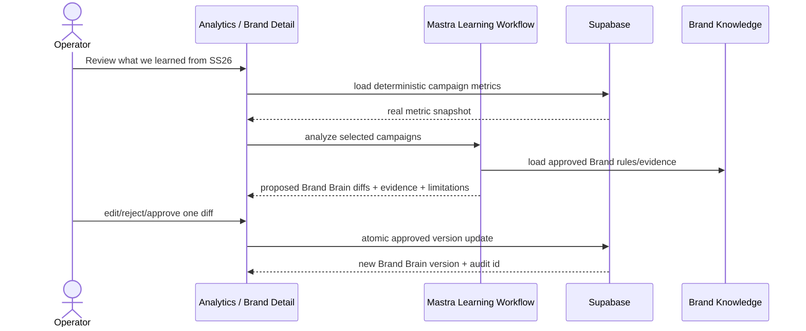

## UI / screens

Do not create a separate AI Analytics app.

Primary surfaces:

* `/app/analytics/campaigns` — `Learning candidates` / `What changed?` entry point after real metrics exist.
* SCR-03 Brand Detail — `Learning` or `History` section showing proposed/approved Brand Brain diffs.

Recommended card:

```text
Learning proposal

Voice / CTA style
Current: Avoid promotional urgency
Proposed: Allow restrained scarcity for launch campaigns

Evidence
• Campaign SS26 Launch A — measured CTR +18% vs baseline
• Campaign SS26 Launch B — measured CTR +11%
• No Brand Check failures

Confidence: Medium
Limitations: 3 campaigns; observational data

[View metrics] [Edit] [Reject] [Approve change]
```

## Frontend features

* typed diff cards
* exact metric/evidence links
* confidence + limitations
* current vs proposed value
* approve/reject/edit per proposal
* version history
* no “AI says this will improve revenue” language without evidence
* desktop + ~390px mobile

## Backend features

* trusted active org/brand resolution
* deterministic metric snapshot input only
* campaign/content/asset version references
* evidence-backed structured analysis
* typed proposal output
* stale-snapshot detection
* atomic approved Brand Brain update using existing [IPI-1093](https://linear.app/amo100/issue/IPI-1093/ipi-1093-brand-intel-001-turn-a-brand-website-into-an-approved-brand) approval/version contract
* audit trail containing proposal, approver, evidence, before/after version
* no autonomous write

## pgvector / Cloudinary / Postiz / Stripe

* pgvector may retrieve approved Brand evidence through `IPI-1128`; it does not generate metrics or authorize data.
* Cloudinary contributes exact asset/version identity, not engagement truth.
* Postiz metrics should be normalized by the analytics layer before learning; LEARN-001 should not build a second Postiz analytics pipeline.
* Stripe revenue is accepted only when campaign attribution is explicit and verifiable; otherwise revenue remains un-attributed.

## Multi-step implementation prompt

### 0. Start gate

1. Prove [IPI-1073](https://linear.app/amo100/issue/IPI-1073/ipi-1073-analytics-001-bring-the-existing-analytics-workspace-into-the) displays real deterministic data and honest nulls.
2. Prove Brand Brain approval/version update path from [IPI-1093](https://linear.app/amo100/issue/IPI-1093/ipi-1093-brand-intel-001-turn-a-brand-website-into-an-approved-brand).
3. Inspect current analytics queries, campaign tables, Brand profile/version structures, and RLS.
4. Run `ipix-task-lifecycle → worktrees → graphify → task-verifier Quick`.
5. If source metrics are mocked, non-attributable, or not tenant-safe, return **BLOCKED**.

### 1. Reuse audit

1. Graphify analytics → campaign → Brand paths.
2. Inspect existing metric helpers/views before SQL additions.
3. Inspect Supabase Dashboard/CLI read-only for campaign/result tables and RLS.
4. Inspect Postiz/Stripe/Cloudinary integrations only to confirm metric identity/attribution already available.
5. Inspect official PostHog/Metabase/Grafana patterns for ideas only; do not add them unless a proven gap requires them.

### 2. Define deterministic metric snapshot

Create a typed input containing only measured values plus provenance:

```text
metric_name
value
unit
source
campaign_id
content_version?
asset_id/version?
time_window
attribution_method
measured_at
```

Unknown values remain absent/null.

### 3. Build evidence analysis

1. Compare repeated patterns across campaigns.
2. Require minimum sample/evidence thresholds configurable in code.
3. Separate observation from recommendation.
4. Produce limitations explicitly.
5. No numeric confidence unless rubric is documented.

### 4. Diff generation

Generate proposed changes against exact current Brand Brain paths. Reject proposals that target unknown/non-versioned fields.

### 5. HITL

CopilotKit renders exact before/after diff + evidence. Approval must be explicit per proposal. Batch approval only if each exact diff is visible and independently auditable.

### 6. Save

Use the existing Brand Brain approval/version contract. Revalidate current Brand version before write; stale proposal must be regenerated/reviewed.

### 7. Verification

`pure metric/provenance tests → analysis fixture tests → stale-version tests → Supabase/RLS allow+deny → Mastra structured-output tests → CopilotKit diff/HITL tests → typecheck → relevant app tests → build → browser desktop/mobile → task-verifier Full → code/security review → one PR`.

## Real-world tests

 1. Missing CTR stays null and never appears in reasoning.
 2. Postiz impressions with no conversion attribution cannot become revenue claims.
 3. Stripe revenue with no campaign attribution is excluded from campaign learning.
 4. Three campaigns show higher measured engagement with restrained CTA; proposal says association, not causation.
 5. One outlier campaign does not trigger a high-confidence Brand rule rewrite.
 6. Conflicting campaign results produce low confidence/limitations.
 7. Operator rejects proposal → Brand Brain unchanged.
 8. Operator edits proposal then approves → exact edited value is saved.
 9. Brand Brain changes after proposal creation → stale proposal cannot apply silently.
10. Retry approval creates one version update, not duplicates.
11. Org A cannot analyze or update Org B Brand Brain.
12. Multi-org active A remains A-only.
13. Tampered campaign/brand ids fail closed.
14. pgvector result from another org is never returned.
15. No Postiz publish call.
16. No Cloudinary mutation.
17. No Stripe mutation.
18. No automatic Brand Brain write from analytics ingestion/background job.
19. Every approved change stores before/after/evidence/approver/version.
20. ~390px + desktop diff review is usable.

## Production-ready checklist

- [ ] real metrics only
- [ ] every metric has provenance
- [ ] unsupported KPIs remain null
- [ ] attribution method explicit
- [ ] correlation vs causation language enforced
- [ ] typed Brand Brain diff
- [ ] evidence + limitations visible
- [ ] stale proposal protection
- [ ] explicit HITL approval
- [ ] atomic versioned update + audit
- [ ] tenant isolation proven
- [ ] no autonomous mutation
- [ ] targeted tests + RLS + typecheck + build + browser + CI + verifier pass

Any fabricated metric, unsupported attribution, causal overclaim, cross-org leak, stale diff application, or autonomous Brand Brain mutation = **FAIL**.

## Skills / MCP sequence

Verify exact names in `.claude/skills/index-skills.md`, then use:

`ipix-task-lifecycle → worktrees → graphify → research → mastra → copilotkit → ipix-supabase → nextjs-developer → tdd → code-review → task-verifier → pr-workflow → linear`.

MCP/tool order:

`Linear → GitHub/current repo → Graphify → installed source/types → Supabase Dashboard/CLI/read-only → Postiz/Stripe/Cloudinary source verification as needed → official analytics references → tests → browser proof`.

## Official/reference URLs

* [https://github.com/amoai-tech/ipixai](<https://github.com/amoai-tech/ipixai>)
* [https://github.com/PostHog/posthog](<https://github.com/PostHog/posthog>)
* [https://github.com/PostHog/posthog.com](<https://github.com/PostHog/posthog.com>)
* [https://github.com/metabase/metabase](<https://github.com/metabase/metabase>)
* [https://github.com/apache/superset](<https://github.com/apache/superset>)
* [https://github.com/grafana/grafana](<https://github.com/grafana/grafana>)
* [https://github.com/plausible/analytics](<https://github.com/plausible/analytics>)
* [https://github.com/umami-software/umami](<https://github.com/umami-software/umami>)
* [https://posthog.com/docs/product-analytics](<https://posthog.com/docs/product-analytics>)
* [https://www.metabase.com/docs/latest/](<https://www.metabase.com/docs/latest/>)
* [https://superset.apache.org/docs/intro](<https://superset.apache.org/docs/intro>)
* [https://grafana.com/docs/grafana/latest/](<https://grafana.com/docs/grafana/latest/>)
* [https://supabase.com/docs/guides/database/postgres/row-level-security](<https://supabase.com/docs/guides/database/postgres/row-level-security>)

## Done definition

```text
real campaign results
→ deterministic metric snapshot
→ evidence-backed proposed Brand Brain diff
→ operator review/edit/reject
→ explicit approve
→ one atomic versioned Brand Brain update
→ audit trail
```

Final verifier: **PASS / FAIL / BLOCKED**, scores /100 for correctness, security, attribution quality, efficiency, and verification confidence. | Backlog |  | High | dec7d249-6d54-4d04-ba20-46e31aede088 | v2-ipix | ai@socialmediaville.ca |  | AI, BRANDV2, CAMPAIGNV2, COPILOTKITV2, Feature, HITL, MASTRAV2, POSTMVP2, SUPAV2 |  |  |  |  | 2026-09-01T13:10:36.449Z | 2026-09-01T17:37:29.415Z |  |  |  |  |  | 2026-09-08T13:10:37.770Z | IPI-1135 | iPix V2 — AI-Native Production Platform | b5f3c25f-55d3-45e4-b498-6114c697bb94 | M6 · Learning — Improve the Brand From Proven Results | MediumRisk | 68e6c8be-b920-4ff9-a163-4d3ccd8caf22 | 301 | IPI-172 | IPI-1128, IPI-1093, IPI-195, IPI-1073 |  |
| IPI-1131 | iPix1 | IPI-1131 · BRAND-CHECK-001 — Check Copy and Media Against the Approved Brand Brain | # BRAND-CHECK-001 — Check Copy and Media Against the Approved Brand Brain

## Faster/better approach

Build one advisory validation capability over existing approved Brand Knowledge, campaign copy drafts, and exact approved media versions. Do **not** build a generic policy engine, another Brand agent fleet, or autonomous approval system.

Execution order:

`live Linear → current ipixai main → Graphify Brand/campaign/media paths → installed Mastra/CopilotKit source/types → Supabase read-only evidence/RLS → Cloudinary approved metadata/analysis capabilities → official docs/examples → smallest typed validator → pure rule tests → targeted AI/evidence tests → browser proof`.

Before custom code ask: **Is there a better, faster, more efficient way to satisfy each check using an existing approved Brand rule, deterministic validator, current iPix component, Cloudinary metadata/analysis, Supabase query/RPC, Mastra tool/workflow, CopilotKit card pattern, vendor dashboard/MCP/CLI, official SDK, or maintained example?** Use the cheaper deterministic proof before model judgment.

## Purpose

Give operators an evidence-backed advisory review before campaign content can move toward approval/publishing.

Example:

```text
Voice              96
Claims             100
Product facts      100
Visual rules        94
Audience fit        92
Channel rules       89

Issue:
CTA is more promotional than approved voice.

Evidence:
Voice rule V-12
```

Human approval remains mandatory. A high score never publishes or auto-approves content.

## Dependencies

Hard gates:

1. `IPI-77 · CAMPAIGN-COPY-001 — Create Brand-Safe Channel Copy From Approved Assets and Strategy`
2. `IPI-1128 · BRAND-KNOWLEDGE-001 — Give AI Decisions Approved Brand Evidence With Citations`
3. `IPI-1120 · MEDIA-DELIVERY-001 — Deliver Only Approved Named-Transform Asset Versions` for media checks

Parent: `IPI-1105 · IPI-EPIC · CAMPAIGNS & PUBLISHING — Campaigns, Preview, and Publish`.

## Validation contract

Start with these dimensions only when supported by approved Brand Brain fields/evidence:

```text
voice
claims
product_facts
visual_rules
audience_fit
channel_rules
```

Every dimension returns:

```text
status = pass \| warn \| fail \| insufficient_evidence
score? 0..100 only when rubric is explicit
issues[]
evidence_ids[]
rule_ids[]
reason
validator_version
```

### Scoring rule

Do not ask an LLM for an authoritative arbitrary `96`.

Preferred order:

1. deterministic pass/fail/range/keyword/claim/product/channel checks;
2. evidence lookup against approved Brand Knowledge;
3. Cloudinary metadata/analysis for visual facts where available;
4. model-assisted semantic judgment only for inherently subjective dimensions such as tone/voice fit;
5. deterministic aggregation from typed outcomes where a numeric score is useful.

If no documented rubric exists, show `pass/warn/fail/insufficient_evidence` rather than invented precision.

## Architecture

```mermaid
flowchart LR
  C[Campaign Copy Draft] --> V[Brand Check]
  A[Exact approved asset versions] --> V
  K[Approved Brand Knowledge + evidence] --> V
  D[Deterministic validators] --> V
  CLD[Optional Cloudinary metadata/analysis] --> V
  V --> R[Typed findings + evidence]
  R --> UI[CopilotKit Brand Check panel]
  UI --> H{Human decision}
  H -->\|Edit\| C
  H -->\|Approve later\| P[Channel Preview / approval path]
```

### User journey

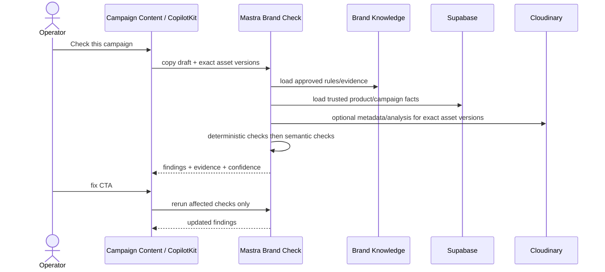

## Screens / UI

Primary surface: Campaign detail → `Content` and `Preview`; no new top-level Compliance application.

Recommended panel:

```text
Brand Check

Voice             PASS / 96
Claims            PASS
Product facts     PASS
Visual rules      WARN
Audience fit      PASS
Channel rules     WARN

2 issues
- CTA too promotional — Voice V-12
- Instagram caption exceeds configured rule — Channel IG-03

[View evidence] [Fix] [Run again]
```

CopilotKit renders typed findings/evidence cards and can help apply an operator-selected fix. The operator remains the decision maker.

## Frontend features

* dimension status/score cards
* issue list with severity
* source/rule evidence drawer
* `Fix` action scoped to one field
* rerun affected check only
* exact asset-version display
* clear advisory status; never imply legal/platform certification
* desktop + ~390px mobile

## Backend features

* trusted active org/brand/campaign resolution
* load approved Brand Knowledge/evidence only
* deterministic copy validators
* product fact/claim comparison against durable Supabase truth
* exact approved media metadata only
* optional Cloudinary analysis for visual checks
* semantic voice/audience check with structured output
* typed findings/versioning
* no publish, approval, Brand Brain, media mutation, or shoot side effect

## Cloudinary rule

Cloudinary can provide metadata/analysis/moderation signals, but it does not become Brand truth. Prefer existing asset metadata first. Cloudinary's Moderation/Analysis capabilities are optional accelerators; plan-dependent features must not become a hard requirement.

## pgvector rule

Use tenant-safe Brand evidence retrieval through `IPI-1128` when semantic evidence lookup is necessary. RLS/authorization must apply before vector retrieval. pgvector is not the validator and not an authorization mechanism by itself.

## OpenClaw

Not part of this product runtime, labels, or critical path.

## Multi-step implementation prompt

### 0. Start gate

1. Verify dependencies are proven with real approved copy/assets/evidence.
2. Read Campaign epic, Brand Knowledge contract, media approval/delivery contract, AGENTS, `.claude/skills/index-skills.md`.
3. Run task lifecycle, clean worktree, Graphify, task-verifier Quick.
4. If exact approved Brand/media evidence cannot be resolved tenant-safely, **BLOCKED**.

### 1. Inventory rules before code

1. Inspect `brands.ai_profile` / approved Brand Brain schema and actual fields.
2. List which checks can be deterministic today.
3. List which checks require evidence retrieval.
4. List which visual checks can use existing Cloudinary metadata.
5. Only then decide whether a model-assisted check is needed.

### 2. Build deterministic validators first

Implement pure validators for factual claims, configured channel constraints, required fields, product facts, banned/required vocabulary, and exact asset approval/version.

### 3. Add evidence-backed semantic checks

For voice/audience/visual semantics that cannot be deterministic, use structured model output tied to exact Brand evidence. No citation/evidence → `insufficient_evidence` or warning, not a confident pass.

### 4. UI

Render typed findings and evidence. A `Fix` action proposes an edit to one selected field and preserves all unrelated operator edits.

### 5. Persistence

Prefer transient/recomputable findings or current typed campaign result structures first. Add durable check history only when publishing/audit requirements prove it necessary. Any DDL routes through `IPI-1040 · MIGRATION-001`.

### 6. Verification

`pure deterministic tests → evidence fixture tests → structured model tests → exact-media tests → Supabase/RLS allow+deny → targeted Mastra integration → CopilotKit state tests → typecheck → relevant app tests → build → browser desktop/mobile → task-verifier Full → code/security review → one PR`.

## Real-world tests

 1. Approved Brand says avoid discount language; `50% OFF TODAY` produces fail/warn with exact rule evidence.
 2. Approved voice permits restrained CTA; compliant variant passes.
 3. Invented product material/price is flagged against Supabase product facts.
 4. Unsupported claim has no evidence and cannot receive confident PASS.
 5. Exact approved asset v3 passes media eligibility; unapproved v4 does not inherit v3 status.
 6. Visual rule requires neutral background; known asset metadata conflicts → warning/fail.
 7. Missing visual metadata yields `insufficient_evidence`, not invented 94.
 8. Two conflicting Brand rules are surfaced as contradiction.
 9. Operator fixes CTA; rerun changes only relevant dimension.
10. Same deterministic inputs + validator version produce same deterministic result.
11. Org A cannot validate against Org B Brand rules/assets.
12. Multi-org active A remains A-only.
13. Tampered IDs fail closed.
14. No Brand Brain write.
15. No Cloudinary mutation.
16. No Postiz call.
17. No campaign approval is performed by the validator.
18. 390px + desktop usable.

## Production-ready checklist

- [ ] deterministic checks used before AI
- [ ] exact approved Brand evidence
- [ ] exact approved asset versions
- [ ] no unsupported numeric precision
- [ ] every issue has evidence/rule or explicit insufficient evidence
- [ ] tenant isolation proven
- [ ] advisory only; human approval remains mandatory
- [ ] no external side effects
- [ ] targeted tests + RLS + typecheck + build + browser + CI + verifier pass

Any fabricated evidence, arbitrary authoritative score, cross-org leak, silent approval, or side effect = **FAIL**.

## Skills / MCP sequence

Verified repo skills include `mastra`, `copilotkit`, `ipix-supabase`, `nextjs-developer`, `linear`, `task-verifier`, `pr-workflow`, `worktrees`, `cloudinary`, `graphify`, `research`, `tdd`.

Use:

`ipix-task-lifecycle → worktrees → graphify → research → mastra → copilotkit → ipix-supabase → cloudinary → nextjs-developer → tdd → code-review → task-verifier → pr-workflow → linear`.

MCP/tool order:

`Linear → GitHub/current repo → Graphify → installed source/types → Supabase Dashboard/CLI/read-only → Cloudinary Dashboard/MCP/Analysis → official docs/examples → tests → browser proof`.

## Official references

* [https://github.com/mastra-ai/mastra](<https://github.com/mastra-ai/mastra>)
* [https://docs.copilotkit.ai/mastra/shared-state](<https://docs.copilotkit.ai/mastra/shared-state>)
* [https://docs.copilotkit.ai/mastra/generative-ui/tool-rendering](<https://docs.copilotkit.ai/mastra/generative-ui/tool-rendering>)
* [https://supabase.com/docs/guides/database/postgres/row-level-security](<https://supabase.com/docs/guides/database/postgres/row-level-security>)
* [https://supabase.com/docs/guides/ai/rag-with-permissions](<https://supabase.com/docs/guides/ai/rag-with-permissions>)
* [https://cloudinary.com/documentation/asset_management](<https://cloudinary.com/documentation/asset_management>)
* [https://cloudinary.com/documentation/cloudinary_moderation](<https://cloudinary.com/documentation/cloudinary_moderation>)
* [https://cloudinary.com/documentation/moderate_assets](<https://cloudinary.com/documentation/moderate_assets>)
* [https://cloudinary.com/documentation/structured_metadata](<https://cloudinary.com/documentation/structured_metadata>)
* [https://github.com/cloudinary/cloudinary_npm](<https://github.com/cloudinary/cloudinary_npm>)
* [https://github.com/amoai-tech/ipixai](<https://github.com/amoai-tech/ipixai>)

## Done definition

```text
copy + exact approved media + approved Brand Brain
→ deterministic/evidence-backed checks
→ typed issues + sources
→ operator edits
→ rerun
→ content remains draft until separate human approval
```

Final verifier must return **PASS / FAIL / BLOCKED**, score /100 for correctness/security/efficiency/verification confidence, evidence links, remaining risks, next task. | Backlog |  | High | dec7d249-6d54-4d04-ba20-46e31aede088 | v2-ipix | ai@socialmediaville.ca |  | AI, BRANDV2, CAMPAIGNV2, CLOUDINARYV2, COPILOTKITV2, Feature, MASTRAV2, POSTMVP2, SUPAV2 |  |  |  |  | 2026-09-01T12:43:10.060Z | 2026-09-01T17:37:55.989Z |  |  |  |  |  | 2026-09-08T12:43:11.342Z | IPI-1105 | iPix V2 — AI-Native Production Platform |  |  | MediumRisk | b5fe6109-fee7-4c5d-b0e4-eeafd3f3f8e0 | 328 | IPI-1136, IPI-172, IPI-1105 | IPI-1120, IPI-77, IPI-1128 |  |
| IPI-1129 | iPix1 | IPI-1129 · BRAND-OPPORTUNITY-001 — Rank Market Opportunities Against Each Brand | # BRAND-OPPORTUNITY-001 — Rank Market Opportunities Against Each Brand

## Faster/better approach

Do not build a new “AI scoring platform.” Reuse the approved Brand Brain/Brand Knowledge and the cited output from `IPI-36 · BRAND-RESEARCH-001 — Research Competitors, Trends, and Market Opportunities With Evidence`.

Use this order:

`live Linear → current ipixai code/data → Graphify/load-bearing scoring paths → live Supabase read-only → existing score helpers/tables → installed Mastra/CopilotKit types → official docs/examples → smallest pure scoring function + thin workflow/UI → targeted tests → typecheck/build → browser proof`.

Before custom code ask: **Is there a better, faster, more efficient way using an existing iPix score helper, typed schema, database field, dashboard/CLI, prebuilt module, official SDK/template, GitHub example, or maintained recipe?** Reuse it when it meets the same proof standard.

The model may identify candidate opportunities and extract evidence. **The model must not invent the final numeric score.** Final dimension scores and overall score must be produced by explicit, versioned application logic from traceable inputs.

## Purpose

Turn cited market research into a short, explainable ranked list of opportunities for one approved brand.

Real-world example:

```text
Metallic accessories

Trend momentum       91
Brand fit            94
Audience fit         89
Competitive gap      82
Evidence confidence  90

Overall              90/100
```

The operator must be able to open each dimension and see **why** it received that score, the underlying evidence, data freshness, and the scoring version.

## Dependencies

Hard gates:

1. `IPI-36 · BRAND-RESEARCH-001 — Research Competitors, Trends, and Market Opportunities With Evidence`
2. `IPI-1128 · BRAND-KNOWLEDGE-001 — Give AI Decisions Approved Brand Evidence With Citations`

Parent: `IPI-1134 · IPI-EPIC · BRAND STRATEGY — Research Markets and Find Brand Opportunities`. `IPI-1099 · IPI-EPIC · BRAND — Browse Brands and Approve Brand DNA` remains upstream owner of approved Brand truth.

This task should eventually feed Campaign Strategy, but it does not create or approve campaign strategy itself.

## Existing data to reuse first

Current live iPix already has:

* approved Brand Brain/profile + `brand_scores`
* `brand_competitors`
* `brand_social_channels`
* `brand_agent_results.output jsonb`
* Brand graph/evidence/vector structures

Do **not** overload existing `brand_scores` if it is serving Brand DNA scoring. First prove whether opportunity results can safely live as typed/versioned output in `brand_agent_results`. Add a dedicated `brand_opportunities` table only if the real workflow requires stable opportunity identity, query/filter lifecycle, downstream campaign references, or approval state. Any DDL goes through `IPI-1040 · MIGRATION-001 — Prove New iPix Database Changes Can Be Added Without Replaying Old Migrations`.

## Scoring contract

Start with five dimensions unless code/product evidence proves a better minimal set:

1. `trend_momentum`
2. `brand_fit`
3. `audience_fit`
4. `competitive_gap`
5. `evidence_confidence`

Every dimension is `0..100` and must return:

```text
score
reason
input signals
source/evidence ids
freshness
confidence
scoring_version
```

### Deterministic rule

The overall score must be an explicit versioned function such as:

```text
overall = weighted_score(dimension_scores, weights_vN)
```

Do **not** hard-code arbitrary weights merely to make the UI work. Before release, verify whether an existing iPix score policy already defines weights. If none exists, define a small documented `weights_v1` product contract and test it. The same inputs + same scoring version must always produce the same score.

AI can classify/normalize evidence into typed signals, but code validates ranges and computes dimension/overall results. If a dimension lacks enough evidence, return `insufficient_evidence` rather than a fake score.

## Architecture

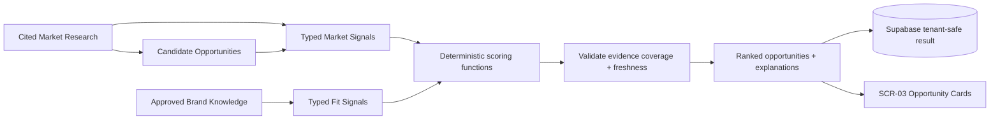

### Score explainability

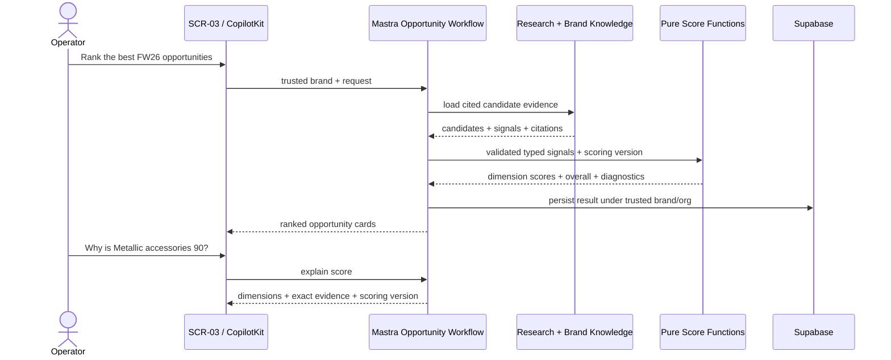

## User surface

Do not create a separate top-level Opportunities application for the first slice.

Reuse SCR-03 Brand Detail / Research area:

```text
Top opportunities

1. Metallic accessories        90
2. Editorial tailoring         84
3. Quiet-luxury gifting        79

[Why 90?] [View evidence] [Use for campaign]
```

`Use for campaign` may prepare a handoff object, but any consequential campaign creation/save remains owned by the future Campaign Strategy/Plan task and human approval rules.

CopilotKit should render structured score/evidence cards, not parse free-form prose to reconstruct scores.

## Multi-step implementation prompt

### 0. Start gate

1. Verify `IPI-36 · BRAND-RESEARCH-001 — Research Competitors, Trends, and Market Opportunities With Evidence` is proven with real citations and `IPI-1128` tenant-safe knowledge is proven.
2. Read current Brand epic, data docs, scoring helpers, Supabase policies, AGENTS/rules.
3. Clean `origin/main` worktree.
4. Run task-verifier Quick. If research evidence or Brand Knowledge is not stable enough to score, **BLOCKED**.

### 1. Discover before implementing

Graphify/search only:

* current Brand/score helpers and tests
* `brand_scores` semantics — determine whether it is Brand DNA only
* `brand_agent_results` usage
* [IPI-36](https://linear.app/amo100/issue/IPI-36/ipi-36-brand-research-001-research-competitors-trends-and-market) typed output contract
* [IPI-1128](https://linear.app/amo100/issue/IPI-1128/ipi-1128-brand-knowledge-001-give-ai-decisions-approved-brand-evidence) evidence/citation contract
* SCR-03 cards/components
* current Mastra workflow/tool registration
* current Supabase trusted org/brand server boundary

Do not add schema or a new agent before this audit.

### 2. Prototype scoring as pure code first

Before adding Mastra/UI/DB:

1. Define typed `OpportunitySignals`.
2. Define pure dimension-score functions.
3. Define explicit score bounds/missing-evidence behavior.
4. Define versioned weights/formula only after searching existing iPix policy.
5. Create fixture tests with known inputs/outputs.
6. Verify score monotonicity where expected.
7. Only then wrap scoring inside a Mastra tool/workflow.

This is cheaper and more reliable than debugging scoring through an LLM conversation.

### 3. Candidate extraction

Use research results as the source of candidate opportunities. Do not have another agent independently browse the web in this task.

Mastra may use a model to turn cited research into typed candidate signals, but:

* source IDs are required
* unsupported dimensions remain missing
* no source → no score for that dimension
* duplicates/near-duplicates are merged deterministically where practical
* the model cannot output authoritative final scores

### 4. Persist the smallest durable result

Prefer current `brand_agent_results.output` for the first proven slice if it satisfies retrieval, versioning, RLS, and downstream handoff.

Only add `brand_opportunities` when acceptance proof demonstrates the need for stable first-class records. If required, define the minimal table and migration through [IPI-1040](https://linear.app/amo100/issue/IPI-1040/ipi-1040-migration-001-prove-new-ipix-database-changes-can-be-added) with org/brand-safe RLS and audit/version fields.

### 5. UI / CopilotKit

Render structured cards from typed result data:

* opportunity title
* overall score
* dimension scores
* evidence confidence/freshness
* top supporting/contradicting evidence
* scoring version
* “Why?” expansion

No magic numbers in frontend components. No score recomputation with different logic in the browser.

### 6. Real-world tests

Required:

 1. **Determinism:** same signals + same version → exactly same dimension/overall scores.
 2. **Brand fit:** strong approved Brand Knowledge fit scores higher than an otherwise identical candidate with documented conflicts.
 3. **Trend momentum:** newer/multiple corroborating current signals beat a single stale weak signal according to the explicit rubric.
 4. **Competitive gap:** crowded competitor evidence does not score as a large gap.
 5. **Evidence confidence:** two high-quality corroborating sources beat one low-quality/old source.
 6. **Missing evidence:** missing audience evidence yields `insufficient_evidence` or documented reduced coverage, never a guessed `75`.
 7. **Contradictory evidence:** contradictory sources lower confidence or are surfaced according to deterministic contract.
 8. **Weight versioning:** changing `weights_v1` to `weights_v2` changes score only when version changes and both results remain reproducible.
 9. **Range validation:** invalid negative/>100 model-derived signal rejected before scoring.
10. **No model-final-score:** mock model returns `overall=99`; application ignores/rejects it and computes its own score.
11. **Org isolation:** Org A cannot load/store/rank Org B candidate evidence.
12. **Multi-org active context:** A+B membership with active A uses A only.
13. **Tampered brand ID:** fail closed with no score/result leak.
14. **No research duplication:** Opportunity workflow performs zero Gemini Search/Firecrawl calls when valid [IPI-36](https://linear.app/amo100/issue/IPI-36/ipi-36-brand-research-001-research-competitors-trends-and-market) research input is supplied.
15. **No Brand Brain write:** ranking cannot mutate approved profile/scores.
16. **Stable ordering:** ties have deterministic tie-break behavior.
17. **Frontend consistency:** displayed score exactly equals stored/backend result.
18. **Desktop/mobile:** opportunity and evidence cards usable at desktop and ~390px.

### 7. Verification order

```text
pure scoring unit tests
→ property/boundary tests
→ typed candidate-normalization tests
→ targeted Mastra workflow integration
→ DB/RLS allow+deny tests
→ typecheck
→ relevant app tests
→ build
→ SCR-03 browser proof
→ task-verifier Full
→ code/security review
→ one PR / green CI
```

No broad E2E until pure scoring correctness is proven.

## Acceptance criteria

- [ ] Candidate opportunities come from cited [IPI-36](https://linear.app/amo100/issue/IPI-36/ipi-36-brand-research-001-research-competitors-trends-and-market) research, not a duplicate search agent.
- [ ] Every numeric score has a documented deterministic calculation path and scoring version.
- [ ] AI does not own the authoritative final numeric score.
- [ ] Missing evidence does not become a guessed number.
- [ ] Each score can be explained with exact input signals/evidence.
- [ ] Results are scoped to trusted active org + brand.
- [ ] Existing data structures are reused until a first-class opportunity table is proven necessary.
- [ ] SCR-03 renders ranked typed cards and “Why?” evidence.
- [ ] No approved Brand Brain mutation.
- [ ] Unit/property/integration/RLS/typecheck/build/browser/CI/task-verifier gates pass.

Any nondeterministic authoritative score, fabricated evidence, cross-org leak, or frontend/backend score mismatch = **FAIL**.

## Skills / MCP sequence

Verify exact names first from `.claude/skills/index-skills.md`, then use when available:

`ipix-task-lifecycle → worktrees → graphify → ponytail/cheapest-proof-first → research → mastra → copilotkit → ipix-supabase → nextjs-developer → tdd → code-review → task-verifier → pr-workflow → linear`

MCP/tool order:

`Linear → GitHub/current repo → Graphify → installed source/types → Supabase read-only → official docs/examples → pure tests → workflow integration → browser proof`.

## Official/reference material to inspect

Current iPix repo:
[https://github.com/amoai-tech/ipixai](<https://github.com/amoai-tech/ipixai>)

Mastra official repo:
[https://github.com/mastra-ai/mastra](<https://github.com/mastra-ai/mastra>)

Mastra workflows:
[https://mastra.ai/blog/building-workflows](<https://mastra.ai/blog/building-workflows>)

Gemini structured outputs — useful for typed signal extraction, not truth/scoring:
[https://ai.google.dev/gemini-api/docs/structured-output](<https://ai.google.dev/gemini-api/docs/structured-output>)

Supabase RLS:
[https://supabase.com/docs/guides/database/postgres/row-level-security](<https://supabase.com/docs/guides/database/postgres/row-level-security>)

Supabase pgvector — retrieval/similarity where useful, not scoring authorization:
[https://supabase.com/docs/guides/database/extensions/pgvector](<https://supabase.com/docs/guides/database/extensions/pgvector>)

Historical iPix scoring/research issues should be inspected only for reusable rubric/code before creating anything new.

## Done definition

Done means the operator can trust and reproduce the ranking:

```text
cited research
→ typed candidate signals
→ deterministic versioned scoring
→ ranked cards
→ operator opens Why?
→ sees exact dimensions + evidence + formula version
→ same inputs reproduce same score
→ Org B evidence remains inaccessible
```

Final verifier must return **PASS / FAIL / BLOCKED**, correctness/security/efficiency/verification scores, evidence links, remaining risks, and exact next task. | Backlog |  | High | dec7d249-6d54-4d04-ba20-46e31aede088 | v2-ipix | ai@socialmediaville.ca |  | AI, BRANDV2, COPILOTKITV2, Feature, MASTRAV2, POSTMVP2, RLS, SUPAV2 |  |  |  |  | 2026-09-01T12:05:02.209Z | 2026-09-01T15:58:55.193Z |  |  |  |  |  | 2026-09-08T12:05:03.319Z | IPI-1134 | iPix V2 — AI-Native Production Platform | b0a0a530-8f04-4791-a3af-1105af56f1b7 | M4 · Campaigns — Turn Opportunities Into Published Campaigns | MediumRisk | acd01c8a-c953-4eac-9716-8cb05f1fe70c | 366 | IPI-1040, IPI-1099 | IPI-36, IPI-1128 |  |
| IPI-1128 | iPix1 | IPI-1128 · BRAND-KNOWLEDGE-001 — Give AI Decisions Approved Brand Evidence With Citations | # BRAND-KNOWLEDGE-001 — Give AI Decisions Approved Brand Evidence With Citations

## Faster/better approach

Inspect current `ipixai` first and reuse proven work before adding anything: live Linear → current GitHub `main` → load-bearing Brand/agent paths → live Supabase read-only catalog/RLS/RPC proof → installed Mastra/CopilotKit source/types → official docs → smallest implementation → targeted tests → typecheck/build → hosted/browser proof only if needed.

Do **not** build a generic RAG platform, new vector database, second Brand agent, or new top-level screen. Reuse the current Brand journey, Supabase pgvector, existing Brand evidence/crawl data, current Mastra runtime, and SCR-03 Brand Detail.

## Duplicate audit / why this is a new v2 owner

Reuse these as historical/reference work; do not reopen or rewrite their completion history:

* `IPI-924 · AGENT-RAG-001 — Let Brand Intelligence cite similar brands and past context` — **Done**, old `lumina-studio`; eight merged PRs proved similar-brand retrieval/UI and org-safe behavior.
* `IPI-922 · AGENT-DNA-001 — Explain Brand DNA with evidence and confidence` — **Done**, old `lumina-studio`; useful evidence-response shape.
* `IPI-144 · MASTRA-RAG-003 — Brand knowledge retrieval` — **Canceled**, old AI Platform project.
* `IPI-141 · AIOR-026 · RAG foundation (brand/asset/campaign KB)` — **Canceled** umbrella; too broad for v2.

This ticket owns the **current** `ipixai` **Brand evidence retrieval capability only**.

## Purpose

Let an operator ask why an approved Brand Brain rule exists and receive an answer grounded only in approved, tenant-safe evidence with citations and confidence.

Real-world example:

> Why should Maison Solène avoid discount language?

Expected:

```text
Approved rule:
Avoid discount-led positioning.

Evidence:
Brand Guide p.18
Website /about
Approved SS26 campaign

Confidence:
94%
```

No evidence means the agent says it cannot support the claim. It must not invent a citation.

## Current verified state — 2026-09-01

Live Supabase already contains:

* `brands.embedding vector(768)`
* `brand_graph_nodes.embedding vector(768)`
* `agent_context_snapshots.embedding vector(768)`
* `brand_crawl_results`
* `brand_intake_drafts`
* `brand_graph_nodes`
* `search_brands(p_embedding, p_org_id, p_limit, p_exclude_brand_id)`
* `search_context_snapshots(p_user_id, p_embedding, p_task_type, p_limit)`

Important security finding:

* both search functions are `SECURITY DEFINER`
* current EXECUTE ACL is only `postgres` / `service_role`
* `search_brands` filters by `p_org_id`, but the server must derive/verify trusted org; browser input is never authorization
* `search_context_snapshots` is user-scoped, not Brand/org-scoped, so do not treat it as the default Brand evidence contract without proving the semantics
* current `ipixai` code search found the `search_brands` RPC documented but no current app consumer

Therefore **do not expose service-role access to the browser**. First prove whether the safest implementation is a trusted server-side Supabase call using existing RPCs or the smallest new org/brand-safe retrieval RPC. Any DDL/RPC change must route through `IPI-1040 · MIGRATION-001 — Prove New iPix Database Changes Can Be Added Without Replaying Old Migrations`.

## Dependencies

Hard gate before implementation:

1. `IPI-1041 · CORE-001 — Prove the New iPix AI Foundation Survives Refresh, Restart, and Cross-Org Access Attempts`
2. `IPI-1093 · BRAND-INTEL-001 — Turn a Brand Website Into an Approved Brand DNA Profile`

Related:

* `IPI-1039 · SB-V2-003 — Give Every Supabase Security Warning an Owner and Clear Action`
* `IPI-1040 · MIGRATION-001 — Prove New iPix Database Changes Can Be Added Without Replaying Old Migrations`
* historical `IPI-924`, `IPI-922`, `IPI-144`

## User surface

Use **SCR-03 Brand Detail / Brand Brain**. Do not add another top-level route.

Recommended tabs remain:

`Overview · Voice · Visual · Products · Audiences · Rules · Sources`

CopilotKit may render a cited Evidence card/drawer and a “Why?” explanation from tool results.

## Architecture

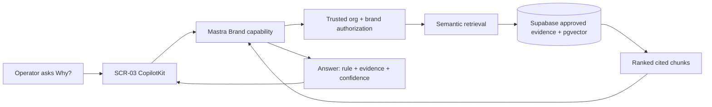

### Security / authorization boundary

```mermaid
flowchart TD
  BROWSER[Browser brandId / orgId] -->\|hints only\| SERVER[Trusted server boundary]
  SERVER --> AUTH{Authenticated user belongs to active org?}
  AUTH -->\|No\| DENY[403/404; no retrieval]
  AUTH -->\|Yes\| BRAND{Brand belongs to trusted org?}
  BRAND -->\|No\| DENY
  BRAND -->\|Yes\| VECTOR[pgvector similarity inside allowed evidence]
  VECTOR --> RESULT[Cited chunks]
```

**Rule:** vector similarity is retrieval, never authorization.

## Data contract

Canonical Brand Brain facts remain relational/Postgres truth. pgvector stores/retrieves evidence or approved examples only.

Each returned citation should have, where available:

```text
brand_id
source_type
source_url / file reference
source title or page
quoted/snippet evidence
retrieved_at / approved_at
similarity
confidence
```

Do not return arbitrary cross-brand data merely because it is semantically similar.

## Multi-step implementation prompt

### 0. Start gate

1. Read this issue, `IPI-1093`, `IPI-1039`, `IPI-1040`, `IPI-1041`, project AGENTS/rules.
2. Verify `IPI-1041` and `IPI-1093` observable outcomes are actually proven. If not, report **BLOCKED**.
3. Create one clean worktree from current `origin/main`.
4. Run task-verifier Quick before product code.

### 1. Discover the smallest current path

Use Graphify/path discovery first. Map only:

* SCR-03 Brand Detail route/components
* current CopilotKit route + agent registry
* Brand Intelligence capability if/when `IPI-1093` has landed
* current Supabase server client and trusted org resolver
* generated Supabase types/RPC definitions
* existing Brand crawl/evidence/graph tables
* tests around Brand org isolation

Search current code for `search_brands`, `search_context_snapshots`, `brand_graph_nodes`, `agent_context_snapshots`, `embedding`, and any existing evidence renderer before adding code.

### 2. Verify live Supabase read-only

Prove:

* vector extension/version and dimensions match the generated/installed contract
* exact RPC function bodies, grants, `SECURITY DEFINER`, `search_path`
* RLS on evidence/source tables
* Org A cannot retrieve Org B evidence
* active-org filtering is explicit where membership-union RLS is broader than current-org selection
* no service-role key is needed in browser code

If existing RPCs cannot enforce the required Brand/org semantics, route the smallest forward-only change through `IPI-1040`; do not patch production ad hoc.

### 3. Choose the smallest retrieval implementation

Preferred order:

1. existing current `ipixai` retrieval/tool implementation
2. existing trusted RPC with server-derived org/brand parameters
3. small Mastra tool wrapping that server contract
4. only if the above cannot satisfy ACs: smallest new org/brand-safe SQL function + migration
5. do not adopt Mastra's full RAG abstraction unless it is measurably simpler than the existing Supabase path

Potential tool name only after code audit: `retrieveBrandEvidence`.

Do not hard-code this name if a current equivalent exists.

### 4. Mastra behavior

Agent/capability rules:

* retrieve only when evidence is needed
* answer from approved Brand Brain + retrieved evidence
* cite every material supporting claim
* distinguish approved fact from inferred explanation
* surface retrieval date/staleness when relevant
* empty retrieval → say evidence was not found
* never use a vector result as permission
* never mutate Brand Brain from this tool

### 5. CopilotKit UI

Reuse the existing SCR-03 components first.

Preferred UX:

```text
Why avoid discount language?

Approved rule
Avoid discount-led positioning

Evidence
[Brand Guide · p.18]
[Website · /about]
[SS26 Campaign]

Confidence 94%
[View sources]
```

Use CopilotKit tool rendering/generative UI only for structured read-only evidence display. No browser-side database credentials or business writes.

### 6. Tests — cheapest reliable proof first

Targeted unit/integration before broad suites.

Required real-world tests:

 1. **Supported rule:** approved rule + 2+ approved evidence chunks → answer cites only returned sources.
 2. **Unsupported rule:** no supporting evidence → agent says evidence is insufficient; no invented URL/snippet.
 3. **Org isolation:** active Org A / Brand Alpha cannot retrieve Brand Beta evidence from Org B.
 4. **Multi-org user:** membership in A+B with active A still returns A only.
 5. **Client tampering:** change browser `orgId` / `brandId` to Org B → 403/404/no rows.
 6. **Vector-not-ACL:** a very high similarity Org B chunk remains inaccessible.
 7. **Empty index:** safe empty answer; current approved Brand Brain remains unchanged.
 8. **Stale evidence:** old retrieval timestamp is surfaced or treated as stale according to contract.
 9. **RPC denial/error:** safe user-facing error; no raw SQL details.
10. **No writes:** evidence Q&A performs no Brand/profile/score mutation.
11. **No browser secret:** bundle/code search proves no service-role key or embedding credential exposed.
12. **Regression: **`IPI-1093` draft/review/approval remains unchanged.
13. **SCR-03:** source cards usable desktop and ~390px.

Recommended DB proof: pgTAP/SQL allow+deny tests for the exact function/table path if a DB contract changes.

### 7. Verification order

```text
targeted tool/unit tests
→ targeted DB/RLS integration
→ typecheck
→ relevant app tests
→ build
→ browser SCR-03 proof
→ hosted Org A/B proof only if local/integration cannot prove the runtime boundary
→ task-verifier Full
→ code/security review
→ one PR / green CI
```

Do not run expensive broad E2E until cheaper gates pass.

## Acceptance criteria

- [ ] Operator can ask “why?” on SCR-03 and receive evidence-backed answer.
- [ ] Material claims include source citation(s) and confidence where available.
- [ ] Approved Brand Brain remains canonical relational truth; vectors are evidence retrieval only.
- [ ] Trusted org/brand authorization occurs before/inside retrieval.
- [ ] Org B evidence is impossible to retrieve from Org A, including for multi-org users.
- [ ] No browser service-role or privileged database path.
- [ ] Empty/failed retrieval never fabricates evidence.
- [ ] No Brand Brain write occurs from knowledge Q&A.
- [ ] Existing `IPI-1093` HITL approval behavior regresses zero.
- [ ] Targeted tests, DB security proof where applicable, typecheck, build, browser proof, CI and independent verifier pass.

Any cross-org evidence leak or fabricated citation = **FAIL**.

## Skills / MCP sequence

Run available project skills when present; verify names from `.claude/skills/index-skills.md` before invoking:

 1. `ipix-task-lifecycle`
 2. `worktrees`
 3. `graphify`
 4. `ponytail` / cheapest-proof-first
 5. `research`
 6. `mastra`
 7. `copilotkit`
 8. `ipix-supabase`
 9. `nextjs-developer`
10. `tdd`
11. `code-review`
12. `task-verifier`
13. `pr-workflow`
14. `linear`

MCP/tool order:

`Linear → GitHub current repo → Graphify → installed package source/types → Supabase read-only → official docs → targeted tests → browser/hosted proof`.

Linear Agent skills currently available are generic workspace skills (`Issue Triage`, `PR Health Check`, `Launch Readiness Audit`, `Project Update`, `Founder Dashboard`); they do not replace iPix repo skills/task-verifier.

## Current references to inspect

### Current iPix / historical proven implementation

* [https://github.com/amoai-tech/ipixai](<https://github.com/amoai-tech/ipixai>)
* [amo-tech-ai/lumina-studio#869](https://linear.app/amo100/review/ipi-924-agent-rag-001-searchsimilarbrands-tool-with-org-scoped-reads-5ac4ed5cbb72) — historical org-scoped `searchSimilarBrands` pattern
* [amo-tech-ai/lumina-studio#871](https://linear.app/amo100/review/ipi-924-agent-rag-001-prove-similar-brands-tenant-isolation-in-a-real-1b1f0c0c4227) — historical real-browser tenant-isolation proof
* [amo-tech-ai/lumina-studio#783](https://linear.app/amo100/review/ipi-922-agent-dna-001-explain-brand-dna-with-evidence-and-confidence-ea11c58f8dc0) — historical evidence/confidence response pattern

### Official Supabase

* [https://supabase.com/docs/guides/database/extensions/pgvector](<https://supabase.com/docs/guides/database/extensions/pgvector>)
* [https://supabase.com/docs/guides/database/postgres/row-level-security](<https://supabase.com/docs/guides/database/postgres/row-level-security>)
* [https://supabase.com/docs/guides/api/securing-your-api](<https://supabase.com/docs/guides/api/securing-your-api>)

### Official Mastra

* [https://mastra.ai/rag-pipeline](<https://mastra.ai/rag-pipeline>)
* [https://github.com/mastra-ai/template-company-knowledge](<https://github.com/mastra-ai/template-company-knowledge>)
* [https://github.com/mastra-ai/mastra](<https://github.com/mastra-ai/mastra>)

### Official CopilotKit

* [https://docs.copilotkit.ai/mastra/generative-ui](<https://docs.copilotkit.ai/mastra/generative-ui>)
* [https://docs.copilotkit.ai/mastra/generative-ui/tool-rendering](<https://docs.copilotkit.ai/mastra/generative-ui/tool-rendering>)
* [https://docs.copilotkit.ai/mastra/frontend-tools](<https://docs.copilotkit.ai/mastra/frontend-tools>)

Prefer installed source/types over docs if versions disagree.

## Done definition

Done means the observable Brand Hub journey is proven, not merely that a retrieval tool exists:

```text
Org A operator
→ opens Brand Alpha
→ asks why a rule exists
→ sees approved rule + tenant-safe citations
→ opens source evidence
→ cannot retrieve Org B evidence even by tampering IDs
→ refresh/retry remains safe
```

Final verifier report must return **PASS / FAIL / BLOCKED**, score /100, evidence links, remaining risks, and exact next task. | Backlog |  | High | dec7d249-6d54-4d04-ba20-46e31aede088 | v2-ipix | ai@socialmediaville.ca |  | AI, BRANDV2, COPILOTKITV2, Feature, MASTRAV2, MVP2, RLS, SUPAV2 |  |  |  |  | 2026-09-01T11:51:48.209Z | 2026-09-01T17:37:29.415Z |  |  |  |  |  | 2026-09-08T11:51:49.801Z | IPI-1099 | iPix V2 — AI-Native Production Platform | 6bf96fbd-d1f8-41e3-97ab-69cdcc0ca233 | M2 · Brand & Planning — Understand the Brand and Plan Work | MediumRisk | 62af58dc-2c14-44a3-8238-db398c57529e | 380 | IPI-1040, IPI-922, IPI-1039, IPI-144, IPI-924, IPI-172, IPI-42 | IPI-1041, IPI-1093 |  |
| IPI-1117 | iPix1 | IPI-1117 · HOST-RUNNER-001 — Make Planner Stop Work Across Vercel Instances | # AUTHORITATIVE PRE-RELEASE HOSTING PLAN — 2026-09-01

**Status: Backlog / execute after** `IPI-1048 · PLANNER-001 — Make the Production Planner the Main iPix AI Assistant`**, before** `IPI-1091 · RELEASE-001 — Deploy the New iPix App to Vercel and Prove the Complete Production Journey`**. Do not implement from this audit.**

`IPI-1117 · HOST-RUNNER-001 — Make Planner Stop Work Across Vercel Instances` owns one production guarantee:

> A Stop request must terminate the same active Planner run even when `/run` and `/stop/{threadId}` are handled by different Vercel compute instances, while preserving tenant isolation and allowing the next run to succeed.

This is **not** STREAM-001/STREAM-002 local Stop cleanup. Those tickets prove same-process behavior. This task owns the horizontal-scaling boundary.

---

## Current architecture audit

Current `main` still has two runtime paths:

### License-only / no Intelligence key

```text
CopilotRuntime
→ TenantAbortRunner
→ InMemoryAgentRunner
→ process-global pendingRuns / pendingStops
```

This path is tenant-scoped and correct **inside one Node process**, but it is not distributed. `pendingRuns`, `pendingStops`, and the underlying `InMemoryAgentRunner` store exist only in the process handling the request.

### License + Intelligence key

```text
CopilotRuntime
→ CopilotKitIntelligence
→ IntelligenceAgentRunner (automatic)
→ shared/cross-instance thread/run state
```

Current code intentionally does **not** combine `TenantAbortRunner` with Intelligence. Tenant identity for Intelligence is already scoped to the server-derived `org:{orgId}::user:{userId}` resource identity.

## Current hosting evidence

Existing Vercel project:

* project: `amo1000/ipixai`
* project ID: `prj_KiBAX2PPviyQkSi1DkTHS87sILQN`
* framework: Next.js
* latest observed deployment: READY
* current project is not serving a production target yet (`live: false` at audit time)

Vercel Fluid Compute can execute multiple invocations concurrently and scale onto additional instances. Do **not** assume `/run` and `/stop` share process memory or that Vercel will provide sticky routing to the original invocation.

---

# Architecture correction

Remove **sticky routing** as a primary production solution. Vercel routing affinity is not an iPix correctness contract.

Do not use `SqliteAgentRunner` as Vercel production truth. A local SQLite file can prove single-instance durability but does not create one shared run registry across horizontally scaled Vercel instances.

## Required decision gate

Before writing code, determine the actual release runtime:

```mermaid
flowchart TD
    A[Release environment] --> B{CopilotKit Intelligence configured?}
    B -->\|Yes\| C[Use built-in IntelligenceAgentRunner]
    C --> D[Cross-instance Stop certification]
    B -->\|No\| E{Official shared-datastore runner already available in installed/runtime family?}
    E -->\|Yes\| F[Use official shared runner]
    F --> D
    E -->\|No\| G[Implement smallest shared cancellation backend]
    G --> D
```

### Preferred order

1. **Existing iPix Intelligence configuration, if already licensed/configured** — smallest path, no new custom cancellation infrastructure.
2. **Official shared-datastore AgentRunner supported by the installed CopilotKit family**, if one exists and works with Vercel.
3. **Smallest custom shared cancellation backend** only if neither official option is available.

Do not buy or adopt CopilotKit Intelligence solely by assumption. Record licensing/availability before selecting it.

---

# Faster/better approach

```text
IPI-1048 green
→ freeze exact release-candidate SHA
→ inspect release Preview env without printing secrets
→ determine actual runner mode
→ prove same-process Stop baseline
→ force /run and /stop through distinct process/instance contexts
→ if Intelligence: certify built-in runner
→ else verify official shared runner
→ only if unavailable, implement minimal shared cancellation state using existing infrastructure
→ tenant/cross-org Stop regression
→ next-run recovery
→ Vercel Preview proof
→ Launch Readiness Audit
→ unblock RELEASE-001
```

**Do not build a new streaming protocol.** Keep AG-UI/CopilotKit SSE transport and existing auth/thread ACLs.

---

# Real user journey

An operator starts a long Production Planner response. Vercel scales or routes the Stop request to another compute instance. The Stop still terminates the original run promptly, the UI exits its running state, and the operator can send another prompt. A different organization cannot stop that run.

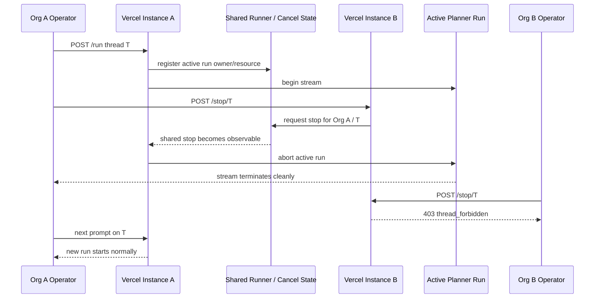

---

# Current-state classification

\| Area \| State \| Interpretation \|
\| -- \| -- \| -- \|
\| Same-process Stop \| ✅ Implemented \| `TenantAbortRunner` + STREAM-002 cleanup \|
\| Tenant-scoped runner thread key \| ✅ Implemented \| resourceId prefixes runner thread identity \|
\| Stop-before-run registration race \| ✅ Hardened locally \| pending run/stop sets handle initialization race in-process \|
\| Intelligence tenant identity \| ✅ Implemented \| org+user resourceId, no user-only fallback \|
\| Intelligence cross-instance runner path \| 🟡 Available conditionally \| only when license + Intelligence key are configured \|
\| License-only cross-instance Stop \| 🔴 Not production-safe \| process-local runner/state cannot reach another instance \|
\| Vercel sticky routing guarantee \| ❌ Do not rely on \| not a correctness primitive \|
\| SQLite on Vercel \| ❌ Not suitable shared truth \| instance-local filesystem does not solve horizontal Stop \|
\| Actual release runner mode \| 🟡 Must be recorded \| inspect Preview/Production-scoped configuration without exposing secrets \|
\| Real two-instance proof \| 🔴 Missing \| core acceptance criterion \|

---

# Exact implementation scope

## Load-bearing code

Inspect first:

1. `src/app/api/copilotkit/[[...slug]]/route.ts`
2. `tests/stream-001.test.ts`
3. `tests/intelligence-001.test.ts`
4. ACCESS/auth tests relevant to Stop
5. installed `@copilotkit/runtime@1.68.1` runner source/types
6. Vercel project/runtime configuration

Do not inspect or modify Brand, Campaign, Shoot, Cloudinary, OpenClaw, pgvector, or HITL code unless a concrete dependency is discovered.

## Frontend

No redesign expected. Existing CopilotKit Stop interaction should remain the UI trigger.

Only prove that visible running state terminates and subsequent prompting works.

## Backend

Keep:

* current CopilotKit runtime endpoint
* current AG-UI/SSE transport
* current AUTH-002 resource identity
* current ACCESS-001 authorization
* current Production Planner registration after [IPI-1048](https://linear.app/amo100/issue/IPI-1048/ipi-1048-planner-001-make-the-production-planner-the-main-ipix-ai)

Change only runner/cancellation coordination if the release environment lacks a proven shared runner.

## Database / shared state

No schema change is automatically required.

If a custom shared cancellation backend becomes necessary, prefer **existing approved shared infrastructure** and create only the minimal durable/ephemeral control state required for run identity + stop intent. Do not store a duplicate transcript.

A custom shared state design must define:

* tenant-scoped key: resourceId + threadId + unique runId
* active/stop-requested/terminal lifecycle
* expiry/cleanup for abandoned runs
* atomic ownership/update semantics
* no cross-org ability to set stop state
* fail-closed behavior when shared state is unavailable

Do not use PostgreSQL `LISTEN/NOTIFY` through Supavisor transaction pooling as an assumed reliable cross-instance delivery mechanism without explicit proof. Do not add polling blindly; measure cancellation latency and database load if polling is selected.

---

# Shared cancellation state model — only if custom path is required

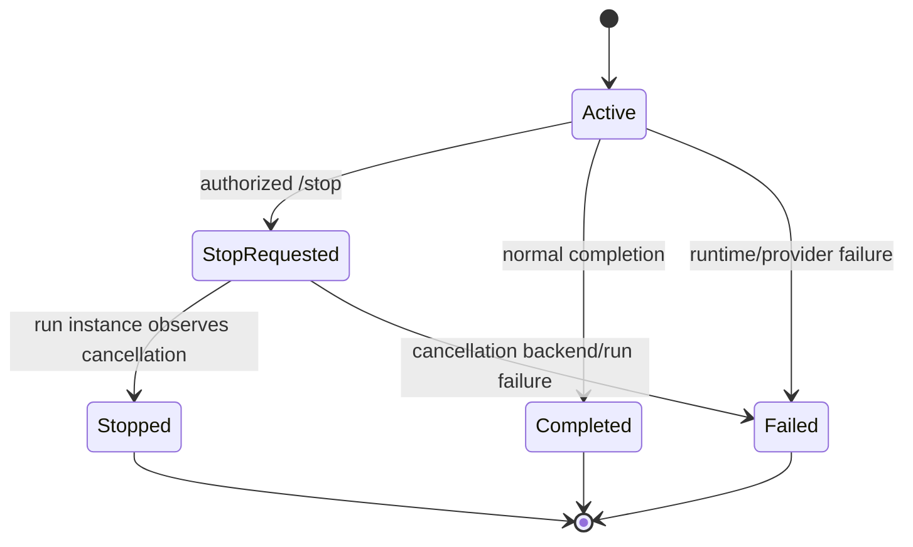

Required invariant: **one runId identifies one active execution; Stop for thread T must never cancel a different tenant or a later replacement run.**

---

# Verification — cheapest reliable proof first

## Gate 1 — static runner audit

Record:

* exact SHA
* installed CopilotKit versions
* which runner is selected for each environment combination
* whether release Preview has license only vs license + Intelligence key vs neither
* no secrets printed

## Gate 2 — existing targeted unit tests

Reuse STREAM-002/Intelligence tests to prove:

* local `TenantAbortRunner.stop()` still aborts its own tenant
* pending Stop cleanup remains correct
* Intelligence mode uses `IntelligenceAgentRunner`, not TenantAbortRunner
* resource identity remains org+user scoped

## Gate 3 — distinct-instance reproduction

**Mandatory.** A single process, two runner objects, or mocked stores do not count.

Required proof shape:

```text
instance/process A handles /run
→ stream remains active long enough to cancel
→ distinct instance/process B handles /stop/{threadId}
→ original run on A terminates
→ client sees terminal/closed stream
```

For Vercel, record request/invocation evidence that demonstrates the two requests did not depend on the same process-local runner state. Use Vercel runtime logs/observability where possible.

## Gate 4 — Stop timing and false-success protection

Do not pass merely because `/stop` returns HTTP 200 or `{stopped:true}`.

Pass only when the original generation actually stops.

Record:

* Stop request timestamp
* final stream event/close timestamp
* cancellation latency
* whether provider generation/tool execution also ceased where observable

Define an evidence-based latency threshold before Done; avoid inventing an arbitrary sub-second SLA if the official runner does not guarantee one.

## Gate 5 — authorization

* Org A can stop Org A active run
* Org B same thread → `403 thread_forbidden`
* no Org A prompt/message content in denial body/logs
* same user in a different org remains a different resource identity

## Gate 6 — run replacement safety

Prove stale Stop cannot cancel a later run:

```text
runId A starts
→ A stops/completes
→ runId B starts on same thread
→ delayed/retried Stop intended for A
→ B remains running unless Stop explicitly targets current authorized run according to chosen runner contract
```

If CopilotKit's API is thread-only rather than runId-aware, document the exact official semantics and design the shared backend so old cancellation state cannot poison subsequent runs.

## Gate 7 — recovery

After a successful Stop:

* pending/shared state reaches terminal cleanup
* next prompt on same thread works
* no permanent `stop_requested` poison
* reconnect/replay remains healthy

## Gate 8 — failure behavior

Test shared-runner/control-store outage:

* fail closed or return controlled Stop failure
* never return a misleading success while known active generation continues
* no cross-tenant fallback
* existing active stream remains observable/diagnosable

## Gate 9 — build/browser/Preview

Targeted suite first, then:

```bash
npx vitest run \
  tests/stream-001.test.ts \
  tests/intelligence-001.test.ts \
  tests/access-001.test.ts \
  tests/auth-002.test.ts \
  <HOST-RUNNER focused tests>

npm run typecheck
MASTRA_DATABASE_URL= npm run build
```

Final proof must use the exact-SHA Vercel Preview/release-candidate deployment.

---

# Skills / MCP order

Use actual available Linear skills when useful:

1. **Issue Triage** — confirm release dependency/scope
2. **PR Health Check** — if implementation PR is required
3. **Launch Readiness Audit** — mandatory before unblocking RELEASE-001

Execution/tool order:

`Linear → GitHub current route/tests → installed CopilotKit runner source/types → Context7/CopilotKit official docs → Vercel connected project + docs + runtime logs → targeted tests → browser/real Preview proof`

Read/use the installed Vercel API skill before Vercel MCP operations.

Supabase is read-only unless the selected custom shared-runner design explicitly requires an approved schema/state change. No production data writes during audit/verification.

---

# Technical Research & Reference Pack

\| Reference \| What it provides \| Exact iPix use \| What to reuse \| Custom code avoided \| Limits / cost \|
\| -- \| -- \| -- \| -- \| -- \| -- \|
\| [https://docs.copilotkit.ai/backend/agent-runner](<https://docs.copilotkit.ai/backend/agent-runner>) \| Official AgentRunner lifecycle and persistence/scaling guidance \| Decide whether iPix can keep InMemory, use Intelligence, or needs a shared runner \| built-in runner API \| custom runner protocol \| InMemory is process-local; Intelligence/licensing may be paid; verify current account terms \|
\| [https://docs.copilotkit.ai/backend/copilot-runtime](<https://docs.copilotkit.ai/backend/copilot-runtime>) \| Runtime/runner configuration contract \| Preserve existing CopilotRuntime and change only runner strategy when required \| current runtime wiring \| second runtime \| installed `@copilotkit/runtime@1.68.1` source/types win on mismatch \|
\| [https://docs.copilotkit.ai/premium/connect-your-runtime](<https://docs.copilotkit.ai/premium/connect-your-runtime>) \| Intelligence connection/configuration \| If release already has Intelligence, reuse it rather than building cancellation infrastructure \| CopilotKitIntelligence / automatic runner \| custom shared run registry \| licensed/premium capability; availability must be verified \|
\| [https://github.com/CopilotKit/CopilotKit](<https://github.com/CopilotKit/CopilotKit>) \| Official source/tests \| Verify installed runner Stop/connect semantics and cross-instance implementation \| upstream runner implementation/tests \| guessing API behavior \| inspect matching installed/tagged version \|
\| [https://vercel.com/docs/functions](<https://vercel.com/docs/functions>) \| Vercel Functions execution/scaling model \| Establish that function correctness cannot depend on one process-local store \| platform execution model \| custom routing assumptions \| instance reuse/routing is platform-managed \|
\| [https://vercel.com/fluid](<https://vercel.com/fluid>) \| Fluid Compute concurrency/scaling model \| Proves Vercel may serve multiple concurrent invocations and scale instances \| Fluid Compute platform behavior \| sticky-session design \| configuration/plan can change; inspect actual project \|
\| [https://linear.app/amo100/issue/IPI-1132/ipi-1132-stream-002-finish-planner-stop-cleanup-and-keep-license-only](<https://linear.app/amo100/issue/IPI-1132/ipi-1132-stream-002-finish-planner-stop-cleanup-and-keep-license-only>) \| Same-process Stop owner \| Reuse local Stop cleanup; do not rewrite it \| TenantAbortRunner cleanup proof \| duplicate Stop implementation \| not cross-instance proof \|
\| [https://linear.app/amo100/issue/IPI-1048/ipi-1048-planner-001-make-the-production-planner-the-main-ipix-ai](<https://linear.app/amo100/issue/IPI-1048/ipi-1048-planner-001-make-the-production-planner-the-main-ipix-ai>) \| Production Planner promotion prerequisite \| Ensure cross-instance proof exercises the actual production agent \| promoted `default` Planner \| testing demo-only agent \| must be Done first \|
\| [https://linear.app/amo100/issue/IPI-1091/ipi-1091-release-001-deploy-the-new-ipix-app-to-vercel-and-prove-the](<https://linear.app/amo100/issue/IPI-1091/ipi-1091-release-001-deploy-the-new-ipix-app-to-vercel-and-prove-the>) \| Final release gate \| HOST-RUNNER evidence is consumed by release certification \| release journey \| duplicate release task \| HOST-RUNNER does not deploy production itself \|

### Current authoritative findings

* CopilotKit documents `InMemoryAgentRunner` as process-memory only and recommends `IntelligenceAgentRunner` or another shared-datastore runner for horizontal scaling.
* CopilotKit's runner owns `run`, `connect`, `isRunning`, and `stop`; therefore the clean solution is a shared runner/control plane, not a custom replacement SSE protocol.
* Vercel Fluid Compute supports concurrent invocations and dynamic scaling; process memory is therefore an optimization/cache, not durable cross-request coordination.

---

# Production-ready acceptance criteria

- [ ] `IPI-1048 · PLANNER-001 — Make the Production Planner the Main iPix AI Assistant` is Done
- [ ] exact release-candidate SHA recorded
- [ ] exact Vercel Preview deployment recorded
- [ ] actual release runner mode documented without exposing secrets
- [ ] no claim that InMemoryAgentRunner/TenantAbortRunner is multi-instance safe
- [ ] no reliance on Vercel sticky routing
- [ ] no SQLite file used as horizontally shared Vercel truth
- [ ] selected solution follows preferred order: existing Intelligence → official shared runner → minimal custom shared backend
- [ ] `/run` on instance/process A + `/stop` on distinct instance/process B actually terminates A's generation
- [ ] Stop success is proven by stream termination, not only HTTP response
- [ ] cancellation latency recorded
- [ ] Org A Stop works
- [ ] Org B Stop is denied with zero content leakage
- [ ] same user/different org remains isolated
- [ ] stale Stop cannot poison/cancel a later replacement run
- [ ] next prompt after Stop succeeds
- [ ] replay/memory remains healthy after Stop
- [ ] shared-control outage has controlled non-misleading behavior
- [ ] no custom SSE protocol introduced
- [ ] no duplicate conversation store introduced
- [ ] targeted tests pass
- [ ] typecheck passes
- [ ] build passes
- [ ] real Vercel Preview evidence attached
- [ ] Launch Readiness Audit = Ready

---

# Scores /100 — pre-implementation

* Correctness: **96**
* Architecture: **97**
* Security: **98**
* Efficiency/reuse: **97**
* Testing design: **98**
* Production readiness: **67** — same-process Stop is good; cross-instance guarantee is still absent on the license-only path
* Verification confidence: **97**
* Overall: **93 provisional**

## Will this task succeed in real production?

🟡 **YES AFTER A SHARED RUNNER/CANCELLATION PATH IS SELECTED AND REAL TWO-INSTANCE VERCEL PROOF PASSES.**

If the actual release environment already has CopilotKit Intelligence configured and the cross-instance test passes, this may collapse to a **certification-only task with zero production-code changes**.

If release remains license-only, `TenantAbortRunner` must not be promoted as distributed. Use an official shared runner if available; otherwise implement the smallest tenant-safe shared cancellation backend and prove it under real Vercel scaling.

---

# Rollback

* If an official runner switch causes regressions, revert runner selection to the previously certified same-process path and keep production release blocked.
* If custom shared cancellation is required, rollback must remove/disable only that coordination layer without altering persisted conversation history.
* Never “rollback” by weakening tenant ACLs or returning to a false-success Stop response. | Backlog |  | High | dec7d249-6d54-4d04-ba20-46e31aede088 | v2-ipix | ai@socialmediaville.ca |  | COPILOTKITV2, COREV2, MASTRAV2 |  |  |  |  | 2026-08-30T13:05:41.140Z | 2026-09-01T18:01:55.395Z |  |  |  |  |  | 2026-09-08T17:59:59.465Z | IPI-1078 | iPix V2 — AI-Native Production Platform | ced64e4c-a32a-457a-b503-3c4a0a37eeac | M1 · Foundation — Secure Identity, Shell & AI Runtime | MediumRisk | fe76545b-72a0-441a-8b8f-67e41e3b84ba | 3186 | IPI-1132, IPI-1045, IPI-1041, IPI-1126, IPI-1047 | IPI-1048 |  |
| IPI-1099 | iPix1 | IPI-EPIC · BRAND — Browse Brands and Approve Brand DNA | ## Epic boundary correction — 2026-09-01

This epic now ends at approved Brand truth and approved Brand Knowledge. Market research and opportunity ranking moved to `IPI-1134 · IPI-EPIC · BRAND STRATEGY — Research Markets and Find Brand Opportunities`. Learning from campaign results moved to `IPI-1135 · IPI-EPIC · LEARNING — Turn Proven Results Into Reviewed Brand Improvements`.

Keep this journey focused:

`browse Brand → generate evidence-backed draft → review → explicit approval → approved Brand DNA → approved Brand Knowledge`

## Current Brand phase — 2026-09-01

Development phase: `MVP2`
**Product milestone: **`M2 · Brand & Planning — Understand the Brand and Plan Work`

This epic owns one Brand journey:

```text
browse existing brands
→ submit brand website
→ generate evidence-backed draft only
→ operator reviews draft
→ explicit atomic approval
→ approved brands.ai_profile + brand_scores
→ BRAND-001 displays approved Brand DNA
→ BRAND-KNOWLEDGE retrieves approved evidence with citations
```

Ownership is intentionally split:

* `IPI-1068 · BRAND-001 — Let Operators Browse Brands and Open Complete Brand Profiles` owns browse/profile and **approved DNA display**. It may expose an entry/link to review, but does not own draft persistence, generation, promotion, or schema changes.
* `IPI-1093 · BRAND-INTEL-001 — Turn a Brand Website Into an Approved Brand DNA Profile` owns website analysis, draft review, reject/regenerate, and the atomic human-approved promotion path.
* `IPI-1128 · BRAND-KNOWLEDGE-001 — Give AI Decisions Approved Brand Evidence With Citations` owns post-approval, tenant-safe evidence retrieval for Brand decisions/Q&A. It uses pgvector for retrieval only; it never becomes Brand truth or an authorization layer.
* Market research and opportunity ranking are downstream under `IPI-1134 · IPI-EPIC · BRAND STRATEGY — Research Markets and Find Brand Opportunities`; they consume approved Brand truth but are not children of this epic.
* Learning from measured campaign results is downstream under `IPI-1135 · IPI-EPIC · LEARNING — Turn Proven Results Into Reviewed Brand Improvements`.
* `IPI-1039 · SB-V2-003 — Give Every Supabase Security Warning an Owner and Clear Action` classifies/authz-checks Brand RPC/security findings; it does not implement Brand product UX.
* `IPI-1040 · MIGRATION-001 — Prove New iPix Database Changes Can Be Added Without Replaying Old Migrations` owns the safe forward-migration procedure required if Brand/security fixes need DDL.

Do not create `BRAND-APPROVAL-001`, `BRAND-INTAKE`, `BRAND-REVIEW`, or a new Brand data/schema task. Reuse these owners.

---

## Purpose

Parent epic for **brand list, brand profile, and URL → approved Brand DNA**. Display and generation stay separate children.

Think of this as the brand bible: browse the shelf, then approve a new chapter before it is canon.

## Not in this epic

* Command Center KPIs — HOME-001.
* Shoot records — Shoot Planning epic.
* Cloudflare crawl Worker — DROP; do not port.

## Children

\| Issue \| Spec \| Role \|
\| -- \| -- \| -- \|
\| [IPI-1068](<https://linear.app/amo100/issue/IPI-1068>) \| BRAND-001 \| List + profile; display **approved** DNA only \|
\| [IPI-1093](<https://linear.app/amo100/issue/IPI-1093>) \| BRAND-INTEL-001 \| URL → draft → HITL → approved `ai_profile` \|
\| [IPI-1128](<https://linear.app/amo100/issue/IPI-1128>) \| BRAND-KNOWLEDGE-001 \| Approved Brand Brain → tenant-safe cited evidence retrieval \|

## Rules

* Trusted org from AUTH-002. No client `orgId` as tenant authority.
* Generated DNA is not live until operator approval.
* Reuse Brand Intelligence agent; do not invent a second runtime.
* pgvector is retrieval only. Trusted org/brand authorization must be proven before evidence is returned.
* Do not reopen historical [IPI-924](https://linear.app/amo100/issue/IPI-924/ipi-924-agent-rag-001-let-brand-intelligence-cite-similar-brands-and)/[IPI-922](https://linear.app/amo100/issue/IPI-922/ipi-922-agent-dna-001-explain-brand-dna-with-evidence-and-confidence) or canceled [IPI-144](https://linear.app/amo100/issue/IPI-144/mastra-rag-003-brand-knowledge-retrieval); reuse their patterns as references only.

## Acceptance criteria (epic)

- [ ] BRAND-001, BRAND-INTEL-001, and BRAND-KNOWLEDGE-001 are parented here; Brand Strategy and Learning remain separate downstream epics.
- [ ] BRAND-001 does not own crawl/generation. | Backlog |  | High | dec7d249-6d54-4d04-ba20-46e31aede088 | v2-ipix | ai@socialmediaville.ca |  | BRANDV2, COPILOTKITV2, DASHV2, MASTRAV2, MVP2, SUPAV2 |  |  |  |  | 2026-08-30T11:42:09.432Z | 2026-09-01T15:59:11.107Z |  |  |  |  |  | 2026-09-06T11:42:10.090Z |  | iPix V2 — AI-Native Production Platform | 6bf96fbd-d1f8-41e3-97ab-69cdcc0ca233 | M2 · Brand & Planning — Understand the Brand and Plan Work | MediumRisk | 383606dd-c46a-4fc2-ae1d-6d91201712cc | 3269 | IPI-1129, IPI-36, IPI-144, IPI-922, IPI-924, IPI-1076, IPI-1068, IPI-1093 |  |  |
| IPI-1093 | iPix1 | IPI-1093 · BRAND-INTEL-001 — Turn a Brand Website Into an Approved Brand DNA Profile | ## Atomic Brand approval contract — 2026-09-01

This ticket is the **single v2 Brand Intelligence owner** for generation, draft review, reject/regenerate, and approval. Do not create `BRAND-APPROVAL-001`, `BRAND-INTAKE`, `BRAND-REVIEW`, or another Brand data/schema ticket.

### Required invariant

```text
website / Firecrawl evidence
→ draft only
→ operator reviews exact draft
→ explicit approval
→ one atomic server-side promotion
→ brands.ai_profile + brand_scores + audit
```

If a database function/RPC is needed, use one explicit atomic approval boundary such as `approve_brand_intelligence_draft(...)` (final name must match the implemented migration/API contract). It must:

* derive/verify the trusted organization server-side
* bind the reviewed draft to the target brand and org
* reject stale/already-promoted/wrong-org drafts
* update the approved `brands.ai_profile` and persisted `brand_scores` in one transaction
* record approval/audit metadata
* be idempotent or fail safely on replay

**Firecrawl/webhook/retrieval paths must never write approved Brand Brain truth.** They may create/update crawl/evidence/draft state only. No webhook, model callback, retry, or background worker may promote `brands.ai_profile` or approved scores.

`IPI-656 · BRAND-INTEL-001 — HISTORICAL (old CF marketing) Multi-Source Brand Intelligence and Scoring` is historical reference only and is not a v2 owner.

---

## 2026-09-01 production gate (live Edge + advisors)

Audit: `docs/plan/04/supabase-audit.md`. **No new Linear issue.**

Live `brand-intelligence` still **writes **`brands.ai_profile` **+ scores by default** unless draft mode is forced. That is an **unsafe approval boundary**.

**Must ship:** analysis is **draft-only**. Human approval is the **only** promotion path. One **atomic** apply copies draft → `brands.ai_profile` + `brand_scores` + audit record. Consolidate draft truth (`ai_profile_draft` vs `brand_intake_drafts`) — do not keep two staging tables as SSOT. Do **not** mint `brand_evidence_chunks` or a second Brand schema.

Keep existing crawl/graph/vector tables. Index `brand_graph_edges.target_node_id` only when reverse-graph queries are real ([IPI-1039](https://linear.app/amo100/issue/IPI-1039/ipi-1039-sb-v2-003-give-every-supabase-security-warning-an-owner-and) **· SB-V2-003** classifies; unique `(source, target, type)` does **not** cover target-only lookup).

---

# EXECUTION PROMPT — MOST EFFICIENT PATH

Current gate: BLOCKED until [IPI-1065](https://linear.app/amo100/issue/IPI-1065/ipi-1065-app-001-give-operators-one-consistent-ipix-workspace-across) · APP-001 — Give Operators One Consistent iPix Workspace Across the App and [IPI-1046](https://linear.app/amo100/issue/IPI-1046/ipi-1046-auth-002-keep-every-ipix-user-inside-the-correct-organization) **· AUTH-002 — Keep Every iPix User Inside the Correct Organization are merged/proven. AUTH-001 is already Done. Do not block on BRAND-001.**

**Fastest-safe implementation:** reuse the existing schema and proven legacy Brand Intelligence behavior; add the smallest new Mastra capability inside the existing runtime. Do not add a second AI runtime, custom SSE path, Worker crawl host, browser service-role, or new schema unless code/schema proof shows it is required.

## 1. Start gate

1. Clean `origin/main` worktree only.
2. Verify APP-001 shell + AUTH-002 trusted `orgId` are available server-side.
3. Graphify only: current Mastra agent registry/tools, CopilotKit runtime route, brand routes, Supabase server client, legacy Brand Intelligence/restart path.
4. If Graphify is unavailable, use targeted path/grep discovery; do not broaden the read.
5. Run task-verifier Quick. Any tenant/auth/data-contract red flag → STOP.

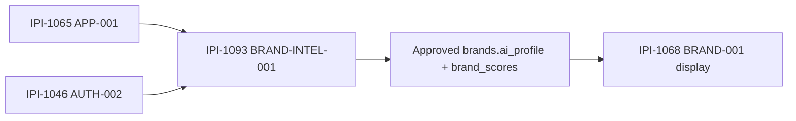

## 2. Reuse the existing data contract first

Hosted schema already has `brands.ai_profile`, `brands.ai_profile_draft`, `brands.intake_status`, `brands.approved_profile_at`, `brand_intake_drafts`, `brand_crawls`, and `brand_scores`. Prefer these over new tables.

Security rule: trusted active org comes from AUTH-002. Every brand read/write must bind `brand.id + brand.org_id = trustedOrgId`. RLS is defense in depth, not active-org selection.

## 3. Smallest runtime design

Add one Brand Intelligence capability to the existing Mastra runtime; do not create a second runtime.

Preferred pipeline:

`website URL → server-side fetch/crawl → normalized evidence/citations → structured DNA draft + draft scores → persist draft → operator HITL review → atomic approval → approved ai_profile + brand_scores`

Use the proven legacy crawl/restart semantics only as reference. The new app has no Firecrawl SDK dependency today; if Firecrawl is still selected, call it server-side through the smallest supported integration and keep credentials server-only. Do not port the old Cloudflare crawl host.

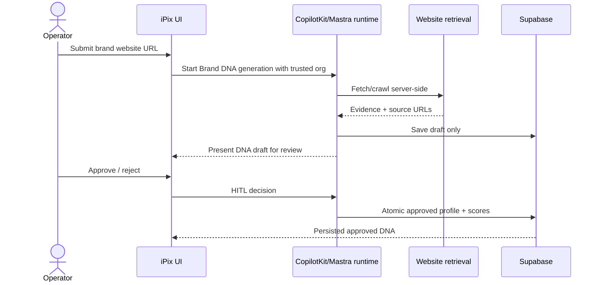

## 4. State contract

Do not expose generated DNA as live before approval.

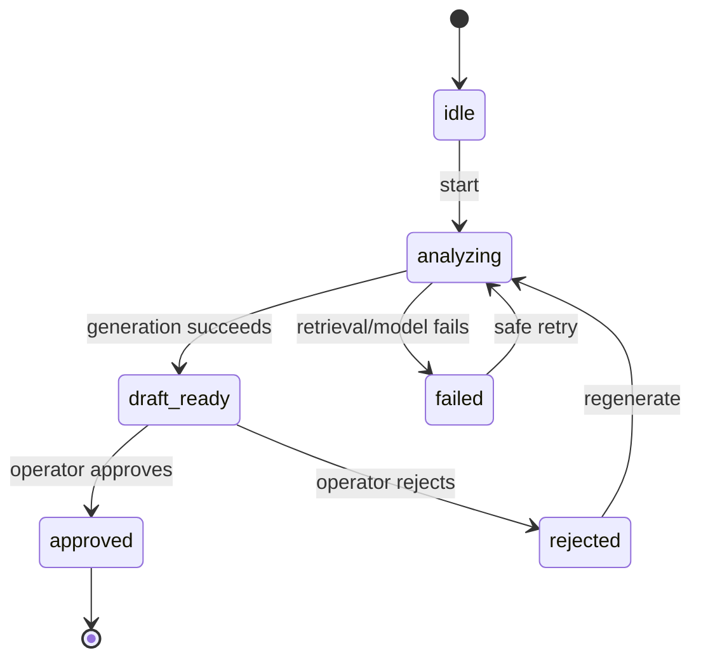

Required invariant: only `approved` updates the BRAND-001 source of truth (`brands.ai_profile` + persisted `brand_scores`).

## 5. COPY / ADAPT / DROP

**REUSE:** existing Mastra registry/runtime, Supabase server auth, legacy structured Brand DNA shape, draft/review concepts, citation storage, score helpers where types still match.

**ADAPT:** legacy `getUser()`/owner logic → AUTH-002 trusted org; legacy crawl/restart flow → current runtime/tool API; existing draft writes → org-bound server writes; UI review → APP-001 L5 HITL slot/current CopilotKit interaction pattern.

**DROP:** Worker crawl host, custom SSE, service-role browser client, `user_id` as tenant authority, live profile overwrite before approval, fake scores, second Mastra runtime, Brand Hub display work.

## 6. Required tests — targeted first

 1. Org A operator can generate draft for Org A brand.
 2. Org A cannot generate/update Org B brand even if client sends Org B `brandId/orgId`.
 3. Multi-org user with active Org A cannot mutate Org B.
 4. Invalid/unsupported URL fails before model/persist.
 5. Retrieval failure → `failed`, approved profile unchanged.
 6. Model/structured-output failure → no approved write.
 7. Draft persists to draft fields/tables only.
 8. Approval atomically promotes the reviewed draft to `brands.ai_profile` and persisted `brand_scores`.
 9. Rejection leaves current approved profile/scores unchanged.
10. Duplicate/retry requests are idempotent or cannot double-promote.
11. Citations/source URLs survive into the review evidence contract.
12. Browser bundle contains no crawler/model/service-role secrets.
13. No custom SSE/second runtime introduced.
14. BRAND-001 can read the approved profile without rerunning generation.
15. Desktop + ~390px review flow is usable.

### Real-world tenant proof

User belongs to Org A + Org B. Active org = A. Brand Alpha belongs to A; Brand Beta belongs to B. Generate Alpha → draft only. Attempt Beta by changing route/body ID → 404/403 and no writes. Approve Alpha → approved profile/scores change once. Refresh Brand profile → approved DNA loads from Supabase without another crawl/model call.

## 7. Verification order

Targeted Brand Intelligence tests → DB/RLS/write-contract tests → `npm run typecheck` → `npm test` → `npm run build` → browser HITL proof → task-verifier Full → code/security review → one PR → green CI.

Do not mutate production Supabase for test fixtures or audit proof.

## 8. Production-ready success criteria

* trusted org is server-derived
* generation cannot cross org boundary
* URL retrieval is server-side with SSRF/URL validation and bounded timeout/size
* generated profile stays draft until explicit operator approval
* approval persists exactly one reviewed snapshot
* approved `ai_profile` + persisted scores are readable by BRAND-001 without regeneration
* failures/retries do not erase current approved DNA
* citations/evidence available to reviewer
* no service-role/crawler/model secrets in browser
* no second runtime/custom SSE/Worker-host regression
* targeted + DB security + typecheck + full tests + build + browser + CI + independent verifier pass

Any cross-org write or unapproved promotion = **FAIL**.

---

## Implementation prompt

You are implementing **BRAND-INTEL-001 — Turn a Brand Website Into an Approved Brand DNA Profile** in iPixai.

**After you read this description, do not write product code yet.** Run Verify-before-implement first (Linear, official docs ≤5 URLs, graphify, live code, Supabase read-only, task-verifier Quick). Any 🔴 → stop.

## Purpose

Turn a brand website into an **approved Brand DNA profile** that BRAND-001 can display. Generation, review, and persist are this ticket. Browse/profile display stays [IPI-1068](https://linear.app/amo100/issue/IPI-1068/ipi-1068-brand-001-let-operators-browse-brands-and-open-complete-brand).

## Real-world outcome

An operator pastes a brand URL, reviews proposed DNA (voice, visual, audience), approves it, and later opens the brand profile to see that approved DNA — not a live crawl on every page load.

## Official references (max 5)

\| # \| URL \| Critical fact \| MCP \|
\| -- \| -- \| -- \| -- \|
\| 1 \| [https://mastra.ai/docs/agents/overview](<https://mastra.ai/docs/agents/overview>) \| How to add a Mastra agent/tool without a second runtime \| Mastra MCP \|
\| 2 \| [https://supabase.com/docs/guides/database/postgres/row-level-security](<https://supabase.com/docs/guides/database/postgres/row-level-security>) \| Org-scoped writes via RLS, not service-role browser \| Supabase search_docs \|
\| 3 \| [https://docs.copilotkit.ai/mastra](<https://docs.copilotkit.ai/mastra>) \| Agent is invoked from CopilotKit, not a custom SSE path \| CopilotKit MCP \|
\| 4 \| [https://github.com/mastra-ai/mastra](<https://github.com/mastra-ai/mastra>) \| Official Mastra repo is active; verify installed APIs against current package types \| GitHub \|
\| 5 \| [https://docs.firecrawl.dev/features/crawl](<https://docs.firecrawl.dev/features/crawl>) \| If Firecrawl is retained, crawl server-side with bounded scope; do not port the old Worker host \| Web \|

Official GitHub: [https://github.com/mastra-ai/mastra](<https://github.com/mastra-ai/mastra>) — verify not archived.

## Skills

task-verifier, graphify, ponytail, fastest, ipix-task-lifecycle, copilotkit, nextjs-developer, tdd, code-review, pr-workflow, linear

## Scope

**In:** crawl/extract → operator HITL approve → persist DNA for the org brand. Reuse luminaai brand-intel workflow where it is proven.
**Out:** BRAND-001 list/detail UI, Home Agent, Cloudflare crawl host, service-role browser, fake scores.

## Acceptance criteria

- [ ] Operator can start DNA generation from a brand website URL under authenticated org context.
- [ ] Generated DNA is not live until operator approval (L5 HITL).
- [ ] BRAND-001 can display the approved profile without re-running generation.
- [ ] Org B cannot read Org A DNA. No production Supabase writes during audits.
- [ ] Tests + browser proof. Do not mark Done without evidence.

## Dependencies

Related [IPI-1068](https://linear.app/amo100/issue/IPI-1068/ipi-1068-brand-001-let-operators-browse-brands-and-open-complete-brand) (display). Full operator workflow is blocked by [IPI-1065](https://linear.app/amo100/issue/IPI-1065/ipi-1065-app-001-give-operators-one-consistent-ipix-workspace-across) and [IPI-1046](https://linear.app/amo100/issue/IPI-1046/ipi-1046-auth-002-keep-every-ipix-user-inside-the-correct-organization). AUTH-001 is Done. Do not hard-block on CORE-001 or BRAND-001.

## This PR does not

Rebuild Brand Hub from CopilotKit examples. Copy Worker crawl secrets. | Backlog |  | High | dec7d249-6d54-4d04-ba20-46e31aede088 | v2-ipix | ai@socialmediaville.ca |  | BRANDV2, COPILOTKITV2, Feature, GEMINI, HITL, MASTRAV2, MVP2, SUPAV2 |  |  |  |  | 2026-08-30T09:08:08.766Z | 2026-09-01T17:37:55.989Z |  |  |  |  |  | 2026-09-06T09:08:09.432Z | IPI-1099 | iPix V2 — AI-Native Production Platform | 6bf96fbd-d1f8-41e3-97ab-69cdcc0ca233 | M2 · Brand & Planning — Understand the Brand and Plan Work | MediumRisk | b490c59c-e6dc-4e68-b451-f0d12ef78dd8 | 3423 | IPI-1040, IPI-1039, IPI-1068, IPI-1046, IPI-1136, IPI-172, IPI-656, IPI-1076, IPI-1099 | IPI-1065 |  |
| IPI-1088 | iPix1 | IPI-1088 · COPILOT-REPLAY-001 — Reload the Planner UI from the saved conversation after refresh | # AUTHORITATIVE REPLAY CERTIFICATION PLAN — 2026-09-01

**Status: Ready for focused implementation/certification. Do not build a second persistence system.**

This task owns one user-visible outcome:

> After a browser refresh or a real process restart, the authenticated operator sees the same authorized Planner conversation rendered in the UI from durable Mastra/Postgres history.

Durable storage belongs to `IPI-1044 · PG-001 — Make iPix AI Conversations Survive Server Restarts` / `IPI-1124 · MASTRA-HOST-PG-001 — Run Mastra Memory on Shared Supabase Postgres in Hosted iPix`.

Model conversational recall belongs to `IPI-1050 · MEM-001 — Let the Planner Remember the Conversation After Refresh and Restart`.

Replay must consume that existing truth. Do not create a CopilotKit transcript table, localStorage transcript, SQLite production store, or another durable runner merely to paint history.

---

# Current architecture correction

Current `main` already contains most of the replay path:

* `src/app/api/planner/threads/route.ts` lists the current user's persisted Mastra threads.
* `src/app/api/planner/threads/[threadId]/messages/route.ts` reads persisted messages through the authenticated/authorized Mastra memory path.
* `src/components/restore-mastra-history.tsx` fetches `/api/planner/threads/{threadId}/messages` and hydrates the CopilotKit v2 agent with `agent.setMessages(...)`.
* `src/app/planner-app.tsx` mounts `RestoreMastraHistory` for the active thread and passes the same `threadId` into `CopilotSidebar`.
* `src/components/planner-threads-drawer.tsx` lists authorized threads and remembers only the **active-thread pointer** in resource-scoped localStorage.

Therefore the old task assumption that iPix must first choose a durable CopilotKit runner is stale. Current iPix already has an app-owned replay adapter over the existing Mastra/Postgres source of truth.

## localStorage boundary

Resource-scoped localStorage is allowed only as a **non-authoritative UX pointer** to the last selected thread ID.

It must never contain message transcript content or grant authorization. The server thread list + ACCESS checks remain authoritative.

If the stored thread no longer belongs to the current resource, `resolvePlannerThreadId(...)` must fall back only to an authorized server-listed thread or a deliberate new-thread state.

---

# Real user journey

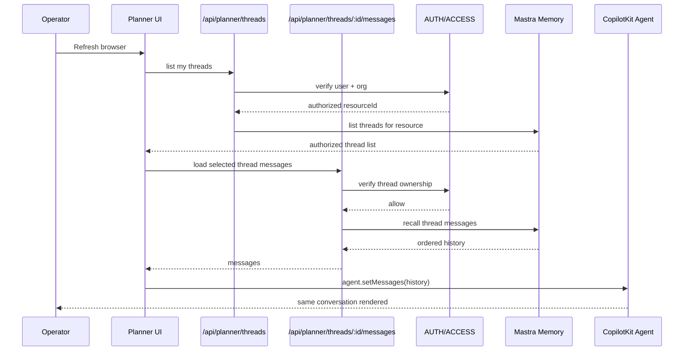

## Replay state model

```mermaid
stateDiagram-v2
    [*] --> LoadingThreads
    LoadingThreads --> ThreadSelected: authorized saved thread found
    LoadingThreads --> Empty: no saved threads
    LoadingThreads --> LoadError: thread-list request fails
    ThreadSelected --> LoadingMessages
    LoadingMessages --> Hydrated: authorized messages loaded
    LoadingMessages --> Forbidden: foreign/missing ownership
    LoadingMessages --> ReplayError: memory/backend unavailable
    Hydrated --> Active: operator continues conversation
    LoadError --> LoadingThreads: explicit retry
    ReplayError --> LoadingMessages: explicit retry
    Forbidden --> ThreadSelected: choose another authorized thread
```

**Critical UX rule:** infrastructure/replay failure must not silently become a brand-new conversation.

---

# Faster/better approach

`exact main SHA → inspect existing replay adapter + thread APIs → verify installed CopilotKit v2 setMessages/thread contract → test server-authorized active-thread selection → focused hydration tests → fix only proven gaps → browser refresh proof → process-restart browser proof → Org A/B denial proof → Done`

Reuse the current `RestoreMastraHistory` approach unless current installed CopilotKit APIs prove a simpler native path that preserves the same single source of truth without losing iPix authorization controls.

Do **not** introduce CopilotKit Intelligence solely for replay.

Do **not** replace shared Mastra/Postgres with SQLite or browser persistence.

---

# Current-state audit

\| Area \| State \| Current interpretation \|
\| -- \| -- \| -- \|
\| Durable Mastra/Postgres conversation \| ✅ Proven foundation \| PG-001 / MASTRA-HOST-PG-001 \|
\| Authorized thread listing \| ✅ Implemented \| `/api/planner/threads` filtered by server-derived resource \|
\| Authorized message retrieval \| ✅ Implemented \| `/api/planner/threads/:threadId/messages` + ACCESS checks \|
\| UI history adapter \| ✅ Implemented \| `RestoreMastraHistory` → `agent.setMessages(...)` \|
\| Active thread supplied to CopilotSidebar \| ✅ Implemented \| same `threadId` used by sidebar \|
\| Last-selected thread pointer \| ✅ Implemented with boundary \| resource-scoped localStorage pointer only \|
\| Replay after hard browser refresh \| 🟡 Needs certification \| user-visible browser proof required \|
\| Replay after real process restart \| 🟡 Needs certification \| must survive new server process/instance \|
\| Message ordering / duplication \| 🟡 Needs focused proof \| hydration must match persisted ordered messages exactly once \|
\| Race with new live messages during hydration \| 🟡 Partially guarded \| component avoids overwriting if agent message count grows; needs regression proof \|
\| Replay error handling \| 🔴 Current gap \| fetch errors are swallowed in `RestoreMastraHistory`; user gets no replay failure state \|
\| Thread-list failure recovery \| 🔴 Current gap \| current drawer generates a fresh UUID after list failure; replay failure can silently look like a new conversation \|
\| Org B hydration of Org A thread \| ✅ architecture / needs replay regression \| ACCESS-001 already enforces ownership; replay task must preserve it \|
\| Native CopilotKit server replay \| ➡️ Optional reference \| current iPix app adapter already uses Mastra as durable truth; no need to add second runner just because CopilotKit supports server replay \|

---

# Exact implementation scope

## Files likely to reuse / inspect

1. `src/components/restore-mastra-history.tsx`
2. `src/components/planner-threads-drawer.tsx`
3. `src/app/planner-app.tsx`
4. `src/app/api/planner/threads/route.ts`
5. `src/app/api/planner/threads/[threadId]/messages/route.ts`
6. `src/mastra/thread-persistence.ts`
7. `src/mastra/thread-types.ts`
8. `src/lib/auth/thread-acl.ts`
9. focused tests for drawer/history hydration/replay

## Frontend

Owns:

* choosing an authorized active thread from the server list
* visible loading/error/empty states
* fetching history for the chosen thread
* setting CopilotKit agent messages without duplicates
* not overwriting newer live messages with stale hydration
* preserving active thread across ordinary refresh via non-authoritative pointer

## Backend

No new persistence service expected.

Reuse:

* authenticated thread list
* authorized message route
* Mastra Memory recall
* ACCESS-001 `403 thread_forbidden`

## Database

No migration, new table, pgvector, RLS redesign, RPC, or Supabase write path should be needed.

## Agents / workflows / HITL

No agent workflow or HITL change is required. Replay renders stored conversation; it does not execute a consequential action.

---

# Critical failure/recovery behavior

1. **Thread-list backend unavailable** → show a visible retryable error. Do **not** silently generate/activate a new UUID.
2. **Message replay backend unavailable** → show a visible replay error; preserve selected thread ID; allow retry. Do not clear the conversation into a fake blank state.
3. **403 foreign thread** → do not hydrate any message; reveal no protected metadata/content; return to authorized selection.
4. **404/missing thread** → choose from current authorized server list or explicit empty/new state; never trust stale localStorage by itself.
5. **User sends a message while hydration is in flight** → stale replay response must not replace the newer live message state.
6. **Thread switch while hydration is in flight** → abort old request and never paint old-thread messages into the new thread.
7. **Duplicate hydration** → same persisted messages appear once and in order.
8. **Process restart** → active thread selection may come from the pointer, but transcript content must come from the server/Postgres source.

---

# Verification — cheapest reliable proof first

## 1. Static / pure tests

Verify `resolvePlannerThreadId(...)` semantics:

* stored ID that exists in authorized list → reuse it
* stale/foreign stored ID → ignore
* authorized list non-empty → choose valid fallback
* no saved threads → deliberate new-thread state only

## 2. History component tests

Mock the authorized `/messages` endpoint and prove:

* successful response calls `agent.setMessages` with exact ordered messages
* request includes credentials
* abort on unmount/thread switch
* no setMessages after abort
* replay response does not overwrite messages created after hydration started
* `403` does not hydrate
* `5xx` exposes visible error/retry state after the implementation gap is fixed

## 3. Drawer tests

Prove:

* authorized threads render
* last authorized selected thread restores
* localStorage never overrides server authorization
* thread-list failure shows error and **does not silently activate a new UUID**
* explicit `New` is the only user action that intentionally creates a fresh client thread UUID

## 4. API / security regression

Reuse ACCESS tests:

* Org A message route → 200
* Org B same thread → `403 thread_forbidden`
* denied body contains zero Org A content
* read failure produces controlled response

## 5. Browser refresh proof — mandatory

With a synthetic owned thread containing at least user + assistant messages:

```text
open Planner
→ select thread
→ verify visible messages
→ hard refresh browser
→ same thread becomes active
→ same messages appear in same order
→ no duplicate messages
→ no new thread row created by hydration
```

## 6. Real process restart proof — mandatory

```text
Process A serves Planner
→ open existing TEST thread
→ stop Process A completely
→ start Process B
→ reload browser
→ same authorized thread/messages render from Postgres
```

HMR does not count.

## 7. Cross-org browser proof

Using [IPI-1125](https://linear.app/amo100/issue/IPI-1125/ipi-1125-qa-org-001-provision-two-isolated-qa-organizations-and-users) QA Org A/B accounts:

* Org A opens TEST thread
* capture only synthetic ID
* Org B attempts same thread
* UI does not render Org A history
* request returns generic authorization denial
* Org B remains on its own authorized thread/empty state

## Recommended targeted suite

Use existing tests plus focused replay tests when present:

```bash
npx vitest run \
  tests/access-001.test.ts \
  tests/thread-persistence.test.ts \
  tests/auth-002.test.ts \
  <focused replay/drawer tests>
```

Then:

```bash
npm run typecheck
MASTRA_DATABASE_URL= npm run build
```

Browser/Playwright proof is required because visible hydration is the task's observable outcome.

---

# Skills / MCP order

Use actual available Linear skills where useful:

1. **Issue Triage** — scope/dependency hygiene
2. **PR Health Check** — only if a replay-fix PR becomes necessary
3. **Launch Readiness Audit** — final Ready / At Risk / Blocked classification

Tool order:

`Linear → GitHub → installed CopilotKit source/types → Context7 official CopilotKit docs → Mastra docs/source → Supabase read-only only if persistence evidence is needed → Vitest → Playwright/browser → Vercel Preview if hosted proof is required`

No Cloudinary, OpenClaw, pgvector, campaign tool, or HITL work is on this task's critical path.

---

# Technical Research & Reference Pack

\| Reference \| What it provides \| Exact iPix use \| What to reuse \| Custom code avoided \| Limits / cost \|
\| -- \| -- \| -- \| -- \| -- \| -- \|
\| [https://docs.copilotkit.ai/threads-lifecycle](<https://docs.copilotkit.ai/threads-lifecycle>) \| CopilotKit thread lifecycle and reconnect/replay model \| Validate that a stable thread ID is the frontend conversation identity \| official thread lifecycle \| custom conversation identity protocol \| native server replay requires compatible persistent runner/store; current iPix uses Mastra-backed adapter \|
\| [https://docs.copilotkit.ai/backend/agent-runner](<https://docs.copilotkit.ai/backend/agent-runner>) \| Runner persistence/replay responsibilities \| Reference only when evaluating whether current runner can replay server events directly \| official runner contract \| homemade runner protocol \| do not add Intelligence/SQLite merely for this task if current adapter satisfies outcome \|
\| [https://github.com/CopilotKit/CopilotKit](<https://github.com/CopilotKit/CopilotKit>) \| Current CopilotKit source/examples \| Inspect exact `useAgent`, `setMessages`, thread behavior when docs and installed types differ \| upstream hooks/types/tests \| guessing frontend API behavior \| installed `@copilotkit/react-core@1.68.1` remains exact-version authority \|
\| [https://mastra.ai/docs/memory/message-history](<https://mastra.ai/docs/memory/message-history>) \| Mastra persisted message history \| Server source used by `/messages` replay endpoint \| native `memory.recall` \| second transcript table \| browser replay is not Mastra Memory's UI responsibility \|
\| [https://mastra.ai/docs/memory/overview](<https://mastra.ai/docs/memory/overview>) \| Resource/thread ownership model \| Keep replay scoped by authenticated resource + owned thread \| native resource/thread model \| browser-owned authorization state \| current installed Mastra versions win if docs differ \|
\| [https://linear.app/amo100/issue/IPI-1050/ipi-1050-mem-001-let-the-planner-remember-the-conversation-after](<https://linear.app/amo100/issue/IPI-1050/ipi-1050-mem-001-let-the-planner-remember-the-conversation-after>) \| Backend/model continuity owner \| Prevent replay task from duplicating conversational memory certification \| same thread/resource history \| duplicate memory implementation \| [IPI-1050](https://linear.app/amo100/issue/IPI-1050/ipi-1050-mem-001-let-the-planner-remember-the-conversation-after) does not prove UI repaint \|
\| [https://linear.app/amo100/issue/IPI-1124/ipi-1124-mastra-host-pg-001-run-mastra-memory-on-shared-supabase](<https://linear.app/amo100/issue/IPI-1124/ipi-1124-mastra-host-pg-001-run-mastra-memory-on-shared-supabase>) \| Hosted persistence proof \| Reuse proven Supavisor/Postgres durability \| existing hosted store/runbook \| new replay database \| exact hosted proof applies to certified configuration \|
\| [https://linear.app/amo100/issue/IPI-1047/ipi-1047-access-001-stop-one-organization-from-opening-another](<https://linear.app/amo100/issue/IPI-1047/ipi-1047-access-001-stop-one-organization-from-opening-another>) \| Thread authorization owner \| Ensure replay cannot bypass ACCESS-001 \| existing `thread_forbidden` contract \| client-side ACL \| replay must fail closed on foreign thread \|

### Current documentation finding

Current CopilotKit guidance supports setting a stable `threadId` for loading an existing conversation and describes server-side replay when a persistent runner/store is configured. iPix may continue using its existing explicit Mastra message-hydration adapter because it preserves one durable source of truth and the server authorization boundary. Do not switch architecture merely to match an example.

---

# Production-ready acceptance criteria

- [ ] exact current SHA recorded
- [ ] installed CopilotKit/Mastra package versions recorded
- [ ] current server thread list is authoritative
- [ ] localStorage contains only resource-scoped active-thread pointer, never transcript/authorization truth
- [ ] stale/foreign pointer cannot select unauthorized thread
- [ ] selected authorized thread ID is supplied consistently to sidebar + replay loader
- [ ] `/messages` replay hydrates exact ordered persisted messages
- [ ] hydration does not create a new Mastra thread
- [ ] hydration produces no duplicate messages
- [ ] stale hydration cannot overwrite newer live messages
- [ ] thread switch aborts prior hydration
- [ ] thread-list failure is visible/retryable and does not silently create a new thread
- [ ] replay-message failure is visible/retryable and preserves selected thread
- [ ] Org B cannot hydrate Org A conversation
- [ ] denied responses leak zero protected content
- [ ] hard browser refresh restores same visible conversation
- [ ] real server process restart + browser reload restores same visible conversation
- [ ] HMR is not accepted as restart proof
- [ ] no transcript in localStorage
- [ ] no second transcript/database/table
- [ ] no SQLite/Vercel filesystem as production truth
- [ ] no new CopilotKit Intelligence requirement merely for replay
- [ ] targeted security/replay tests green
- [ ] typecheck green
- [ ] build green
- [ ] browser/Playwright evidence recorded
- [ ] Launch Readiness Audit = Ready

---

# Rollback / recovery

If a small replay UI change is required and regresses production:

* revert only the replay UI/error-state change
* keep Mastra/Postgres storage untouched
* keep AUTH/ACCESS untouched
* existing durable messages remain safe

Never roll back persistence or tenant isolation just to fix rendering.

---

# Scores /100 — pre-certification

* Correctness: **94**
* Architecture: **98**
* Security: **98**
* Efficiency/reuse: **99**
* Testing design: **96**
* Production readiness: **86** — user-visible refresh/restart proof and failure UX still missing
* Verification confidence: **93**
* Overall: **95 provisional**

## Will this task succeed in real production?

🟡 **YES AFTER SMALL REPLAY HARDENING + BROWSER CERTIFICATION.**

Most of the architecture already exists. The likely remaining product changes are narrow: make replay failures visible/retryable, stop silently generating a new thread on thread-list failure, add focused replay tests, then prove hard-refresh + real-process-restart replay in the browser.

---

# Dependency / roadmap correction

* `IPI-1044 · PG-001 — Make iPix AI Conversations Survive Server Restarts` is already Done; remove it as an active blocker after Linear relationship cleanup.
* `IPI-1050 · MEM-001 — Let the Planner Remember the Conversation After Refresh and Restart` is the logical predecessor for full Foundation certification because backend continuity should be proven before UI replay is declared complete, even though the replay implementation can be developed independently.
* This task should feed `IPI-1041 · CORE-001 — Prove the New iPix AI Foundation Survives Refresh, Restart, and Cross-Org Access Attempts` directly.
* `IPI-1051 · UI-001 — Let an iPix Operator Use the Planner in One Simple Authenticated Screen` may consume the replay behavior but should not duplicate its persistence logic.

Do not mark Done merely because `RestoreMastraHistory` exists. Done requires visible hard-refresh + real-process-restart browser proof. | Backlog |  | High | dec7d249-6d54-4d04-ba20-46e31aede088 | v2-ipix | ai@socialmediaville.ca |  | COPILOTKITV2, COREV2, MASTRAV2 |  |  |  |  | 2026-08-25T04:56:24.680Z | 2026-09-01T17:52:26.627Z |  |  |  |  |  | 2026-09-01T04:56:25.800Z | IPI-1078 | iPix V2 — AI-Native Production Platform | ced64e4c-a32a-457a-b503-3c4a0a37eeac | M1 · Foundation — Secure Identity, Shell & AI Runtime | Breached | e26fea4e-5185-4781-81df-be0dd4415089 | 10875 | IPI-1125, IPI-1124, IPI-1047, IPI-634, IPI-1050, IPI-1020, IPI-1044, IPI-1132, IPI-1130, IPI-999 |  |  |
| IPI-1084 | iPix1 | IPI-1084 · APPROVAL-001 — Let Operators Review, Edit, Approve, or Reject AI Plans Before Anything Is Saved | ## 2026-09-01 production gate

Audit: `docs/plan/04/supabase-audit.md`. This ticket is the **human gate before any consequential shoot save**. Zero `shoot.shoots` writes here. [IPI-1083](https://linear.app/amo100/issue/IPI-1083/ipi-1083-shoot-save-001-save-an-approved-shoot-once-and-under-the) **· SHOOT-SAVE-001** is the only save path, and only to `shoot.shoots` (not `public.shoots`).

Do not invent a second HITL framework. Durable pause still needs hosted Mastra storage ([IPI-1124](https://linear.app/amo100/issue/IPI-1124/ipi-1124-mastra-host-pg-001-run-mastra-memory-on-shared-supabase) **· MASTRA-HOST-PG-001**) plus runtime proof ([IPI-1009](https://linear.app/amo100/issue/IPI-1009/ipi-1009-mastra-upg-004-verify-copilotkit-hitl-and-cloudflare-runtime) **· MASTRA-UPG-004**).

---

## Pass 3 contract — 2026-08-31

**Mandatory approval path (this ticket):** Mastra tool `suspend()` → `@ag-ui/mastra` → AG-UI interrupt → CopilotKit `useInterrupt` resolve/resume. CopilotKit documents this as the native interrupt path for Mastra (replacing the prior `useHumanInTheLoop` **workaround for this path**).

Not obsolete: `useHumanInTheLoop` remains valid when the **LLM chooses to ask a human**. Do **not** use it for this **code-enforced** plan-approval checkpoint.

**Persistence:** suspended-run recovery requires durable Mastra storage (existing PostgresStore). Do not describe the pause as in-memory-only.

**Server gate:** validate resume payload against `resumeSchema` / canonical plan schema. Approve / edit / reject must **fail closed** (close, disconnect, malformed, stale, timeout ≠ approved).

Writes: ZERO `shoot.shoots` (or other application) writes here. [IPI-1083](<https://linear.app/amo100/issue/IPI-1083>) · SHOOT-SAVE-001 owns the approved database save.

**Runtime proof:** installed `@ag-ui/mastra` / CopilotKit interrupt behavior is proven after [IPI-1042](<https://linear.app/amo100/issue/IPI-1042>) · RUNTIME-001 and [IPI-1009](<https://linear.app/amo100/issue/IPI-1009>) · MASTRA-UPG-004 on the certified SHA. Until then, implementation stays Backlog behind PLAN-001; do not silently fall back to legacy shims.

Reuse: [IPI-998](<https://linear.app/amo100/issue/IPI-998>) · MASTRA-WF-005 must reuse this contract — do not invent a second HITL framework.

Official: [useInterrupt](<https://docs.copilotkit.ai/mastra/human-in-the-loop/useInterrupt>) · [HITL overview](<https://docs.copilotkit.ai/human-in-the-loop>) · [headless](<https://docs.copilotkit.ai/mastra/human-in-the-loop/headless>) · [Mastra agent approval](<https://mastra.ai/docs/agents/agent-approval>)

---

# EXECUTION PROMPT — FASTEST SAFE PATH

Current gate: BLOCKED by `IPI-1081 · PLAN-001 — Make the Planner Return a Complete Structured Shoot Plan`. Do not start implementation until PLAN-001 is Done and its exported `ShootPlanSchema` is proven. Keep this issue Backlog until then.

**Best path:** this is a mandatory approval checkpoint, so prefer a server-enforced Mastra suspend/resume interrupt + CopilotKit `useInterrupt` if the installed `@ag-ui/mastra` / CopilotKit types prove that path. Do **not** rely on `useHumanInTheLoop` for the mandatory gate: official CopilotKit docs distinguish it as an LLM-initiated pause, while `useInterrupt` is for a code-enforced checkpoint. Do not port `emitInterruptResult`, Worker compatibility shims, custom SSE, or legacy interrupt hacks.

## 1. Start gate / skills / MCP

1. Create one clean `origin/main` worktree after PLAN-001 is Done.
2. Run live iPixai skills in this order: `ipix-task-lifecycle` → `worktrees` → `graphify` → `ponytail` → `research` → `mastra` → `copilotkit` → `nextjs-developer` → `tdd` → `code-review` → `task-verifier` → `pr-workflow` → `linear`.
3. Graphify only: PLAN-001 `ShootPlanSchema`, Planner agent/tool path, CopilotKit route/provider, existing app shell render slot, legacy approval cards/tests.
4. Verify installed package declarations on the [IPI-1042](https://linear.app/amo100/issue/IPI-1042/ipi-1042-runtime-001-make-the-new-ipix-ai-runtime-compile-and-build) / [IPI-1009](https://linear.app/amo100/issue/IPI-1009/ipi-1009-mastra-upg-004-verify-copilotkit-hitl-and-cloudflare-runtime) certified SHA before coding. If installed Mastra/AG-UI cannot support `suspend()` → interrupt → `useInterrupt` resume, STOP and report BLOCKED. Do not silently fall back to `useHumanInTheLoop` or legacy shims for this mandatory gate.
5. Supabase is read-only for audit/proof. No production writes or fixture mutation.

```mermaid
flowchart LR
  PLAN[IPI-1081 PLAN-001<br/>typed ShootPlan] --> GATE[IPI-1084 APPROVAL-001<br/>mandatory human gate]
  GATE -->\|approved\| SAVE[IPI-1083 SHOOT-SAVE-001]
  GATE -->\|rejected\| REVISE[Return to Planner / operator edits]
  REVISE --> GATE
```

## 2. Purpose / user journey

Operator receives one typed plan, reviews it, edits allowed fields, then explicitly approves or rejects it. Nothing is committed to `shoot.shoots` **by this ticket.** Approval produces a validated resume result (persisted via Mastra storage for suspend/recovery) that later allows [IPI-1083](<https://linear.app/amo100/issue/IPI-1083>) · SHOOT-SAVE-001 to run.

Real-world example: Planner proposes 24 SKU stills and a $9,000 budget. Operator changes quantity to 18 and budget to $7,500, then approves. The reviewed plan continues forward; no shoot row is written yet.

```mermaid
sequenceDiagram
  actor O as Operator
  participant UI as Approval Card
  participant CK as CopilotKit useInterrupt
  participant M as Mastra Planner/Tool
  participant DB as Supabase
  M->>CK: suspend(review payload)
  CK->>UI: render typed ShootPlan
  O->>UI: edit + approve/reject
  UI->>CK: resolve(review result)
  CK->>M: resume(validated result)
  M-->>UI: approved/rejected continuation
  Note over DB: zero application writes in APPROVAL-001
```

## 3. Approval state contract

Use a discriminated typed result, not free text:

* `approved`: reviewed plan snapshot returned
* `rejected`: reason optional, no save unlock
* edits are validated through the same canonical plan schema or a dedicated review schema that produces a valid `ShootPlan`

```mermaid
stateDiagram-v2
  [*] --> awaiting_review
  awaiting_review --> editing: operator edits
  editing --> awaiting_review: validation passes
  awaiting_review --> approved: explicit approve
  awaiting_review --> rejected: explicit reject
  approved --> [*]
  rejected --> [*]
```

**Invariant:** only an explicit valid `approved` result may unlock SHOOT-SAVE-001. Closing the card, disconnecting, malformed resume payload, timeout, or stale plan revision must fail closed.

## 4. COPY / ADAPT / DROP

**COPY+CLEAN:** proven legacy visual/card patterns and tests from `amoai-tech/luminaai/app/src/components/shoot/hitl/` (`DeliverableApprovalCard`, `ShotListApprovalCard`, `BudgetApprovalCard`) and shared approval-card chrome where useful.

**ADAPT:** props to the single PLAN-001 `ShootPlanSchema`; current DESIGN-001 tokens; current CopilotKit v2/AG-UI interrupt APIs; current authenticated tenant-safe runtime.

**DROP:** legacy Worker/DurableAgent code, `emitInterruptResult`, `emitInterruptOutcome` compatibility hacks, v1 `useCopilotAction`/`useCoAgent` wiring, direct DB writes, `commit_shoot_draft`, wizard chrome, second runtime, service-role browser client.

## 5. Scope lock

**IN:** typed review UI, edit validation, approve/reject, mandatory pause/resume contract, stale/replay protection, tests/browser proof.

**OUT:** PLAN generation, save/commit RPC, shoot row writes, wizard orchestration, booking, payments, media, audit-log persistence, new DB schema.

## 6. Required tests — targeted first

 1. Valid PLAN-001 fixture renders all required plan sections.
 2. Edit a deliverable/budget field → result still passes canonical schema.
 3. Invalid negative money/quantity or malformed edit cannot resolve approval.
 4. Approve returns `{status:"approved", plan:<validated snapshot>}`.
 5. Reject returns `{status:"rejected"}` and never unlocks save.
 6. No click, card close, disconnect, timeout, or network interruption may ever resolve as approval. All such cases fail closed.
 7. Stale plan revision or mismatched plan ID cannot approve a newer/different plan.
 8. Duplicate approve click/resume is idempotent at the UI/interrupt boundary.
 9. Org A runtime cannot approve a plan carrying Org B trusted context.
10. Signed-out / invalid-org request fails before Planner/HITL.
11. `commit_shoot_draft` is never called from APPROVAL-001.
12. Before/after DB proof: no new `shoot.shoots`, `shoot_intake_drafts`, approval, booking, or audit rows attributable to this flow.
13. Refresh/reconnect while paused either restores the supported interrupt safely or fails closed; never auto-approves.
14. Desktop and ~390px mobile: plan remains readable/editable; approve/reject controls accessible.
15. Accessibility: keyboard focus, labels, disabled/loading states, no double-submit.

### Real-world proof

Use the SS26 plan fixture from PLAN-001. Change 24 stills → 18, reduce budget, approve. Confirm the resumed payload contains the exact reviewed snapshot. Repeat with Reject. Query/compare DB IDs before/after: **zero application writes**. Then attempt stale/cross-org/malformed resume payloads; all must fail closed.

## 7. Verification order

Targeted card/schema tests → interrupt contract test → auth/org negative tests → zero-write DB proof → `npm run typecheck` → `npm test` → `npm run build` → authenticated browser HITL proof → task-verifier Full → code/security review → one PR → green CI.

## 8. Production-ready success criteria

* PLAN-001 Done and exact exported schema consumed directly
* mandatory approval is code-enforced, not optional model behavior
* installed Mastra/CopilotKit/AG-UI interrupt contract proven
* operator can review, edit, approve, reject
* edits revalidate into a canonical ShootPlan
* reject/cancel/disconnect/malformed/stale cases fail closed
* approve only returns a reviewed result; it does not persist a shoot
* no `commit_shoot_draft`, service role, Worker shim, custom SSE, or legacy interrupt compatibility code
* tenant/auth gates remain green
* zero application DB writes proven
* desktop/mobile/accessibility proof passes
* targeted tests + typecheck + full tests + build + CI pass
* `task-verifier` + `code-review` report no blocker

**Any silent write, auto-approval, stale-plan approval, cross-org approval, or legacy interrupt shim = FAIL.**

## 9. Official references — verify during implementation

1. CopilotKit Mastra `useInterrupt`: [https://docs.copilotkit.ai/mastra/human-in-the-loop/useInterrupt](<https://docs.copilotkit.ai/mastra/human-in-the-loop/useInterrupt>)
2. CopilotKit HITL (LLM-initiated `useHumanInTheLoop` remains valid for optional asks, not this gate): [https://docs.copilotkit.ai/human-in-the-loop](<https://docs.copilotkit.ai/human-in-the-loop>)
3. CopilotKit Mastra headless interrupts: [https://docs.copilotkit.ai/mastra/human-in-the-loop/headless](<https://docs.copilotkit.ai/mastra/human-in-the-loop/headless>)
4. Mastra tool suspend / agent approval: [https://mastra.ai/docs/agents/agent-approval](<https://mastra.ai/docs/agents/agent-approval>)
5. Legacy iPix cards (visual/test reference only): [https://github.com/amoai-tech/luminaai/tree/main/app/src/components/shoot/hitl](<https://github.com/amoai-tech/luminaai/tree/main/app/src/components/shoot/hitl>)

Installed package source/types override web examples if versions differ.

## Dependency

Hard blocked by `IPI-1081 · PLAN-001 — Make the Planner Return a Complete Structured Shoot Plan` (typed plan). Installed interrupt proof waits on `IPI-1042 · RUNTIME-001` then `IPI-1009 · MASTRA-UPG-004` (not a substitute for PLAN-001). This issue blocks `IPI-1083 · SHOOT-SAVE-001` (the approved DB save) and is the contract `IPI-998 · MASTRA-WF-005` must reuse.

## Rollback

Revert the approval/HITL PR. PLAN-001 remains read-only and SHOOT-SAVE-001 remains locked. | Backlog |  | High | dec7d249-6d54-4d04-ba20-46e31aede088 | v2-ipix | ai@socialmediaville.ca |  | COPILOTKITV2, Feature, HITL, MASTRAV2, MVP2 |  |  |  |  | 2026-08-24T16:54:29.345Z | 2026-09-01T18:03:35.390Z |  |  |  |  |  | 2026-08-31T16:54:30.477Z | IPI-1079 | iPix V2 — AI-Native Production Platform | 436520b7-15e2-49af-8293-bf32137359e4 | M3 · Production — Approve, Produce & Deliver a Shoot | Breached | 3b3bcb93-2fd8-4c4b-9de3-8fb92d2e0a59 | 11597 | IPI-1124, IPI-1042, IPI-1009, IPI-1010, IPI-923, IPI-1137, IPI-1083, IPI-1041, IPI-999, IPI-995, IPI-1086 | IPI-1081 |  |
| IPI-1081 | iPix1 | IPI-1081 · PLAN-001 — Make the Planner Return a Complete Structured Shoot Plan | # EXECUTION PROMPT — FASTEST SAFE PATH

Current gate: BLOCKED. Do not implement until all four live blockers are Done: `IPI-1067 · SHOOT-001 — Let Operators Browse Shoots and Open Complete Shoot Records`, `IPI-1068 · BRAND-001 — Let Operators Browse Brands and Open Complete Brand Profiles`, `IPI-1048 · PLANNER-001 — Make the Production Planner the Main iPix AI Assistant`, and `IPI-1049 · TOOL-001 — Let the Planner Build Shoot Type, Deliverables, Shot List, and Budget Safely`.

**Fastest-safe implementation:** do not add another agent, another set of compute tools, a database write path, or UI prose parsing. Reuse TOOL-001 outputs, define one canonical `ShootPlanSchema`, and make the Planner produce/validate one final typed artifact. Installed Mastra/CopilotKit types win over old examples.

## 1. Start gate

1. Create a clean `origin/main` worktree only after all four blockers are proven Done.
2. Run skills in this order from the live iPixai skill tree: `ipix-task-lifecycle` → `worktrees` → `graphify` → `ponytail` → `research` → `fashion-production` → `mastra` → `copilotkit` → `tdd` → `code-review` → `task-verifier` → `pr-workflow` → `linear`.
3. Graphify only the Planner registry, TOOL-001 schemas/results, current CopilotKit route, Brand/Shoot context contracts, and legacy shoot-wizard/HITL schema references.
4. Verify exact installed versions/types before coding. Current repo baseline: `@mastra/core 1.41.0`, `@copilotkit/runtime 1.68.1`, `@copilotkit/react-core 1.68.1`, `@ag-ui/mastra 1.1.2`, Zod 3.x.
5. Run task-verifier Quick. Any model/tool/structured-output incompatibility or tenant-context contradiction → STOP and report BLOCKED.

```mermaid
flowchart LR
  BRAND[IPI-1068 BRAND-001] --> PLAN[IPI-1081 PLAN-001]
  SHOOT[IPI-1067 SHOOT-001] --> PLAN
  PLANNER[IPI-1048 PLANNER-001] --> PLAN
  TOOL[IPI-1049 TOOL-001] --> PLAN
  PLAN --> APPROVAL[IPI-1084 APPROVAL-001]
  APPROVAL --> SAVE[IPI-1083 SHOOT-SAVE-001]
```

## 2. Canonical plan contract

Create one exported `ShootPlanSchema` + inferred TypeScript type. It must contain, at minimum:

* purpose/objective
* channels
* shoot type
* photo requirements
* video requirements
* deliverables
* shot list
* location
* indoor/outdoor
* lighting
* set/background
* talent
* crew
* studio
* equipment
* schedule
* budget
* risks
* assumptions / open questions

**Do not fake certainty.** Required production fields should distinguish `confirmed`, `assumed`, and `needs_input` (or an equivalent typed status) so missing context does not become hallucinated fact. Arrays, money, quantities, dates/durations, and free-text lengths must be bounded.

## 3. Composition strategy

Reuse TOOL-001 results for shoot type, deliverables, shot list, and budget. The Planner fills the remaining production requirements from trusted Brand + Shoot context and explicit operator input.

Preferred order:

1. Planner gathers/uses Brand + Shoot context.
2. Planner invokes the four existing compute-only TOOL-001 tools where required.
3. Compose all outputs into `ShootPlanSchema`.
4. Validate the final object before exposing it to UI/HITL.
5. If the installed provider cannot reliably combine tool calls with `structuredOutput`, use the smallest supported two-stage approach: **tool execution first, then a final no-tools structured-output pass**. Do not parse assistant markdown and do not add a duplicate “plan” compute tool just to bypass provider limitations.

```mermaid
flowchart TD
  C[Trusted Brand + Shoot context] --> P[Production Planner]
  P --> T1[recommendShootType]
  P --> T2[planDeliverables]
  P --> T3[generateShotListDraft]
  P --> T4[estimateShootBudget]
  T1 --> COMPOSE[Compose ShootPlan]
  T2 --> COMPOSE
  T3 --> COMPOSE
  T4 --> COMPOSE
  C --> COMPOSE
  COMPOSE --> ZOD[Zod validation]
  ZOD -->\|valid\| UI[Typed plan artifact]
  ZOD -->\|invalid\| FAIL[Safe retry/error — no prose fallback]
```

## 4. Scope lock

**IN:** canonical plan schema/type, Planner composition, structured validation, read-only Brand/Shoot context consumption, typed artifact delivery.

**OUT:** new compute tools, HITL cards/approval transport, save/commit RPCs, `/app/plans`, booking, media, eval framework, database writes, custom SSE/runtime, Cloudflare/DurableAgent code.

## 5. Required tests — targeted first

 1. Golden fixture: SS26 ecommerce/lookbook request returns every required field and passes `ShootPlanSchema`.
 2. Missing-context fixture: unknown studio/location/talent becomes typed `needs_input`/assumption, not invented fact.
 3. Each TOOL-001 result is represented exactly once; no duplicate compute implementation.
 4. Removing any required top-level field makes validation fail.
 5. Invalid negative budget/quantity/duration fails validation.
 6. Oversized arrays/text are bounded or rejected.
 7. Planner output is an object; UI never regex/parses markdown to recover plan fields.
 8. Same validated tool fixtures produce schema-compatible plan shape across repeated runs; compare contract, not exact prose.
 9. Multi-org context attempt cannot inject another org's Brand/Shoot data; trusted server context wins.
10. Signed-out/invalid-org request fails before Planner execution through existing auth/runtime gates.
11. Tool failure produces a bounded typed error/retry path; never a partial object silently treated as complete.
12. Model/provider compatibility test proves the installed model can complete the selected tool→structured-output strategy.
13. No DB application writes from PLAN-001.
14. APPROVAL-001 can consume the exported plan type without a transform/regex layer.
15. Desktop + ~390px structured artifact rendering smoke test if PLAN-001 touches rendering; otherwise N/A and defer card UX to APPROVAL-001.

### Real-world proof

Prompt: “Plan an SS26 ecommerce + campaign shoot for 12 looks, photo and short-form video, one studio day, controlled budget.”

Expected: one schema-valid object with objective/channels/photo/video/deliverables/shot list/location/lighting/set/talent/crew/studio/equipment/schedule/budget/risks. Any missing facts are explicitly marked assumptions or `needs_input`. Then run the same request through both `default` and `production-planner` aliases and prove the same schema/tool contract is selected.

## 6. Verification order

Targeted schema/composition tests → TOOL integration/model compatibility test → auth/org negative tests → `npm run typecheck` → `npm test` → `npm run build` → authenticated Planner turn → task-verifier Full → code/security review → one PR → green CI.

No production Supabase writes are required for this ticket.

## 7. Production-ready success criteria

* all four blockers are Done
* one canonical exported `ShootPlanSchema`/type
* complete typed fields, including production requirements and risks
* unknowns represented explicitly; no hallucinated required facts
* existing TOOL-001 tools reused; no duplicates
* final artifact validated before UI/HITL
* no prose parsing fallback
* installed model/provider strategy proven with tools + structured output (or safe two-stage fallback)
* trusted Brand/Shoot/org context only
* zero application DB writes
* targeted tests + typecheck + full tests + build + authenticated real-world proof + CI pass
* task-verifier Full + code review report no blockers

Any missing required field, unvalidated prose fallback, cross-org context leak, duplicate tool logic, or silent partial plan = **FAIL**.

## 8. Official references to verify during implementation

1. Mastra structured output / current agent generate-stream API — installed package declarations are authority.
2. Mastra `createTool` and tool schemas — reuse TOOL-001 contracts.
3. CopilotKit + Mastra official integration — keep existing runtime/AG-UI path.
4. Official CopilotKit Mastra example — pattern only; do not copy older v1 runtime code.
5. Zod schema validation — one schema for model contract + runtime validation.

**Mermaid types chosen:** dependency flowchart + composition/data-flow chart. Add a sequence diagram only if the implementation introduces a multi-stage tool→final-structure pass worth proving.

---

# Scope lock — 2026-08-30

Expand the typed **ShootPlan** so the Planner returns a complete structured plan, not just shoot type / deliverables / shot list / budget.

Required fields (at minimum): purpose, channels, photo/video requirements, location, indoor/outdoor, lighting, set/background, talent, crew, studio, equipment, schedule, budget, risks.

This is the **conversational Planner artifact**, not the `/app/plans` workspace (PLANS-001).

---

## Implementation prompt

Inspect Linear + `/home/sk/ipixai` + `/home/sk/ipix`. Reuse Zod/tool contracts from Core TOOL-001. Do not parse prose in the UI. Official CopilotKit/Mastra. Smallest change. Authenticated journey.

## Purpose

Make the Planner return one typed shoot plan (objective, deliverables, shot list, channels, budget, risks) so HITL and save can consume schema, not chat text.

## Real-world example

A producer asks for an SS26 ecommerce plan. The UI renders structured fields — not a markdown essay the operator has to copy.

## User outcome

Reliable structured plan object after Brand + Shoot context exist.

## User journey

Open Brand + Shoot → ask Planner to plan → receive typed plan → UI binds fields → no free-text parsing.

## Current state and verified evidence

New app: weather agent only (`src/mastra/agents`, `src/mastra/tools`). Core [IPI-1048](<https://linear.app/amo100/issue/IPI-1048>) PLANNER-001 and [IPI-1049](<https://linear.app/amo100/issue/IPI-1049>) TOOL-001 already own the agent + four compute tools. This ticket owns the **composed typed plan** for the Launch UI. Do not recreate tools.

## Reuse plan

* Core tools from [IPI-1049](https://linear.app/amo100/issue/IPI-1049/ipi-1049-tool-001-let-the-planner-build-shoot-type-deliverables-shot) (shoot type, deliverables, shot list, budget)
* Legacy HITL cards already expect structured props: `DeliverableApprovalCard`, `ShotListApprovalCard`, `BudgetApprovalCard`
* [https://github.com/amoai-tech/luminaai/blob/main/app/src/mastra/workflows/shoot-wizard.ts](<https://github.com/amoai-tech/luminaai/blob/main/app/src/mastra/workflows/shoot-wizard.ts>)

## Faster implementation review

Compose existing tool outputs into one Zod plan. Faster than a new agent or NLP extraction.

## Scope

**In:** typed plan schema + Planner emits it; UI consumes it.
**Out:** compute tools ([IPI-1049](https://linear.app/amo100/issue/IPI-1049/ipi-1049-tool-001-let-the-planner-build-shoot-type-deliverables-shot)), HITL UI (APPROVAL-001), wizard chrome, evals.

## Implementation steps

1. Confirm TOOL-001 schemas.
2. Add composed ShootPlan Zod (objective, deliverables, shotList, channels, budget, risks).
3. Planner returns that object only.
4. Fixture test: no prose-only payload.

## Acceptance criteria

- [ ] Plan includes purpose, channels, photo/video requirements, location, indoor/outdoor, lighting, set/background, talent, crew, studio, equipment, schedule, budget, risks as typed fields.
- [ ] UI does not regex/parse assistant markdown for those fields.
- [ ] Uses [IPI-1049](https://linear.app/amo100/issue/IPI-1049/ipi-1049-tool-001-let-the-planner-build-shoot-type-deliverables-shot) tools; no duplicate compute tools.
- [ ] Test fails if a required field is missing.

## Dependencies

**Hard blocked by:**

* [IPI-1067](https://linear.app/amo100/issue/IPI-1067/ipi-1067-shoot-001-let-operators-browse-shoots-and-open-complete-shoot) · SHOOT-001 — Let Operators Browse Shoots and Open Complete Shoot Records
* [IPI-1068](https://linear.app/amo100/issue/IPI-1068/ipi-1068-brand-001-let-operators-browse-brands-and-open-complete-brand) · BRAND-001 — Let Operators Browse Brands and Open Complete Brand Profiles
* [IPI-1048](https://linear.app/amo100/issue/IPI-1048/ipi-1048-planner-001-make-the-production-planner-the-main-ipix-ai) · PLANNER-001 — Make the Production Planner the Main iPix AI Assistant
* [IPI-1049](https://linear.app/amo100/issue/IPI-1049/ipi-1049-tool-001-let-the-planner-build-shoot-type-deliverables-shot) · TOOL-001 — Let the Planner Build Shoot Type, Deliverables, Shot List, and Budget Safely

Do not start until all four are Done. Prove structured output with the **installed** model plus TOOL-001 tools (Mastra: some models cannot combine tools + structuredOutput). Canvas CopilotKit examples are VERSION MISMATCH — pattern only.

Blocks APPROVAL-001.

## Security and data

Org-scoped context only. No writes. No secrets in plan payloads.

## Verification evidence

Unit test on schema; one authenticated Planner turn; rollback = revert schema PR.

## Official example references

### Primary

Full URL: [https://github.com/CopilotKit/CopilotKit/tree/main/examples/canvas/mastra-pm](<https://github.com/CopilotKit/CopilotKit/tree/main/examples/canvas/mastra-pm>)

Exact source files verified:

* `examples/canvas/mastra-pm/src/lib/state.ts`
  [https://github.com/CopilotKit/CopilotKit/blob/main/examples/canvas/mastra-pm/src/lib/state.ts](<https://github.com/CopilotKit/CopilotKit/blob/main/examples/canvas/mastra-pm/src/lib/state.ts>)
* `examples/canvas/mastra-pm/src/lib/types.ts`
  [https://github.com/CopilotKit/CopilotKit/blob/main/examples/canvas/mastra-pm/src/lib/types.ts](<https://github.com/CopilotKit/CopilotKit/blob/main/examples/canvas/mastra-pm/src/lib/types.ts>)
* `examples/canvas/mastra-pm/src/mastra/tools/index.ts`
  [https://github.com/CopilotKit/CopilotKit/blob/main/examples/canvas/mastra-pm/src/mastra/tools/index.ts](<https://github.com/CopilotKit/CopilotKit/blob/main/examples/canvas/mastra-pm/src/mastra/tools/index.ts>)

Reuse: Zod `AgentStateSchema` as the pattern for a **complete structured shoot plan** (shoot type, deliverables, shot list, budget). Do not keep PM board types.

### Secondary

Full URL: [https://github.com/CopilotKit/CopilotKit/tree/main/examples/canvas/mastra](<https://github.com/CopilotKit/CopilotKit/tree/main/examples/canvas/mastra>)

Exact source files verified:

* `examples/canvas/mastra/src/lib/canvas/state.ts`
  [https://github.com/CopilotKit/CopilotKit/blob/main/examples/canvas/mastra/src/lib/canvas/state.ts](<https://github.com/CopilotKit/CopilotKit/blob/main/examples/canvas/mastra/src/lib/canvas/state.ts>)
* `examples/canvas/mastra/src/lib/canvas/types.ts`
  [https://github.com/CopilotKit/CopilotKit/blob/main/examples/canvas/mastra/src/lib/canvas/types.ts](<https://github.com/CopilotKit/CopilotKit/blob/main/examples/canvas/mastra/src/lib/canvas/types.ts>)
* `examples/canvas/mastra/src/mastra/tools/index.ts` (`setPlan` / `updatePlanProgress` / `completePlan`)
  [https://github.com/CopilotKit/CopilotKit/blob/main/examples/canvas/mastra/src/mastra/tools/index.ts](<https://github.com/CopilotKit/CopilotKit/blob/main/examples/canvas/mastra/src/mastra/tools/index.ts>)
* `examples/canvas/mastra/src/components/canvas/CardRenderer.tsx`
  [https://github.com/CopilotKit/CopilotKit/blob/main/examples/canvas/mastra/src/components/canvas/CardRenderer.tsx](<https://github.com/CopilotKit/CopilotKit/blob/main/examples/canvas/mastra/src/components/canvas/CardRenderer.tsx>)

Reuse: typed plan steps + card rendering of structured plan objects. Do not copy generic field names or in-process-only assumptions. Do not copy `src/app/api/copilotkit/route.ts` (old endpoint).

### Version verification

Both canvas apps are CopilotKit ~1.10 / Mastra ~0.16 vs installed 1.68.1 / 1.41.0. Result: **VERSION MISMATCH** — schema/card patterns only. Runtime stays the integrations/mastra starter. | Backlog |  | High | dec7d249-6d54-4d04-ba20-46e31aede088 | v2-ipix | ai@socialmediaville.ca |  | AI, Feature, MASTRAV2, MVP2 |  |  |  |  | 2026-08-24T16:54:02.090Z | 2026-09-01T17:38:23.520Z |  |  |  |  |  | 2026-08-31T16:54:03.348Z | IPI-1079 | iPix V2 — AI-Native Production Platform | 436520b7-15e2-49af-8293-bf32137359e4 | M3 · Production — Approve, Produce & Deliver a Shoot | Breached | d6eb1317-1d7c-41f4-a512-3f7bee7f21cb | 11597 | IPI-1078, IPI-1137, IPI-157, IPI-42, IPI-1086 | IPI-1048, IPI-1049, IPI-1068, IPI-1067 |  |
| IPI-1079 | iPix1 | IPI-EPIC · LAUNCH — Operator Shoot Launch Journey | ## Current Launch role — 2026-09-01

**Development phase: **`MVP2`
**Product milestone: **`M3 · Launch — Plan, Approve & Launch a Shoot`

This epic owns the first complete shoot-launch journey only:

```text
structured ShootPlan
→ human review/edit/approve
→ save exactly once under the trusted organization
→ production-ready Shoot Wizard
```

`IPI-1084 · APPROVAL-001 — Let Operators Review, Edit, Approve, or Reject AI Plans Before Anything Is Saved` is the shoot-plan approval contract only. Do **not** overload it with publishing approval, campaign approval, payment approval, or generic cross-product HITL. Reusable HITL standardization belongs later under `IPI-998 · MASTRA-WF-005 — Standardize Human-in-the-Loop Approval` and must reuse this proven contract rather than replace it.

For live operator use, the authenticated runtime / stream / ACCESS foundation must already be proven. That is a deployment/use gate, not a reason to merge all Core and Launch implementation into one serial mega-chain.

---

# Scope lock — 2026-08-30

Do **not** turn this epic into one giant Plan→Deliver chain.

Split conceptually:

* **M3A Shoot Launch** (this epic’s core): Plan → Approve → Save
* **M3B Production Fulfillment** (separate tickets): Booking data → Booking screens/AI → Deposit → Production → Assets → Delivery

Related fulfillment tickets must stay related, not hard-blocked into one mega-dependency.

---

## Two diagrams (do not mix)

**Real user journey** (what the operator sees):

```text
Choose Brand / Shoot brief
  → Planner has active context (CONTEXT behavior)
  → Generate typed ShootPlan
  → Wizard: Purpose → Channels → Photo/Video → Deliverables → Shot List → Production reqs → Budget → Review → Save → Booking handoff
  → Approve / edit
  → Save exactly once
  → Quality + Trace → Release
```

**Implementation/build order** (Linear `blockedBy` — reusable primitives first):

```text
PLAN → APPROVAL contract → SAVE primitive → WIZARD orchestration
  → CONTEXT implementation (reuses wizard state; behavior starts at planning)
  → QUALITY
CORE-001 → TRACE (parallel to QUALITY after exam)
QUALITY + TRACE → RELEASE
```

---

## Scope refresh (2026-08-25)

**Milestone:** M3 · Launch — Plan, Approve & Launch a Shoot.

This epic owns **only** the shoot-launch loop. DESIGN / APP / BRAND / SHOOT browse belong to [IPI-1076](https://linear.app/amo100/issue/IPI-1076/ipi-epic-dashboard-design-operator-workspace-migration-sequence).

**Implementation/build order** (do not treat as the operator’s visible journey):

```text
CORE-001 ─────→ TRACE-001 ─────────────┐
                                                 │
PLAN → APPROVAL → SAVE → WIZARD
                → CONTEXT implementation → QUALITY
                                                 │
                                       TRACE + QUALITY
                                                 ↓
                                             RELEASE-001
```

TRACE waits only for CORE-001 and can start early in Launch. Do not treat QUALITY → TRACE as serial.

\| Status \| Spec \| Issue \| Linear \|
\| -- \| -- \| -- \| -- \|
\| ⚪ \| PLAN-001 \| [IPI-1081](https://linear.app/amo100/issue/IPI-1081/ipi-1081-plan-001-make-the-planner-return-a-complete-structured-shoot) \| Backlog \|
\| ⚪ \| APPROVAL-001 \| [IPI-1084](https://linear.app/amo100/issue/IPI-1084/ipi-approval-001-let-operators-review-edit-approve-or-reject-ai-plans) \| Backlog \|
\| ⚪ \| SHOOT-SAVE-001 \| [IPI-1083](https://linear.app/amo100/issue/IPI-1083/ipi-shoot-save-001-save-an-approved-shoot-once-and-under-the-correct) \| Backlog \|
\| ⚪ \| SHOOT-WIZARD-001 \| [IPI-1085](https://linear.app/amo100/issue/IPI-1085/ipi-shoot-wizard-001-let-operators-create-a-shoot-through-deliverables) \| Backlog \|
\| ⚪ \| PLANNER-CONTEXT-001 \| [IPI-1087](https://linear.app/amo100/issue/IPI-1087/ipi-planner-context-001-keep-the-active-brand-and-shoot-brief) \| Backlog \|
\| ⚪ \| PLANNER-QUALITY-001 \| [IPI-1086](https://linear.app/amo100/issue/IPI-1086/ipi-planner-quality-001-catch-planner-mistakes-before-they-reach) \| Backlog \|
\| ⚪ \| PLANNER-TRACE-001 \| [IPI-1082](https://linear.app/amo100/issue/IPI-1082/ipi-planner-trace-001-show-where-planner-requests-succeeded-slowed-or) \| Backlog \|
\| ⚪ \| RELEASE-001 \| [IPI-1091](https://linear.app/amo100/issue/IPI-1091/ipi-1091-release-001-deploy-the-new-ipix-app-safely-and-prove-the) \| Backlog \|

Keep QUALITY’s existing `blockedBy` graph. Do not weaken it.

---

## Implementation prompt

Inspect live Linear, `/home/sk/ipixai`, and `/home/sk/ipix`. Reuse proven React. Do not rewrite. Official CopilotKit + Mastra + Supabase only. Smallest correct change. Verify the authenticated journey. No app code in this planning ticket.

## Purpose

Parent for the **Launch shoot journey**. Customer-facing sequence is Brand/Shoot → context during planning → typed plan → Wizard → approve → save once → Quality + Trace → Release. Linear **build order** is PLAN → APPROVAL → SAVE → WIZARD → CONTEXT implementation → QUALITY (primitives first). TRACE after CORE (not after QUALITY), then RELEASE. DESIGN/APP/BRAND/SHOOT are **not** children of this epic.

This epic does **not** own dashboard extras (CRM, Talent, Inbox, Analytics, `/app/plans`). Those stay under [IPI-1076](https://linear.app/amo100/issue/IPI-1076).

## Real-world example

A producer signs in, picks a Brand, opens or creates a Shoot, the Planner returns a typed plan, they complete the expanded wizard, iPix saves exactly one shoot, they can continue toward booking (other tickets), refresh still works, and failures are traceable.

## User outcome

Launch path is obvious and owned. No second 200-ticket Mastra backlog.

## User journey

Sign in → choose Brand → open/create Shoot → Planner creates structured plan → expanded wizard (purpose through save) → booking handoff (other tickets) → refresh works → failures are traceable.

## Current state and verified evidence

**New app** (`amoai-tech/ipixai`, `/home/sk/ipixai`): use the current repository state as execution truth. Historical starter/weather-demo notes are reference only. Verify live code before implementation; do not assume Brand/Shoot/HITL gaps from this older snapshot.

Core already exists on v2-ipix: [IPI-1041 CORE-001](<https://linear.app/amo100/issue/IPI-1041>), [IPI-1042 RUNTIME-001](<https://linear.app/amo100/issue/IPI-1042>), [IPI-1048 PLANNER-001](<https://linear.app/amo100/issue/IPI-1048>), [IPI-1049 TOOL-001](<https://linear.app/amo100/issue/IPI-1049>). Do not recreate compute tools.

Dashboard already owns: [IPI-1065 APP-001](<https://linear.app/amo100/issue/IPI-1065>), [IPI-1068 BRAND-001](<https://linear.app/amo100/issue/IPI-1068>), [IPI-1067 SHOOT-001](<https://linear.app/amo100/issue/IPI-1067>) under [IPI-1076](https://linear.app/amo100/issue/IPI-1076/ipi-epic-dashboard-design-operator-workspace-migration-sequence). Reuse those IDs; do not duplicate.

Legacy references (not v2 owners): [IPI-923](https://linear.app/amo100/issue/IPI-923/ipi-923-agent-plan-001-require-approval-before-each-shoot-planning) approval (Done), [IPI-913](https://linear.app/amo100/issue/IPI-913/ipi-913-pln-obs-001-monitor-planner-errors-speed-and-reliability) observability (old project), and [IPI-727](https://linear.app/amo100/issue/IPI-727/shoot-sec-001-add-defense-in-depth-org-check-inside-commit-shoot-draft) `commit_shoot_draft` authz (Done on old app). `IPI-995 · MASTRA-WF-002 — Standardize and Govern the Existing iPix Tool Registry` is a current v2 Mastra platform task, but it is not a Launch implementation owner.

## Reuse plan

Legacy: `/home/sk/ipix` (`amo-tech-ai/lumina-studio`). New app: `/home/sk/ipixai`.

## Faster implementation review

Reuse dashboard owners + Core tools. Build-order chain: PLAN → APPROVAL → SAVE → WIZARD → CONTEXT implementation → QUALITY, plus TRACE (after CORE) and RELEASE. Do not treat that chain as the operator's visible journey.

## Scope

**In:** PLAN, APPROVAL, SAVE, WIZARD, CONTEXT, QUALITY, TRACE, RELEASE.
**Out:** DESIGN/APP/BRAND/SHOOT ([IPI-1076](https://linear.app/amo100/issue/IPI-1076/ipi-epic-dashboard-design-operator-workspace-migration-sequence)), TASK-001, CONTRACT-001, four compute tools, extra Planner agent, conversation persistence, Marketing, CRM/Matching/Booking/Assets/Command Center, Brand Intelligence, Creative Director, MCP, schedules, WhatsApp, dynamic workflows, observational memory, Cloudflare runtime.

## Implementation steps

1. PLAN-001 after BRAND + SHOOT + PLANNER + TOOL (live blockers).
2. APPROVAL → SAVE → WIZARD; SAVE also feeds CONTEXT and QUALITY.
3. CONTEXT → QUALITY (QUALITY also waits for SAVE).
4. TRACE-001 as soon as CORE-001 is green — not after QUALITY.
5. RELEASE-001 after QUALITY + TRACE + CORE.

## Acceptance criteria

- [ ] Eight owners exist (PLAN through RELEASE); no duplicate Core/Marketing/Wave 0 tickets.
- [ ] Linear `blocks` / `blockedBy` match the chain.
- [ ] Live authenticated journey can be verified after implementation.

## Dependencies

This epic is **not** a CORE-001 start gate. TRACE waits for CORE-001. PLAN waits for BRAND + SHOOT + PLANNER + TOOL. RELEASE waits for QUALITY + TRACE + CORE. Related [IPI-1076](https://linear.app/amo100/issue/IPI-1076/ipi-epic-dashboard-design-operator-workspace-migration-sequence) (shell/pages) and [IPI-1078](https://linear.app/amo100/issue/IPI-1078/ipi-epic-mastra-copilotkit-secure-planner-runtime-sequence) (runtime).

## Security and data

JWT + org RLS. No production Mastra/Supabase data writes during planning unless a named ticket (e.g. AUTH-V2-001) explicitly requires a production Auth setting and gates pass. Never log secrets.

## Verification evidence

Linear IDs, relations, this tracker. Implementation PRs land on child tickets.

## Rollback

Cancel this epic only if product drops the launch journey. Do not delete reused APP/BRAND/SHOOT tickets (they live under [IPI-1076](https://linear.app/amo100/issue/IPI-1076/ipi-epic-dashboard-design-operator-workspace-migration-sequence)). | Backlog |  | High | dec7d249-6d54-4d04-ba20-46e31aede088 | v2-ipix | ai@socialmediaville.ca |  | DESIGNV2A, Feature, MASTRAV2, MVP2 |  |  |  |  | 2026-08-24T16:52:58.810Z | 2026-09-01T17:38:23.520Z |  |  |  |  |  | 2026-08-31T16:53:02.288Z |  | iPix V2 — AI-Native Production Platform | 436520b7-15e2-49af-8293-bf32137359e4 | M3 · Production — Approve, Produce & Deliver a Shoot | Breached | 0d83eabc-2a26-4aac-861b-c45c489a1091 | 11598 | IPI-1071, IPI-1041, IPI-1080, IPI-1078, IPI-1042, IPI-1048, IPI-1049, IPI-995, IPI-1076, IPI-1065, IPI-1067, IPI-1068, IPI-727, IPI-913, IPI-923, IPI-1107, IPI-1101, IPI-1100, IPI-1096, IPI-1095, IPI-1094 |  |  |
| IPI-1050 | iPix1 | IPI-1050 · MEM-001 — Let the Planner Remember the Conversation After Refresh and Restart | # AUTHORITATIVE CERTIFICATION PLAN — 2026-09-01

**Status: Ready for certification. Do not build a second memory system.**

This task now owns one narrow observable outcome:

> The Planner must use prior conversation messages after a real process restart when the same server-derived `resourceId` and owned `threadId` are used.

Browser transcript repaint after refresh belongs to [IPI-1088](https://linear.app/amo100/issue/IPI-1088/ipi-1088-copilot-replay-001-reload-the-planner-ui-from-the-saved) **· COPILOT-REPLAY-001 — Reload the Planner UI from the saved conversation after refresh**.

## Current architecture correction

Current iPix already has the required persistence foundation:

* [IPI-1044](https://linear.app/amo100/issue/IPI-1044/ipi-1044-pg-001-make-ipix-ai-conversations-survive-server-restarts) **· PG-001 — Make iPix AI Conversations Survive Server Restarts** — Done
* [IPI-1047](https://linear.app/amo100/issue/IPI-1047/ipi-1047-access-001-stop-one-organization-from-opening-another) **· ACCESS-001 — Stop One Organization From Opening Another Organization’s Planner Thread** — Done
* [IPI-1124](https://linear.app/amo100/issue/IPI-1124/ipi-1124-mastra-host-pg-001-run-mastra-memory-on-shared-supabase) **· MASTRA-HOST-PG-001 — Run Mastra Memory on Shared Supabase Postgres in Hosted iPix** — Done; different-process persistence proven on Supavisor `6543`
* current `@mastra/memory@1.28.1`
* current `@mastra/pg@1.22.2`
* current shared `PostgresStore` / `pg.Pool` path
* current server-derived tenant identity `org:{orgId}::user:{userId}`

Current `src/mastra/agents/index.ts` already constructs `Memory({ storage: createAgentMemoryStorage() })` using the shared Postgres-backed storage when hosted.

Current `src/mastra/thread-persistence.ts` already exposes `getPlannerMemory()`, creates/loads Mastra threads, enforces stored `resourceId`, and recalls messages by exact thread + resource.

### Important existing-code nuance

The starter agent currently has resource-scoped **Working Memory** enabled for CopilotKit state seeding. MEM-001 must **not** treat Working Memory as proof that conversation history survives.

The required proof must use a unique fact that exists in **message history**, then show a new process can answer from that prior message history using the same thread/resource identity.

Do not add semantic recall, vectors, observational memory, or a second memory database for this task. Do not remove the existing Working Memory configuration unless evidence proves it interferes with the certification.

---

# Real user outcome

An operator tells the Planner:

> “The campaign has 12 ivory looks and the hero location is Cartagena.”

The server process stops completely and a new process starts.

The operator continues the **same owned conversation** and asks:

> “How many looks did I specify and what was the hero location?”

The Planner answers from the persisted conversation rather than starting from zero.

Visible reconstruction of the previous chat bubbles after browser refresh is [IPI-1088](https://linear.app/amo100/issue/IPI-1088/ipi-1088-copilot-replay-001-reload-the-planner-ui-from-the-saved), not MEM-001.

```mermaid
sequenceDiagram
    participant O as Operator
    participant A1 as Planner Process A
    participant M as Mastra Memory
    participant PG as Shared PostgresStore
    participant A2 as Planner Process B

    O->>A1: Turn 1 with unique TEST fact
    A1->>M: stream with threadId + resourceId
    M->>PG: persist thread + messages
    Note over A1,A2: Process A exits completely
    O->>A2: Turn 2 on same owned thread
    A2->>M: load same thread/resource
    M->>PG: recall prior messages
    PG-->>M: Turn 1 history
    M-->>A2: prior context
    A2-->>O: correct answer from Turn 1
```

## Ownership boundaries

```mermaid
flowchart LR
    AUTH[AUTH-001/002 verified identity] --> RID[server-derived resourceId]
    RID --> MEM[Mastra Memory]
    TID[owned threadId] --> MEM
    MEM --> STORE[existing PostgresStore singleton]
    STORE --> DB[(Supabase Postgres / mastra)]
    DB --> MEM
    MEM --> MODEL[Planner model context]
    DB --> REPLAY[IPI-1088 browser replay]
```

**Source of truth:** Mastra/Postgres owns durable conversation records. CopilotKit replay consumes those records; it does not create a second transcript database.

---

# Faster/better approach

`exact main SHA → inspect existing Memory wiring → inspect installed @mastra/memory types/source → reuse IPI-1124 Postgres proof → add/execute only a focused message-history recall + real-restart certification → tenant denial regression → typecheck/build only if needed → record evidence → Done`

If current code already passes every gate, make **zero production-code changes and no PR**.

Do not create a new persistence abstraction just to satisfy this ticket.

---

# Setup / audit steps

1. Record exact clean `origin/main` SHA.
2. Verify installed versions from `package.json` / lockfile before using web examples.
3. Inspect only load-bearing paths:
   * `src/mastra/agents/index.ts`
   * `src/mastra/pg-store.ts`
   * `src/mastra/thread-persistence.ts`
   * `src/lib/auth/verified-operator.ts`
   * `src/lib/auth/thread-acl.ts`
   * `src/app/api/copilotkit/[[...slug]]/route.ts`
   * `tests/thread-persistence.test.ts`
   * `tests/access-001.test.ts`
   * `tests/pg-store-guard.test.ts`
4. Inspect installed `@mastra/memory@1.28.1` source/types for the exact default message-history behavior and request-level `threadId` / `resourceId` contract.
5. Confirm hosted mode uses the already-certified shared Postgres store; no LibSQL fallback.
6. Do not inspect Cloudinary, OpenClaw, pgvector, campaign tools, or HITL unless a concrete dependency is discovered. They are not on the MEM-001 critical path.
7. Supabase is read-only evidence except an explicitly approved exact-ID synthetic persistence proof.

---

# Current-state audit

\| Area \| State \| Current interpretation \|
\| -- \| -- \| -- \|
\| Shared Postgres durability \| ✅ Verified \| [IPI-1124](https://linear.app/amo100/issue/IPI-1124/ipi-1124-mastra-host-pg-001-run-mastra-memory-on-shared-supabase) proved write → process exit → different-process read \|
\| Memory wired to shared storage \| ✅ Implemented \| `Memory({ storage: createAgentMemoryStorage() })` \|
\| Thread/resource ownership \| ✅ Implemented \| stored `resourceId` checked before recall \|
\| Message read API \| ✅ Implemented \| `memory.recall({ threadId, resourceId })` used by thread persistence \|
\| Cross-org thread denial \| ✅ Verified architecture \| [IPI-1047](https://linear.app/amo100/issue/IPI-1047/ipi-1047-access-001-stop-one-organization-from-opening-another) Done \|
\| Model receives previous message history after restart \| 🟡 Not yet certified by this task \| this is the remaining MEM-001 observable proof \|
\| Browser transcript repaint after refresh \| ➡️ Separate \| [IPI-1088](https://linear.app/amo100/issue/IPI-1088/ipi-1088-copilot-replay-001-reload-the-planner-ui-from-the-saved) \|
\| Working Memory \| 🟡 Existing but not MEM-001 proof \| do not confuse it with message-history recall \|
\| Semantic/vector/observational memory \| ❌ Out of scope \| not needed for short durable Planner continuity \|

---

# Verification — cheapest reliable proof first

## 1. Static / installed-source proof

Confirm:

* one Memory instance uses the existing Postgres-backed storage
* same server-derived resource identity flows into Planner runs
* same owned thread ID is used before/after restart
* hosted mode cannot fall back to in-memory storage
* no second memory/transcript store exists

## 2. Focused message-history test

Use a unique synthetic fact in an ordinary **user message**.

Required assertions:

* Turn 1 is persisted under expected `threadId` + `resourceId`
* Turn 2 on the same IDs receives prior message history
* answer correctly references the Turn 1 fact
* success cannot be explained only by resource-scoped Working Memory

Prefer deterministic inspection of the model input / memory recall plus one real model journey rather than relying only on nondeterministic prose matching.

## 3. Real process restart — mandatory

HMR, module reset, or re-instantiating a class inside one process does **not** count.

Required sequence:

```text
Process A starts
→ Turn 1 stored
→ record TEST thread/resource/message IDs
→ Process A exits completely
→ Process B starts with same persistent store
→ Turn 2 uses same owned thread/resource
→ prior Turn 1 messages are recovered and used
```

## 4. Isolation regression

Using the existing QA Org A/B identities when hosted proof is authorized:

* Org A owns TEST thread
* Org B cannot read/continue it
* denial contains no Org A message content
* no foreign writes occur

Do not duplicate ACCESS-001 implementation; only prove MEM-001 did not regress it.

## 5. Persistence hygiene

* exact synthetic `TEST-<uuid>` identifiers
* verify no production thread/message IDs changed
* cleanup only exact synthetic IDs through an already-approved procedure
* no runtime DDL
* no broad deletes

## Recommended targeted tests

```bash
npx vitest run \
  tests/thread-persistence.test.ts \
  tests/access-001.test.ts \
  tests/pg-store-guard.test.ts \
  tests/auth-002.test.ts
```

If a focused MEM-001 test already exists, add it to the command. If it does not exist and current behavior cannot be proven deterministically without one, the implementation task may add the **smallest** focused test only.

Then, only after targeted proof:

```bash
npm run typecheck
MASTRA_DATABASE_URL= npm run build
```

A broad `npm test` is optional unless repository/CI policy requires it or targeted proof exposes wider risk.

---

# Failure / recovery behavior

1. **Memory store unavailable** → fail closed / controlled memory error; do not silently start a new hosted in-memory conversation.
2. **Thread exists under another resource** → deny; never attach caller to foreign history.
3. **Process restarts** → reconstruct context from persistent store; no process-local cache may be required for correctness.
4. **New thread** → must not inherit thread-only message facts from another thread.
5. **Existing resource-scoped Working Memory** → may persist separately, but cannot be used to claim message-history success.
6. **Model provider failure after history load** → persisted history remains intact; retry can use the same thread.
7. **Replay UI fails** → MEM-001 can still pass if backend/model continuity is proven; UI hydration belongs to [IPI-1088](https://linear.app/amo100/issue/IPI-1088/ipi-1088-copilot-replay-001-reload-the-planner-ui-from-the-saved).

---

# Skills / MCP order

Use actual available Linear skills where useful:

1. **Issue Triage** — dependency/scope hygiene
2. **PR Health Check** — only if a new regression PR becomes necessary
3. **Launch Readiness Audit** — final Ready / At Risk / Blocked classification

Execution tools/MCPs:

`Linear → GitHub → installed Mastra source/types → official Mastra docs → Supabase read-only → targeted Vitest → process-restart proof → Vercel only if hosted certification is required`

No Cloudinary/OpenClaw MCP work is required.

---

# Technical Research & Reference Pack

\| Reference \| What it provides \| Exact iPix use \| What to reuse \| Custom code avoided \| Limits / cost \|
\| -- \| -- \| -- \| -- \| -- \| -- \|
\| [https://mastra.ai/docs/memory/overview](<https://mastra.ai/docs/memory/overview>) \| Mastra memory model: threads, resources, memory layers \| Validate that iPix keeps conversation identity as owned `threadId` + server-derived `resourceId` \| native Mastra Memory \| custom conversation-context engine \| latest docs may differ from installed `1.28.1`; installed source/types win \|
\| [https://mastra.ai/docs/memory/message-history](<https://mastra.ai/docs/memory/message-history>) \| Durable message-history behavior \| MEM-001 specifically certifies prior thread messages are supplied to the next model call \| built-in message history \| custom transcript-to-prompt loader \| context is bounded; do not make a fixed `lastMessages` value a permanent product contract \|
\| [https://mastra.ai/docs/storage](<https://mastra.ai/docs/storage>) \| Storage ownership and durable persistence \| Reuse current Postgres-backed Mastra storage for restart durability \| Mastra storage interface \| second persistence database \| changing storage providers requires migration; not needed here \|
\| [https://mastra.ai/integrations/databases/postgresql](<https://mastra.ai/integrations/databases/postgresql>) \| Official Postgres storage provider \| Cross-check current `@mastra/pg` usage and shared store design \| PostgresStore \| custom SQL persistence layer \| installed `@mastra/pg@1.22.2` is exact-version authority \|
\| [https://mastra.ai/blog/agent-memory-layers](<https://mastra.ai/blog/agent-memory-layers>) \| Current Mastra explanation of persistence and memory layers \| Confirms durable store + same thread/resource lets a new process rebuild model context; supports using the smallest memory layer \| message history first \| semantic/vector/observational memory for this task \| explanatory article; installed APIs remain authority \|
\| [https://github.com/mastra-ai/mastra](<https://github.com/mastra-ai/mastra>) \| Official implementation source \| Inspect exact memory/storage behavior when docs and installed types disagree \| upstream source/tests \| guessing runtime behavior \| use the tag/package version matching installed dependencies when possible \|
\| [https://linear.app/amo100/issue/IPI-1124/ipi-1124-mastra-host-pg-001-run-mastra-memory-on-shared-supabase](<https://linear.app/amo100/issue/IPI-1124/ipi-1124-mastra-host-pg-001-run-mastra-memory-on-shared-supabase>) \| Existing live hosted persistence proof \| Reuse the proven Supavisor 6543 + shared Postgres path instead of retesting infrastructure from scratch \| existing proof/runbook \| duplicate hosted persistence architecture \| MEM-001 must still prove model-context continuity, not merely row persistence \|
\| [https://linear.app/amo100/issue/IPI-1088/ipi-1088-copilot-replay-001-reload-the-planner-ui-from-the-saved](<https://linear.app/amo100/issue/IPI-1088/ipi-1088-copilot-replay-001-reload-the-planner-ui-from-the-saved>) \| UI replay owner \| Keeps browser hydration out of MEM-001 \| existing replay task \| duplicate browser transcript mechanism \| MEM-001 Done does not imply replay UI Done \|

---

# Production-ready acceptance criteria

- [ ] exact current SHA recorded
- [ ] current installed Mastra versions recorded
- [ ] same existing PostgresStore / pool reused
- [ ] no hosted LibSQL fallback
- [ ] no second conversation/transcript database
- [ ] unique Turn 1 fact stored as ordinary message history
- [ ] Turn 2 receives/uses prior message history on same thread/resource
- [ ] proof is not satisfied only by Working Memory
- [ ] Process A exits completely before Process B continuation
- [ ] Process B recovers same owned thread/messages
- [ ] same server-derived resourceId survives restart
- [ ] foreign Org B access remains denied with zero protected content
- [ ] new thread does not inherit another thread's message-only facts
- [ ] memory/storage failure is controlled and fail-closed in hosted mode
- [ ] no semantic recall/vector/observational memory added
- [ ] no runtime DDL
- [ ] targeted tests green
- [ ] typecheck green
- [ ] build green
- [ ] exact synthetic-data cleanup/evidence recorded when hosted proof is used
- [ ] [IPI-1088](https://linear.app/amo100/issue/IPI-1088/ipi-1088-copilot-replay-001-reload-the-planner-ui-from-the-saved) remains responsible for browser transcript replay
- [ ] Launch Readiness Audit = Ready before marking Done

---

# Scores /100 — pre-certification

* Correctness: **96**
* Architecture: **99**
* Security: **98**
* Efficiency/reuse: **100**
* Testing design: **97**
* Production readiness: **91** — backend infrastructure is proven; model-context-after-restart proof still missing
* Verification confidence: **94**
* Overall: **96 provisional**

## Will this task succeed in real production?

🟡 **YES AFTER CERTIFICATION.** The storage architecture is already present and hosted persistence is proven. Remaining work is the exact MEM-001 behavior: prove that a new process loads the prior thread's message history into the Planner's next turn without weakening tenant isolation.

## Done rule

**Code existing is not enough. Database rows existing are not enough. Browser bubbles repainting are not enough.**

MEM-001 is Done only when:

```text
Turn 1 message history
→ durable shared Postgres
→ complete process restart
→ same verified resource + owned thread
→ Turn 2 receives prior message context
→ correct continuity observed
→ foreign org still denied
```

If all of this passes on current `main`, close the task with **zero production-code changes and no PR**.

## Follow-up boundary

Next task after MEM-001 certification:

[IPI-1088](https://linear.app/amo100/issue/IPI-1088/ipi-1088-copilot-replay-001-reload-the-planner-ui-from-the-saved) **· COPILOT-REPLAY-001 — Reload the Planner UI from the saved conversation after refresh**
[https://linear.app/amo100/issue/IPI-1088/ipi-1088-copilot-replay-001-reload-the-planner-ui-from-the-saved](<https://linear.app/amo100/issue/IPI-1088/ipi-1088-copilot-replay-001-reload-the-planner-ui-from-the-saved>) | Backlog |  | High | dec7d249-6d54-4d04-ba20-46e31aede088 | v2-ipix | ai@socialmediaville.ca |  | COREV2, Feature, MASTRAV2, SUPAV2 |  |  |  |  | 2026-08-24T13:41:00.642Z | 2026-09-01T17:42:43.419Z |  |  |  |  |  | 2026-08-31T13:41:01.532Z | IPI-1078 | iPix V2 — AI-Native Production Platform | ced64e4c-a32a-457a-b503-3c4a0a37eeac | M1 · Foundation — Secure Identity, Shell & AI Runtime | Breached | 2e2786f2-1324-40f3-abab-fad92576b8a7 | 11790 | IPI-1124, IPI-1048, IPI-1049, IPI-1031, IPI-1038, IPI-1047, IPI-1044, IPI-999, IPI-1045, IPI-1088, IPI-1087, IPI-1078, IPI-1075, IPI-1052 |  |  |
| IPI-1049 | iPix1 | IPI-1049 · TOOL-001 — Let the Planner Build Shoot Type, Deliverables, Shot List, and Budget Safely | ## Pass 2 contract (2026-09-01)

Implement the **first four** Planner capabilities as typed Mastra **tools** on the Planner agent — not four agents, not workflows for simple calculations, not Tool Search / Skill Search, not a custom tool framework. Use installed `createTool`.

* shoot type
* deliverables
* shot list
* budget

These **initial four** tools must: typed/Zod input and output; deterministic where practical; explicit validation/error shape; targeted unit tests; **no durable database mutation**; **no external network**; **no publish / payment / booking**.

**Scope of “no network”:** this restriction applies to **these four compute/planning tools only**. It is **not** a global rule for later Mastra tools (Cloudinary, research, Postiz, etc.).

---

## Implementation prompt

**Mandatory source and execution gate:** Before editing, read `/home/sk/ipixai/.claude/skills/index-skills.md` and each required skill’s `SKILL.md`. Run the skills—do not merely cite them—in this order: `ipix-task-lifecycle` → `worktrees` → `graphify` → `research` → `fashion-production` → `mastra` → `tdd` → `code-review` → `task-verifier` → `pr-workflow`. Use only the live iPixai skill tree; legacy `/home/sk/ipix` is read-only source material where this task explicitly permits it.

Use Graphify first for dependency/path discovery, load only the files that can affect this outcome, prefer installed source/types over web examples, make the smallest correct change, and run targeted tests before broad gates. Ask whether there is a faster, safer, or more efficient path and use it. After two failed proof attempts, run `diagnosing-bugs` instead of repeating the same approach.

Open all five URLs in **Required references** and record `VERIFIED`, `CHANGED`, or `UNREACHABLE` with the date. Use Mastra, CopilotKit, Supabase, and Linear MCPs where available; Supabase access is read-only unless the task’s local synthetic test explicitly authorizes a write. Stop on source/type contradictions, blocked dependencies, or any risk of production data mutation.

15-step workflow. Port only recommendShootType, planDeliverables, generateShotListDraft, estimateShootBudget. Reuse proven legacy business logic, not legacy runtime wrappers. No database writes. No service-role access.

Done ≠ tools registered. Done = Zod contracts pass, deterministic unit tests pass, Planner can invoke tools, invalid inputs fail safely.

Ask: better/faster/safer? Copy pure functions, not Worker tool adapters.

## Purpose

Give the Planner four safe compute-only shoot planning tools.

## Real-world example

The operator asks for a draft shot list and budget band; the Planner computes locally without writing a shoot row.

## User/System outcome

Four compute tools; Zod + unit tests green; Planner can invoke; invalid input fails safely; no DB writes.

## User journey

1. Start: Planner registered (AG-001).
2. Action: prompt that requires a tool.
3. System: tool runs compute-only.
4. Confirm: result streams; no shoot table insert.
5. Persist: none (compute only).

## Current state and evidence

* Starter has weather tools, not iPix shoot compute tools (2026-08-24).
* No TOOL-001 on v2-ipix.

## Faster implementation review

## Template / reuse (2026-08-29)

```text
Primary:
https://github.com/CopilotKit/CopilotKit/tree/main/examples/canvas/mastra
Reuse:
  Mastra tool structure
  Zod schemas
  typed tool arguments
  plan/progress patterns
Authority:
  installed Mastra types (@mastra/core 1.41.0) + createTool
DO NOT:
  copy Canvas runtime
  copy useCoAgent if current iPix uses V2 useAgent
  copy weather/project demo logic
  build HITL in TOOL-001
```

HITL belongs to **IPI-1084 · APPROVAL-001**. Canvas v1 route is **DO NOT USE**.

Reuse legacy pure functions if they exist as compute. Official Mastra createTool + Zod. Smallest: four tools, no RPC.

## Scope

In: four named compute tools; Zod; unit tests; Planner invoke; safe invalid input.
Out: write tools, HITL RPCs, CRM, booking, Brand Intelligence.

## Tech stack

Mastra tools, Zod, unit tests.

## Required skills and MCPs

Skill index: `/home/sk/ipixai/.claude/skills/index-skills.md`

Run in order: `ipix-task-lifecycle` → `worktrees` → `graphify` → `research` → `fashion-production` → `mastra` → `tdd` → `code-review` → `task-verifier` → `pr-workflow`.

Conditional: run `diagnosing-bugs` after two failed proofs; use `refactor-plan` only if pure-function extraction cannot remain local. Do not use Cloudflare, old Operator Shell, archived skills, or broad refactors unless a required proof fails and the task is explicitly rescoped.

MCPs: Mastra docs/types, CopilotKit docs/examples, Supabase read-only inspection, Linear status/evidence. Installed package declarations and repository code override current web examples.

## Implementation steps

Inspect legacy compute → port four functions → Zod → unit tests → wire Planner → document.

## Acceptance criteria

Copy the four **pure** legacy functions/contracts first. Prove with unit tests before agent wrappers. No service-role client. Zero DB writes.

- [ ] Zod contracts pass
- [ ] deterministic unit tests pass
- [ ] Planner can invoke tools
- [ ] invalid inputs fail safely
- [ ] these four tools: no durable DB mutation, no external network, no publish/payment/booking, no service-role
- [ ] no Tool Search / Skill Search / four-agent split

## Dependencies

**Live Linear:** blocked by [IPI-1048 · PLANNER-001](<https://linear.app/amo100/issue/IPI-1048>) only. Unblocks PLAN-001. (AG-001 in older prose is not a live issue.)

## Security and data

Compute only. No RLS writes. Do not log secrets.

## Verification evidence

Unit test log, sample tool call, SQL proof of no shoot writes, rollback = remove tools.

## Rollback

Revert tool files; Planner still answers without tools.

## Real-world verification tests

1. **Pure-function tests:** normal, minimum, maximum, empty, malformed, and boundary inputs for all four tools.
2. **Contract tests:** Zod rejects unknown/unsafe shapes; outputs contain no `NaN`, negative money, unbounded arrays, missing required fields, or hidden errors.
3. **Determinism:** identical validated inputs produce identical business outputs; control time/randomness if legacy logic uses them.
4. **Planner invocation:** four focused prompts each trigger the intended tool and return a useful shoot type, deliverables, shot list, or budget result.
5. **Zero-write proof:** capture local application and Mastra ID sets before/after all tests; no new shoot/booking/CRM rows; no service-role client; **these four tools** make no network call. Later Mastra tools may use network under their own tickets.

## Failure points and blockers

* Block if a legacy function performs database/network writes, depends on hidden global state, or cannot be made deterministic without redesign.
* Fail on schema/version mismatch, silent validation coercion, oversized outputs, negative/invalid budgets, model bypass of required tools, or copied old runtime adapters.
* Do not add approval/write tools, RPCs, CRM, booking, Brand Intelligence, or shared-state UI in this ticket.

## Production-ready checklist

- [ ] Required skills and five sources verified
- [ ] Tests written first for all four contracts
- [ ] Targeted tool tests, Planner invocation tests, typecheck, full tests, and build green
- [ ] Every tool uses installed `createTool` and Zod types
- [ ] Errors are safe, typed, useful, and contain no stack/secrets
- [ ] Inputs and outputs are bounded
- [ ] These four tools: no database/network writes or service-role usage (not a global Mastra-tool ban)
- [ ] No new dependencies unless installed packages cannot satisfy the contract
- [ ] `code-review` and `task-verifier` report no merge blocker

## Required references — verify before implementation

Maximum five, all task-specific:

1. Mastra agent tool construction and schemas: [https://mastra.ai/docs/agents/tools](<https://mastra.ai/docs/agents/tools>)
2. Mastra request-context validation and failure behavior: [https://mastra.ai/docs/server/request-context](<https://mastra.ai/docs/server/request-context>)
3. Zod parsing and safe validation errors: [https://zod.dev/basics](<https://zod.dev/basics>)
4. Mastra CLI feedback loop for tool/agent tests: [https://mastra.ai/docs/develop](<https://mastra.ai/docs/develop>)
5. Mastra installed docs, skill, and optional Docs MCP: [https://mastra.ai/reference/build-with-ai](<https://mastra.ai/reference/build-with-ai>)

**Decision rule:** installed `createTool` and Zod declarations win. Port pure business functions only; wrap them after deterministic unit proof.

## Mastra epic execution gate (2026-08-24)

### Task-specific prompt

Implement the smallest typed compute-only tool set for shoot type, deliverables, shot list and budget. Use explicit input/output schemas and deterministic domain functions. Do not grant database writes or side effects merely because a model can call a tool.

### Mandatory iPixai skills and tools

1. Read `/home/sk/ipixai/.claude/skills/index-skills.md`, then read and run `/home/sk/ipixai/.claude/skills/mastra/SKILL.md` completely. Run the task-relevant skills from the live tree, including `ipix-task-lifecycle`, `worktrees`, **Ponytail**, `graphify`, `research`, `copilotkit`, `ipix-supabase`, `tdd`, `code-review`, `pr-workflow`, and `linear`. Add `fashion-production`, `nextjs-developer`, or UI skills only when the task needs them. After two failed proof attempts, use `diagnosing-bugs`.
2. **Mastra Docs MCP is mandatory.** Use it to search the official docs for the installed API surface. Also use CopilotKit MCP, Supabase MCP and Context7 for task-relevant contracts. Use GitHub MCP to inspect the official `mastra-ai/mastra` repository and only the example/template repository relevant to this task.
3. Open all five references below before editing. Record `VERIFIED`, `CHANGED`, `VERSION-MISMATCH`, or `UNREACHABLE`, the check date, and relevant tag/commit. Official current docs can be newer than this repository: installed package source/types and the exact lockfile are the runtime contract. Stop on contradiction; do not silently guess.
4. Fastest safe path: Graphify first for dependency/path discovery; Ponytail cheapest-proof-first; read only load-bearing files; prefer installed source/types before web docs; make the smallest correct change; run targeted tests before broad suites; use live/browser proof only when necessary; do not redesign architecture unless a proof fails. Explicitly ask, **“Is there a better, faster, more efficient way to complete this task without weakening evidence?”** If yes, use it.

### Required observable proof

Valid fixtures return schema-valid, reproducible plans; invalid quantities, negative/overflow budgets and malformed inputs are rejected; unauthorized calls fail before execution; tool errors are bounded and observable; no hidden database/network side effect; agent integration preserves typed results.

### Independent task-verifier gate

Every task must finish with `/home/sk/ipixai/.claude/skills/task-verifier/SKILL.md`. The verifier must independently inspect:

* Current Linear scope/dependencies and Git commit/diff
* Live codebase plus Graphify output
* Installed Mastra/CopilotKit/Supabase package source and types
* Live Supabase state with read-only MCP queries before/after where relevant
* Mastra MCP, CopilotKit MCP, Supabase MCP, Context7 and all five official URLs
* Targeted tests, broader gates, real runtime/browser evidence, errors, logs, rollback and production risks

Return **PASS / FAIL / BLOCKED**, not “looks good.” List errors, blockers, red flags, failure points, missing tests and the smallest follow-up. Never expose secrets or mutate production during verification.

### Systematic validation score

Score ten criteria at 10% each: dependency gate; smallest safe path; official-source verification; installed-version compatibility; code correctness; targeted tests; tenant/security isolation; real-world evidence; rollback/no unintended production writes; independent task-verifier. Target **100%**. Below **90%** or any security/production blocker is **FAIL/BLOCKED**, not Done.

### Required references — exactly 5

1. [Mastra createTool reference](<https://mastra.ai/reference/tools/create-tool>)
2. [Mastra Agent.stream structured output](<https://mastra.ai/reference/streaming/agents/stream>)
3. [Mastra agent tools guide](<https://mastra.ai/docs/agents/tools>)
4. [Mastra agent-harness template](<https://github.com/mastra-ai/template-agent-harness>)
5. [Official Mastra repository](<https://github.com/mastra-ai/mastra>) | Backlog |  | High | dec7d249-6d54-4d04-ba20-46e31aede088 | v2-ipix | ai@socialmediaville.ca |  | AI, COREV2, Feature, MASTRAV2, type:test |  |  |  |  | 2026-08-24T13:40:49.144Z | 2026-09-01T10:46:48.676Z |  |  |  |  |  | 2026-08-31T13:40:49.814Z | IPI-1078 | iPix V2 — AI-Native Production Platform | 6bf96fbd-d1f8-41e3-97ab-69cdcc0ca233 | M2 · Brand & Planning — Understand the Brand and Plan Work | Breached | 5f76fa3a-e8d2-450d-b71f-37aa594e1c6d | 11791 | IPI-995, IPI-1045, IPI-1050, IPI-1086, IPI-1079, IPI-1078, IPI-1075, IPI-1052 | IPI-1048 |  |
| IPI-1048 | iPix1 | IPI-1048 · PLANNER-001 — Make the Production Planner the Main iPix AI Assistant | # AUTHORITATIVE PRODUCT-PROMOTION PLAN — 2026-09-01

**Status: Backlog / blocked by** `IPI-1041 · CORE-001 — Prove the New iPix AI Foundation Survives Refresh, Restart, and Cross-Org Access Attempts`**. Do not implement until CORE-001 is certified.**

`IPI-1048 · PLANNER-001 — Make the Production Planner the Main iPix AI Assistant` owns one product outcome:

> The authenticated iPix `default` agent becomes the real Production Planner instead of the starter weather/demo agent, while preserving the already-certified auth, streaming, memory, replay, thread ownership, and tenant-isolation architecture unchanged.

This is a **product promotion**, not another runtime rebuild.

---

## Dependency correction

### Single authoritative prerequisite

`IPI-1041 · CORE-001 — Prove the New iPix AI Foundation Survives Refresh, Restart, and Cross-Org Access Attempts`

CORE-001 already integrates and certifies the underlying Foundation contracts. PLANNER-001 should not duplicate each Foundation ticket as a direct blocker after CORE is green.

Therefore:

* STREAM / ACCESS / MEM / replay / atomic-claim work remains owned by its existing Foundation tasks.
* PLANNER-001 starts only after CORE-001 is Done on the SHA being promoted.
* Any new change in PLANNER-001 must rerun targeted Foundation regressions because the default agent registration is load-bearing.

### Downstream

PLANNER-001 continues to unblock:

* `IPI-1081 · PLAN-001 — Make the Planner Return a Complete Structured Shoot Plan`
* `IPI-1049 · TOOL-001 — Let the Planner Build Shoot Type, Deliverables, Shot List, and Budget Safely`

Those tasks own structured planning and tool behavior. Do not pull them into PLANNER-001.

---

# Current code audit

Current `main` still exposes the starter demo agent:

```text
src/mastra/agents/index.ts
→ weatherAgent
→ weatherTool
→ "You are a helpful assistant."

src/mastra/index.ts
→ agents: { default: weatherAgent }
```

So the product gap is real: Foundation infrastructure may be production-capable, but the authenticated operator still reaches a weather/demo personality.

## Classification

\| Area \| State \| Interpretation \|
\| -- \| -- \| -- \|
\| Authenticated CopilotKit route \| ✅ Reuse \| already Foundation-owned \|
\| Streaming / Stop \| ✅ Reuse after CORE \| do not redesign \|
\| Tenant identity / ACCESS \| ✅ Reuse after CORE \| do not redesign \|
\| Mastra Postgres / Memory \| ✅ Reuse after CORE \| same storage + memory instance \|
\| Replay \| ✅ Reuse after CORE \| same thread/message UI path \|
\| `default` agent registration \| ❌ Product gap \| currently `weatherAgent` \|
\| Production Planner business instructions \| 🟡 Need clean port \| reuse proven fashion-production rules only \|
\| Weather/demo exposure on operator route \| ❌ Must remove \| fixture may remain outside product registry \|
\| Production Planner tools \| ➡️ Separate \| `IPI-1049 · TOOL-001` \|
\| Structured shoot-plan schema \| ➡️ Separate \| `IPI-1081 · PLAN-001` \|
\| Writes / HITL / save \| ➡️ Separate later tasks \| not PLANNER-001 \|

---

# Real user outcome

An authenticated fashion operator asks:

> “Plan an SS26 12-look lookbook with campaign and e-commerce deliverables.”

The `default` agent behaves as the iPix Production Planner: it understands shoot-production context, asks or states necessary assumptions, produces useful planning guidance, and does **not** answer as a weather demo.

The underlying certified Foundation behavior remains unchanged.

```mermaid
sequenceDiagram
    participant O as Authenticated Operator
    participant CK as Existing CopilotKit Runtime
    participant REG as Canonical Mastra Registry
    participant P as ProductionPlannerAgent
    participant MEM as Existing Mastra Memory
    participant PG as Existing PostgresStore

    O->>CK: planning prompt via default
    CK->>REG: resolve default
    REG-->>CK: ProductionPlannerAgent instance
    CK->>P: run with certified auth/thread/resource context
    P->>MEM: use existing conversation memory
    MEM->>PG: existing durable store
    P-->>O: fashion-production planning response
```

## Registration rule

```mermaid
flowchart LR
    DEF[default] --> P[ProductionPlannerAgent]
    ALIAS[production-planner optional] --> P
    WEATHER[weatherAgent] --> FIXTURE[Test/demo only]
    FIXTURE -. not registered .-> ROUTE[Authenticated operator route]
```

**One canonical Planner Agent instance.** If `production-planner` is kept as an alias, it must reference the exact same Agent object as `default`; do not instantiate two planners with potentially divergent instructions/memory/tools.

---

# Faster/better approach

**Smallest safe path:** reuse the certified runtime wholesale and replace only the product agent definition/registration.

```text
CORE-001 certified SHA
→ inspect current agent registry + installed Mastra Agent API
→ identify proven legacy Planner business instructions only
→ separate domain instructions from old runtime/provider/tool wrappers
→ create one ProductionPlannerAgent using current memory/model/runtime conventions
→ map default to that one instance
→ optional same-instance production-planner alias
→ remove weather from authenticated registry
→ registry + behavior tests
→ targeted Foundation regressions
→ browser smoke
→ Done
```

Do **not**:

* copy the old iPix Mastra directory wholesale
* create a second Mastra instance/runtime
* change CopilotKit route architecture
* change auth/resource/thread identity
* change PostgresStore or Memory
* port Cloudflare/DurableAgent/provider-routing hacks
* add write tools, booking, CRM, talent, Brand Intelligence, Cloudinary, or publish behavior
* add multi-agent orchestration

---

# Exact implementation scope

## Files likely to modify

Keep the expected diff extremely small:

1. `src/mastra/agents/index.ts` — introduce/export canonical Production Planner Agent or delegate to one focused agent file if that materially improves readability.
2. `src/mastra/index.ts` — register `default` to the Production Planner; optional alias points to same instance.
3. focused agent-registry / Planner behavior tests.

Only introduce an additional `src/mastra/agents/production-planner.ts` file if separating the instructions makes the existing file substantially clearer. Do not create an agent framework hierarchy for one agent.

## Frontend

Expected: **no architecture change**.

`PlannerApp`, `CopilotSidebar`, replay, thread drawer, and authenticated runtime continue using agent ID `default`.

UI text may be changed from demo wording to “iPix Planner” only if necessary to satisfy the visible product outcome; do not redesign the page.

## Backend/runtime

Expected: registry/agent-definition change only.

Reuse current:

* CopilotKit runtime route
* Mastra local-agent adapter
* tenant authentication
* thread ACL
* atomic claim once CORE-certified
* Stop behavior
* Postgres/Memory/replay contracts

## Database

No migration, table, RPC, RLS, pgvector, or Supabase schema change.

Normal conversation persistence may occur through the already-certified Planner runtime during tests; this task must not add a new write path.

## Tools

Do not promote production tools yet unless a tool is strictly required for the Planner to satisfy this task’s basic read-only/domain response contract.

`IPI-1049 · TOOL-001 — Let the Planner Build Shoot Type, Deliverables, Shot List, and Budget Safely` owns the real Planner tool set.

## HITL

No consequential action occurs in PLANNER-001. Approval/save/publish remain later tasks.

---

# Planner business contract to port

Port the **stable domain instructions and constraints**, not legacy infrastructure.

Minimum Planner identity:

* understands fashion shoot planning terminology
* distinguishes campaign / lookbook / e-commerce / social deliverables
* can reason about looks, products, shots, production constraints, timing, and budget assumptions
* asks for missing critical information or clearly labels assumptions
* does not invent approved brand facts when none are supplied
* does not claim to have booked, saved, published, approved, paid, or otherwise executed consequential actions
* treats future tool-enabled writes as proposal-first / human-approved workflows

Avoid giant prompt migration. Start with the smallest instruction set needed to make `default` clearly the Production Planner; richer structured planning belongs to PLAN-001.

---

# Verification — cheapest reliable proof first

## 1. Static registry proof

Assert:

* `default === productionPlannerAgent`
* optional `production-planner === productionPlannerAgent`
* aliases do not create another Agent instance
* `weatherAgent` is absent from the authenticated product registry
* one Mastra runtime remains

## 2. Agent configuration proof

Verify the Planner preserves the existing certified configuration it still needs:

* approved model setup
* existing Memory/storage path
* no runtime/provider wrapper copied from legacy source
* no unexpected tools

## 3. Deterministic instruction tests

Prefer structural assertions over exact LLM prose:

* Planner ID/name/instructions contain the expected production-planning contract
* weather-specific instructions/tool are absent
* no consequential-write capability is registered
* no hidden second Planner instance

## 4. Real model behavior smoke

Prompt:

> “Create initial planning guidance for an SS26 12-look lookbook with campaign and e-commerce deliverables. State assumptions where details are missing.”

Required qualitative evidence:

* fashion-production response
* identifies or reasons about look count and deliverable categories
* states/asks for missing assumptions
* no weather behavior
* no fake execution/write claim

Do not assert exact generated prose.

## 5. Foundation security regressions

Because the registered default agent changes, rerun the cheapest relevant certified gates:

* signed-out request remains `401`
* invalid/foreign org/thread remains denied
* authenticated stream still produces valid events
* memory uses same thread/resource
* replay still loads the same conversation
* no new storage/runtime architecture

Do not rerun the entire CORE exam unless a load-bearing Foundation file changes beyond agent registration/instructions.

## 6. Build gates

```bash
npx vitest run \
  <planner-registry tests> \
  tests/stream-001.test.ts \
  tests/access-001.test.ts \
  tests/auth-002.test.ts

npm run typecheck
MASTRA_DATABASE_URL= npm run build
```

Add only the smallest additional targeted tests necessary for Planner behavior/configuration.

## 7. Browser proof — mandatory

On an authenticated exact-SHA Preview/local production build:

```text
sign in
→ open existing Planner screen
→ send planning prompt through default
→ visible streamed answer is Production Planner behavior
→ refresh conversation
→ same Planner identity/history remains
```

Weather must not be reachable as the operator’s product assistant.

---

# Failure / recovery behavior

1. Planner prompt/config fails to load → deployment/test fails; do not silently fall back to weather.
2. Alias drift → fail registry test; aliases must resolve same object.
3. Legacy instruction extraction requires old runtime dependency → extract the business rules manually; do not port runtime wrapper.
4. Model-provider failure → existing controlled runtime error handling applies.
5. Missing Planner tool → do not add speculative tool here; document downstream TOOL-001 requirement.
6. Missing structured schema → do not add it here; PLAN-001 owns it.
7. Foundation regression after swap → return/fix within PLANNER-001 only when caused directly by the agent change; do not redesign Foundation architecture.

---

# Skills / MCP order

Use actual available Linear skills where useful:

1. **Issue Triage** — confirm CORE dependency and downstream ownership
2. **PR Health Check** — if an implementation PR is opened
3. **Launch Readiness Audit** — final product-promotion readiness check

Execution order:

`Linear → GitHub current iPix code → Graph/path discovery if available → legacy iPix Planner instructions only → installed Mastra source/types → Context7 / official Mastra docs → CopilotKit source/docs → targeted Vitest → browser runtime proof`

Supabase is read-only unless normal synthetic conversation evidence is explicitly required. Cloudinary/OpenClaw/pgvector are out of scope.

---

# Technical Research & Reference Pack

\| Reference \| What it provides \| Exact iPix use \| What to reuse \| Custom code avoided \| Limits / cost \|
\| -- \| -- \| -- \| -- \| -- \| -- \|
\| [https://mastra.ai/docs/agents/overview](<https://mastra.ai/docs/agents/overview>) \| Current Agent construction model \| Build the Production Planner as one normal Mastra Agent in the existing runtime \| native `Agent` configuration \| custom agent wrapper \| installed `@mastra/core@1.63.2` source/types are exact runtime authority \|
\| [https://mastra.ai/reference/agents/agent](<https://mastra.ai/reference/agents/agent>) \| Agent configuration API \| Verify supported `id`, `name`, `instructions`, `model`, `memory`, `tools` options \| official Agent API \| guessed configuration \| docs may move ahead of installed version \|
\| [https://mastra.ai/docs/guides/context-engineering](<https://mastra.ai/docs/guides/context-engineering>) \| Instructions/context design \| Keep Planner identity/domain contract concise and separate from runtime plumbing \| instruction/context patterns \| giant copied legacy prompt/runtime \| richer context engineering can come later \|
\| [https://mastra.ai/integrations/agentic-ui/copilotkit](<https://mastra.ai/integrations/agentic-ui/copilotkit>) \| Official Mastra ↔ CopilotKit integration \| Confirms existing registered Mastra agents can remain behind the current CopilotKit route \| official integration contract \| second runtime \| current iPix already has a tenant-safe custom route; do not replace it merely to match example \|
\| [https://github.com/mastra-ai/mastra](<https://github.com/mastra-ai/mastra>) \| Official source \| Resolve exact registration/Agent behavior if docs conflict \| upstream source/tests \| guessing APIs \| match installed version when possible \|
\| [https://github.com/CopilotKit/CopilotKit/tree/main/examples/integrations/mastra](<https://github.com/CopilotKit/CopilotKit/tree/main/examples/integrations/mastra>) \| Official integration example \| Reference only for agent registration shape \| example wiring \| custom transport \| do not copy starter runtime over iPix’s certified route \|
\| [https://linear.app/amo100/issue/IPI-1041/ipi-1041-core-001-prove-the-new-ipix-ai-foundation-survives-refresh](<https://linear.app/amo100/issue/IPI-1041/ipi-1041-core-001-prove-the-new-ipix-ai-foundation-survives-refresh>) \| Foundation certification prerequisite \| Ensures product promotion starts on a certified secure runtime \| CORE evidence \| duplicating Foundation checks \| re-certify only if load-bearing Foundation architecture changes \|
\| [https://linear.app/amo100/issue/IPI-1081/ipi-1081-plan-001-make-the-planner-return-a-complete-structured-shoot-plan](<https://linear.app/amo100/issue/IPI-1081/ipi-1081-plan-001-make-the-planner-return-a-complete-structured-shoot-plan>) \| Structured Planner output owner \| Keeps complete shoot-plan schema out of this task \| downstream PLAN-001 \| premature schema/workflow code \| depends on Planner promotion \|
\| [https://linear.app/amo100/issue/IPI-1049/ipi-1049-tool-001-let-the-planner-build-shoot-type-deliverables-shot-list-and-budget-safely](<https://linear.app/amo100/issue/IPI-1049/ipi-1049-tool-001-let-the-planner-build-shoot-type-deliverables-shot-list-and-budget-safely>) \| Planner tool owner \| Keeps production planning tools/writes out of PLANNER-001 \| downstream TOOL-001 \| tool creep \| depends on Planner promotion \|

### Current official-source finding

Current Mastra documentation still uses a single `Agent` object registered in the `agents` map of one `Mastra` instance. CopilotKit integration references that registered agent rather than requiring another runtime. This matches the intended iPix approach: change the product agent, not the certified Foundation transport.

---

# Production-ready acceptance criteria

- [ ] `IPI-1041 · CORE-001 — Prove the New iPix AI Foundation Survives Refresh, Restart, and Cross-Org Access Attempts` is Done on the base SHA
- [ ] exact implementation SHA recorded
- [ ] current installed Mastra/CopilotKit versions recorded
- [ ] one canonical Production Planner Agent instance exists
- [ ] authenticated `default` resolves to that Production Planner
- [ ] optional `production-planner` alias resolves to the exact same instance
- [ ] weather/demo agent is not exposed through the authenticated product registry
- [ ] no silent weather fallback
- [ ] Planner instructions contain the minimum fashion-production contract
- [ ] Planner clearly states/asks for missing assumptions
- [ ] Planner makes no false consequential-action claims
- [ ] no TOOL-001/PLAN-001 scope pulled into this ticket
- [ ] same Mastra runtime remains
- [ ] same CopilotKit route remains
- [ ] same auth/tenant/resource/thread contracts remain
- [ ] same Memory/PostgresStore remains
- [ ] same replay path remains
- [ ] registry tests pass
- [ ] targeted Foundation regressions pass
- [ ] typecheck/build pass
- [ ] real authenticated browser prompt visibly behaves as Production Planner
- [ ] refresh preserves Planner conversation/identity
- [ ] no secrets or unexpected writes
- [ ] rollback documented

---

# Rollback

Single-purpose rollback:

```text
ProductionPlannerAgent/default registration
→ revert agent-definition/registry commit
```

A rollback may temporarily restore the demo agent for engineering recovery, but that state is **not production-ready**. Do not roll back Foundation security/auth/storage changes as part of this task.

---

# Scores /100 — pre-implementation

* Correctness: **98**
* Architecture: **99**
* Security: **99**
* Efficiency/reuse: **100**
* Testing design: **97**
* Production readiness: **82** — product assistant is still weather/demo until this task is implemented
* Verification confidence: **98**
* Overall: **96 provisional**

## Will this task succeed in real production?

🟡 **YES AFTER CORE-001 + SMALL PRODUCT-AGENT PROMOTION.**

The required architecture already exists. The likely implementation should be a very small agent-definition/registry change plus tests, not another AI runtime project.

---

# Done rule

Do not mark Done because a Planner file exists or because `default` was renamed.

Done means:

```text
CORE-certified Foundation
+
authenticated default resolves to one Production Planner Agent
+
weather unavailable as product assistant
+
real fashion-planning response visible through existing UI
+
Foundation regression gates remain green
```

If these pass, record the exact SHA, tests, browser evidence, and PR/merge evidence in Linear and mark Done. | Backlog |  | High | dec7d249-6d54-4d04-ba20-46e31aede088 | v2-ipix | ai@socialmediaville.ca |  | AI, COREV2, Feature, MASTRAV2 |  |  |  |  | 2026-08-24T13:40:38.369Z | 2026-09-01T18:09:29.413Z |  |  |  |  |  | 2026-08-31T13:40:39.334Z | IPI-1078 | iPix V2 — AI-Native Production Platform | 6bf96fbd-d1f8-41e3-97ab-69cdcc0ca233 | M2 · Brand & Planning — Understand the Brand and Plan Work | Breached | dda4a9cb-ffd2-4e08-a4be-4568eb060d68 | 11791 | IPI-1045, IPI-1050, IPI-1051, IPI-1031, IPI-1079, IPI-1078, IPI-1075, IPI-1052 | IPI-1041 |  |
| IPI-1041 | iPix1 | IPI-1041 · CORE-001 — Prove the New iPix AI Foundation Survives Refresh, Restart, and Cross-Org Access Attempts | # AUTHORITATIVE FOUNDATION CERTIFICATION PLAN — 2026-09-01

**Status: Backlog / blocked by the remaining Foundation certifications. This issue is an integrated exam only — do not implement fixes here.**

`IPI-1041 · CORE-001 — Prove the New iPix AI Foundation Survives Refresh, Restart, and Cross-Org Access Attempts` owns one outcome:

> On one exact iPix SHA, the real authenticated Planner path must stream, persist, survive a real process restart, replay after hard refresh, preserve atomic thread ownership, and reject cross-organization access with zero content leakage.

If any gate fails, return the defect to its owning task. CORE-001 does not patch auth, streaming, persistence, replay, access control, or product UI.

---

## Dependency correction

### Already satisfied / reusable evidence

* `IPI-1042 · RUNTIME-001 — Make the New iPix AI Runtime Compile and Build Cleanly` — Done
* `IPI-1009 · MASTRA-UPG-004 — Verify CopilotKit Streaming, Stop, Tenant Isolation, and Runtime After Mastra Upgrade` — Done
* `IPI-1044 · PG-001 — Make iPix AI Conversations Survive Server Restarts` — Done
* `IPI-1046 · AUTH-002 — Keep Every iPix User Inside the Correct Organization` — Done
* `IPI-1047 · ACCESS-001 — Stop One Organization From Opening Another Organization’s Planner Thread` — Done
* `IPI-1124 · MASTRA-HOST-PG-001 — Run Mastra Memory on Shared Supabase Postgres in Hosted iPix` — Done
* `IPI-1125 · QA-ORG-001 — Provision Two Isolated QA Organizations and Users for Cross-Org Planner Proof` — Done
* `IPI-1126 · HOST-PREVIEW-001 — Deploy an Exact iPix PR SHA to a Vercel Preview` — Done

Current audited `main` SHA at task rewrite: `d24aeadd13739a072ce1f4869f4672bc1d17abfd`.

### Remaining Foundation prerequisites

CORE-001 should execute only after these are green:

1. `IPI-1045 · STREAM-001 — Let Authenticated iPix Users Stream Planner Responses Safely`
2. `IPI-1050 · MEM-001 — Let the Planner Remember the Conversation After Refresh and Restart`
3. `IPI-1088 · COPILOT-REPLAY-001 — Reload the Planner UI from the saved conversation after refresh`
4. `IPI-1127 · ACCESS-CLAIM-001 — Make Planner Thread Ownership an Atomic Shared Claim`

`IPI-1132 · STREAM-002 — Finish planner Stop cleanup and keep license-only Mastra persist` is a STREAM-001 prerequisite/recertification and does not need to be duplicated as a separate CORE implementation owner.

### Removed from the critical path

* `IPI-1031 · CORE-HOST-REF — Hosted synthetic Core proof on existing project (not a second preview)` is now redundant as a **hard blocker** because its infrastructure concerns are already split and proven by [IPI-1124](https://linear.app/amo100/issue/IPI-1124/ipi-1124-mastra-host-pg-001-run-mastra-memory-on-shared-supabase)/1125/1126/1047. Keep it as historical/related evidence if needed; do not make CORE rerun a second duplicate hosted-storage program.
* `IPI-1051 · UI-001 — Let an iPix Operator Use the Planner in One Simple Authenticated Screen` is not required merely to run the Foundation exam. CORE can use the existing authenticated Planner surface. UI-001 may consume the certified foundation later.
* `IPI-1117 · HOST-RUNNER-001 — Make Planner Stop Work Across Vercel Instances` is a **pre-release multi-instance Stop guarantee**, not a CORE blocker. CORE verifies the STREAM-001 Stop contract on the tested path; distributed cross-instance Stop remains a later release gate.
* `IPI-1048 · PLANNER-001 — Make the Production Planner the Main iPix AI Assistant` is post-CORE product promotion, not a prerequisite.

---

# Real user outcome

A QA operator from Org A signs in, starts a real Planner conversation, receives a streamed response, refreshes the browser, restarts the server process, and continues the same conversation. Org B cannot read, continue, attach, or stop Org A's thread. A first-create race cannot assign the same thread to two owners.

```mermaid
sequenceDiagram
    participant A as QA Org A Operator
    participant UI as Planner UI
    participant API as CopilotKit Runtime
    participant AUTH as Auth + Org Resolver
    participant CLAIM as Atomic Thread Claim
    participant MEM as Mastra Memory
    participant PG as Shared Supabase Postgres
    participant B as QA Org B Operator

    A->>UI: Send TEST Planner message
    UI->>API: /run
    API->>AUTH: verify session + org
    AUTH-->>API: org:A::user:A
    API->>CLAIM: atomically claim thread
    CLAIM-->>API: owner = Org A resource
    API->>MEM: run with thread + resource
    MEM->>PG: persist thread/messages
    API-->>UI: incremental AG-UI/SSE events
    Note over UI,PG: hard browser refresh
    UI->>PG: authorized replay path
    PG-->>UI: same ordered messages
    Note over API,PG: process A exits; process B starts
    A->>API: continue same thread
    API->>MEM: restore prior message history
    MEM->>PG: read durable history
    PG-->>A: prior context available
    B->>API: request Org A thread
    API-->>B: 403 thread_forbidden, zero Org A content
```

## Foundation state model

```mermaid
stateDiagram-v2
    [*] --> SignedOut
    SignedOut --> Authorized: valid session + exactly one trusted org
    SignedOut --> Denied401: invalid/missing session
    Authorized --> Streaming: allowed /run
    Authorized --> Denied403: foreign thread / ownership failure
    Streaming --> Persisted: messages stored
    Streaming --> Stopped: Stop completes stream
    Persisted --> Replayed: hard refresh restores UI
    Replayed --> Restarted: new process restores conversation context
    Restarted --> Authorized
    Denied403 --> Authorized: operator uses own thread
```

---

# Faster/better approach

**Do not create a new CORE test architecture. Reuse each prerequisite's proven evidence and run one integrated exact-SHA exit journey.**

```text
freeze exact SHA
→ verify prerequisite tasks are green
→ run targeted automated regression suite
→ deploy/use exact-SHA Preview
→ Org A authenticated stream
→ Stop + next-run recovery
→ persistence + message-history continuity
→ hard-refresh replay
→ real process/instance restart continuity
→ atomic first-create ownership proof
→ Org B read/continue/stop denial
→ scan for content/secret leakage
→ verify TEST cleanup/non-interference
→ Launch Readiness Audit
→ Done
```

If the integrated journey passes, **zero production-code changes and no CORE PR are required**.

---

# Current-state audit

\| Area \| State \| Current interpretation \|
\| -- \| -- \| -- \|
\| Runtime package/build family \| ✅ Verified \| [IPI-1042](https://linear.app/amo100/issue/IPI-1042/ipi-1042-runtime-001-make-the-new-ipix-ai-runtime-compile-and-build) + [IPI-1009](https://linear.app/amo100/issue/IPI-1009/ipi-1009-mastra-upg-004-verify-copilotkit-streaming-stop-tenant) \|
\| Authenticated identity \| ✅ Verified \| AUTH-001/002 path already present \|
\| Server-derived org/resource identity \| ✅ Verified \| `org:{orgId}::user:{userId}` \|
\| Hosted Mastra Postgres \| ✅ Verified \| [IPI-1124](https://linear.app/amo100/issue/IPI-1124/ipi-1124-mastra-host-pg-001-run-mastra-memory-on-shared-supabase) different-process write/read on Supavisor 6543 \|
\| QA Org A/B fixtures \| ✅ Verified \| [IPI-1125](https://linear.app/amo100/issue/IPI-1125/ipi-1125-qa-org-001-provision-two-isolated-qa-organizations-and-users) \|
\| Exact-SHA Preview capability \| ✅ Verified \| [IPI-1126](https://linear.app/amo100/issue/IPI-1126/ipi-1126-host-preview-001-deploy-an-exact-ipix-pr-sha-to-a-vercel) \|
\| Cross-org existing-thread ACL \| ✅ Verified \| [IPI-1047](https://linear.app/amo100/issue/IPI-1047/ipi-1047-access-001-stop-one-organization-from-opening-another) \|
\| Streaming end-to-end certification \| 🟡 Pending \| [IPI-1045](https://linear.app/amo100/issue/IPI-1045/ipi-1045-stream-001-let-authenticated-ipix-users-stream-planner) \|
\| Message-history/model continuity after restart \| 🟡 Pending \| [IPI-1050](https://linear.app/amo100/issue/IPI-1050/ipi-1050-mem-001-let-the-planner-remember-the-conversation-after) \|
\| Browser hard-refresh replay \| 🟡 Pending \| [IPI-1088](https://linear.app/amo100/issue/IPI-1088/ipi-1088-copilot-replay-001-reload-the-planner-ui-from-the-saved) \|
\| Atomic first-create ownership \| 🟡 Pending \| [IPI-1127](https://linear.app/amo100/issue/IPI-1127/ipi-1127-access-claim-001-make-planner-thread-ownership-an-atomic) \|
\| Distributed cross-instance Stop \| ➡️ Later release gate \| [IPI-1117](https://linear.app/amo100/issue/IPI-1117/ipi-1117-host-runner-001-make-planner-stop-work-across-vercel), not CORE blocker \|
\| Production Planner product identity \| ➡️ Post-CORE \| [IPI-1048](https://linear.app/amo100/issue/IPI-1048/ipi-1048-planner-001-make-the-production-planner-the-main-ipix-ai) \|

---

# Exact setup steps

1. Record the exact `origin/main` SHA under certification. Do not reuse evidence from another SHA after any load-bearing change.
2. Confirm all four remaining prerequisites above are Done/green before running the final exam.
3. Confirm installed package family from `package.json`/lockfile before interpreting docs:
   * `@copilotkit/runtime@1.68.1`
   * `@copilotkit/react-core@1.68.1`
   * `@ag-ui/client@0.0.58`
   * `@ag-ui/mastra@1.1.2`
   * `@mastra/core@1.63.2`
   * `@mastra/memory@1.28.1`
   * `@mastra/pg@1.22.2`
4. Inspect only the load-bearing integration files:
   * `src/app/api/copilotkit/[[...slug]]/route.ts`
   * `src/lib/auth/runtime-org.ts`
   * `src/lib/auth/thread-acl.ts`
   * atomic claim implementation from [IPI-1127](https://linear.app/amo100/issue/IPI-1127/ipi-1127-access-claim-001-make-planner-thread-ownership-an-atomic)
   * `src/mastra/pg-store.ts`
   * `src/mastra/thread-persistence.ts`
   * `src/components/restore-mastra-history.tsx`
   * `src/components/planner-threads-drawer.tsx`
   * `src/app/planner-app.tsx`
5. Use the existing [IPI-1125](https://linear.app/amo100/issue/IPI-1125/ipi-1125-qa-org-001-provision-two-isolated-qa-organizations-and-users) QA Org A/B users. Do not provision replacement identities unless the fixture is invalid.
6. Use the existing fashionos project `nvdlhrodvevgwdsneplk`; do not create a second hosted Supabase project.
7. Use exact synthetic `TEST-<uuid>` thread/message identifiers and preserve before/after evidence for any hosted synthetic write.
8. CORE performs no DDL, migration, RLS change, package upgrade, or product feature implementation.

---

# Integrated verification gates

## Gate 1 — Authentication

* signed-out runtime → `401`
* valid QA Org A user → proceeds
* user/org identity comes from verified server state, never browser authority

## Gate 2 — Streaming

* `/run` produces real incremental AG-UI/SSE lifecycle/text events
* at least one incremental content event arrives before terminal completion
* controlled model/runtime errors leak no secret or private tenant content

## Gate 3 — Stop + recovery

* Stop during active/initializing run terminates the tested stream cleanly
* pending state is cleared
* a subsequent run works normally
* CORE does not claim distributed cross-instance Stop; that remains [IPI-1117](https://linear.app/amo100/issue/IPI-1117/ipi-1117-host-runner-001-make-planner-stop-work-across-vercel)

## Gate 4 — Durable persistence

* exact TEST thread/messages exist in shared Mastra Postgres
* no hosted LibSQL fallback
* no runtime DDL
* existing non-TEST rows are unchanged

## Gate 5 — Conversational continuity after real restart

* unique fact is stored as normal message history
* process/instance A exits completely
* new process/instance B continues the same owned thread
* prior message history is supplied and used
* success is not explained only by Working Memory

## Gate 6 — Browser replay after hard refresh

* same authorized thread is selected
* exact ordered messages repaint once
* no duplicate messages
* hydration does not create a new thread
* replay failure is visible; it does not silently become a new conversation

## Gate 7 — Atomic first-create ownership

Reuse [IPI-1127](https://linear.app/amo100/issue/IPI-1127/ipi-1127-access-claim-001-make-planner-thread-ownership-an-atomic) evidence and include one integrated regression:

* two competing first-create attempts for the same thread cannot produce two owners
* winner remains canonical owner
* loser reads the committed claim and is denied if foreign
* no app-local mutex/process memory is required for correctness

## Gate 8 — Cross-org denial

For QA Org B against Org A's TEST thread:

* read/inspect → deny
* continue/run/attach → deny
* Stop → deny
* replay/messages → deny
* response/body/logs reveal zero Org A message content
* Org B can still create/use its own valid thread afterward

## Gate 9 — Cleanup / non-interference

* cleanup exact TEST IDs only
* no production/non-TEST row mutation
* no broad delete
* residual TEST rows, if cleanup cannot occur, are explicitly recorded

---

# Cheapest reliable automated proof

Use prerequisite-specific tests rather than inventing a giant duplicate CORE suite.

Recommended regression set:

```bash
npx vitest run \
  tests/stream-001.test.ts \
  tests/auth-001.test.ts \
  tests/auth-002.test.ts \
  tests/access-001.test.ts \
  tests/thread-persistence.test.ts \
  tests/pg-store-guard.test.ts \
  <IPI-1127 atomic-claim tests> \
  <IPI-1088 replay tests> \
  <IPI-1050 recall/restart tests>
```

Then:

```bash
npm run typecheck
MASTRA_DATABASE_URL= npm run build
```

Browser/Preview proof is mandatory because refresh/replay and real authenticated streaming are observable user outcomes.

---

# Skills / MCP order

Use actual available Linear skills where useful:

1. **Issue Triage** — final dependency/scope hygiene
2. **PR Health Check** — only if a prerequisite regression PR is involved
3. **Launch Readiness Audit** — final Ready / At Risk / Blocked verdict

Tool order:

`Linear → GitHub/current SHA → installed CopilotKit/Mastra source + types → official docs/Context7 → Supabase read-only/catalog evidence → targeted Vitest → Vercel exact-SHA Preview → Playwright/browser → final Linear evidence`

No Cloudinary, OpenClaw, pgvector, campaign workflow, or HITL work is required for CORE-001.

---

# Technical Research & Reference Pack

\| Reference \| What it provides \| Exact iPix use \| What to reuse \| Custom code avoided \| Limits / cost \|
\| -- \| -- \| -- \| -- \| -- \| -- \|
\| [https://docs.copilotkit.ai/backend/runtime-endpoints](<https://docs.copilotkit.ai/backend/runtime-endpoints>) \| Runtime route/transport contract \| Verify real `/info`, `/run`, `/stop`, thread requests on the exact Preview \| existing CopilotKit Runtime \| custom SSE/router protocol \| docs can be newer than pinned 1.68.1; installed source wins \|
\| [https://docs.copilotkit.ai/threads-lifecycle](<https://docs.copilotkit.ai/threads-lifecycle>) \| v2 thread identity, replay and manual hydration \| Validate stable threadId and existing replay path \| thread lifecycle + `agent.setMessages(...)` \| second transcript mechanism \| native server replay needs compatible persistence; iPix may use its authorized Mastra adapter \|
\| [https://docs.copilotkit.ai/backend/agent-runner](<https://docs.copilotkit.ai/backend/agent-runner>) \| run/connect/isRunning/stop lifecycle \| Verify Stop contract and runner boundaries \| official runner lifecycle \| custom runner protocol \| process-local Stop is not multi-instance Stop; [IPI-1117](https://linear.app/amo100/issue/IPI-1117/ipi-1117-host-runner-001-make-planner-stop-work-across-vercel) remains separate \|
\| [https://mastra.ai/docs/memory/message-history](<https://mastra.ai/docs/memory/message-history>) \| thread/resource message history \| Verify restart continuity uses persisted messages \| Mastra message history \| custom prompt-history loader \| installed 1.28.1 behavior is exact authority \|
\| [https://mastra.ai/integrations/databases/postgresql](<https://mastra.ai/integrations/databases/postgresql>) \| PostgresStore contract \| Verify shared durable store configuration \| existing PostgresStore \| custom persistence SQL \| installed @mastra/pg@1.22.2 wins on API details \|
\| [https://supabase.com/docs/reference/javascript/auth-getclaims](<https://supabase.com/docs/reference/javascript/auth-getclaims>) \| verified JWT claims \| Confirm trusted user identity source before Planner execution \| Supabase auth verification \| custom JWT crypto \| identity alone does not prove org membership \|
\| [https://supabase.com/docs/guides/database/postgres/row-level-security](<https://supabase.com/docs/guides/database/postgres/row-level-security>) \| DB authorization defense-in-depth \| Ensure no CORE test weakens grants/RLS boundaries \| existing RLS/grants \| custom DB ACL layer \| app thread authorization remains required for Mastra vendor tables \|
\| [https://linear.app/amo100/issue/IPI-1124/ipi-1124-mastra-host-pg-001-run-mastra-memory-on-shared-supabase](<https://linear.app/amo100/issue/IPI-1124/ipi-1124-mastra-host-pg-001-run-mastra-memory-on-shared-supabase>) \| live hosted Postgres proof \| Reuse 6543/TLS/least-privilege persistence evidence \| existing proof \| duplicate hosted storage test program \| recertify if material DB path changes \|
\| [https://linear.app/amo100/issue/IPI-1125/ipi-1125-qa-org-001-provision-two-isolated-qa-organizations-and-users](<https://linear.app/amo100/issue/IPI-1125/ipi-1125-qa-org-001-provision-two-isolated-qa-organizations-and-users>) \| reusable isolated QA tenants \| Org A/B integrated attack proof \| existing QA fixtures \| new auth fixture system \| fixture must remain A-only/B-only \|
\| [https://linear.app/amo100/issue/IPI-1126/ipi-1126-host-preview-001-deploy-an-exact-ipix-pr-sha-to-a-vercel](<https://linear.app/amo100/issue/IPI-1126/ipi-1126-host-preview-001-deploy-an-exact-ipix-pr-sha-to-a-vercel>) \| exact-SHA Preview proof \| Use real hosted runtime without touching Production \| existing Vercel Preview \| second hosting environment \| deployment SHA must equal certification SHA \|

Current official guidance remains aligned: CopilotKit v2 scopes a conversation by `threadId`, supports manual hydration with `agent.setMessages(...)`, and requires application-owned verified user identity for multi-user thread scoping. Supabase recommends verified JWT claims and RLS/grants as defense in depth. Mastra message history/storage remains the durable conversation source.

---

# Production-ready checklist

- [ ] exact certification SHA recorded
- [ ] [IPI-1045](https://linear.app/amo100/issue/IPI-1045/ipi-1045-stream-001-let-authenticated-ipix-users-stream-planner) green
- [ ] [IPI-1050](https://linear.app/amo100/issue/IPI-1050/ipi-1050-mem-001-let-the-planner-remember-the-conversation-after) green
- [ ] [IPI-1088](https://linear.app/amo100/issue/IPI-1088/ipi-1088-copilot-replay-001-reload-the-planner-ui-from-the-saved) green
- [ ] [IPI-1127](https://linear.app/amo100/issue/IPI-1127/ipi-1127-access-claim-001-make-planner-thread-ownership-an-atomic) green
- [ ] exact-SHA Preview READY
- [ ] signed-out 401 proven
- [ ] QA Org A authenticated stream proven
- [ ] incremental stream events proven
- [ ] Stop + next-run recovery proven
- [ ] shared hosted Postgres persistence proven
- [ ] real process/instance restart continuity proven
- [ ] hard-refresh visible replay proven
- [ ] no replay duplicates/new-thread-on-error behavior
- [ ] atomic first-create ownership proven
- [ ] Org B read/continue/stop/replay denial proven
- [ ] zero protected-content leak in denial/error responses
- [ ] Org B own-thread success after denial proven
- [ ] no runtime DDL/schema change
- [ ] no second transcript/memory database
- [ ] no production/non-TEST mutation
- [ ] exact TEST cleanup/residual registry complete
- [ ] targeted tests green
- [ ] typecheck green
- [ ] build green
- [ ] browser/Preview evidence recorded
- [ ] Launch Readiness Audit = Ready

---

# Scores /100 — pre-certification

* Correctness: **97**
* Architecture: **99**
* Security: **98**
* Efficiency/reuse: **100**
* Testing design: **98**
* Production readiness: **86** — remaining prerequisite certifications not yet green
* Verification confidence: **95**
* Overall: **96 provisional**

## Will this succeed in real production?

🟡 **YES AFTER THE FOUR REMAINING FOUNDATION CERTIFICATIONS PASS.**

There is no evidence that CORE-001 needs a new architecture. The shortest safe path is to finish STREAM-001, MEM-001, REPLAY-001, and ACCESS-CLAIM-001, then run this one integrated exact-SHA Foundation exam.

---

# Failure routing

CORE-001 never fixes defects directly:

* auth/org failure → AUTH owner
* streaming/Stop failure → [IPI-1045](https://linear.app/amo100/issue/IPI-1045/ipi-1045-stream-001-let-authenticated-ipix-users-stream-planner) / [IPI-1132](https://linear.app/amo100/issue/IPI-1132/ipi-1132-stream-002-finish-planner-stop-cleanup-and-keep-license-only)
* persistence/model-memory failure → [IPI-1050](https://linear.app/amo100/issue/IPI-1050/ipi-1050-mem-001-let-the-planner-remember-the-conversation-after) / [IPI-1124](https://linear.app/amo100/issue/IPI-1124/ipi-1124-mastra-host-pg-001-run-mastra-memory-on-shared-supabase)
* browser replay failure → [IPI-1088](https://linear.app/amo100/issue/IPI-1088/ipi-1088-copilot-replay-001-reload-the-planner-ui-from-the-saved)
* existing-thread authorization failure → [IPI-1047](https://linear.app/amo100/issue/IPI-1047/ipi-1047-access-001-stop-one-organization-from-opening-another)
* first-create race → [IPI-1127](https://linear.app/amo100/issue/IPI-1127/ipi-1127-access-claim-001-make-planner-thread-ownership-an-atomic)
* distributed cross-instance Stop requirement → [IPI-1117](https://linear.app/amo100/issue/IPI-1117/ipi-1117-host-runner-001-make-planner-stop-work-across-vercel)

No new follow-up task should be created unless the failed behavior has no existing owner. | Backlog |  | High | dec7d249-6d54-4d04-ba20-46e31aede088 | v2-ipix | ai@socialmediaville.ca |  | COREV2, MASTRAV2, QA, SUPAV2, type:test |  |  |  |  | 2026-08-24T13:19:16.602Z | 2026-09-01T17:56:10.018Z |  |  |  |  |  | 2026-08-31T13:19:17.620Z | IPI-1078 | iPix V2 — AI-Native Production Platform | ced64e4c-a32a-457a-b503-3c4a0a37eeac | M1 · Foundation — Secure Identity, Shell & AI Runtime | Breached | 854e1718-96c3-41a8-b6c1-205f747245e3 | 9377 | IPI-1124, IPI-1125, IPI-1126, IPI-1117, IPI-1132, IPI-1084, IPI-1042, IPI-1046, IPI-863, IPI-1040, IPI-1039, IPI-1009, IPI-1037, IPI-1044, IPI-1047, IPI-1079, IPI-1077, IPI-1076, IPI-1078, IPI-1075, IPI-1038 | IPI-1088, IPI-1045, IPI-1127, IPI-1050 |  |
| IPI-1003 | iPix1 | IPI-1003 · MASTRA-WF-010 — Add Workflow Observability, Evals & Performance Scoring | # IPI-1003 · MASTRA-WF-010 — Add Workflow Observability, Evals & Performance Scoring

**Team:** iPix1 · **Type:** Feature · **Labels:** MASTRA · AI · OBSERVABILITY · EVALS
**Priority:** P1 · **Level:** ADVANCED · **Epic:** IPI-993 · MASTRA-WF-000 — **Depends:** MASTRA-WF-001, MASTRA-WF-006, MASTRA-WF-005

## Purpose

Create measurable workflow quality: track success rate, completion, duration, model latency, tool latency, failures, retries, human approval/edit rate, abandonment, token/model usage, cost where available. Add evals for important AI outputs with quality scoring. Requires @mastra/core ≥1.47.0 for gates + verdicts — blocked until the upgrade gate (MASTRA-WF-000A) lands. Consumes IPI-781 (MastraStorageExporter) and IPI-813 (onError/Sentry) rather than building new telemetry.

## User Value

Operator sees Campaign Brief Quality: 92/100, Brand alignment: 95/100, Evidence quality: 89/100, Human edits: 2, Execution: 8.4 sec — knows whether to trust draft or iterate. Engineering sees workflow success rate 92%, approval rate 78%, edit rate 35%, abandonment 5%, token p95 12k, cost $0.23/run — can improve prompts, model routing, parallelization, approval UX based on data.

## Real-World Example

Summer Campaign Brief workflow ran 50 times last week: MastraStorageExporter captured spans to mastra.mastra_ai_spans table (WORKFLOW_RUN, WORKFLOW_STEP, WORKFLOW_PARALLEL, etc.). New scorers registered via createScorer evaluate each run: answerRelevancy (does brief mention brand DNA pillars?), brandAlignment (does moodboard match visual identity scores?), evidenceQuality (does brief cite scores from explainPillar?), humanEditRate (how many fields edited before approval). Dashboard at /app/analytics/campaigns shows Quality 92/100 avg, but human edit rate 40% for budget field → indicates budget estimate tool needs calibration. Execution duration p95 12s, but one step generateShotListDraft p95 8s → candidate for optimization or parallel.

## Current State

* Observability: Observability + MastraStorageExporter batch-with-updates + SensitiveDataFilter, opt-in via MASTRA_OBSERVABILITY_EXPORTER=1 + MASTRA_SCHEMA=mastra, exports to mastra.mastra_ai_spans, SpanType enum includes WORKFLOW_RUN, WORKFLOW_STEP, WORKFLOW_PARALLEL etc., but no dashboard, no metrics aggregation
* No scorers: grep "createScorer\|MastraScorer\|scorers" app/src/mastra returns 0 except observability.test.ts
* No evals: no answerRelevancy, brandAlignment, evidenceQuality scorers
* No metrics: no workflow success rate, completion, duration, latency, approval rate tracking
* No token/cost tracking: resolveAgentModel logs? But no metrics table
* Storage: PostgresStore already has mastra_ai_spans, but need aggregation queries or views

## Gap

* Missing scorer registration in Mastra instance (scorers property)
* Missing evals for AI outputs (campaign brief, shot list, brand profile)
* Missing workflow metrics aggregation (success rate, duration, approval/edit/abandonment rates)
* Missing dashboard or API for metrics
* Missing human approval/edit tracking (WF-005 audit provides source)
* Missing token/model usage and cost tracking

## Scope

* Stage 0: verify Mastra evals API: createScorer exists in @mastra/core/evals, how to register scorers in Mastra instance, runEvals, Observability tracing required (docs/src/content/en/docs/evals/overview.mdx); confirm gates + verdicts require @mastra/core ≥1.47.0
* First implementation (smallest correct slice):
  * 1 deterministic gate (campaign MUST call getBrandProfile — fail CI if missing)
  * 1 deterministic custom scorer via createScorer from @mastra/core/scores (brandAlignment: brand alignment ≥0.85)
  * 1 existing off-the-shelf Mastra scorer from @mastra/evals
  * CI threshold: verdict fails CI on gate violation, warns on quality drop
* Create scorers in app/src/mastra/evals/:
  * brandAlignment scorer: checks if campaign brief moodboard aligns with brand DNA scores (requires brandScores in input)
  * evidenceQuality scorer: checks if output cites evidence from explainPillar etc.
  * Each scorer via createScorer({id, description, type:'agent'\|'workflow'}).generateScore(({run}) => ...)
* Register scorers in Mastra instance: new Mastra({ scorers: { brandAlignment, ... } }) alongside observability
* Create metrics aggregation:
  * Option A: SQL view mastra_workflow_metrics that aggregates from mastra_ai_spans + approval audit: success_rate = success / total, avg_duration, approval_rate, edit_rate, abandonment, token usage (if available in spans)
  * Option B: simple API route /api/workflows/metrics?workflowId=&days= that queries mastra_ai_spans and computes metrics
  * Start with B (API route) + log to console for MVP, view later
* Track required metrics:
  * workflow success rate, completion rate, execution duration, model latency, tool latency, tool failures, retries, human approval rate, human edit rate, workflow abandonment, token/model usage, cost where available
* Integrate with WF-005 approval audit: reuse existing audit structures (agent_decision_log / ai_agent_log / asset_events) for decision, edited count, approver
* Integrate with WF-006 suspend/resume: track suspension duration, resume latency
* Test: evals/scorers.test.ts with mock run data, metrics API test

Out of scope: full analytics UI with charts (/app/analytics/workflows NOT built in this task), cost calculation via token pricing (needs provider API), model routing optimization based on metrics (that's CF-AI series).

## Architecture

```
Workflow execution (with observability enabled):
  Mastra run → spans emitted: WORKFLOW_RUN, WORKFLOW_STEP, WORKFLOW_PARALLEL, TOOL_CALL, etc.
    ↓
  MastraStorageExporter batch-with-updates → mastra.mastra_ai_spans table
    ↓
  Scorers (registered in Mastra):
    createScorer({id:"brand-alignment"}).generateScore(({run}) => {
      const brief = run.output
      const scores = run.inputData.brandScores
      // check alignment
      return 0.95
    })
    ↓ runEvals or automatic on trace
    ↓
  Metrics API /api/workflows/metrics:
    SELECT workflow_id, 
           COUNT(*) total,
           SUM(CASE WHEN status='success' THEN 1 ELSE 0 END)/COUNT(*) success_rate,
           AVG(duration) avg_duration,
           AVG(token_usage) avg_tokens,
           SUM(CASE WHEN approval_decision='approve' THEN 1 ELSE 0 END)/COUNT(*) approval_rate,
           ...
    FROM mastra_ai_spans JOIN approval_events ON runId
    GROUP BY workflow_id
    ↓
  Dashboard /app/analytics/workflows:
    Campaign Brief Quality: 92/100
    Brand alignment: 95/100
    Evidence quality: 89/100
    Human edits: 2 avg
    Execution: 8.4 sec avg
    Success: 92%
    Approval: 78%
    Edit: 35%
    Abandon: 5%

Human-in-loop metrics flow:
  ApprovalCard → resume { decision, editedData } → approval_events insert { runId, decision, editedCount, approver }
    ↓
  Metrics aggregates editedCount, decision distribution
```

## Acceptance Criteria

- [ ] Research doc: Mastra evals API exists, createScorer usage, runEvals, observability required; gates + verdicts confirmed ≥1.47.0
- [ ] First impl: 1 deterministic gate (campaign MUST call getBrandProfile) + 1 deterministic custom scorer (brandAlignment ≥0.85) + 1 existing Mastra scorer from @mastra/evals
- [ ] Scorers registered in Mastra instance via scorers property
- [ ] Observability still works: MASTRA_OBSERVABILITY_EXPORTER=1 writes to mastra.mastra_ai_spans, spans include WORKFLOW_RUN etc. (reuses IPI-781 MastraStorageExporter)
- [ ] Metrics API /api/workflows/metrics exists, returns JSON with success_rate, avg_duration, approval_rate, edit_rate, abandonment for given workflowId
- [ ] Metrics aggregation handles: workflow success rate, completion, duration, tool latency/failures/retries, human approval/edit/abandonment, token/model usage if available in spans
- [ ] CI threshold wired: verdict fails CI on gate violation, warns on quality drop
- [ ] Tests: scorers.test.ts with mock runs, metrics API test

## Tests

* Targeted: mastra/evals/scorers.test.ts - mock run with brief that aligns with brand scores → brandAlignment scorer returns 0.95, mock run with no evidence → evidenceQuality scorer returns low score
* API: /api/workflows/metrics route test - mock spans, returns aggregated metrics
* Existing: observability.test.ts still passes

## Dependencies

* Requires @mastra/core ≥1.47.0 (gates + verdicts) — blocked until MASTRA-WF-000A upgrade gate lands
* WF-001 foundation (need workflow result format with timings)
* WF-005 approval (need audit logs for approval/edit rate — reuse existing audit structures)
* WF-006 suspend/resume (need persistence for long runs metrics)
* IPI-781 (MastraStorageExporter) + IPI-813 (onError/Sentry) — consumed, not rebuilt
* @mastra/observability 1.16.2 + @mastra/core evals API

## Risks

* Security: scorer code that accesses run data must not leak PII or secrets - use SensitiveDataFilter already in observability, ensure scorer doesn't log full brand data, only aggregates
* Cost: evals themselves cost tokens if using LLM-as-judge - start with deterministic scorers (regex, score comparison) not LLM judges, to keep cost low
* Performance: MastraStorageExporter batch-with-updates already retries max 4 with backoff, but if metrics API queries mastra_ai_spans heavily could impact prod DB - add index on workflow_id, run_id, create materialized view if needed, or cache metrics in memory with 5 min TTL
* Beta API: evals API may change - pin @mastra/core version, feature flag

## Skills / Tools

* `mastra` skill (evals overview, createScorer API, runEvals, observability types tracing.ts SpanType)
* `ipix-supabase` skill (mastra_ai_spans table, aggregation view, metrics API)
* `gen-test` for scorers.test.ts

## Verification

* Code: app/src/mastra/evals/*.ts exists, exports scorers, Mastra instance has scorers property
* Runtime: set MASTRA_OBSERVABILITY_EXPORTER=1 + MASTRA_SCHEMA=mastra, run brand-intelligence workflow, check SELECT * FROM mastra.mastra_ai_spans returns rows with workflow_id
* Metrics: GET /api/workflows/metrics?workflowId=brand-intelligence returns JSON with success_rate, avg_duration etc.
* CI: gate verdict fails CI when campaign run lacks getBrandProfile call; quality drop warns
* Test: scorers.test.ts passes, metrics API test passes

## Efficiency Review

Is there a better, faster, or more efficient way?

Reuse existing MastraStorageExporter + mastra_ai_spans table (IPI-781), don't create new telemetry system. Start with 1 deterministic gate + 1 deterministic custom scorer (brandAlignment) + 1 existing Mastra scorer — no LLM-as-judge, cheaper. Metrics API can be simple aggregation query, no full dashboard with charts. Reuse approval audit from WF-005 for approval/edit rates. Check installed @mastra/core/evals for createScorer export before web search. Targeted tests with mock runs, no need for real workflow runs for scorer validation.

## Labels

MASTRA, AI, OBSERVABILITY, EVALS, ADVANCED, METRICS | Backlog |  | High | dec7d249-6d54-4d04-ba20-46e31aede088 | v2-ipix | ai@socialmediaville.ca |  | ADVANCEDV2, AI, MASTRA, MASTRAV2 |  |  |  |  | 2026-08-16T06:11:05.012Z | 2026-09-01T10:54:06.421Z |  |  |  |  |  | 2026-08-23T06:11:05.499Z | IPI-993 | iPix V2 — AI-Native Production Platform |  |  | Breached | c4b0d214-e574-43f5-aa16-814a9a702f91 | 23760 |  | IPI-999, IPI-998, IPI-994, IPI-1005 |  |
| IPI-1000 | iPix1 | IPI-1000 · MASTRA-WF-007 — Add Plan Review Before Complex Execution | # IPI-1000 · MASTRA-WF-007 — Add Plan Review Before Complex Execution

**Team:** iPix1 · **Type:** Feature · **Labels:** MASTRA · AI · COPILOTKIT · PLANNING
**Priority:** P1 · **Level:** CORE · **Epic:** IPI-993 · MASTRA-WF-000 — **Depends:** MASTRA-WF-005, MASTRA-WF-003, MASTRA-WF-001

## Purpose

For expensive or complex operations (campaign creation, multi-shoot planning, asset bulk ingestion), generate the proposed execution plan BEFORE running it, allow EDIT / REJECT / APPROVE, and start execution only after approval where required. Requires @mastra/core ≥1.42.0 (submitPlanTool) — blocked until the upgrade gate (MASTRA-WF-000A) lands.

## User Value

Operator asked to "Plan Summer Campaign for Reformation across IG/TikTok/Amazon/Shopify" doesn't want AI to immediately spend 8 steps + token cost + publishing slots without seeing plan. Instead AI shows: 1. Analyze Brand DNA, 2. Research competitors, 3. Analyze products, 4. Generate concepts, 5. Build moodboard, 6. Generate shot list, 7. Create channel plan, 8. Prepare publishing plan — with estimated duration, cost, tools. Operator can edit: remove competitor research (already done), add asset analysis, then Approve. Execution starts only after approval, saving cost and preventing unwanted side effects.

## Real-World Example

Operator: "Create Q2 campaign for Everlane minimalism". Agent calls submitPlanTool or custom plan step: generates plan with 8 steps, each with description, estimated duration, required tools, dependencies. CopilotKit shows plan via useRenderTool (PlanRenderer). Operator clicks Edit, drags "Generate moodboard" before "Generate concepts", removes "Channel plan" (not needed for this brand). Clicks Approve. Workflow creates tasks via taskWriteTool for each approved step, runs independent tasks in parallel via parallel(), merges, creates draft artifact, then HITL approval for draft. If operator Rejects plan, workflow ends no cost, audit logs plan rejected.

## Current State

* Mastra built-in tools: submitPlanTool, askUserTool (exists per docs/reference/tools/task-tools.mdx context, need verify via node_modules search)
* No plan review usage: grep "submitPlan\|askUserTool\|plan.*approval" app/src/mastra returns 0
* Existing: production-planner instructions teach 3 HITL gates (deliverables, shot list, budget) but not plan approval before execution — they are execution-time approvals, not upfront plan review
* Shoots: wizard has no upfront plan, directly plans deliverables
* Brand Intelligence: no plan, starts crawl immediately
* No PlanRenderer in generative-ui-registry.tsx

## Gap

* Missing plan generation before complex execution
* Missing UI for plan display + EDIT/REJECT/APPROVE (PlanApprovalCard)
* Missing wiring of plan approval to suspend/resume (WF-005 + WF-006)
* Missing mapping from approved plan to task list (WF-003) and parallel execution (WF-004)
* Missing cost/duration estimation in plan

## Scope

* Verify submitPlanTool exists in @mastra/core/tools: check app/node_modules/@mastra/core/dist/tools/ + docs/reference/tools/task-tools.mdx + built-in tools docs (use Context7 query)
* Test the NATIVE flow first: submitPlanTool suspends a run around a PLAN FILE (paired with Workspace), NOT generic Plan JSON — verify the native suspend/resume + CopilotKit PlanRenderer flow end-to-end before any custom schema work
* If native flow works, add to registry (WF-002) with domain campaign\|shoot, category compute, requiresApproval true
* Design plan schema in workflows/plan.ts (only if native flow is insufficient):
  * PlanStep: { id: string, title: string, description: string, estimatedDurationMs: number, requiredTools: string[], dependencies: string[], parallelizable: boolean }
  * Plan: { id, title, steps: PlanStep[], totalEstimatedDurationMs, totalEstimatedCost?, reasoning, requiresApproval: boolean }
  * Create plan via agent or workflow step: generatePlanFromPrompt(prompt, brandId, channels) → Plan
  * Validate plan: steps DAG no cycles, dependencies exist, at least 1 step
* Frontend: app/src/components/copilot/plan-renderer.tsx
  * useRenderTool for submitPlanTool or plan generation step
  * Displays steps with number, title, description, duration, dependencies, parallelizable badge
  * Buttons: [Approve Plan] [Edit Plan] [Reject Plan]
  * Edit mode: allow reorder, remove, edit title/description, add step (simple)
  * On Approve → calls resume with { decision:'approve', approvedPlan }
  * On Edit → local edit then Approve
  * On Reject → resume { decision:'reject', reason }
* Workflow integration:
  * Create plan-approval workflow wrapper: createPlanApprovalWorkflow(id, generatePlanStep, executePlanStep) that does: generatePlan → suspend with plan → resume with approved plan → create tasks from plan (taskWrite) → parallel execution where parallelizable → merge → draft
  * Or agent-driven: agent calls submitPlanTool, waits for user approval via useHumanInTheLoop, then calls task tools
* Update foundation README with plan approval pattern
* Test: plan.test.ts validates DAG, no cycles, total duration sum

Out of scope: full drag-drop plan editor with persistence, cost calculation via token usage (WF-010 will add). No task lists or parallel execution required for the native-flow proof — plan approval first, execution wiring follows.

## Architecture

```
User: "Plan Summer Campaign"
  ↓
Agent or Workflow Step: generatePlan (analyzes brand, channels, asks "what's goal?" if missing)
  ↓
Plan:
1. Analyze Brand DNA (2s)
2. Research competitors (7s, parallelizable)
3. Analyze products (6s, parallelizable)
4. Generate concepts (6s, depends on 1-3)
5. Build moodboard (4s, depends on 4)
6. Generate shot list (5s, depends on 4,5)
7. Create channel plan (3s, depends on 6)
8. Prepare publishing plan (2s, depends on 7)
Total ~15s parallel, ~35s serial

  ↓ suspend with plan
  ↓
CopilotKit PlanRenderer shows plan + EDIT/REJECT/APPROVE
  ↓
Operator: EDIT (reorder, remove step 2) → APPROVE
  ↓ resume { decision:'approve', approvedPlan: editedPlan }
  ↓
Workflow: taskWriteTool for each step in approvedPlan → parallel() where parallelizable → merge
  ↓
Draft artifact → HITL approval (WF-005)
```

## Acceptance Criteria

- [ ] Plan schema exists (PlanStep, Plan) with validation (DAG, no cycles)
- [ ] submitPlanTool or custom generatePlan step creates plan from prompt + brandId + channels
- [ ] PlanRenderer exists, registered in generative-ui-registry, shows steps + durations + dependencies + parallelizable badge
- [ ] Operator can Approve/Edit/Reject plan before execution (EDIT allows reorder/remove)
- [ ] After approval, tasks created via taskWriteTool, independent tasks run in parallel via parallel()
- [ ] If Rejected, workflow ends with no cost, audit logs plan rejected
- [ ] Execution starts only after approval where requiresApproval=true (check for expensive operations: campaign creation, multi-shoot planning)
- [ ] Existing shoot wizard still works (plan approval optional, not mandatory for simple shoots)

## Tests

* Targeted: workflows/plan.test.ts - DAG validation, cycle detection, total duration sum, parallelizable flag
* Frontend: plan-renderer.test.tsx snapshot for 8-step plan with edit mode
* Integration: ask agent to "plan summer campaign" → plan generated, shows in UI, approve → tasks created

## Dependencies

* Requires @mastra/core ≥1.42.0 (submitPlanTool / plan files) — blocked until MASTRA-WF-000A upgrade gate lands
* WF-001 foundation
* WF-005 approval (need APPROVE/EDIT/REJECT)
* WF-003 task tracking (need taskWrite) — only for execution wiring after the native-flow proof
* WF-004 parallel (optional but needed for plan execution)

## Risks

* Security: edited plan could inject tool ids not in allowlist (e.g., operator edits plan to call deleteBrand tool) - validate approvedPlan steps against safe tool allowlist (WF-008 allowlist pattern), only allow known tool ids
* Cost: plan generation itself costs tokens - limit plan steps to max 15, estimated duration < 5 min, no infinite loops
* UX: plan approval adds extra click for simple tasks (e.g., "what's my brand DNA?") - only require plan approval for complex ops where steps >=5 or estimated cost > threshold, simple queries skip plan

## Skills / Tools

* `mastra` skill (submitPlanTool, askUserTool, task tools, workflows parallel)
* `copilotkit` skill (useRenderTool, useHumanInTheLoop, generative-ui-registry)
* `gen-test` for plan.test.ts

## Verification

* Code: workflows/plan.ts exists, exports Plan, PlanStep, generatePlan, validatePlan
* Runtime: in operator chat, "plan summer campaign for everlane" → PlanRenderer shows 8 steps, Approve → task list appears, parallel execution starts
* Test: plan.test.ts passes DAG no cycles, edit mode works
* Audit: plan approval logged in ai_agent_log with decision

## Efficiency Review

Is there a better, faster, or more efficient way?

Reuse submitPlanTool if exists in @mastra/core/tools (check first via grep, don't build custom if exists). Reuse approval architecture (WF-005) for plan approval rather than new system - plan is just another artifact type in approval.ts. Reuse task tracking (WF-003) for plan steps → tasks. Smallest: one new file plan.ts + one renderer + integrate into existing campaign workflow example. No need for full publishing plan or cost calculation now.

## Labels

MASTRA, AI, COPILOTKIT, PLANNING, CORE | Backlog |  | High | dec7d249-6d54-4d04-ba20-46e31aede088 | v2-ipix | ai@socialmediaville.ca |  | AI, COPILOTKITV2, MASTRA, MASTRAV2, POSTMVP2 |  |  |  |  | 2026-08-16T06:11:02.485Z | 2026-09-01T10:41:29.729Z |  |  |  |  |  | 2026-08-23T06:11:02.930Z | IPI-993 | iPix V2 — AI-Native Production Platform |  |  | Breached | 6b28e57e-01b3-42bc-b263-1ad3c0d33d07 | 23760 | IPI-1009 | IPI-998, IPI-996, IPI-994, IPI-1005 |  |
| IPI-997 | iPix1 | IPI-997 · MASTRA-WF-004 — Add Parallel Workflow Execution | # IPI-997 · MASTRA-WF-004 — Add Parallel Workflow Execution

**Team:** iPix1 · **Type:** Feature · **Labels:** MASTRA · AI · PERFORMANCE
**Priority:** P1 · **Level:** CORE · **Epic:** IPI-993 · MASTRA-WF-000 — **Depends:** MASTRA-WF-001, MASTRA-WF-006

## Purpose

Identify workflow steps that don't depend on each other and execute them concurrently using Mastra parallel() primitive, measuring before/after execution time.

## User Value

Brand Intelligence currently runs social + visual enrichment as Promise.allSettled inside one step, but still sequentially before: Brand DNA 8 sec, products 6 sec, competitors 7 sec, social 5 sec = 26 sec serial. With parallel() → 8 sec max (slowest wins) + merge overhead = ~10 sec, 60% faster. Operators get drafts in seconds not half-minute, crucial for iterative campaign planning.

## Real-World Example

Summer Campaign plan with 8 tasks: Brand DNA (needs brandId), Products (needs brandId), Competitors (needs brandId + category), Social analysis (needs brandUrl), Asset analysis (needs assetIds), Channel analysis (needs channels). First 3 have no mutual dependency — only depend on initial input — so they can run parallel: START → [Brand DNA, Products, Competitors, Social, Asset, Channel] in parallel → MERGE (combine results into creative brief context) → Generate Concepts. Measured: before 26 sec, after 10 sec, with Mastra observability span WORKFLOW_PARALLEL showing parallel latency.

## Current State

* brand-intelligence-workflow.ts fanOutEnrichment: Promise.allSettled([socialDiscoveryAgent.generate, visualIdentityAgent.generate]) inside one step, but overall workflow is .then chain serial
* shoot-wizard: all .then serial, no parallel
* Mastra core 1.41.0 supports .parallel([step1, step2, ...]) + .map to merge (verified in workflow.d.ts)
* No parallel() usage in codebase: grep "parallel" app/src/mastra/workflows returns only comment "parallel social + visual enrichment (best-effort)"
* No measurement of execution time per step

## Gap

* Missing parallel() primitive usage
* Missing identification of independent steps (brand analysis, competitor research, product analysis, social analysis, asset analysis, channel analysis)
* Missing merge step pattern (combine parallel results)
* Missing before/after timing measurement + observability span WORKFLOW_PARALLEL
* No guard that parallel steps are safe (no shared mutable state, no duplicate brand_id write)

## Scope

* Audit existing and planned workflows for independent steps:
  * brand analysis (getBrandProfile, getBrandScores)
  * competitor research (searchSimilarBrands, Firecrawl competitor urls)
  * product analysis (getProducts from Mercur)
  * social analysis (discoverSocialChannels)
  * asset analysis (getAssetDnaEvidence)
  * channel analysis (lookupChannelSpecs)
* Use the native `.parallel([...])` primitive directly — no createParallelIpixSteps wrapper helper (native primitives only, per WF-001 contract)
* Refactor brand-intelligence workflow (the one pilot):
  * Keep validateBrand -> startCrawl -> waitForCrawl -> extractProfile as serial (dependencies)
  * Change fanOutEnrichment from manual Promise.allSettled inside one step to `.parallel([socialStep, visualStep])` + `.map` merge
* Create new workflow example (or test) campaign-analysis-workflow.test.ts that demonstrates:

  ```
  START
    ↓
  ┌─────┼─────┐
  ↓     ↓     ↓
  ```

Brand Products Competitors (parallel)
  ↓     ↓     ↓
  └─────┼─────┘
    ↓
  MERGE

```
- Add timing: measure total workflow duration via Date.now() in foundation, log via logger.info, expose in IpIxResult timings
- Add observability: ensure MastraStorageExporter captures WORKFLOW_PARALLEL span (already in SpanType enum)
- Document safe parallel rules: steps must not write same table, must not depend on each other's output, must have idempotent reads, must handle partial failures (best-effort like fanOutEnrichment)

Out of scope: full campaign workflow (that's future task beyond foundation), dynamic parallel based on user input.

## Architecture
```

SERIAL (today):
validateBrand (2s) → startCrawl (5s) → waitForCrawl (60s) → extractProfile (8s) → fanOutEnrichment (5s) → saveDraft (1s)
Total ≈ 81s (crawl dominates)

PARALLEL CANDIDATE (future campaign workflow):
START
  ↓
┌──────────┼──────────┐
↓          ↓          ↓
BrandDNA Products Competitors (each 5-8s, no dep)
↓          ↓          ↓
└──────────┼──────────┘
  ↓
MERGE (combine into brief context) (0.5s)
  ↓
Generate Concepts (6s)
Total ≈ 14.5s vs 21s serial → 30% win

API:
createWorkflow({id:"campaign-analysis"}).then(validate).parallel([brandStep, productStep, competitorStep]).map(({inputData}) => ({
  brand: inputData.brandStep,
  products: inputData.productStep,
  competitors: inputData.competitorStep
})).then(generateConcepts).commit()

```

## Acceptance Criteria

- [ ] Audit doc in PR: independent steps identified with dependencies listed
- [ ] At least one workflow (brand-intelligence) uses native `.parallel([...])` with 2+ steps
- [ ] Merge step uses `.map` to combine parallel results (not manual Promise.all inside step)
- [ ] Timing measured: before/after logged, IpIxResult includes stepMs + totalMs
- [ ] Observability: WORKFLOW_PARALLEL span emitted when MASTRA_OBSERVABILITY_EXPORTER=1 (check mastra.mastra_ai_spans table)
- [ ] No data race: parallel steps don't write same row, reads are idempotent, partial failures handled (allSettled style)
- [ ] Existing tests still green, performance not regressed for serial path

## Tests

- Targeted: workflows/parallel.test.ts - creates 3 dummy steps with 100ms delay each, runs parallel, asserts totalMs < 300ms (generous threshold for CI variance, not < 200ms), asserts merge output contains all 3 results, and proves concurrency via start/end timestamps (all three started before any finished)
- Measure: brand-intelligence-workflow.test.ts updated to check parallel group executes
- Observability: when exporter enabled, assert WORKFLOW_PARALLEL span exists

## Dependencies

- WF-001 foundation (workflow-contract.ts, native primitives only)
- WF-006 suspend/persist/resume (parallel resume must work, not just start)
- @mastra/core 1.41.0 parallel() API verified

## Risks

- Security: parallel steps both using adminClient with service-role - ensure actorId verification happens before parallel fork, not inside each branch (otherwise race on auth check)
- Data integrity: two steps updating same brand_scores row concurrently could cause lost update - enforce parallel steps are READ-only or write different tables / different score_types, never same PK
- Duplicate execution: if workflow suspends after parallel partial completion, resume must not re-run already completed parallel branches - Mastra execution engine handles this via snapshot, but verify with test that resumes from correct step

## Skills / Tools

- `mastra` skill (workflows parallel() reference, docs/src/content/en/docs/workflows/overview.mdx section parallel)
- `ipix-supabase` skill (PostgresStore snapshot handling)
- `gen-test` for parallel timing test

## Verification

- Test: parallel.test.ts shows total 100ms * 3 parallel → < 200ms total, proving concurrency
- Measure: run brand-intelligence workflow with parallel enrichment, log timings: before manual Promise.allSettled 5s, after parallel() similar but with proper span
- Observability: SELECT * FROM mastra.mastra_ai_spans WHERE span_type='workflow_parallel' returns rows when executed
- Code: grep "parallel" app/src/mastra/workflows/*.ts returns at least 1 usage of .parallel([

## Efficiency Review

Is there a better, faster, or more efficient way?

Cheapest proof: don't rewrite existing workflows yet, create minimal parallel.test.ts with 3 dummy steps that sleep 100ms each, assert concurrency via start/end timestamps (not a tight wall-clock threshold — CI variance makes < 200ms flaky), proves Mastra parallel() works in this repo's storage setup without touching prod logic. Then apply to fanOutEnrichment as 1-line refactor: replace internal Promise.allSettled with .parallel primitive + map. Measure with Date.now() only, no new deps.

## Labels

MASTRA, AI, PERFORMANCE, CORE
``` | Backlog |  | High | dec7d249-6d54-4d04-ba20-46e31aede088 | v2-ipix | ai@socialmediaville.ca |  | AI, MASTRA, MASTRAV2, POSTMVP2 |  |  |  |  | 2026-08-16T06:11:00.042Z | 2026-09-01T10:41:03.687Z |  |  |  |  |  | 2026-08-23T06:11:00.444Z | IPI-993 | iPix V2 — AI-Native Production Platform |  |  | Breached | ceb44dfd-f895-4cf7-8aab-49952df25558 | 23760 |  | IPI-999, IPI-994, IPI-1005 |  |
| IPI-195 | iPix1 | IPI-195 · PUBLISH-001 — Publish Only Approved Campaign Content Through Postiz | # [IPI-195](https://linear.app/amo100/issue/IPI-195/mi-03e-send-approved-images-to-scheduling-postiz) · PUBLISH-001 — Publish Only Approved Campaign Content Through Postiz

## Faster/better approach

Reuse the existing iPix Postiz handoff owner instead of creating another publish task. Integrate with Postiz as the publishing/scheduling system of record; do not rebuild social OAuth, scheduler, retry/orchestrator, provider adapters, or analytics ingestion that Postiz already provides.

Execution order:

`live Linear → current ipixai main → Graphify campaign/preview/publish paths → inspect installed Mastra/CopilotKit/Postiz-related code/types → Supabase read-only campaign/approval/RLS state → Cloudinary exact approved media contract → Postiz Dashboard/CLI/Public API/official repos → smallest deterministic publish workflow → contract tests → idempotency/retry tests → browser proof → hosted sandbox proof → task-verifier`.

Before custom code ask: **Is there a better, faster, more efficient way using existing iPix campaign/preview data, Postiz Dashboard or CLI, Postiz Public API/SDK, current Mastra workflow primitives, CopilotKit HITL controls, Supabase durable state, Cloudinary delivery URLs, official GitHub examples, or maintained recipes?** Use the vendor-native path when equally or more reliable.

## Purpose

Publish or schedule only content that has passed the complete iPix approval chain.

Required contract:

```text
approved campaign content
+
exact approved Cloudinary asset versions
+
approved target channels
+
approved publish/schedule time
        ↓
trusted server re-validates everything
        ↓
Mastra deterministic publish workflow
        ↓
Postiz Public API
        ↓
Postiz post/job ids + state saved in Supabase
```

No free-form chat message may directly call a mutating `publish()` tool.

## Why this existing issue is reused

Historical `IPI-195 · MI-03e — Send approved images to scheduling (Postiz)` already owned the preview → Postiz handoff, but its old scope depended on a future generic `publish_jobs` subsystem. V2 should instead integrate Postiz directly and add only the smallest local durable state needed for authorization, idempotency, status, and audit.

The following are references only, not iPix owners:

* `SAN-687 · PTR — Brand assets + social automation pipeline (Postiz)` — canceled other-product task.
* `SAN-697 · MKT — Postiz social services (/business/social)` — canceled marketing task.
* `SAN-133 · EVT-015 — OpenClaw/Postiz approval sandbox` — Events/OpenClaw sandbox, not iPix runtime ownership.

## Hard dependencies

1. `IPI-77 · CAMPAIGN-COPY-001 — Create Brand-Safe Channel Copy From Approved Assets and Strategy`
2. `IPI-1131 · BRAND-CHECK-001 — Check Copy and Media Against the Approved Brand Brain`
3. `IPI-338 · CHANNEL-PREVIEW-001 — Preview Approved Campaign Content Before Publishing`
4. `IPI-1120 · MEDIA-DELIVERY-001 — Deliver Only Approved Named-Transform Asset Versions`
5. explicit human approval of the exact content version, exact asset versions, exact channels, and exact schedule/publish time

Parent: `IPI-1105 · IPI-EPIC · CAMPAIGNS & PUBLISHING — Campaigns, Preview, and Publish`.

## Ownership boundaries

* Postiz owns social account OAuth/integrations, provider-specific posting, scheduling, execution/retry behavior, and provider-facing post state.
* Supabase owns iPix org/campaign/content approval truth, local publish intent/audit/idempotency references, and tenant authorization.
* Cloudinary owns exact approved media bytes/versions/transforms.
* Mastra owns deterministic orchestration and suspend/resume where useful.
* CopilotKit owns operator review/confirmation UI and status rendering.
* pgvector is not needed for publishing.
* OpenClaw is **not** part of the iPix publish runtime or dependency chain.

## Screens / UI

Primary surface: Campaign detail → `Preview` / `Publish` step, not a new top-level automation app.

Recommended UI:

```text
Ready to Publish

Channels
[x] Instagram — @maison_solene
[x] TikTok — @maison_solene
[ ] Facebook

Content version: COPY-v7
Brand Check: PASS / warnings acknowledged
Assets:
- hero.jpg · Cloudinary v3 · approved
- reel.mp4 · Cloudinary v5 · approved

Schedule
2026-09-18 10:00 America/New_York

[Review exact content]
[Approve & Schedule]
```

After submit:

```text
Publishing
Instagram   Scheduled · Postiz #...
TikTok      Scheduled · Postiz #...

[Open details] [Cancel if supported + policy allows]
```

Do not let chat alone execute publishing. A chat suggestion may prepare the action, but an explicit structured operator approval control is mandatory.

## Frontend features

* exact content-version display
* exact approved asset-version chips
* connected Postiz channel/account selection
* timezone-aware date/time control
* review summary before final approval
* explicit `Approve & Schedule/Publish` control
* per-channel result/status rows
* partial-failure rendering
* retry/cancel controls only when provider/API contract safely supports them
* responsive desktop + ~390px mobile

## Backend features

* trusted active org/campaign resolution
* load exact checked/approved copy version
* re-check Brand Check/approval state server-side at execution time
* exact approved Cloudinary media versions only
* resolve allowlisted Postiz integration/channel IDs
* deterministic Postiz request builder
* idempotency key from immutable iPix publish intent
* store Postiz post IDs/state locally
* webhook/status reconciliation if Postiz supports it cleanly
* no social credentials/client secrets in browser
* no provider OAuth implementation in iPix

## Postiz integration strategy

Preferred order:

1. Use Postiz hosted/cloud Dashboard for account/channel setup and sandbox verification.
2. Use Postiz CLI for safe capability inspection/testing where useful.
3. Use Public API for production headless publish/schedule from iPix.
4. Use official Node SDK only if it is current, supported, and simpler than the raw Public API for the exact operations needed.
5. Use Postiz webhooks/status APIs for reconciliation where officially supported.
6. Self-host only if a separate business/security requirement proves hosted Postiz insufficient; do not put self-hosting on this task's critical path.

Do not fork or embed Postiz application code into iPix.

## Cloudinary handoff

Do not upload campaign media from iPix into a second storage system just for Postiz unless the Postiz API contract requires upload/ingest.

Implementation must verify the current supported Postiz media path using the official API/docs:

```text
exact approved Cloudinary asset version
→ signed/authorized delivery URL or provider-supported media upload
→ Postiz media reference
→ Postiz scheduled post
```

If Postiz requires media ingestion rather than remote URLs, implement one deterministic server-side adapter and preserve the source `cloudinary_asset_id + version` in the local publish intent/audit record.

Never pass a URL that bypasses iPix approval semantics or leaks private media indefinitely.

## Workflow

```mermaid
flowchart TD
  C[Approved content version] --> G[Publish gate]
  B[Brand Check + human approval] --> G
  A[Exact approved Cloudinary versions] --> G
  T[Approved channels + date/time] --> G
  G --> V[Trusted server re-validation]
  V --> I[Create immutable publish intent + idempotency key]
  I --> W[Mastra deterministic publish workflow]
  W --> P[Postiz Public API]
  P --> R[Postiz IDs/status]
  R --> DB[(Supabase publish reference/audit)]
  DB --> UI[CopilotKit status UI]
```

### User journey / sequence

```mermaid
sequenceDiagram
  actor O as Operator
  participant UI as Campaign Preview/Publish
  participant S as Trusted iPix Server
  participant DB as Supabase
  participant CLD as Cloudinary
  participant M as Mastra Publish Workflow
  participant P as Postiz API

  O->>UI: Approve & Schedule exact content
  UI->>S: immutable content/assets/channels/time intent
  S->>DB: re-check org + campaign + content approval
  S->>DB: re-check exact asset approval/version
  S->>CLD: resolve safe exact-version media delivery/ingest source
  S->>DB: create/get idempotent publish intent
  S->>M: execute approved intent
  M->>P: create/schedule post(s)
  P-->>M: Postiz post IDs/status
  M->>DB: save Postiz references/status
  DB-->>UI: scheduled/published state
```

### State machine

```mermaid
stateDiagram-v2
  [*] --> Draft
  Draft --> ReadyForApproval: Brand Check + Preview ready
  ReadyForApproval --> Approved: explicit operator approval
  Approved --> Scheduling: server validation + intent lock
  Scheduling --> Scheduled: Postiz accepted
  Scheduling --> PartialFailure
  Scheduling --> Failed
  Scheduled --> Published
  Scheduled --> Failed
  PartialFailure --> Scheduling: explicit safe retry
  Failed --> Scheduling: explicit safe retry
```

## Multi-step implementation prompt

### 0. Start gate

1. Verify every hard dependency is **proven**, not merely coded.
2. Verify Postiz account/API availability through Dashboard/CLI with a sandbox/test channel; do not use a real brand account for first proof.
3. Verify exact current Public API authentication, create/schedule post request shape, media requirements, rate limits, supported channels, timezone semantics, status retrieval, and webhook behavior from official docs/source.
4. Read `AGENTS.md`, `.claude/skills/index-skills.md`, Campaign epic, Preview, Brand Check, Media Delivery.
5. Run `ipix-task-lifecycle → worktrees → graphify → task-verifier Quick`.
6. If there is no safely testable Postiz sandbox/account or exact approved content/media contract, return **BLOCKED**.

### 1. Audit/reuse current iPix

1. Graphify campaign/preview/content/media/API paths.
2. Search current repo for `postiz`, `publish`, `schedule`, `publish_jobs`, old adapters, and Postiz env names.
3. Inspect live Supabase campaign/content/approval tables and RLS read-only.
4. Do not create `publish_jobs` automatically. First determine the minimum local fields required around the Postiz system of record.
5. Inspect current Cloudinary signed delivery helpers and exact-version approval contract.

### 2. Verify Postiz natively before code

Use in this order:

`Postiz Dashboard → Postiz CLI → Public API docs/OpenAPI/official docs repo → official SDK/source → smallest custom adapter`.

Prove in sandbox:

* list connected integrations/channels;
* create or schedule one disposable text-only post if safe;
* verify media URL/upload behavior with a disposable asset;
* retrieve resulting status;
* delete/cancel disposable post when supported;
* record rate-limit/error behavior.

Never post publicly during discovery unless an explicit isolated test account is configured.

### 3. Define immutable publish intent

Typed contract:

```text
publish_intent_id
org_id
campaign_id
content_version
brand_check_version
approval_id
channels[] { postiz_integration_id, channel }
assets[] { cloudinary_asset_id, version, delivery_ref }
scheduled_for
timezone
requested_by
approved_by
approved_at
idempotency_key
status
postiz_refs[]
```

Create a dedicated table only if existing campaign/audit structures cannot safely represent this lifecycle. Any DDL routes through `IPI-1040 · MIGRATION-001`.

### 4. Build deterministic request adapter

1. Pure function converts approved PublishIntent → Postiz request(s).
2. Validate channel-specific required fields against current Postiz contract.
3. Validate schedule is future/allowed; normalize timezone explicitly.
4. Resolve exact approved asset media path.
5. Never let the LLM create unvalidated Postiz payloads.

### 5. HITL execution gate

CopilotKit renders the exact immutable summary. Operator approval creates/locks the intent. Only the locked approved intent can trigger Mastra workflow execution.

No free-form `publish("... user chat ...")` tool.

If a Mastra tool exists, it should accept only a server-issued `publishIntentId`, then reload and verify that immutable approved intent before calling Postiz.

### 6. Execute and reconcile

1. Execute through Postiz.
2. Persist Postiz IDs and per-channel state.
3. Handle partial failures explicitly.
4. Retry only failed channels and preserve idempotency.
5. Use official webhook/status reconciliation if supported; verify signatures/authentication before trusting callbacks.
6. Never mark Published based only on iPix request success.

### 7. Verification

`pure intent/request-builder tests → Postiz adapter mock/contract fixtures → Supabase RLS allow+deny → idempotency/retry tests → Cloudinary exact-version tests → Mastra workflow tests → CopilotKit HITL tests → typecheck → app tests → build → browser desktop/mobile → sandbox Postiz E2E → hosted Vercel preview proof if needed → task-verifier Full → code/security review → one PR`.

## Real-world tests

 1. Draft copy cannot publish.
 2. Brand Check warning without required operator acknowledgement cannot publish.
 3. Approved COPY-v7 + asset v3 publishes/schedules exact versions only.
 4. Unapproved asset v4 cannot replace approved v3 after UI approval.
 5. Operator changes caption after approval → previous approval becomes invalid and publish fails closed.
 6. Operator changes schedule/channel after approval → approval must be refreshed/reconfirmed.
 7. Free-form chat saying `publish this now` produces no Postiz API call.
 8. Duplicate browser submit produces one publish intent and no duplicate external post.
 9. Worker/server retry after timeout does not create a duplicate Postiz post when idempotency/reconciliation can prove prior success.
10. Partial Instagram success + TikTok failure shows partial state and retries TikTok only.
11. Org A cannot publish Org B campaign/content/integration.
12. Multi-org active A cannot select B's Postiz integration.
13. Tampered Postiz integration ID fails closed.
14. Postiz API key never reaches browser bundle/logs.
15. Cloudinary source uses exact approved version.
16. Expired/private media URL fails safely; no fallback to public unrestricted original.
17. Scheduled time is correct across timezone/DST boundary.
18. Postiz 429/rate limit results in bounded retry/backoff, not duplicate posts.
19. Postiz 4xx validation error surfaces actionable channel-specific error.
20. Postiz 5xx does not mark Published.
21. Reconciliation confirms actual Published status before final state.
22. No Brand Brain mutation.
23. No Cloudinary upload/delete mutation except explicit provider-required media ingestion adapter behavior.
24. ~390px and desktop approval/status UI works.

## Failure points / fixes

\| Risk \| Fix \|
\| -- \| -- \|
\| Free-form agent can publish \| Tool accepts approved `publishIntentId` only \|
\| Duplicate posts on retries \| Immutable intent + stable idempotency/reconciliation \|
\| Wrong asset version \| Server re-check exact `asset_id + version` at execution \|
\| Approval becomes stale \| Bind approval to content/assets/channels/time hash \|
\| Cross-org channel leak \| Trusted org + Postiz integration mapping + RLS \|
\| Rebuilding OAuth/scheduler \| Postiz owns it \|
\| Assuming remote Cloudinary URL works \| Prove current media API contract in sandbox first \|
\| Secret exposure \| server-only API key + redacted logs \|
\| Fake Published state \| reconcile from Postiz status/webhook \|
\| OpenClaw on critical path \| exclude; Mastra + Postiz sufficient \|
\| Local publish queue duplicates Postiz \| store only required intent/audit/reference lifecycle \|

## Production-ready checklist

- [ ] Postiz hosted/API choice verified from official current docs
- [ ] sandbox/test integration exists
- [ ] exact approved content/assets/channels/time bound to approval
- [ ] no free-form direct publishing
- [ ] immutable publish intent + idempotency strategy
- [ ] tenant-safe Postiz integration mapping
- [ ] Postiz credentials server-only
- [ ] exact Cloudinary versions only
- [ ] partial failure + retry semantics proven
- [ ] rate limits/backoff handled
- [ ] status reconciliation proven
- [ ] audit trail stores actor/approval/Postiz refs
- [ ] no duplicate scheduler/OAuth/provider platform built
- [ ] RLS + targeted tests + typecheck + build + browser + sandbox E2E + CI + verifier pass

Any unapproved external post, duplicate post, cross-org publish, stale approval, secret exposure, wrong media version, or false Published state = **FAIL**.

## Skills / MCP sequence

First verify exact names in `.claude/skills/index-skills.md`.

Use:

`ipix-task-lifecycle → worktrees → graphify → research → mastra → copilotkit → ipix-supabase → cloudinary → nextjs-developer → tdd → code-review → task-verifier → pr-workflow → linear`.

If a Postiz-specific skill/plugin exists in the repo at implementation time, use it after verification; do not invent its name.

MCP/tool order:

`Linear → GitHub/current ipixai → Graphify → installed source/types → Supabase Dashboard/CLI/read-only → Cloudinary Dashboard/MCP → Postiz Dashboard/CLI/Public API → official GitHub repos/docs → tests → browser/sandbox hosted proof`.

## Official/current references

* [https://github.com/gitroomhq/postiz-app](<https://github.com/gitroomhq/postiz-app>)
* [https://github.com/gitroomhq/postiz-docs](<https://github.com/gitroomhq/postiz-docs>)
* [https://docs.postiz.com/general/introduction](<https://docs.postiz.com/general/introduction>)
* [https://docs.postiz.com/cli/introduction](<https://docs.postiz.com/cli/introduction>)
* [https://docs.postiz.com/public-api/introduction](<https://docs.postiz.com/public-api/introduction>)
* [https://docs.postiz.com/self-host/installation/overview](<https://docs.postiz.com/self-host/installation/overview>)
* [https://github.com/amoai-tech/ipixai](<https://github.com/amoai-tech/ipixai>)
* [https://github.com/mastra-ai/mastra](<https://github.com/mastra-ai/mastra>)
* [https://docs.copilotkit.ai/mastra/human-in-the-loop/useInterrupt](<https://docs.copilotkit.ai/mastra/human-in-the-loop/useInterrupt>)
* [https://docs.copilotkit.ai/mastra/shared-state](<https://docs.copilotkit.ai/mastra/shared-state>)
* [https://supabase.com/docs/guides/database/postgres/row-level-security](<https://supabase.com/docs/guides/database/postgres/row-level-security>)
* [https://cloudinary.com/documentation/control_access_to_media](<https://cloudinary.com/documentation/control_access_to_media>)
* [https://cloudinary.com/documentation/delivery_url_signatures](<https://cloudinary.com/documentation/delivery_url_signatures>)

Verified 2026-09-01: official `gitroomhq/postiz-app` is active/not archived; `gitroomhq/postiz-docs` is the official documentation repository.

## Done definition

```text
exact approved campaign content
+ exact approved Cloudinary media
+ exact approved channels/time
→ immutable human-approved publish intent
→ deterministic Mastra execution
→ Postiz API
→ verified per-channel scheduled/published state
→ Supabase audit/status
```

Final verifier must return **PASS / FAIL / BLOCKED** plus /100 scores for correctness, security, efficiency, and verification confidence, evidence URLs, remaining risks, and exact next task. | Backlog |  | High | dec7d249-6d54-4d04-ba20-46e31aede088 | v2-ipix | ai@socialmediaville.ca |  | API, CAMPAIGNV2, CLOUDINARYV2, COPILOTKITV2, Feature, HITL, MASTRAV2, POSTIZV2, POSTMVP2, SUPAV2 |  |  |  |  | 2026-06-26T09:21:18.953Z | 2026-09-01T13:06:12.809Z |  |  |  |  |  | 2026-09-08T12:53:37.640Z | IPI-1105 | iPix V2 — AI-Native Production Platform |  |  | MediumRisk | 028664e0-52da-46f2-8842-25c6bb70cb59 | 97010 | IPI-338 | IPI-193, IPI-194 |  |
| IPI-172 | iPix1 | IPI-172 · AI-EVIDENCE-001 — Persist Provider-Neutral Evidence and Citations for iPix AI Decisions | ## AUTHORITATIVE AUDIT CORRECTION — 2026-09-01

**Status:** Ready for implementation after current-code/schema audit. This correction supersedes legacy Gemini/Cloudflare-era dependencies and design-ticket blocking relations.

### Faster/better approach

Do **not** build a generic evidence platform first. Extract the smallest reusable `EvidenceEnvelope` from an existing real iPix evidence-producing journey (prefer Brand Intelligence / Brand Knowledge), then reuse it for Assets, Campaigns, and Learning. Persist only when the user journey needs replay/audit. Reuse existing domain JSON/rows if they already satisfy the contract; create new tables only if the audit proves cross-domain persistence/querying requires them.

```text
Existing iPix evidence/citation shape
→ versioned provider-neutral EvidenceEnvelope
→ server-derived tenant authorization
→ domain persistence only where needed
→ existing CopilotKit/UI evidence renderer
```

### Architecture decisions

* **Milestone:** M2 · Brand & Planning — Understand the Brand and Plan Work.
* **Cloudflare:** out of scope. Current release path is Vercel.
* **Supabase:** durable application truth only where evidence must survive the response; any new DDL follows `IPI-1040 · MIGRATION-001 — Prove New iPix Database Changes Can Be Added Without Replaying Old Migrations` procedure.
* **Mastra:** produces/normalizes typed evidence; it does not become durable business truth by itself.
* **CopilotKit:** renders evidence and supports review; display alone performs no consequential write.
* **Provider neutrality:** provider/model metadata is provenance, not the schema owner.
* **No vector/RAG expansion:** reuse `IPI-1128 · BRAND-KNOWLEDGE-001 — Give AI Decisions Approved Brand Evidence With Citations`; do not create another retrieval system.

### Minimum contract to prove

```ts
type EvidenceEnvelope = {
  schemaVersion: 1;
  decisionType: string;
  organizationId: string;
  subject: { type: 'brand' \| 'asset' \| 'campaign' \| 'shoot' \| 'learning'; id: string; versionId?: string };
  generatedBy: { agentId?: string; toolId?: string; workflowId?: string; provider?: string; modelId?: string };
  confidence?: number;
  evidence: EvidenceItem[];
  createdAt: string;
};
```

`EvidenceItem` must preserve source identity/provenance and the exact supported fact/snippet/page/reference where available. Missing evidence remains missing; never fabricate citations.

### Dependency rule

Legacy hard blockers `IPI-167 · GEMINI-004` and `IPI-106 · AI Logging & Cost Tracking` are removed. Old design tickets are no longer blocked by this v2 contract. `IPI-1040 · MIGRATION-001` is a **recommended schema-change gate if new DDL is required**, not a start blocker for type/audit work.

### Skills + MCP gate

Read `.claude/skills/index-skills.md`, then run only task-relevant skills in this order:

`ipix-task-lifecycle → worktrees → graphify → research → mastra → copilotkit → ipix-supabase → tdd → mermaid-diagrams → code-review → task-verifier → pr-workflow`

Use Linear MCP for live dependencies, GitHub/code search for current implementation, Supabase MCP read-only for schema/RLS inspection, Context7/current official docs for changing APIs, Mastra/CopilotKit docs for installed contracts. Do not use Cloudflare skills.

### Implementation plan — do not code until audit gate passes

1. Graphify/search for existing evidence, citation, confidence, source, Brand Intelligence and Brand Knowledge types/components.
2. Inspect Supabase tables/views/RPCs that already persist evidence or source references.
3. Pick one real producer and one real renderer as the first proof.
4. Define the smallest versioned provider-neutral type.
5. Add mapper(s) from provider/tool output into the type.
6. Persist only if the chosen journey needs reload/audit and current domain storage cannot represent it safely.
7. Add tenant-safe read path and UI rendering without provider-specific branching.
8. Prove another provider-shaped fixture maps to the same contract.
9. Only then consider reusable extraction to additional domains.

### Verification diagram

```mermaid
flowchart LR
  A[Mastra agent/tool result] --> B[Provider adapter]
  B --> C[EvidenceEnvelope v1]
  C --> D{Durable audit needed?}
  D -- No --> E[Render in CopilotKit UI]
  D -- Yes --> F[Supabase domain/evidence storage]
  F --> G[RLS / tenant-safe reload]
  G --> E
  E --> H[Human reviews evidence]
```

### Cheapest-proof test strategy

```text
static current-code/schema audit
→ mapper/type unit tests
→ backward/version parsing tests
→ persistence/read integration only if persistence is required
→ Org A allow / Org B deny test
→ malformed/missing-source test
→ typecheck
→ build
→ one browser reload proof on a real v2 journey
```

### Production-ready acceptance criteria

- [ ] Current code/schema audit attached before any new persistence model is chosen.
- [ ] One versioned provider-neutral contract is authoritative for the proven v2 journey.
- [ ] Existing domain storage is reused when sufficient; duplicate source-of-truth tables are not introduced.
- [ ] New DDL, if required, follows [IPI-1040](https://linear.app/amo100/issue/IPI-1040/ipi-1040-migration-001-prove-new-ipix-database-changes-can-be-added) and ships grants + RLS together.
- [ ] Server derives tenant authorization; browser IDs are locators only.
- [ ] Provider-specific shapes are adapted at the boundary, not persisted as universal truth.
- [ ] Evidence/citations can be reopened later with source identity intact when durability is required.
- [ ] Missing/unsupported evidence is `unknown`/absent, never fabricated.
- [ ] Raw provider metadata/secrets never reach browser output.
- [ ] Evidence display cannot approve/publish/pay/write consequential state.
- [ ] Unit/integration/tenant/typecheck/build/browser proof all green for the selected first journey.
- [ ] Rollback is documented: remove mapper/persistence wiring without corrupting owning domain records.

### Technical Research & Reference Pack

\| Reference \| What it provides \| Exact iPix use \| What to reuse \| Custom code avoided \| Limits/cost \|
\| -- \| -- \| -- \| -- \| -- \| -- \|
\| [https://mastra.ai/docs/agents/mcp-guide](<https://mastra.ai/docs/agents/mcp-guide>) \| Typed Mastra tools and schemas \| Normalize evidence at agent/tool boundary \| `createTool` + typed schemas \| Custom agent-tool framework \| Verify against installed `@mastra/core` \|
\| [https://ai-sdk.dev/docs/ai-sdk-core/generating-structured-data](<https://ai-sdk.dev/docs/ai-sdk-core/generating-structured-data>) \| Provider-neutral schema-validated structured output \| Extraction/normalization when AI output must match a contract \| Zod/JSON Schema output validation \| Hand-rolled JSON parsing \| Provider feature support varies \|
\| [https://supabase.com/docs/guides/database/postgres/row-level-security](<https://supabase.com/docs/guides/database/postgres/row-level-security>) \| RLS ownership model \| Protect persisted evidence by tenant/domain ownership \| RLS + explicit role policies \| App-only authorization filters \| Policy design/perf must be tested \|
\| [https://supabase.com/docs/guides/api/securing-your-api](<https://supabase.com/docs/guides/api/securing-your-api>) \| Grants + RLS defense in depth \| New evidence tables/functions if needed \| Explicit grants with RLS in same migration \| Accidental Data API exposure \| Exposed schemas require care \|
\| [https://docs.copilotkit.ai/agent-spec/human-in-the-loop](<https://docs.copilotkit.ai/agent-spec/human-in-the-loop>) \| Human review patterns \| Evidence informs a human decision; does not execute it \| Official HITL interaction pattern \| Custom approval protocol \| Use only where a real approval exists \|

### Failure points / red flags

* Generic `ai_evidence` platform built before a real consumer proves the contract.
* Provider response blobs treated as canonical schema.
* Browser-provided `organizationId` used for authorization.
* New table exposed without explicit grants/RLS.
* Evidence storage duplicates Brand Knowledge source documents.
* Citations lose exact page/version/source identity.
* Confidence numbers shown without defined meaning or provenance.

---

# [IPI-172](https://linear.app/amo100/issue/IPI-172/ai-evidence-001-provider-neutral-evidence-and-citation-persistence-ai) · AI-EVIDENCE-001 — Persist Provider-Neutral Evidence and Citations for iPix AI Decisions

## Purpose

Give iPix one durable, provider-neutral evidence contract for important AI recommendations so operators can see **why** the AI made a recommendation and the system can audit the sources later.

This is a **v2-ipix** task. Current hosting is **Vercel**, not Cloudflare Workers. Do not introduce Cloudflare hosting/gateway dependencies here.

## Faster/better approach

Inspect current `ipixai` first. Reuse existing Brand evidence, Supabase tables/RPCs, Mastra tool outputs, and current UI evidence components before creating new schema. Store only the smallest durable evidence contract needed by multiple real user journeys.

Do not build a generic RAG platform or provider-specific persistence layer.

## User value

Examples:

```text
Brand research recommendation
→ evidence + citations

Asset DNA score
→ evidence explaining the score

Campaign strategy recommendation
→ sources + confidence

Learning proposal
→ measured result + evidence supporting a Brand Brain change
```

The operator can review the evidence before approving consequential changes.

## Architecture boundary

```text
AI/Mastra capability
→ normalized evidence result
→ server-side tenant authorization
→ durable Supabase evidence record where persistence is required
→ CopilotKit/UI evidence renderer
```

Provider output is adapted into the normalized contract. Provider-specific fields never become the canonical schema.

## Canonical evidence contract

Use the smallest current schema that can represent:

```text
evidenceSchemaVersion
organizationId
brandId where applicable
workflowId / agentId / toolId where applicable
provider
modelId
confidence
evidence[]
citations[]
createdAt
source/retrieval timestamp
rawProviderMetadata optional, server-side only
```

Each citation should support, where available:

```text
source type
source URL or file reference
title/page
supporting snippet or structured fact
retrieved/observed timestamp
```

Never expose secrets or privileged provider metadata to the browser.

## Scope

### In

* Audit existing v2 evidence/citation structures before schema work
* Define one provider-neutral typed contract
* Normalize current provider/tool output into that contract
* Persist evidence only where the user journey needs durable audit/replay
* Tenant/org/brand authorization before evidence read
* Reusable rendering contract for Brand, Assets, Campaigns, and Learning
* Backward-safe parsing/versioning

### Out

* Cloudflare Workers or AI Gateway migration
* Generic RAG platform
* Replacing `IPI-1128 · BRAND-KNOWLEDGE-001 — Give AI Decisions Approved Brand Evidence With Citations`
* Autonomous Brand Brain writes
* New vector database
* Duplicating source documents when a stable reference is enough

## Relationship to BRAND-KNOWLEDGE-001

`IPI-1128 · BRAND-KNOWLEDGE-001 — Give AI Decisions Approved Brand Evidence With Citations` owns **Brand evidence retrieval**.

This task owns the **cross-feature persisted evidence envelope** used when evidence must survive the individual AI response and be auditable/replayable.

Do not duplicate retrieval logic from [IPI-1128](https://linear.app/amo100/issue/IPI-1128/ipi-1128-brand-knowledge-001-give-ai-decisions-approved-brand-evidence).

## Security

* `organizationId` / `brandId` from the browser are locators/hints, never authorization
* Server derives the authenticated org/user context
* Org A can never retrieve Org B evidence
* Persisted evidence must inherit the authorization boundary of its owning Brand/Shoot/Campaign/Asset
* No service-role key/provider secret in browser bundles
* Raw provider metadata is optional and server-only

## Acceptance criteria

- [ ] Current `ipixai` evidence/citation code and Supabase structures audited before new schema
- [ ] One versioned provider-neutral evidence type is the v2 contract
- [ ] At least one current v2 capability can create and later reload the evidence without losing citations
- [ ] Provider-specific response shapes are adapted, not persisted as the universal contract
- [ ] Org A cannot read Org B evidence
- [ ] Missing evidence never produces fabricated citations
- [ ] Evidence can be rendered by the existing/current CopilotKit UI without provider-specific branching
- [ ] No consequential write occurs from evidence display alone
- [ ] Targeted unit/integration tests, typecheck, build, and tenant-isolation proof pass

## Verification

Cheapest proof first:

```text
static/current-code audit
→ evidence mapper unit tests
→ persistence/read integration test
→ org allow/deny test
→ typecheck
→ build
→ browser proof on one real v2 journey
```

## Related v2 work

* [IPI-1128](https://linear.app/amo100/issue/IPI-1128/ipi-1128-brand-knowledge-001-give-ai-decisions-approved-brand-evidence) · BRAND-KNOWLEDGE-001 — Give AI Decisions Approved Brand Evidence With Citations
* [IPI-1093](https://linear.app/amo100/issue/IPI-1093/ipi-1093-brand-intel-001-turn-a-brand-website-into-an-approved-brand) · BRAND-INTEL-001 — Turn a Brand Website Into an Approved Brand DNA Profile
* [IPI-1131](https://linear.app/amo100/issue/IPI-1131/ipi-1131-brand-check-001-check-copy-and-media-against-the-approved) · BRAND-CHECK-001 — Check Copy and Media Against the Approved Brand Brain
* [IPI-1133](https://linear.app/amo100/issue/IPI-1133/ipi-1133-learn-001-recommend-brand-brain-improvements-from-real) · LEARN-001 — Recommend Brand Brain Improvements From Real Campaign Results

## Done definition

Done means a real v2 AI recommendation can be reopened later with its tenant-safe evidence/citations intact, and another organization cannot access that evidence. | Backlog | 2 | High | dec7d249-6d54-4d04-ba20-46e31aede088 | v2-ipix | ai@socialmediaville.ca |  | AI, COPILOTKITV2, MASTRAV2, MVP2, SUPAV2 |  |  |  |  | 2026-06-25T07:59:34.420Z | 2026-09-01T18:04:49.807Z |  |  |  |  |  | 2026-09-08T17:37:31.956Z |  | iPix V2 — AI-Native Production Platform | 6bf96fbd-d1f8-41e3-97ab-69cdcc0ca233 | M2 · Brand & Planning — Understand the Brand and Plan Work | MediumRisk | 344db2ab-1f61-4700-93a9-61fa4c0de311 | 93018 | IPI-1138, IPI-1040, IPI-1128, IPI-1093, IPI-1131, IPI-1133, IPI-246, IPI-81, IPI-1097, IPI-1137, IPI-1136, IPI-249, IPI-405, IPI-698, IPI-244, IPI-262, IPI-261, IPI-107, IPI-263, IPI-160, IPI-152, IPI2-122, IPI-165 |  |  |
| IPI-157 | iPix1 | IPI-157 · CAMPAIGN-PLAN-001 — Turn an Approved Strategy Into an Executable Campaign Plan | # [IPI-157](https://linear.app/amo100/issue/IPI-157/camp-002-campaign-workflow-engine) · CAMPAIGN-PLAN-001 — Turn an Approved Strategy Into an Executable Campaign Plan

## Faster/better approach

Reuse the existing campaign workflow owner, live `campaigns` / `campaign_deliverables` schema, Production Planner contract, and Cloudinary media pipeline. Do not create a second Planner, generic campaign workflow engine, or parallel DAM/calendar system.

Execution order:

`live Linear → current ipixai main → Graphify/load-bearing campaign + planner + media paths → Supabase Dashboard/CLI/read-only schema/RLS → installed Mastra/CopilotKit/Cloudinary types → official examples/docs → smallest typed plan workflow → targeted tests → typecheck/build → browser proof → hosted proof only when necessary`.

Before custom code ask: **Is there a better, faster, more efficient way using an existing iPix campaign table, deliverable model, planner input type, Cloudinary asset contract, Mastra workflow primitive, CopilotKit state/card component, CLI/dashboard, official module/template, or maintained example?** Use that path when equally or more reliable.

## Purpose

Turn one **approved** campaign strategy from `IPI-42 · CAMPAIGN-STRATEGY-001 — Turn an Approved Opportunity Into an Interactive Campaign Strategy` into a concrete plan operators can execute.

Required plan output:

```text
timeline
calendar
deliverables
owners
channel_requirements
asset_requirements
creative_brief
```

The plan may identify a need for a shoot, but it must hand the approved creative brief/asset gaps to the existing Production Planner. It must not reproduce `IPI-1081 · PLAN-001 — Make the Planner Return a Complete Structured Shoot Plan`.

## Core boundary

```text
CAMPAIGN-STRATEGY-001
approved strategy
        ↓
CAMPAIGN-PLAN-001
calendar + deliverables + asset needs + creative brief
        ↓
existing approved assets?
   ├─ yes → content/preview path later
   └─ no  → Production Planner / Shoot journey
```

This task does not publish and does not approve social posts.

## Current verified data state — 2026-09-01

Live Supabase already contains:

* `public.campaigns(id, org_id, brand_id, name, status, objective, start_date, end_date, cover_url, ...)`
* `public.campaign_deliverables(id, campaign_id, phase, label, status, due_date, assigned_to, ...)`

RLS exists on both tables. Current policies are membership-based; updates also include owner/assignee checks. Before implementation, prove these semantics are correct for the v2 operator collaboration model and active-org boundary.

Do not add a new campaign-plan schema unless current campaign/deliverable rows plus typed JSON metadata cannot represent the plan safely. Any DDL routes through `IPI-1040 · MIGRATION-001 — Prove New iPix Database Changes Can Be Added Without Replaying Old Migrations`.

## Screens / UI

Primary surface: `/app/campaigns/[id]` if current route structure already supports detail, otherwise the existing Campaign workspace without minting another top-level product area.

Recommended tabs/sections:

```text
Overview
Strategy
Plan
Calendar
Deliverables
Assets
Sources
```

Plan view:

```text
Campaign Plan
├─ Timeline
├─ Calendar
├─ Deliverables + owners
├─ Channel requirements
├─ Asset requirements
└─ Creative brief

[Edit plan]
[Recalculate asset gaps]
[Send asset gaps to Production Planner]
```

Use structured state/cards. Chat can explain or revise fields; the plan itself is typed application state.

## Architecture

```mermaid
flowchart TD
  S[Approved Strategy] --> W[Mastra Campaign Plan workflow]
  W --> P[Typed CampaignPlan]
  P --> D[Timeline + deliverables + owners]
  P --> A[Asset requirements]
  P --> C[Creative brief]
  D --> DB[(Supabase campaigns + deliverables)]
  A --> M{Approved assets available?}
  M -->\|Yes\| L[Link approved Cloudinary asset versions]
  M -->\|No\| H[Create Production Planner handoff]
  C --> H
  H --> SP[Existing Shoot Planner / IPI-1081]
```

### User journey

```mermaid
sequenceDiagram
  actor O as Operator
  participant UI as Campaign workspace / CopilotKit
  participant W as Mastra Campaign Plan
  participant DB as Supabase
  participant CLD as Cloudinary/Supabase media index
  participant PP as Production Planner

  O->>UI: Build execution plan
  UI->>W: approved strategy id
  W->>DB: load trusted campaign + strategy
  W->>W: derive timeline, deliverables, channels, asset needs
  W->>CLD: check approved asset availability only if media path is ready
  CLD-->>W: exact approved asset versions / gaps
  W-->>UI: typed plan + gap list
  O->>UI: approve/use plan
  W->>DB: save campaign + deliverables idempotently
  alt asset gaps require shoot
    W->>PP: creative brief + only missing asset requirements
  end
```

## Agent / workflow design

Prefer **one campaign planning workflow/capability**, not another permanent planner agent unless current code architecture proves it necessary.

Mastra owns orchestration and typed plan generation. Deterministic application code should own date validation, deliverable normalization, duplicate prevention, asset-gap comparison, and idempotent persistence.

CopilotKit owns interactive plan state, edits, progress/tool rendering, and operator controls.

Supabase owns campaign/deliverable truth and authorization.

Cloudinary owns media bytes/versions/transforms; this task may read the approved media index to detect gaps but must not create an alternative media store.

pgvector may support semantic matching of approved existing assets later through the media owner, but it is not required to generate a calendar and is not an authorization layer.

OpenClaw: explicitly **not part of this product runtime**. Do not add it as a dependency, label, or implementation choice unless a separate Advanced operations task proves a need.

## Frontend features

* CampaignPlan typed state
* timeline/calendar presentation
* editable deliverable rows
* owner/date validation
* channel requirement cards
* asset requirement/gap panel
* creative brief preview
* exact approved asset-version links when media is available
* clear `Needs shoot` handoff action
* desktop + ~390px mobile

## Backend features

* trusted org + campaign + brand resolution
* load only approved strategy
* typed plan generation and validation
* deterministic dates/ranges/duplicate checks
* idempotent campaign/deliverable persistence
* optional approved-media availability query through existing media contract
* explicit Production Planner handoff object
* no publishing side effects

## Multi-step implementation prompt

### 0. Start gate

1. Verify `IPI-42 · CAMPAIGN-STRATEGY-001 — Turn an Approved Opportunity Into an Interactive Campaign Strategy` is actually proven and returns an approved, versioned strategy.
2. Verify the current Production Planner input contract and current Cloudinary/Supabase media ownership before designing the handoff.
3. Verify live campaign schema/RLS through Dashboard/CLI/read-only SQL.
4. Clean worktree + task-verifier Quick. If campaign write semantics or shoot handoff ownership is unclear, **BLOCKED**.

### 1. Discover/reuse first

1. Graphify `/app/campaigns`, campaign data access, Mastra workflows, planner tools, media lookup, generated Supabase types.
2. Inspect historical [IPI-157](https://linear.app/amo100/issue/IPI-157/camp-002-campaign-workflow-engine)/I PI-156 patterns only as references; current `ipixai` wins.
3. Inspect `IPI-249 · DESIGN-058 — Manage Campaigns From Brief to Delivery` for reusable UI structure.
4. Inspect current CopilotKit consolidated Mastra canvas examples.
5. Inspect installed Mastra workflow APIs before web docs.
6. Use Cloudinary Dashboard/Media Library/SDK types for asset queries before custom media indexing.

### 2. Define plan contract first

Create a typed CampaignPlan with:

```text
campaign_id
strategy_version
timeline
calendar_entries[]
deliverables[]
channel_requirements[]
asset_requirements[]
creative_brief
assumptions[]
unknowns[]
plan_version
```

Write pure validators/tests before LLM workflow code.

### 3. Generate plan

1. Input only approved strategy.
2. Generate typed draft plan.
3. Validate timeline/date ordering and required channel outputs.
4. Normalize duplicate deliverables.
5. Mark unsupported owner/budget/date claims as unknown instead of inventing them.

### 4. Asset-gap check

1. Query existing approved asset metadata only through current media contract.
2. Match exact approved versions where deterministic metadata is sufficient.
3. If semantic matching is introduced, keep tenant/RLS checks before retrieval and return confidence/evidence.
4. Output only missing asset requirements to Production Planner.

### 5. Save/handoff

1. Save/update campaign + deliverables idempotently under trusted org.
2. Preserve strategy version used.
3. Build a typed ProductionPlannerHandoff containing creative brief + missing asset requirements.
4. Do not create shoot rows here; the Production Planner/Launch workflow owns that action and its HITL.

### 6. Verification

`pure plan/date tests → asset-gap fixtures → targeted Mastra workflow → Supabase/RLS allow+deny → planner-handoff contract tests → CopilotKit state tests → typecheck → relevant app tests → build → browser desktop/mobile → hosted proof only if needed → task-verifier Full → code/security review → PR`

## Real-world tests

 1. Approved strategy produces every required plan section.
 2. Draft/unapproved strategy is rejected as input.
 3. Timeline dates remain within campaign boundaries or are explicitly flagged.
 4. Duplicate deliverables are normalized once.
 5. Missing owner remains unassigned; AI does not invent a person.
 6. Channel requirement without evidence/config is marked assumption/unknown.
 7. Existing approved hero asset satisfies matching requirement and is not requested again.
 8. Rejected/unapproved asset never satisfies a requirement.
 9. Missing two of five assets produces exactly two handoff requirements.
10. Production Planner receives creative brief + gaps, not an already-created shoot plan.
11. No shoot DB row is created by CAMPAIGN-PLAN-001.
12. Retry/save produces no duplicate campaign/deliverable rows.
13. Org A cannot load/save Org B campaign plan.
14. Multi-org active A stays A-only.
15. Tampered campaign/brand id fails closed.
16. No Postiz/publish side effect.
17. No Cloudinary upload/delete side effect.
18. Refresh reproduces exact stored plan/version.
19. 390px and desktop UI work.

## Acceptance criteria

- [ ] Approved strategy → typed campaign execution plan.
- [ ] Timeline/calendar/deliverables/owners/channel requirements/asset requirements/creative brief are present or explicitly unknown.
- [ ] Creative brief feeds existing Production Planner; no second shoot planner.
- [ ] Existing approved assets are reused before proposing a shoot where media readiness permits.
- [ ] Campaign/deliverable writes are trusted-org, RLS-safe, idempotent.
- [ ] No publishing, upload, or shoot-row side effects.
- [ ] Existing schema/UI/modules reused unless proven insufficient.
- [ ] Tests/RLS/typecheck/build/browser/CI/verifier pass.

Any cross-org leak, duplicate durable save, unapproved asset reuse, invented owner/date, or second shoot-plan implementation = **FAIL**.

## Skills / MCP sequence

Verify exact skill names in `.claude/skills/index-skills.md` first:

`ipix-task-lifecycle → worktrees → graphify → ponytail/cheapest-proof-first → research → mastra → copilotkit → ipix-supabase → cloudinary → fashion-production → nextjs-developer → tdd → code-review → task-verifier → pr-workflow → linear`

MCP/tool order:

`Linear → GitHub/current repo → Graphify → installed source/types → Supabase Dashboard/CLI/read-only → Cloudinary Dashboard/SDK → CopilotKit examples → Mastra docs/templates → tests → browser/hosted proof`.

## Official/current references

* [https://github.com/amoai-tech/ipixai](<https://github.com/amoai-tech/ipixai>)
* [https://github.com/CopilotKit/CopilotKit/tree/main/examples/canvas/mastra](<https://github.com/CopilotKit/CopilotKit/tree/main/examples/canvas/mastra>)
* [https://github.com/CopilotKit/CopilotKit/tree/main/examples/canvas/mastra-pm](<https://github.com/CopilotKit/CopilotKit/tree/main/examples/canvas/mastra-pm>)
* [https://docs.copilotkit.ai/mastra/generative-ui/tool-rendering](<https://docs.copilotkit.ai/mastra/generative-ui/tool-rendering>)
* [https://github.com/mastra-ai/mastra](<https://github.com/mastra-ai/mastra>)
* [https://mastra.ai/blog/building-workflows](<https://mastra.ai/blog/building-workflows>)
* [https://supabase.com/docs/guides/database/postgres/row-level-security](<https://supabase.com/docs/guides/database/postgres/row-level-security>)
* [https://cloudinary.com/documentation](<https://cloudinary.com/documentation>)
* [https://github.com/cloudinary/cloudinary_npm](<https://github.com/cloudinary/cloudinary_npm>)

Use archived standalone CopilotKit canvas repos only as historical references; current examples live in the CopilotKit monorepo.

## Done definition

```text
approved campaign strategy
→ structured execution plan
→ operator edits
→ approved existing assets reused
→ exact gaps identified
→ campaign/deliverables saved once
→ creative brief + gaps handed to existing Production Planner
```

Final verifier: **PASS / FAIL / BLOCKED**, score /100, evidence links, remaining risks, exact next task. | Backlog | 5 | High | dec7d249-6d54-4d04-ba20-46e31aede088 | v2-ipix | ai@socialmediaville.ca |  | AI, CAMPAIGNV2, CLOUDINARYV2, COPILOTKITV2, Feature, MASTRAV2, POSTMVP2, SUPAV2 |  |  |  |  | 2026-06-25T07:49:07.870Z | 2026-09-01T12:18:46.322Z |  |  |  |  |  | 2026-09-08T12:18:46.318Z | IPI-1105 | iPix V2 — AI-Native Production Platform |  |  | MediumRisk | 624ebd7d-71b3-4fc2-9bd0-e10819b73ad0 | 91082 | IPI-1102, IPI-156, IPI-159, IPI-1081, IPI-249, IPI-158, IPI-268, IPI-134 | IPI-42 |  |
| IPI-77 | iPix1 | IPI-77 · CAMPAIGN-COPY-001 — Create Brand-Safe Channel Copy From Approved Assets and Strategy | # [IPI-77](https://linear.app/amo100/issue/IPI-77/ai-013-channel-copy-agent) · CAMPAIGN-COPY-001 — Create Brand-Safe Channel Copy From Approved Assets and Strategy

## Faster/better approach

Reuse the existing Channel Copy owner instead of creating a duplicate. Build one typed Mastra copy workflow on the current iPix stack; adapt the official Mastra `template-ad-copy-from-content` workflow shape, but do **not** copy its OpenAI, Browserbase, S3, or image-generation stack.

Execution order:

`live Linear → current ipixai main → Graphify/load-bearing campaign/content/media paths → installed Mastra/CopilotKit types → Supabase read-only schema/RLS → Cloudinary approved asset contract → official Mastra template/docs → smallest typed copy workflow → targeted tests → typecheck/build → browser proof → task-verifier`.

Before custom code ask: **Is there a better, faster, more efficient way using an existing iPix campaign/content component, existing approved Brand Knowledge, Cloudinary metadata, Mastra workflow/tool, CopilotKit shared-state/card pattern, Supabase table, provider dashboard/CLI, official SDK/template, GitHub example, or maintained recipe?** Use it when equally or more reliable.

## Purpose

Turn one approved campaign strategy + approved campaign plan + exact approved asset versions into platform-specific copy drafts that remain grounded in the approved Brand Brain.

Required output per channel:

```text
channel
format
headline_or_hook
body_or_caption
cta
hashtags[] optional
asset_refs[] exact approved versions
source_strategy_version
brand_rules_used[]
assumptions[]
unknowns[]
copy_version
status=draft
```

Do not publish. Do not approve. Do not mutate Brand Brain.

## Dependencies

Hard gates:

1. `IPI-42 · CAMPAIGN-STRATEGY-001 — Turn an Approved Opportunity Into an Interactive Campaign Strategy`
2. `IPI-157 · CAMPAIGN-PLAN-001 — Turn an Approved Strategy Into an Executable Campaign Plan`
3. exact approved media delivery contract from `IPI-1120 · MEDIA-DELIVERY-001 — Deliver Only Approved Named-Transform Asset Versions` where assets are used
4. approved Brand Knowledge from `IPI-1128 · BRAND-KNOWLEDGE-001 — Give AI Decisions Approved Brand Evidence With Citations`

Parent: `IPI-1105 · IPI-EPIC · CAMPAIGNS & PUBLISHING — Campaigns, Preview, and Publish`.

## Efficient workflow

```mermaid
flowchart LR
  S[Approved strategy] --> P[Approved campaign plan]
  P --> A[Exact approved asset versions]
  K[Approved Brand Knowledge] --> C[Mastra Copy Workflow]
  S --> C
  P --> C
  A --> C
  C --> V[Typed channel variants]
  V --> UI[CopilotKit editable copy cards]
  UI --> B[BRAND-CHECK-001]
```

### User journey

```mermaid
sequenceDiagram
  actor O as Operator
  participant UI as Campaign workspace / CopilotKit
  participant M as Mastra Copy Workflow
  participant K as Brand Knowledge
  participant DB as Supabase
  participant CLD as Approved Media Contract

  O->>UI: Create channel copy
  UI->>M: approved strategy + plan + selected approved assets
  M->>K: load approved voice/claims/channel rules
  M->>CLD: resolve exact approved asset versions
  M-->>UI: typed channel drafts
  O->>UI: edit copy
  UI->>DB: save draft version under trusted org/campaign
  UI-->>O: drafts ready for Brand Check
```

## Template adaptation rule

Reference the official Mastra template:

`https://github.com/mastra-ai/template-ad-copy-from-content`

Reuse only the useful architecture:

```text
validated input
→ summarize relevant campaign/product context
→ generate platform-specific structured copy
→ return typed variants
```

Do not copy:

* OpenAI-specific runtime
* Browserbase extraction
* AWS S3
* DALL-E/image generation
* public web extraction when campaign/Brand evidence already exists

Current iPix already owns model selection, media through Cloudinary, Brand evidence through Supabase/pgvector, and interactive UI through CopilotKit.

## Screens / UI

Primary surface: Campaign detail, not a new top-level Content Agent page.

Recommended sections:

`Overview · Strategy · Plan · Assets · Content · Preview · Results`

Content section:

```text
Instagram
[Hook]
[Caption]
[CTA]
[Hashtags]
[Asset v3]
[Edit] [Regenerate field]

TikTok
[Hook]
[Caption]
[CTA]
[Asset v3]
```

CopilotKit owns shared/editable state and tool rendering. Typed application state is authoritative; do not reconstruct variants by parsing prose.

## Frontend

* typed `ChannelCopyDraft` cards
* per-field edit/regenerate
* exact asset-version chips
* source strategy/plan version
* dirty/saved status
* clear Draft / Checked / Approved state
* desktop + ~390px mobile

## Backend

* trusted active org/campaign/brand resolution
* load only approved strategy/plan/asset versions
* load approved Brand Knowledge + channel rules
* typed structured generation
* deterministic validation of required fields/length constraints where known
* idempotent draft version persistence if current schema supports it
* no publish side effect

## pgvector / Cloudinary / OpenClaw

* pgvector may retrieve approved Brand evidence through `IPI-1128`; it is not campaign truth or authorization.
* Cloudinary supplies exact approved asset versions/metadata; no upload/delete/transform side effect here.
* OpenClaw is not part of this runtime path.

## Multi-step implementation prompt

### 0. Start gate

1. Prove dependencies are actually complete, not just coded.
2. Read current Campaign epic, strategy/plan/media contracts, AGENTS, `.claude/skills/index-skills.md`.
3. Run `ipix-task-lifecycle → worktrees → graphify → task-verifier Quick`.
4. If approved asset-version or campaign authorization contract is unclear, **BLOCKED**.

### 1. Discover/reuse first

1. Graphify current `/app/campaigns`, content/copy components, Mastra registry/workflows, Supabase campaign tables, Cloudinary approved-media helpers.
2. Search current repo before adding a new agent, table, route, prompt registry, or provider wrapper.
3. Inspect installed Mastra/CopilotKit source/types before docs.
4. Verify Supabase RLS/read paths with Dashboard/CLI/read-only SQL.
5. Verify Cloudinary metadata/version behavior through Dashboard/MCP/SDK where needed.
6. Read the official Mastra ad-copy template and adapt only its workflow structure.

### 2. Define types first

Create and test `ChannelCopyInput`, `ChannelCopyDraft`, `ChannelVariant`, `CopyValidationResult` before LLM orchestration.

### 3. Generate

1. Input only approved campaign/Brand/media context.
2. Summarize only the relevant context needed for copy.
3. Generate platform-specific variants as structured output.
4. Validate platform constraints that are deterministic/current in code/config.
5. Unknown factual claims stay unknown; never invent product facts, prices, dates, or offers.

### 4. UI

Render editable structured cards in Campaign Content. Regenerate one field without overwriting unrelated operator edits.

### 5. Save

Persist drafts/version references through existing campaign/content structures if sufficient. Any schema gap must be proven first and routed through `IPI-1040 · MIGRATION-001`.

### 6. Verification

`pure schema/validation tests → model-wrapper fixture tests → targeted Mastra workflow → Supabase/RLS allow+deny → CopilotKit state tests → typecheck → relevant app tests → build → browser desktop/mobile → task-verifier Full → code/security review → one PR`.

## Real-world tests

 1. Approved strategy + approved asset produces valid Instagram/TikTok variants.
 2. Unapproved strategy is rejected.
 3. Unapproved/rejected asset cannot be referenced.
 4. Model invents a product claim → validator/Brand Check flags or removes it.
 5. Operator edits Instagram CTA; regenerating TikTok does not overwrite it.
 6. Copy cites/records Brand rules used where applicable.
 7. No Gemini/Firecrawl research occurs when approved campaign evidence is already present.
 8. Org A cannot load/save Org B copy.
 9. Multi-org active A remains A-only.
10. Tampered campaign/brand/asset ID fails closed.
11. Retry does not create duplicate draft version unexpectedly.
12. No Brand Brain write.
13. No Cloudinary mutation.
14. No Postiz/publish call.
15. Empty/unsupported channel config fails explicitly.
16. desktop + ~390px UI works.

## Production-ready checklist

- [ ] typed inputs/outputs
- [ ] approved-only upstream inputs
- [ ] exact asset versions
- [ ] trusted org/campaign authorization
- [ ] unsupported facts remain unknown
- [ ] no publish side effects
- [ ] operator edits preserved
- [ ] version references persisted
- [ ] targeted tests + RLS + typecheck + build + browser + CI + verifier pass

Any fabricated factual claim, cross-org leak, unapproved asset reference, silent publish, or lost operator edit = **FAIL**.

## Skills / MCP sequence

Verified available repo skills include: `mastra`, `copilotkit`, `ipix-supabase`, `nextjs-developer`, `linear`, `task-verifier`, `pr-workflow`, `worktrees`, `cloudinary`, `graphify`, `research`, `tdd`.

Use:

`ipix-task-lifecycle → worktrees → graphify → research → mastra → copilotkit → ipix-supabase → cloudinary → nextjs-developer → tdd → code-review → task-verifier → pr-workflow → linear`.

MCP/tool order:

`Linear → GitHub/current repo → Graphify → installed source/types → Supabase Dashboard/CLI/read-only → Cloudinary Dashboard/MCP → official docs/templates → tests → browser proof`.

## Official references

* [https://github.com/mastra-ai/template-ad-copy-from-content](<https://github.com/mastra-ai/template-ad-copy-from-content>)
* [https://github.com/mastra-ai/mastra](<https://github.com/mastra-ai/mastra>)
* [https://docs.copilotkit.ai/mastra/shared-state](<https://docs.copilotkit.ai/mastra/shared-state>)
* [https://docs.copilotkit.ai/mastra/generative-ui/tool-rendering](<https://docs.copilotkit.ai/mastra/generative-ui/tool-rendering>)
* [https://supabase.com/docs/guides/database/postgres/row-level-security](<https://supabase.com/docs/guides/database/postgres/row-level-security>)
* [https://supabase.com/docs/guides/ai/rag-with-permissions](<https://supabase.com/docs/guides/ai/rag-with-permissions>)
* [https://cloudinary.com/documentation/asset_management](<https://cloudinary.com/documentation/asset_management>)
* [https://cloudinary.com/documentation/structured_metadata](<https://cloudinary.com/documentation/structured_metadata>)
* [https://github.com/cloudinary/cloudinary_npm](<https://github.com/cloudinary/cloudinary_npm>)
* [https://github.com/amoai-tech/ipixai](<https://github.com/amoai-tech/ipixai>)

## Done definition

```text
approved strategy + approved plan + approved asset versions
→ typed channel copy drafts
→ operator edits
→ saved draft versions
→ Brand Check ready
→ no publish and no Brand Brain mutation
```

Final verifier: **PASS / FAIL / BLOCKED**, scores /100 for correctness, security, efficiency, verification confidence, evidence links, blockers, exact next task. | Backlog | 3 | High | dec7d249-6d54-4d04-ba20-46e31aede088 | v2-ipix | ai@socialmediaville.ca |  | AI, BRANDV2, CAMPAIGNV2, CLOUDINARYV2, COPILOTKITV2, Feature, MASTRAV2, POSTMVP2, SUPAV2 |  |  |  |  | 2026-06-14T11:46:22.108Z | 2026-09-01T12:44:29.761Z |  |  |  |  |  | 2026-09-08T12:42:14.874Z | IPI-1105 | iPix V2 — AI-Native Production Platform |  |  | MediumRisk | eb81ca5a-fb1a-4a33-ab83-d4f84ddbdaac | 114145 | IPI2-19, IPI2-18, IPI-1105, IPI2-128 | IPI-157, IPI-1128, IPI-1120, IPI-42 |  |
| IPI-42 | iPix1 | IPI-42 · CAMPAIGN-STRATEGY-001 — Turn an Approved Opportunity Into an Interactive Campaign Strategy | # [IPI-42](https://linear.app/amo100/issue/IPI-42/ipi-bi-031-campaign-planner-agent) · CAMPAIGN-STRATEGY-001 — Turn an Approved Opportunity Into an Interactive Campaign Strategy

## Faster/better approach

Reuse the existing campaign-assist patterns and current v2 stack instead of inventing a new strategist runtime. Start with current Linear/GitHub/Supabase truth, then use Graphify, installed Mastra/CopilotKit source/types, vendor dashboards/CLIs, official examples/templates, and only then the smallest custom implementation.

Before custom code ask: **Is there a better, faster, more efficient way to satisfy the acceptance criteria using an existing iPix component, Supabase table, Mastra workflow/tool, CopilotKit shared-state pattern, dashboard/CLI, official SDK, template, GitHub example, or maintained recipe?** Use it when equally or more reliable.

Do **not** create another campaign strategist agent just because the old ticket did. `IPI-156 · CAMP-001 — Add campaign help to the existing Creative Director` is Done historical reference. Current v2 may reuse the existing Production Planner/Brand capability or one dedicated campaign capability only if current code proves that separation is cleaner.

## Purpose

Turn one evidence-backed opportunity from `IPI-1129 · BRAND-OPPORTUNITY-001 — Rank Market Opportunities Against Each Brand` into an editable, reviewable campaign strategy.

Required strategy contract:

```text
objective
audience
insight
positioning
big_idea
offer
channels
kpis
budget_envelope
timeline
```

The operator must be able to edit fields and explicitly Approve or Reject the strategy. Nothing downstream becomes executable from an unapproved strategy.

## Dependency boundary

Hard gate:

`IPI-1129 · BRAND-OPPORTUNITY-001 — Rank Market Opportunities Against Each Brand`

Context sources:

* approved Brand Brain / `IPI-1128 · BRAND-KNOWLEDGE-001 — Give AI Decisions Approved Brand Evidence With Citations`
* cited current research / `IPI-36 · BRAND-RESEARCH-001 — Research Competitors, Trends, and Market Opportunities With Evidence`

Out of scope:

* shoot plan — remains `IPI-1081 · PLAN-001 — Make the Planner Return a Complete Structured Shoot Plan`
* executable campaign calendar/deliverables — `IPI-157 · CAMPAIGN-PLAN-001`
* publishing/Postiz — later child under [IPI-1105](https://linear.app/amo100/issue/IPI-1105/ipi-epic-campaigns-and-publishing-campaigns-preview-and-publish)
* new top-level AI runtime
* OpenClaw — not part of the runtime path unless a separately proven operations need appears later

## Current verified data state — 2026-09-01

Live Supabase already has `public.campaigns` with `org_id`, `brand_id`, `name`, `status`, `objective`, `start_date`, `end_date`, plus `campaign_deliverables`. RLS exists, but current policies are membership-based and some writes further depend on Brand owner semantics. Therefore implementation must derive trusted active org/brand on the server and prove whether current policies match the v2 collaboration model before relying on browser writes.

Do not create a new campaign schema unless existing tables plus a draft JSON/result cannot safely hold the strategy. Any DDL routes through `IPI-1040 · MIGRATION-001 — Prove New iPix Database Changes Can Be Added Without Replaying Old Migrations`.

## UI / screens

Primary surface: existing `/app/campaigns` / Campaign workspace. Reuse existing design work such as `IPI-249 · DESIGN-058 — Manage Campaigns From Brief to Delivery` where current code proves it still applies.

Recommended screen structure:

```text
Campaign Strategy
├─ Opportunity summary + evidence
├─ Objective
├─ Audience
├─ Insight
├─ Positioning
├─ Big Idea
├─ Offer
├─ Channels
├─ KPIs
├─ Budget envelope
└─ Timeline

[Edit] [Reject] [Approve strategy]
```

Use CopilotKit shared state / structured cards, not one giant chat response. Chat explains and proposes; typed state owns the editable strategy.

## Efficient architecture

```mermaid
flowchart LR
  O[Approved opportunity] --> K[Load Brand Knowledge + cited research]
  K --> W[Mastra strategy capability]
  W --> S[Typed StrategyState]
  S --> UI[CopilotKit shared-state canvas]
  UI --> E[Operator edits]
  E --> A{Approve?}
  A -->\|Reject\| D[Keep/revise draft]
  A -->\|Approve\| P[Approved strategy snapshot]
  P --> N[CAMPAIGN-PLAN-001]
```

### User journey

```mermaid
sequenceDiagram
  actor O as Operator
  participant UI as Campaign workspace / CopilotKit
  participant M as Mastra
  participant B as Brand Knowledge + Research
  participant DB as Supabase

  O->>UI: Use Metallic accessories opportunity
  UI->>M: opportunityId + trusted brand context
  M->>B: load evidence, Brand rules, opportunity rationale
  B-->>M: cited context
  M-->>UI: typed strategy draft
  O->>UI: edit audience, offer, KPI
  UI->>M: updated StrategyState
  O->>UI: Approve strategy
  M->>DB: save approved strategy atomically/idempotently
  DB-->>UI: approved strategy id/version
```

## Frontend features

* typed StrategyState shared with CopilotKit
* editable section cards
* evidence/source drawer for rationale
* confidence/unknown markers where appropriate
* explicit dirty/approved state
* optimistic UI only for local draft edits, not durable approval
* desktop + ~390px mobile

## Backend features

* trusted active org/brand resolution
* load opportunity + source evidence
* typed strategy generation/validation
* draft persistence only if current schema supports it safely
* explicit approval transition
* idempotent approved-strategy save
* audit fields/version where current schema supports them

pgvector may retrieve supporting Brand evidence through [IPI-1128](https://linear.app/amo100/issue/IPI-1128/ipi-1128-brand-knowledge-001-give-ai-decisions-approved-brand-evidence), but it does not score or authorize campaign strategy.

Cloudinary is context-only here: strategy may describe required media, but this task does not select/upload/transform assets.

## Multi-step implementation prompt

### 0. Start gate

1. Verify [IPI-1129](https://linear.app/amo100/issue/IPI-1129/ipi-1129-brand-opportunity-001-rank-market-opportunities-against-each) is actually proven with deterministic scores and citations.
2. Inspect current `/app/campaigns`, Campaign design components, Mastra registry, CopilotKit route/state patterns, Supabase campaign schema/RLS, and generated types.
3. Create a clean worktree and run task-verifier Quick.
4. If current campaign write authorization is unclear, report **BLOCKED** before adding product writes.

### 1. Reuse before build

1. Graphify affected paths.
2. Check existing campaign/Creative Director code and historical [IPI-156](https://linear.app/amo100/issue/IPI-156/ipi-156-camp-001-add-campaign-help-to-the-existing-creative-director) implementation for reusable patterns only.
3. Check current CopilotKit monorepo examples `examples/canvas/mastra` and `examples/canvas/mastra-pm` before custom state plumbing.
4. Check installed Mastra/CopilotKit source/types before web docs.
5. Use Supabase Dashboard/CLI/read-only SQL to verify schema and RLS.

### 2. Build the typed strategy contract first

1. Define StrategyState schema.
2. Build deterministic validation for required fields/ranges.
3. Write pure tests for validation/versioning.
4. Add the smallest Mastra strategy function/workflow around that contract.
5. Do not persist final strategy until explicit approval.

### 3. UI

1. Reuse Campaign workspace shell/cards.
2. Bind StrategyState to editable cards/shared state.
3. Render AI/tool progress only where useful.
4. Add Approve/Reject/Edit controls.
5. Preserve exact user edits on regeneration unless operator explicitly resets.

### 4. Persistence

1. Prefer existing `campaigns` + typed draft metadata/result if sufficient.
2. If schema cannot represent strategy safely, document the exact gap and route the smallest migration through [IPI-1040](https://linear.app/amo100/issue/IPI-1040/ipi-1040-migration-001-prove-new-ipix-database-changes-can-be-added).
3. No direct browser durable writes.

### 5. Verification

`pure validation tests → targeted Mastra integration → Supabase/RLS allow+deny → CopilotKit state tests → typecheck → relevant app tests → build → browser desktop/mobile → hosted proof only if auth/runtime cannot be proven locally → task-verifier Full → code/security review → one PR`

## Real-world tests

 1. Approved opportunity produces all required strategy fields.
 2. Unsupported claim or KPI remains unknown/flagged rather than invented.
 3. User edit to Audience survives subsequent AI revision of another field.
 4. Reject leaves no approved strategy.
 5. Approve saves exactly once; retry is idempotent.
 6. Org A cannot open/save Org B strategy.
 7. Multi-org user active in A still uses A only.
 8. Tampered brand/opportunity ID fails closed.
 9. Strategy cites the opportunity/research rationale used.
10. No Gemini/Firecrawl re-research occurs when valid [IPI-1129](https://linear.app/amo100/issue/IPI-1129/ipi-1129-brand-opportunity-001-rank-market-opportunities-against-each) input exists.
11. No shoot rows or shoot plan are created here.
12. No Cloudinary/Postiz side effect occurs.
13. Frontend state equals persisted approved snapshot after refresh.
14. 390px and desktop interaction works.

## Acceptance criteria

- [ ] Approved opportunity → typed editable campaign strategy.
- [ ] Strategy uses approved Brand Knowledge + cited opportunity evidence.
- [ ] CopilotKit renders shared structured state, not prose-only UX.
- [ ] Human Edit/Reject/Approve is explicit.
- [ ] No durable approved strategy before approval.
- [ ] Tenant isolation proven.
- [ ] No shoot planning, publishing, or media side effects.
- [ ] Existing campaign schema reused unless proven insufficient.
- [ ] Targeted tests, RLS proof, typecheck, build, browser proof, CI, verifier pass.

Any cross-org leak, silent approval/write, lost operator edit, or invented KPI = **FAIL**.

## Skills / MCP sequence

Verify exact names in `.claude/skills/index-skills.md`, then use when available:

`ipix-task-lifecycle → worktrees → graphify → ponytail/cheapest-proof-first → research → mastra → copilotkit → ipix-supabase → nextjs-developer → tdd → code-review → task-verifier → pr-workflow → linear`

MCP/tool order:

`Linear → GitHub/current repo → Graphify → installed source/types → Supabase Dashboard/CLI/read-only → CopilotKit examples → Mastra docs/examples → tests → browser/hosted proof`.

## Official/current references

* [https://github.com/amoai-tech/ipixai](<https://github.com/amoai-tech/ipixai>)
* [https://github.com/CopilotKit/CopilotKit/tree/main/examples/canvas/mastra](<https://github.com/CopilotKit/CopilotKit/tree/main/examples/canvas/mastra>)
* [https://github.com/CopilotKit/CopilotKit/tree/main/examples/canvas/mastra-pm](<https://github.com/CopilotKit/CopilotKit/tree/main/examples/canvas/mastra-pm>)
* [https://github.com/CopilotKit/CopilotKit/blob/main/examples/README.md](<https://github.com/CopilotKit/CopilotKit/blob/main/examples/README.md>)
* [https://docs.copilotkit.ai/mastra/generative-ui/tool-rendering](<https://docs.copilotkit.ai/mastra/generative-ui/tool-rendering>)
* [https://github.com/mastra-ai/mastra](<https://github.com/mastra-ai/mastra>)
* [https://mastra.ai/blog/building-workflows](<https://mastra.ai/blog/building-workflows>)
* [https://supabase.com/docs/guides/database/postgres/row-level-security](<https://supabase.com/docs/guides/database/postgres/row-level-security>)

Historical `CopilotKit/mastra-pm-canvas` and `canvas-with-mastra` standalone repos are archived; use the consolidated monorepo examples instead.

## Done definition

```text
approved opportunity
→ editable structured strategy
→ operator changes fields
→ explicit approval
→ exact approved strategy survives refresh
→ becomes input to CAMPAIGN-PLAN-001
```

Final verifier: **PASS / FAIL / BLOCKED**, score /100, evidence links, remaining risks, exact next task. | Backlog |  | High | dec7d249-6d54-4d04-ba20-46e31aede088 | v2-ipix | ai@socialmediaville.ca |  | AI, BRANDV2, CAMPAIGNV2, COPILOTKITV2, Feature, MASTRAV2, POSTMVP2, SUPAV2 |  |  |  |  | 2026-06-25T02:57:17.226Z | 2026-09-01T12:17:42.629Z |  |  |  |  |  | 2026-09-08T12:17:42.521Z | IPI-1105 | iPix V2 — AI-Native Production Platform |  |  | MediumRisk | 7d363e10-e80d-457c-a928-c1e811dd61c7 | 98834 | IPI-36, IPI-1081, IPI-1040, IPI-1128, IPI-156 | IPI-1129 |  |
| IPI-36 | iPix1 | IPI-36 · BRAND-RESEARCH-001 — Research Competitors, Trends, and Market Opportunities With Evidence | # [IPI-36](https://linear.app/amo100/issue/IPI-36/ipi-bi-013-competitor-intelligence-agent) · BRAND-RESEARCH-001 — Research Competitors, Trends, and Market Opportunities With Evidence

## Faster/better approach

Reuse the existing iPix Brand Intelligence data and one research workflow instead of creating separate competitor, trend, and social agents.

Execution order:

`live Linear → current ipixai main → Graphify/load-bearing paths → live Supabase read-only proof → installed Mastra/Gemini/Firecrawl packages and types → vendor dashboards/Playgrounds/CLIs → official templates/docs → smallest workflow → targeted tests → typecheck/build → browser/hosted proof only when required`.

Before adding custom code, ask: **Is there a better, faster, more efficient way to satisfy the acceptance criteria using an existing iPix implementation, vendor dashboard/Playground, CLI, prebuilt module, SDK, official template, GitHub example, or maintained recipe?** Use that path when equally or more reliable.

Do not create `COMPETITOR-001`, `TREND-001`, or `SOCIAL-RESEARCH-001` siblings for the first version. This issue replaces the old competitor-only scope of `IPI-BI-013` and becomes the single current v2 Market Research owner.

## Purpose

Give operators a current, cited research brief that combines competitor facts, market/trend signals, audience/category signals, and candidate opportunities for one approved brand.

Real-world outcome:

A Maison Solène operator asks, “What should we pay attention to for FW26?” iPix returns a structured brief with current sources, competitor evidence, trend signals, gaps/uncertainty, and candidate opportunities. Every material fact is traceable to evidence.

## Why this existing task is reused

The old `IPI-BI-013 — Competitor Intelligence Agent` already owned Gemini Search + Firecrawl competitor discovery. Expanding that backlog owner is cheaper and cleaner than minting another research ticket.

Historical/related work is reference only:

* `IPI-168 · GEMINI-005 · Google Search grounding — competitor intel` — Duplicate/historical; do not reactivate.
* old BRAND-project competitor/social tasks — reference patterns only; do not recreate the old multi-agent fleet.

## Current verified iPix state — 2026-09-01

Current `ipixai` data inventory already contains:

* `brand_competitors`
* `brand_social_channels`
* `brand_agent_results`
* `brand_crawls` / `brand_crawl_results`
* Brand graph/evidence structures

Live Supabase confirms `brand_competitors` already has competitor profile fields and `brand_agent_results.output` is JSONB. Current RLS allows authenticated SELECT through brand membership for `brand_competitors`, `brand_social_channels`, and `brand_agent_results`; writes must still use the current trusted server/org contract.

Do not add a new research schema until the existing tables + typed result JSON are proven insufficient. If DDL is actually required, route the smallest forward-only migration through `IPI-1040 · MIGRATION-001 — Prove New iPix Database Changes Can Be Added Without Replaying Old Migrations`.

## Dependencies

Hard gate:

1. `IPI-1128 · BRAND-KNOWLEDGE-001 — Give AI Decisions Approved Brand Evidence With Citations`

This implicitly requires the approved Brand Brain from `IPI-1093 · BRAND-INTEL-001 — Turn a Brand Website Into an Approved Brand DNA Profile` and secure Core.

Parent: `IPI-1134 · IPI-EPIC · BRAND STRATEGY — Research Markets and Find Brand Opportunities`. `IPI-1099 · IPI-EPIC · BRAND — Browse Brands and Approve Brand DNA` remains upstream owner of approved Brand truth.

## Efficient architecture

Use one Mastra research workflow. Do **not** require a new permanent specialist agent for every research dimension unless implementation proof later shows it materially improves quality or isolation.

```mermaid
flowchart TD
  Q[Operator research question] --> C[Load approved Brand Brain + cited Brand Knowledge]
  C --> D[Discover current sources]
  D --> G[Gemini Google Search grounding]
  G --> E{Enough primary evidence?}
  E -->\|Yes\| N[Normalize evidence-backed facts]
  E -->\|No\| F[Firecrawl targeted search/scrape selected pages]
  F --> N
  N --> V[Evaluate relevance, freshness, source quality, contradictions]
  V --> M{Important evidence gap?}
  M -->\|Yes\| D
  M -->\|No\| S[Structured research brief]
  S --> P[Persist tenant-safe evidence/result]
  P --> UI[SCR-03 Research cards / cited brief]
```

### Better/faster provider rule

Do not call Gemini Search and Firecrawl for every source by default.

Preferred path:

1. Use Gemini Google Search grounding for current discovery and source-backed synthesis.
2. Use Firecrawl **only for selected URLs/pages** where the grounded result lacks enough page content or structured detail.
3. Consider Firecrawl `/search` with `scrapeOptions` when one search+scrape call is measurably cheaper/simpler than separate discovery + scrape.
4. Cache/reuse fresh research when the same brand/question/source set is unchanged.

This avoids a wasteful “search everything twice” architecture.

## User journey

```mermaid
sequenceDiagram
  actor O as Operator
  participant UI as SCR-03 Brand Detail / CopilotKit
  participant W as Mastra Research Workflow
  participant K as Approved Brand Knowledge
  participant S as Gemini Search / Firecrawl
  participant DB as Supabase

  O->>UI: Research FW26 market opportunities
  UI->>W: brandId + research question
  W->>K: Load trusted brand context/evidence
  W->>S: Discover current market sources
  S-->>W: URLs + grounded evidence
  W->>S: Fetch only missing high-value pages
  S-->>W: page evidence
  W->>W: evaluate gaps/conflicts/freshness
  W->>DB: save normalized cited research result
  W-->>UI: structured cited brief
  UI-->>O: competitors + trends + signals + candidate opportunities
```

## Data/output contract

Use a typed schema, validated in application code. Gemini structured output may help format the result but does not validate truth.

Minimum research result:

```text
research_question
brand_id
as_of
summary
competitors[]
trend_signals[]
audience_or_category_signals[]
candidate_opportunities[]
evidence[]
contradictions[]
unknowns[]
confidence
```

Each evidence record should contain where available:

```text
source_url
source_title
publisher/domain
retrieved_at
published_at
snippet/fact
source_type
quality/relevance assessment
```

Never save unsupported model prose as a fact merely because JSON schema validation succeeds.

## Multi-step implementation prompt

### 0. Start gate

1. Verify `IPI-1128 · BRAND-KNOWLEDGE-001 — Give AI Decisions Approved Brand Evidence With Citations` is actually proven, not merely coded.
2. Read current `IPI-1099`, this issue, `IPI-1039`, `IPI-1040`, AGENTS/project rules.
3. Create one clean worktree from current `origin/main`.
4. Run task-verifier Quick. If trusted org/brand context or evidence ownership is unclear, report **BLOCKED**.

### 1. Discover before building

Use Graphify first and inspect only load-bearing paths:

* current Brand Detail/SCR-03 components
* Mastra registry/workflow patterns
* current Brand Intelligence/Knowledge tools
* current Supabase server client + trusted org resolver
* generated types for `brand_competitors`, `brand_social_channels`, `brand_agent_results`, crawl/evidence tables
* existing Firecrawl integration/code/env
* installed Gemini/Google GenAI integration
* existing citation/evidence renderer

Search before adding a new agent, workflow, table, RPC, UI card, or provider wrapper.

### 2. Use vendor-native tools before custom code

Prove current capabilities in this order:

1. Firecrawl Playground/dashboard and CLI for search/scrape behavior.
2. Gemini Google Search grounding with current installed SDK/API shape.
3. Mastra official Deep Search template as a workflow/reference implementation.
4. Existing iPix Mastra workflow helpers/components.
5. Only then custom orchestration required for the iPix research contract.

Do **not** copy the template's Exa/OpenAI choices into iPix. Adapt its research-loop pattern to the existing iPix stack.

### 3. Research workflow

Implement the smallest explicit workflow that can:

 1. authorize active org + brand
 2. load approved Brand Brain/Brand Knowledge
 3. formulate focused research queries
 4. discover current sources
 5. dedupe URLs/domains
 6. assess source relevance/freshness/quality
 7. fetch only missing high-value page content
 8. identify contradictions/evidence gaps
 9. iterate with a strict max-iteration/source/cost budget
10. normalize facts into a typed result
11. persist cited evidence/result under the correct brand/org
12. render the brief in SCR-03

Use suspend/resume only if a real clarification/approval interaction improves the research request. Do not add HITL merely because the template demonstrates it.

### 4. UI

Do not create a new top-level Market Intelligence application for this first slice.

Reuse SCR-03 Brand Detail with a Research section/card set, for example:

`Research brief · Competitors · Trends · Opportunities · Sources`

CopilotKit can render structured cited cards and allow natural-language follow-up. Keep research read-only; operator approval of downstream strategy is owned elsewhere.

### 5. Real-world tests

Required:

 1. **Known competitor:** research returns a real competitor only when current evidence supports it, with citation.
 2. **Unsupported competitor:** model proposes an unsupported brand → validator excludes/flags it.
 3. **Freshness:** old source vs current source conflict → result identifies the stale evidence instead of silently merging them.
 4. **Contradiction:** two credible sources disagree → contradiction is surfaced.
 5. **Org isolation:** Org A research cannot read/write Brand B data in Org B.
 6. **Multi-org active context:** user belongs to A+B, active A → research uses only A Brand Brain/evidence.
 7. **Tampered IDs:** browser sends Brand B ID while active A → 403/404/no write.
 8. **Provider failure:** Gemini Search unavailable → safe bounded fallback or explicit partial result; no fabricated facts.
 9. **Firecrawl failure:** one page fetch fails → remaining cited research can complete if sufficient; failure is recorded.
10. **Budget bound:** workflow cannot loop/search indefinitely; prove max queries/pages/iterations.
11. **Duplicate sources:** same canonical URL is stored/cited once.
12. **No unnecessary scrape:** sufficiently grounded answer does not invoke Firecrawl page crawl.
13. **No fake social metrics:** unavailable follower/engagement numbers remain absent/unknown.
14. **No unintended writes:** research never changes approved Brand Brain.
15. **Desktop/mobile:** research/source cards usable at desktop and ~390px.

### 6. Verification

Cheapest reliable proof first:

```text
static/path inspection
→ pure source-ranking/normalization tests
→ provider-wrapper tests with fixtures
→ targeted workflow integration
→ DB/RLS allow+deny tests
→ typecheck
→ relevant app tests
→ build
→ SCR-03 browser proof
→ hosted proof only if required for auth/runtime
→ task-verifier Full
→ code/security review
→ one PR / green CI
```

Do not run broad browser suites before the deterministic/workflow/security tests pass.

## Acceptance criteria

- [ ] One current research workflow covers competitor + trend + market signals; no three-agent split.
- [ ] Every material research fact has evidence or is explicitly labeled inference/unknown.
- [ ] Current-source discovery is bounded and reproducible enough to debug.
- [ ] Gemini Search and Firecrawl are not redundantly called when one source path is sufficient.
- [ ] Approved Brand Brain/Brand Knowledge provides brand context but is never mutated.
- [ ] Results are tenant-safe and tied to trusted active org + brand.
- [ ] Existing Brand Intelligence tables are reused unless proven insufficient.
- [ ] SCR-03 shows a structured cited research brief without a new top-level route.
- [ ] Targeted tests + RLS proof + typecheck + build + browser proof + CI + task-verifier pass.

Any fabricated citation, cross-org leak, unbounded research loop, or silent unsupported metric = **FAIL**.

## Skills / MCP sequence

Verify skill names from `.claude/skills/index-skills.md` first, then use when available:

`ipix-task-lifecycle → worktrees → graphify → ponytail/cheapest-proof-first → research → mastra → copilotkit → ipix-supabase → nextjs-developer → tdd → code-review → task-verifier → pr-workflow → linear`

MCP/tool order:

`Linear → GitHub/current repo → Graphify → installed package source/types → Supabase read-only → Firecrawl/Gemini dashboards or CLI → official docs/templates → tests → browser/hosted proof`.

## Official references / examples to examine

Mastra Deep Search template — workflow gap detection, iteration, citations, suspend/resume pattern:
[https://github.com/mastra-ai/template-deep-search](<https://github.com/mastra-ai/template-deep-search>)

Mastra monorepo/template source:
[https://github.com/mastra-ai/mastra/tree/main/templates/template-deep-search](<https://github.com/mastra-ai/mastra/tree/main/templates/template-deep-search>)

Mastra workflow concepts:
[https://mastra.ai/blog/building-workflows](<https://mastra.ai/blog/building-workflows>)

Gemini Google Search grounding:
[https://ai.google.dev/gemini-api/docs/google-search](<https://ai.google.dev/gemini-api/docs/google-search>)

Gemini structured outputs:
[https://ai.google.dev/gemini-api/docs/structured-output](<https://ai.google.dev/gemini-api/docs/structured-output>)

Firecrawl Search — supports search with optional scraped content in one API call:
[https://docs.firecrawl.dev/features/search](<https://docs.firecrawl.dev/features/search>)

Firecrawl Crawl:
[https://docs.firecrawl.dev/features/crawl](<https://docs.firecrawl.dev/features/crawl>)

Firecrawl Extract:
[https://docs.firecrawl.dev/features/extract](<https://docs.firecrawl.dev/features/extract>)

Supabase RLS:
[https://supabase.com/docs/guides/database/postgres/row-level-security](<https://supabase.com/docs/guides/database/postgres/row-level-security>)

Current iPix repository:
[https://github.com/amoai-tech/ipixai](<https://github.com/amoai-tech/ipixai>)

Prefer current installed package source/types over docs/examples when versions differ.

## Done definition

Done means a real tenant-safe research journey is proven:

```text
approved Brand Alpha
→ operator asks a market question
→ current sources are discovered
→ only necessary pages are fetched
→ unsupported facts are rejected/flagged
→ cited competitor/trend research brief appears in SCR-03
→ Org B data remains inaccessible
→ refresh/retry does not change approved Brand Brain
```

Final verifier: **PASS / FAIL / BLOCKED**, score /100, evidence links, cost/latency observations, remaining risks, exact next task. | Backlog |  | High | dec7d249-6d54-4d04-ba20-46e31aede088 | v2-ipix | ai@socialmediaville.ca |  | AI, BRANDV2, COPILOTKITV2, Feature, GEMINI, MASTRAV2, POSTMVP2, RLS, SUPAV2 |  |  |  |  | 2026-06-25T02:56:26.198Z | 2026-09-01T15:58:55.193Z |  |  |  |  |  | 2026-07-02T02:56:26.660Z | IPI-1134 | iPix V2 — AI-Native Production Platform | b0a0a530-8f04-4791-a3af-1105af56f1b7 | M4 · Campaigns — Turn Opportunities Into Published Campaigns | Breached | 992b8c39-9855-4408-9904-b6740fb761d6 | 98835 | IPI-168, IPI-924, IPI-1099, IPI-42 | IPI-1128 |  |
| IPI-1105 | iPix1 | IPI-1105 · IPI-EPIC · CAMPAIGNS & PUBLISHING — Campaigns, Preview, and Publish | # [IPI-1105](https://linear.app/amo100/issue/IPI-1105/ipi-epic-campaigns-and-publishing-campaigns-preview-and-publish) · IPI-EPIC · CAMPAIGNS & PUBLISHING — Campaigns, Preview, and Publish

## Purpose

Own the post-MVP journey from an approved Brand opportunity through campaign strategy and execution planning, then later preview/publishing.

```text
IPI-1129 approved opportunity
→ IPI-42 campaign strategy
→ explicit human approval
→ IPI-157 campaign plan
→ reuse approved assets / identify gaps
→ existing Production Planner when shoot needed
→ IPI-77 channel copy
→ IPI-1131 Brand Check
→ IPI-338 channel preview
→ explicit human approval of exact content/assets/channels/time
→ IPI-195 Postiz publish/schedule
```

## Current children

\| Issue \| Role \|
\| -- \| -- \|
\| `IPI-42 · CAMPAIGN-STRATEGY-001 — Turn an Approved Opportunity Into an Interactive Campaign Strategy` \| Opportunity → editable strategy → human approval \|
\| `IPI-157 · CAMPAIGN-PLAN-001 — Turn an Approved Strategy Into an Executable Campaign Plan` \| Approved strategy → timeline/calendar/deliverables/asset needs/creative brief \|
\| `IPI-77 · CAMPAIGN-COPY-001 — Create Brand-Safe Channel Copy From Approved Assets and Strategy` \| Approved strategy/plan/assets → typed platform copy drafts \|
\| `IPI-1131 · BRAND-CHECK-001 — Check Copy and Media Against the Approved Brand Brain` \| Advisory deterministic/evidence-backed validation before approval \|
\| `IPI-338 · CHANNEL-PREVIEW-001 — Preview Approved Campaign Content Before Publishing` \| Checked copy + exact approved assets → deterministic channel preview \|
\| `IPI-195 · PUBLISH-001 — Publish Only Approved Campaign Content Through Postiz` \| Exact human-approved content/assets/channels/time → deterministic Postiz publish/schedule \|

Later children should only be added after duplicate search and observable need. Channel Preview is now owned by [IPI-338](https://linear.app/amo100/issue/IPI-338/ipi-338-channel-preview-001-preview-approved-campaign-content-before); Publish/Postiz remains later.

## Ownership boundaries

* `IPI-1081 · PLAN-001 — Make the Planner Return a Complete Structured Shoot Plan` remains **shoot planning only**.
* Campaign Strategy owns objective/audience/insight/positioning/big idea/offer/channels/KPIs/budget envelope/timeline.
* Campaign Plan owns executable campaign calendar, deliverables, owners, channel requirements, asset requirements, and creative brief.
* Campaign Plan may hand **creative brief + missing asset requirements** to Production Planner; it never creates a second shoot-planning implementation.
* Production & Media owns Cloudinary upload/version/approval/delivery.
* Channel Preview owns exact checked channel content rendering; later Publish/Postiz owns external scheduling/publishing actions.
* Campaign Copy owns draft platform variants only; no publishing.
* Brand Check is advisory only and cannot approve/publish.
* Channel Preview owns deterministic visual preview only.
* `IPI-195 · PUBLISH-001 — Publish Only Approved Campaign Content Through Postiz` owns the external Postiz write after immutable human approval; no free-form chat execution.
* OpenClaw is not part of the product runtime or critical path; keep it Advanced/operations-only unless separately proven useful.

## UI direction

Use one Campaign workspace, not multiple top-level AI pages.

Recommended structure:

`Campaigns list → Campaign detail: Overview · Strategy · Plan · Calendar · Deliverables · Assets · Preview · Results`

CopilotKit should use shared structured state/cards for strategy and plan; chat explains and edits. Consequential approval remains explicit.

## Platform rules

* Mastra owns campaign reasoning/workflows.
* CopilotKit/AG-UI owns shared state, generative UI, HITL controls, and tool rendering.
* Supabase owns durable campaign/deliverable truth and RLS.
* pgvector is evidence/media retrieval only where useful, never authorization or campaign truth.
* Cloudinary owns media bytes/versions/transforms.
* Postiz owns publishing/scheduling execution through `IPI-195 · PUBLISH-001 — Publish Only Approved Campaign Content Through Postiz`; iPix owns approval, authorization, immutable intent, audit, and status references.
* No direct browser durable writes for consequential state changes.

## Reuse before build

Use this order:

`existing ipixai implementation → existing tables/components → installed dependency/API → vendor dashboard/CLI → official SDK/module → official GitHub example/template → smallest custom code`.

Current CopilotKit standalone `canvas-with-mastra` and `mastra-pm-canvas` repos are archived; use the consolidated monorepo examples:

* [https://github.com/CopilotKit/CopilotKit/tree/main/examples/canvas/mastra](<https://github.com/CopilotKit/CopilotKit/tree/main/examples/canvas/mastra>)
* [https://github.com/CopilotKit/CopilotKit/tree/main/examples/canvas/mastra-pm](<https://github.com/CopilotKit/CopilotKit/tree/main/examples/canvas/mastra-pm>)

## Epic acceptance criteria

- [ ] [IPI-42](https://linear.app/amo100/issue/IPI-42/ipi-42-campaign-strategy-001-turn-an-approved-opportunity-into-an) and [IPI-157](https://linear.app/amo100/issue/IPI-157/ipi-157-campaign-plan-001-turn-an-approved-strategy-into-an-executable) are parented here and remain distinct.
- [ ] Strategy cannot become executable without explicit approval.
- [ ] Campaign Plan cannot create a second shoot planner.
- [ ] Existing campaign schema/UI/media infrastructure is reused before new structures are added.
- [ ] `IPI-77 · CAMPAIGN-COPY-001 — Create Brand-Safe Channel Copy From Approved Assets and Strategy` → `IPI-1131 · BRAND-CHECK-001 — Check Copy and Media Against the Approved Brand Brain` → `IPI-338 · CHANNEL-PREVIEW-001 — Preview Approved Campaign Content Before Publishing` → explicit immutable human approval → `IPI-195 · PUBLISH-001 — Publish Only Approved Campaign Content Through Postiz` remain ordered after Strategy/Plan/media gates.
- [ ] No fake completion: epic Done requires the observable campaign journey, not just child ticket existence. | Backlog |  | Medium | dec7d249-6d54-4d04-ba20-46e31aede088 | v2-ipix | ai@socialmediaville.ca |  | CAMPAIGNV2, CLOUDINARYV2, COPILOTKITV2, DASHV2, MASTRAV2, POSTMVP2, SUPAV2 |  |  |  |  | 2026-08-30T11:42:40.462Z | 2026-09-01T12:53:59.101Z |  |  |  |  |  |  |  | iPix V2 — AI-Native Production Platform | b0a0a530-8f04-4791-a3af-1105af56f1b7 | M4 · Campaigns — Turn Opportunities Into Published Campaigns |  | 0628ecaf-ecae-4a05-9644-215229d10ced | 3269 | IPI-77, IPI-1131, IPI-338, IPI-1076 |  |  |
| IPI-1095 | iPix1 | IPI-1095 · BOOKING-AI-001 — Let the Booking Coordinator Coordinate Production Bookings | ## Implementation prompt

You are implementing **BOOKING-AI-001 — Let the Booking Coordinator Coordinate Production Bookings** in iPixai.

**Do not write product code yet.** Verify-before-implement first.

## Purpose

A Booking Coordinator agent coordinates production bookings (talent/studio/crew suggestions, conflict flags) **after** BOOKING-DATA-001 exists. It does **not** own the Matching/Booking React screens ([IPI-1071](https://linear.app/amo100/issue/IPI-1071/ipi-1071-talent-booking-001-let-operators-find-talent-and-manage)).

## Real-world outcome

After a shoot is saved, the operator asks the rail to propose a booking slate. The agent reads availability via the shared contract and asks for HITL before any write.

## Official references (max 5)

\| # \| URL \| Critical fact \| MCP \|
\| -- \| -- \| -- \| -- \|
\| 1 \| [https://mastra.ai/docs/agents/overview](<https://mastra.ai/docs/agents/overview>) \| Agent + tools, compute-only until HITL RPC \| Mastra MCP \|
\| 2 \| [https://docs.copilotkit.ai/mastra](<https://docs.copilotkit.ai/mastra>) \| agentId mapping in CopilotKit, no resourceId default \| CopilotKit MCP \|
\| 3 \| [https://github.com/CopilotKit/CopilotKit/tree/main/showcase/integrations/mastra](<https://github.com/CopilotKit/CopilotKit/tree/main/showcase/integrations/mastra>) \| Rail integration pattern only \| GitHub \|

## Skills

task-verifier, graphify, ponytail, fastest, ipix-task-lifecycle, copilotkit, tdd, code-review, pr-workflow, linear

## Scope

**In:** Booking Coordinator agent, read tools, L5 HITL before booking writes.
**Out: **[IPI-1071](https://linear.app/amo100/issue/IPI-1071/ipi-1071-talent-booking-001-let-operators-find-talent-and-manage) screen port, Stripe, new DurableAgent/Hyperdrive, specialist photo/video agents.

## Acceptance criteria

- [ ] Agent uses BOOKING-DATA-001 contract; does not invent a parallel schema.
- [ ] No booking write without operator HITL.
- [ ] Org isolation proven. No `resourceId: "default"`.
- [ ] [IPI-1071](https://linear.app/amo100/issue/IPI-1071/ipi-1071-talent-booking-001-let-operators-find-talent-and-manage) remains the UI owner.

## Dependencies

Hard: BOOKING-DATA-001. Related [IPI-1071](https://linear.app/amo100/issue/IPI-1071/ipi-1071-talent-booking-001-let-operators-find-talent-and-manage), [IPI-1065](https://linear.app/amo100/issue/IPI-1065/ipi-1065-app-001-give-operators-one-consistent-ipix-workspace-across) rail slots. Do not add as blockedBy of [IPI-1079](https://linear.app/amo100/issue/IPI-1079/ipi-epic-launch-operator-shoot-launch-journey). | Backlog |  | Medium | dec7d249-6d54-4d04-ba20-46e31aede088 | v2-ipix | ai@socialmediaville.ca |  | MASTRAV2, POSTMVP2 |  |  |  |  | 2026-08-30T09:08:28.073Z | 2026-09-01T10:52:09.450Z |  |  |  |  |  |  | IPI-1101 | iPix V2 — AI-Native Production Platform | 436520b7-15e2-49af-8293-bf32137359e4 | M3 · Production — Approve, Produce & Deliver a Shoot |  | cf6b88b2-cee3-4c61-b839-a508b0020c4c | 3423 | IPI-1065, IPI-1079, IPI-1071, IPI-1101, IPI-1076 | IPI-1094 |  |
| IPI-1087 | iPix1 | IPI-1087 · PLANNER-CONTEXT-001 — Keep the Active Brand and Shoot Brief Available During Planning | ## Authorization (2026-09-01)

`useAgentContext` / browser `brandId` / `shootId` are **hints only**. Session + server lookup + RLS authorize. Do not treat CopilotKit context as tenant identity. Do not trust browser-supplied `orgId`.

**Trusted flow:**

browser context ID → authenticated request → server user/session → organization membership → authorized Supabase/RLS fetch → authoritative Brand/Shoot data → Mastra Planner.

Browser may send compact hints: `brandId`, `shootId`, current screen, selected draft IDs, non-sensitive UI state. Do **not** send the complete authoritative Brand Brain merely to establish context.

Shared state is **working UI state**, not durable approved business truth.

Use current CopilotKit **v2** context / shared-state APIs (`useAgentContext`, `useAgent`). The mastra-pm `useCoAgent` files are a **schema idea only** — do not copy that hook.

Cross-org IDs fail closed.

---

## Implementation vs user journey

**Customer journey:** Brand/Shoot brief is available **during** planning (before generate → wizard stages → approve → save). This ticket owns that runtime behavior.

**Implementation/build order:** Linear `blockedBy` WIZARD so this task can reuse wizard/shared state. Do not describe the customer path as Save → Wizard → Context.

---

## Implementation prompt

Inspect Linear + both repos. Store only useful structured working context. No observational/semantic memory. Related [IPI-921](https://linear.app/amo100/issue/IPI-921/ipi-921-agent-ctx-001-give-ai-the-current-brand-shoot-or-deal-context) is Done on old app — reference only.

## Purpose

Keep the active Brand and shoot brief available during planning so multi-turn Planner work stays on the same job.

## Real-world example

Operator is on Brand North + SS26 ecommerce brief. Next turn still knows brand, goal, shoot type, channels, deliverable counts, budget, and approved decisions.

## User outcome

Planner does not forget the brief between turns.

## User journey

Open Brand/Shoot wizard → plan turn 1 → turn 2 still uses the same structured context → approved decisions persist in-session.

## Current state and verified evidence

New app: no working context. Core MEM-001 ([IPI-1050](https://linear.app/amo100/issue/IPI-1050/ipi-1050-mem-001-let-the-planner-remember-the-conversation-after)) is conversation durability, not this brief bag. [IPI-921](https://linear.app/amo100/issue/IPI-921/ipi-921-agent-ctx-001-give-ai-the-current-brand-shoot-or-deal-context) AGENT-CTX-001 Done on old app.

## Reuse plan

Thread/resource patterns from Core STREAM/MEM. Structured fields only: brand, campaign goal, shoot type, channels, deliverable counts, budget, approved decisions.

## Faster implementation review

A typed context object on the thread is enough. Do not add RAG/memory products.

## Scope

**In:** structured working context listed above.
**Out:** observational memory, Brand Intelligence, embeddings, MEM-001 conversation store rewrite.

## Implementation steps

1. Define context Zod.
2. Attach to Planner thread/resource after wizard start.
3. Test turn 2 still sees Brand + brief.

## Acceptance criteria

- [ ] Browser sends compact hints only; server independently fetches authorized Brand/Shoot records.
- [ ] Context the Planner uses includes brand, goal, shoot type, channels, deliverable counts, budget, approved decisions **after server load** (not from client-trusted blobs).
- [ ] Later turns still see that context.
- [ ] Cross-org IDs fail closed.
- [ ] No observational/semantic memory added.
- [ ] Does not replace [IPI-1050](https://linear.app/amo100/issue/IPI-1050/ipi-1050-mem-001-let-the-planner-remember-the-conversation-after) MEM-001.

## Dependencies

Blocked by [IPI-1085](https://linear.app/amo100/issue/IPI-1085/ipi-shoot-wizard-001-let-operators-create-a-shoot-through-deliverables) SHOOT-WIZARD-001. Related [IPI-1050](https://linear.app/amo100/issue/IPI-1050/ipi-1050-mem-001-let-the-planner-remember-the-conversation-after), [IPI-921](https://linear.app/amo100/issue/IPI-921/ipi-921-agent-ctx-001-give-ai-the-current-brand-shoot-or-deal-context). Blocks PLANNER-QUALITY-001.

## Security and data

Org-scoped. No extra PII. No secrets in context dumps.

## Verification evidence

Multi-turn test, rollback = revert context PR.

## Official example references

### Primary

Full URL: [https://github.com/CopilotKit/CopilotKit/tree/main/examples/canvas/mastra-pm](<https://github.com/CopilotKit/CopilotKit/tree/main/examples/canvas/mastra-pm>)

Exact source files verified:

* `examples/canvas/mastra-pm/src/lib/state.ts`
  [https://github.com/CopilotKit/CopilotKit/blob/main/examples/canvas/mastra-pm/src/lib/state.ts](<https://github.com/CopilotKit/CopilotKit/blob/main/examples/canvas/mastra-pm/src/lib/state.ts>)
* `examples/canvas/mastra-pm/src/mastra/agents/index.ts` (`workingMemory: { enabled: true, schema: AgentStateSchema }`)
  [https://github.com/CopilotKit/CopilotKit/blob/main/examples/canvas/mastra-pm/src/mastra/agents/index.ts](<https://github.com/CopilotKit/CopilotKit/blob/main/examples/canvas/mastra-pm/src/mastra/agents/index.ts>)
* `examples/canvas/mastra-pm/src/app/page.tsx` (legacy `useCoAgent` in the example — **map to v2** `useAgent` **/** `useAgentContext`)
  [https://github.com/CopilotKit/CopilotKit/blob/main/examples/canvas/mastra-pm/src/app/page.tsx](<https://github.com/CopilotKit/CopilotKit/blob/main/examples/canvas/mastra-pm/src/app/page.tsx>)

Reuse: compact IDs + server fetch for **active brand + shoot brief**. Map schema fields to iPix brand/brief — do not keep PM project/team fields. Do not treat example working-memory payloads as authorization.

Do not copy: LibSQL memory DB; CLI workshop branches; demo board.

### Secondary

Mastra Memory working-memory tool:
[https://github.com/mastra-ai/mastra/blob/main/packages/memory/src/tools/working-memory.ts](<https://github.com/mastra-ai/mastra/blob/main/packages/memory/src/tools/working-memory.ts>)
Confirm API on installed `@mastra/memory@1.26.1` (lockfile/types win; do not assume `1.0.1-alpha.1`).

Legacy iPix brand context (business fields, not runtime):
[https://github.com/amo-tech-ai/lumina-studio/tree/main/app/src/components/brand-context-panel](<https://github.com/amo-tech-ai/lumina-studio/tree/main/app/src/components/brand-context-panel>)

### Version verification

**VERSION MISMATCH** vs canvas-pm package versions. Result: **PARTIAL**. Installed Memory types win. | Backlog |  | Medium | dec7d249-6d54-4d04-ba20-46e31aede088 | v2-ipix | ai@socialmediaville.ca |  | Feature, MASTRAV2, MVP2, PLANNER |  |  |  |  | 2026-08-24T16:55:11.502Z | 2026-09-01T18:03:38.582Z |  |  |  |  |  |  | IPI-1079 | iPix V2 — AI-Native Production Platform | 436520b7-15e2-49af-8293-bf32137359e4 | M3 · Production — Approve, Produce & Deliver a Shoot |  | fc0b278d-8922-4978-a863-6d8b2066febe | 11596 | IPI-1050, IPI-921 | IPI-1085, IPI-1083 |  |
| IPI-1086 | iPix1 | IPI-1086 · PLANNER-QUALITY-001 — Catch Planner Mistakes Before They Reach Operators | ## Implementation prompt

Inspect Linear + both repos. Regression/eval coverage. Fold CopilotKit↔Mastra **contract** checks here. Do not create CONTRACT-001. Do not recreate [IPI-1042](https://linear.app/amo100/issue/IPI-1042/ipi-1042-runtime-001-make-the-new-ipix-ai-runtime-compile-and-build) RUNTIME-001 or [IPI-1049](https://linear.app/amo100/issue/IPI-1049/ipi-1049-tool-001-let-the-planner-build-shoot-type-deliverables-shot) tools. Related [IPI-909](https://linear.app/amo100/issue/IPI-909/ipi-909-pln-qa-002-test-the-full-planner-journey-from-start-to-finish) is old-app QA — reference only.

## Purpose

Catch Planner mistakes before they reach operators: tool order, approval-before-write, structured plan schema, thread/resource contract, tool result/event contract.

## Real-world example

CI fails if the Planner writes a shoot before approval, or emits prose instead of the plan schema, or breaks CopilotKit/Mastra event shape.

## User outcome

Launch gate: bad plans never ship to HITL.

## User journey

Devs run targeted evals → red on contract/schema/HITL-order failures → green before operator demo.

## Current state and verified evidence

New app: weather tests only. [IPI-1042](https://linear.app/amo100/issue/IPI-1042/ipi-1042-runtime-001-make-the-new-ipix-ai-runtime-compile-and-build) owns compile/build. No eval suite. [IPI-909](https://linear.app/amo100/issue/IPI-909/ipi-909-pln-qa-002-test-the-full-planner-journey-from-start-to-finish) PLN-QA-002 is DESIGN V2.

## Reuse plan

Zod from PLAN-001, HITL from APPROVAL-001, official CopilotKit/Mastra fixtures from installed packages.

## Faster implementation review

Contract tests in this ticket beat a second compatibility owner.

## Scope

**In:** evals listed in purpose, including CopilotKit↔Mastra contract checks.
**Out:** CONTRACT-001 issue, RUNTIME-001 compile, four compute tools, production load tests.

## Implementation steps

1. List fixtures: tool order, approval-before-write, plan schema, thread/resource, events.
2. Add targeted tests.
3. Wire as launch gate after context exists.

## Acceptance criteria

- [ ] Tests cover expected tool order.
- [ ] Tests cover approval-before-write.
- [ ] Tests cover structured plan schema.
- [ ] Tests cover thread/resource contract.
- [ ] Tests cover tool result/event contract (CopilotKit↔Mastra).
- [ ] Assert standard AG-UI lifecycle / tool / state events (no custom iPix protocol)
- [ ] Approval-before-write is a CI invariant
- [ ] No separate CONTRACT-001.

## Dependencies

Blocked by [IPI-1087](https://linear.app/amo100/issue/IPI-1087/ipi-planner-context-001-keep-the-active-brand-and-shoot-brief). Related [IPI-1042](https://linear.app/amo100/issue/IPI-1042/ipi-1042-runtime-001-make-the-new-ipix-ai-runtime-compile-and-build), [IPI-1081](https://linear.app/amo100/issue/IPI-1081/ipi-plan-001-make-the-planner-return-a-complete-structured-shoot-plan), [IPI-1084](https://linear.app/amo100/issue/IPI-1084/ipi-approval-001-let-operators-review-edit-approve-or-reject-ai-plans), [IPI-909](https://linear.app/amo100/issue/IPI-909/ipi-909-pln-qa-002-test-the-full-planner-journey-from-start-to-finish).

## Security and data

Fixtures only; no production writes.

## Verification evidence

CI job on targeted tests, rollback = skip eval job.

## Official example references

Quality gates belong on **installed** CopilotKit/Mastra contracts, not a custom eval pipeline.

### Primary

Full URL: [https://github.com/CopilotKit/CopilotKit/tree/main/examples/integrations/mastra](<https://github.com/CopilotKit/CopilotKit/tree/main/examples/integrations/mastra>)

Exact source files verified:

* `examples/integrations/mastra/package.json`
  [https://github.com/CopilotKit/CopilotKit/blob/main/examples/integrations/mastra/package.json](<https://github.com/CopilotKit/CopilotKit/blob/main/examples/integrations/mastra/package.json>)
* `examples/integrations/mastra/src/app/api/copilotkit/[[...slug]]/route.ts`
  [https://github.com/CopilotKit/CopilotKit/blob/main/examples/integrations/mastra/src/app/api/copilotkit/%5B%5B...slug%5D%5D/route.ts](<https://github.com/CopilotKit/CopilotKit/blob/main/examples/integrations/mastra/src/app/api/copilotkit/%5B%5B...slug%5D%5D/route.ts>)

Reuse: official request/response path. Assert AG-UI/tool events that the starter actually emits. Do not invent a parallel event bus.

### Secondary

Full URL: [https://github.com/CopilotKit/CopilotKit/tree/main/examples/v2/runtime/node](<https://github.com/CopilotKit/CopilotKit/tree/main/examples/v2/runtime/node>)

* `examples/v2/runtime/node/src/index.ts`
  [https://github.com/CopilotKit/CopilotKit/blob/main/examples/v2/runtime/node/src/index.ts](<https://github.com/CopilotKit/CopilotKit/blob/main/examples/v2/runtime/node/src/index.ts>)

Full URL: [https://github.com/CopilotKit/CopilotKit/tree/main/examples/v2/react/demo](<https://github.com/CopilotKit/CopilotKit/tree/main/examples/v2/react/demo>)

* `examples/v2/react/demo/src/__tests__/smoke.test.ts`
  [https://github.com/CopilotKit/CopilotKit/blob/main/examples/v2/react/demo/src/__tests__/smoke.test.ts](<https://github.com/CopilotKit/CopilotKit/blob/main/examples/v2/react/demo/src/__tests__/smoke.test.ts>)

Reuse: smallest smoke/contract tests around provider + runtime. Expand to iPix plan-schema fixtures ([IPI-1081](https://linear.app/amo100/issue/IPI-1081/ipi-plan-001-make-the-planner-return-a-complete-structured-shoot-plan)), not demo weather.

Do not copy: MCP apps tests; custom tracing stack (that is [IPI-1082](https://linear.app/amo100/issue/IPI-1082/ipi-planner-trace-001-show-where-planner-requests-succeeded-slowed-or)).

### Version verification

Installed CopilotKit `1.68.1` matches starter. Result: **VERIFIED** for contract-test *shape*. Plan-quality rules are iPix domain (legacy shoot-wizard + TOOL-001 Zod), not CopilotKit examples. | Backlog |  | Medium | dec7d249-6d54-4d04-ba20-46e31aede088 | v2-ipix | ai@socialmediaville.ca |  | COPILOTKITV2, Feature, MASTRAV2, MVP2, QA |  |  |  |  | 2026-08-24T16:55:11.304Z | 2026-09-01T18:03:35.536Z |  |  |  |  |  |  | IPI-1079 | iPix V2 — AI-Native Production Platform | 436520b7-15e2-49af-8293-bf32137359e4 | M3 · Production — Approve, Produce & Deliver a Shoot |  | 63af682e-6cf4-4049-a37f-1f65138f3d38 | 11596 | IPI-1082, IPI-1042, IPI-1049, IPI-1084, IPI-1081, IPI-909 | IPI-1087, IPI-1083 |  |
| IPI-1082 | iPix1 | IPI-1082 · PLANNER-TRACE-001 — Show Where Planner Requests Succeeded, Slowed, or Failed | ## Implementation prompt

Inspect Linear, new app, legacy. Official tracing. Never log JWT, API keys, private prompts, or extra customer content. Related legacy [IPI-913](https://linear.app/amo100/issue/IPI-913/ipi-913-pln-obs-001-monitor-planner-errors-speed-and-reliability) is reference only — do not reopen as v2 owner.

## Purpose

Minimum production diagnostics: see whether a Planner request succeeded, slowed, or failed (request, thread, agent, tool, duration, error).

## Real-world example

A shoot plan hangs. Ops sees which tool timed out — not a blank CopilotKit spinner.

## User outcome

Operators/devs can locate failures without reading secrets.

## User journey

Run a plan → success shows duration → forced tool error shows redacted error + ids → no secrets in logs.

## Current state and verified evidence

New app: no Planner tracing. Legacy [IPI-913](https://linear.app/amo100/issue/IPI-913/ipi-913-pln-obs-001-monitor-planner-errors-speed-and-reliability) PLN-OBS-001 is Backlog on DESIGN V2, not v2-ipix. Create this v2 owner; keep [IPI-913](https://linear.app/amo100/issue/IPI-913/ipi-913-pln-obs-001-monitor-planner-errors-speed-and-reliability) related.

## Reuse plan

Mastra/CopilotKit official tracing. Do not copy Cloudflare analytics or Worker log pipelines.

## Faster implementation review

Vendor traces beat a custom observability platform for MVP.

## Scope

**In:** request/thread/agent/tool/duration/error; redaction.
**Out:** full APM, PII warehouses, observational memory, [IPI-913](https://linear.app/amo100/issue/IPI-913/ipi-913-pln-obs-001-monitor-planner-errors-speed-and-reliability) rewrite on old app.

## Implementation steps

1. Enable official traces after runtime is stable.
2. Correlate request + thread + tool.
3. Redact secrets; add a failing-tool fixture.

## Acceptance criteria

- [ ] Success, slow, and fail cases are distinguishable.
- [ ] Trace includes request, thread, agent, tool, duration, error.
- [ ] Logs contain no JWT/API keys/private prompts.
- [ ] Can run after CORE-001; does not block Brand/Shoot pages.
- [ ] Start the **minimal** tracer immediately after CORE-001, **before** PLAN-001 / APPROVAL-001 / SHOOT-WIZARD-001
- [ ] Fields only: requestId, threadId, agentId, tool name, start/end, duration, success/error — use **installed** Mastra observability API, not a custom platform

## Dependencies

Blocked by [IPI-1041](https://linear.app/amo100/issue/IPI-1041/ipi-1041-core-001-prove-the-new-ipix-ai-foundation-survives-refresh). Parallel after Planner runtime stable. Related [IPI-913](https://linear.app/amo100/issue/IPI-913/ipi-913-pln-obs-001-monitor-planner-errors-speed-and-reliability) (legacy), [IPI-1078](https://linear.app/amo100/issue/IPI-1078/ipi-epic-mastra-copilotkit-core-ai-runtime-sequence), [IPI-1042](https://linear.app/amo100/issue/IPI-1042/ipi-1042-runtime-001-make-the-new-ipix-ai-runtime-compile-and-build).

## Security and data

Redact secrets and unnecessary customer content.

## Verification evidence

Redacted log samples, fixture, rollback = disable tracer.

## Official example references

### Primary

Full URL: [https://github.com/mastra-ai/mastra/tree/main/observability/mastra](<https://github.com/mastra-ai/mastra/tree/main/observability/mastra>)

Exact source files verified:

* `observability/mastra/src/index.ts`
  [https://github.com/mastra-ai/mastra/blob/main/observability/mastra/src/index.ts](<https://github.com/mastra-ai/mastra/blob/main/observability/mastra/src/index.ts>)
* `observability/mastra/src/default.ts`
  [https://github.com/mastra-ai/mastra/blob/main/observability/mastra/src/default.ts](<https://github.com/mastra-ai/mastra/blob/main/observability/mastra/src/default.ts>)
* `observability/mastra/src/config.ts`
  [https://github.com/mastra-ai/mastra/blob/main/observability/mastra/src/config.ts](<https://github.com/mastra-ai/mastra/blob/main/observability/mastra/src/config.ts>)
* `observability/mastra/src/exporters/` (directory)
  [https://github.com/mastra-ai/mastra/tree/main/observability/mastra/src/exporters](<https://github.com/mastra-ai/mastra/tree/main/observability/mastra/src/exporters>)
* `observability/mastra/src/span-processors/` (directory)
  [https://github.com/mastra-ai/mastra/tree/main/observability/mastra/src/span-processors](<https://github.com/mastra-ai/mastra/tree/main/observability/mastra/src/span-processors>)

Reuse: official `Observability` / default tracing. Minimal exporter only. Confirm class names on **installed **`@mastra/core` (and `@mastra/observability` if added in the pin).

Do not copy: `observability/_examples/otel-bridge/**` multi-service demos; Datadog/Langfuse/Sentry packages unless a later ticket names them; custom span pipeline.

Do not use CopilotKit Intelligence/channels as iPix tracing.

### Version verification

Installed tree today has `@mastra/core@1.41.0` and **no **`@mastra/observability` package in `/home/sk/ipixai/package.json`. GitHub `main` observability may require a newer core. Result: **VERSION MISMATCH until** [IPI-1042](https://linear.app/amo100/issue/IPI-1042/ipi-1042-runtime-001-make-the-new-ipix-ai-runtime-compile-and-build) **pin**. After pin, installed observability types win. | Backlog |  | Medium | dec7d249-6d54-4d04-ba20-46e31aede088 | v2-ipix | ai@socialmediaville.ca |  | Feature, MASTRAV2, MVP2, QA |  |  |  |  | 2026-08-24T16:54:02.787Z | 2026-09-01T18:03:35.681Z |  |  |  |  |  |  | IPI-1079 | iPix V2 — AI-Native Production Platform | 436520b7-15e2-49af-8293-bf32137359e4 | M3 · Production — Approve, Produce & Deliver a Shoot |  | b6603033-b78c-4822-a87d-3ea6d1df1908 | 11597 | IPI-1078, IPI-1042, IPI-913, IPI-1086 | IPI-1041 |  |
| IPI-1052 | iPix1 | IPI-1052 · CONVERT-001 — Keep the New iPix Mastra Rebuild Aligned With the Proven Conversion Plan | ## Implementation prompt

Do **not** implement code on this issue. It is a **tracker**, not a Core owner.

1. Read `docs/mastra/10-mastra-convert.md` (port playbook) and live Linear project **v2-ipix**.
2. Execute the Core chain, starting at [IPI-1042](https://linear.app/amo100/issue/IPI-1042/ipi-1042-runtime-001-make-the-new-ipix-ai-runtime-compile-and-build) · RUNTIME-001. Do not open convert Steps 0 / 7–16 as extra tickets.
3. Close this tracker only when [IPI-1041](https://linear.app/amo100/issue/IPI-1041/ipi-1041-core-001-prove-the-new-ipix-ai-foundation-survives-refresh) · CORE-001 is Done with evidence. Convert MVP (HITL, wizard, Brand Intel, writes) stays un-ticketed until then.

Ask: is there a better, faster, safer way? Yes — do the Core owners. Do not clone this playbook into 16 Linear issues.

## Purpose

Give Linear a single place that maps `docs/mastra/10-mastra-convert.md` onto the **already created** Core first-move. Operators should not hunt the markdown to learn what to build next.

## Real-world example

An engineer opens the convert doc and sees Steps 0–16 plus MVP agents. Without this tracker they file duplicate Linear work (inventory, HITL, Creative Director) and stall CORE-001. With this tracker they see: playbook = Core chain; next issue = RUNTIME-001.

## User/System outcome

Playbook Core steps have live IPI owners. Docs-only steps stay docs. MVP/Post-MVP stay uncreated until CORE-001.

## Mapping (playbook → live Core)

\| Convert step \| Live Linear (owner) \|
\| -- \| -- \|
\| Step 1 pin APIs / `@mastra/pg` \| [IPI-1042](https://linear.app/amo100/issue/IPI-1042/ipi-1042-runtime-001-make-the-new-ipix-ai-runtime-compile-and-build) · RUNTIME-001 \|
\| Step 2 drop weather / keep Mastra+CopilotKit \| [IPI-1048](https://linear.app/amo100/issue/IPI-1048/ipi-1048-ag-001-replace-the-demo-agent-with-the-production-planner) · AG-001 + [IPI-1045](https://linear.app/amo100/issue/IPI-1045/ipi-1045-rt-001-keep-the-official-copilotkit-route-thin-and-tenant) · RT-001 \|
\| Step 3 Memory + PostgresStore + resourceId \| [IPI-1043](https://linear.app/amo100/issue/IPI-1043/ipi-1043-db-001-verify-the-installed-postgresstore-contract-against) · DB-001, [IPI-1044](https://linear.app/amo100/issue/IPI-1044/ipi-1044-pg-001-persist-mastra-conversations-in-preview-postgres) · PG-001, [IPI-1046](https://linear.app/amo100/issue/IPI-1046/ipi-1046-auth-002-derive-ipix-organization-tenancy-server-side) · AUTH-002, [IPI-1050](https://linear.app/amo100/issue/IPI-1050/ipi-1050-mem-001-restore-durable-planner-conversation-memory) · MEM-001 \|
\| Step 4 Production Planner \| [IPI-1048](https://linear.app/amo100/issue/IPI-1048/ipi-1048-ag-001-replace-the-demo-agent-with-the-production-planner) · AG-001 \|
\| Step 5 four compute tools \| [IPI-1049](https://linear.app/amo100/issue/IPI-1049/ipi-1049-tool-001-port-the-four-safe-shoot-planning-compute-tools) · TOOL-001 \|
\| Step 6 Core persist proof \| [IPI-1041](https://linear.app/amo100/issue/IPI-1041/ipi-1041-core-001-prove-the-new-ipix-ai-foundation-survives-refresh) · CORE-001 \|
\| Auth on the CopilotKit route \| [IPI-1037](https://linear.app/amo100/issue/IPI-1037/ipi-1037-auth-001-authenticate-every-copilotkit-request-with-supabase) · AUTH-001, [IPI-1047](https://linear.app/amo100/issue/IPI-1047/ipi-1047-thr-001-enforce-stable-thread-ownership-across-organizations) · THR-001 \|
\| Minimal UI to run Core \| [IPI-1051](https://linear.app/amo100/issue/IPI-1051/ipi-1051-ui-001-prove-the-planner-through-one-minimal-authenticated-ui) · UI-001 \|

**Next executable issue: **[IPI-1042](https://linear.app/amo100/issue/IPI-1042/ipi-1042-runtime-001-make-the-new-ipix-ai-runtime-compile-and-build) · RUNTIME-001 (**Done**).

## Not ticketed (on purpose)

* Step 0 inventory freeze, Steps 10–12 file/test maps, Step 16 report card — **docs only**
* Convert MVP: HITL, Shoot Wizard, Brand Intelligence, Creative Director, write tools via RPC, working-memory schema
* Post-MVP: MCP, schedules, observational memory, Cloudflare/Hyperdrive, `public.mastra_*` cutover, 9-agent clone

Do not create those Linear issues until CORE-001 is green. See `docs/mastra/tasks-mastra.md`.

## Scope

### In scope

* Track playbook ↔ Core mapping
* Related-link Core owners
* Stay off Core as a 13th owner (this is not a Core implementation ticket)

### Out of scope

* Implementing RUNTIME/DB/PG/AUTH/stream/access/planner/TOOL/MEM/UI/Core
* Creating one Linear issue per convert step
* Moving old WF epic [IPI-993](https://linear.app/amo100/issue/IPI-993/ipi-993-mastra-wf-000-ipix-mastra-workflow-and-tool-orchestration)–1003 onto Core
* Production Supabase writes

## Acceptance criteria

- [ ] This issue is on **v2-ipix** / **Parallel · Security** — not a Core owner
- [ ] Related to Core owners; does **not** block CORE-001 (Core is blocked only by UI-001)
- [ ] Description mapping matches `docs/mastra/10-mastra-convert.md` Core first-move
- [ ] Close when CORE-001 is Done; do not close because the markdown exists

## Dependencies

* Blocked by: [IPI-1041](https://linear.app/amo100/issue/IPI-1041/ipi-1041-core-001-prove-the-new-ipix-ai-foundation-survives-refresh) · CORE-001 (tracker closes after Core, not before)
* Blocks: nothing (must not sit on the Core chain)
* Related: [IPI-1042](https://linear.app/amo100/issue/IPI-1042/ipi-1042-runtime-001-make-the-new-ipix-ai-runtime-compile-and-build) … [IPI-1051](https://linear.app/amo100/issue/IPI-1051/ipi-1051-ui-001-prove-the-planner-through-one-minimal-authenticated-ui), [IPI-1037](https://linear.app/amo100/issue/IPI-1037/ipi-1037-auth-001-authenticate-every-copilotkit-request-with-supabase), [IPI-1041](https://linear.app/amo100/issue/IPI-1041/ipi-1041-core-001-prove-the-new-ipix-ai-foundation-survives-refresh), [IPI-1038](https://linear.app/amo100/issue/IPI-1038/ipi-1038-mastra-v2-002-umbrella-conversations-survive-refresh-not-core) (persist umbrella, also not a Core owner)
* Spec: `docs/mastra/10-mastra-convert.md`, `docs/mastra/mastra-plan.md`, `docs/todo.md`

## Security and data

Preview / `mastra_preview` only. No production Supabase. Compute tools only until a post-Core RPC ticket. | Backlog |  | Medium | dec7d249-6d54-4d04-ba20-46e31aede088 | v2-ipix | ai@socialmediaville.ca |  | COPILOTKITV2, INFRA, MASTRAV2, phase:parallel-security, type:chore |  |  |  |  | 2026-08-24T15:05:33.548Z | 2026-09-01T10:26:36.623Z |  |  |  |  |  |  |  | iPix V2 — AI-Native Production Platform | f72b2a11-af14-4286-8ce1-27e205829aac | Parallel · Security & Reliability |  | ca66c646-4c38-4e15-80b3-55185e0ec7b7 | 11706 | IPI-1042, IPI-1043, IPI-1044, IPI-1045, IPI-1048, IPI-1049, IPI-1051, IPI-1050, IPI-993, IPI-1037, IPI-1038, IPI-1047, IPI-1046, IPI-1078 | IPI-1041 |  |
| IPI-1038 | iPix1 | IPI-1038 · MASTRA-V2-002 — Track the Broader Goal of Keeping iPix Conversations Durable | ## CORE RECONCILIATION (2026-08-24)

This ticket is **not** a Core chain owner. Keep it as a broader umbrella / follow-up.

\| Concern \| Core owner \|
\| -- \| -- \|
\| PostgresStore swap \| [IPI-1044](https://linear.app/amo100/issue/IPI-1044/ipi-1044-pg-001-make-ipix-ai-conversations-survive-server-restarts) PG-001 \|
\| Durable Planner Memory \| [IPI-1050](https://linear.app/amo100/issue/IPI-1050/ipi-1050-mem-001-let-the-planner-remember-the-conversation-after) MEM-001 \|
\| E2E persist + Org B isolation \| [IPI-1041](https://linear.app/amo100/issue/IPI-1041/ipi-1041-core-001-prove-the-new-ipix-ai-foundation-survives-refresh) CORE-001 \|

Do **not** block CORE-001. Related to PG-001 and MEM-001 only.

AUTH-V2-001 ([IPI-863](https://linear.app/amo100/issue/IPI-863/ipi-863-auth-v2-001-block-known-leaked-passwords-for-ipix-accounts)), SB-V2-003 ([IPI-1039](https://linear.app/amo100/issue/IPI-1039/ipi-1039-sb-v2-003-turn-supabase-security-advisor-findings-into-an)), SB-V2-004 ([IPI-1040](https://linear.app/amo100/issue/IPI-1040/ipi-1040-sb-v2-004-prove-the-first-forward-ipix-v2-database-migration)) remain separate and are not Core blockers.

---

## Original umbrella (MASTRA-V2-002)

Make iPix AI conversations survive refresh and agent restarts. Remaining work after Core owners land should be scoped against [IPI-1044](https://linear.app/amo100/issue/IPI-1044/ipi-1044-pg-001-make-ipix-ai-conversations-survive-server-restarts) / [IPI-1050](https://linear.app/amo100/issue/IPI-1050/ipi-1050-mem-001-let-the-planner-remember-the-conversation-after) / [IPI-1041](https://linear.app/amo100/issue/IPI-1041/ipi-1041-core-001-prove-the-new-ipix-ai-foundation-survives-refresh) so this issue does not duplicate outcomes.

If those Core tickets already cover an AC, mark that AC here as delegated rather than re-implementing.

## Implementation prompt

Do not start this as Core persist or Core memory. Read [IPI-1044](https://linear.app/amo100/issue/IPI-1044/ipi-1044-pg-001-make-ipix-ai-conversations-survive-server-restarts) and [IPI-1050](https://linear.app/amo100/issue/IPI-1050/ipi-1050-mem-001-let-the-planner-remember-the-conversation-after) first. Only implement leftover umbrella gaps (if any) after those ACs are green.

## Dependencies

Related: [IPI-1044](https://linear.app/amo100/issue/IPI-1044/ipi-1044-pg-001-make-ipix-ai-conversations-survive-server-restarts), [IPI-1050](https://linear.app/amo100/issue/IPI-1050/ipi-1050-mem-001-let-the-planner-remember-the-conversation-after), [IPI-1020](https://linear.app/amo100/issue/IPI-1020/ipi-1020-copilot-persist-001-keep-ipix-ai-conversations-and-working), [IPI-1031](https://linear.app/amo100/issue/IPI-1031/ipi-1031-core-host-ref-hosted-synthetic-core-proof-on-existing-project) CORE-HOST-REF. Not blocked by AUTH-001 for Core sequencing. Does not block CORE-001. Tracking only — do not implement persist/memory here. | Backlog |  | Medium | dec7d249-6d54-4d04-ba20-46e31aede088 | v2-ipix | ai@socialmediaville.ca |  | AI, COPILOTKITV2, Feature, MASTRAV2, phase:parallel-security, SUPAV2 |  |  |  |  | 2026-08-24T13:17:49.088Z | 2026-09-01T10:27:14.971Z |  |  |  |  |  |  |  | iPix V2 — AI-Native Production Platform | f72b2a11-af14-4286-8ce1-27e205829aac | Parallel · Security & Reliability |  | d4377769-763e-4307-b110-faa5f7fa15b4 | 11814 | IPI-1041, IPI-863, IPI-1040, IPI-1039, IPI-1031, IPI-1020, IPI-1124, IPI-1037, IPI-1078, IPI-1075, IPI-1052, IPI-1050, IPI-1044 |  |  |
| IPI-1002 | iPix1 | IPI-1002 · MASTRA-WF-009 — Standardize External Tool & MCP Integration | # IPI-1002 · MASTRA-WF-009 — Standardize External Tool & MCP Integration

**Team:** iPix1 · **Type:** Feature · **Labels:** MASTRA · AI · MCP · INTEGRATION
**Priority:** P2 · **Level:** ADVANCED · **Epic:** IPI-993 · MASTRA-WF-000 — **Depends:** MASTRA-WF-002

## Purpose

Create a consistent architecture for external capabilities — Supabase, Cloudinary, Mercur, Postiz, GitHub, Firecrawl, other MCP-compatible services — and determine for each whether it should be native Mastra tool, MCP tool, existing service/API, or existing Supabase RPC. Avoid duplicate integrations.

## User Value

Today Cloudinary signing lives in /api/assets/cloudinary-sign route, also in edge.ts? Actually asset upload via Cloudinary unified sign service. Firecrawl used directly via fetch in brand-intelligence startCrawl (edgeFnUrl("start-brand-crawl") then edge calls Firecrawl). Mercur commerce data maybe via Medusa API? No standard. New engineer adding Postiz publishing doesn't know whether to create native tool, add MCP server, call existing API, or use Supabase RPC. This task provides decision matrix + one consistent pattern, so all external integrations are auditable in one place, with secrets kept server-only.

## Real-World Example

Publishing: operator wants "Publish Summer Campaign assets to IG/TikTok/Shopify via Postiz". Options: A) native Mastra tool schedulePost that calls callEdgeFunction("postiz-publish") which uses POSTIZ_API_KEY server-only, B) MCP tool from Postiz MCP server if they provide one, C) existing service /lib/postiz/client.ts, D) Supabase RPC that enqueues publish job. Decision matrix says: publishing is durable write requiring approval + audit + queue → use native tool that calls Edge Function (same as brand-intelligence start-crawl pattern) + Supabase table publishing_jobs for queue + RLS. Secrets POSTIZ_API_KEY lives in Supabase Edge secrets, never NEXT_PUBLIC_*. Same matrix for Cloudinary (existing unified sign service → keep as service, not duplicated tool), Supabase (existing RLS direct for reads, RPC for complex), Mercur (existing Medusa API via service), GitHub (maybe MCP for PR creation), Firecrawl (already via Edge Function start-brand-crawl, keep).

## Current State

* Supabase: reads via userClient() RLS direct (getBrandProfile, getBrandScores, etc.), writes via callEdgeFunction edge.ts → Edge Functions (brand-intelligence, start-brand-crawl, capture-lead, etc.), plus RPCs like is_org_editor_or_above, planner_* RPCs
* Cloudinary: /api/assets/cloudinary-sign, /api/assets/upload-sign, /api/assets/cloudinary/webhook, _lib/cloudinary-unified-sign-service.ts, _lib/cloudinary-signed-url.ts - no Mastra tool for Cloudinary, but asset upload panel uses signing service
* Mercur: my-marketplace/ separate Postgres :5433, Medusa v2, product links via commerce_product_links table in Supabase? Check lib/commerce? Not yet Mastra tool
* Postiz: not integrated yet, mentioned in architecture diagram as publishing target
* GitHub: pr-workflow skill exists, gh CLI used, no Mastra tool
* Firecrawl: used via start-brand-crawl edge function which calls Firecrawl API, webhook returns crawlId, workflow wait-for-crawl resumes
* No MCP servers configured in Mastra instance: app/src/mastra/index.ts has no mcpServers prop
* No decision matrix, no integration inventory

## Gap

* Missing inventory of existing integrations (what exists, where secrets live)
* Missing decision matrix: native tool vs MCP vs service/API vs RPC
* Missing standard for new integrations: where secrets, how to handle timeouts, retries, audit
* Missing evaluation: should Firecrawl be MCP? Should Postiz be MCP? Should GitHub be MCP?
* Missing deduplication: ensure Cloudinary signing not re-implemented as Mastra tool

## Scope

* Inventory (Stage 0):
  * List all external systems: Supabase (DB, Auth, Edge, Storage, Realtime), Cloudinary (media), Mercur (commerce via Medusa), Postiz (publishing), GitHub (PRs), Firecrawl (crawl), plus other MCP-compatible services considered
  * For each: where used (file paths), secret location (Supabase Dashboard edge secrets vs Infisical vs NEXT_PUBLIC_*), boundary (RLS client vs edge function vs service), duplicate?
  * Check for existing MCP servers via grep "mcpServers" app/src/mastra/
* Design decision matrix in app/src/mastra/tools/integrations.md:
  * Criteria: is it read or durable write? Does it need HITL approval? Does it have MCP server available? Is there existing service/RPC? Is secret server-only? Need audit? Need queue?
  * Decision:
    A. native Mastra tool (when deterministic action, needs to be agent-callable, simple)
    B. MCP tool (when external MCP server provides tools and we want to reuse, e.g., GitHub, Firecrawl if MCP exists, Postiz if MCP)
    C. existing service/API (when already built, e.g., cloudinary-unified-sign-service, reuse rather than duplicate)
    D. existing Supabase RPC (when complex DB logic with RLS, e.g., is_org_editor_or_above, planner_submit_for_approval)
  * Provide flowchart for new integration: Q1 read? → RLS tool. Q2 durable write? → edge function + approval. Q3 MCP exists? → evaluate vs native. etc.
* Implement one low-risk proof of each decision (if not already):
  * Keep Cloudinary as service (C) - document why not tool
  * Keep Supabase RLS reads as native tool (A) - e.g., getBrand
  * Keep Firecrawl via edge (A writing via edge) - document
  * MCP proof: register ONE external MCP server (e.g., Firecrawl MCP if available) via mcpServers in Mastra index.ts and prove a tool call executes end-to-end — MCP works independently via MCPClient and must NOT wait for Dynamic Workflows (WF-008)
  * Postiz: document the decision (native tool → edge function pattern) but do NOT build schedulePost or publishing_jobs in this task — publishing integration is a separate task
  * GitHub/Linear: dev tooling (gh CLI, pr-workflow skill) stays OUTSIDE the product runtime — no MCP registration for GitHub/Linear in this task
* Add integration test: verify no duplicate Cloudinary sign implementations (grep for cloudinary-sign + unified-sign-service only one place)
* Docs: update tools/README.md with matrix + inventory

Out of scope: building full Postiz integration (schedulePost, publishing_jobs) or Mercur product sync, GitHub/Linear MCP registration — only decision matrix + inventory + one low-risk MCP proof keeps scope small.

## Architecture

```
External Integration Decision Flow:

New capability needed (e.g., "publish to Instagram via Postiz")
  ↓
Q1: Is it a simple DB read with RLS? → YES → native READ tool (userClient RLS) [A]
  ↓ NO
Q2: Is it durable write requiring approval/audit/queue? → YES → native WRITE tool → callEdgeFunction → Edge Function + Supabase table (publishing_jobs) + approval gate (WF-005) [A via edge]
  ↓ NO
Q3: Is there existing service/API that already handles it? → YES → reuse existing service, don't create tool, document as [C]
  ↓ NO
Q4: Is there existing Supabase RPC for complex logic? → YES → use RPC via userClient.rpc(), document as [D]
  ↓ NO
Q5: Does external vendor provide MCP server with tools? → YES → evaluate: does MCP add value over native? If yes, register mcpServers in Mastra index.ts + add MCP tool [B], else native [A]
  ↓ NO
Q6: Build native tool (compute or external fetch) with timeout/retry/audit [A]

Inventory example:
- Supabase DB reads: brandProfile, brandScores → [A] native tool, userClient RLS
- Supabase durable writes: startBrandAnalysis, approveDraft → [A] via edge.ts
- Supabase complex auth: is_org_editor_or_above → [D] RPC
- Cloudinary signing: cloudinary-unified-sign-service → [C] existing service, not tool
- Firecrawl crawl: start-brand-crawl edge fn → [A via edge] native tool startCrawl
- Mercur products: commerce_product_links + Medusa API → [C] service + maybe [A] getProducts tool wrapper
- Postiz publish: decision documented → [A via edge] pattern, build deferred to separate task
- GitHub PR: dev tooling (gh CLI + pr-workflow skill) → [C] keep outside product runtime, no MCP registration
```

## Acceptance Criteria

- [ ] Inventory doc exists: lists Supabase, Cloudinary, Mercur, Postiz, GitHub, Firecrawl, others, with file paths, secret locations, current boundary, duplicate?
- [ ] Decision matrix doc exists in app/src/mastra/tools/integrations.md with flowchart and criteria Q1-Q6
- [ ] For each system, decision assigned: A/B/C/D with reasoning
- [ ] No duplicate integrations: grep for cloudinary sign shows single service, not duplicated as Mastra tool; Firecrawl only via edge, not also direct fetch in tools
- [ ] At least one low-risk proof: a registered external MCP server tool executes end-to-end (or documented decision if no MCP server fits)
- [ ] Secrets: POSTIZ_API_KEY, CLOUDINARY_*, SUPABASE_SERVICE_ROLE_KEY never in NEXT_PUBLIC_* and never client-side (grep proof)
- [ ] Mastra index.ts mcpServers prop evaluated: Firecrawl MCP registered if available, GitHub/Linear documented as out of product runtime
- [ ] Docs updated: tools/README.md references integrations.md

## Tests

* Targeted: tools/integrations.test.ts - validates inventory list not empty, decision matrix has entry for each system, no duplicate tool ids, secrets not in NEXT_PUBLIC, allowlist for dynamic workflows matches inventory
* Existing: edge.test.ts still passes (callEdgeFunction fail-closed)

## Dependencies

* WF-002 registry (need tool taxonomy to map integrations)
* MCP integration works independently via MCPClient — does NOT depend on WF-008 dynamic workflows
* Existing edge functions inventory (supabase/functions/)

## Risks

* Security: adding MCP server that requires token could leak token if not server-only - ensure MCP server config uses env var from Supabase edge secrets or Infisical, not hardcoded, and server runs only in Mastra runtime (server-only, never client bundle)
* Data integrity: duplicate Firecrawl integration (one via edge, one via MCP) could cause double crawling and cost - inventory prevents duplicate
* Complexity: too many options (A/B/C/D) could confuse - mitigate with simple flowchart and 3 examples, not exhaustive list

## Skills / Tools

* `mastra` skill (MCP overview docs/src/content/en/docs/mcp/overview.mdx, mcpServers registration)
* `ipix-supabase` skill (Edge Functions, RLS, secrets)
* `cloudinary` skill (existing signing service)
* `ai-research` for MCP evaluation (does Firecrawl/Postiz have MCP server?)
* `gen-test` for integrations.test.ts

## Verification

* Docs: integrations.md exists with inventory table (System \| File Paths \| Secret \| Boundary \| Decision \| Reason) and flowchart
* Code: grep "mcpServers" app/src/mastra/index.ts → either shows registration or comment explaining why not (evaluated)
* Secrets: grep -R "NEXT_PUBLIC_.*API_KEY" app/src/mastra → 0 results (no AI keys client-side)
* Test: integrations.test.ts passes

## Efficiency Review

Is there a better, faster, or more efficient way?

Inventory via grep not full reads: `grep -R "CLOUDINARY\\|POSTIZ\\|FIRECRAWL\\|MERCUR" app/src --include="*.ts" \| head` + `ls supabase/functions/` for edge list + `cat app/src/mastra/tools/index.ts` for tool list. Decision matrix is doc, not code, so 1 markdown file + 1 test is smallest. Don't build Postiz full integration now, just example pattern or decision. Reuse existing edge.ts pattern for any new native tool.

## Labels

MASTRA, AI, MCP, INTEGRATION, PLATFORM, ADVANCED | Backlog |  | Medium | dec7d249-6d54-4d04-ba20-46e31aede088 | v2-ipix | ai@socialmediaville.ca |  | ADVANCEDV2, AI, MASTRAV2 |  |  |  |  | 2026-08-16T06:11:04.007Z | 2026-09-01T16:33:31.856Z |  |  |  |  |  |  | IPI-993 | iPix V2 — AI-Native Production Platform |  |  |  | f829224e-2aa9-455a-89e1-8c4816ce6557 | 23760 |  | IPI-995, IPI-1005 |  |
| IPI-1001 | iPix1 | IPI-1001 · MASTRA-WF-008 — Prove One Safe Dynamic Workflow End-to-End | # IPI-1001 · MASTRA-WF-008 — Prove One Safe Dynamic Workflow End-to-End

**Team:** iPix1 · **Type:** Feature · **Labels:** MASTRA · AI · DYNAMIC · PLATFORM
**Priority:** P2 · **Level:** ADVANCED · **Epic:** IPI-993 · MASTRA-WF-000 — **Depends:** MASTRA-WF-001, MASTRA-WF-006, MASTRA-WF-010

## Purpose

Prove ONE safe dynamic workflow end-to-end (POC). Requires @mastra/core ≥1.58.0 (addDynamicWorkflow / workflowDefinitions) — hard blocker until the upgrade gate (MASTRA-WF-000A) lands. No visual editor, no publishing, no arbitrary user-authored write tools, no custom version-management.

## User Value

Operator wants automation: "WHEN new asset uploaded → DNA analysis → IF score >=85 generate channel variants ELSE create review/reshoot task → human approval → publish". Today this requires code deploy. With dynamic workflows, operator (or admin) creates this in a visual editor or via agent that produces JSON definition → validated → registered → runs via same execution API as code workflows, survives restarts via workflowDefinitions storage domain. No code change, 5 min vs 2-week dev cycle.

## Real-World Example

Asset ingestion automation: Admin creates dynamic workflow via UI:

{
  "id": "asset-auto-dna-publish",
  "description": "Auto DNA + variants or review task",
  "inputSchema": { "type":"object", "properties": { "assetId": {"type":"string"} } },
  "outputSchema": { "type":"object", "properties": { "status": {"type":"string"} } },
  "graph": [
    { "type":"tool", "id":"dna-analysis", "toolId":"analyzeAsset" },
    { "type":"conditional", "id":"check-score", "conditions": [...], "then":"generate-variants", "else":"create-review-task" },
    { "type":"tool", "id":"generate-variants", "toolId":"createChannelVariants" },
    { "type":"tool", "id":"create-review-task", "toolId":"createReviewTask" },
    { "type":"tool", "id":"approval", "toolId":"requestApproval" }
  ]
}

Definition stored in Postgres workflowDefinitions domain, versioned, allowlist checks toolId is in safe list (no deleteBrand), permissions check actor is owner/editor, audit logs definition creation + activation, rollback to previous version if new version fails.

## Current State

* No dynamic workflows: grep "addDynamicWorkflow\|DynamicWorkflow" app/src returns 0, app/node_modules/@mastra/core/dist/mastra/index.d.ts has addDynamicWorkflow but not used
* Mastra docs: [https://mastra.ai/blog/introducing-dynamic-workflows](<https://mastra.ai/blog/introducing-dynamic-workflows>) + reference/workflows/dynamic-workflow-definition.mdx says beta, breaking changes may occur without major bump, definitions expressed as data not code, JSON Schema for input/output (not zod), persisted via workflowDefinitions storage domain, requires LibSQLStore or PostgresStore adapter support
* Existing storage: PostgresStore used, but need verify workflowDefinitions domain supported (check @mastra/pg storage reference)
* No schema validation, versioning, permissions, rollback, audit, templates, allowlist

## Gap

* Missing evaluation of dynamic workflow beta stability + storage adapter support
* Missing safe execution wrapper with validation, versioning, permissions, rollback, audit
* Missing templates library
* Missing allowlist for tools (prevent destructive tools in dynamic workflows)
* Missing decision: when to use dynamic vs TypeScript code workflows

## Scope

* Stage 0 research (ai-research skill):
  * Verify installed @mastra/core supports addDynamicWorkflow and addDynamicWorkflows (needs ≥1.58.0), check types via app/node_modules/@mastra/core/dist/mastra/index.d.ts
  * Check PostgresStore supports workflowDefinitions domain (search storage overview docs reference)
  * Review beta warnings, breaking change risk
  * Document: keep TypeScript workflows for stable core (brand-intelligence, shoot-wizard), use dynamic only for configurable/user-created automations
* POC — one read-only JSON workflow, end-to-end:
  * Upgrade Mastra to ≥1.58.0 (via MASTRA-WF-000A gate)
  * Define ONE read-only JSON workflow (e.g., asset-auto-dna-publish using only READ tools: analyzeAsset, getAssetDnaEvidence)
  * Validate registered tool IDs against the safe allowlist (READ tools + proposal tools only — no deleteBrand, no saveApprovedShootDraft, no direct DB writes)
  * Persist definition to workflowDefinitions storage domain
  * Restart (close storage, reopen) and confirm the workflow still resolves
  * Execute via workflow.createRun().start({inputData}) — same API as code workflows
  * Disable/deactivate the workflow and confirm it no longer runs
* Safe wrapper in workflows/dynamic.ts (minimal, POC-sized):
  * validateDefinition(def): JSON Schema valid? graph entries reference registered components? toolId in allowlist? inputSchema/outputSchema present? no cycles? conditions valid?
  * allowlist: safe tools = READ tools + proposal tools (getBrand, getProducts, getAssets, analyzeAsset that is read-only analysis) — no deleteBrand, no saveApprovedShootDraft without approval gate, no direct DB writes
  * feature flag: DYNAMIC_WORKFLOWS_ENABLED env gate
* Docs: update workflows/README.md with dynamic vs code decision matrix

Out of scope: visual editor UI, publishing, arbitrary user-authored write tools, custom version-management, full template library, HTTP management API — all future work after the POC proves the path.

## Architecture

```
Configurable automation (no code deploy):

Admin/Agent produces JSON definition (via visual editor or LLM)
  ↓
POST /api/dynamic-workflows (new) or mastra.addDynamicWorkflow(def)
  ↓
validateDefinition (this task):
  - JSON Schema syntax ok?
  - graph entries type in [tool, agent, workflow, mapping, parallel, conditional, foreach, sleep]?
  - toolId in allowlist? (no destructive)
  - inputSchema/outputSchema present?
  - requester is owner/editor?
  ↓ if invalid → 400 with error details
  ↓ if valid
Persist to workflowDefinitions storage domain (Postgres or LibSQLStore)
  ↓
Register as live workflow: mastra.getWorkflow(id)
  ↓
Runs survive restart via storage (LibSQLStore file:./mastra.db or Postgres)
  ↓
Execution: workflow.createRun().start({inputData: {assetId}}) → same as code
  ↓
Audit + versioning: workflow_definitions table { id, version, def jsonb, createdBy, createdAt, previousVersionId, active bool }
  ↓ rollback if needed: add previous def with same id

Safe tool allowlist example:
ALLOWED_DYNAMIC_TOOLS = [
  "getBrand", "getProducts", "getAssets", "getCampaign", "getShoot", "getAnalytics",
  "analyzeAsset", "getAssetDnaEvidence", "suggestAssetRetakes"
  // NOT: "saveApprovedShootDraft", "deleteBrand", "commit_shoot_draft" RPC
]

Templates:
- asset-auto-dna-publish: asset upload → DNA → if >=threshold generate variants else review task → approval → publish
- campaign-competitor-monitor: daily → search competitors → if new competitor → create brief → approval
```

## Acceptance Criteria

- [ ] Research doc exists: dynamic workflow beta stability, storage adapter support for workflowDefinitions, decision to keep stable TS workflows and use dynamic only for configurable automations
- [ ] dynamic.ts exists with validateDefinition + allowlist (POC-sized — no versioning/rollback/audit/templates yet)
- [ ] Validation rejects definition with toolId not in allowlist (test proves)
- [ ] Validation rejects definition with invalid JSON Schema
- [ ] One read-only template (asset-auto-dna-publish) provided as JSON + registered + executes in test calling existing READ tool
- [ ] Dynamic workflow survives restart (persistence via storage) — test: register, close storage, reopen, getWorkflow still works
- [ ] Disable path proven: deactivated workflow no longer executes
- [ ] Docs: README updated with dynamic vs code decision matrix
- [ ] Beta warning documented, feature flagged (DYNAMIC_WORKFLOWS_ENABLED env)

## Tests

* Targeted: workflows/dynamic.test.ts - valid definition registers, invalid with tool not in allowlist rejected, invalid JSON Schema rejected, permission check fails for viewer, template asset-auto-dna-publish registers and runs, persistence across reopen
* Typecheck: npx tsc --noEmit

## Dependencies

* Requires @mastra/core ≥1.58.0 (addDynamicWorkflow / workflowDefinitions) — hard blocker until MASTRA-WF-000A upgrade gate lands
* WF-001 foundation (error handling, conventions)
* WF-006 suspend/persist/resume (snapshot persistence pattern same for dynamic definitions)
* WF-010 observability (measure dynamic workflow execution)

## Risks

* Security: dynamic workflow JSON from external source (HTTP client, LLM) could contain malicious toolId or prompt injection in mapping template e.g. Hello ${[initData.name](<http://initData.name>)} with script - validate template placeholders, restrict to alphanum, no eval, use Mastra built-in validation (addDynamicWorkflow already validates per docs) plus additional allowlist
* Beta breaking changes: Mastra may change dynamic workflow API without major bump - gate behind feature flag DYNAMIC_WORKFLOWS_ENABLED env, document beta, add integration test that will fail on API change (version pin @mastra/core)
* Data integrity: dynamic workflow definition stored as JSON could be corrupted or have conflicting id with code workflow - check id uniqueness against code workflows (mastra.getWorkflow(id) throws if exists) before register, reject if conflicts
* Permissions: dynamic workflow could be used to bypass approval rules (e.g., generate variants and publish without human review) - enforce allowlist excludes publish without approval, and dynamic workflows must still go through approval.ts gate for durable writes

## Skills / Tools

* `mastra` skill (dynamic workflows blog [https://mastra.ai/blog/introducing-dynamic-workflows](<https://mastra.ai/blog/introducing-dynamic-workflows>), definition reference, addDynamicWorkflow reference, client SDK workflows API, server routes)
* `ipix-supabase` skill (PostgresStore workflowDefinitions domain, audit table)
* `ai-research` skill for Stage 0 evaluation
* `gen-test` for dynamic.test.ts

## Verification

* Research: doc in tasks/ or docs/linear/issues/ with findings on beta stability + storage support
* Code: workflows/dynamic.ts exists, exports validateDefinition, allowlist, templates
* Test: dynamic.test.ts passes 5 scenarios (valid, invalid allowlist, invalid schema, permissions, persistence)
* Runtime: node script registers greeting-workflow example from Mastra quickstart (create-greeting tool + dynamic definition) and runs it → logs "Hello, Ada!"
* Audit: workflow_definitions_audit table or ai_agent_log shows definition registration

## Efficiency Review

Is there a better, faster, or more efficient way?

Cheapest: verify dynamic API exists via reading app/node_modules/@mastra/core/dist/mastra/index.d.ts (already shows method) before web research, test with simplest mapping workflow (no tools) like greeting-workflow quickstart from blog (only JSON Schema, no toolId) to prove persistence works, then add tool allowlist validation as pure function (no DB). Don't build visual editor or HTTP API now - just wrapper + template + test. Reuse foundation's error handling and storage patterns.

## Labels

MASTRA, AI, DYNAMIC, PLATFORM, ADVANCED, BETA | Backlog |  | Medium | dec7d249-6d54-4d04-ba20-46e31aede088 | v2-ipix | ai@socialmediaville.ca |  | ADVANCEDV2, AI, MASTRAV2 |  |  |  |  | 2026-08-16T06:11:03.242Z | 2026-09-01T16:33:19.250Z |  |  |  |  |  |  | IPI-993 | iPix V2 — AI-Native Production Platform |  |  |  | 6ed1757d-3e86-471f-a3ef-58e23bb2ec52 | 23760 | IPI-1009 | IPI-1003, IPI-999, IPI-994, IPI-1005 |  |
| IPI-993 | iPix1 | IPI-993 · MASTRA-WF-000 — iPix Mastra Workflow & Tool Orchestration Platform | ## Milestone correction — 2026-09-01

**Milestone: **`M7 · Scale — Standardize Repeated Work & Expand Operations`.

This remains a post-MVP standardization epic. It must generalize patterns only after real iPix workflows prove repetition; it must not block M1–M6.

## Current platform role — 2026-09-01

Development phase: `POSTMVP2`

This epic is still needed, but it is **not Core Foundation and not MVP Launch**. Its job is to standardize reusable Mastra orchestration only after the Planner + shoot approval path is proven. Do not use this epic to block `COREV2` or `MVP2`, and do not create a second `MASTRA-CORE` / `AI-CORE` epic.

Child phasing is intentional: reusable foundation tasks stay `POSTMVP2`; dynamic workflows, MCP/external tooling, and broad eval/observability can remain `ADVANCEDV2` where already labeled.

---

# IPI-993 · MASTRA-WF-000 — iPix Mastra Workflow & Tool Orchestration Platform

**Team:** iPix1 · **Type:** Epic · **Labels:** MASTRA · AI · PLATFORM · COPILOTKIT
**Priority:** P0 · **Level:** CORE_PLAT

## Purpose

Turn Mastra from a collection of two isolated workflows into the reusable orchestration engine behind every iPix operator surface — Brand Intelligence, Campaigns, Shoots, Assets, Commerce, CRM, Publishing, Analytics all using the same PLAN → TASKS → PARALLEL EXEC → MERGE → HUMAN REVIEW → COMMIT → OBSERVE pattern. Today each feature invents its own flow; this epic makes one composable architecture that enforces "Humans decide. AI assists."

**Ownership:** IPI-993 owns reusable application-level Mastra orchestration patterns. It does not own Mastra infrastructure, model routing, Cloudflare durable orchestration, Postgres migration, or feature-specific workflows.

## User Value

Operators stop seeing vague "AI is thinking" and random approval UIs. Instead every complex job shows a structured task list, runs independent work in parallel, surfaces a draft artifact for review, and only commits after explicit APPROVE / EDIT / REJECT. One consistent mental model across the whole app.

## Real-World Example

Summer Campaign for Reformation: operator clicks "Plan Summer Campaign" → AI creates plan (8 steps) → operator approves plan → AI runs Brand DNA + Product analysis + Competitor research + Social analysis IN PARALLEL → merges into creative concepts draft → shows moodboard + shot list + channel plan in CopilotKit generative UI → operator edits budget, approves → AI commits campaign draft, schedules publishing slots via Postiz, logs metrics. Same pattern re-used for a shoot reshoot automation or asset ingestion pipeline without new code.

## Current State

* 2 workflows: brand-intelligence (7 steps, 2 suspends) and shoot-wizard (3 gates)
* agentTools registry ~25 tools, READ direct Supabase RLS, WRITE via callEdgeFunction edge.ts, no categorization
* HITL: brand-intelligence approve route + shoot-wizard resume polling + scattered approval cards, no shared APPROVE/EDIT/REJECT contract
* Suspend/resume works for minutes, not verified for hours/days, no duplicate guard
* No parallel() workflow primitive, only Promise.allSettled inside one step
* No taskWrite/taskUpdate/taskComplete/taskCheck, no submitPlanTool, no dynamic workflows, no MCP, no evals/scorers
* Observability: MastraStorageExporter opt-in, no workflow metrics

## Gap

* No reusable foundation that all 8+ domains can inherit
* No typed tool taxonomy, no parallel execution, no plan approval, no dynamic workflow safety, no MCP decision matrix, no observability scoring
* HITL duplicated 3 times, not reusable

## Scope

This epic tracks:

* MASTRA-WF-000A Mastra version upgrade gate (unlock task lists, plan approval, dynamic workflows, modern evals)
* MASTRA-WF-001 foundation (conventions, schemas, error/retry, state, result format, typed contracts, registration, tests)
* MASTRA-WF-002 typed tool registry (audit + taxonomy + service/RPC boundaries)
* MASTRA-WF-003 task tracking & progress UI (Mastra task tools + CopilotKit progress)
* MASTRA-WF-004 parallel execution (parallel() + before/after timing)
* MASTRA-WF-005 HITL approval standardization (APPROVE/EDIT/REJECT + suspend + generative UI + audit)
* MASTRA-WF-006 suspend/persist/resume hardening (hours/days, idempotency, reconnect)
* MASTRA-WF-007 plan review before complex execution (plan → edit → approve)
* MASTRA-WF-008 prove one safe dynamic workflow end-to-end (POC: read-only JSON workflow, validate, persist, restart, execute, disable)
* MASTRA-WF-009 external tool & MCP integration standardization (native vs MCP vs RPC decision)
* MASTRA-WF-010 observability, evals & performance scoring (success, duration, latency, approval/edit rate, token/cost)

Not in scope: rewriting existing brand-intelligence or shoot-wizard logic beyond adapting to foundation, model routing (CF-AI series), new agents beyond existing 9.

## Architecture

```
USER REQUEST
  ↓
UNDERSTAND REQUEST (agent reasoning)
  ↓
CREATE PLAN (submitPlanTool)
  ↓
PLAN APPROVAL if required (suspend → CopilotKit → resume)
  ↓
CREATE TASK LIST (taskWrite)
  ↓
┌──────────────────────────────┐
│ RUN SAFE INDEPENDENT TASKS   │ ← parallel()
│ IN PARALLEL                  │
└──────────────────────────────┘
  ↓
COMBINE RESULTS (map)
  ↓
CREATE DRAFT / ARTIFACT
  ↓
HUMAN REVIEW (ApprovalCard + useRenderTool)
  ↓
APPROVE / EDIT / REJECT
  ↓
COMMIT APPROVED ACTION (edge function)
  ↓
CONTINUE
  ↓
OBSERVE + EVALUATE (scorers + metrics)
```

Implementation order: 000A (upgrade gate) → 001 → 002 → (003 + 005 parallel) → 006 → (004 + 007 parallel) → 010 → (008 + 009 parallel).

## Acceptance Criteria

- [ ] Epic created in Linear with all 10 child issues linked
- [ ] Each child has full spec sections (Purpose, User Value, Real Example, Current State, Gap, Scope, Architecture, AC, Tests, Dependencies, Risks, Skills, Verification, Efficiency)
- [ ] Reusable pattern documented in app/src/mastra/workflows/README.md
- [ ] No duplicate Linear issues created (check team:IPI MASTRA-WF-* before create)
- [ ] Graphify query for "Mastra workflows" shows new foundation nodes linked to all domains

## Tests

* Doc audit: every child references at least one load-bearing file path (app/src/mastra/...)
* Linear search: `team:IPI MASTRA-WF` returns exactly 12 issues (1 epic + 10 tasks + 1 upgrade gate)

## Dependencies

* Requires @mastra/core ≥1.42.0 for WF-003 task tools + WF-007 plan approval (TaskSignalProvider, submitPlanTool)
* Requires @mastra/core ≥1.47.0 for WF-010 gates/verdicts (createScorer)
* Requires @mastra/core ≥1.58.0 for WF-008 dynamic workflows (addDynamicWorkflow)
* Requires PostgresStore workflows domain persistence (IPI-630 schema mastra)

## Risks

* Over-engineering foundation before proving with Brand/Campaign/Shoot domains → mitigate by smallest correct change + reuse existing code
* Dynamic workflows beta breaking changes → gate behind feature flag + store definition safely

## Skills / Tools

* `mastra` skill (Mastra docs, workflows, tools, memory, observability)
* `copilotkit` skill (runtime, useAgent, useRenderTool, HITL)
* `ipix-supabase` skill (PostgresStore, RLS, migrations, edge functions)
* `graphify` for dependency/path discovery
* `linear` skill for issue creation

## Verification

* Linear: 12 issues exist, titles match `IPI-NNN · MASTRA-WF-00X — ...`, labels include MASTRA + AI, epic has children linked
* Code: app/src/mastra/workflows/README.md updated with reusable pattern diagram

## Efficiency Review

Is there a better, faster, or more efficient way to complete this task safely?

Yes — re-use installed @mastra/core types from app/node_modules/@mastra/core/dist/workflows/workflow.d.ts before web search, read only load-bearing files (index.ts, storage.ts, brand-intelligence-workflow.ts, shoot-wizard.ts), Graphify first for dependency discovery, create all 12 markdown specs in one batch then one script pushes to Linear idempotently (findByTaskId before create), avoid redesigning existing auth/RLS/tool patterns.

## Labels

MASTRA, AI, PLATFORM, COPILOTKIT | Backlog |  | Medium | dec7d249-6d54-4d04-ba20-46e31aede088 | v2-ipix | ai@socialmediaville.ca |  | AI, MASTRAV2, POSTMVP2 |  |  |  |  | 2026-08-16T06:10:56.815Z | 2026-09-01T15:57:27.716Z |  |  |  |  |  |  |  | iPix V2 — AI-Native Production Platform | 96e12bb6-2ed6-49ec-b8d1-826fa11ff6dd | M7 · Scale — Standardize Repeated Work & Expand Operations |  | 15bdef19-9bba-4869-91b6-443fe60ec94f | 23761 | IPI-1078, IPI-1052, IPI-1005 |  |  |
| IPI-880 | iPix1 | IPI-880 · MASTRA-NATIVE-001 — Prove Which Mastra Features iPix Can Reuse Before Adding More Agent Infrastructure | ## Business goal

Improve AI quality without creating unnecessary agent frameworks, dashboards, or orchestration code.

## Why this matters

Mastra already provides Studio, workflows, scorers, datasets, traces, memory, task lists, templates, and agent tools. Rebuilding those capabilities slows delivery and makes AI behavior harder to measure.

## User story

As an iPix AI engineer, I want to test and improve existing agents with Mastra's native tools before adding more agents or custom evaluation systems.

## Real-world example

The production-planner agent gives inconsistent shoot recommendations. Before building a custom quality dashboard, the team uses Mastra Studio, representative datasets, traces, and scorers to identify where the agent fails and which prompt or tool needs improvement.

## Review journey

 1. Inspect the current agent registry, tools, workflows, storage, and memory configuration.
 2. Run representative production-planner and booking cases in Mastra Studio.
 3. Review traces before changing prompts or adding agents.
 4. Evaluate scorers and datasets for repeatable quality checks.
 5. Test Task Lists for one long-running shoot-planning journey.
 6. Review memory options per agent rather than enabling memory everywhere.
 7. Review official templates and repositories.
 8. Decide whether each current agent should remain an agent, become a tool, or move into a workflow.
 9. Record REUSE / ADAPT / KEEP CUSTOM / SKIP.
10. Update existing implementation tasks rather than creating parallel work.

## Real iPix use cases

\| Need \| Mastra feature to test \|
\| -- \| -- \|
\| Debug agent decisions \| Studio and traces \|
\| Measure Brand DNA quality \| Scorers and datasets \|
\| Long-running shoot planning \| Workflows and Task Lists \|
\| Conversation continuity \| Memory \|
\| Multi-step approval \| Suspend/resume workflows \|
\| New agent prototypes \| Official templates \|

## Acceptance criteria

- [ ] Production-planner and booking are tested with representative cases in Studio.
- [ ] Traces identify at least one measurable improvement opportunity.
- [ ] Scorers and datasets are mapped into `IPI-797 · MASTRA-EVAL-001 — Establish Agent Evaluation Dataset and CI Baseline`.
- [ ] Task Lists are tested for one shoot-planning workflow.
- [ ] Memory is evaluated separately for each agent.
- [ ] At least three official Mastra examples or templates are reviewed.
- [ ] The current agent registry is reviewed for consolidation opportunities.
- [ ] Every KEEP CUSTOM decision names the exact Mastra-native gap.
- [ ] No production implementation bypasses existing evaluation or storage blockers.
- [ ] No production code is changed in this audit task.

## Out of scope

* Building a second Mastra Studio.
* Creating a new evaluation framework inside this audit.
* Adding more agents only to show progress.
* Replacing iPix-specific tools, authorization, approval rules, or customer-facing UI.

## Done means

The team knows which Mastra capabilities to reuse, which agents need improvement, and where a small iPix-specific layer is genuinely required. | Backlog |  | Medium | dec7d249-6d54-4d04-ba20-46e31aede088 | v2-ipix | ai@socialmediaville.ca |  | AI, Improvement, MASTRAV2, NATIVE-FIRST, POSTMVP2, TECH STACK |  |  |  |  | 2026-07-31T06:18:00.886Z | 2026-09-01T16:33:07.165Z |  |  |  |  |  |  | IPI-877 | iPix V2 — AI-Native Production Platform |  |  |  | c940b28a-3b5a-4466-a923-0b75a46b7f54 | 46793 | IPI-1006, IPI-793, IPI-156, IPI-261, IPI-259, IPI-48, IPI-797, IPI-800, IPI-1007, IPI-1005, IPI-877 |  |  |
| IPI-780 | iPix1 | IPI-780 · MASTRA-PG-004 — Define and Verify Safe Mastra Data Retention | # [IPI-780](https://linear.app/amo100/issue/IPI-780/mastra-pg-004-implement-safe-mastra-retention-using-official-prune-api) · MASTRA-PG-004 — Define and Verify Safe Mastra Data Retention

## Purpose

Define a safe retention policy for Mastra runtime data in the new iPix stack and use the most native supported mechanism available in the currently installed Mastra/Postgres family.

This task replaces the old assumption that iPix should implement a custom `pg_cron` fallback first. The new rule is native-first: verify the installed Mastra storage API and use official retention/prune support when it satisfies the requirement. Only use a Supabase/Postgres fallback if the exact installed version cannot do the job safely.

## User / Business Outcome

Mastra workflow snapshots, schedule triggers, traces, messages, and related runtime records do not grow without bound, while active conversations, suspended workflows, audit history, and recovery data remain safe.

Real iPix example: an operator suspends a shoot-planning workflow for approval and returns two days later. Retention must never delete that active workflow, but old completed workflow snapshots and stale execution records can be pruned according to an explicit policy.

## Current-State Rule

Do not trust the historical implementation notes on this task as current architecture. Before implementation, verify:

1. The exact installed `@mastra/core` and `@mastra/pg` versions in the current `ipixai` repository.
2. Whether the installed PostgresStore exposes official retention / `prune()` APIs and what table domains, anchors, batching, cancellation, and safety semantics it supports.
3. The current live `mastra.*` schema and row growth in Supabase.
4. Which runtime datasets are required for active conversations, workflow suspend/resume, observability, audit, and recovery.

## Best Solution / Decision Order

```text
Current installed Mastra storage supports official safe retention/prune
        ↓ YES
Use official Mastra retention API
        ↓ NO
Evaluate smallest tracked Supabase/Postgres fallback
        ↓
Only implement custom SQL if the native path is unavailable or insufficient
```

Do not carry forward the old `pg_cron` decision automatically.

## Scope

* Audit current Mastra storage retention capabilities from installed source/types first.
* Inspect current live `mastra.*` growth and identify high-growth tables.
* Classify each retained data domain:
  * active / suspended: must survive
  * recent completed: retain for defined operational window
  * old completed / stale execution data: eligible for pruning
  * audit / compliance-relevant records: preserve according to explicit policy
* Define retention windows from real operational need, not arbitrary defaults.
* Prefer official Mastra retention/prune APIs.
* If a fallback is required, use the smallest tracked, bounded, idempotent Supabase/Postgres implementation.
* Add dry-run counts before deletion.
* Protect active, pending, and suspended workflows.
* Bound deletion batches and avoid unbounded deletes.
* Verify indexes on retention anchor columns before relying on them.
* Record metrics for rows considered, pruned, skipped, failures, and duration where practical.

## Out of Scope

* Mastra package upgrades performed only to get retention unless separately approved.
* Blind `npx mastra migrate` against production.
* Runtime auto-DDL.
* Deleting active conversations or suspended workflows.
* Recreating `public.mastra_*` tables.
* Building a custom retention framework when native Mastra support is sufficient.
* Full analytics dashboards.

## Dependencies

* Hosted Mastra Postgres persistence must be proven first.
* Suspend/resume semantics must be understood before pruning workflow state.
* Current `mastra.*` schema must be canonical and verified.
* Backup / recovery requirements must be understood before any destructive production action.

## Recommended Implementation

 1. Inspect the exact installed Mastra storage API and types.
 2. Query the current Supabase catalog and row counts read-only.
 3. Produce a retention matrix by table/domain with keep/prune rationale.
 4. Select native Mastra retention if supported.
 5. Otherwise design the smallest safe Supabase fallback.
 6. Run a dry-run showing exactly what would be deleted.
 7. Test against seeded old/recent/active/suspended records.
 8. Prove active and suspended workflows survive.
 9. Apply only after the safety proof passes.
10. Verify row counts, runtime persistence, and workflow recovery after pruning.

## Faster/better approach

Use installed Mastra source and types first, then read-only Supabase catalog inspection. Do not start by writing SQL. The cheapest reliable proof is:

```text
installed @mastra/pg retention contract
→ live mastra.* growth
→ retention matrix
→ dry-run
→ targeted seed/prune test
→ production apply only if proven
```

This is faster and safer than reviving the historical `pg_cron` implementation without revalidation.

## Acceptance Criteria

- [ ] Exact installed Mastra storage versions verified.
- [ ] Official retention / `prune()` capability verified from installed source/types or current official docs.
- [ ] Current live `mastra.*` row counts / growth captured.
- [ ] Retention matrix documented for each relevant data domain.
- [ ] Explicit KEEP / PRUNE / DEFER decision for active, suspended, recent-completed, old-completed, observability, schedule, and conversation data.
- [ ] Native Mastra retention selected when it safely satisfies the requirement.
- [ ] Any fallback is justified by a concrete native gap.
- [ ] Dry-run reports deletion counts before any destructive action.
- [ ] Deletions are bounded / batched.
- [ ] Active, pending, and suspended workflows are protected by tests.
- [ ] No `public.mastra_*` objects are created.
- [ ] Runtime persistence and suspend/resume still pass after retention proof.
- [ ] Production action is tracked and reversible by restore/forward-fix plan where applicable.

## Verification

Use cheapest-proof-first:

1. Static inspection of installed Mastra storage API.
2. Read-only Supabase catalog / row-count proof.
3. Unit/pure test for retention selection/policy where applicable.
4. Targeted integration test with old/recent/active/suspended rows.
5. Typecheck/build only if code changes require them.
6. Hosted runtime persistence / suspend-resume smoke after any production retention change.

Done means retention is proven safe against the current iPix runtime and database, not merely that a cron job or prune call exists.

## Risks

* Deleting suspended workflow state can permanently break HITL recovery.
* Historical assumptions may not match the current Mastra version or schema.
* Unbounded deletes can create load and locking problems.
* Retention windows chosen without product/ops evidence can remove useful debugging or recovery history.
* Custom SQL creates maintenance burden if Mastra already provides a safe native mechanism.

## Priority

Post-Core maintenance. Do not put this on the critical path ahead of secure hosted persistence, planner HITL, and cross-org isolation. | Backlog |  | Medium | dec7d249-6d54-4d04-ba20-46e31aede088 | v2-ipix | ai@socialmediaville.ca |  | ADVANCEDV2, AI, MASTRAV2, Supabase, SUPAV2 |  |  |  |  | 2026-07-22T12:54:25.643Z | 2026-09-01T16:32:57.604Z |  |  |  |  |  |  | IPI-486 | iPix V2 — AI-Native Production Platform |  |  |  | a9ee1265-51c9-4a81-86c6-fcf659af5dc4 | 59357 | IPI-630, IPI-1006, IPI-786, IPI-801, IPI-781 |  |  |
| IPI-1005 | iPix1 | IPI-1005 · MASTRA-UPG-000 — Mastra Upgrade Program | ## Current certification role — 2026-09-01

**Phase: **`COREV2`

This is a **coordination/certification umbrella**, not an implementation task and not a separate product workstream. The active iPix path is:

```text
IPI-1042 · RUNTIME-001
  → IPI-1009 · MASTRA-UPG-004
  → runtime family certified for current Node/Vercel iPix
```

Vercel is the active hosting path. Cloudflare runtime/bundle work is outside this program and remains Later under `IPI-1121 · HOST-CF-001 — Establish iPix Cloudflare Workers Hosting`.

Current certified target family is Mastra 1.63.2 with `@mastra/pg@1.22.2`. Historical 1.41/1.12 baseline text below is evidence only and must not be used as current execution truth.

This parent ships no PR. Done means the current `ipixai` Mastra family is certified by the implementing/verification children, not that historical upgrade children exist.

---

## Implementation prompt

You are coordinating [IPI-1005](https://linear.app/amo100/issue/IPI-1005/ipi-1005-mastra-upg-000-mastra-upgrade-program) **· MASTRA-UPG-000 — Mastra Upgrade Program**. This parent **ships no PR**. Do not implement product code here.

Canonical workspace is `/home/sk/ipixai` ([https://github.com/amoai-tech/ipixai](<https://github.com/amoai-tech/ipixai>)), not `/home/sk/ipix`.

For every child: cheapest proof first (peers → typecheck → targeted tests → build → live last). One Mastra family, one concern per PR. No Tool Search, Planner, or HITL product work inside the upgrade.

---

## CURRENT IPIXAI TRACK — 2026-08-31

Verified baseline:

```text
main = origin/main at cf9ad4b (sync + npm ci green)
one @mastra/core@1.41.0
@mastra/memory 1.26.1
@mastra/pg 1.12.1
@mastra/libsql 1.1.0-alpha.2
@mastra/client-js 1.23.2
mastra CLI 1.1.0-alpha.3
@ag-ui/mastra 1.1.2
CopilotKit 1.68.1
PostgresStore already landed (schema mastra, disableInit: true)
```

Current target:

```text
@mastra/core 1.63.2
@mastra/pg 1.22.2
@mastra/libsql 1.22.2
@mastra/memory 1.28.1
@mastra/client-js 1.42.4
mastra 1.27.2
keep @ag-ui/mastra 1.1.2
keep CopilotKit 1.68.1
```

Do **not** pin core `1.63.0` with pg `1.22.2` (peer `>=1.63.1`).

Historical [IPI-1006](https://linear.app/amo100/issue/IPI-1006/ipi-1006-mastra-upg-001-resolve-and-cleanly-land-one-compatible-mastra) **/ 1007 / 1008** 1.59 work on the old stack remains **closed evidence**. Do not reopen it as implementation. Do **not** create **MASTRA-UPG-005** (duplicates [IPI-1042](https://linear.app/amo100/issue/IPI-1042/ipi-1042-runtime-001-make-the-new-ipix-ai-runtime-compile-and-build)). Do **not** create a new storage UPG task ([IPI-1043](https://linear.app/amo100/issue/IPI-1043/ipi-1043-db-001-prove-mastra-can-use-the-ipix-postgres-schema-safely) **/ 1044** own schema/persistence).

### Current ipixai sequence

```text
IPI-1042 · RUNTIME-001 — Mastra 1.63.2 family, typecheck, tests, build
    → if schema mismatch → IPI-1043 · DB-001 (do not reopen IPI-1008)
    → IPI-1009 · MASTRA-UPG-004 — CopilotKit stream / abort / tenant / reload (ipixai journeys only)
    → Runtime 1.63.2 certified
    → IPI-995 · MASTRA-WF-002 — tool registry governance
    → later: Tool Search (new issue only after 1042 + 1009 + 995)
```

Tool Search is **not** part of the runtime upgrade.

```mermaid
flowchart TD
    P["IPI-1005 · MASTRA-UPG-000 Program"] --> A["IPI-1042 · RUNTIME-001 1.63.2 family"]
    A --> S{"@mastra/pg 1.22.2 schema diff"}
    S -->\|mismatch\| C["IPI-1043 · DB-001"]
    S -->\|no change\| D["IPI-1009 · runtime verify"]
    C --> D
    D --> E["Runtime 1.63.2 certified"]
    E --> F["IPI-995 · tool registry"]
    F --> G["Tool Search later — not this program"]
```

---

## Plain English

This is the coordination issue for upgrading Mastra on **ipixai** without breaking the operator chat that already exists (sign-in → CopilotKit → weather agent → Postgres memory).

If compile breaks, [IPI-1042](https://linear.app/amo100/issue/IPI-1042/ipi-1042-runtime-001-make-the-new-ipix-ai-runtime-compile-and-build) owns it. If Stop still kills the wrong tenant, [IPI-1009](https://linear.app/amo100/issue/IPI-1009/ipi-1009-mastra-upg-004-verify-copilotkit-hitl-and-cloudflare-runtime) owns it. If tables differ, [IPI-1043](https://linear.app/amo100/issue/IPI-1043/ipi-1043-db-001-prove-mastra-can-use-the-ipix-postgres-schema-safely) owns it.

**This parent ships no PR.**

## Historical children (closed — old repo / 1.59)

\| Issue \| Status \| How to treat \|
\| -- \| -- \| -- \|
\| [IPI-1006](https://linear.app/amo100/issue/IPI-1006/ipi-1006-mastra-upg-001-resolve-and-cleanly-land-one-compatible-mastra) **· MASTRA-UPG-001** \| Done \| 1.59 family on old stack — evidence only \|
\| [IPI-1007](https://linear.app/amo100/issue/IPI-1007/ipi-1007-mastra-upg-002-upgrade-mastra-runtime-apis-without) **· MASTRA-UPG-002** \| Done \| API migration on old stack — evidence only \|
\| [IPI-1008](https://linear.app/amo100/issue/IPI-1008/ipi-1008-mastra-upg-003-validate-and-migrate-mastra-postgresql-storage) **· MASTRA-UPG-003** \| Done \| pg 1.20.0 schema proof — **do not** treat as 1.22.2 certification \|

Duplicates of the old package hunt remain Duplicate: [IPI-786](https://linear.app/amo100/issue/IPI-786/dep-mastra-core-001-mastra-core-bump-spike), [IPI-779](https://linear.app/amo100/issue/IPI-779/mastra-pg-003-evaluate-and-upgrade-mastramemory-from-alpha-to-current), [IPI-790](https://linear.app/amo100/issue/IPI-790/ipi-790-mastra-dep-002-resolve-mastra-cli-core-and-deployer-peer-drift). Do not open a second upgrade PR for those.

## Program rules

* Keep Mastra packages on one stable channel; numbers need not be identical.
* Leave `@ag-ui/mastra` and CopilotKit 1.68.1 unchanged unless peer/runtime proof requires a **separate** PR.
* Codemod is **fallback** after typecheck, not Step 1.
* Keep `disableInit: true`. Never `npx mastra migrate` on production.
* No new agent/workflow/tool IDs, no Tool Search, no storage architecture redesign.
* One concern per PR.
* Combined `npm run dev` stays blocked (**DEV-STAB-001**).

## Production-ready success criteria (ipixai track)

- [ ] [IPI-1042](https://linear.app/amo100/issue/IPI-1042/ipi-1042-runtime-001-make-the-new-ipix-ai-runtime-compile-and-build) merged: 1.63.2 family, clean `npm ls`, typecheck, targeted tests, build
- [ ] Storage contract proven: no schema diff or [IPI-1043](https://linear.app/amo100/issue/IPI-1043/ipi-1043-db-001-prove-mastra-can-use-the-ipix-postgres-schema-safely) completed for additive 1.22.2 changes only
- [ ] [IPI-1009](https://linear.app/amo100/issue/IPI-1009/ipi-1009-mastra-upg-004-verify-copilotkit-hitl-and-cloudflare-runtime) journeys A–E green on **current** ipixai (weather agent, abort/clone, tenant, persistence, build) — not Brand Intelligence / Shoot Wizard
- [ ] No `public.mastra_*` runtime writes
- [ ] No unexplained duplicate `@mastra/core`
- [ ] Rollback documented on the implementing child
- [ ] Tool Search **not** required for this parent Done

WF-001..010 may start after **this parent is Done** on the ipixai track (1042 + storage if needed + 1009). Historical 1006–1008 Done does **not** by itself mean this parent is Done.

## Official references (max 5)

\| # \| URL \| Critical fact \|
\| -- \| -- \| -- \|
\| 1 \| [https://www.npmjs.com/package/@mastra/core](<https://www.npmjs.com/package/@mastra/core>) \| 1.63.2 is the target core pin \|
\| 2 \| [https://www.npmjs.com/package/@mastra/pg](<https://www.npmjs.com/package/@mastra/pg>) \| 1.22.2 peers core >=1.63.1 \|
\| 3 \| [https://github.com/mastra-ai/mastra/releases](<https://github.com/mastra-ai/mastra/releases>) \| Official release notes \|
\| 4 \| [https://github.com/mastra-ai/mastra](<https://github.com/mastra-ai/mastra>) \| Canonical source \|
\| 5 \| [https://mastra.ai/guides/migrations/upgrade-to-v1/overview](<https://mastra.ai/guides/migrations/upgrade-to-v1/overview>) \| v1 migration; disableInit / no prod migrate \|

## Skills

`task-verifier` · `graphify` · `ponytail` · `fastest` · `mastra` · `copilotkit` · `linear` | Todo |  | Urgent | dec7d249-6d54-4d04-ba20-46e31aede088 | v2-ipix | ai@socialmediaville.ca | ai@socialmediaville.ca | COPILOTKITV2, COREV2, MASTRAV2 |  |  |  |  | 2026-08-16T06:58:07.498Z | 2026-09-01T11:15:31.108Z |  |  |  |  |  | 2026-08-17T07:02:09.184Z | IPI-993 | iPix V2 — AI-Native Production Platform |  |  | Breached | f2133691-f765-41c7-bbcc-c3e5dd2bf2d4 | 23713 | IPI-1044, IPI-1043, IPI-779, IPI-790, IPI-1006, IPI-801, IPI-880, IPI-993, IPI-1004, IPI-1042, IPI-786 |  |  |
| IPI-1078 | iPix1 | IPI-1078 · IPI-EPIC · MASTRA COPILOTKIT — Secure Planner Runtime Sequence | ## Current Foundation execution tracker — 2026-09-01

This section is the **current execution source of truth** for the secure Planner foundation. Older status tables and Cloudflare-era sequencing have been removed from the active tracker.

### Phase

`COREV2`

### Current sequence — corrected 2026-09-01

```text
DONE FOUNDATION BASE
IPI-1042 RUNTIME
→ IPI-1009 runtime certification
→ IPI-1043 DB
→ IPI-1044 PG
→ IPI-1037 AUTH
→ IPI-1046 ORG
→ IPI-1124 HOST-PG
→ IPI-1125 QA-ORG
→ IPI-1047 ACCESS

ACTIVE RUNTIME CLOSEOUT
IPI-1132 STREAM-002
→ IPI-1045 STREAM-001
→ IPI-1048 PLANNER
→ IPI-1049 TOOL

FOUNDATION MEMORY / UI CERTIFICATION
IPI-1047 + IPI-1044
→ IPI-1050 MEM
→ IPI-1088 REPLAY

IPI-1065 APP
+ IPI-1050 MEM
+ IPI-1088 REPLAY
→ IPI-1051 UI

IPI-1126 exact-SHA Vercel Preview
+ IPI-1047 ACCESS
→ IPI-1031 CORE-HOST-REF

IPI-1051 UI
+ IPI-1031 CORE-HOST-REF
+ IPI-1045 STREAM
→ IPI-1041 CORE certification

PRODUCTION-SAFETY SIDE GATES
IPI-1040 MIGRATION
→ IPI-1127 ACCESS-CLAIM
→ IPI-1091 RELEASE

IPI-1132 / IPI-1045 + current Vercel Preview
→ IPI-1117 HOST-RUNNER
→ IPI-1091 RELEASE
```

Important: `IPI-1031 · CORE-HOST-REF` does not need to wait for UI-001. It owns hosted Postgres non-interference proof and can run once the exact-SHA Preview and ACCESS path are current. `IPI-1041 · CORE-001` remains the final browser/runtime exam and waits for UI-001.

### Current task state

\| Task \| Role \| Current state \|
\| -- \| -- \| -- \|
\| [IPI-1042](https://linear.app/amo100/issue/IPI-1042/ipi-1042-runtime-001-make-the-new-ipix-ai-runtime-compile-and-build) · RUNTIME-001 \| Runtime/schema compatibility gate \| Done \|
\| [IPI-1009](https://linear.app/amo100/issue/IPI-1009/ipi-1009-mastra-upg-004-verify-copilotkit-streaming-stop-tenant) · MASTRA-UPG-004 \| CopilotKit stream/Stop/runtime certification \| Done \|
\| [IPI-1043](https://linear.app/amo100/issue/IPI-1043/ipi-1043-db-001-prove-mastra-can-use-the-ipix-postgres-schema-safely) · DB-001 \| Local/read-only Mastra Postgres contract proof \| Done \|
\| [IPI-1044](https://linear.app/amo100/issue/IPI-1044/ipi-1044-pg-001-make-ipix-ai-conversations-survive-server-restarts) · PG-001 \| Local durable Postgres conversation persistence \| Done \|
\| [IPI-1037](https://linear.app/amo100/issue/IPI-1037/ipi-1037-auth-001-let-real-ipix-users-sign-in-before-using-the-ai) · AUTH-001 \| Authenticated user identity \| Done \|
\| [IPI-1046](https://linear.app/amo100/issue/IPI-1046/ipi-1046-auth-002-keep-every-ipix-user-inside-the-correct-organization) · AUTH-002 \| Trusted organization boundary \| Done \|
\| [IPI-1089](https://linear.app/amo100/issue/IPI-1089/ipi-1089-onboard-001-let-a-new-ipix-user-sign-up-create-their-first) · ONBOARD-001 \| First-user signup → first Brand → workspace \| Backlog; not a STREAM blocker \|
\| [IPI-1045](https://linear.app/amo100/issue/IPI-1045/ipi-1045-stream-001-let-authenticated-ipix-users-stream-planner) · STREAM-001 \| Secure authenticated Planner streaming \| In Progress \|
\| [IPI-1124](https://linear.app/amo100/issue/IPI-1124/ipi-1124-mastra-host-pg-001-run-mastra-memory-on-shared-supabase) · MASTRA-HOST-PG-001 \| Hosted Mastra memory on shared Supabase Postgres \| Done \|
\| [IPI-1125](https://linear.app/amo100/issue/IPI-1125/ipi-1125-qa-org-001-provision-two-isolated-qa-organizations-and-users) · QA-ORG-001 \| Org A / Org B QA identities \| Done \|
\| [IPI-1126](https://linear.app/amo100/issue/IPI-1126/ipi-1126-host-preview-001-deploy-an-exact-ipix-pr-sha-to-a-vercel) · HOST-PREVIEW-001 \| Exact-SHA Vercel Preview certification \| Done; recertify on current main when a later gate requires a newer SHA \|
\| [IPI-1047](https://linear.app/amo100/issue/IPI-1047/ipi-1047-access-001-stop-one-organization-from-opening-another) · ACCESS-001 \| Hosted cross-org thread denial \| Done \|
\| [IPI-1127](https://linear.app/amo100/issue/IPI-1127/ipi-1127-access-claim-001-make-planner-thread-ownership-an-atomic) · ACCESS-CLAIM-001 \| Atomic thread ownership claim \| Backlog; blocks Production release, not ACCESS merge \|
\| [IPI-1117](https://linear.app/amo100/issue/IPI-1117/ipi-1117-host-runner-001-make-planner-stop-work-across-vercel) · HOST-RUNNER-001 \| Stop/cancel across Vercel instances \| Backlog \|
\| [IPI-1048](https://linear.app/amo100/issue/IPI-1048/ipi-1048-planner-001-make-the-production-planner-the-main-ipix-ai) · PLANNER-001 \| Canonical Production Planner agent \| Backlog \|
\| [IPI-1049](https://linear.app/amo100/issue/IPI-1049/ipi-1049-tool-001-let-the-planner-build-shoot-type-deliverables-shot) · TOOL-001 \| Initial Planner tools \| Backlog \|
\| [IPI-1050](https://linear.app/amo100/issue/IPI-1050/ipi-1050-mem-001-let-the-planner-remember-the-conversation-after) · MEM-001 \| Planner conversational memory \| Backlog \|
\| [IPI-1088](https://linear.app/amo100/issue/IPI-1088/ipi-1088-copilot-replay-001-reload-the-planner-ui-from-the-saved) · COPILOT-REPLAY-001 \| Browser conversation hydration/replay \| Backlog \|
\| [IPI-1051](https://linear.app/amo100/issue/IPI-1051/ipi-1051-ui-001-let-an-ipix-operator-use-the-planner-in-one-simple) · UI-001 \| Real authenticated Planner rail verification \| Backlog \|
\| [IPI-1041](https://linear.app/amo100/issue/IPI-1041/ipi-1041-core-001-prove-the-new-ipix-ai-foundation-survives-refresh) · CORE-001 \| Final Foundation certification exam \| Backlog \|

### Hosting decision

**Vercel is the active Preview and Production path.**

* [IPI-1126](https://linear.app/amo100/issue/IPI-1126/ipi-1126-host-preview-001-deploy-an-exact-ipix-pr-sha-to-a-vercel) owns exact-SHA Vercel Preview proof.
* [IPI-1117](https://linear.app/amo100/issue/IPI-1117/ipi-1117-host-runner-001-make-planner-stop-work-across-vercel) owns Stop/cancel behavior across Vercel instances.
* [IPI-1091](https://linear.app/amo100/issue/IPI-1091/ipi-1091-release-001-deploy-the-new-ipix-app-to-vercel-and-prove-the) owns Production release.
* [IPI-1121](https://linear.app/amo100/issue/IPI-1121/ipi-1121-host-cf-001-establish-ipix-cloudflare-workers-hosting) · HOST-CF-001 — Establish iPix Cloudflare Workers Hosting is `ADVANCEDV2` / Later and does not block Core.

### Ownership rules

* [IPI-1009](https://linear.app/amo100/issue/IPI-1009/ipi-1009-mastra-upg-004-verify-copilotkit-streaming-stop-tenant) is a **verify-only runtime certification gate**. Product fixes return to the owning task.
* [IPI-1047](https://linear.app/amo100/issue/IPI-1047/ipi-1047-access-001-stop-one-organization-from-opening-another) owns hosted Org A/B ACCESS proof.
* [IPI-1127](https://linear.app/amo100/issue/IPI-1127/ipi-1127-access-claim-001-make-planner-thread-ownership-an-atomic) owns the cross-instance first-create race and blocks Production release.
* [IPI-1041](https://linear.app/amo100/issue/IPI-1041/ipi-1041-core-001-prove-the-new-ipix-ai-foundation-survives-refresh) is an exam only; failures route back to the owning implementation issue.
* [IPI-1089](https://linear.app/amo100/issue/IPI-1089/ipi-1089-onboard-001-let-a-new-ipix-user-sign-up-create-their-first) onboarding is Foundation work but does not block STREAM.

### Done definition

Foundation is not Done because packages compile or code exists. It is Done only when the certified Vercel Preview proves authenticated streaming, Stop, durable memory/replay, and cross-org isolation on the exact tested SHA, and [IPI-1041](https://linear.app/amo100/issue/IPI-1041/ipi-1041-core-001-prove-the-new-ipix-ai-foundation-survives-refresh) passes.

---

## Purpose

Parent issue for the **v2-ipix Mastra + CopilotKit runtime**. Title: **MASTRA COPILOTKIT**.

This is the rebuild of the Production Planner chat on the official CopilotKit Mastra starter in `amoai-tech/ipixai`. It is **not** the old Cloudflare Worker Mastra OS, and it is **not** the Operator dashboard or marketing site.

Done ≠ packages pinned. Done = an authenticated operator can plan a shoot in CopilotKit, the thread survives refresh and process restart in **preview** Postgres, Org B cannot open Org A’s thread, and CORE-001 has evidence.

## Real-world iPix outcome

A producer signs in, opens one Planner screen, asks for SS26 shot list / deliverables / budget, sees a stream, refreshes, and still has that conversation. Another org hitting the same threadId gets 403.

## Phase

Development phase: `COREV2`
**Product milestone: **M1 · Foundation — Identity, Product Shell & Secure AI.

Dashboard and marketing can run in parallel where their own dependencies permit; they do not need to wait for CORE-001 unless a specific task explicitly depends on the certified Planner runtime.

Starter reference: CopilotKit `examples/integrations/mastra`. Specs: `docs/mastra/templates.md` and `docs/mastra/10-mastra-convert.md`, but current repository source, lockfile, and installed types are authoritative for versioned behavior. Current certified Mastra family uses `@mastra/pg@1.22.2`; do not revive the older 1.12.1 assumptions.

## Ordered children (owners)

Use the **Current Foundation execution tracker** at the top of this issue as the only active dependency sequence.

Key ownership boundaries:

* `IPI-1042 → IPI-1009 → IPI-1045` owns runtime certification then secure streaming.
* `IPI-1124 ∥ IPI-1125 → IPI-1126 → IPI-1047` owns hosted persistence, QA identities, exact-SHA Vercel Preview, and ACCESS proof.
* `IPI-1124 → IPI-1127 → IPI-1091` owns atomic claim before Production release.
* `IPI-1048 → IPI-1049 → IPI-1050 → IPI-1088 → IPI-1051 → IPI-1041` owns Planner capability through final Core certification.
* `IPI-1117` owns Stop/cancel behavior across Vercel instances.
* `IPI-1089` is Foundation onboarding, but not a STREAM blocker.

AUTH-001 and AUTH-002 are **Done**. Do not use older status snapshots below or in linked historical notes as execution truth.

## Trackers — related, not owners

Do **not** treat these as Foundation-exam implementation owners:

* [IPI-1052](https://linear.app/amo100/issue/IPI-1052) CONVERT-001 — conversion-plan alignment tracker
* [IPI-1038](https://linear.app/amo100/issue/IPI-1038) MASTRA-V2-002 — durability umbrella
* [IPI-1031](https://linear.app/amo100/issue/IPI-1031) CORE-HOST-REF — hosted synthetic proof (Supabase epic companion)
* [IPI-1075](https://linear.app/amo100/issue/IPI-1075) SUPABASE-EPIC — data/auth/security parent

## Out of this epic

\| Issue \| Why \|
\| -- \| -- \|
\| [IPI-993](https://linear.app/amo100/issue/IPI-993) MASTRA-WF-000 \| Old multi-surface workflow platform \|
\| [IPI-486](https://linear.app/amo100/issue/IPI-486) Mastra × Cloudflare OS \| Legacy Worker runtime \|
\| [IPI-998](https://linear.app/amo100/issue/IPI-998) HITL standard \| After M3 Launch / CORE-001 exam \|
\| [IPI-1020](https://linear.app/amo100/issue/IPI-1020) COPILOT-PERSIST \| Old app persistence \|
\| [IPI-1076](https://linear.app/amo100/issue/IPI-1076) Dashboard \| Parallel product workstream \|
\| [IPI-1077](https://linear.app/amo100/issue/IPI-1077) Marketing pages \| Parallel product workstream \|

Do not port Worker/Hyperdrive/ALS/custom SSE/`resourceId: "default"`/weather demo as the product agent.

Planning charts were removed in Batch 8 (they still showed RUNTIME In Progress and a serial AUTH-after-PG start gate). Use the live tracker graph above.

## Implementation/build order (Linear `blockedBy`, not the customer journey)

```text
AUTH-001 → AUTH-002 → STREAM-001 → ACCESS-001 → PLANNER-001
                                              ├→ TOOL-001
                                              └→ MEM-001   (also waits for PG-001)
PG-001 ──────────────────────────→ REPLAY-001
APP-001 + MEM-001 + REPLAY-001 → UI-001 → CORE-001
ONBOARD-001 after AUTH-001 + LOGIN (not a STREAM blocker)
```

## Reuse rules

KEEP: official CopilotKit Mastra starter, Production Planner instructions, compute-only shoot tools, `makeMemoryResourceId` idea, preview PostgresStore.

DO NOT COPY: Cloudflare/OpenNext, Hyperdrive, DurableAgent, ALS, custom SSE, `emitInterruptOutcome` patches, service-role browser, `resourceId: "default"`, weather as the product agent, Operator Shell, marketing CopilotKit chat.

## Acceptance criteria

- [ ] Progress tracker matches live Linear child statuses.
- [ ] Children are the 14 owners above (includes ONBOARD + Replay) — not old CF/HITL/marketing tickets.
- [ ] RUNTIME-001 is first; CORE-001 is last.
- [ ] No production Mastra/Postgres **data** writes. Production Auth setting changes only when a named ticket (e.g. AUTH-V2-001) requires them and gates pass.
- [ ] Split `dev:ui` / `dev:agent` only (no combined `npm run dev`).
- [ ] CORE-001 Foundation exam: stream → SQL → refresh → restart → Org B 403.

## Tracker file

`docs/todo.md`

## Rollback

Unparent children only if Foundation-exam scope changes. Do not delete owner tickets. Leave old [IPI-993](https://linear.app/amo100/issue/IPI-993/ipi-993-mastra-wf-000-ipix-mastra-workflow-and-tool-orchestration) / [IPI-486](https://linear.app/amo100/issue/IPI-486/ipi-486-mastra-epic-mastra-cloudflare-operating-system) outside this epic. | In Progress |  | Urgent | dec7d249-6d54-4d04-ba20-46e31aede088 | v2-ipix | ai@socialmediaville.ca |  | COPILOTKIT, COPILOTKITV2, COREV2, MASTRA, MASTRAV2 | 8 | DESIGN-S4: Verified Ship | 2026-09-14T05:00:00.000Z | 2026-09-28T05:00:00.000Z | 2026-08-24T16:36:35.907Z | 2026-09-01T16:25:07.831Z | 2026-09-01T04:18:16.485Z |  |  |  |  | 2026-08-25T16:36:38.029Z |  | iPix V2 — AI-Native Production Platform | ced64e4c-a32a-457a-b503-3c4a0a37eeac | M1 · Foundation — Secure Identity, Shell & AI Runtime | Breached | d8082ac7-66fe-48d7-83dc-486c621d1c8f | 833 | IPI-1091, IPI-1127, IPI-1126, IPI-1124, IPI-1121, IPI-616, IPI-1089, IPI-1125, IPI-1037, IPI-1076, IPI-1048, IPI-998, IPI-1049, IPI-1050, IPI-1046, IPI-1075, IPI-1041, IPI-1031, IPI-1020, IPI-1043, IPI-486, IPI-993, IPI-1077, IPI-1047, IPI-1042, IPI-1051, IPI-1038, IPI-1052, IPI-1045, IPI-1044, IPI-1009, IPI-1107, IPI-1092, IPI-1081, IPI-1082, IPI-1079 |  |  |
| IPI-1132 | iPix1 | IPI-1132 · STREAM-002 — Finish planner Stop cleanup and keep license-only Mastra persist | # AUTHORITATIVE RECERTIFICATION PLAN — 2026-09-01

**Status correction:** implementation is already merged. Treat this task as a **verify-and-close gate**, not a new coding task.

Verified current state:

* PR #33 merged: [https://github.com/amoai-tech/ipixai/pull/33](<https://github.com/amoai-tech/ipixai/pull/33>)
* merge commit: `f3e6abb6d0edd4473cf40498180b0153ef6f2e41`
* current `main` audited at: `d24aeadd13739a072ce1f4869f4672bc1d17abfd`
* current `route.ts` already has `releasePending()`, `subscriber.complete()` on skip paths, license-only `TenantAbortRunner`, and Intelligence only when both license + `INTELLIGENCE_API_KEY` exist
* current `tests/stream-001.test.ts` already bounds `reader.read()` with `Promise.race` and cancels on timeout
* current `PlannerThreadsDrawer` already keeps a persistent `role="alert" aria-live="assertive"` region mounted

**Do not reimplement these changes unless current-main verification proves a regression.**

## Real user outcome

An authenticated operator can press **Stop** while a Planner run is still initializing and the stream closes cleanly. A license token alone must not silently move iPix away from the Mastra-persist path.

```mermaid
sequenceDiagram
    participant U as Operator
    participant UI as Planner UI
    participant CK as CopilotKit Runtime
    participant R as TenantAbortRunner
    participant M as Mastra Memory

    U->>UI: Start Planner request
    UI->>CK: POST /agent/default/run
    CK->>R: tenant-scoped run
    R->>M: ensure thread
    U->>UI: Press Stop during init
    UI->>CK: POST /stop
    CK->>R: stop(threadId)
    R->>R: releasePending()
    R-->>UI: Observable completes
    Note over UI,M: no hanging SSE; next run can start normally
```

## Runtime mode decision

```mermaid
flowchart TD
    A[Copilot request] --> B{COPILOTKIT_LICENSE_TOKEN?}
    B -- No --> C[TenantAbortRunner + Mastra]
    B -- Yes --> D{INTELLIGENCE_API_KEY?}
    D -- No --> E[TenantAbortRunner + Mastra + licenseToken]
    D -- Yes --> F[CopilotKit Intelligence]
    F --> G[Vendor IntelligenceAgentRunner]
    C --> H[Mastra persistence path]
    E --> H
```

**Architecture rule:** never attach `TenantAbortRunner` to the Intelligence branch.

## Faster/better approach

`current Linear → exact main SHA → PR #33 merge evidence → inspect 3 load-bearing files → targeted STREAM tests → typecheck/build only if needed → optional Preview Stop smoke → close task`

No migration. No Supabase write. No persistence redesign. No new runner service.

## Setup / audit steps

1. Record exact `origin/main` SHA.
2. Verify PR #33 is an ancestor of current main.
3. Inspect only:
   * `src/app/api/copilotkit/[[...slug]]/route.ts`
   * `tests/stream-001.test.ts`
   * `src/components/planner-threads-drawer.tsx`
4. Verify installed/runtime family still matches the certified CopilotKit/Mastra family before interpreting behavior.
5. Verify no later commit regressed Stop cleanup or the license/Intelligence branch.
6. Run targeted tests; do not modify code unless evidence is red.

## Verification matrix

\| Area \| Required evidence \|
\| -- \| -- \|
\| Stop during init \| SSE reader reaches `done === true` or controlled terminal event within bounded test deadline \|
\| Cleanup \| `pendingRuns` + `pendingStops` are cleared on skip, memory error, rejection, and cancellation paths \|
\| Next run recovery \| a later run on the same tenant/thread path is not poisoned by stale pending state \|
\| No license \| `TenantAbortRunner` path \|
\| License only \| `TenantAbortRunner` + `licenseToken`; Mastra preflight still runs \|
\| License + Intelligence key \| Intelligence path; no custom runner \|
\| Drawer error \| persistent alert/live region remains mounted \|
\| Security \| AUTH-001/AUTH-002 behavior unchanged \|

Recommended cheapest proof:

```bash
npx vitest run \
  tests/stream-001.test.ts \
  tests/thread-persistence.test.ts \
  tests/auth-001.test.ts \
  tests/auth-002.test.ts
```

Then, only if closure policy requires it:

```bash
npm run typecheck
MASTRA_DATABASE_URL= npm run build
```

## Skills / MCP order

Use actual available Linear skills where useful:

1. **Issue Triage** — verify scope/dependencies/status
2. **PR Health Check** — only if PR #33 evidence needs review
3. **Launch Readiness Audit** — final Ready / At Risk / Blocked classification

MCP/tool order:

`Linear → GitHub → installed package source/types → Context7/official docs → Vitest → Vercel → browser only if live proof is necessary → Supabase read-only only if evidence points to persistence`

## Technical Research & Reference Pack

\| Reference \| What it provides \| Exact iPix use \| What to reuse \| Custom code avoided \| Limits/cost \|
\| -- \| -- \| -- \| -- \| -- \| -- \|
\| [https://docs.copilotkit.ai/backend/agent-runner](<https://docs.copilotkit.ai/backend/agent-runner>) \| Current AgentRunner contract; IntelligenceAgentRunner is automatic for Intelligence runtime \| Verify iPix must not combine Intelligence with `TenantAbortRunner` \| vendor runner split \| custom Intelligence runner glue \| Intelligence capabilities/licensing depend on CopilotKit plan/config \|
\| [https://docs.copilotkit.ai/backend/copilot-runtime](<https://docs.copilotkit.ai/backend/copilot-runtime>) \| Current server runtime model and Intelligence configuration \| Verify license-only vs configured-Intelligence branch in `/api/copilotkit` \| existing `CopilotRuntime` \| custom runtime/router \| web docs may be newer than pinned package; installed v1.68.1 source/types win \|
\| [https://docs.copilotkit.ai/backend/runtime-endpoints](<https://docs.copilotkit.ai/backend/runtime-endpoints>) \| Runtime HTTP routes, hooks, transport behavior \| Verify `/run`, `/stop`, `/connect`, `/info` contracts and server-side lifecycle \| official runtime routes \| custom transport endpoints \| provider/handler modes must match current app \|
\| [https://rxjs.dev/api/index/class/Subscriber#complete](<https://rxjs.dev/api/index/class/Subscriber#complete>) \| Observable completion contract \| Verify skip/Stop paths must terminate the SSE observable \| `subscriber.complete()` \| custom stream termination mechanism \| unit proof does not replace live host proof if production differs \|
\| [https://www.w3.org/WAI/ARIA/apg/practices/live-regions/](<https://www.w3.org/WAI/ARIA/apg/practices/live-regions/>) \| Live-region behavior \| Keep drawer error region mounted while changing text \| native ARIA live region \| custom screen-reader announcement layer \| separate CopilotSidebar focus issue remains [IPI-1130](https://linear.app/amo100/issue/IPI-1130/ipi-1130-copilot-a11y-001-keep-copilotsidebar-from-hiding-focused) \|
\| [https://github.com/CopilotKit/CopilotKit/blob/v1.68.1/packages/runtime/src/v2/runtime/handlers/handle-run.ts](<https://github.com/CopilotKit/CopilotKit/blob/v1.68.1/packages/runtime/src/v2/runtime/handlers/handle-run.ts>) \| Pinned official runtime implementation reference \| Cross-check exact 1.68.1 run behavior against installed source \| upstream implementation \| guessing current package internals \| tag/source wins only if it matches installed package \|

## Errors / red flags

* ❌ **Stale wording:** older text says current code still lacks fixes. It does not; PR #33 is merged.
* ✅ **Bounded SSE test:** current main already uses `Promise.race` + reader cancellation.
* ✅ **License-only persistence:** current main keeps `TenantAbortRunner` when Intelligence key is absent.
* ✅ **Persistent live region:** current drawer already renders the alert region continuously.
* 🟡 **Closure evidence:** rerun targeted tests on current exact SHA before marking Done.
* ➡️ Cross-instance Stop durability belongs to `IPI-1117 · HOST-RUNNER-001 — Make Planner Stop Work Across Vercel Instances`, not this task.

## Production-ready checklist

- [ ] exact current SHA recorded
- [ ] PR #33 confirmed merged/ancestor
- [ ] every early-skip path releases pending state and completes SSE
- [ ] memory/rejection cleanup proven
- [ ] bounded Stop-during-init test green
- [ ] next-run recovery green
- [ ] no-license runtime branch green
- [ ] license-only runtime branch green
- [ ] license+Intelligence branch structurally correct
- [ ] drawer persistent alert verified
- [ ] AUTH tests unchanged/green
- [ ] no DB/RLS/schema change
- [ ] no CORS/OPTIONS scope creep
- [ ] no [IPI-1130](https://linear.app/amo100/issue/IPI-1130/ipi-1130-copilot-a11y-001-keep-copilotsidebar-from-hiding-focused) scope creep
- [ ] targeted tests green on exact SHA
- [ ] optional Preview smoke recorded only if necessary

## Pre-closure score

* Correctness: **97/100**
* Architecture: **98/100**
* Security: **97/100**
* Efficiency/reuse: **99/100**
* Testing design: **98/100**
* Production readiness: **94/100** pending current-SHA recertification
* Verification confidence: **95/100**
* Overall: **97/100 provisional**

### Will this task succeed in production?

🟡 **YES AFTER RECERTIFICATION.** The implementation is already merged; remaining work is proving current `main` still satisfies the observable Stop and license-only persistence behavior, then closing the task.

---

## Roadmap correction — 2026-09-01

Milestone: `M1 · Foundation — Secure Identity, Shell & AI Runtime`.

This is a secure runtime/streaming follow-up, so it belongs under `IPI-1078 · IPI-EPIC · MASTRA COPILOTKIT — Secure Planner Runtime Sequence`, not under Replay. It must be green before `IPI-1045 · STREAM-001 — Let Authenticated iPix Users Stream Planner Responses Safely` is closed.

---

## Implementation prompt

You are implementing [IPI-1132](https://linear.app/amo100/issue/IPI-1132/ipi-1132-stream-002-finish-planner-stop-cleanup-and-keep-license-only) **· STREAM-002 — Finish planner Stop cleanup and keep license-only Mastra persist** in iPixai (`/home/sk/ipixai`).

**After you read this description, do not write product code yet.** Run **Verify-before-implement** first. Only implement if that gate is ✅.

### Verify-before-implement (mandatory, in order)

1. Read this issue, parent project, blockers, `AGENTS.md`, and `.cursor/rules/`.
2. **Official docs only** — no blogs. Use Context7, Mastra MCP, CopilotKit MCP. Open **at most 5** URLs listed below.
3. Official GitHub: CopilotKit runtime Intelligence vs runner split (confirm not archived).
4. **Live codebase:** graphify then inspect `src/app/api/copilotkit/[[...slug]]/route.ts` against `origin/main` merge `f3b365d`. Confirm skip paths still omit `subscriber.complete()`, license-only still constructs `CopilotKitIntelligence`, and the drawer still conditionally renders `{error}`.
5. **Supabase:** no production writes. This task does not change RLS or Mastra schema.
6. Skills: `task-verifier`, graphify, ponytail, fastest, copilotkit, mastra, `ipix-supabase`.
7. task-verifier **Quick**. Any 🔴 → do not implement.
8. Faster path: smallest runner cleanup + official Intelligence auto-runner. Do **not** attach `TenantAbortRunner` to an Intelligence runtime.

## Purpose

PR #32 restored planner chat from Mastra Memory. Stop-during-init can leave the SSE Observable open, and a license token alone currently switches the runtime onto CopilotKit Intelligence (empty API key) instead of the Mastra persist runner.

Think of Stop as hanging up the phone: if we only drop the sticky note and never end the call, the line stays open.

## Real-world journey

1. Operator hits Stop while the first `/run` is still creating the Mastra thread.
2. The stream must end; pending stop/run sets must clear.
3. Preview/Production with `COPILOTKIT_LICENSE_TOKEN` but no `INTELLIGENCE_API_KEY` still preflights Mastra and uses `TenantAbortRunner`.
4. Thread-list load errors are announced in a live region without removing the element.

## Scope

In: `TenantAbortRunner` pending cleanup + `subscriber.complete()`; license-only vs Intelligence runtime selection; STREAM-001 tests; persistent drawer live region.
Out: CopilotSidebar `aria-hidden` ([IPI-1130](https://linear.app/amo100/issue/IPI-1130/ipi-1130-copilot-a11y-001-keep-copilotsidebar-from-hiding-focused)); pg `sslmode`; OPTIONS/CORS; Intelligence-path Mastra preflight; persistence redesign.

## Official references (max 5)

1. [https://docs.copilotkit.ai/backend/agent-runner](<https://docs.copilotkit.ai/backend/agent-runner>) — IntelligenceAgentRunner is used automatically on an Intelligence runtime; do not pass a custom runner with Intelligence.
2. [https://docs.copilotkit.ai/backend/copilot-runtime](<https://docs.copilotkit.ai/backend/copilot-runtime>) — Intelligence is a separate runtime configuration.
3. [https://rxjs.dev/api/index/class/Subscriber#complete](<https://rxjs.dev/api/index/class/Subscriber#complete>) — Observables must complete or error.
4. [https://www.w3.org/WAI/ARIA/apg/practices/live-regions/](<https://www.w3.org/WAI/ARIA/apg/practices/live-regions/>) — keep the live region mounted; change its text.
5. [https://github.com/CopilotKit/CopilotKit/blob/v1.68.1/packages/runtime/src/v2/runtime/handlers/handle-run.ts](<https://github.com/CopilotKit/CopilotKit/blob/v1.68.1/packages/runtime/src/v2/runtime/handlers/handle-run.ts>) — Intelligence vs SSE run split (confirm not archived).

## Skills

task-verifier, graphify, ponytail, fastest, copilotkit, mastra, ipix-supabase.

## MCP

CopilotKit, Mastra, Linear, Context7. Supabase read-only. Never production writes.

## Acceptance criteria

- [ ] Every `shouldSkipRun` path calls `releasePending` and `subscriber.complete()`.
- [ ] `memory_unavailable` and the run rejection handler call `releasePending` (clears `pendingStops` and `pendingRuns`).
- [ ] STREAM-001 init-stop test consumes SSE until `done === true`.
- [ ] No license → `TenantAbortRunner`. License only → `TenantAbortRunner` + `licenseToken`. License + `INTELLIGENCE_API_KEY` → Intelligence, **no** custom runner.
- [ ] License-only `/run` still calls `ensureMastraThread`.
- [ ] Drawer error uses a persistent `role="alert"` live region.
- [ ] No Intelligence+custom-runner attach. No OPTIONS/CORS. Not mixed into [IPI-1130](https://linear.app/amo100/issue/IPI-1130/ipi-1130-copilot-a11y-001-keep-copilotsidebar-from-hiding-focused).

## Done

Targeted STREAM-001 + thread-persistence tests pass. Merge ≠ Done until Preview/Production Stop-during-init is proven if STREAM-001 ACs require it; unit proof is enough for this follow-up unless Stop fails live. | In Progress |  | High | dec7d249-6d54-4d04-ba20-46e31aede088 | v2-ipix | ai@socialmediaville.ca |  | COPILOTKITV2, MASTRAV2 | 8 | DESIGN-S4: Verified Ship | 2026-09-14T05:00:00.000Z | 2026-09-28T05:00:00.000Z | 2026-09-01T13:01:53.766Z | 2026-09-01T17:59:57.155Z | 2026-09-01T13:01:54.066Z |  |  |  |  | 2026-09-08T13:01:55.633Z | IPI-1078 | iPix V2 — AI-Native Production Platform | ced64e4c-a32a-457a-b503-3c4a0a37eeac | M1 · Foundation — Secure Identity, Shell & AI Runtime | MediumRisk | 474d641a-c2ae-43f0-bdb9-6254726bf43a | 310 | IPI-1088, IPI-1130, IPI-1117, IPI-1041 |  |  |
| IPI-1127 | iPix1 | IPI-1127 · ACCESS-CLAIM-001 — Make Planner Thread Ownership an Atomic Shared Claim | ## Roadmap correction — 2026-09-01

This is a **High-priority M1 release-safety gate**. It does not block the ACCESS implementation merge, but it must be complete before `IPI-1091 · RELEASE-001 — Deploy the New iPix App to Vercel and Prove the Complete Production Journey` can pass, because multi-instance first-create ownership must be atomic.

---

# AUTHORITATIVE IMPLEMENTATION AUDIT — 2026-09-01

**Status:** 🟢 Ready to implement. **Do not implement from older wording below without applying these corrections first.**

**Current prerequisites are now satisfied:**

* [IPI-1124](https://linear.app/amo100/issue/IPI-1124/ipi-1124-mastra-host-pg-001-run-mastra-memory-on-shared-supabase) **· MASTRA-HOST-PG-001 — Run Mastra Memory on Shared Supabase Postgres in Hosted iPix** is Done.
* [IPI-1125](https://linear.app/amo100/issue/IPI-1125/ipi-1125-qa-org-001-provision-two-isolated-qa-organizations-and-users) **· QA-ORG-001 — Provision Two Isolated QA Organizations and Users for Cross-Org Planner Proof** is Done.
* [IPI-1047](https://linear.app/amo100/issue/IPI-1047/ipi-1047-access-001-stop-one-organization-from-opening-another) **· ACCESS-001 — Stop One Organization From Opening Another Organization’s Planner Thread** is Done and merged on current `main`.
* Current `main` SHA at audit: `d24aeadd13739a072ce1f4869f4672bc1d17abfd`.

This task therefore has **no remaining prerequisite blocker** and directly blocks [IPI-1091](https://linear.app/amo100/issue/IPI-1091/ipi-1091-release-001-deploy-the-new-ipix-app-to-vercel-and-prove-the) **· RELEASE-001 — Deploy the New iPix App to Vercel and Prove the Complete Production Journey**.

## Real production problem

Current `ensureMastraThread()` still performs:

`getThreadById(threadId) → if missing → createThread(threadId, resourceId)`

That is safe inside one sequential request, but **not atomic across two Vercel instances**. Two authenticated callers from different organizations can observe the same new UUID as missing before either creates it.

The desired observable result is:

```text
Org A and Org B concurrently submit the same brand-new Planner thread UUID
→ shared Postgres serializes the first ownership claim
→ exactly one resourceId wins
→ winner may create/use the Mastra thread
→ loser receives 403 before agent/handler dispatch
→ no loser messages/events/state/tools are written
→ winner remains the owner on retry/restart/another instance
```

## Architecture correction — claim row is a lock, not a second conversation owner

**Do not make the claim table a replacement long-term thread authorization source.**

The source-of-truth boundary remains:

* `threadId` = locator only
* Mastra thread `resourceId` = canonical persisted conversation owner after thread creation
* server-derived AUTH-002 `memoryResourceId` = authenticated caller identity
* new Postgres claim row = **atomic first-create lock / audit record only**

After a Mastra thread exists, ACCESS-001 should continue authorizing against the stored Mastra `resourceId`.

This prevents a duplicate ownership model from drifting away from Mastra memory.

## Verified current code

✅ `src/mastra/thread-persistence.ts`

* client thread ID is the Mastra UUID
* `ensureMastraThread()` currently has the read→create race
* same-owner validation already exists after a thread is stored

✅ `src/lib/auth/thread-acl.ts`

* thread ID is locator-only
* existing stored owner mismatch denies access
* missing thread is intentionally allowed for run/connect

✅ `src/lib/auth/copilot-hooks.ts`

* thread authorization executes in `onBeforeHandler`
* therefore the atomic claim can be enforced **before agent dispatch**

✅ `src/app/api/copilotkit/[[...slug]]/route.ts`

* AUTH-002 resourceId is already server-derived
* existing `TenantAbortRunner` and ACCESS behavior must not be redesigned

✅ Shared Postgres

* existing `pg.Pool` is already process-wide and hosted on Supavisor 6543
* reuse it; do not introduce Supabase Data API, Prisma, Drizzle, Redis, advisory-lock infrastructure, or a second connection manager

### Live Supabase audit

Read-only check on `fashionos / nvdlhrodvevgwdsneplk`:

* no `planner_thread_claims` table currently exists
* runtime role `hyperdrive_mastra_runtime` has `USAGE` on `mastra` and `public`
* runtime role currently has **no **`USAGE` **on **`planner`
* runtime role has no schema CREATE privilege

This means any dedicated `planner` claim table must include intentional least-privilege grants in its forward migration.

---

# Faster/better approach

Use the smallest shared primitive already in the stack:

`existing AUTH-002 resourceId → existing CopilotKit onBeforeHandler → existing shared pg.Pool → one forward Postgres claim table → INSERT ... ON CONFLICT DO NOTHING RETURNING → second SELECT only for conflict loser → existing ensureMastraThread() → existing ACCESS-001 owner checks`

**Why this is better:**

* no new service
* no Redis/distributed-lock dependency
* no Mastra vendor-table mutation
* no decoy Mastra thread
* no custom RPC/security-definer function unless direct SQL proves impossible
* one unique PK is the serialization primitive
* retries by the same owner remain safe

## Recommended storage placement

Prefer a dedicated app-owned table:

`planner.planner_thread_claims`

Suggested minimal shape:

```sql
thread_id uuid primary key,
resource_id text not null,
created_at timestamptz not null default now()
```

Why `planner`, not `mastra`:

* this row belongs to **iPix Planner authorization**, not Mastra's vendor storage schema
* avoids coupling custom DDL to `@mastra/pg` internals
* avoids changing Mastra's storage schema contract merely to obtain a lock

Because `planner` can be exposed through the Data API, the migration must explicitly:

* grant schema `USAGE` only as required to `hyperdrive_mastra_runtime`
* grant only the table privileges required by the implementation (`INSERT`, `SELECT`)
* revoke/deny `anon`, `authenticated`, and `PUBLIC`
* do not grant browser clients direct claim-table access
* do not grant `UPDATE` or `DELETE` unless a proven recovery design requires them

Do not add a FK to `mastra.mastra_threads`: the claim intentionally exists **before** the Mastra thread row.

---

# Correct atomic algorithm

## Winner

Execute using the existing server-side Postgres pool:

```sql
INSERT INTO planner.planner_thread_claims (thread_id, resource_id)
VALUES ($1, $2)
ON CONFLICT (thread_id) DO NOTHING
RETURNING resource_id;
```

If one row returns, this caller won the first-create claim.

## Loser / retry

If `RETURNING` returns no row, perform a **second SQL statement**:

```sql
SELECT resource_id
FROM planner.planner_thread_claims
WHERE thread_id = $1;
```

Then:

* same `resource_id` → safe retry; continue
* different `resource_id` → `403 thread_forbidden` before handler dispatch
* no row / DB failure → fail closed; do not run the agent

### Important PostgreSQL concurrency correction

Do **not** try to compress the loser lookup into a single CTE statement solely to save one round trip.

PostgreSQL Read Committed explicitly documents that `INSERT ... ON CONFLICT DO NOTHING` can lose to a concurrent row that is **not visible to that command's snapshot**. A second statement obtains a fresh snapshot and can see the committed winner.

Security/correctness is more important than saving one query on a once-per-thread creation path.

---

# Failure and recovery behavior

1. **Winner claims then Mastra creation succeeds** → normal path.
2. **Winner claims then process crashes before Mastra creation** → claim remains. Same owner can retry and create; foreign owner remains denied. This is intentionally fail-closed.
3. **Claim database unavailable** → brand-new thread creation must fail closed before agent dispatch. Do not silently fall back to process-local ownership.
4. **Existing legacy Mastra thread has no claim row** → ACCESS-001 continues to authorize from Mastra `resourceId`; do not require a global backfill for this task.
5. **Existing Mastra thread conflicts with a claim row** → treat as security divergence, deny/fail closed, log sanitized IDs, and investigate. Do not auto-reassign ownership.
6. **Claim rows are durable audit/lock rows** → no TTL auto-delete. Automatic expiry could allow a foreign caller to steal an abandoned thread UUID.

---

# Exact implementation plan

## Files likely to modify

1. new forward migration under `supabase/migrations/`
2. small server-only claim helper, preferably beside current thread persistence/auth code
3. `src/lib/auth/copilot-hooks.ts` and/or the smallest shared creation authorization path
4. `tests/access-001.test.ts` or a focused new `tests/access-claim-001.test.ts`
5. only documentation required to explain recovery/claim semantics

## Reuse

* `memoryResourceId()`
* `requirePlannerResourceId()`
* `copilotAuthHooksFor()` / `onBeforeHandler`
* `threadForbiddenResponse()`
* `ensureMastraThread()`
* existing `getMastraPgPool()` / hosted Postgres singleton
* existing [IPI-1125](https://linear.app/amo100/issue/IPI-1125/ipi-1125-qa-org-001-provision-two-isolated-qa-organizations-and-users) Org A/B fixtures for hosted proof
* [IPI-1040](https://linear.app/amo100/issue/IPI-1040/ipi-1040-migration-001-prove-new-ipix-database-changes-can-be-added) forward-migration procedure

## Do not redesign

* CopilotKit runner
* Stop behavior
* Mastra thread IDs
* Mastra schema
* AUTH-002
* ACCESS-001 read/update/delete authorization
* Supabase Auth/RLS for unrelated tables

---

# Verification — cheapest proof first

## 1. Static/unit

Prove claim decisions:

* first insert wins
* same-owner retry allowed
* foreign-owner retry denied
* invalid UUID denied before SQL
* DB failure fails closed

## 2. Real PostgreSQL concurrency integration

This is mandatory; mocks alone cannot prove atomicity.

Use two independent clients/processes against the same Postgres database and the same unused TEST UUID.

Start Org A and Org B claims concurrently.

Pass requires:

* exactly one inserted row
* both processes finish deterministically
* stored resourceId equals exactly one contender
* winner allowed
* loser denied
* repeated loser attempts remain denied
* same-owner retry remains allowed

## 3. Route integration

Two concurrent run/connect attempts for the same new UUID:

* winner reaches handler
* loser receives 403 **before handler/agent execution**
* loser generates zero events/messages/state/tool writes

## 4. Existing regression suite

Preserve:

* [IPI-1047](https://linear.app/amo100/issue/IPI-1047/ipi-1047-access-001-stop-one-organization-from-opening-another) foreign-thread denial
* same-owner continue
* refresh/replay
* Stop behavior
* AUTH-001/AUTH-002
* hosted Postgres guards

Recommended targeted suite:

```bash
npx vitest run \
  tests/access-claim-001.test.ts \
  tests/access-001.test.ts \
  tests/thread-persistence.test.ts \
  tests/stream-001.test.ts \
  tests/auth-001.test.ts \
  tests/auth-002.test.ts \
  tests/pg-store-guard.test.ts
```

Then typecheck and build.

## 5. Hosted proof

Use the existing [IPI-1125](https://linear.app/amo100/issue/IPI-1125/ipi-1125-qa-org-001-provision-two-isolated-qa-organizations-and-users) QA Org A / Org B accounts against the same Vercel Preview/shared Supabase Postgres.

Use a fresh synthetic UUID.

Trigger competing first-create requests from separate processes/clients.

Capture:

* exact Preview SHA
* contender resource IDs in sanitized form
* winning claim row
* loser 403
* zero loser writes
* winner can continue thread afterward

Clean up only synthetic test data if an approved exact-ID cleanup procedure exists. Never delete arbitrary claim rows.

---

# Acceptance criteria — corrected

- [ ] forward migration creates one dedicated claim table with `thread_id` PK/unique constraint
- [ ] runtime role receives only required schema/table privileges
- [ ] `anon`, `authenticated`, PUBLIC/browser clients cannot read/write claims
- [ ] first-create path uses the existing shared Postgres pool
- [ ] `INSERT ... ON CONFLICT DO NOTHING RETURNING` is the atomic winner primitive
- [ ] conflict loser reads winner in a second statement/fresh snapshot
- [ ] same-owner retry succeeds
- [ ] different-owner contender gets 403 before handler dispatch
- [ ] claim-store failure fails closed for a brand-new thread
- [ ] claim-before-create crash is recoverable by the same owner
- [ ] no automatic TTL/reassignment can transfer ownership
- [ ] existing Mastra thread `resourceId` remains canonical authorization after creation
- [ ] no global legacy-thread backfill required
- [ ] two-process shared-Postgres concurrency test proves exactly one winner
- [ ] hosted Org A/B concurrent first-create proof passes
- [ ] loser produces zero messages/events/state/tool writes
- [ ] existing ACCESS/STREAM/AUTH tests remain green
- [ ] typecheck/build green
- [ ] exact final SHA CI/Preview green
- [ ] rollback/recovery documented

---

# Technical Research & Reference Pack

\| Reference \| What it provides \| Exact iPix use \| What to reuse \| Custom code avoided \| Limits / cost \|
\| -- \| -- \| -- \| -- \| -- \| -- \|
\| **PostgreSQL INSERT / ON CONFLICT** — [https://www.postgresql.org/docs/current/sql-insert.html](<https://www.postgresql.org/docs/current/sql-insert.html>) \| Native unique-conflict arbitration and `RETURNING` semantics \| Atomic first-create claim keyed by Planner UUID \| `PRIMARY KEY` + `INSERT ... ON CONFLICT DO NOTHING RETURNING` \| Redis/distributed lock service, custom coordinator \| Included in existing Postgres; `DO NOTHING RETURNING` only returns rows actually inserted \|
\| **PostgreSQL Transaction Isolation** — [https://www.postgresql.org/docs/current/transaction-iso.html](<https://www.postgresql.org/docs/current/transaction-iso.html>) \| Exact Read Committed snapshot behavior under concurrent `ON CONFLICT DO NOTHING` \| Explains why loser lookup should be a second SQL statement with a fresh snapshot \| PostgreSQL concurrency semantics \| Fragile one-statement home-grown race workaround \| Default isolation is sufficient when implemented correctly; concurrency integration test still mandatory \|
\| **Supabase Database Migrations** — [https://supabase.com/docs/guides/deployment/database-migrations](<https://supabase.com/docs/guides/deployment/database-migrations>) \| Version-controlled production schema-change workflow \| Create the claim table/grants through a forward migration, following [IPI-1040](https://linear.app/amo100/issue/IPI-1040/ipi-1040-migration-001-prove-new-ipix-database-changes-can-be-added) \| Supabase migration workflow \| Dashboard-only production DDL and undocumented drift \| Remote schema changes must follow migration history; real push remains separately approved \|
\| **Supabase local migration guide** — [https://supabase.com/docs/guides/local-development/database-migrations](<https://supabase.com/docs/guides/local-development/database-migrations>) \| Migration creation/testing workflow \| Test claim DDL/privileges locally before remote apply using iPix's certified migration process \| Supabase CLI migration tooling \| Custom migration framework \| iPix legacy baseline constraints from [IPI-1040](https://linear.app/amo100/issue/IPI-1040/ipi-1040-migration-001-prove-new-ipix-database-changes-can-be-added) still apply; do not replay fetched history as a full baseline \|
\| **Supabase production maturity model** — [https://supabase.com/docs/guides/deployment/maturity-model](<https://supabase.com/docs/guides/deployment/maturity-model>) \| Production DB safety guidance and version-controlled migrations \| Keep claim DDL out of ad-hoc production Dashboard edits \| Existing Supabase deployment discipline \| Hand-applied production schema management \| No additional runtime service cost; production access should remain controlled \|
\| **Mastra multi-user threads** — [https://mastra.ai/docs/memory/multi-user-threads](<https://mastra.ai/docs/memory/multi-user-threads>) \| Thread/resource ownership model \| Preserve Mastra `resourceId` as canonical persisted owner after creation \| Existing Mastra memory model \| Custom conversation ownership system \| Does not itself solve simultaneous cross-instance first-create arbitration \|
\| **Mastra memory overview** — [https://mastra.ai/docs/memory/overview](<https://mastra.ai/docs/memory/overview>) \| Current thread/resource persistence concepts \| Keep existing memory/thread APIs after the claim succeeds \| Existing `@mastra/pg` memory \| Direct reimplementation of message/thread persistence \| Installed pinned source/types win if docs differ \|
\| **node-postgres Pool API** — [https://node-postgres.com/apis/pool](<https://node-postgres.com/apis/pool>) \| Existing `pg.Pool` query/connect lifecycle \| Reuse iPix's process-wide Postgres pool for claim SQL \| Existing pool \| Second DB client/pool abstraction \| Each Vercel instance has its own application pool; atomicity comes from shared Postgres constraint, not process memory \|
\| **OWASP API1:2023 BOLA** — [https://owasp.org/API-Security/editions/2023/en/0xa1-broken-object-level-authorization/](<https://owasp.org/API-Security/editions/2023/en/0xa1-broken-object-level-authorization/>) \| Object identifiers must never authorize access \| Confirms losing organization must be denied even when it guessed/selected the same UUID \| Existing ACCESS-001 fail-closed model \| Ad-hoc client-side ownership checks \| Security guidance, no direct implementation cost \|

## Starters / templates / modules decision

No new starter or service should be adopted. iPix already has every infrastructure primitive required:

`Next/CopilotKit server route + AUTH-002 resourceId + node-postgres Pool + Supabase Postgres + Mastra memory`

The only justified custom code is the small claim helper, one forward migration, and targeted tests.

---

# Errors / red flags to prevent

 1. **Read→create remains non-atomic across instances.** Fix: DB PK conflict arbitration.
 2. **Process-local Map/Set owner locks are not cross-instance.** Fix: shared Postgres.
 3. **Using Mastra createThread upsert as the lock can overwrite resourceId.** Fix: separate claim primitive before Mastra create.
 4. **Making claims the second permanent authorization truth creates drift.** Fix: claims gate first creation only; Mastra owner remains canonical afterward.
 5. **Single CTE loser lookup can miss an invisible concurrent winner under Read Committed.** Fix: second SQL statement.
 6. **Auto-expiring abandoned claims permits takeover.** Fix: durable fail-closed claim; manual recovery only.
 7. **Claim insert succeeds but Mastra creation crashes.** Fix: same owner retry can continue from existing claim.
 8. **Allowing run/connect when claim DB is unavailable reopens the race.** Fix: fail closed for missing/new threads.
 9. **Putting custom claim table in Mastra vendor schema increases coupling.** Fix: app-owned Planner table unless implementation evidence proves otherwise.
10. **Planner schema default/API grants can expose an internal table.** Fix: explicit least-privilege revoke/grants in the migration.
11. **Mocks cannot prove DB atomicity.** Fix: real concurrent Postgres integration + hosted proof.
12. **Mixed rollout with old code does not participate in claim protocol.** Deployment verification must prove the exact new SHA and perform concurrency testing after all test requests hit the claim-aware build.

---

# Production readiness checklist

- [ ] atomicity owned by PostgreSQL unique constraint, not process memory
- [ ] claim table internal/server-only
- [ ] least-privilege runtime DB grants
- [ ] no browser/service-role exposure
- [ ] canonical Mastra ownership preserved
- [ ] secure same-owner crash recovery
- [ ] no foreign takeover/TTL path
- [ ] two independent DB clients/processes tested concurrently
- [ ] loser denied before handler dispatch
- [ ] loser writes = zero
- [ ] current ACCESS-001 protections preserved
- [ ] current Stop behavior preserved
- [ ] forward migration follows [IPI-1040](https://linear.app/amo100/issue/IPI-1040/ipi-1040-migration-001-prove-new-ipix-database-changes-can-be-added) procedure
- [ ] migration rollback/recovery documented
- [ ] exact-SHA CI and Vercel Preview proof
- [ ] real [IPI-1125](https://linear.app/amo100/issue/IPI-1125/ipi-1125-qa-org-001-provision-two-isolated-qa-organizations-and-users) Org A/B hosted proof

## Scores — pre-implementation

\| Area \| Score /100 \| Reason \|
\| -- \| -- \| -- \|
\| Task correctness after this correction \| 99 \| Gap and atomic primitive are well-defined \|
\| Architecture \| 98 \| Reuses shared Postgres and existing ACL boundary \|
\| Security design \| 98 \| Fail-closed + least privilege + no ownership reassignment \|
\| Efficiency/reuse \| 99 \| One table + tiny helper; no new service \|
\| Current implementation \| 72 \| ACCESS-001 exists, but first-create remains read→create \|
\| Test design \| 98 \| Real two-client concurrency is now mandatory \|
\| Production readiness now \| 74 \| Cannot certify release until claim migration/code + hosted proof land \|
\| Expected success \| **97** \| PostgreSQL unique arbitration is a mature native primitive \|

### Will this task succeed in real production?

**🟡 YES AFTER IMPLEMENTATION AND CONCURRENCY PROOF.**

There is no architectural blocker. The remaining work is narrow: forward migration + server-side claim helper + route integration + real concurrent Postgres/hosted proof.

## Done definition

Do not mark Done because a table or helper exists.

**Done = exact-shared-Postgres concurrency proof demonstrates one winner + one pre-handler 403 loser + zero loser writes + same-owner retry/recovery + existing ACCESS/STREAM/AUTH regressions green + exact-SHA CI/Preview green.**

---

## Correction (2026-08-31, pre-execution)

Does **not** block merging [PR #23](<https://github.com/amoai-tech/ipixai/pull/23>) after hosted ACCESS ACs on [IPI-1047](<https://linear.app/amo100/issue/IPI-1047>).

**Does block** production release / security certification: [IPI-1091](<https://linear.app/amo100/issue/IPI-1091>) · RELEASE-001. Cross-instance first-create race remains until this lands.

Postgres `INSERT ... ON CONFLICT DO NOTHING` + unique `thread_id` + `RETURNING` is the official primitive. [Current INSERT](<https://www.postgresql.org/docs/current/sql-insert.html>) — not a Mastra upsert.

---

## Scope (2026-08-31 audit)

True gap. [IPI-1047](<https://linear.app/amo100/issue/IPI-1047>) PR #23 waives concurrent first-create: Mastra `saveThread` upserts `resourceId` (LibSQL INSERT OR REPLACE / Postgres ON CONFLICT DO UPDATE). Process-local `localOwners` is not cross-instance. Do not reopen ACCESS product ACL. Do not copy decoy-thread claim as the long-term lock.

Fastest official path: **Postgres unique constraint + INSERT ... ON CONFLICT DO NOTHING** (dashboard SQL / migration) on a dedicated `planner_thread_claims(thread_id PK, resource_id, created_at)`, then `RETURNING` winner. Prefer SQL primitive over a second Mastra conversation row.

Blocked until hosted Postgres is the ACCESS store (MASTRA-HOST-PG-001).

## Acceptance

- [ ] Unique `threadId` constraint
- [ ] Atomic insert-if-absent; competing Org A/B: one winner
- [ ] Loser 403 before handler dispatch across two processes
- [ ] Tests against shared Postgres (`schemaName mastra` or dedicated table)
- [ ] No decoy empty Mastra thread if dedicated table is cleaner

## Official refs

1. [https://www.postgresql.org/docs/current/sql-insert.html#SQL-ON-CONFLICT](<https://www.postgresql.org/docs/current/sql-insert.html#SQL-ON-CONFLICT>)
2. [https://mastra.ai/docs/memory/multi-user-threads](<https://mastra.ai/docs/memory/multi-user-threads>) | In Progress |  | High | dec7d249-6d54-4d04-ba20-46e31aede088 | v2-ipix | ai@socialmediaville.ca |  | COREV2, MASTRAV2, SUPAV2 | 8 | DESIGN-S4: Verified Ship | 2026-09-14T05:00:00.000Z | 2026-09-28T05:00:00.000Z | 2026-08-31T23:35:03.427Z | 2026-09-01T18:11:43.858Z | 2026-09-01T18:11:43.791Z |  |  |  |  | 2026-09-08T16:17:56.142Z | IPI-1078 | iPix V2 — AI-Native Production Platform | ced64e4c-a32a-457a-b503-3c4a0a37eeac | M1 · Foundation — Secure Identity, Shell & AI Runtime | MediumRisk | 39355a0f-1074-4030-b3d1-5f4b014f5bd9 | 0 | IPI-777, IPI-1124, IPI-1040, IPI-1125, IPI-1043, IPI-1047, IPI-1009, IPI-1075, IPI-1078 |  |  |
| IPI-1045 | iPix1 | IPI-1045 · STREAM-001 — Let Authenticated iPix Users Stream Planner Responses Safely | # AUTHORITATIVE STREAMING CERTIFICATION PLAN — 2026-09-01

**Status:** 🟢 Ready for final certification. This task should now be treated as the **end-to-end secure streaming proof**, not a broad implementation task.

## Current dependency correction

Satisfied prerequisites:

* `IPI-1037 · AUTH-001 — Let Real iPix Users Sign In Before Using the AI Planner` — Done
* `IPI-1046 · AUTH-002 — Keep Every iPix User Inside the Correct Organization` — Done
* `IPI-1047 · ACCESS-001 — Stop One Organization From Opening Another Organization’s Planner Thread` — Done and merged
* `IPI-1124 · MASTRA-HOST-PG-001 — Run Mastra Memory on Shared Supabase Postgres in Hosted iPix` — Done
* `IPI-1125 · QA-ORG-001 — Provision Two Isolated QA Organizations and Users for Cross-Org Planner Proof` — Done
* PR #33 for `IPI-1132 · STREAM-002 — Finish planner Stop cleanup and keep license-only Mastra persist` is already merged; [IPI-1132](https://linear.app/amo100/issue/IPI-1132/ipi-1132-stream-002-finish-planner-stop-cleanup-and-keep-license-only) now needs recertification/closure rather than another implementation pass

Current main audited at: `d24aeadd13739a072ce1f4869f4672bc1d17abfd`.

**Do not reimplement auth, tenant resolution, thread ACLs, Stop cleanup, or Mastra persistence unless current-main proof shows a regression.**

## Real user outcome

An authenticated iPix operator sends a Planner request and receives a live AG-UI/SSE response. The stream starts only after verified user + organization resolution, remains tenant-safe, can be stopped cleanly, and never leaks another organization's thread or events.

```mermaid
sequenceDiagram
    participant U as Operator
    participant UI as Planner UI
    participant API as /api/copilotkit
    participant AUTH as AUTH-001/002
    participant ACL as ACCESS-001
    participant R as CopilotKit Runner
    participant M as Mastra Memory

    U->>UI: Send Planner request
    UI->>API: /run
    API->>AUTH: verify session + org membership
    AUTH-->>API: org:user resourceId
    API->>ACL: authorize existing thread or creation path
    ACL-->>API: allow
    API->>R: start tenant-scoped run
    R->>M: ensure/recall thread
    R-->>UI: AG-UI lifecycle + text events
    U->>UI: optional Stop
    UI->>API: /stop
    API->>R: tenant-scoped stop
    R-->>UI: stream completes
```

## Security boundary

```mermaid
flowchart TD
    A[Incoming Planner request] --> B{Valid verified session?}
    B -- No --> C[401 before agent execution]
    B -- Yes --> D{Exactly one trusted org membership?}
    D -- No --> E[403 / onboarding-or-selection boundary]
    D -- Yes --> F[Build org:{orgId}::user:{userId}]
    F --> G{Thread operation authorized?}
    G -- No --> H[403 thread_forbidden]
    G -- Yes --> I[Start AG-UI/SSE stream]
    I --> J[Mastra / runner]
    J --> K[Incremental events to UI]
```

## Faster/better approach

`current Linear → exact main SHA → verify runtime/package family → inspect only stream/auth/ACL paths → run targeted streaming/security suite → exact Preview proof → close IPI-1132 first → close STREAM-001 if all observable ACs pass`

This is faster and safer than writing more streaming code because the required architecture is already present on current main.

## Setup steps

1. Record exact `origin/main` SHA and confirm it includes PR #23 (ACCESS) and PR #33 (STREAM-002).
2. Verify installed package family before interpreting docs:
   * `@copilotkit/runtime@1.68.1`
   * `@copilotkit/react-core@1.68.1`
   * `@ag-ui/client@0.0.58`
   * `@ag-ui/mastra@1.1.2`
   * `@mastra/core@1.63.2`
   * `@mastra/memory@1.28.1`
   * `@mastra/pg@1.22.2`
3. Inspect only load-bearing files:
   * `src/app/api/copilotkit/[[...slug]]/route.ts`
   * `src/lib/auth/planner-session.ts`
   * `src/lib/auth/runtime-org.ts`
   * `src/lib/auth/thread-acl.ts`
   * `src/lib/auth/copilot-hooks.ts`
   * `src/mastra/thread-persistence.ts`
   * `tests/stream-001.test.ts`
   * `tests/auth-001.test.ts`
   * `tests/auth-002.test.ts`
   * `tests/access-001.test.ts`
4. Verify no later commit regressed tenant scoping, Stop completion, or ACCESS denial.
5. Do not inspect Cloudinary/OpenClaw/pgvector unless evidence proves they affect this stream path; they are not on the critical path.
6. Supabase is read-only evidence only for this task; no migration/RLS write should be needed.

## Current-state audit classification

\| Area \| State \| Evidence / interpretation \|
\| -- \| -- \| -- \|
\| Session authentication \| ✅ Verified architecture \| runtime is server-gated before handler execution \|
\| Org resolution \| ✅ Verified architecture \| AUTH-002 server-derived `memoryResourceId` \|
\| Thread isolation \| ✅ Verified architecture \| ACCESS-001 merged on current main \|
\| Stop during init \| ✅ Implemented \| PR #33 merged; [IPI-1132](https://linear.app/amo100/issue/IPI-1132/ipi-1132-stream-002-finish-planner-stop-cleanup-and-keep-license-only) recertification remains \|
\| License-only Mastra path \| ✅ Implemented \| license alone keeps `TenantAbortRunner` \|
\| Incremental SSE lifecycle \| 🟡 Needs current-SHA certification \| automated + hosted proof required before Done \|
\| Client disconnect/recovery \| 🟡 Needs explicit evidence \| must prove no orphaned work / next run still works \|
\| Failed model/tool stream error \| 🟡 Needs explicit evidence \| safe terminal error/no secret leak \|
\| Cross-org stream \| ✅ design + prior ACCESS proof \| STREAM closure should preserve this behavior \|
\| Production deployment \| 🟡 Needs exact Preview evidence \| do not claim production-ready from unit tests alone \|

## Exact verification order

Cheapest reliable proof first:

```text
Static inspection
→ pure auth/ACL tests
→ STREAM targeted tests
→ persistence/Stop regression tests
→ typecheck
→ build
→ exact-SHA Preview
→ browser/API real stream
→ Stop/disconnect proof
→ Launch Readiness Audit
```

Recommended targeted suite:

```bash
npx vitest run \
  tests/stream-001.test.ts \
  tests/auth-001.test.ts \
  tests/auth-002.test.ts \
  tests/access-001.test.ts \
  tests/thread-persistence.test.ts \
  tests/pg-store-guard.test.ts
```

Then:

```bash
npm run typecheck
MASTRA_DATABASE_URL= npm run build
```

## Real Preview proof

Use the existing Vercel `ipixai` Preview and the reusable QA Org A / Org B accounts from [IPI-1125](https://linear.app/amo100/issue/IPI-1125/ipi-1125-qa-org-001-provision-two-isolated-qa-organizations-and-users).

Required observable journey:

 1. Signed-out request → `401`; no agent execution.
 2. QA Org A signs in and sends a Planner message.
 3. `/run` returns an SSE stream with valid AG-UI lifecycle events.
 4. At least one `TEXT_MESSAGE_CONTENT` event arrives before terminal completion.
 5. Thread/resource identity is Org A scoped.
 6. Stop during active/initializing run completes the stream.
 7. Next run works normally after Stop.
 8. Org B cannot attach/read/stop Org A thread; receives generic denial with zero protected content.
 9. Client disconnect or abort does not leave a reusable poisoned run state.
10. Model/agent failure produces a controlled error event/response without JWTs, DB URLs, secrets, stack internals, or Org A private content.

## Runtime state model

```mermaid
stateDiagram-v2
    [*] --> Unauthenticated
    Unauthenticated --> Authorized: valid session + org
    Unauthenticated --> Denied401: missing/invalid session
    Authorized --> Streaming: /run accepted
    Authorized --> Denied403: bad org/thread ownership
    Streaming --> Completed: normal terminal event
    Streaming --> Stopping: operator Stop / abort
    Stopping --> Completed: stream closes + pending state clears
    Streaming --> ControlledError: model/agent/memory failure
    ControlledError --> Authorized: next request can retry
    Completed --> Authorized: next request
```

## Skills / MCPs

Use actual available Linear skills:

1. **Issue Triage** — confirm final scope/dependency hygiene
2. **PR Health Check** — only when examining merged PR #23/#33 evidence or any new regression PR
3. **Launch Readiness Audit** — final Ready / At Risk / Blocked classification before marking Done

MCP/tool order:

`Linear → GitHub → installed package source/types → Context7/official docs → Supabase read-only → Vitest → Vercel → Playwright/Chrome only for final user-visible stream proof`

Do not use Cloudinary or OpenClaw MCPs unless a concrete stream dependency appears; they are outside this task today.

## Technical Research & Reference Pack

\| Reference \| What it provides \| Exact iPix use \| What to reuse \| Custom code avoided \| Limits/cost \|
\| -- \| -- \| -- \| -- \| -- \| -- \|
\| [https://docs.copilotkit.ai/backend/runtime-endpoints](<https://docs.copilotkit.ai/backend/runtime-endpoints>) \| Current runtime routes, transport pairs, auth hooks \| Verify iPix REST catch-all runtime and protected `/info`, `/run`, `/connect`, `/stop`, thread routes \| official runtime endpoints/hooks \| custom SSE/router implementation \| frontend provider transport must match handler mode \|
\| [https://docs.copilotkit.ai/auth](<https://docs.copilotkit.ai/auth>) \| Current V2 authentication pattern using server `onRequest` \| Validate AUTH-001 gate before agent code \| CopilotKit hooks \| custom auth middleware inside agent code \| example tokens are illustrative; iPix uses Supabase verified claims \|
\| [https://docs.copilotkit.ai/backend/agent-runner](<https://docs.copilotkit.ai/backend/agent-runner>) \| Runner lifecycle for run/connect/isRunning/stop and Intelligence behavior \| Verify Stop semantics and no custom runner on Intelligence \| official runner contract \| custom run lifecycle protocol \| InMemory runner is process-local; cross-instance Stop is separate [IPI-1117](https://linear.app/amo100/issue/IPI-1117/ipi-1117-host-runner-001-make-planner-stop-work-across-vercel) \|
\| [https://docs.copilotkit.ai/backend/copilot-runtime](<https://docs.copilotkit.ai/backend/copilot-runtime>) \| Runtime architecture and server-side security boundary \| Validate existing `CopilotRuntime` integration \| CopilotKit backend runtime \| bespoke agent gateway \| current docs may be newer than installed 1.68.1; installed source/types win \|
\| [https://docs.ag-ui.com/concepts/architecture](<https://docs.ag-ui.com/concepts/architecture>) \| AG-UI event-stream architecture \| Validate expected incremental lifecycle/text events \| AG-UI protocol \| custom streaming event format \| protocol correctness must be tested against actual runtime output \|
\| [https://supabase.com/docs/reference/javascript/auth-getclaims](<https://supabase.com/docs/reference/javascript/auth-getclaims>) \| Cryptographically verified Supabase claim retrieval \| Verify server identity source for stream authorization \| existing Supabase Auth client \| custom JWT verification \| claims prove user identity, not org membership; AUTH-002 handles org context \|
\| [https://mastra.ai/docs/memory/overview](<https://mastra.ai/docs/memory/overview>) \| Mastra memory thread/resource model \| Confirm streaming runtime uses existing thread/resource ownership rather than inventing new identity \| Mastra Memory \| custom conversation persistence \| installed Mastra version wins if docs differ \|
\| [https://github.com/CopilotKit/CopilotKit/tree/v1.68.1/packages/runtime](<https://github.com/CopilotKit/CopilotKit/tree/v1.68.1/packages/runtime>) \| Pinned official runtime source \| Exact-version cross-check for CopilotKit v1.68.1 behavior \| tagged upstream source \| guessing APIs from latest docs \| verify tag matches installed package contents \|
\| [https://github.com/ag-ui-protocol/ag-ui](<https://github.com/ag-ui-protocol/ag-ui>) \| Official AG-UI protocol repository \| Cross-check event names/lifecycle behavior when tests disagree with docs \| protocol types/examples \| custom event schema \| repository main may advance beyond installed package \|

## Errors / red flags + required handling

1. ❌ **Stale hard blocker wording:** AUTH-002 is already Done. Treat it as satisfied prerequisite, not remaining work.
2. ❌ **Duplicate implementation risk:** STREAM-002 and ACCESS fixes are already merged. Do not rebuild them under STREAM-001.
3. 🟡 **Process-local Stop limitation: **`TenantAbortRunner` is not a distributed cross-instance Stop solution. That remains `IPI-1117 · HOST-RUNNER-001 — Make Planner Stop Work Across Vercel Instances`; do not hide it inside STREAM-001.
4. 🟡 **Intelligence branch is structurally separate:** license + Intelligence key uses vendor Intelligence runner; do not claim Mastra persistence behavior for that branch unless separately proven.
5. 🟡 **Unit-only success is insufficient:** STREAM-001 explicitly owns production streaming proof, so exact-SHA Preview/browser evidence is required before Done.
6. ✅ **Cross-org thread access:** keep [IPI-1047](https://linear.app/amo100/issue/IPI-1047/ipi-1047-access-001-stop-one-organization-from-opening-another) protection green; no threadId is authorization.
7. ✅ **Hosted persistence:** reuse [IPI-1124](https://linear.app/amo100/issue/IPI-1124/ipi-1124-mastra-host-pg-001-run-mastra-memory-on-shared-supabase) shared Supabase Postgres proof; do not create another store.
8. ➡️ CopilotSidebar focus warning remains [IPI-1130](https://linear.app/amo100/issue/IPI-1130/ipi-1130-copilot-a11y-001-keep-copilotsidebar-from-hiding-focused), not this task.
9. ➡️ Planner product tools/HITL remain TOOL/APPROVAL tasks, not this stream transport task.

## Production-ready success criteria

- [ ] exact current SHA recorded
- [ ] [IPI-1132](https://linear.app/amo100/issue/IPI-1132/ipi-1132-stream-002-finish-planner-stop-cleanup-and-keep-license-only) recertified/closed first
- [ ] signed-out runtime returns 401 before agent execution
- [ ] valid member receives server-derived tenant resourceId
- [ ] missing/ambiguous org cannot stream
- [ ] valid `/run` returns SSE/AG-UI stream
- [ ] lifecycle contains start + terminal success/error
- [ ] text content streams incrementally, not only one final blob
- [ ] Stop completes stream and clears pending state
- [ ] next run succeeds after Stop
- [ ] disconnect/abort recovery proven
- [ ] failed model/agent returns controlled safe error
- [ ] Org B cannot attach/read/stop Org A stream/thread
- [ ] denied requests leak zero Org A content
- [ ] hosted Mastra path remains shared Postgres in license-only mode
- [ ] no secret/JWT/database URL in logs or stream
- [ ] targeted tests green
- [ ] typecheck green
- [ ] build green
- [ ] exact-SHA Preview proof recorded
- [ ] browser/API user journey recorded
- [ ] Launch Readiness Audit = Ready

## Rollback / recovery

This task should normally require **no new product code** if certification is green. If a regression is found:

* fix only the failing stream concern in a separate minimal PR
* preserve AUTH-002, ACCESS-001, Mastra thread IDs, and [IPI-1132](https://linear.app/amo100/issue/IPI-1132/ipi-1132-stream-002-finish-planner-stop-cleanup-and-keep-license-only) runtime branch behavior
* do not add database DDL for a transport regression
* rollback by reverting the one-concern regression PR, not by weakening auth/tenant checks

## Pre-certification score

* Correctness: **96/100**
* Architecture: **98/100**
* Security: **98/100**
* Efficiency/reuse: **99/100**
* Testing design: **97/100**
* Production readiness: **91/100** pending current exact-SHA hosted stream proof
* Verification confidence: **93/100**
* Overall: **96/100 provisional**

### Will this task succeed in real production?

🟡 **YES AFTER FINAL CERTIFICATION.** The architecture and most implementation are already present. Remaining value is proving the real authenticated, tenant-safe, stoppable stream on the exact deployed SHA and then closing the task without duplicating already-merged work.

---

## Purpose

Let authenticated iPix users receive Planner responses as a secure real-time stream.

The server must verify identity first, resolve trusted user/org context, then stream AI events. Never stream from an anonymous or client-controlled identity.

## Real-world example

An iPix operator asks the Planner: "Create a SS26 campaign shoot plan." The response appears live as it is generated, but another user cannot attach to the stream, steal the thread, or receive another organization's data.

## Outcome

Authenticated request → secure CopilotKit runtime → trusted Mastra agent → AG-UI/SSE stream → operator UI.

Rules:

* Valid AUTH-001 session required.
* Valid AUTH-002 organization context required.
* No token/session → 401.
* No organization membership → `403` **on the Planner stream only**. New users without membership use [IPI-1089](https://linear.app/amo100/issue/IPI-1089/ipi-1089-onboard-001-let-a-new-ipix-user-sign-up-create-their-first) · ONBOARD-001; do not require STREAM-001 for first-org bootstrap.
* Client cannot choose user, organization, resource, or thread ownership.

## Dependencies

Live hard blocker: [IPI-1046](https://linear.app/amo100/issue/IPI-1046/ipi-1046-auth-002-keep-every-ipix-user-inside-the-correct-organization) · AUTH-002 — Keep Every iPix User Inside the Correct Organization (AUTH-001 is already a hard blocker of AUTH-002; do not add a second STREAM `blockedBy` for AUTH-001).

AUTH-001 is **related** (session helpers). STREAM must not start until AUTH-002 exists.

Blocks:

* [IPI-1048](https://linear.app/amo100/issue/IPI-1048/ipi-1048-planner-001-make-the-production-planner-the-main-ipix-ai) · PLANNER-001 — Make the Production Planner the Main iPix AI Assistant

## Faster safe implementation path

1. Reuse AUTH-001 verified session helper.
2. Reuse AUTH-002 organization resolver.
3. Protect CopilotKit runtime before streaming begins.
4. Pass only server-derived user/org/resource context to Mastra.
5. Verify SSE streaming with targeted tests.
6. Perform browser proof after automated checks pass.

Ask first: **Is there a better, faster, more efficient way to complete this task without weakening evidence?** Use it if available.

## User journey

1. User signs in.
2. User opens Planner.
3. User sends a message.
4. Runtime verifies session.
5. Runtime verifies organization membership.
6. Planner starts.
7. AG-UI events stream back to the UI.
8. User sees the response in real time.

## Scope

Included:

* CopilotKit runtime streaming protection.
* AG-UI/SSE response validation.
* Trusted identity propagation.
* Runtime error handling.
* Stream cancellation handling.
* Timeout/disconnect handling.
* Security regression tests.

Not included:

* Thread ownership rules → [IPI-1047](https://linear.app/amo100/issue/IPI-1047/ipi-1047-access-001-stop-one-organization-from-opening-another) · ACCESS-001.
* Planner tools → [IPI-1049](https://linear.app/amo100/issue/IPI-1049/ipi-1049-tool-001-let-the-planner-build-shoot-type-deliverables-shot) · TOOL-001.
* Memory persistence → [IPI-1050](https://linear.app/amo100/issue/IPI-1050/ipi-1050-mem-001-let-the-planner-remember-the-conversation-after) · MEM-001.
* UI implementation → [IPI-1051](https://linear.app/amo100/issue/IPI-1051/ipi-1051-ui-001-let-an-ipix-operator-use-the-planner-in-one-simple) · UI-001.

## Required tests

- [ ] Authenticated user receives streamed Planner response.
- [ ] Logged-out request returns 401 before agent execution.
- [ ] Missing organization returns 403.
- [ ] Stream contains valid AG-UI lifecycle events.
- [ ] TEXT_MESSAGE_CONTENT events arrive incrementally.
- [ ] Stream finishes with success or controlled error.
- [ ] Client disconnect stops unnecessary work.
- [ ] Failed model/tool execution returns safe error.
- [ ] No JWT, secrets, or private data appear in logs.
- [ ] Cross-organization streaming attempt fails.

## Production-ready checklist

- [ ] CopilotKit runtime protected before routes execute.
- [ ] Server identity is the trusted source.
- [ ] Mastra receives correct resource context.
- [ ] SSE streaming works in production deployment.
- [ ] Retry/disconnect behavior verified.
- [ ] Typecheck/build/tests pass.
- [ ] Independent task verification passes.

## Validation score

10 areas × 10 points:

 1. Correct scope
 2. Smallest implementation path
 3. Official documentation verification
 4. Installed package compatibility
 5. Code correctness
 6. Streaming tests
 7. Security isolation
 8. Runtime evidence
 9. Rollback safety
10. Independent verification

Target: 100/100.

Any unauthorized stream access = FAIL.

## Official references

1. CopilotKit Runtime endpoints and authentication
   [https://docs.copilotkit.ai/backend/runtime-endpoints](<https://docs.copilotkit.ai/backend/runtime-endpoints>)
2. CopilotKit authentication patterns
   [https://docs.copilotkit.ai/auth](<https://docs.copilotkit.ai/auth>)
3. Supabase verified claims
   [https://supabase.com/docs/reference/javascript/auth-getclaims](<https://supabase.com/docs/reference/javascript/auth-getclaims>)
4. CopilotKit Mastra integration
   [https://docs.copilotkit.ai/mastra/quickstart](<https://docs.copilotkit.ai/mastra/quickstart>)
5. AG-UI streaming protocol
   [https://docs.ag-ui.com/concepts/architecture](<https://docs.ag-ui.com/concepts/architecture>)

## Verification order

Linear → GitHub/codebase → installed package types → Supabase auth → CopilotKit runtime → Mastra → targeted tests → browser streaming proof.

Do not redesign architecture unless evidence shows the current design cannot pass security requirements. | In Progress |  | High | dec7d249-6d54-4d04-ba20-46e31aede088 | v2-ipix | ai@socialmediaville.ca |  | COPILOTKITV2, COREV2, Feature, MASTRAV2 | 5 | DESIGN-S1: P0 Spine | 2026-08-17T05:00:00.000Z | 2026-08-31T05:00:00.000Z | 2026-08-24T13:37:24.111Z | 2026-09-01T18:09:29.518Z | 2026-08-30T13:21:33.108Z |  |  |  |  | 2026-08-31T13:37:24.795Z | IPI-1078 | iPix V2 — AI-Native Production Platform | ced64e4c-a32a-457a-b503-3c4a0a37eeac | M1 · Foundation — Secure Identity, Shell & AI Runtime | Breached | 219cc02f-6161-42e3-8a59-45c9fd624828 | 3170 | IPI-1048, IPI-1125, IPI-1124, IPI-1130, IPI-1089, IPI-1049, IPI-1051, IPI-1037, IPI-1050, IPI-1046, IPI-1047, IPI-1117, IPI-1031, IPI-1078, IPI-1075, IPI-1052 | IPI-1132 |  |
| IPI-1042 | iPix1 | IPI-1042 · RUNTIME-001 — Make the New iPix AI Runtime Compile and Build Cleanly | ## 2026-09-01 execution correction — verification only

Current `main` already contains the intended Mastra family (`@mastra/core@1.63.2`, `@mastra/pg@1.22.2`, `@mastra/memory@1.28.1`, `@mastra/libsql@1.22.2`, `@mastra/client-js@1.42.4`, `mastra@1.27.2`) with CopilotKit `1.68.1` and `@ag-ui/mastra` `1.1.2`.

**Do not reinstall or re-upgrade packages unless verification proves drift.** The fastest safe path is post-merge certification:

1. Record current `origin/main` SHA.
2. Use Graphify to identify only load-bearing Mastra/CopilotKit/storage paths.
3. Compare live `mastra.*` catalog read-only against **installed **`node_modules/@mastra/pg@1.22.2` source/types. Installed source wins over newer web docs.
4. Explicitly verify `mastra_threads`, `mastra_messages`, and `mastra_workflow_snapshot`, including unique `(workflow_name, run_id)` and no required snapshot PK.
5. If compatible: targeted tests → `npm run typecheck` → `npm run build` → record evidence → Done.
6. If incompatible: **do not mutate production here**. Route forward DDL through [IPI-1040](https://linear.app/amo100/issue/IPI-1040/ipi-1040-migration-001-prove-new-ipix-database-changes-can-be-added) **· MIGRATION-001 — Prove New iPix Database Changes Can Be Added Without Replaying Old Migrations**. Reopen [IPI-1043](https://linear.app/amo100/issue/IPI-1043/ipi-1043-db-001-prove-mastra-can-use-the-ipix-postgres-schema-safely) **· DB-001 — Prove Mastra Can Use the iPix Postgres Schema Safely** only if its completed DB contract itself is proven wrong.
7. Hand Stop/cancel/runtime behavior proof to [IPI-1009](https://linear.app/amo100/issue/IPI-1009/ipi-1009-mastra-upg-004-verify-copilotkit-streaming-stop-tenant) **· MASTRA-UPG-004 — Verify CopilotKit Streaming, Stop, Tenant Isolation, and Runtime After Mastra Upgrade**.

**Faster/better approach:** dependency discovery → installed source/types → read-only live catalog → targeted tests → typecheck → build. No codemod, package bump, broad suite, hosted DDL, or architecture redesign unless a cheaper proof fails.

## 2026-09-01 post-merge gate (live Supabase audit)

PR [amo-tech-ai/lumina-studio#25](https://linear.app/amo100/review/ci-validate-next-operator-app-app-ipi2-124-plt-012-ci-split-4714806149ad) is on `origin/main` with Mastra **1.63.2** / `@mastra/pg` **1.22.2**. Merge ≠ Done until post-merge evidence exists.

**Required after merge (read-only DB):** fingerprint live `mastra.*` against installed `@mastra/pg@1.22.2` source/schema. Include `mastra_workflow_snapshot` (unique `(workflow_name, run_id)`, **no PK**). Treat mismatch as a **compatibility check** — if DDL is required, hand to [IPI-1043](https://linear.app/amo100/issue/IPI-1043/ipi-1043-db-001-prove-mastra-can-use-the-ipix-postgres-schema-safely) **· DB-001** / [IPI-1040](https://linear.app/amo100/issue/IPI-1040/ipi-1040-migration-001-prove-new-ipix-database-changes-can-be-added) **· MIGRATION-001**, not this compile ticket. Do not run `npx mastra migrate` on hosted.

Then [IPI-1009](https://linear.app/amo100/issue/IPI-1009/ipi-1009-mastra-upg-004-verify-copilotkit-hitl-and-cloudflare-runtime) **· MASTRA-UPG-004** (runtime/HITL/Stop) then [IPI-1124](https://linear.app/amo100/issue/IPI-1124/ipi-1124-mastra-host-pg-001-run-mastra-memory-on-shared-supabase) **· MASTRA-HOST-PG-001** (hosted Postgres).

Audit: `docs/plan/04/supabase-audit.md`. No new tickets.

---

## Implementation prompt

You are implementing [IPI-1042](https://linear.app/amo100/issue/IPI-1042/ipi-1042-runtime-001-make-the-new-ipix-ai-runtime-compile-and-build) **· RUNTIME-001 — Make the New iPix AI Runtime Compile and Build Cleanly** in iPixai (`/home/sk/ipixai`).

**After you read this description, do not write product code yet.** Run **Verify-before-implement** first. Only implement if that gate is ✅.

### Verify-before-implement (mandatory, in order)

1. Read this issue, parent [IPI-1078](https://linear.app/amo100/issue/IPI-1078/ipi-epic-mastra-copilotkit-secure-planner-runtime-sequence) **· MASTRA COPILOTKIT — Secure Planner Runtime Sequence**, program [IPI-1005](https://linear.app/amo100/issue/IPI-1005/ipi-1005-mastra-upg-000-mastra-upgrade-program) **· MASTRA-UPG-000 — Mastra Upgrade Program**, `AGENTS.md`, and `.cursor/rules/`.
2. **Official docs only** — no blogs. Open **at most 5** URLs in **Official references**. Fetch/MCP-check each. If a link 404s or disagrees with installed types, label **Unverified** and stop.
3. Official GitHub: [https://github.com/mastra-ai/mastra](<https://github.com/mastra-ai/mastra>) — confirm not archived.
4. Live codebase: `PATH="$HOME/.local/bin:$PATH" graphify query "Mastra PostgresStore CopilotRuntime wrapAbortRun"` then Read `package.json`, `src/mastra/`, `src/app/api/copilotkit/`.
5. Supabase: read-only only. Do not `db push`. Do not run `npx mastra migrate` against any hosted project.
6. Skills: `task-verifier` (Quick), `graphify`, `ponytail`, `fastest`, `mastra`, `copilotkit`, `pr-workflow`.
7. Any Quick 🔴 → do not implement.
8. Faster path: pin the documented 1.63.2 family in one `npm install --save-exact`. Do **not** run the v1 codemod first. Do **not** bump CopilotKit. Do **not** create **MASTRA-UPG-005**.

### Only then implement

 9. Isolated branch from synchronized `origin/main`. One concern: Mastra 1.63.2 family + proven compiler/runtime fixes + tests.
10. Targeted tests, then typecheck, then `npm run build` (ports 3000/4111 free).
11. Before Done: **task-verifier Full**. After merge: `post-merge.md`.

---

## Purpose

Upgrade the already-working `ipixai` runtime from the verified **@mastra/core@1.41.0** baseline to the peer-compatible **Mastra 1.63.2 family** without changing architecture.

Think of it as swapping a matched camera kit (body, lens, battery) — not redesigning the studio.

**This PR does not** add Tool Search, Production Planner, workflows, HITL product features, CopilotKit upgrades, AG-UI upgrades, production schema mutation, or runtime auto-DDL.

## Historical note (do not re-do)

Original ACs (pin `@mastra/pg` onto 1.41.0, add typecheck/test scripts, exclude `Universal-design-prompt-4`) shipped on GitHub PR #1 and related follow-ups. That work is **closed evidence**, not the remaining gap.

## Current verified state (2026-08-31)

Canonical repo: [https://github.com/amoai-tech/ipixai](<https://github.com/amoai-tech/ipixai>)
Workspace: `/home/sk/ipixai`

```text
main = origin/main at cf9ad4b (or newer verified origin/main)
npm ci green
one @mastra/core@1.41.0
@mastra/memory 1.26.1
@mastra/pg 1.12.1 already installed
@mastra/libsql 1.1.0-alpha.2
@mastra/client-js 1.23.2
mastra 1.1.0-alpha.3
@ag-ui/mastra 1.1.2
CopilotKit 1.68.1
PostgresStore already landed (schemaName mastra, disableInit: true)
```

## Target family (exact pins)

\| Package \| Pin \|
\| -- \| -- \|
\| `@mastra/core` \| `1.63.2` \|
\| `@mastra/pg` \| `1.22.2` \|
\| `@mastra/libsql` \| `1.22.2` \|
\| `@mastra/memory` \| `1.28.1` \|
\| `@mastra/client-js` \| `1.42.4` \|
\| `mastra` \| `1.27.2` \|
\| `@ag-ui/mastra` \| keep `1.1.2` unless evidence forces change \|
\| `@copilotkit/runtime` / `react-core` \| keep `1.68.1` \|

Do **not** pin core `1.63.0` with `@mastra/pg@1.22.2` (peer requires core `>=1.63.1`).

## Install command

```bash
npm install --save-exact \
  @mastra/core@1.63.2 \
  @mastra/memory@1.28.1 \
  @mastra/pg@1.22.2 \
  @mastra/libsql@1.22.2 \
  @mastra/client-js@1.42.4 \
  mastra@1.27.2
```

Hard fail on `ELSPROBLEMS`, invalid peers, or an unexplained second `@mastra/core`.

## Gate order

```text
record baseline typecheck + targeted tests on current main
  → isolated branch
  → install 1.63.2 family once
  → npm ls + duplicate-core check
  → typecheck
  → only fix proven API errors (codemod fallback only)
  → Mastra agent + weather tool tests
  → LibSQL fallback (no MASTRA_DATABASE_URL)
  → PostgresStore still disableInit:true
  → structural schema diff vs @mastra/pg@1.22.2 source
      no difference → record proof here
      difference → route to IPI-1043, do not reopen IPI-1008
  → do not remove wrapAbortRun / TenantAbortRunner
  → npm run build
```

## Scope

In: `package.json`, `package-lock.json`, source fixes proven by compiler/runtime tests, tests that lock newly discovered behavior, schema-diff notes.

**Out:** Tool Search, Planner, new workflows, HITL product, CopilotKit/AG-UI upgrade, production DDL, `npx mastra migrate`, popping the pre-sync stash onto this branch.

## Acceptance criteria

- [ ] Branch from verified `origin/main` (baseline SHA recorded; was `cf9ad4b` on 2026-08-31)
- [ ] Baseline tests recorded **before** the upgrade
- [ ] Exact six Mastra pins documented and installed
- [ ] `npm ci` succeeds
- [ ] `npm ls` clean; exactly one explained `@mastra/core`
- [ ] CopilotKit remains `1.68.1`
- [ ] `@ag-ui/mastra` remains `1.1.2` unless evidence requires change
- [ ] `npm run typecheck` passes
- [ ] Existing Mastra tests pass (`tests/runtime-family.test.ts`, `tests/pg-store-guard.test.ts`, related auth/stream tests)
- [ ] Weather tool still executes under the upgraded Agent/createTool APIs
- [ ] LibSQL fallback still starts when `MASTRA_DATABASE_URL` is unset
- [ ] Postgres path still uses `schemaName: "mastra"` and `disableInit: true`
- [ ] `@mastra/pg@1.22.2` expected schema compared to repo-owned mastra migrations; no runtime DDL
- [ ] No new `public.mastra_*` dependency
- [ ] Custom clone/`abortRun`/`TenantAbortRunner` code is **not** deleted or “simplified away”
- [ ] Combined `npm run dev` stays blocked
- [ ] `npm run build` green (ports 3000/4111 free)
- [ ] No Tool Search implementation in this PR
- [ ] Rollback = revert the upgrade commit + old lockfile + `npm ci`

Stop/cancel **runtime** proof belongs to [IPI-1009](https://linear.app/amo100/issue/IPI-1009/ipi-1009-mastra-upg-004-verify-copilotkit-hitl-and-cloudflare-runtime) **· MASTRA-UPG-004**. If abort wrappers fail to compile, fix the minimum types here and hand behavior proof to 1009.

## Official references (max 5)

\| # \| URL \| Critical fact \| Re-check \|
\| -- \| -- \| -- \| -- \|
\| 1 \| [https://www.npmjs.com/package/@mastra/core](<https://www.npmjs.com/package/@mastra/core>) \| `@mastra/core@1.63.2` is the published 1.63.x to pin \| npm view \|
\| 2 \| [https://www.npmjs.com/package/@mastra/pg](<https://www.npmjs.com/package/@mastra/pg>) \| `@mastra/pg@1.22.2` peers `core >=1.63.1` \| npm view \|
\| 3 \| [https://github.com/mastra-ai/mastra/releases](<https://github.com/mastra-ai/mastra/releases>) \| Release channel for the family \| GitHub \|
\| 4 \| [https://github.com/CopilotKit/CopilotKit/tree/main/examples/integrations/mastra](<https://github.com/CopilotKit/CopilotKit/tree/main/examples/integrations/mastra>) \| Official local Mastra + CopilotKit example \| GitHub \|
\| 5 \| [https://mastra.ai/guides/migrations/upgrade-to-v1/overview](<https://mastra.ai/guides/migrations/upgrade-to-v1/overview>) \| Codemod is optional; storage `disableInit` / no prod migrate \| Mastra MCP \|

Official GitHub repo: [https://github.com/mastra-ai/mastra](<https://github.com/mastra-ai/mastra>)

## Skills

`task-verifier` · `graphify` · `ponytail` · `fastest` · `mastra` · `copilotkit` · `pr-workflow` · `worktrees`

## Rollback

Revert the dependency/code commit. `npm ci` from the pre-upgrade lockfile. Re-run baseline tests. Do not pop unrelated stashes onto this branch. | Done |  | Urgent | dec7d249-6d54-4d04-ba20-46e31aede088 | v2-ipix | ai@socialmediaville.ca |  | COPILOTKITV2, COREV2, INFRA, MASTRAV2, type:chore | 8 | DESIGN-S4: Verified Ship | 2026-09-14T05:00:00.000Z | 2026-09-28T05:00:00.000Z | 2026-08-24T13:33:59.969Z | 2026-09-01T14:14:52.526Z | 2026-09-01T03:05:15.611Z |  | 2026-09-01T14:14:52.482Z |  |  | 2026-08-25T13:34:00.770Z | IPI-1078 | iPix V2 — AI-Native Production Platform | ced64e4c-a32a-457a-b503-3c4a0a37eeac | M1 · Foundation — Secure Identity, Shell & AI Runtime | Failed | 6ebbb6de-f7d4-48e7-87f6-d0503bcc340b | 10532 | IPI-1040, IPI-1043, IPI-1005, IPI-863, IPI-1039, IPI-1009, IPI-1124, IPI-1084, IPI-1041, IPI-995, IPI-1037, IPI-1036, IPI-1044, IPI-1031, IPI-1086, IPI-1082, IPI-1079, IPI-1078, IPI-1075, IPI-1052 |  |  |
| IPI-1126 | iPix1 | IPI-1126 · HOST-PREVIEW-001 — Deploy an Exact iPix PR SHA to a Vercel Preview | ## Hosting correction (2026-09-01)

Vercel project `ipixai` now exists under team `amo1000` and is the active preview/production hosting path for new iPix.

**Verified current Vercel state:**

* project: `ipixai`
* framework: Next.js
* team: `amo1000`
* project ID: `prj_KiBAX2PPviyQkSi1DkTHS87sILQN`
* latest production-targeted deployment: READY
* primary preview/production host: Vercel

This task no longer creates the Vercel project. It certifies an **exact Git SHA** on a non-production Vercel Preview before Core/ACCESS release gates.

**Fastest path:**

1. Use the existing Vercel project `ipixai` linked to `amoai-tech/ipixai`.
2. Deploy the exact PR/head SHA through Git integration where possible.
3. Verify the deployment source SHA in Vercel.
4. Use Preview-scoped environment variables only; never print secrets.
5. Prove `/api/copilotkit/info` = 200.
6. Prove authenticated stream/Stop where required by [IPI-1009](https://linear.app/amo100/issue/IPI-1009/ipi-1009-mastra-upg-004-verify-copilotkit-streaming-stop-tenant) / [IPI-1117](https://linear.app/amo100/issue/IPI-1117/ipi-1117-host-runner-001-make-planner-stop-reach-the-same-server-that).
7. Prove shared Mastra Postgres from [IPI-1124](https://linear.app/amo100/issue/IPI-1124/ipi-1124-mastra-host-pg-001-run-mastra-memory-on-shared-supabase).
8. Run Org A/B ACCESS proof from [IPI-1047](https://linear.app/amo100/issue/IPI-1047/ipi-1047-access-001-stop-one-organization-from-opening-another) / [IPI-1125](https://linear.app/amo100/issue/IPI-1125/ipi-1125-qa-org-001-provision-two-isolated-qa-organizations-and-users).
9. Do not attach or change custom production domains in this preview task.

CLI deployment is fallback only when Git integration cannot produce the required exact-SHA proof.

---

## Scope

Use the existing Vercel `ipixai` project as the non-production certification host for the exact iPix PR/head SHA. The purpose is to prove the deployed artifact is the expected commit and that the secure Planner runtime behaves correctly in a real Vercel Preview.

Do not create another Vercel project, do not use the old `mdeai/ipix-operator` project, do not modify production DNS, and do not mix Cloudflare Workers work into this task.

The preview must be disposable and safe to use for hosted CopilotKit, Mastra Postgres, Stop, and Org A/B isolation verification.

## Acceptance

- [ ] Repo = amoai-tech/ipixai
- [ ] Exact Git SHA visible on deployment (inspect meta / Vercel source)
- [ ] Preview URL recorded (timestamp + runtime config: `MASTRA_DATABASE_URL` host class, no secrets)
- [ ] No [ipix.co](<http://ipix.co>) DNS change
- [ ] `/api/copilotkit/info` = 200
- [ ] Shared Mastra Postgres active (not LibSQL memory) — depends on MASTRA-HOST-PG-001
- [ ] Suitable for Org A/B ACCESS tests

## Official refs

1. [https://vercel.com/docs/deployments/overview](<https://vercel.com/docs/deployments/overview>)
2. [https://vercel.com/docs/cli/deploy](<https://vercel.com/docs/cli/deploy>) | Done |  | High | dec7d249-6d54-4d04-ba20-46e31aede088 | v2-ipix | ai@socialmediaville.ca |  | COREV2, MASTRAV2 | 8 | DESIGN-S4: Verified Ship | 2026-09-14T05:00:00.000Z | 2026-09-28T05:00:00.000Z | 2026-08-31T23:35:02.718Z | 2026-09-01T17:52:16.517Z | 2026-09-01T15:55:43.768Z |  | 2026-09-01T16:10:28.329Z |  |  | 2026-09-07T23:35:03.516Z | IPI-1078 | iPix V2 — AI-Native Production Platform | ced64e4c-a32a-457a-b503-3c4a0a37eeac | M1 · Foundation — Secure Identity, Shell & AI Runtime | Completed | c44b63fb-95b4-47ab-9917-e3d4cb94f1ef | 121 | IPI-1031, IPI-1117, IPI-1125, IPI-1009, IPI-1047, IPI-1121, IPI-1124, IPI-1041, IPI-1091, IPI-1075, IPI-1078 |  |  |
| IPI-1124 | iPix1 | IPI-1124 · MASTRA-HOST-PG-001 — Run Mastra Memory on Shared Supabase Postgres in Hosted iPix | ## 2026-09-01 final audit verdict — execute this first

**Status:** 🟡 At Risk only because the real hosted Supavisor persistence proof has not yet been recorded. The implementation itself is largely present on `main`.

### Scores

\| Area \| Score /100 \| Why \|
\| -- \| -- \| -- \|
\| Architecture \| 98 \| Reuses existing Supabase + Mastra ownership boundaries; no second store/project \|
\| Security / fail-closed \| 98 \| Hosted mode rejects missing/wrong DB URLs, wrong project refs, superuser/service-role-like identities, TLS downgrade \|
\| Connection strategy \| 99 \| 6543 Supavisor transaction mode first is correct for Vercel/serverless; 5432 session is evidence-based fallback \|
\| Pooling \| 97 \| One process-wide `pg.Pool`, hosted max=1; must still prove live behavior under real Supavisor \|
\| Mastra integration \| 98 \| Reuses `PostgresStore`, external pool, `schemaName="mastra"`, `disableInit=true` \|
\| Live Supabase contract \| 97 \| 34 `mastra` tables + least-privilege runtime role rechecked read-only \|
\| Verification \| 82 \| Existing unit/proof harness is strong; actual 6543 write→new-process→read proof remains open \|
\| Overall readiness \| **94** \| High confidence the task will succeed if the Dashboard-provided 6543 role connection works with installed `@mastra/pg@1.22.2` \|

### Will this task succeed?

**Likely yes: 94/100 confidence.** The remaining uncertainty is not architecture; it is one runtime compatibility question: whether installed `@mastra/pg@1.22.2` performs any named prepared statements/session-only behavior that Supavisor transaction mode rejects. Supabase documents that Node Postgres should omit query `name` values for transaction mode. Therefore: inspect installed source first, then run the real proof. Do not preemptively switch to session mode.

### Errors / red flags / failure points

 1. **Stale task wording can cause duplicate implementation.** Fix: current top sections are authoritative; prove existing code before editing.
 2. **Treating backend** `pg_stat_ssl=false` **behind Supavisor as TLS failure is wrong.** Fix: client CA + `rejectUnauthorized=true` is the security gate; backend value is informational.
 3. **Assuming all parameterized queries are prepared statements is wrong.** Fix: for node-postgres, the relevant risk is a query config with `name`; inspect installed Mastra source.
 4. **Using direct DB as the Vercel default is fragile.** Supabase documents direct connections as IPv6 by default; Vercel is listed as IPv4-only. Fix: Supavisor transaction 6543 first.
 5. **Allowing shared pooler host without project identity is unsafe.** Fix already present: require `runtime_role.project_ref` on Supavisor.
 6. **Using** `postgres`**, API** `service_role`**, or a second runtime login weakens least privilege.** Fix: reuse `hyperdrive_mastra_runtime` only.
 7. **Enabling Supabase SSL enforcement inside this task is scope creep and causes a DB restart.** Fix: do not change the platform toggle here.
 8. **Running** `mastra migrate`**,** `supabase db push`**, or adding a PK because docs differ would be unsafe.** Fix: compatibility proof only; forward DDL belongs to the migration owner if proven necessary.
 9. **A successful same-process read is insufficient persistence proof.** Fix: existing proof must use different write/read PIDs.
10. **Counts alone do not prove no production data changed.** Fix: exact synthetic `TEST-<uuid>` IDs + unchanged schema fingerprint + exact cleanup scope.

### Production-ready checklist

- [ ] exact `origin/main` SHA recorded
- [ ] installed `@mastra/pg@1.22.2` and `pg@8.23.0` inspected for named prepared/session-only behavior
- [ ] current hosted guard tests green
- [ ] exact Dashboard Connect values used; no guessed pooler hostname/region
- [ ] 6543 transaction mode attempted first
- [ ] sanitized failure recorded before any 5432 session fallback
- [ ] client certificate verification proven with Supabase CA + `rejectUnauthorized=true`
- [ ] connected DB role = `hyperdrive_mastra_runtime`
- [ ] `schemaName="mastra"` and `disableInit=true`
- [ ] TEST thread + message persist through a different process/PID
- [ ] same resource/thread/message reloads after recreation
- [ ] schema fingerprint unchanged; no DDL
- [ ] no non-TEST rows changed
- [ ] synthetic cleanup is exact-ID scoped or intentionally retained for audit
- [ ] `npm run typecheck` green
- [ ] `MASTRA_DATABASE_URL= npm run build` green
- [ ] final PR/CI green only if a code change was actually needed
- [ ] no production deploy; hand off exact-SHA Preview to [IPI-1126](https://linear.app/amo100/issue/IPI-1126/ipi-1126-host-preview-001-deploy-an-exact-ipix-pr-sha-to-a-vercel)

### Skills / MCPs — fastest safe use

**Linear skill: **`Launch Readiness Audit` for final Ready / At Risk / Blocked classification and missing verification.

**MCP / tools:**

1. Linear — current acceptance criteria, evidence, status
2. GitHub — current `main`, exact SHA, load-bearing code/tests
3. Supabase — read-only role/schema/catalog verification; no DDL
4. installed package source/types — exact pinned behavior wins over web docs
5. official Supabase/Mastra/node-postgres docs/repos — changing capability/reference verification
6. Vercel only after [IPI-1124](https://linear.app/amo100/issue/IPI-1124/ipi-1124-mastra-host-pg-001-run-mastra-memory-on-shared-supabase) passes, under [IPI-1126](https://linear.app/amo100/issue/IPI-1126/ipi-1126-host-preview-001-deploy-an-exact-ipix-pr-sha-to-a-vercel)

**Faster/better approach:** if unit guards + installed source inspection + live 6543 proof all pass, make **zero production-code changes**. Verification-only completion is preferred over manufacturing a PR.

---

## 2026-09-01 authoritative execution correction — prove the merged hosted path, do not rebuild it

**This section overrides stale implementation/current-state text below.** Current `main` already implements most of [IPI-1124](https://linear.app/amo100/issue/IPI-1124/ipi-1124-mastra-host-pg-001-run-mastra-memory-on-shared-supabase). Treat this as a **prove-and-tighten hosted persistence gate**, not a greenfield implementation.

### Verified current `main`

Already present:

* `IPIX_MASTRA_HOSTED` explicit hosted mode and fail-closed missing/rejected `MASTRA_DATABASE_URL`
* approved project ref `nvdlhrodvevgwdsneplk`
* approved runtime role `hyperdrive_mastra_runtime`
* direct-host + Supavisor identity guards
* rejection of `postgres`, service-role-like identities, wrong project refs, RDS/Neon/arbitrary hosts
* TLS query-override rejection
* Supabase CA + `rejectUnauthorized: true`
* hosted `pg.Pool` max = 1 and process-wide singleton
* `PostgresStore({ pool, schemaName: "mastra", disableInit: true })`
* local-only LibSQL fallback when hosted mode is off
* hosted guard/unit tests in `tests/pg-store-guard.test.ts`
* restart persistence proof script `scripts/host-pg-001-proof.mjs` using `TEST-<uuid>` IDs, separate write/read PIDs, schema fingerprint check, role check, and optional cleanup

Live read-only Supabase recheck on `fashionos / nvdlhrodvevgwdsneplk`:

* `mastra` tables: **34**
* `hyperdrive_mastra_runtime`: LOGIN=true, SUPERUSER=false, CREATEDB=false, CREATEROLE=false, BYPASSRLS=false
* `mastra` schema: USAGE=true, CREATE=false

### Corrections

1. **Do not implement hosted mode again.** First run the existing guards/proof and change code only if a proof fails.
2. **Supavisor transaction mode (**`6543`**) remains first choice for Vercel/serverless.** Supabase currently recommends transaction mode for temporary/serverless clients and session mode (`5432`) for persistent clients. Direct `db.<project>.supabase.co:5432` is IPv6 by default and is not the default Vercel path.
3. **Do not require **`pg_stat_ssl.ssl = true` **as proof when using Supavisor.** TLS terminates at the pooler, so backend `pg_stat_ssl` can be false. Required client proof is certificate verification (`ssl.ca` + `rejectUnauthorized: true`, equivalent to verify-full intent) plus a successful pooler connection. Backend `pg_stat_ssl` is informational only for pooled connections.
4. **Transaction mode does not support prepared statements.** Do not invent a global `prepare: false` option for `pg`; node-postgres uses named prepared statements only when a query config supplies `name`. Inspect installed `@mastra/pg@1.22.2` source for named-query use, then prove the real 6543 path. If 6543 fails for a session feature/prepared statement, record the exact failure before testing Supavisor session mode `5432`.
5. **Tighten direct-host identity if touched:** direct host should accept the actual DB role `hyperdrive_mastra_runtime`; shared pooler should require `hyperdrive_mastra_runtime.<project-ref>`. Do not broaden identity formats merely because the URL parser accepts them.
6. **Do not enable/disable Supabase SSL enforcement in this ticket.** That setting causes a database reboot and is a separate consequential platform change. Verify the client securely regardless of enforcement state.
7. **No second project, no Hyperdrive, no production deployment, no DDL, no **`mastra migrate`**, no **`supabase db push`**.**

### Faster/better approach

`exact main SHA → installed @mastra/pg source/types → current guard tests → inspect Dashboard Connect string shape without printing secret → 6543 live proof → restart/read proof → typecheck/build → one-concern fix only if red → PR/CI → Done`

The smallest successful outcome may be **zero production-code changes** if the existing path passes live proof.

---

## Authoritative research — review every important reference

\| Reference \| What it provides \| Exact iPix use \| What to reuse \| Custom code avoided \| Limits / cost \|
\| -- \| -- \| -- \| -- \| -- \| -- \|
\| **Supabase — Connect to your database** \|  \|  \|  \|  \|  \|
\| [https://supabase.com/docs/guides/database/connecting-to-postgres](<https://supabase.com/docs/guides/database/connecting-to-postgres>) \| Current decision table for Direct vs Supavisor Session vs Supavisor Transaction; ports; IPv4/IPv6; transaction-mode prepared-statement limitation \| Use **Dashboard-provided Supavisor transaction URL on 6543 first** for Vercel hosted Mastra; session 5432 only after a recorded incompatibility \| Supavisor server-side pooler and Dashboard connection strings \| Building/operating our own DB proxy or connection pooler \| Shared Supavisor is available across projects; transaction mode lacks session features/prepared statements; application pool + server pool must stay bounded \|
\| **Supabase — IPv4 address / connection compatibility** \|  \|  \|  \|  \|  \|
\| [https://supabase.com/docs/guides/platform/ipv4-address](<https://supabase.com/docs/guides/platform/ipv4-address>) \| Confirms Direct DB is IPv6 by default; Supavisor session/transaction endpoints are IPv4; notes Vercel/GitHub Actions IPv4 constraints \| Do not make direct DB the default Vercel path; use Supavisor \| Existing IPv4-capable Supavisor endpoints \| Paying for/operating a custom IPv4 tunnel/proxy \| Dedicated IPv4 add-on is paid; avoid unless evidence requires it \|
\| **Supabase — Postgres SSL Enforcement** \|  \|  \|  \|  \|  \|
\| [https://supabase.com/docs/guides/platform/ssl-enforcement](<https://supabase.com/docs/guides/platform/ssl-enforcement>) \| SSL modes, CA/hostname verification, `verify-full`, Dashboard certificate, and enforcement behavior \| Keep iPix `ssl.ca` + `rejectUnauthorized: true`; treat this as client certificate verification. Do not rely on `sslmode=require` alone \| Supabase production CA and TLS endpoint \| Custom certificate infrastructure \| Changing enforcement reboots DB; do not change it in this task \|
\| **Supabase — Connecting with psql** \|  \|  \|  \|  \|  \|
\| [https://supabase.com/docs/guides/database/psql](<https://supabase.com/docs/guides/database/psql>) \| Official example using pooler + `sslmode=verify-full` + Supabase root certificate \| Use as an independent manual diagnostic if Node `pg` TLS/pooler behavior needs confirmation \| Dashboard host/user/project-ref/certificate values \| Writing a custom connectivity diagnostic \| Diagnostic only; never put passwords in shell history/log output \|
\| **Supabase — Supavisor FAQ** \|  \|  \|  \|  \|  \|
\| [https://supabase.com/docs/guides/troubleshooting/supavisor-faq-YyP5tI](<https://supabase.com/docs/guides/troubleshooting/supavisor-faq-YyP5tI>) \| Explains pooler username tenant shape (`USER.PROJECT_REF`) and session vs transaction modes \| Validate shared-pooler identity with **runtime role + approved project ref**, not hostname alone \| Supavisor tenant routing \| Custom project-routing layer \| Each user/database/mode combination can create a pool; excessive combinations can consume connections \|
\| **Mastra — official PostgresStore source** \|  \|  \|  \|  \|  \|
\| [https://github.com/mastra-ai/mastra/blob/main/stores/pg/src/storage/index.ts](<https://github.com/mastra-ai/mastra/blob/main/stores/pg/src/storage/index.ts>) \| Authoritative implementation showing `schemaName`, external pool support, `disableInit`, and that disabled init returns without runtime schema DDL \| Reuse the existing iPix singleton `pg.Pool` and pass it to `PostgresStore`; keep `schemaName: "mastra"`, `disableInit: true` \| `@mastra/pg` storage domains/memory persistence \| Custom thread/message persistence ORM/schema \| Web `main` may be newer than iPix pin; **installed **`@mastra/pg@1.22.2` **source/types win for exact behavior** \|
\| **node-postgres — Pool API** \|  \|  \|  \|  \|  \|
\| [https://node-postgres.com/apis/pool](<https://node-postgres.com/apis/pool>) \| Official `pg.Pool` lifecycle and sizing options (`max`, timeouts, error handling) \| Keep one process-wide pool and hosted max=1 unless measurements justify more \| `pg.Pool` \| Custom connection lifecycle manager \| One client serializes concurrent DB work; increase only with measured need and Supabase connection budget \|
\| **node-postgres — Queries / prepared statements** \|  \|  \|  \|  \|  \|
\| [https://node-postgres.com/features/queries](<https://node-postgres.com/features/queries>) \| Parameterized queries and named prepared-statement behavior \| Check whether installed Mastra supplies query `name`; do not assume parameterized queries are incompatible with transaction pooling \| pg parameter binding \| Custom SQL interpolation / unsafe query builder \| Named prepared statements are the issue for Supavisor transaction mode; ordinary parameterized queries are not evidence of incompatibility \|
\| **node-postgres — Pooling guidance** \|  \|  \|  \|  \|  \|
\| [https://node-postgres.com/features/pooling](<https://node-postgres.com/features/pooling>) \| Why pools should be bounded/reused and why unbounded pools exhaust Postgres \| Preserve global singleton and max=1 hosted starting point \| pg built-in pooling \| Home-grown pool manager \| Serverless multiplies pools across instances; app pool does not replace Supavisor \|

### What not to add

No starter/template is needed: iPix already has the working `PostgresStore` + `pg.Pool` integration. No Prisma/Drizzle layer, custom persistence service, Hyperdrive, second Supabase project, or new schema should be added for this task.

---

## MULTISTEP EXECUTION PROMPT — CURRENT SOURCE OF TRUTH

Implement/verify [IPI-1124](https://linear.app/amo100/issue/IPI-1124/ipi-1124-mastra-host-pg-001-run-mastra-memory-on-shared-supabase) **· MASTRA-HOST-PG-001 — Run Mastra Memory on Shared Supabase Postgres in Hosted iPix**.

### Goal

Prove that hosted iPix uses the existing `fashionos` Supabase Postgres safely and durably: write an AI thread/message, recreate the process, and load the same data — with the approved least-privilege role, tenant/project-safe connection identity, certificate-verified TLS, `mastra` schema, and no runtime DDL.

### Step 1 — freeze current evidence

* Record exact `origin/main` SHA.
* Read only: `package.json`, lockfile, `src/mastra/pg-store.ts`, `scripts/host-pg-001-proof.mjs`, `scripts/mastra-schema-fingerprint.ts`, `tests/pg-store-guard.test.ts`.
* Inspect installed `node_modules/@mastra/pg@1.22.2` and `pg@8.23.0` source/types before web docs.
* Do not write code yet.

### Step 2 — verify code already satisfies the contract

Prove statically/unit-level:

* hosted missing/rejected URL fails closed
* local missing URL still uses LibSQL
* approved project+role accepted only in hosted mode
* wrong project, `postgres`, service-role-like identities, RDS/Neon rejected
* shared pooler requires role + project ref
* TLS override/downgrade rejected
* hosted pool max=1 and singleton reused
* `schemaName="mastra"`
* `disableInit=true`
* no runtime DDL/init

Run first:

```bash
npm test -- tests/pg-store-guard.test.ts tests/runtime-family.test.ts
```

### Step 3 — inspect the exact Supabase Connect values

Use the existing project `nvdlhrodvevgwdsneplk` only.

From Supabase Dashboard **Connect**, obtain the runtime-role connection values without printing secrets:

* Supavisor transaction host/port `6543`
* username shape `hyperdrive_mastra_runtime.<project-ref>`
* database `postgres`
* password via secret env only
* Supabase CA certificate / current certificate chain

Do not manufacture the hostname/region from examples. Dashboard values are authoritative.

### Step 4 — transaction pooler first

Run the existing hosted proof with `IPIX_MASTRA_HOSTED=1` and the real 6543 secret URL.

Before the write, inspect installed Mastra/pg for named prepared statements or required session features. Do not add a speculative `prepare:false` option to node-postgres.

If 6543 fails:

1. record exact sanitized error
2. classify prepared statement vs session feature vs credentials/network/TLS
3. only then set the explicit session-fallback proof flag and test Supavisor session mode 5432

### Step 5 — golden persistence proof

Reuse `scripts/host-pg-001-proof.mjs`.

Required proof:

* role = `hyperdrive_mastra_runtime`
* client TLS certificate verification enabled
* `schemaName="mastra"`
* `disableInit=true`
* schema fingerprint unchanged before/after
* synthetic `TEST-<uuid>` thread/message written through Mastra storage API
* read phase runs in a **different PID/process**
* same thread/resource/message reloads
* no non-TEST row is changed
* cleanup only touches exact synthetic IDs

For Supavisor, do **not** fail merely because backend `pg_stat_ssl.ssl` is false; record it as informational. Client-to-pooler CA verification is the security gate.

### Step 6 — regression gates

After live proof:

```bash
npm run typecheck
MASTRA_DATABASE_URL= npm run build
```

Use `MASTRA_DATABASE_URL=` for the offline build gate so local CI does not accidentally hit hosted DB.

### Step 7 — change code only if a proof is red

Ask: **Is there a better, faster, simpler fix?** Use the smallest one-concern change.

Likely only justified tightening if touched:

* direct host: actual DB role only
* Supavisor: `runtime_role.project_ref`

Do not redesign storage or add new dependencies.

### Done gates

- [ ] exact main/tested SHA recorded
- [ ] current guard tests green
- [ ] live 6543 transaction pooler attempted first
- [ ] exact connection mode/result documented
- [ ] client TLS certificate verification proven
- [ ] runtime role proven least privilege
- [ ] `mastra` schema + `disableInit=true` proven
- [ ] TEST thread/message survives process recreation
- [ ] schema fingerprint unchanged / no DDL
- [ ] no non-synthetic rows altered
- [ ] typecheck green
- [ ] offline build green
- [ ] CI green on final SHA if code changes are needed
- [ ] no production deployment; hand exact-SHA hosted Preview to [IPI-1126](https://linear.app/amo100/issue/IPI-1126/ipi-1126-host-preview-001-deploy-an-exact-ipix-pr-sha-to-a-vercel) **· HOST-PREVIEW-001 — Deploy an Exact iPix PR SHA to a Vercel Preview**

### Report

`current code → official-source findings → 6543 result → persistence/restart proof → TLS/role/schema proof → any smallest fix → tests → readiness /100 → Done yes/no → next task`

---

## 2026-09-01 production gate (live Supabase audit)

Repo doc: `docs/plan/04/supabase-audit.md`. **No new Linear issue.** This ticket remains the **highest-priority hosted persistence gate**.

Already required here (keep): hosted project allowlist + pooler identity, TLS/SSL proof, bounded hosted pool, `schemaName: "mastra"`, `disableInit: true`, no LibSQL `:memory:` **in hosted mode**, write → recreate process → same thread/messages.

**Add — compatibility, not automatic DDL:** live `mastra.mastra_workflow_snapshot` has unique `(workflow_name, run_id)` and **no PRIMARY KEY**. That is **not cosmetic**. After [IPI-1042](https://linear.app/amo100/issue/IPI-1042/ipi-1042-runtime-001-make-the-new-ipix-ai-runtime-compile-and-build) **· RUNTIME-001** lockfile pins `@mastra/pg@1.22.2`, compare **installed package source/schema** to live tables. If the package expects a PK, route a **forward-only** change to [IPI-1043](https://linear.app/amo100/issue/IPI-1043/ipi-1043-db-001-prove-mastra-can-use-the-ipix-postgres-schema-safely) **· DB-001** / [IPI-1040](https://linear.app/amo100/issue/IPI-1040/ipi-1040-migration-001-prove-new-ipix-database-changes-can-be-added) **· MIGRATION-001**. Never `mastra migrate` on production. If uniqueness satisfies the package, record proof and do not invent a PK.

Org A/B hosted isolation remains ACCESS + this persistence proof — not a second Mastra schema.

---

# EXECUTION PROMPT — FASTEST SAFE PATH

Implement the smallest safe hosted Postgres path for iPix Mastra memory. **Do not redesign storage. Do not create a new Supabase project. Do not add Hyperdrive. Do not deploy production.**

Canonical repo: `/home/sk/ipixai` · GitHub: [https://github.com/amoai-tech/ipixai](<https://github.com/amoai-tech/ipixai>)

## Better/faster implementation — do this in order

1. **Verify current main and installed contract**
   * Read `package.json`, lockfile, `src/mastra/pg-store.ts`, `src/mastra/index.ts`, `tests/pg-store-guard.test.ts`.
   * Confirm the merged family: `@mastra/core 1.63.2`, `@mastra/pg 1.22.2`, `@mastra/libsql 1.22.2`, `@mastra/memory 1.28.1`, `@mastra/client-js 1.42.4`, `mastra 1.27.2`, CopilotKit `1.68.1`, `@ag-ui/mastra 1.1.2`.
   * Inspect installed `node_modules/@mastra/pg@1.22.2` source/types before coding. Installed package wins over latest docs.
2. **Verify Supabase read-only before any write**
   * Existing hosted project only: `fashionos` / `nvdlhrodvevgwdsneplk`.
   * Reuse existing role `hyperdrive_mastra_runtime`; do not create another runtime login unless evidence proves it cannot work.
   * Verify role, schema privileges, RLS policies, core table ID sets, and current schema fingerprint.
   * No DDL. No `supabase db push`. No `mastra migrate`.
3. **Make hosted mode explicit and fail closed**
   * Add one app-owned switch such as `IPIX_MASTRA_HOSTED=1` for hosted preview/runtime.
   * Local + no `MASTRA_DATABASE_URL` may keep LibSQL fallback for development.
   * Hosted + missing/rejected `MASTRA_DATABASE_URL` must throw during startup. Never silently use `:memory:` in hosted mode.
4. **Extend the existing URL guard — do not replace it**
   * Keep protocol and host/hostaddr/socket override protections.
   * Allow the approved Supabase project only.
   * For the project-specific direct host, require `db.nvdlhrodvevgwdsneplk.supabase.co`.
   * For the shared Supavisor pooler, **host allowlisting alone is insufficient** because many projects share the hostname. Require the Dashboard-provided username/project-ref contract to identify `nvdlhrodvevgwdsneplk` as well as an approved pooler host.
   * Reject a connection string for another Supabase project even when it uses the same shared pooler hostname.
   * Do not print connection strings or passwords.
5. **Use the existing PostgresStore and reduce hosted pool size**
   * Reuse `getMastraPostgresStore()` and the process-wide singleton.
   * Keep `schemaName: "mastra"` and `disableInit: true`.
   * Local pool may preserve its proven setting; hosted serverless path starts at `max: 1` (increase only with measured evidence).
   * Do not add a second storage abstraction.
6. **Test Supabase transaction pooler first**
   * Supabase recommends transaction mode (`6543`) for serverless/edge traffic. It does not support prepared statements.
   * Test the exact installed `@mastra/pg@1.22.2` + `pg@8.23.0` runtime against the Dashboard-provided transaction-mode connection string.
   * Do not assume incompatibility. If it fails because of a proven session/prepared-statement requirement, record the exact error and test session mode (`5432`) as the fallback.
   * Verify SSL on the actual runtime connection.
7. **Prove persistence with synthetic IDs only**
   * Capture baseline IDs from existing `mastra.mastra_threads`, `mastra_messages`, and relevant snapshots before the test.
   * Use a dedicated namespace such as `TEST-<uuid>` for resource/thread IDs.
   * Create one synthetic thread + message through the Mastra storage/runtime path.
   * Reconnect/recreate the process and prove the same thread/message loads.
   * Prove every new ID belongs to the synthetic namespace and | Done |  | High | dec7d249-6d54-4d04-ba20-46e31aede088 | v2-ipix | ai@socialmediaville.ca |  | COREV2, MASTRAV2, SUPAV2 | 8 | DESIGN-S4: Verified Ship | 2026-09-14T05:00:00.000Z | 2026-09-28T05:00:00.000Z | 2026-08-31T23:34:48.749Z | 2026-09-01T17:52:16.517Z | 2026-09-01T05:09:44.486Z |  | 2026-09-01T15:43:19.823Z |  |  | 2026-09-07T23:34:50.684Z | IPI-1078 | iPix V2 — AI-Native Production Platform | ced64e4c-a32a-457a-b503-3c4a0a37eeac | M1 · Foundation — Secure Identity, Shell & AI Runtime | Completed | f1c05dbf-ee27-496f-8a7e-b6e7a4ece235 | 148 | IPI-1126, IPI-1031, IPI-1040, IPI-1044, IPI-1042, IPI-1043, IPI-1009, IPI-1125, IPI-1038, IPI-1075, IPI-803, IPI-623, IPI-1121, IPI-616, IPI-1041, IPI-1088, IPI-1050, IPI-777, IPI-1045, IPI-1127, IPI-1047, IPI-1039, IPI-1084, IPI-1078 |  |  |
| IPI-1047 | iPix1 | IPI-1047 · ACCESS-001 — Stop One Organization From Opening Another Organization’s Planner Thread | # Current status — modernize PR #23, then prove hosted Org A/B denial

**Status:** In Progress. **Do not merge PR #23 yet.**

**Faster/better approach:** preserve the merged PR #32/#33 runtime, port only the still-valid ACCESS logic, then run the smallest targeted security suite and one hosted Org A/B proof. Do not redesign persistence and do not add database DDL to this task.

## Real-world outcome

An operator at Org B who learns Org A’s Planner `threadId` must still hit a locked door. The ID locates the conversation; it does not authorize access.

```text
Org A creates thread
→ Org A can reopen and continue it
→ Org B requests the same threadId
→ 403 thread_forbidden
→ zero Org A messages/title/tools/state leaked
→ zero writes to Org A thread
→ Org A can still continue the thread
```

## Verified current state — 2026-09-01

Current `main` already includes:

* PR #32 — stable client UUID as the Mastra thread ID, custom planner thread list, text restore after refresh
* PR #33 — `TenantAbortRunner` Stop cleanup, bounded SSE termination test, license-only Mastra persist
* `splitRunThreadIds(resourceId, clientThreadId)` where:
  * `mastraThreadId = client UUID`
  * `runnerThreadId = resourceId + separator + client UUID`
* `getPlannerMemory()` and `ensureMastraThread()` in `src/mastra/thread-persistence.ts`
* server-derived AUTH-002 `memoryResourceId`

Current gap:

* `src/app/api/planner/threads/[threadId]/messages/route.ts` returns `200 { messages: [] }` when the requested thread exists but belongs to another `resourceId`; ACCESS-001 requires an explicit fail-closed authorization response.
* `copilotAuthHooks` currently has request authentication but no per-thread `onBeforeHandler` ownership check.
* PR #23 is stale and conflicts with current `route.ts` / `stream-001.test.ts`; its product intent is still correct but its old thread-ID plumbing must not overwrite PR #32/#33 behavior.

## Security boundary

\| Value \| Meaning \|
\| -- \| -- \|
\| `threadId` \| Locator only; never authorization \|
\| Stored Mastra thread `resourceId` \| Thread owner metadata \|
\| Caller `memoryResourceId` \| Server-derived authenticated user + verified org \|

Allow access only when stored `resourceId === caller memoryResourceId`.

### Important Supabase/RLS clarification

The current Mastra tables use the restricted runtime Postgres role, but live `mastra.mastra_threads` and `mastra.mastra_messages` RLS policies for that role are currently `USING (true)` / `WITH CHECK (true)`. That protects the runtime-role boundary, **not organization-level thread ownership**.

Therefore ACCESS-001 must enforce tenant ownership in the application/runtime before protected thread content is returned or mutated. **No Supabase RLS migration is part of this task.** A future database-level tenant policy would require a separate architecture task with per-request DB identity/session context.

## Why this is still required

CopilotKit’s current self-managed guidance states that without Intelligence there is no automatic server-side binding between a `threadId` and a signed-in user. Applications must maintain ownership, filter thread lists server-side, and enforce ownership on runtime routes.

Mastra uses `threadId` for a conversation and `resourceId` for the owning user/entity, but those identifiers do not replace application request authorization.

This is classic OWASP API1/BOLA: knowing an object identifier must never grant access to the object.

## Scope

### In

* Rebase/modernize PR #23 onto current `main`
* Per-thread server ownership authorization
* Reuse current Mastra thread IDs and persistence helpers
* Explicit 403 on foreign protected thread access
* No protected content in denial body/events/logs
* Zero writes on denied requests
* Same-owner positive controls
* Hosted Org A/B browser/API proof

### Out

* Rebuilding planner persistence
* Replacing `TenantAbortRunner`
* CopilotKit Intelligence persistence certification
* Supabase DDL/RLS redesign
* PostgreSQL SSL cleanup
* CopilotSidebar accessibility
* Atomic multi-instance owner claim (separate [IPI-1127](https://linear.app/amo100/issue/IPI-1127/ipi-1127-access-claim-001-make-planner-thread-ownership-an-atomic))

## Smallest safe implementation

 1. Use Graphify / merge-tree first to map PR #23 against current `main`.
 2. Rebase PR #23 in a clean worktree.
 3. Preserve current `route.ts` from PR #32/#33:
    * `splitRunThreadIds`
    * `getPlannerMemory`
    * `ensureMastraThread`
    * `releasePending`
    * `subscriber.complete()` Stop paths
    * license-only `TenantAbortRunner`
    * Intelligence only when both license + Intelligence key exist
 4. Port the still-valid CopilotKit `onBeforeHandler` ACL pattern.
 5. Load only minimum thread ownership metadata using the **client UUID Mastra thread ID**.
 6. Compare stored `resourceId` to AUTH-002 `memoryResourceId` before read/continue/update/archive/stop/state/events/messages.
 7. For create (`agent/run` / `agent/connect`), allow a missing thread owner, then let existing `ensureMastraThread()` create/validate ownership. Do not recreate old scoped Mastra IDs.
 8. Change planner `/messages` foreign-owner behavior from `200 []` to `403 { error: "forbidden", reason: "thread_forbidden" }`.
 9. Keep list queries server-filtered by `resourceId`.
10. Port `tests/access-001.test.ts` and merge foreign-thread cases into current STREAM tests without deleting PR #33 Stop/SSE coverage.

## Required routes / behaviors

Foreign-owned thread must fail closed for every supported operation that can expose or mutate a specific thread, including:

* run / continue
* connect
* stop
* messages
* events
* state
* update / rename
* archive / delete/clear where supported

`threads/list` has no single thread ID; it must remain server-filtered to the caller’s `resourceId`.

Malformed/random IDs must fail safely and reveal no protected metadata.

## Acceptance criteria

- [ ] PR #23 rebased cleanly onto current `main`
- [ ] No PR #32/#33 persistence or Stop behavior regresses
- [ ] Same operator can continue the same thread
- [ ] Refresh still restores the correct thread
- [ ] Org A thread list contains Org A threads only
- [ ] Org B requesting Org A thread receives HTTP 403 with `{ error: "forbidden", reason: "thread_forbidden" }`
- [ ] Denied response/event/log contains zero Org A message/title/tool/state content
- [ ] Capture Org A thread/message ID set before denial; same set after denial
- [ ] Foreign `/run`, `/connect`, `/stop`, `/messages`, `/events`, `/state`, and update/archive operations fail closed
- [ ] Org B’s own thread still succeeds
- [ ] Random/malformed thread IDs fail safely
- [ ] Exact Preview SHA recorded
- [ ] Hosted Org A/B proof completed using two isolated QA users/orgs from [IPI-1125](https://linear.app/amo100/issue/IPI-1125/ipi-1125-qa-org-001-provision-two-isolated-qa-organizations-and-users)
- [ ] All review threads resolved
- [ ] CI green on final exact SHA

## Verification — cheapest reliable proof first

```bash
npx vitest run \
  tests/access-001.test.ts \
  tests/thread-persistence.test.ts \
  tests/stream-001.test.ts \
  tests/auth-001.test.ts \
  tests/auth-002.test.ts
```

Then:

1. Typecheck; classify the existing `@vercel/analytics/next` issue separately if still present.
2. GitHub CI on the final SHA.
3. Vercel Preview exact-SHA proof.
4. Hosted Org A/B browser/API proof.
5. Read-only Supabase evidence only if needed to verify stored ownership/unchanged denied rows. No production DDL.

## Dependencies / blockers

### Hard blocker for Done

* [IPI-1125](https://linear.app/amo100/issue/IPI-1125/ipi-1125-qa-org-001-provision-two-isolated-qa-organizations-and-users) **· QA-ORG-001 — Provision Two Isolated QA Organizations and Users for Cross-Org Planner Proof** — need two reusable isolated QA identities for the real Org A/B proof.

### Runtime prerequisites already available

* Shared Mastra Postgres path exists and is live from the merged hosted-persistence work.
* Vercel `ipixai` Preview/Production project exists; this task only needs the exact rebased PR #23 SHA deployed and recorded.

Do not block ACCESS-001 on creating another Supabase or Vercel project.

## Production-ready checklist

- [ ] Authorization runs server-side before protected thread data is returned
- [ ] Thread ID is locator-only
- [ ] Stored owner is compared to server-derived AUTH-002 resource
- [ ] List is resource-filtered server-side
- [ ] Denied requests perform zero writes
- [ ] Denied bodies/events/logs contain zero protected content
- [ ] Same-owner positive paths remain green
- [ ] Current PR #32 persistence tests remain green
- [ ] Current PR #33 Stop/SSE tests remain green
- [ ] No old scoped Mastra thread key is reintroduced
- [ ] No DB migration / CORS / pg SSL / a11y scope creep
- [ ] Exact SHA CI + Preview green
- [ ] Hosted two-org 403 proof captured

## Required authoritative references

1. CopilotKit authentication/thread authorization: [https://docs.copilotkit.ai/auth](<https://docs.copilotkit.ai/auth>)
2. CopilotKit self-managed thread persistence: [https://docs.copilotkit.ai/ms-agent-dotnet/threads-self-managed](<https://docs.copilotkit.ai/ms-agent-dotnet/threads-self-managed>)
3. Mastra memory/thread/resource model: [https://mastra.ai/docs/memory/overview](<https://mastra.ai/docs/memory/overview>)
4. OWASP API1:2023 Broken Object Level Authorization: [https://owasp.org/API-Security/editions/2023/en/0xa1-broken-object-level-authorization/](<https://owasp.org/API-Security/editions/2023/en/0xa1-broken-object-level-authorization/>)
5. Supabase RLS (defense-in-depth context only; no migration in this task): [https://supabase.com/docs/guides/database/postgres/row-level-security](<https://supabase.com/docs/guides/database/postgres/row-level-security>)

Installed package source/types and current repository code win when current docs differ from the pinned runtime.

## Skills / MCPs

Use in this order where available:

Graphify → current Linear issue → GitHub PR/current main → installed CopilotKit/Mastra source/types → official docs/Context7 → Vitest → Vercel → Playwright/Chrome → Supabase read-only only if ownership-row evidence is needed.

Ask before every implementation step: **Is there a better, faster, more efficient way to complete this without weakening security evidence?** Use it when yes.

## Done definition

**Merge is not Done.**

Done = current runtime preserved + exact-SHA CI/Preview green + real Org A/B 403 with zero leak and zero write + positive Org A/B own-thread controls pass.

Do not mark Done from unit tests alone. | Done |  | High | dec7d249-6d54-4d04-ba20-46e31aede088 | v2-ipix | ai@socialmediaville.ca |  | COPILOTKITV2, COREV2, Feature, MASTRAV2, RLS, SUPAV2 | 5 | DESIGN-S1: P0 Spine | 2026-08-17T05:00:00.000Z | 2026-08-31T05:00:00.000Z | 2026-08-24T13:40:28.392Z | 2026-09-01T17:56:10.164Z | 2026-08-30T13:25:57.805Z |  | 2026-09-01T16:11:05.524Z |  |  | 2026-08-31T13:40:29.686Z | IPI-1092 | iPix V2 — AI-Native Production Platform | ced64e4c-a32a-457a-b503-3c4a0a37eeac | M1 · Foundation — Secure Identity, Shell & AI Runtime | Failed | 954d0e08-a7f4-47d2-95eb-9d676108cc5b | 120 | IPI-1031, IPI-1050, IPI-1041, IPI-1124, IPI-1045, IPI-1046, IPI-1091, IPI-1121, IPI-1117, IPI-1125, IPI-1088, IPI-1009, IPI-1126, IPI-1127, IPI-1092, IPI-1078, IPI-1075, IPI-1052 |  |  |
| IPI-1044 | iPix1 | IPI-1044 · PG-001 — Make iPix AI Conversations Survive Server Restarts | ## Environment (canonical — [IPI-1075](https://linear.app/amo100/issue/IPI-1075/ipi-1075-supabase-epic-make-ipix-user-accounts-data-and-ai-memory-safe))

1. Local Supabase first (this ticket’s default write target).
2. Hosted project `nvdlhrodvevgwdsneplk` only after local proof, and only with the isolation gate below.
3. Do **not** create a second hosted preview/staging Supabase project.
4. Do **not** point PostgresStore at existing production threads.
5. Fail closed if `MASTRA_DATABASE_URL` (or equivalent) is the live corpus without isolation.

**Isolation gate (hosted):** live `mastra` already has ~45 threads / ~103 messages / ~6,140 snapshots. `TEST-<uuid>` in a **message body is not a safety boundary.** Hosted writes require `disableInit: true` and the installed `schemaName` contract from [IPI-1043](https://linear.app/amo100/issue/IPI-1043/ipi-1043-db-001-prove-mastra-can-use-the-ipix-postgres-schema-safely), plus a dedicated synthetic resource/thread id namespace (or test schema if installed types support it). Hosted non-interference must be proven by **ID sets**, not counts alone. Prefer completing persistence locally; defer hosted writes to [IPI-1031](https://linear.app/amo100/issue/IPI-1031/ipi-1031-core-host-ref-hosted-synthetic-core-proof-on-existing-project) if isolation is not proven here.

## Implementation prompt

### Phase 0 — mandatory verification gate (before any implementation)

**No implementation action is allowed until this gate passes.** This includes editing code, constructing a store, connecting a runtime, running migrations, calling `init()`, or writing database data.

Run these steps in order:

1. Read the complete task description, acceptance criteria, dependencies, `AGENTS.md`, and `/home/sk/ipixai/.claude/skills/index-skills.md`.
2. Read and run the relevant skills. At minimum use the Mastra, iPix Supabase, research, Graphify, worktrees, and task lifecycle skills where applicable.
3. Open every URL in **Required references**. Check the current official Mastra, Supabase, CopilotKit, PostgreSQL, npm, and GitHub sources relevant to this task. Record each URL as `VERIFIED`, `CHANGED`, or `UNREACHABLE`, with the verification date.
4. Use the Mastra, Supabase, GitHub, Linear, and CopilotKit MCPs where relevant. For versioned behavior, compare current docs with the exact installed package source, declarations, metadata, source maps, and lockfile. The installed pinned version is the implementation contract.
5. Connect to Supabase and verify the actual environment using **read-only inspection only**. Check the intended project, schemas, tables, columns, constraints, indexes, RLS, grants, row counts, and migration state relevant to this task. Never expose secrets and never write to hosted production during this verification gate.
6. Inspect a clean worktree from current `origin/main`; do not treat a dirty checkout, old repository, stale document, or unmerged branch as source of truth.
7. **Only after steps 1–6**, read and run the complete verifier at `/home/sk/ipixai/.claude/skills/task-verifier/SKILL.md`. Verify the task specification, current code, dependencies, official sources, Supabase state, security boundaries, tests, failure points, and smallest safe implementation.
8. Publish a short pre-implementation report containing: verdict, percent-correct score, verified evidence, errors, red flags, blockers, missing acceptance criteria, proposed fixes, test plan, and whether a faster or safer implementation exists.

**Implementation may begin only when all of the following are true:**

* Task correctness is at least **90%**.
* Every critical URL and installed-version contract is verified.
* All required dependencies are complete.
* Supabase target and read/write boundary are unambiguous.
* There are zero unresolved red blockers, production-write risks, tenant-isolation risks, or source contradictions.
* The verifier explicitly returns **GO**.

If any condition fails, return **BLOCKED**, list the exact correction required, update Linear evidence if authorized, and stop before implementation. Do not weaken the gate to make the task pass.

**Mandatory source gate (before code):** Open and check all five URLs in **Required references** below. Record `VERIFIED`, `CHANGED`, or `UNREACHABLE` plus the check date for each. Inspect the installed `@mastra/pg@1.22.2` declarations, source, package metadata, and embedded docs before relying on current web docs. Use the Mastra skill; the Mastra Docs MCP may be used for discovery. Installed 1.22.2 code is the contract. Stop and report any contradiction before wiring or writing data.

15-step workflow. Outcome: one synthetic thread + messages persist in **local** Postgres; process restart does not erase them; **no production thread writes**. Hosted proof is optional here and only allowed behind the isolation gate. Inspect installed PostgresStore types from [IPI-1042](https://linear.app/amo100/issue/IPI-1042/ipi-1042-runtime-001-make-the-new-ipix-ai-runtime-compile-and-build)/1043 before wiring. [IPI-1038](https://linear.app/amo100/issue/IPI-1038/ipi-1038-mastra-v2-002-track-the-broader-goal-of-keeping-ipix) is broader (memory + refresh + org isolation); this ticket owns **storage swap only**.

Done ≠ LibSQL removed. Done = local SQL rows survive restart. Hosted proof, if performed here, must satisfy the same ID-set safety contract as [IPI-1031](https://linear.app/amo100/issue/IPI-1031/ipi-1031-core-host-ref-hosted-synthetic-core-proof-on-existing-project).

## Purpose

Replace starter LibSQL/in-memory persistence with PostgresStore on local Supabase first; hosted only with proven isolation.

## Real-world example

An operator drafts a shot list, the agent process restarts, and the thread is still available instead of being wiped by `:memory:`.

## User/System outcome

One synthetic thread persists to local Postgres; messages persist; restart does not erase data; production threads stay untouched.

## User journey

1. Start: deterministic synthetic resource locally.
2. Action: send a synthetic thread through runtime using PostgresStore.
3. System: write Mastra thread/message rows locally.
4. Confirm: SQL select; restart agent; rows remain.
5. Hosted, if attempted: use approved synthetic namespace only and prove original production IDs are unchanged.

## Current state and evidence

* `src/mastra/index.ts` still uses `LibSQLStore` with in-memory storage (2026-08-24).
* [IPI-1038](https://linear.app/amo100/issue/IPI-1038/ipi-1038-mastra-v2-002-track-the-broader-goal-of-keeping-ipix) exists but is an umbrella; PG-001 is the narrow storage-swap owner.
* No production writes.

## Faster implementation review

Use official `@mastra/pg` PostgresStore, the [IPI-1043](https://linear.app/amo100/issue/IPI-1043/ipi-1043-db-001-prove-mastra-can-use-the-ipix-postgres-schema-safely) matrix, and the starter storage constructor only. Smallest path: local store swap first; no hosted write until isolation is proven.

## Scope

In: local PostgresStore; synthetic thread persistence; restart proof; fail-closed production URL guard.
Out: Auth, advanced Memory, CORE-001 E2E, Hyperdrive, unguarded production URL.

## Tech stack

Mastra PostgresStore, local Supabase first, approved hosted Supabase only behind isolation.

## Skills and MCPs

mastra, supabase inspect, github, linear.

## Implementation steps

1. Apply [IPI-1043](https://linear.app/amo100/issue/IPI-1043/ipi-1043-db-001-prove-mastra-can-use-the-ipix-postgres-schema-safely) config proven from installed types.
2. Replace LibSQL in runtime path only.
3. Persist synthetic thread locally; restart; verify SQL rows remain.
4. Guard env so an unisolated production URL cannot be used.
5. If hosted proof is attempted here, capture baseline production thread/message/snapshot IDs first and apply the [IPI-1031](https://linear.app/amo100/issue/IPI-1031/ipi-1031-core-host-ref-hosted-synthetic-core-proof-on-existing-project) ID-set non-interference check.

## Acceptance criteria

- [ ] `schemaName` is exactly `mastra` (never default `public`)
- [ ] missing or production-unsafe database URL fails closed
- [ ] schema fingerprint (tables/columns/indexes) is identical before and after process startup — proves `disableInit: true` prevented DDL even though Mastra auto-inits registered storage
- [ ] one synthetic thread persists to local Postgres
- [ ] message rows persist locally
- [ ] process restart does not erase data
- [ ] unisolated production Mastra URL fails closed
- [ ] if hosted proof is performed: capture baseline thread/message/snapshot IDs → insert only synthetic resource/thread IDs → verify original ID set is unchanged and every new ID belongs to the synthetic namespace
- [ ] if hosted TEST rows are deleted, original production ID set is identical afterward
- [ ] hosted counts are sanity checks only, not the isolation proof
- [ ] one shared PostgresStore/pool (module or `globalThis` singleton — Next HMR must not open extra pools)
- [ ] `disableInit: true` when repo migrations own Mastra DDL (confirm name on **installed** types)
- [ ] two concurrent Planner requests do not create extra pools, run DDL, or fail `init()`
- [ ] pool `max` is bounded; Mastra does not close an injected app pool

## Dependencies

Blocked by [IPI-1043](https://linear.app/amo100/issue/IPI-1043/ipi-1043-db-001-prove-mastra-can-use-the-ipix-postgres-schema-safely) · DB-001. Does **not** block AUTH-001 — Auth can proceed in parallel after RUNTIME-001. Related: CORE-HOST-REF, MASTRA-V2-002.

## Security and data

Local first. Fail closed on an unisolated production URL. No JWT identity yet (AUTH-001). Do not mutate existing production Mastra rows.

## Verification evidence

Local SQL rows, restart log, redacted env proof; hosted ID-set proof only if hosted is attempted. Rollback = revert to LibSQL.

## Rollback

Restore LibSQLStore; delete synthetic TEST rows where safe.

## Implementation diagram

Default write target is **local** Postgres with `disableInit: true` once [IPI-1043](https://linear.app/amo100/issue/IPI-1043/ipi-1043-db-001-prove-mastra-can-use-the-ipix-postgres-schema-safely) confirms tables exist. Hosted writes belong on [IPI-1031](https://linear.app/amo100/issue/IPI-1031/ipi-1031-core-host-ref-hosted-synthetic-core-proof-on-existing-project) unless isolation is proven here. Current code is still `LibSQLStore` `:memory:`.

Prevents: pointing PostgresStore at live hosted threads, or treating a message string `TEST-uuid` as isolation.

```mermaid
sequenceDiagram
  actor Op as Operator
  participant RT as CopilotKit route
  participant M as Mastra
  participant S as PostgresStore
  participant PG as Local mastra schema
  Op->>RT: Planner request synthetic resource
  RT->>M: run agent
  M->>S: persist thread and messages
  S->>PG: insert mastra_threads mastra_messages
  Note over M,PG: process restart
  Op->>RT: same threadId
  RT->>M: load thread
  M->>S: get messages
  S-->>Op: history still present
```

## Implementation diagram

Default write target is **local** Postgres with `disableInit: true` once [IPI-1043](https://linear.app/amo100/issue/IPI-1043/ipi-1043-db-001-prove-mastra-can-use-the-ipix-postgres-schema-safely) confirms tables exist. Hosted writes belong on [IPI-1031](https://linear.app/amo100/issue/IPI-1031/ipi-1031-core-host-ref-hosted-synthetic-core-proof-on-existing-project) unless isolation is proven here. Current code is still `LibSQLStore` `:memory:`.

Prevents: pointing PostgresStore at live hosted threads, or treating a message string TEST-uuid as isolation.

```mermaid
sequenceDiagram
  actor Op as Operator
  participant RT as CopilotKit route
  participant M as Mastra
  participant S as PostgresStore
  participant PG as Local mastra schema
  Op->>RT: Planner request synthetic resource
  RT->>M: run agent
  M->>S: persist thread and messages
  S->>PG: insert mastra_threads mastra_messages
  Note over M,PG: process restart
  Op->>RT: same threadId
  RT->>M: load thread
  M->>S: get messages
  S-->>Op: history still present
```

## Required references — verify before implementation

Maximum five, all task-specific:

1. Exact `@mastra/pg@1.22.2` registry metadata: [https://registry.npmjs.org/%40mastra%2Fpg/1.22.2](<https://registry.npmjs.org/%40mastra%2Fpg/1.22.2>)
2. Mastra PostgreSQL provider — constructor, `pool`, `schemaName`, `disableInit`, and HMR singleton guidance: [https://mastra.ai/integrations/databases/postgresql](<https://mastra.ai/integrations/databases/postgresql>)
3. Mastra storage — persistent state, thread/message/resource ownership: [https://mastra.ai/docs/storage](<https://mastra.ai/docs/storage>)
4. Mastra message history — stable `thread` and `resource` identifiers: [https://mastra.ai/docs/memory/message-history](<https://mastra.ai/docs/memory/message-history>)
5. Mastra AI tooling — installed embedded docs, skill, and optional Docs MCP: [https://mastra.ai/reference/build-with-ai](<https://mastra.ai/reference/build-with-ai>)

**Decision rules:** installed 1.22.2 (origin/main after PR #25) types win over latest docs; local Supabase is the default write target; no hosted write without the existing isolation gate; prove one synthetic thread and its messages survive a real process restart using the same IDs; use one bounded singleton pool and do not allow runtime DDL when migrations own the schema.

## Mastra epic execution gate (2026-08-24)

### Task-specific prompt

Wire the smallest PostgresStore configuration proven by DB-001. Local Supabase is the first write target. Use the existing hosted project only after the isolation gate is approved. Never let runtime initialization create or migrate production tables.

### Mandatory iPixai skills and tools

1. Read `/home/sk/ipixai/.claude/skills/index-skills.md`, then read and run `/home/sk/ipixai/.claude/skills/mastra/SKILL.md` completely. Run the task-relevant skills from the live tree, including `ipix-task-lifecycle`, `worktrees`, **Ponytail**, `graphify`, `research`, `copilotkit`, `ipix-supabase`, `tdd`, `code-review`, `pr-workflow`, and `linear`. Add `fashion-production`, `nextjs-developer`, or UI skills only when the task needs them. After two failed proof attempts, use `diagnosing-bugs`.
2. **Mastra Docs MCP is mandatory.** Use it to search the official docs for the installed API surface. Also use CopilotKit MCP, Supabase MCP and Context7 for task-relevant contracts. Use GitHub MCP to inspect the official `mastra-ai/mastra` repository and only the example/template repository relevant to this task.
3. Open all five references below before editing. Record `VERIFIED`, `CHANGED`, `VERSION-MISMATCH`, or `UNREACHABLE`, the check date, and relevant tag/commit. Official current docs can be newer than this repository: installed package source/types and the exact lockfile are the runtime contract. Stop on contradiction; do not silently guess.
4. Fastest safe path: Graphify first for dependency/path discovery; Ponytail cheapest-proof-first; read only load-bearing files; prefer installed source/types before web docs; make the smallest correct change; run targeted tests before broad suites; use live/browser proof only when necessary; do not redesign architecture unless a proof fails. Explicitly ask, **“Is there a better, faster, more efficient way to complete this task without weakening evidence?”** If yes, use it.

### Required observable proof

Create a synthetic thread/message, read it, kill the server, start a new PID, and read the same ordered history; `schemaName`, `disableInit`, connection/pool and SSL match installed types; no duplicate messages or unrelated row changes; exact before/after IDs and cleanup are recorded.

### Independent task-verifier gates

Run `/home/sk/ipixai/.claude/skills/task-verifier/SKILL.md` **after the Phase 0 source/MCP/Supabase verification and before implementation**. Implementation requires its explicit **GO**. Run the same verifier again after implementation and before marking the task Done. The verifier must independently inspect:

* Current Linear scope/dependencies and Git commit/diff
* Live codebase plus Graphify output
* Installed Mastra/CopilotKit/Supabase package source and types
* Live Supabase state with read-only MCP queries before/after where relevant
* Mastra MCP, CopilotKit MCP, Supabase MCP, Context7 and all five official URLs
* Targeted tests, broader gates, real runtime/browser evidence, errors, logs, rollback and production risks

Return **PASS / FAIL / BLOCKED**, not “looks good.” List errors, blockers, red flags, failure points, missing tests and the smallest follow-up. Never expose secrets or mutate production during verification.

### Systematic validation score

Score ten criteria at 10% each: dependency gate; smallest safe path; official-source verification; installed-version compatibility; code correctness; targeted tests; tenant/security isolation; real-world evidence; rollback/no unintended production writes; independent task-verifier. Target **100%**. Below **90%** or any security/production blocker is **FAIL/BLOCKED**, not Done.

### Required references — exactly 5

1. [Mastra PostgreSQL storage](<https://mastra.ai/integrations/databases/postgresql>)
2. [Mastra storage domains](<https://mastra.ai/docs/storage>)
3. [Mastra message history](<https://mastra.ai/docs/memory/message-history>)
4. [CopilotKit thread lifecycle](<https://docs.copilotkit.ai/threads-lifecycle>)
5. [Supabase database connections](<https://supabase.com/docs/guides/database/connecting-to-postgres>) | Done |  | High | dec7d249-6d54-4d04-ba20-46e31aede088 | v2-ipix | ai@socialmediaville.ca |  | COREV2, Feature, MASTRAV2, SUPAV2 | 5 | DESIGN-S1: P0 Spine | 2026-08-17T05:00:00.000Z | 2026-08-31T05:00:00.000Z | 2026-08-24T13:36:11.068Z | 2026-09-01T11:01:58.990Z | 2026-08-25T04:57:32.931Z |  | 2026-08-25T10:45:58.095Z |  |  | 2026-08-31T13:36:12.137Z | IPI-1078 | iPix V2 — AI-Native Production Platform | ced64e4c-a32a-457a-b503-3c4a0a37eeac | M1 · Foundation — Secure Identity, Shell & AI Runtime | Completed | 2dea5df4-fecb-4153-9762-d1e3a1613060 | 10525 | IPI-1088, IPI-1041, IPI-1050, IPI-1042, IPI-1031, IPI-1038, IPI-1043, IPI-1124, IPI-1005, IPI-1037, IPI-1078, IPI-1075, IPI-1052 |  |  |
| IPI-1043 | iPix1 | IPI-1043 · DB-001 — Prove Mastra Can Use the iPix Postgres Schema Safely | ## Environment (canonical — [IPI-1075](https://linear.app/amo100/issue/IPI-1075/ipi-1075-supabase-epic-make-ipix-user-accounts-data-and-ai-memory-safe))

1. Local Supabase first.
2. Then existing hosted project `nvdlhrodvevgwdsneplk` (read-only catalog compare).
3. Do **not** create a second hosted preview/staging Supabase project.
4. This ticket is **read-only** vs Postgres. No PostgresStore wiring. No production writes.
5. Fail closed if a URL would mutate production.

Prerequisite: [IPI-1042](https://linear.app/amo100/issue/IPI-1042/ipi-1042-runtime-001-make-the-new-ipix-ai-runtime-compile-and-build) has pinned `@mastra/pg`; inspect installed `PostgresStore` types before any matrix.

## Implementation prompt

### Phase 0 — mandatory verification gate (before any implementation)

**No implementation action is allowed until this gate passes.** This includes editing code, constructing a store, connecting a runtime, running migrations, calling `init()`, or writing database data.

Run these steps in order:

1. Read the complete task description, acceptance criteria, dependencies, `AGENTS.md`, and `/home/sk/ipixai/.claude/skills/index-skills.md`.
2. Read and run the relevant skills. At minimum use the Mastra, iPix Supabase, research, Graphify, worktrees, and task lifecycle skills where applicable.
3. Open every URL in **Required references**. Check the current official Mastra, Supabase, CopilotKit, PostgreSQL, npm, and GitHub sources relevant to this task. Record each URL as `VERIFIED`, `CHANGED`, or `UNREACHABLE`, with the verification date.
4. Use the Mastra, Supabase, GitHub, Linear, and CopilotKit MCPs where relevant. For versioned behavior, compare current docs with the exact installed package source, declarations, metadata, source maps, and lockfile. The installed pinned version is the implementation contract.
5. Connect to Supabase and verify the actual environment using **read-only inspection only**. Check the intended project, schemas, tables, columns, constraints, indexes, RLS, grants, row counts, and migration state relevant to this task. Never expose secrets and never write to hosted production during this verification gate.
6. Inspect a clean worktree from current `origin/main`; do not treat a dirty checkout, old repository, stale document, or unmerged branch as source of truth.
7. **Only after steps 1–6**, read and run the complete verifier at `/home/sk/ipixai/.claude/skills/task-verifier/SKILL.md`. Verify the task specification, current code, dependencies, official sources, Supabase state, security boundaries, tests, failure points, and smallest safe implementation.
8. Publish a short pre-implementation report containing: verdict, percent-correct score, verified evidence, errors, red flags, blockers, missing acceptance criteria, proposed fixes, test plan, and whether a faster or safer implementation exists.

**Implementation may begin only when all of the following are true:**

* Task correctness is at least **90%**.
* Every critical URL and installed-version contract is verified.
* All required dependencies are complete.
* Supabase target and read/write boundary are unambiguous.
* There are zero unresolved red blockers, production-write risks, tenant-isolation risks, or source contradictions.
* The verifier explicitly returns **GO**.

If any condition fails, return **BLOCKED**, list the exact correction required, update Linear evidence if authorized, and stop before implementation. Do not weaken the gate to make the task pass.

**Mandatory source gate:** Before producing the contract matrix, open every URL in the Required references section and record `VERIFIED`, `CHANGED`, or `UNREACHABLE` with the check date. Inspect installed `@mastra/pg@1.22.2` package metadata, declarations, source maps, and embedded docs first. Use the Mastra skill; Mastra Docs MCP may be used for discovery. Installed versioned code wins over current/latest documentation.

15-step iPix workflow: read task + AGENTS.md → prove gap → outcome is MATCH/CHANGE/MISSING matrix vs local then approved hosted `mastra` catalog → search Linear/PRs → inspect local + approved hosted catalog read-only (no prod writes) → official CLI `supabase` + inspect installed `@mastra/pg` types → official Mastra PostgresStore docs → reuse existing `mastra` schema → smallest output is a written contract matrix, not a runtime switch → no app wiring → targeted inspect only → attach matrix + constructor snippet from installed types.

Do not mark Done because `@mastra/pg` is installed. Done = contract matrix exists and config is proven from installed source/types.

## Purpose

Verify the installed PostgresStore constructor against local then approved hosted `mastra` before connecting the runtime.

## Real-world example

Connecting with the wrong `schemaName` / `disableInit` would either try to CREATE tables on hosted/local or write the wrong schema — like hanging a lookbook on the wrong rack.

## User/System outcome

A MATCH / CHANGE / MISSING matrix of required Mastra tables vs local + approved hosted; required migrations identified; PostgresStore config proven from installed types.

## User journey

1. Start: RUNTIME-001 family installed on origin/main; runtime still LibSQL.
2. Action: read `PostgresStore` types (`schemaName`, `disableInit`, pool).
3. System: list local then hosted `mastra.*` tables (read-only).
4. Confirm: matrix written; no prod mutation.
5. Persist: matrix in PR/docs; unblocks PG-001.

## Current state and evidence

* No DB-001 on v2-ipix (2026-08-24).
* Live hosted `mastra` has **34** tables (2026-08-24). App still LibSQL `:memory:` until PG-001.
* Do not mutate production threads. Catalog read on `nvdlhrodvevgwdsneplk` is allowed.
* Related hosted write proof: [IPI-1031](https://linear.app/amo100/issue/IPI-1031/ipi-1031-core-host-ref-hosted-synthetic-core-proof-on-existing-project) CORE-HOST-REF (not GOLD-001).
* Verifier 2026-08-24: local Docker and hosted both have 34 `mastra` tables; core thread/message/resource/snapshot columns MATCH. Dirty `/home/sk/ipixai` may lack `@mastra/pg` — use `origin/main` worktree. Installed types: `schemaName`, `disableInit`, `pool`. Do not GRANT `mastra` to `anon`. Observability event tables in `@mastra/pg@1.22.2` dist are MISSING on iPix (not a Core blocker with `disableInit: true`). Mastra Docs MCP has no `@mastra/pg` excerpts — installed types win.

## Faster implementation review

Installed `@mastra/pg` types beat blog posts. Official CLI for catalog list. Custom code: none. Smallest: inspect + write matrix.

## Scope

In: installed constructor/types; local + approved hosted compare; MATCH/CHANGE/MISSING; identify migrations.
Out: runtime switch (PG-001); prod writes; AUTH; Wave 0; second hosted project.

## Tech stack

Mastra `@mastra/pg` types, local + approved hosted Postgres, Supabase CLI (read).

## Skills and MCPs

mastra, supabase (inspect only), github, linear.

## Implementation steps

1. Inspect PostgresStore types in node_modules.
2. List local then hosted `mastra` tables.
3. Write matrix + recommended config (`schemaName: "mastra"`, `disableInit: true` if tables exist).
4. No runtime PR except docs/matrix.

## Acceptance criteria

- [ ] MATCH / CHANGE / MISSING matrix exists as `docs/mastra/db-001-matrix.md` comparing **columns, types, nullability, defaults, primary keys, unique constraints, and required indexes** (not names/counts alone)
- [ ] required migration changes identified
- [ ] PostgresStore configuration proven from installed source/types
- [ ] no production database write
- [ ] Environment language is local first, then existing hosted project + `TEST-<uuid>` only — never a second hosted preview/staging Supabase
- [ ] Constructor/options taken from installed `@mastra/pg` types, not blog posts
- [ ] SSOT is **installed** adapter types after RUNTIME-001 (current Mastra docs: `@mastra/pg` `PostgresStore` with `schemaName`, `disableInit`, optional injected `pool`). Do not copy GitHub `main` or assume `@mastra/pg` / `PostgresStore` names until `node_modules` proves them
- [ ] Zero runtime wiring in this ticket — MATCH/CHANGE/MISSING matrix only
- [ ] If migrations own DDL: recommend `disableInit: true`. This ticket must **not** construct `PostgresStore` or call `init()`. Mastra auto-inits registered storage — [IPI-1044](https://linear.app/amo100/issue/IPI-1044/ipi-1044-pg-001-make-ipix-ai-conversations-survive-server-restarts) **· PG-001** must prove `disableInit: true` prevents DDL (schema fingerprint unchanged across startup).

## Dependencies

Blocked by: [IPI-1042](https://linear.app/amo100/issue/IPI-1042/ipi-1042-runtime-001-make-the-new-ipix-ai-runtime-compile-and-build) · RUNTIME-001 (**Done**, git `1eb98f7`). Blocks: PG-001. Ready to **start** matrix work; **not** ready to mark Done until the exact matrix is committed. Project: v2-ipix.

## Security and data

Read-only catalog. Fail closed if a URL would write production threads.

## Verification evidence

Matrix file, type snippet, local + hosted table list, rollback = delete docs (no DB change).

## Rollback

Docs-only; revert the matrix commit.

## Implementation diagram

Read **installed** PostgresStore types first, then compare catalogs. Hosted `mastra` currently has **34** tables; load-bearing rows are `mastra_threads` (45), `mastra_messages` (103), `mastra_workflow_snapshot` (6140). There are **no Postgres FKs** between those tables.

Prevents: inventing `schemaName` / `disableInit` from blogs, or treating hosted writes as in-scope.

```mermaid
flowchart TD
  T[Installed PostgresStore types] --> L[Local mastra catalog]
  T --> H[Hosted mastra catalog]
  L --> C{Column and table compare}
  H --> C
  C --> MATCH[MATCH]
  C --> CHANGE[CHANGE]
  C --> MISS[MISSING]
  MATCH --> CFG[schemaName mastra plus disableInit true]
  CHANGE --> CFG
  MISS --> CFG
```

Logical message ownership only (no FK):

```mermaid
erDiagram
  MASTRA_THREADS {
    text id PK
    text resourceId
  }
  MASTRA_MESSAGES {
    text id PK
    text thread_id
  }
  MASTRA_WORKFLOW_SNAPSHOT {
    text workflow_name
    text run_id
  }
  MASTRA_THREADS \|\|--o{ MASTRA_MESSAGES : thread_id
```

## Required references — verify before implementation

Only use these task-specific primary sources. Open every URL; do not merely cite it.

* Exact npm metadata for installed `@mastra/pg@1.22.2`:
  [https://registry.npmjs.org/%40mastra%2Fpg/1.22.2](<https://registry.npmjs.org/%40mastra%2Fpg/1.22.2>)
* Exact published `@mastra/pg@1.22.2` tarball:
  [https://registry.npmjs.org/@mastra/pg/-/pg-1.22.2.tgz](<https://registry.npmjs.org/@mastra/pg/-/pg-1.22.2.tgz>)
* Current Mastra PostgreSQL provider documentation:
  [https://mastra.ai/integrations/databases/postgresql](<https://mastra.ai/integrations/databases/postgresql>)
* Current Mastra storage architecture:
  [https://mastra.ai/docs/storage](<https://mastra.ai/docs/storage>)
* Mastra installed-package docs, skill, and optional Docs MCP guidance:
  [https://mastra.ai/reference/build-with-ai](<https://mastra.ai/reference/build-with-ai>)
* Supabase MCP configuration and read-only/project-scoped mode:
  [https://supabase.com/docs/guides/ai-tools/mcp](<https://supabase.com/docs/guides/ai-tools/mcp>)
* PostgreSQL catalog view for tables:
  [https://www.postgresql.org/docs/current/infoschema-tables.html](<https://www.postgresql.org/docs/current/infoschema-tables.html>)
* PostgreSQL catalog view for columns:
  [https://www.postgresql.org/docs/current/infoschema-columns.html](<https://www.postgresql.org/docs/current/infoschema-columns.html>)

### Source and tool decision rule

1. Treat local installed `node_modules/@mastra/pg@1.22.2` declarations/source/embedded docs as the API SSOT.
2. Use the Mastra skill first. Mastra Docs MCP is optional discovery support and cannot override the installed version.
3. Treat current Mastra web docs as a hypothesis because they document latest, not necessarily `1.22.2`.
4. For hosted catalog inspection, use project-scoped Supabase MCP with `project_ref=nvdlhrodvevgwdsneplk&read_only=true` and only `SELECT`/catalog operations. Never call `apply_migration`, construct `PostgresStore`, call `init()`, or run DDL/DML.
5. If read-only mode cannot be proven before connecting, stop. Do not inspect hosted Postgres through a write-capable connection.

## Mastra epic execution gate (2026-08-24)

### Task-specific prompt

Perform a read-only compatibility proof against installed `@mastra/pg@1.22.2` source/types and the actual iPix `mastra` schema catalog. Do not construct PostgresStore, initialize storage, migrate, or write. Produce an exact table/column/index/constraint contract and a go/no-go decision for PG-001.

### Mandatory iPixai skills and tools

1. Read `/home/sk/ipixai/.claude/skills/index-skills.md`, then read and run `/home/sk/ipixai/.claude/skills/mastra/SKILL.md` completely. Run the task-relevant skills from the live tree, including `ipix-task-lifecycle`, `worktrees`, **Ponytail**, `graphify`, `research`, `copilotkit`, `ipix-supabase`, `tdd`, `code-review`, `pr-workflow`, and `linear`. Add `fashion-production`, `nextjs-developer`, or UI skills only when the task needs them. After two failed proof attempts, use `diagnosing-bugs`.
2. **Mastra Docs MCP is mandatory.** Use it to search the official docs for the installed API surface. Also use CopilotKit MCP, Supabase MCP and Context7 for task-relevant contracts. Use GitHub MCP to inspect the official `mastra-ai/mastra` repository and only the example/template repository relevant to this task.
3. Open all five references below before editing. Record `VERIFIED`, `CHANGED`, `VERSION-MISMATCH`, or `UNREACHABLE`, the check date, and relevant tag/commit. Official current docs can be newer than this repository: installed package source/types and the exact lockfile are the runtime contract. Stop on contradiction; do not silently guess.
4. Fastest safe path: Graphify first for dependency/path discovery; Ponytail cheapest-proof-first; read only load-bearing files; prefer installed source/types before web docs; make the smallest correct change; run targeted tests before broad suites; use live/browser proof only when necessary; do not redesign architecture unless a proof fails. Explicitly ask, **“Is there a better, faster, more efficient way to complete this task without weakening evidence?”** If yes, use it.

### Required observable proof

Installed constructor/options verified, including `schemaName` and `disableInit`; local and hosted catalogs compared read-only; required memory tables and column types match; runtime role privileges and `search_path` risks are identified; zero database writes and zero runtime wiring.

### Independent task-verifier gates

Run `/home/sk/ipixai/.claude/skills/task-verifier/SKILL.md` **after the Phase 0 source/MCP/Supabase verification and before implementation**. Implementation requires its explicit **GO**. Run the same verifier again after implementation and before marking the task Done. The verifier must independently inspect:

* Current Linear scope/dependencies and Git commit/diff
* Live codebase plus Graphify output
* Installed Mastra/CopilotKit/Supabase package source and types
* Live Supabase state with read-only MCP queries before/after where relevant
* Mastra MCP, CopilotKit MCP, Supabase MCP, Context7 and all five official URLs
* Targeted tests, broader gates, real runtime/browser evidence, errors, logs, rollback and production risks

Return **PASS / FAIL / BLOCKED**, not “looks good.” List errors, blockers, red flags, failure points, missing tests and the smallest follow-up. Never expose secrets or mutate production during verification.

### Systematic validation score

Score ten criteria at 10% each: dependency gate; smallest safe path; official-source verification; installed-version compatibility; code correctness; targeted tests; tenant/security isolation; real-world evidence; rollback/no unintended production writes; independent task-verifier. Target **100%**. Below **90%** or any security/production blocker is **FAIL/BLOCKED**, not Done.

### Required references — exactly 5

1. [Mastra PostgreSQL storage](<https://mastra.ai/integrations/databases/postgresql>)
2. [Mastra PostgreSQL store source](<https://github.com/mastra-ai/mastra/tree/main/stores/pg>)
3. [Mastra storage domains](<https://mastra.ai/docs/storage>)
4. [Supabase custom schemas](<https://supabase.com/docs/guides/api/using-custom-schemas>)
5. [PostgreSQL schema search path](<https://www.postgresql.org/docs/current/ddl-schemas.html#DDL-SCHEMAS-PATH>) | Done |  | High | dec7d249-6d54-4d04-ba20-46e31aede088 | v2-ipix | ai@socialmediaville.ca |  | COREV2, MASTRAV2, SUPAV2, type:chore | 5 | DESIGN-S1: P0 Spine | 2026-08-17T05:00:00.000Z | 2026-08-31T05:00:00.000Z | 2026-08-24T13:34:59.645Z | 2026-09-01T11:01:53.811Z | 2026-08-24T23:06:26.223Z |  | 2026-08-25T10:45:58.315Z |  |  | 2026-08-31T13:35:00.689Z | IPI-1078 | iPix V2 — AI-Native Production Platform | ced64e4c-a32a-457a-b503-3c4a0a37eeac | M1 · Foundation — Secure Identity, Shell & AI Runtime | Completed | c50166ac-c8c4-40d1-8775-6e6adc13017e | 10525 | IPI-1044, IPI-1031, IPI-1040, IPI-1124, IPI-1042, IPI-1005, IPI-1127, IPI-1078, IPI-1075, IPI-1052 |  |  |
| IPI-1009 | iPix1 | IPI-1009 · MASTRA-UPG-004 — Verify CopilotKit Streaming, Stop, Tenant Isolation, and Runtime After Mastra Upgrade | ## Purpose

Certify that the upgraded iPix CopilotKit + Mastra runtime is safe and production-correct on the current Vercel/Node path.

Plain English: after changing the AI engine, prove that **streaming works, Stop stops only the correct user's run, and one organization cannot observe or control another organization's thread**.

This is a **verification-first release gate**. Do not redesign the runtime or add product features unless a failing proof requires the smallest corrective change.

---

## Architecture contract — authoritative

CopilotKit v2 has two runtime modes:

```text
No Intelligence configured
→ CopilotSseRuntime
→ AgentRunner
→ iPix TenantAbortRunner

Intelligence configured / licensed
→ CopilotIntelligenceRuntime
→ IntelligenceAgentRunner
→ CopilotKit Intelligence
```

**Do not require both modes to use** `TenantAbortRunner`**.**

The requirement is equivalent tenant-safe behavior:

> The wrong organization/user must not be able to observe, attach to, connect to, stop, or control another tenant's run/thread.

Forcing the SSE-specific `TenantAbortRunner` into Intelligence mode merely for symmetry is incorrect unless installed `@copilotkit/runtime@1.68.1` source proves otherwise.

---

## Dependency

Start after [IPI-1042](https://linear.app/amo100/issue/IPI-1042/ipi-1042-runtime-001-make-the-new-ipix-ai-runtime-compile-and-build) **· RUNTIME-001 — Make the New iPix AI Runtime Compile and Build Cleanly** is merged and its post-merge checks are green.

Hosted durable-memory proof remains owned by [IPI-1124](https://linear.app/amo100/issue/IPI-1124/ipi-1124-mastra-host-pg-001-run-mastra-memory-on-shared-supabase) **· MASTRA-HOST-PG-001 — Run Mastra Memory on Shared Supabase Postgres in Hosted iPix**. Do not claim hosted persistence from local LibSQL.

Cloudflare compatibility is not part of this gate; [IPI-1121](https://linear.app/amo100/issue/IPI-1121/ipi-1121-host-cf-001-establish-ipix-cloudflare-workers-hosting) **· HOST-CF-001 — Establish iPix Cloudflare Workers Hosting** owns that later path.

---

## Verify-before-implement

Do not write production code first.

### 1. Freeze the evidence target

* Record exact `origin/main` SHA.
* Confirm the merged [IPI-1042](https://linear.app/amo100/issue/IPI-1042/ipi-1042-runtime-001-make-the-new-ipix-ai-runtime-compile-and-build) typecheck scope is present.
* Record installed versions from `package.json` / lockfile.
* CopilotKit must remain `1.68.1` unless a proven incompatibility requires a separate one-concern fix.

### 2. Use the fastest discovery path

Use:

`task-verifier` → `graphify` → installed source/types → `copilotkit` / `mastra` skill → targeted tests → `ponytail` / cheapest proof → browser only when necessary.

Graph only load-bearing paths:

```text
src/app/api/copilotkit/[[...slug]]/route.ts
→ CopilotRuntime mode selection
→ /run
→ /stop
→ /connect
→ list/thread operations
→ clone / abort / detach
→ auth + tenant resource boundary
```

Inspect installed `node_modules/@copilotkit/runtime@1.68.1` source/types before relying on newer web docs.

### 3. Baseline existing tests

Run the current targeted suite before making changes:

```bash
npm test -- tests/auth-001.test.ts tests/auth-002.test.ts tests/stream-001.test.ts tests/runtime-family.test.ts tests/pg-store-guard.test.ts
```

If baseline is red, stop and classify the failure before editing code.

---

## Journey A — authenticated streaming

Prove:

```text
authenticated operator
→ /api/copilotkit
→ current local Mastra agent
→ real tool execution
→ AG-UI incremental SSE
→ clean completion
```

Acceptance:

* authenticated request starts a stream
* AG-UI lifecycle events are emitted
* incremental content is streamed, not buffered into one response
* existing auth denial behavior remains intact

---

## Journey B1 — SSE / unlicensed Stop and cancel

Expected path:

```text
run starts
→ TenantAbortRunner scopes thread with resourceId
→ Stop or request abort
→ correct scoped runner thread
→ clone.abortRun()
→ detachActiveRun()
→ SSE ends
→ no other tenant affected
```

Prove:

* `TenantAbortRunner` is used in SSE mode
* `/stop` affects only the caller-scoped run
* request `AbortSignal` reaches the active agent abort path
* `clone.abortRun()` is reached
* `detachActiveRun()` closes the stream
* `/connect`, `isRunning`, message/event/state reads, and `listThreads` retain tenant scoping
* Org B cannot stop, connect to, or inspect Org A's run/thread

Do not remove or simplify `wrapAbortRun`, clone wrapping, `TenantAbortRunner`, or detach logic just because code compiles.

---

## Journey B2 — Intelligence / licensed tenant safety

Add the smallest regression test that explicitly forces the Intelligence branch.

Expected architecture:

```text
authenticated operator
→ CopilotRuntime selects Intelligence mode
→ CopilotIntelligenceRuntime / IntelligenceAgentRunner
→ Stop / connect / thread operation
→ authenticated tenant-safe result
```

Prove:

* licensed/Intelligence mode is actually selected
* authenticated operator identity reaches the Intelligence path
* thread/Stop/connect operations follow Intelligence runtime semantics
* Org B cannot observe, attach to, control, or stop Org A's run/thread
* no tenant-sensitive content leaks in denial responses

**Do not assert that** `TenantAbortRunner` **must be instantiated in Intelligence mode.** Prove the security outcome instead.

If Intelligence mode cannot provide the required tenant-safe behavior, record the exact incompatibility and stop. Do not hide it with a broad upgrade.

---

## Journey C — tenant isolation

Prove the effective identity boundary used by the runtime remains organization + user scoped.

Negative tests must cover at minimum:

```text
Org A owns run/thread X
Org B presents X
→ denied
→ no Org A content
→ no Org A state mutation
→ Org A run remains unaffected
```

Vector retrieval, thread ID knowledge, or possession of a run ID is never authorization.

---

## Journey D — persistence

For this task:

* local/current persistence behavior may be tested where already implemented
* hosted durable Postgres certification is **N/A until** [IPI-1124](https://linear.app/amo100/issue/IPI-1124/ipi-1124-mastra-host-pg-001-run-mastra-memory-on-shared-supabase) **· MASTRA-HOST-PG-001 — Run Mastra Memory on Shared Supabase Postgres in Hosted iPix**
* do not use LibSQL as evidence for hosted durability
* do not mutate production Supabase

---

## Journey E — runtime/build proof

After behavioral tests are green:

```bash
npm run typecheck
MASTRA_DATABASE_URL= npm run build
npm run dev:agent
```

Then perform the cheapest necessary authenticated browser proof:

* one SSE-mode stream + Stop proof
* one Intelligence-mode proof only when the licensed local/test environment is available

Never print secrets from `.env.local`.

---

## Failure policy

If a proof fails:

1. identify the exact failing mode and path
2. inspect installed CopilotKit/Mastra source and types
3. ask: **is there a better, faster, simpler way to fix this?**
4. make the smallest mode-correct change
5. rerun the failed targeted proof first
6. only then rerun typecheck/build

Do not:

* upgrade CopilotKit/AG-UI without proven incompatibility
* force one runner implementation across both modes
* remove custom abort wrappers without behavioral proof
* change Supabase schema
* run `mastra migrate` on hosted
* implement Planner, Brand Intelligence, Shoot Wizard, Tool Search, or Cloudflare work
* use broad E2E when targeted proof is sufficient

---

## Faster/better approach

```text
exact main SHA
→ Graphify load-bearing runtime paths
→ installed source/types
→ baseline targeted tests
→ SSE regression proof
→ Intelligence regression proof
→ minimal fix only if red
→ targeted rerun
→ typecheck
→ build
→ dev:agent
→ one authenticated browser proof
```

Prove **semantics, not class identity**.

---

## Acceptance criteria

- [ ] Exact tested `origin/main` SHA recorded
- [ ] [IPI-1042](https://linear.app/amo100/issue/IPI-1042/ipi-1042-runtime-001-make-the-new-ipix-ai-runtime-compile-and-build) post-merge typecheck/build gate is green
- [ ] CopilotKit remains `1.68.1` unless a separate proven incompatibility is documented
- [ ] Authenticated streaming emits correct AG-UI incremental events
- [ ] SSE mode uses tenant-scoped `TenantAbortRunner`
- [ ] SSE `/stop` stops only the correct scoped run
- [ ] request abort reaches `abortRun()` / `detachActiveRun()` and ends SSE
- [ ] Org B cannot stop/connect/read Org A SSE run/thread
- [ ] Intelligence mode has an explicit regression test
- [ ] Intelligence mode uses its correct mode-specific execution path
- [ ] Org B cannot observe/control/stop/attach to Org A Intelligence run/thread
- [ ] denial paths leak no protected thread content
- [ ] existing auth/tenant tests remain green
- [ ] `npm run typecheck` passes
- [ ] `MASTRA_DATABASE_URL= npm run build` passes
- [ ] `npm run dev:agent` starts
- [ ] hosted persistence is reported honestly as N/A until [IPI-1124](https://linear.app/amo100/issue/IPI-1124/ipi-1124-mastra-host-pg-001-run-mastra-memory-on-shared-supabase) where applicable
- [ ] no unnecessary package, architecture, database, or product-feature changes

---

## Done means observable proof

Do **not** mark Done because the code exists or because typecheck passes.

Done requires:

```text
stream works
+ SSE Stop is tenant-safe
+ Intelligence thread/Stop behavior is tenant-safe
+ cross-org negative tests pass
+ typecheck passes
+ build passes
+ agent runtime starts
+ exact SHA/evidence is recorded
```

---

## Verification report format

Report:

\| Area \| Score /100 \| Evidence \|
\| -- \| -- \| -- \|
\| Streaming \|  \|  \|
\| SSE Stop/cancel \|  \|  \|
\| Intelligence mode \|  \|  \|
\| Tenant isolation \|  \|  \|
\| Typecheck/build \|  \|  \|
\| Verification confidence \|  \|  \|
\| Overall \|  \|  \|

Then state:

**Done: YES / NO**

**Blocker:** exact remaining blocker, if any.

**Next task:** next dependency-ordered Linear task.

---

## Skills / tools

Skills:

`task-verifier` · `graphify` · `ponytail` · `fastest` · `copilotkit` · `mastra` · `pr-workflow`

MCP/tools:

* GitHub — current code, PR/CI, exact SHA
* Linear — task acceptance and evidence
* Supabase — read-only only when a persistence claim requires live verification
* official CopilotKit/Mastra docs/repos — secondary to installed source for pinned-version behavior

No new Linear task should be created unless a genuinely separate proven defect cannot safely fit this verification task. | Done |  | High | dec7d249-6d54-4d04-ba20-46e31aede088 | v2-ipix | ai@socialmediaville.ca | ai@socialmediaville.ca | COPILOTKITV2, COREV2, MASTRAV2 | 8 | DESIGN-S4: Verified Ship | 2026-09-14T05:00:00.000Z | 2026-09-28T05:00:00.000Z | 2026-08-16T07:06:40.129Z | 2026-09-01T18:11:33.576Z | 2026-09-01T13:32:00.959Z |  | 2026-09-01T15:07:36.353Z |  |  | 2026-08-23T07:06:40.922Z | IPI-1005 | iPix V2 — AI-Native Production Platform |  |  | Failed | 37d39298-95ae-4318-badf-1e7a82b7b106 | 184 | IPI-1041, IPI-777, IPI-1127, IPI-1047, IPI-1125, IPI-1042, IPI-1016, IPI-1078, IPI-1121, IPI-995, IPI-1004, IPI-1001, IPI-1000, IPI-996, IPI-1126, IPI-1124, IPI-1084, IPI-1006 |  |  |