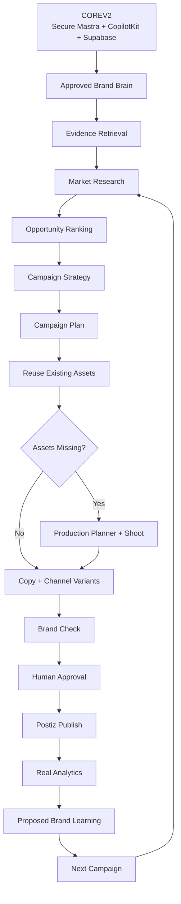

Yes. The best iPix plan is to build **one vertical brand loop**, reuse the strong existing Planner/Cloudinary spine, and add only the missing intelligence/campaign capabilities.

Your canonical Brand spec already converges on this:

**Learn Brand → Market → Opportunity → Strategy → Campaign Plan → Reuse/Shoot Assets → Create → Brand Check → Approve → Publish → Measure → Learn → Next Campaign.** 

I also verified the current `v2-ipix` Linear project. The Brand epic, Brand UI, Brand Intelligence, Planner, shoot, Cloudinary, analytics and Mastra-platform tasks already exist. The important gap is **not another Brand Intake architecture**; it is the middle and back half of the loop: research → opportunity → campaign → publishing → learning.

## Recommended development order



That matches the canonical uploaded journey and avoids the older 12-agent/edge-function design that your archive explicitly says **not to implement**.  

# 1. Phase 0 — finish Core first

Do **not** put brand research, campaign agents, pgvector search, or publishing on the critical path until the secure Planner foundation passes.

| Order | Existing Linear task                                                                                                  | Why it stays                |
| ----: | --------------------------------------------------------------------------------------------------------------------- | --------------------------- |
|     1 | **IPI-1042 · RUNTIME-001 — Make the New iPix AI Runtime Compile and Build Cleanly**                                   | Runtime contract            |
|     2 | **IPI-1009 · MASTRA-UPG-004 — Verify CopilotKit Streaming, Stop, Tenant Isolation, and Runtime After Mastra Upgrade** | Certification               |
|     3 | **IPI-1045 · STREAM-001 — Let Authenticated iPix Users Stream Planner Responses Safely**                              | Real authenticated AI       |
|     4 | **IPI-1124 · MASTRA-HOST-PG-001 — Run Mastra Memory on Shared Supabase Postgres in Hosted iPix**                      | Hosted durable memory       |
|     5 | **IPI-1125 · QA-ORG-001 — Provision Two Isolated QA Organizations and Users for Cross-Org Planner Proof**             | Org A/B test identities     |
|     6 | **IPI-1126 · HOST-PREVIEW-001 — Deploy an Exact iPix PR SHA to a Vercel Preview**                                     | Hosted proof                |
|     7 | **IPI-1047 · ACCESS-001 — Stop One Organization From Opening Another Organization’s Planner Thread**                  | Tenant security             |
|     8 | **IPI-1127 · ACCESS-CLAIM-001 — Make Planner Thread Ownership an Atomic Shared Claim**                                | Race-safe ownership         |
|     9 | **IPI-1117 · HOST-RUNNER-001 — Make Planner Stop Work Across Vercel Instances**                                       | Correct hosted cancellation |
|    10 | **IPI-1048 · PLANNER-001 — Make the Production Planner the Main iPix AI Assistant**                                   | Main production agent       |
|    11 | **IPI-1049 · TOOL-001 — Let the Planner Build Shoot Type, Deliverables, Shot List, and Budget Safely**                | Safe deterministic tools    |
|    12 | **IPI-1050 · MEM-001 — Let the Planner Remember the Conversation After Refresh and Restart**                          | User continuity             |
|    13 | **IPI-1088 · COPILOT-REPLAY-001 — Reload the Planner UI from the saved conversation after refresh**                   | UI continuity               |
|    14 | **IPI-1051 · UI-001 — Let an iPix Operator Use the Planner in One Simple Authenticated Screen**                       | Thin user-facing AI         |
|    15 | **IPI-1041 · CORE-001 — Prove the New iPix AI Foundation Survives Refresh, Restart, and Cross-Org Access Attempts**   | Core release exam           |

**Faster/better approach:** finish this chain rather than introducing another agent runtime, another storage system, or another Planner abstraction.

---

# 2. Phase 1 — Brand Brain MVP

The canonical files are right here: **do not create `BRAND-INTAKE`, `BRAND-REVIEW`, `BRAND-HITL`, `BRAND-DATA`, or `FIRECRAWL-001` as separate tickets.** Fold the intake, evidence, draft review and atomic approval into the existing Brand task. 

| Order | Existing task                                                                                                        | Required outcome                                                 |
| ----: | -------------------------------------------------------------------------------------------------------------------- | ---------------------------------------------------------------- |
|     1 | **IPI-1089 · ONBOARD-001 — Let a New iPix User Sign Up, Create Their First Brand, and Reach the Operator Workspace** | Brand exists under correct org                                   |
|     2 | **IPI-1068 · BRAND-001 — Let Operators Browse Brands and Open Complete Brand Profiles**                              | Brand list + one complete Brand Hub                              |
|     3 | **IPI-1093 · BRAND-INTEL-001 — Turn a Brand Website Into an Approved Brand DNA Profile**                             | URL/docs → cited **draft** → human review → approved Brand Brain |
|     4 | **IPI-1039 · SB-V2-003 — Give Every Supabase Security Warning an Owner and Clear Action**                            | Brand RPC/security findings explicitly owned                     |
|     5 | **IPI-1040 · MIGRATION-001 — Prove New iPix Database Changes Can Be Added Without Replaying Old Migrations**         | Safe forward-only data changes                                   |

### IPI-1093 should own

```text
website + guide + product/catalog sources
        ↓
Firecrawl map/scrape/extract
        ↓
Gemini structured analysis
        ↓
draft Brand Brain
        ↓
evidence URLs + confidence
        ↓
CopilotKit review card
        ↓
Approve / Edit / Reject
        ↓
atomic trusted server write
        ↓
approved brands.ai_profile / Brand Brain truth
```

The Firecrawl webhook must **never** promote draft intelligence directly to approved Brand Brain. That rule is already called out in your planning material. 

## Brand Brain data

Keep durable truth relational:

```text
Brand
├── identity
├── positioning
├── mission / values
├── voice
├── vocabulary
├── visual rules
├── products / collections
├── audiences
├── messaging / claims
├── channel rules
├── restrictions
├── approved examples
└── source evidence
```

Use pgvector only for evidence retrieval, not canonical facts. Your canonical spec explicitly makes Postgres the filing cabinet and `BRAND.md`/agent exports a view, not the database. 

---

# 3. First new task to add — Brand Knowledge

After Core and **IPI-1093** are proven:

**Proposed: `BRAND-KNOWLEDGE-001 — Give AI Decisions Approved Brand Evidence With Citations`**

Prefer rewriting/reusing **IPI-924** if duplicate search proves it is the same owner, as your task audit already recommends. 

### Purpose

A Mastra agent should be able to answer:

> “Why should Maison Solène avoid discount language?”

with:

```text
Approved rule:
Avoid discount-led positioning.

Evidence:
Brand Guide p.18
Website /about
Approved SS26 campaign

Confidence:
94%
```

### Backend

```text
Supabase RLS
→ approved evidence rows
→ embeddings
→ pgvector similarity
→ re-check org + brand ownership
→ return cited chunks
```

**Important:** vector similarity is retrieval, not authorization. Supabase documents pgvector as an embedding/vector similarity extension; RLS remains the security boundary. ([Supabase][1])

### UI

Add this to **SCR-03 Brand Detail**, not another top-level page:

`Overview · Voice · Visual · Products · Audiences · Rules · Sources`

CopilotKit can render source cards and “Why?” explanations.

---

# 4. Phase 2 — Market Intelligence

These are the first meaningful missing product owners.

### New task 1

**`BRAND-RESEARCH-001 — Research Competitors, Trends, and Market Opportunities With Evidence`**

Do **not** split competitor/trend/social into three tickets initially.

### Workflow

```text
research question
→ discover sources
→ Firecrawl / Gemini Search
→ evaluate evidence quality
→ retrieve missing pages
→ normalize facts
→ save evidence
→ synthesize research brief
```

Mastra’s official Deep Search template is a strong pattern because it demonstrates iterative research, gap detection, multiple agents and suspend/resume. Adapt the workflow structure, not its domain. ([GitHub][2])

### New task 2

**`BRAND-OPPORTUNITY-001 — Rank Market Opportunities Against Each Brand`**

This is one of the parts iPix should custom-build.

Example:

```text
Metallic accessories

Trend momentum       91
Brand fit            94
Audience fit         89
Competitive gap      82
Evidence confidence  90

Overall              90/100
```

The scores should be **iPix scores**, backed by stored evidence and deterministic inputs where possible.

---

# 5. Phase 3 — Campaign strategy and planning

Use the existing empty:

**IPI-1105 · IPI-EPIC · CAMPAIGNS & PUBLISHING — Campaigns, Preview, and Publish**

as the parent.

Do not overload **IPI-1081 · PLAN-001**. That task remains the **shoot plan**, exactly as your canonical Brand doc specifies. 

### New task 3

**`CAMPAIGN-STRATEGY-001 — Turn an Approved Opportunity Into an Interactive Campaign Strategy`**

Output:

```text
Objective
Audience
Insight
Positioning
Big Idea
Offer
Channels
KPIs
Budget envelope
Timeline
```

### UI pattern

Use CopilotKit shared state, not a giant chat response:

```text
[Objective]
[Audience]
[Positioning]
[Message]
[Channels]
[KPIs]

        [Edit]
        [Reject]
        [Approve strategy]
```

The CopilotKit examples repo currently lists both a **Mastra canvas starter** and **mastra-pm**, which are appropriate references for interactive shared state and generative UI. ([GitHub][3])

### New task 4

**`CAMPAIGN-PLAN-001 — Turn an Approved Strategy Into an Executable Campaign Plan`**

Output:

```text
timeline
calendar
deliverables
owners
channel requirements
asset requirements
creative brief
```

The creative brief should feed **Production Planner**, not become a second Planner.

---

# 6. Phase 4 — assets and production

Keep the existing Cloudinary chain.

```text
IPI-1108 foundation
→ IPI-1109 media data proof
→ IPI-1122 Supabase media hardening
→ IPI-1110 signing
  ∥ IPI-1111 webhook
  ∥ IPI-1112 delivery
→ IPI-1113 disposable E2E
  ∥ IPI-1114 reconciliation
→ IPI-1116 upload
  ∥ IPI-1069 asset library
→ IPI-1118 shoot attachment
→ IPI-1119 exact-version approval
→ IPI-1120 approved delivery
→ IPI-1115 production cutover last
```

### New task 5

**`MEDIA-AGENT-001 — Find Approved Existing Assets Before Creating New Ones`**

Do this **after** the media library works.

Its job:

```text
Campaign asset needs
        ↓
search approved Cloudinary/Supabase assets
        ↓
match available assets
        ↓
identify gaps
        ↓
gap → Production Planner
```

Do not build another DAM.

---

# 7. Phase 5 — create + compliance

### New task 6

**`CAMPAIGN-COPY-001 — Create Brand-Safe Channel Copy From Approved Assets and Strategy`**

Adapt the official Mastra ad-copy template for:

* structured channel variants,
* input → summary → copy workflow,
* platform-specific output.

Do **not** copy its OpenAI/S3/browser stack; iPix already owns model/media choices. The architectural pattern is useful. ([GitHub][4])

### New task 7

**`BRAND-CHECK-001 — Check Copy and Media Against the Approved Brand Brain`**

This is an advisory/evidence-based validator:

```text
Voice              96
Claims             100
Product facts      100
Visual rules        94
Audience fit        92
Channel rules       89

Issue:
CTA is more promotional than approved voice.

Evidence:
Voice rule V-12
```

Human approval remains mandatory.

### Conditional new task

**`CHANNEL-PREVIEW-001 — Preview Campaign Content Before Publishing`**

Create this only if the existing Preview/Publish UI cannot naturally absorb channel previews.

---

# 8. Phase 6 — publishing

### New task 8

**`PUBLISH-001 — Publish Only Approved Campaign Content Through Postiz`**

The contract should be:

```text
approved campaign content
+
exact approved Cloudinary versions
+
approved channel/date
        ↓
Mastra deterministic publish workflow
        ↓
Postiz API
```

No `publish()` tool should execute directly from free-form chat.

Postiz already provides scheduling, analytics, collaboration, a public API, Node SDK and automation integrations, so iPix should integrate it rather than recreate platform OAuth and scheduler infrastructure. ([GitHub][5])

---

# 9. Phase 7 — analytics and learning

Keep:

**IPI-1073 · ANALYTICS-001 — Bring the Existing Analytics Workspace Into the New App Without Fake Metrics**

This should remain deterministic and honest. Your canonical source explicitly says unsupported KPIs stay empty rather than fabricated. 

Initially:

```text
Supabase counts
Postiz delivery metrics
Cloudinary asset/version IDs
Stripe revenue when genuinely attributable
```

Do **not** immediately create a separate “AI Analytics” task.

### New task 9

**`LEARN-001 — Recommend Brand Brain Improvements From Real Campaign Results`**

The workflow:

```text
real metrics
→ evidence-backed analysis
→ proposed Brand Brain diff
→ human review
→ approve
→ versioned Brand Brain update
```

Never let analytics silently mutate the Brain.

---

# 10. Recommended new-task set

This is the smallest set I would add after duplicate-search, rather than the 17-ticket version from the older proposal. The canonical file itself warns against minting the larger draft plan directly. 

|    Order | Proposed task                                                                                     | Parent               | Phase                                |
| -------: | ------------------------------------------------------------------------------------------------- | -------------------- | ------------------------------------ |
|        1 | **BRAND-KNOWLEDGE-001 — Give AI Decisions Approved Brand Evidence With Citations**                | **IPI-1099**         | MVP / after Core                     |
|        2 | **BRAND-RESEARCH-001 — Research Competitors, Trends, and Market Opportunities With Evidence**     | **IPI-1099**         | Post-MVP                             |
|        3 | **BRAND-OPPORTUNITY-001 — Rank Market Opportunities Against Each Brand**                          | **IPI-1099**         | Post-MVP                             |
|        4 | **CAMPAIGN-STRATEGY-001 — Turn an Approved Opportunity Into an Interactive Campaign Strategy**    | **IPI-1105**         | Post-MVP                             |
|        5 | **CAMPAIGN-PLAN-001 — Turn an Approved Strategy Into an Executable Campaign Plan**                | **IPI-1105**         | Post-MVP                             |
|        6 | **MEDIA-AGENT-001 — Find Approved Existing Assets Before Creating New Ones**                      | **IPI-1102**         | Post-media                           |
|        7 | **CAMPAIGN-COPY-001 — Create Brand-Safe Channel Copy From Approved Assets and Strategy**          | **IPI-1105**         | Post-MVP                             |
|        8 | **BRAND-CHECK-001 — Check Copy and Media Against the Approved Brand Brain**                       | **IPI-1105**         | Post-MVP                             |
|        9 | **PUBLISH-001 — Publish Only Approved Campaign Content Through Postiz**                           | **IPI-1105**         | Post-MVP                             |
|       10 | **LEARN-001 — Recommend Brand Brain Improvements From Real Campaign Results**                     | **IPI-1099**         | After analytics                      |
| Optional | **CHANNEL-PREVIEW-001 — Preview Campaign Content Before Publishing**                              | **IPI-1105**         | Only if UI needs it                  |
| Optional | **COPILOT-CONTROL-001 — Let Operators Start Mastra Actions From UI Controls Without Typing Chat** | Copilot/Launch owner | Only after gap-checking **IPI-1051** |

I would **not create** separate tickets for:

`BRAND-INTAKE` · `BRAND-REVIEW` · `BRAND-HITL` · `BRAND-DATA` · `FIRECRAWL-001` · `PGVECTOR-001` · `CAMPAIGN-APPROVAL-001`.

Those responsibilities can be owned by **IPI-1093**, **BRAND-KNOWLEDGE-001**, **IPI-1084/IPI-998 patterns**, and the actual feature tickets. This is also consistent with your uploaded live-ticket audit. 

---

# 11. Minimum useful agent set

Do **not** build the historical 12-agent Brand Profile fleet. 

Use one agent per meaningful station:

| Agent                      | Purpose                           | Writes?                           |
| -------------------------- | --------------------------------- | --------------------------------- |
| **ProductionPlannerAgent** | Shoot planning                    | Proposal only until approved save |
| **BrandIntelligenceAgent** | Site/docs → Brand Brain draft     | Draft only                        |
| **BrandResearchAgent**     | Competitors/trends/current market | Evidence rows only                |
| **OpportunityAgent**       | Rank candidate plays              | Opportunity drafts                |
| **StrategyAgent**          | Campaign strategy                 | Draft                             |
| **CampaignPlannerAgent**   | Calendar/deliverables/brief       | Draft                             |
| **MediaAgent**             | Find approved assets + gaps       | Links/proposals                   |
| **ContentAgent**           | Channel copy/variants             | Draft                             |
| **ComplianceAgent**        | Brand/claims checks               | Findings only                     |
| **AnalyticsAgent**         | Explain real metrics              | Read-only                         |
| **LearningAgent**          | Brand Brain diff proposals        | Draft only                        |

That is the maximum useful shape. Several can initially be implemented as **tools/workflows under fewer agents** and split only when responsibilities materially diverge.

---

# 12. Workflow architecture

Agents reason. **Mastra workflows enforce business order.**

### Brand Intake

```text
validate brand/org
→ Firecrawl
→ structured extraction
→ create cited draft
→ suspend
→ CopilotKit approval
→ server validates resume
→ atomic approved Brand Brain write
```

### Research

```text
research goal
→ source discovery
→ retrieve pages
→ assess evidence
→ fill gaps
→ synthesize
→ save citations
→ rank candidate opportunities
```

### Campaign

```text
opportunity
→ strategy draft
→ human approval
→ campaign plan
→ find assets
→ shoot gaps if required
→ create copy/variants
→ Brand Check
→ human approval
→ publish through Postiz
```

### Learning

```text
real metrics
→ identify repeated signals
→ supporting evidence
→ proposed Brand Brain diff
→ human approval
→ new Brand Brain version
```

The user-facing Brand journey in your canonical file is essentially the same loop. 

---

# 13. Tech stack

| Layer                           | Owns                                                                |
| ------------------------------- | ------------------------------------------------------------------- |
| **Next.js / React**             | Product UI                                                          |
| **CopilotKit / AG-UI**          | Chat, shared state, generative UI, HITL                             |
| **Mastra**                      | Agents, tools, workflows, memory, structured output, suspend/resume |
| **Supabase Postgres**           | Durable application truth                                           |
| **Supabase Auth + RLS**         | Tenant/security boundary                                            |
| **pgvector**                    | Semantic evidence retrieval                                         |
| **Cloudinary**                  | Image/video bytes, transforms, exact media versions                 |
| **Firecrawl**                   | Website map/scrape/extract                                          |
| **Gemini Search + URL Context** | Current external research/synthesis                                 |
| **Postiz**                      | Social scheduling/publishing                                        |
| **Stripe**                      | Money/revenue truth where attributable                              |
| **PostHog**                     | First-party behavior/funnel analytics                               |
| **Vercel**                      | Current application host                                            |

Do not add a graph database, LangGraph, OpenClaw, Hermes, another auth platform, another object store, or another workflow runtime.

---

# 14. Screens

You do not need 20 new pages. Upgrade the existing operator screens.

| Screen                          | Main job                           | Frontend features                         | AI features              |
| ------------------------------- | ---------------------------------- | ----------------------------------------- | ------------------------ |
| **SCR-01 Command Center**       | What needs attention?              | decision cards, statuses                  | opportunities later      |
| **SCR-02 Brand List**           | Find brand                         | cards, DNA status                         | none needed              |
| **SCR-03 Brand Detail / Brain** | Understand + approve brand         | tabs, evidence, confidence, versions      | draft cards, Q&A, HITL   |
| **SCR-06 Shoot Wizard**         | Fill asset gaps through production | structured wizard                         | Production Planner       |
| **SCR-07 Campaigns**            | Strategy + plan + content          | strategy canvas, plan, calendar, variants | Strategy/Campaign agents |
| **SCR-08 Assets**               | Search/upload/approve              | Cloudinary library, filters, versions     | Media Agent              |
| **SCR-10 Preview / Publish**    | Review exact channel output        | device/channel preview, schedule          | HITL + Publish workflow  |
| **SCR-16 Analytics**            | Organization truth                 | real charts or empty states               | summary only             |
| **SCR-17 Campaign Performance** | What worked?                       | channel/asset/product drilldown           | Analytics + Learning     |

No additional top-level screen is required for MVP.

Optional later: `/app/campaigns/[id]` when **SCR-07** becomes too dense.

---

# 15. UI components worth standardizing

Frontend reusable components:

```text
BrandBrainSection
EvidenceDrawer
ConfidenceBadge
ApprovalCard
OpportunityCard
StrategyCanvas
CampaignTimeline
AssetNeedList
AssetVersionPicker
BrandCheckPanel
ChannelPreview
PublishScheduleCard
MetricCard
LearningDiffCard
```

Every component should be driven by typed server data, not arbitrary LLM prose.

A useful CopilotKit split:

```text
Chat
→ asks/explains

Generative cards
→ structured opportunities / findings

Shared state
→ strategy + campaign plan

Interrupt/HITL
→ consequential approval
```

The current CopilotKit examples list Mastra canvas and `mastra-pm` specifically for interactive cards/shared state patterns. ([GitHub][3])

---

# 16. Backend feature boundaries

### API/server

```text
/auth/*
/api/copilotkit
/api/brands/[id]
/api/brands/[id]/evidence
/api/brands/[id]/research
/api/campaigns/*
/api/assets/*
/api/publish/*
```

But avoid an API route for every agent step. Prefer Mastra workflow/tool calls behind the existing authenticated runtime.

### Supabase

Reuse existing brand tables first. Only add schema when a current workflow cannot be represented safely.

Likely durable entities over time:

```text
brands
approved Brand Brain/profile
brand intake drafts
brand sources/evidence
brand opportunities
campaigns
campaign strategies
campaign deliverables
campaign content
campaign asset links
campaign approvals
publishing references
campaign metrics
brand learning proposals
```

Avoid the archived spec’s large up-front table explosion. That design is explicitly historical. 

---

# 17. GitHub repos/examples to adapt

These are the highest-value references.

| Reference                                | Use in iPix                                                |
| ---------------------------------------- | ---------------------------------------------------------- |
| **Mastra**                               | core agent/workflow patterns                               |
| **Mastra template-company-knowledge**    | evidence retrieval/pgvector architecture                   |
| **Mastra template-deep-search**          | iterative market research workflow                         |
| **Mastra template-ad-copy-from-content** | channel-copy workflow                                      |
| **CopilotKit examples / Mastra canvas**  | shared state + generative UI                               |
| **CopilotKit mastra-pm**                 | interactive planning UX                                    |
| **Firecrawl**                            | map/scrape/extract — no custom crawler                     |
| **SCTY brand.md**                        | machine-readable behavioral brand contract                 |
| **VOICE.md**                             | voice constraints/lint concepts                            |
| **brand-book**                           | brand.json / measured brand tokens / intake concepts       |
| **Style Dictionary**                     | deterministic visual tokens                                |
| **Cloudinary Node SDK**                  | media API                                                  |
| **Next Cloudinary**                      | upload/delivery Next.js integration                        |
| **Cloudinary Product Launch Agent**      | asset selection/channel derivative orchestration reference |
| **Postiz**                               | social scheduling + publishing                             |
| **PostHog**                              | behavior/funnel analytics                                  |

Useful direct references:

[Mastra Deep Search template](https://github.com/mastra-ai/template-deep-search?utm_source=chatgpt.com)
[Mastra Company Knowledge template](https://github.com/mastra-ai/template-company-knowledge?utm_source=chatgpt.com)
[Mastra Ad Copy template](https://github.com/mastra-ai/template-ad-copy-from-content?utm_source=chatgpt.com)
[CopilotKit examples](https://github.com/CopilotKit/CopilotKit/tree/main/examples?utm_source=chatgpt.com)
[Firecrawl](https://github.com/firecrawl/firecrawl?utm_source=chatgpt.com)
[BRAND.md](https://github.com/SCTY-Inc/brand.md?utm_source=chatgpt.com)
[VOICE.md](https://github.com/efeoncepro/voice.md?utm_source=chatgpt.com)
[brand-book](https://github.com/ordinarynerds/brand-book?utm_source=chatgpt.com)
[Cloudinary Product Launch Agent](https://github.com/cloudinary-devs/product-launch-agent?utm_source=chatgpt.com)
[Postiz](https://github.com/gitroomhq/postiz-app?utm_source=chatgpt.com)
[PostHog](https://github.com/PostHog/posthog?utm_source=chatgpt.com)

`BRAND.md` is particularly useful because its current spec explicitly covers voice, audiences, messaging, behavior, safety, forbidden claims, citation policy and human delegation. ([GitHub][6]) `VOICE.md` provides structured per-surface language constraints and linting concepts that map directly to Brand Check. ([GitHub][7]) `brand-book` is useful for measured brand tokens and its `brand.json` concept, but Supabase should remain iPix truth. ([GitHub][8])

---

# 18. Official docs to examine during implementation

Use these before coding each relevant task:

[Mastra documentation](https://mastra.ai/docs?utm_source=chatgpt.com)
[CopilotKit documentation](https://docs.copilotkit.ai/?utm_source=chatgpt.com)
[CopilotKit Mastra HITL / useInterrupt](https://docs.copilotkit.ai/mastra/human-in-the-loop/useInterrupt?utm_source=chatgpt.com)
[Supabase RLS documentation](https://supabase.com/docs/guides/database/postgres/row-level-security?utm_source=chatgpt.com)
[Supabase pgvector documentation](https://supabase.com/docs/guides/database/extensions/pgvector?utm_source=chatgpt.com)
[Firecrawl documentation](https://docs.firecrawl.dev/?utm_source=chatgpt.com)
[Cloudinary documentation](https://cloudinary.com/documentation?utm_source=chatgpt.com)
[Postiz documentation](https://docs.postiz.com/?utm_source=chatgpt.com)
[PostHog documentation](https://posthog.com/docs?utm_source=chatgpt.com)

---

# 19. Skills each implementation task should use

For iPix engineering tasks:

```text
graphify
→ dependency/path discovery

Ponytail
→ cheapest proof first

mastra
→ installed Mastra API/workflow contract

copilotkit
→ AG-UI/shared state/HITL

ipix-supabase
→ schema/RLS/RPC/migrations

cloudinary
→ media tasks

fashion-production
→ shoot/creative domain semantics

nextjs-developer
→ UI/server boundaries

research
→ current authoritative docs/repositories

tdd
→ failing targeted test first

code-review
→ implementation quality/security

pr-workflow
→ branch/PR gates

linear
→ live issue state/dependencies

task-verifier
→ independent PASS/FAIL/BLOCKED proof
```

### Every Linear task should start with this block

> **Faster/better approach:** inspect current iPix code and live dependencies first. Reuse existing implementation → installed dependency → official API/module → official example/template → smallest custom code. Use Graphify for affected paths, Ponytail cheapest-proof-first, read only load-bearing files, inspect installed package source/types before web docs, make the smallest safe change, run targeted tests before broad suites, and use hosted/browser verification only when required.

---

# 20. Testing strategy

Each task should have **real-world acceptance**, not just “component renders.”

Examples:

### Brand Brain

```text
Maison Solène website
→ draft says “luxury only”
→ source evidence does not support it
→ operator Rejects
→ approved Brand Brain still lacks “luxury only”
```

### Knowledge

```text
Org A asks why discount language is forbidden
→ gets approved Org A rule + citations

Org B tries same evidence ID
→ no data
```

### Research

```text
3 competitor facts
→ each has URL + retrieval date
→ one unsupported claim rejected
```

### Campaign

```text
approved opportunity
→ strategy
→ human edit
→ plan reflects edited strategy
```

### Assets

```text
campaign needs 5 assets
→ 3 approved versions found
→ gap list = 2
→ only those 2 feed Production Planner
```

### Publish

```text
draft content
→ Postiz call count = 0

approved exact copy + asset version
→ one idempotent Postiz schedule
```

### Learn

```text
real metrics show close-up assets repeatedly outperforming
→ Learning Agent proposes new visual preference
→ no Brand Brain mutation until human approves
```

Verification order:

```text
static inspection
→ unit
→ targeted integration
→ typecheck
→ build
→ E2E
→ hosted/live proof only where necessary
```

---

# Recommended Mermaid diagrams

Use these in Linear where they materially prove architecture:

| Diagram               | Best use                                                             |
| --------------------- | -------------------------------------------------------------------- |
| **Flowchart**         | overall Brand → Campaign → Learn dependency chain                    |
| **Sequence diagram**  | HITL and publish calls: user → CopilotKit → Mastra → Supabase/Postiz |
| **State diagram**     | Brand Brain `draft → review → approved/rejected/superseded`          |
| **ER diagram**        | only when schema relationships actually change                       |
| **Gantt**             | roadmap/order tracker; not execution truth                           |
| **Journey flowchart** | operator experience across SCR-03/07/08/10/17                        |

Do not paste diagrams into every ticket. Use the cheapest diagram that explains the risky behavior.

---

## Now → Next → Later

**Now:** complete **COREV2**, then **IPI-1068 · BRAND-001** + **IPI-1093 · BRAND-INTEL-001**, while the existing Cloudinary MVP sequence continues in its dependency order.

**Next:** create only **BRAND-KNOWLEDGE-001**, **BRAND-RESEARCH-001**, **BRAND-OPPORTUNITY-001**, **CAMPAIGN-STRATEGY-001**, **CAMPAIGN-PLAN-001**, **MEDIA-AGENT-001**, **CAMPAIGN-COPY-001**, **BRAND-CHECK-001**, **PUBLISH-001**, and **LEARN-001**, after a live Linear duplicate search.

**Later:** **IPI-993 · MASTRA-WF-000 — iPix Mastra Workflow & Tool Orchestration Platform**, task-progress UI, standardized HITL reuse, parallel workflows, MCP, dynamic workflows, broad evals, schedules, browser agents, Cloudflare hosting and cross-brand automation.

### Summary:

* **Best decision:** build one end-to-end **Brand → Campaign → Revenue → Learning** loop instead of a large Brand Intelligence subsystem.
* **Why:** the secure Planner, shoot and Cloudinary foundation already exists; custom iPix value should concentrate on **approved Brand Brain, evidence, opportunity scoring, campaign decisions, brand compliance and learning**.
* **New tasks actually needed:** about **10**, not the older 17–30 task proposals.
* **Next action:** finish Core, strengthen **IPI-1093**, then duplicate-search and mint **BRAND-KNOWLEDGE-001** first.

[1]: https://supabase.com/docs/guides/database/extensions/pgvector?utm_source=chatgpt.com "pgvector: Embeddings and vector similarity | Supabase Docs"
[2]: https://github.com/mastra-ai/template-deep-search?utm_source=chatgpt.com "GitHub - mastra-ai/template-deep-search: Template repository for template-deep-search · GitHub"
[3]: https://github.com/CopilotKit/CopilotKit/blob/main/examples/README.md?utm_source=chatgpt.com "CopilotKit/examples/README.md at main · CopilotKit/CopilotKit · GitHub"
[4]: https://github.com/mastra-ai/template-ad-copy-from-content?utm_source=chatgpt.com "GitHub - mastra-ai/template-ad-copy-from-content: A Mastra template that generates compelling ad copy and promotional images from content provided as plain text or PDF links. Features AI-powered copywriting with image generation capabilities. · GitHub"
[5]: https://github.com/gitroomhq/postiz-app?utm_source=chatgpt.com "GitHub - gitroomhq/postiz-app: 📨 The ultimate agentic social media scheduling tool 🤖 · GitHub"
[6]: https://github.com/SCTY-Inc/brand.md?utm_source=chatgpt.com "GitHub - SCTY-Inc/brand.md: The brand identity standard for AI agents · GitHub"
[7]: https://github.com/efeoncepro/voice.md?utm_source=chatgpt.com "GitHub - efeoncepro/voice.md: Format specification for describing a brand's communicational identity to AI agents. VOICE.md is to copy and tone what DESIGN.md is to visual identity. · GitHub"
[8]: https://github.com/ordinarynerds/brand-book?utm_source=chatgpt.com "GitHub - ordinarynerds/brand-book: Agent skill: build a brand guidelines document in Paper + a companion brand skill that keeps a product on-brand during agentic coding. · GitHub"
