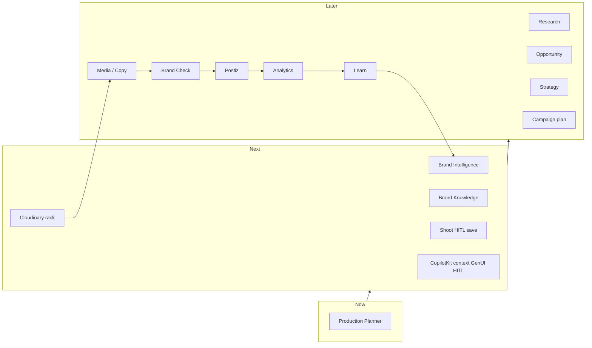

# CopilotKit × Mastra — plan

**Now:** finish **secure Planner runtime**. **After Core:** brand journey agents, workflows, assets, strategy, analytics — same CopilotKit + Mastra app, not a second runtime.

Product “why”: [prd.md](./prd.md). Order of bets: [roadmap.md](./roadmap.md). Daily check-off: [todo.md](./todo.md). Brand: **[brand.md](./brand.md)**. CopilotKit notes: [../archive/copilotkit-mastra/copilotkit/](./copilotkit).

**Faster path:** do not rewrite the starter. Pin the family, fail-closed auth (already Done), hosted pg allowlist on **Vercel**, then hosted Org A/B. Do not copy `/home/sk/ipix/app/src/mastra`. Do not implement Workers/Hyperdrive. Do not implement from [19-brand-lifecycle.md](./brand/19-brand-lifecycle.md).

---

## Goal

Prove one authenticated iPix user can use **one** Mastra agent through CopilotKit, with persistent memory and organization isolation — on **preview / hosted Postgres**, not only local LibSQL.

**After that exam:** the same route grows a **crew** (Brand, Research, Strategy, Media, Publish) and **workflows** (intake HITL, asset-gap → shoot, approve → Postiz, learn → DNA). One vertical loop — not one giant Brand Intelligence feature ([brand.md](./brand.md)).

---

## Current code (this repo)

| Piece | Reality |
| --- | --- |
| UI | Next.js App Router, `src/app/` |
| Agent | `src/mastra/`, CopilotKit route `src/app/api/copilotkit/` |
| Mastra | `@mastra/core@1.63.2`, `@mastra/pg@1.22.2` |
| Host | **Vercel** (Next.js UI + Mastra). Preview = **IPI-1126** on project **ipixai**, not ipix.co. |
| CopilotKit | `1.68.1` — AG-UI on `/api/copilotkit` |
| Storage | `PostgresStore` + `schemaName: "mastra"` + `disableInit: true` when URL set |

**IPI-1042** is still **In Progress** in Linear: lockfile is on main; post-merge schema fingerprint vs `@mastra/pg@1.22.2` is the remaining gate (not a second upgrade).

---

## Port from old iPix (CONVERT)

**IPI-1052 · CONVERT-001** is alignment, not a Core owner. Do **not** copy `/home/sk/ipix/app/src/mastra`. Port **business logic**; rebuild **runtime**. Long dump: [../archive/copilotkit-mastra/tasks/10-mastra-convert.md](./tasks/10-mastra-convert.md) — **ignore §5 version pins** (they still say 1.41).

| Do | Don't |
| --- | --- |
| Planner instructions, HITL **gates**, compute shoot tools, `makeMemoryResourceId` (`org:{org}::user:{user}`), wizard **step logic** later | Worker / Hyperdrive / ALS / custom SSE / DurableAgent / `resourceId: "default"` |
| First: Planner + read/compute tools + Memory + PostgresStore + org isolation + golden persistence | Shoot Wizard, write tools, Brand Intelligence in Core |
| ~40% of old Mastra as ideas/fixtures | ~80% of old storage + CopilotKit route + CF glue |

**Core sequence:** pin APIs → drop weather → Memory + PostgresStore → Production Planner → compute tools → golden persistence. **MVP:** working memory, HITL on current AG-UI, wizard, DNA, RPC writes. **Post-MVP:** schedules, MCP, dynamic workflows.

Storage RLS does **not** isolate orgs — `resourceId` is the partition. Fail closed on blank `orgId` / `userId`.

---

## Official examples (reuse APIs, not chrome)

One starter: CopilotKit [`examples/integrations/mastra`](https://github.com/CopilotKit/CopilotKit/tree/main/examples/integrations/mastra). Scorecard dump: [../archive/copilotkit-mastra/tasks/04-example-catalog.md](./tasks/04-example-catalog.md).

| When | Reuse | Avoid |
| --- | --- | --- |
| **Now** | `MastraAgent.getLocalAgents`, Next AG-UI route; [`v2/runtime` **node**](https://github.com/CopilotKit/CopilotKit/tree/main/examples/v2/runtime) | Demo weather agent, LibSQL as hosted SoT, Deno/Elysia, Workers handler |
| **Next** | [canvas/mastra](https://github.com/CopilotKit/CopilotKit/tree/main/examples/canvas/mastra), [mastra-pm](https://github.com/CopilotKit/CopilotKit/tree/main/examples/canvas/mastra-pm), [generative-ui](https://github.com/CopilotKit/CopilotKit/tree/main/examples/showcases/generative-ui), [template-agent-harness](https://github.com/mastra-ai/template-agent-harness) **patterns** | In-memory DB as prod; harness local libSQL/shell as multi-tenant |
| **Skip** | — | CopilotKit **v1/** examples, React Router Vite, `assistant-ui/mastra-hitl` as our chat library |

More URLs: [links.md](./links.md).

---

## CopilotKit — how we build the intercom

From archived [108](./copilotkit/108-copilotkit.md) / [109](./copilotkit/109-copilotkit.md). Full table: [prd.md](./prd.md) §5c.

| Now (Foundation) | Next | Later |
| --- | --- | --- |
| Auth + AG-UI stream (**1045**) | App context (**1087**) | Programmatic buttons if chat still required |
| One Planner screen (**1051**) | GenUI ShootPlan / approval cards | Shared-state campaign canvas |
| Thread replay (**1088**) | Frontend tools for **safe** UI only | Background tasks / MCP Apps |
| Tool rendering for compute tools | HITL `useInterrupt` (**1084**) | strands-crm **UX** on Brand pages |

Inspector / local: split `dev:ui` + `dev:agent`. Hosted: Vercel. **IPI-1009** = stream/HITL/Stop on the **1.63.2** family here — not a Cloudflare migrate.

---

## Build order (locks, not a Gantt)

```text
RUNTIME/DB/PG (1042 remaining evidence · 1043/1044 Done)
AUTH-001 / AUTH-002 Done
STREAM-001 (1045) In Progress — hosted Stop = 1117, not ACCESS
HOST-PG (1124) ∥ QA-ORG (1125) → HOST-PREVIEW (1126) → ACCESS hosted (1047)
PLANNER-001 (1048) after STREAM + ACCESS green for live swap
  ├ TOOL-001 (1049)
  └ MEM-001 (1050)  (also waits PG / hosted pg)
PG → REPLAY-001 (1088)
APP-001 + MEM + REPLAY → UI-001 (1051) → CORE-001 (1041)
ONBOARD-001 (1089) after AUTH-001 — not a STREAM blocker
ACCESS-CLAIM (1127) ∥ after 1124 — blocks RELEASE-001, not #23 merge
```

Hosted ACCESS merge order (from epic, 2026-08-31):

```text
1124 ∥ 1125 → 1126 Vercel Git preview (ipixai)
  → 1047 hosted Org A/B → CORE-001
```

Stop/cancel on serverless = **IPI-1117** (same Vercel isolate). Do **not** build Cloudflare Workers / Hyperdrive / OpenNext for this app.

---

## Phase 2 — brand journey (after CORE-001)

Do **not** start while **IPI-1041** is red. Do **not** mint **IPI-1105** children until duplicate search ([todo.md](./todo.md) **Add later**). Full operator steps: [brand.md](./brand.md).

```text
Brand UI (1068) + DNA HITL (1093)
  → Planner context hints (1087) + DNA as authorized input
  → ShootPlan (1081) → HITL (1084) → save once (1083) → wizard (1085)
  ∥ Cloudinary library (1108…1120)
  → BRAND-KNOWLEDGE-001 (pgvector, mint)

Then Later (1105):
  Research → Opportunity → Strategy canvas → Campaign plan
  → Creative brief → Media reuse (gap → Planner) → Copy → Brand Check
  → Preview → Postiz (approved only) → Analytics charts (1073)
  → Optimize HITL → LEARN-001 DNA proposals
```

| Beat | How |
| --- | --- |
| Intake | Firecrawl map (home/about/products/collections/lookbooks) + Gemini URL **draft**. HITL on **IPI-1093**. No custom crawler. |
| Brain | Structured layers in [brand.md](./brand.md) (voice, visual, claims, examples). `BRAND.md` export is a view. |
| Opportunity | Rank trend / brand fit / audience / gap. Operator picks. |
| Brief → shoot | Creative brief feeds **existing** Planner (**1081**). |
| Rack first | Search approved Cloudinary; generate/shoot **gaps only**. |
| Brand Check | Advisory score + claims flags; CopilotKit HITL; then RPC write. |
| Publish | Postiz social only. n8n later glue. Never chat-tool Postiz/Stripe. |



| Build | How |
| --- | --- |
| Agents | Same `src/mastra` registry; extra agents **off** the operator route until Core. Aliases must not diverge (**IPI-1048** rule). |
| Workflows | Native Mastra workflows + CopilotKit `useInterrupt`. Writes = SECURITY DEFINER RPC + user JWT. |
| Assets | Cloudinary Widget / signed / named transforms — **IPI-1116**, not a custom uploader. |
| Strategy / plan UI | CopilotKit shared state (canvas/mastra, mastra-pm) — [links.md](./links.md) · [prd.md](./prd.md) §5c. |
| Analytics | **IPI-1073** = charts only. “Why it sold” = **LEARN-001**. |
| Host | Vercel only. Dashboard **IPI-1076** / marketing **IPI-1077** are parallel product, not Workers. |

### Reuse vs never (brand phase)

| Reuse | Never |
| --- | --- |
| Firecrawl + Gemini URL for **drafts** | Auto-write DNA |
| Official CopilotKit HITL | Second `approval.ts` |
| Cloudinary search before shoot | Generate-first / second DAM |
| Postiz for social | Custom IG adapters |
| Stripe Checkout | Chat-button charges |
| [brand.md](./brand.md) stages | [19-brand-lifecycle.md](./brand/19-brand-lifecycle.md) as v2 tickets |

---

## What to reuse vs never copy

| Reuse | Never copy |
| --- | --- |
| Official CopilotKit Mastra starter | Old Worker / OpenNext / Hyperdrive / DurableAgent |
| CopilotKit context, GenUI, HITL, threads | Custom React↔agent sync |
| Production Planner **instructions** | Custom SSE, `resourceId: "default"` |
| `makeMemoryResourceId` idea | Weather as the product agent |
| Preview PostgresStore | Operator Shell / marketing CopilotKit chat |
|  | Wholesale `/home/sk/ipix/app/src/mastra` |

---

## Verify (every PR)

1. Graphify, then smallest diff.
2. `npx tsc --noEmit` / `npm test` on touched paths.
3. `npm run build` only if ports **3000** and **4111** are free.
4. Browser when UI/stream/auth ACs require it.
5. Supabase: preview / read-only. No `db push` to production. No `npx mastra migrate` on hosted.

---

## Parallel (not this plan’s critical path)

- **IPI-1076** dashboard · **IPI-1077** marketing  
- Cloudinary **IPI-1108…1120** (parallel with Next, not Core)  
- Brand **[brand.md](./brand.md)** · CopilotKit archive [../archive/copilotkit-mastra/copilotkit/](./copilotkit) — after Core except stream/UI already in Foundation

Mint / do-not-add: [todo.md](./todo.md). Candidates: [../plan/04/06.1-new-tasks.md](../../plan/04/06.1-new-tasks.md).
