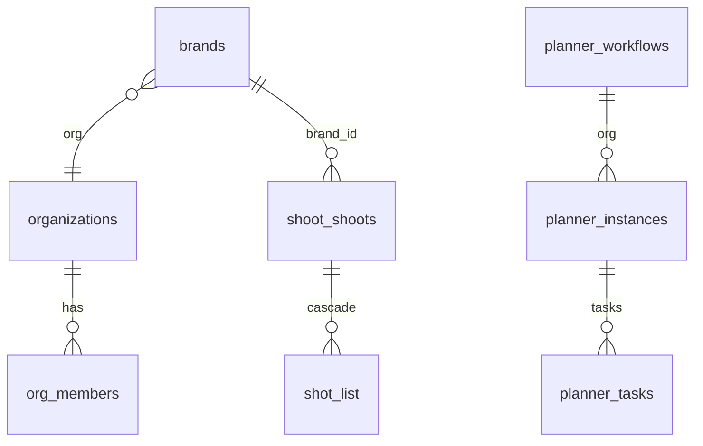

# 04 — Relationships + schema integrity

Status: Complete (read-only, 2026-09-01)
Score: 71/100
Verification confidence: 84/100
Tables inspected: FK counts all schemas; shoot FK delete actions; mastra PK gap; planner/shoot/talent org_id presence
Code paths inspected: none
Live queries: `pg_constraint` FK counts + shoot graph + missing PKs
Official references: PostgreSQL FK `confdeltype` (c=cascade, n=set null, r=restrict)

## Verdict

Canonical graphs are **internally consistent** (planner children → instances; shoot children → `shoot.shoots` CASCADE; talent bookings SET NULL to shoot). Two **duplicate SoTs** remain: FashionOS events vs iPix; `public.shoots` vs `shoot.shoots`. Mastra has **no FKs** and `mastra_workflow_snapshot` has **no primary key**. Shoot tenancy is **`brand_id` → `brands`**, not `org_id` on the shoot row.

## Current state

FK counts: public 148, planner 25, talent 18, auth 18, shoot 14, storage 5, **mastra 0**.

Planner / shoot / talent: **all have PKs** except none missing. Only `mastra.mastra_workflow_snapshot` lacks a PK (advisor INFO).

`shoot.shoots` columns: `brand_id` (CASCADE from `brands`), `created_by` SET NULL to `auth.users`. No `org_id`.

Child tables without `org_id` inherit tenancy via parent FKs (by design).

### Cardinality (live rows)

| Parent | Children (live) |
| --- | --- |
| organizations 4 | org_members 3 |
| brands 7 | shoot.shoots 4, brand_crawls 5 |
| shoot.shoots 4 | shot_list 16, shoot_deliverables 4 |
| planner.workflows 4 | phases 44, instances 4 |
| planner.instances 4 | tasks 44, assignments 3, dependencies 20 |
| public.shoots 8 | public.shoot_* 0 |

### Orphan / cascade risks

- Deleting a **brand** CASCADE-deletes `shoot.shoots` and nested shot lists — **high blast radius**.
- `talent.bookings` → `shoot.shoots` is **SET NULL** (booking can outlive shoot).
- Two IPI-949 orgs have **zero members** (orphaned tenants, not FK orphans).
- `public.shoots` (8) is **not** FK-linked to `shoot.shoots` (4) — dual ledger.

## What is correct

- Planner/shoot/talent PKs present.
- Shoot child CASCADE to canonical shoot.
- Brand delete is explicit CASCADE (documented risk, not accidental missing FK).

## Errors / red flags

| Pri | Finding |
| --- | --- |
| P1 | Dual shoot SoT (`public.shoots` vs `shoot.shoots`) |
| P1 | Dual task SoT (`public.tasks` 0 vs `planner.tasks` 44) — public empty, planner live |
| P1 | Mastra unreferenced to orgs + snapshot table without PK |
| P2 | Brand CASCADE wipes production shoots |
| P2 | `model_profiles` 3 vs `talent.talent_profiles` 1 |

## Fixes

- Treat `shoot.shoots` as write SoT; freeze `public.shoots` (shoot track).
- Do not add mastra→org FKs without a Mastra ticket (runtime owns keys).
- No bulk FK adds without workload.

## Faster/better approach

Constraint catalog + live row counts instead of drawing every FashionOS edge.

## Production blockers

Dual shoot reads in **application code** would be a blocker — verified in 11/17, not assumed here.

## Existing Linear ownership

Shoot canonical **IPI-1067** family; Mastra store **IPI-1042**; forward migrations **IPI-1040**.

## Verification / success criteria

- [x] FK counts + shoot delete actions
- [ ] Code grep for `from("shoots")` schema (step 11/17)

## ERD / data flow where useful

## Next step

**05 — Indexes + performance**
