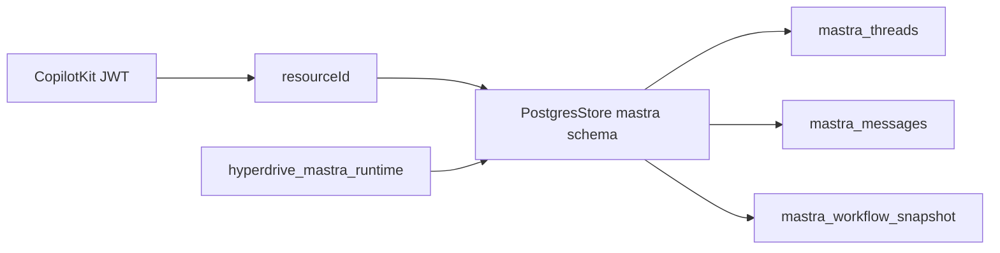

# 07 — Mastra runtime

Status: Complete (catalog + installed wiring; hosted persist **not** runtime-probed)
Score: 72/100
Verification confidence: 82/100
Tables inspected: all 34 `mastra.*` with row counts
Code paths inspected: `src/mastra/pg-store.ts` (`schemaName`, `disableInit`, TLS pool)
Live queries: mastra table list, schema ACL, missing PK
Official references: Mastra PostgresStore (installed `@mastra/pg@1.22.2`); skill: fail-closed without `MASTRA_DATABASE_URL`

## Verdict

Live `mastra` schema matches a **pinned PostgresStore** family: threads/messages exist (50 / 117), workflow snapshots and schedule triggers are **large**. Code uses `schemaName: "mastra"` and `disableInit: true` with a hosted TLS pool. JWT cannot USAGE the schema. Isolation is **resourceId in app**, not FKs. Hosted **restart persistence** and Org B thread ACL are **not proven** in this step. `mastra_workflow_definitions` is 0 (Studio dynamic workflows unused).

## Current state

Installed: `@mastra/core@1.63.2`, `@mastra/pg@1.22.2`, `@mastra/memory@1.28.1`, `mastra@1.27.2`.

Store constructor (repo): `id: "ipix-mastra-storage"`, shared `Pool`, `schemaName: "mastra"`, `disableInit: true`. Hosted: `ssl rejectUnauthorized` + CA, `max` hosted pool.

Role: schema ACL `hyperdrive_mastra_runtime` + `postgres`. Table policies ALL — only those roles should connect.

Hot tables: `mastra_workflow_snapshot` 6140, `mastra_schedule_triggers` 6078, `mastra_messages` 117, `mastra_threads` 50, `mastra_resources` 1, `mastra_schedules` 1, `mastra_ai_spans` 6. Agents/OM/datasets/skills **0**.

`mastra_workflow_snapshot` has **no PK**.

## What is correct

- disableInit + schemaName match conversion plan.
- Mastra not exposed to `authenticated` schema USAGE.
- Memory key format from AUTH-002 (`org:…::user:…`).

## Errors / red flags

| Pri | Finding |
| --- | --- |
| P1 | Restart persistence / recycle **UNVERIFIED** live (**IPI-1124**) |
| P1 | Thread ACL PR #23 not merged — DB RLS on mastra is role-based, not org-column |
| P2 | Snapshot/trigger row growth |
| P2 | No PK on workflow_snapshot |
| P2 | 34 empty Studio tables (skills, MCP, experiments) — inventory only |

## Fixes

- Prove hosted recycle then fingerprint (**IPI-1124**, **IPI-1042**).
- Merge thread ACL in app, not mastra FKs.
- Do not `mastra migrate` against production.

## Faster/better approach

Catalog + `pg-store.ts` vs opening all 34 CREATE TABLEs.

## Production blockers

**Yes for “Mastra memory survives deploy”** until IPI-1124 evidence. Schema presence is not that evidence.

## Existing Linear ownership

**IPI-1042**, **IPI-1124**, **IPI-1008** workflow_definitions, **IPI-1043/1044** Done (PostgresStore).

## Verification / success criteria

- [x] Live tables + code schemaName/disableInit
- [ ] Insert thread → recycle → same thread (**not this session**)

## ERD / data flow where useful

## Next step

**08 — Planner**
