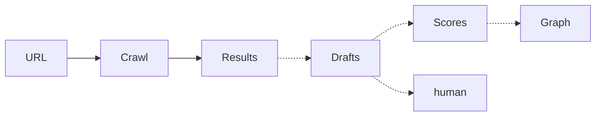

# 09 — Brand Intelligence

Status: Complete (tables + pipeline occupancy; HITL empty)
Score: 64/100
Verification confidence: 78/100
Tables inspected: brands, scores, intake, crawl, graph, agent results, onboarding_sessions, ai_agent_logs
Code paths inspected: none (edge functions listed in 16)
Live queries: MCP row counts; realtime publication membership
Official references: none

## Verdict

Pipeline **partially occupied**: 7 brands, 5 crawls, 40 crawl results, 78 onboarding sessions, 3194 `ai_agent_logs`. **Zero** `brand_scores`, **zero** `brand_intake_drafts`, **zero** graph nodes/edges, **zero** `brand_agent_results` / competitors / social channels. Cited Brand DNA and graph **are not live**. Realtime is wired for crawls + `brands`. Cron expires stale analysis locks.

## Current state

```text
URL → crawl (5 / 40 results) → AI logs (3194) / onboarding (78)
     ↛ intake drafts (0) ↛ scores (0) ↛ graph (0)
```

HITL staging table empty. Edge: `brand-intelligence`, `start-brand-crawl`, `firecrawl-webhook`.

## What is correct

- Crawl job tables + webhook idempotency table (`processed_firecrawl_webhooks` 7).
- Realtime on crawl progress.
- Fail-closed webhook table.

## Errors / red flags

| Pri | Finding |
| --- | --- |
| P1 | Approval → DNA → knowledge graph **not evidenced** (empty tables) |
| P2 | `ai_agent_logs` 3194 vs empty drafts — logs without materialised DNA |
| P2 | pgvector unused in practice (graph 0) |

## Fixes

- Product: **IPI-1093 / IPI-1128** brand track — do not invent graph writes here.
- Keep fail-closed webhook.

## Faster/better approach

Row occupancy as pipeline proof.

## Production blockers

“Brand Brain cited knowledge” is **missing in data**, not just UI.

## Existing Linear ownership

Brand crawl IPI-24/31 family; intake **IPI-26**; DNA Cloudinary **IPI-963** adjacent.

## Verification / success criteria

- [x] Empty vs occupied tables
- [ ] Operator approve URL → scores row (**not done**)

## ERD / data flow where useful



Dashed = empty live.

## Next step

**10 — Campaign**
