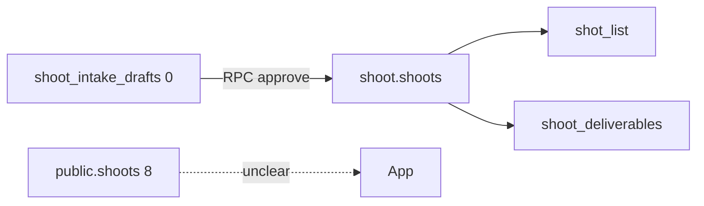

# 11 — Shoot

Status: Complete (schema + RLS shape; reject-write proof **not** runtime)
Score: 69/100
Verification confidence: 81/100
Tables inspected: all `shoot.*` + `public.shoots` / `public.shoot_*`
Code paths inspected: none (RPC names from history)
Live queries: columns, FKs/deletes, SELECT-only policies, row counts
Official references: none

## Verdict

**Canonical table is `shoot.shoots` (4 rows)** with children `shot_list` 16 and `shoot_deliverables` 4. **Legacy `public.shoots` still has 8 rows** (items/assets/payments 0). JWT is **SELECT-only** on all `shoot.*` — durable writes must be RPCs. Tenancy is **`brand_id`**, CASCADE from brands. **Reject = zero writes** is a **behavior** AC; this audit did **not** invoke reject. Intake drafts **0**.

## Current state

Dual ledger: public 8 vs shoot 4. `shot_type_references` 49 (catalog). Crew/assets/links/drafts empty.

Policies: one SELECT per shoot table. `shoot` schema has **0 DEFINER** functions — commit likely `public.commit_shoot_draft` (migration names).

## What is correct

- New schema exists and holds shot lists.
- JWT cannot smash rows without RPC.
- CASCADE graph is coherent.

## Errors / red flags

| Pri | Finding |
| --- | --- |
| P1 | Dual reads possible if code still uses `public.shoots` |
| P1 | Reject/idempotent save **UNVERIFIED** at runtime |
| P2 | Brand delete destroys shoots |
| P2 | No campaign_id on shoot |

## Fixes

- Grep + freeze public.shoots (step 17).
- QA: reject draft → COUNT(*) unchanged (**IPI-1081/1084** family).

## Faster/better approach

Policy command aggregation + row compare.

## Production blockers

Dual SoT until code ownership is proven. HITL reject not proven.

## Existing Linear ownership

**IPI-1067**, **IPI-727**, **IPI-721** org visibility, **IPI-772** openable shoots.

## Verification / success criteria

- [x] Canonical table identified
- [ ] Reject produces zero writes
- [ ] No dual write in src/

## ERD / data flow where useful

## Next step

**12 — Talent + booking**
