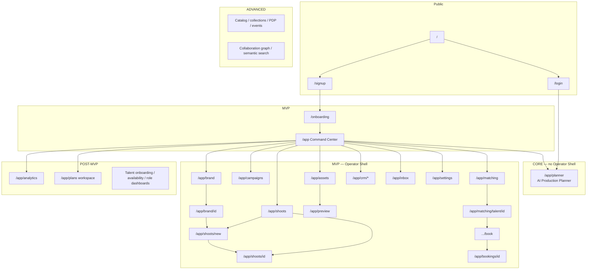

# iPix v2 sitemap (legacy audit)

**Product SSOT for routes:** [Product sitemap](../../sitemap.md) (updated 2026-08-24).
**This file** is the lumina-studio / HTML audit that informed V2. Do not treat July HTML counts as shipped iPix.

**Date:** 2026-08-24  
**Status:** Planning evidence. No pages copied. No Linear issues created.  
**Implementation truth:** [amo-tech-ai/lumina-studio](https://github.com/amo-tech-ai/lumina-studio) (`legacy lumina-studio checkout`, legacy `main`) `app/src/app/**/page.tsx`  
**New app:** [amoai-tech/ipixai](https://github.com/amoai-tech/ipixai) (`this repository`) CopilotKit + Mastra starter — **one demo route** (`src/app/page.tsx`)  
**Design pack:** `Universal-design-prompt-4/`. HTML prototype counts live in this audit and in git history of root `SITEMAP.md` on `main` (this PR replaces that root file with a pointer to `docs/sitemap.md`).  
**Progress tracker:** `Universal-design-prompt-4/progress-tracker.md` (2026-07-12 — **stale vs current code**)

Companion: [PAGE-MIGRATION-PLAN.md](./PAGE-MIGRATION-PLAN.md)

---

## 0. How to read this

Two different things are both named “Planner”:

| Name in v2 | What it is | Phase |
|---|---|---|
| **AI Production Planner** | CopilotKit chat + Mastra `production-planner` + compute tools | **Core** (minimal UI only) |
| **Production workspace** | Timeline / Kanban / Calendar / List around `planner.*` schema | **Post-MVP** (legacy `/app/planner`) |

Core **does not** include Operator Shell, Command Center, or the production workspace. Core’s only authenticated surface is the thin Planner proof (**IPI-1051 · UI-001 — Prove the Planner Through One Minimal Authenticated UI**).

---

## 1. Inventory totals (code, not HTML mockups)

| Metric | Count | Notes |
|---:|---:|---|
| Actual Next.js `page.tsx` routes | **43** | lumina-studio `app/src/app` |
| Auth **handlers** (not pages) | **2** | `/auth/callback`, `/auth/signout` |
| New iPix product routes | **1** | starter demo chat |
| Real implemented product pages | **28** | data or full workspace, not a stub |
| Thin wrappers over real workspaces | **4** | campaigns, analytics, campaign-perf, matching shell |
| Redirect / glue routes | **3** | `/app/crm`, `/app/onboarding`, `/app/talent` |
| Placeholders / partial tabs | **5** | matching extra tabs; analytics paid KPIs null; talent profile without id; planner mutations historically deferred |
| Design-only (HTML, no React route) | **12+** | catalog, collections, PDP crops, events, availability editor, role dashboards, collab/audit as a route, 5 mobile galleries |
| Marketing service landings | **9** | implemented static SEO pages — **not** the operator product |

`progress-tracker.md` said 7 complete / 10 in progress / 8 stub / 13 not started (**38 screens, ~52%**). That was true on **2026-07-12**. Current `main` has since shipped: CRM Deal Detail, Inbox UI, Campaigns workspace, Assets library, Analytics workspace, Planner hub/dashboard/workspace **read** views, Channel Preview studio, Talent onboarding wizard. **Do not plan v2 from the July tracker alone.**

HTML `Pages/*.dc.html` and `SITEMAP.md` (31 SCR prototypes) overstate “built.” Several SCR rows are design-complete only.

---

## 2. Audit vs requested surfaces

### Marketing / public

| Surface | Legacy route | Implemented? | Real data? | v2 |
|---|---|---|---|---|
| Landing | `/` | Yes — 6-section studio site + lazy marketing chat | Static + optional chat | **REDESIGN** — keep structure, drop Worker-bundle chat hacks |
| Pricing / features / about / contact | *none* | No | — | **DEFER** or one `/` page with sections — do not invent 4 routes |
| Service SEO (amazon, shopify, jewellery, …) | `/services/*` (9) | Yes, long static pages | No | **DROP** from operator v2; optional later marketing site |
| Login + signup | `/login` (signup is a **mode** on the same form) | Yes — Supabase email + Google | Auth | **COPY + CLEAN** — split `/login` and `/signup`; ignore stale “auth stubbed” comment on the page |
| Public AI/lead chat | `MarketingChat` on `/` | Yes, feature-flagged, CF-bundle constrained | Copilot | **DEFER** until Core Planner is proven |

### Operator

| Surface | Legacy route | Implemented? | Real data? | Tests (approx) | v2 |
|---|---|---|---|---|---|
| Command Center | `/app` | Yes | `brands` + `fetchCommandCenterKpis()`; `?skip=1` **dev fixtures** | `command-center-brand-sync` + related | **COPY + CLEAN** |
| Brand List | `/app/brand` | Yes | `brands` + scores | brand-hub **13** tests | **COPY + CLEAN** |
| Brand Detail | `/app/brand/[id]` | Yes | parallel queries + reanalyze action | brand-hub | **COPY + CLEAN** |
| Shoots List | `/app/shoots` | Yes | `shoot_portfolio_view` | shoot **9** | **COPY + CLEAN** |
| Shoot Detail | `/app/shoots/[shootId]` | Yes | `get_shoot_detail` RPC; not all 9 design tabs | shoot-detail tests | **COPY + CLEAN** |
| Shoot Wizard | `/app/shoots/new` | Yes, **~802-line page** | Mastra workflow + `/api/shoots/commit`; **6 of 10 design steps** | page test exists | **COPY + CLEAN** — extract; do not copy CF/Mastra hacks |
| Campaigns | `/app/campaigns` | Yes (**not** the July placeholder) | `campaigns` + `campaign_deliverables` | 1 | **COPY + CLEAN** |
| Assets | `/app/assets`, `/app/assets/[id]` | Yes | `listAssets` + RLS | assets **4** | **COPY + CLEAN** |
| Channel Preview | `/app/preview` | Yes | live `image_specs` | channel-preview-studio test | **COPY + CLEAN** |
| Onboarding | `/onboarding` (+ redirect `/app/onboarding`) | Yes | `onboarding_sessions` + crawl | onboarding **4** | **COPY + CLEAN** — MVP after Brand |
| Analytics | `/app/analytics` | Partial | campaign/asset/DNA counts; **reach/CTR/conversions null** | 2 | **REDESIGN** metrics; keep layout |
| Campaign performance | `/app/analytics/campaigns` | Partial | workspace exists | 1 | **REDESIGN** |
| Notifications | `/app/inbox` | Yes | `list_notifications` RPC | notifications **3** | **COPY + CLEAN** |

### CRM

All six screens + hub redirect are **real** (Deal Detail is no longer a 404-gate). High test density.

| Surface | Route | v2 |
|---|---|---|
| Hub | `/app/crm` → companies | Keep as redirect |
| Companies / detail | `/app/crm/companies`, `[id]` | **COPY + CLEAN** |
| Contacts / detail | `/app/crm/contacts`, `[id]` | **COPY + CLEAN** |
| Pipeline / deal | `/app/crm/pipeline`, `[id]` | **COPY + CLEAN** |

Phase: **MVP** (after Brand + Shoots). Do not put CRM in Core.

### Booking / talent

| Surface | Route | Implemented? | v2 |
|---|---|---|---|
| Matching | `/app/matching` | Talent tab live RPC; Creator/Asset/Product **disabled shells** | **COPY + CLEAN** talent only |
| Talent profile | `/app/talent/profile?talentId=` | Workspace exists; **no** `/matching/talent/[id]` index | **REBUILD** route shape |
| Booking wizard | `/app/matching/talent/[id]/book` | RPC-backed | **COPY + CLEAN** |
| Booking detail | `/app/bookings/[id]` | RPC + transitions | **COPY + CLEAN** |
| Availability editor | *no route* | Design only | **DEFER** |
| Talent onboarding | `/app/talent/onboarding` | Wizard + role gate | **DEFER** (Post-MVP two-sided) |
| Role dashboards | *no `/app/model` / `/app/roster`* | Design only | **DEFER** |

### Production workspace (“legacy Planner”)

| Surface | Route | Implemented? | v2 |
|---|---|---|---|
| Hub | `/app/planner` | Yes, real plans | **DEFER** Post-MVP as `/app/plans` |
| Dashboard | `/app/planner/dashboard` | Yes, KPIs | **DEFER** |
| Workspace | `/app/planner/[instanceId]` | Timeline/Kanban/Calendar/List **read** components exist | **DEFER** — mutations were the hole |
| Settings | `/app/planner/[instanceId]/settings` | Members live; some tabs disabled | **DEFER** |

### Shared AI UX

| Primitive | Legacy source | v2 |
|---|---|---|
| 3-panel Operator Shell | `components/operator-panel/operator-panel.tsx` | **COPY + CLEAN** — MVP, not Core |
| Nav rail | `components/operator-panel/nav-sidebar.tsx` | **COPY + CLEAN** — replace emoji icons with Lucide |
| Intelligence panel | `components/intelligence-panel/` | **COPY + CLEAN** — read-only briefing only |
| Chat dock | `operator-chat-dock` via `next/dynamic ssr:false` | **REBUILD** on CopilotKit v2 in new repo; do not copy CF bundle splits |
| Approval cards | `components/ui/approval-card.tsx` + `components/planner/gate-approval-card.tsx` | **COPY + CLEAN** |
| Evidence | `components/evidence-block/` | **COPY + CLEAN** |
| Generative UI registry | `components/copilot/generative-ui-registry.tsx` | **DEFER** until typed `ShootPlan` |
| Task progress UI | mostly missing / “AI is thinking” | **DEFER** MVP HITL/task tickets |
| Mobile bottom nav | **not in `app/src`** | **REBUILD Post-MVP** from design `BottomNavigation.dc.html` (MVP is desktop ≥768; no tab bar) |
| Bottom sheet | `components/ui/bottom-sheet.tsx` (Vaul, 38/62/90) | **COPY + CLEAN** |

---

## 3. Design system — reuse, don’t clone the library

Source of tokens: `app/src/styles/tokens.css` (Zeely Editorial v3) + `Universal-design-prompt-4/docs/design/DESIGN-TOKENS.md`.

| Design primitive | Legacy source | Used by | Reuse |
|---|---|---|---|
| Color / type / radius / nav widths | `styles/tokens.css` | globals + almost every screen | **COPY first** — map into new app CSS vars; drop starter dark-oklch Copilot overrides as default chrome |
| shadcn button/input/card/dialog/sheet | `components/ui/*` | everywhere | **COPY + CLEAN** — already shadcn; align with new starter, no second kit |
| Status chip | `components/ui/status-chip.tsx` | CRM, booking, shoots | **COPY** |
| Empty / error / skeleton | `empty-state`, `error-state`, `skeleton` | lists | **COPY** |
| Entity list | `entity-list.tsx` | CRM lists | **COPY + CLEAN** |
| Approval card | `approval-card.tsx` | HITL | **COPY + CLEAN** |
| Wizard step | `wizard-step.tsx` | shoot + talent onboarding | **COPY + CLEAN** |
| Nav rail + shell | `operator-panel/` | all `/app/*` | **COPY + CLEAN** after Core |
| Intelligence rail | `intelligence-panel/` | shell | **COPY + CLEAN** |
| Chat dock | operator-panel + CopilotChat | shell | **REBUILD** |
| Bottom sheet | `bottom-sheet.tsx` | mobile | **COPY** |
| Drawer / dialog | `drawer.tsx`, `dialog.tsx` | shortlist, confirms | **COPY** |
| Channel frames | `components/media/` | preview | **COPY + CLEAN** |
| Brand / shoot / campaign / talent cards | `brand-hub`, `shoot`, `campaigns`, `matching` | operator | **COPY + CLEAN** domain cards only |
| HTML `components/*.dc.html` | design pack | mockups | **Reference only** — do not import HTML |
| Mobile galleries | `SCR-MOBILE-*.dc.html` | none in React | **REBUILD** later |

Do **not** copy the entire old `components/` tree. No Worker dynamic-import fences, no `dev-skip-fixture` in production paths, no service-role clients in UI.

---

## 4. New iPix route hierarchy

Principles: shortest tree; one name per concept; Core stays tiny; do not keep `/app/brand` vs `/app/crm/companies` confusion without a reason (Brand = production DNA; CRM company = relationship — **keep both**).

```text
PUBLIC
/
├── login
├── signup
└── (optional later) pricing  — not in MVP nav

/onboarding                    # brand DNA funnel (MVP)

APP  (Operator Shell from MVP onward)
/app                           # Command Center (MVP). Core: skip this.
├── planner                    # AI Production Planner (Core = this page only)
├── brand
│   └── [id]
├── shoots
│   ├── new
│   └── [id]
├── campaigns
├── assets
│   └── [id]
├── preview                    # Channel Preview
├── matching
│   └── talent/[id]
│       └── book
├── bookings/[id]
├── crm
│   ├── companies[/id]
│   ├── contacts[/id]
│   └── pipeline[/id]
├── analytics
│   └── campaigns
├── inbox
├── settings                   # org/profile; new — do not port CF env UI
└── plans                      # Post-MVP production workspace (legacy /app/planner)
    ├── dashboard
    └── [id]
        └── settings

TALENT (Post-MVP)
/app/talent/onboarding
/app/talent                    # self profile
```

Dropped from v2 nav: `/services/*`, `/app/catalog`, `/app/collections`, `/app/events`, `/app/model`, `/app/roster`, duplicate `/app/onboarding` (redirect only).

---

## 5. Mermaid sitemap (phased)



---

## 6. First pages to port after Core

Rank: implemented + real data + tests + operator-critical + low runtime coupling + design reuse.

| # | Port | Why first |
|---:|---|---|
| 0 | `tokens.css` + empty/error/skeleton/status-chip/button/card | Unblocks every screen |
| 1 | Operator Shell + nav rail + intelligence panel | One chrome for all MVP pages — **after** Core |
| 2 | Chat dock **rebuilt** on new CopilotKit | Do not copy CF `ssr:false` dock |
| 3 | Command Center | Operator home; already KPI-backed |
| 4 | Brand List | Highest test density, simple reads |
| 5 | Brand Detail | Same hub; DNA is the product |
| 6 | Shoots List | Same spine |
| 7 | Shoot Detail | Core workflow; accept fewer tabs than the HTML |
| 8 | Channel Preview | Isolated, spec-driven, little Mastra |
| 9 | CRM companies + company detail | Real data + tests; CRM is further along than Analytics |
| 10 | Matching talent tab | Real RPCs; leave extra tabs disabled |

**Flagged as design-complete / code-thin (do not port first):** Shoot Wizard 10-step HTML (code is 6 steps), Onboarding 13-screen HTML (code is a shorter flow), Analytics paid-media KPIs, Campaigns-as-placeholder (docs lie — code is real but not first), Planner workspace, Availability, Role dashboards, SCR-18 collab, mobile galleries.

**Safer order than “Command Center first”:** tokens → shell → **Brand List/Detail → Shoots List/Detail → Command Center**. Command Center is an aggregator; it looks empty until Brand/Shoots exist. Use that order unless you need a home URL on day one of MVP.

---

## 7. Conflicts: docs vs GitHub

| Source | Claim | Code |
|---|---|---|
| `progress-tracker.md` | Campaigns/Assets = SectionPlaceholder | Real workspaces + Supabase |
| `progress-tracker.md` | Analytics = no route | `/app/analytics` + workspace |
| `progress-tracker.md` | Inbox = API only | `/app/inbox` + `InboxWorkspace` |
| `progress-tracker.md` | Deal Detail = 404 placeholder | `getDealDetail` + `DealDetailWorkspace` |
| `progress-tracker.md` | Planner = zero UI | Hub, dashboard, workspace views exist |
| `SITEMAP.md` | 15 verified / 31 production screens | Counts **HTML** `Pages/`, not React |
| `SITEMAP.md` | Booking = Shoot Wizard `flow=booking` | **Separate** booking routes + RPCs |
| `login/page.tsx` comment | Auth stubbed | `LoginForm` uses real Supabase |
| Handoff `02-screen-map.md` | `/app/matching`, `/app/preview` | Code uses those paths — **keep** |
| New `ipix` README/starter | Weather/proverbs demo | Replace in Core IPI-1051 · UI-001 — not a product page |

---

## 8. KEEP vs DO NOT COPY (every COPY decision)

**KEEP:** layout, editorial tokens, domain cards, list/detail information architecture, RPC/query *contracts*, Vitest coverage of business behavior, HITL approval/evidence patterns, 3-panel shell, Zeely onboarding *story*.

**DO NOT COPY:** Cloudflare Worker / OpenNext bundle splits, Hyperdrive, ALS, `emitInterruptOutcome`, `runtime-v2-fetch`, Mastra `noop` storage, service-role in client components, `dev-skip-fixture` / `?skip=1` as product, hardcoded `resourceId: "default"`, old CopilotKit Intelligence Threads drawer as Core, combined `npm run dev`, marketing chat’s Worker-size `dynamic()` maze.

---

## 9. Confidence

**84 / 100** — Full `page.tsx` inventory on local `lumina-studio` main; workspaces opened for campaigns/analytics/matching/CRM/planner/login. Not a live browser pass on production. Planner **mutation** completeness and Shoot Detail tab coverage not re-counted tab-by-tab. July tracker and HTML sitemap are known-stale.
