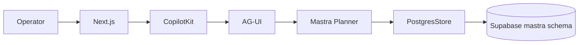
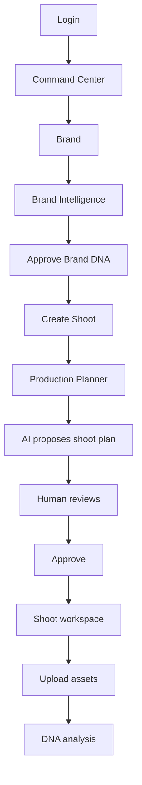

# Overall recommendation

For the **new iPix**, do **not rebuild the product from zero** and do **not fork the current app wholesale**.

Use this strategy:

> **New clean technical foundation + existing iPix product/UI/business logic.**

The documents consistently show that the valuable parts of iPix are already built: the operator experience, designs, Supabase data/auth/RLS, Mastra agents/tools/workflows, brand/shoot/CRM logic, and many React screens. The unstable part is mainly the **CopilotKit ↔ AG-UI ↔ Mastra ↔ persistence ↔ Cloudflare plumbing**.  

My recommended architecture is:

```text
NEW CLEAN FOUNDATION
        │
        ▼
Next.js App Router
        │
        ▼
Existing iPix Operator Shell + Pages
        │
        ▼
CopilotKit v2
        │
       AG-UI
        │
        ▼
Mastra
        │
        ▼
PostgresStore
        │
        ▼
Existing Supabase
```

Cloudflare remains around the system for DNS/CDN/WAF/R2/AI Gateway, but **do not make the Cloudflare Worker migration a prerequisite for rebuilding iPix**. Get the Node/Vercel path completely correct first. 

---

# 1. What should be the base?

## Use CopilotKit `examples/integrations/mastra`

This is the best foundation.

**Score: 98/100.**

It gives us the clean current pattern for:

```text
Next.js
→ CopilotKit
→ AG-UI
→ Mastra
```

Then replace its demo pieces with:

```text
iPix authentication
iPix Production Planner
Gemini / AI Gateway
Supabase PostgresStore
iPix UI
iPix tools
```

Do **not** make `canvas/mastra-pm` the application starter. It is an excellent feature reference, but `integrations/mastra` is the cleaner architectural foundation. 

### Foundation repos

| Repository/example                   | Use                                     | Stage |  Score |
| ------------------------------------ | --------------------------------------- | ----: | -----: |
| **CopilotKit `integrations/mastra`** | Main new application/runtime foundation |  Core | **98** |
| **CopilotKit `v2/runtime/node`**     | Verify runtime handler                  |  Core | **93** |
| **CopilotKit `v2/react`**            | Verify provider/hooks/API contracts     |  Core | **91** |
| **Mastra PostgresStore**             | Durable AI memory                       |  Core | **96** |
| `canvas/mastra-pm`                   | Shared state + working memory           |   MVP | **95** |
| `showcases/generative-ui`            | GenUI + approvals/HITL                  |   MVP | **94** |
| `examples/shadcn`                    | Copilot UI styling                      |   MVP | **92** |
| `canvas/mastra`                      | Visual cards/canvas                     |   MVP | **90** |
| `template-agent-harness`             | Memory/tasks patterns                   |  MVP+ |    ~85 |
| OpenBot / MCP / multi-agent examples | Advanced automation                     | Later |  80–87 |

This matches the strongest conclusion across the new repo reviews. 

---

# 2. Do NOT start by rebuilding all the website/dashboard pages

This would waste a large amount of existing work.

The current design tracker says that major pieces have already reached substantial React parity, including:

* Command Center
* Brand List
* Brand Detail
* Shoots List
* Shoot Wizard
* Channel Preview
* Onboarding
* Operator shell/providers
* CRM backend and data infrastructure

The existing conversion architecture also explicitly says the project is **brownfield, not greenfield** and that the shell, tokens, intelligence rail, chat dock, auth and several screens should not be rebuilt.  

So the new app should use:

```text
Clean new application/runtime
             +
Existing iPix visual/product layer
```

Not:

```text
Clean new application
             +
redesign 40 screens again
```

---

# 3. What exactly should we reuse?

## Reuse almost unchanged

| Existing iPix asset              | Decision                    |
| -------------------------------- | --------------------------- |
| Design tokens                    | **COPY / KEEP**             |
| OperatorShell                    | **COPY / KEEP**             |
| IntelligencePanel                | **COPY / KEEP**             |
| Existing dashboard React screens | **PORT**                    |
| Existing `.dc.html` designs      | **REFERENCE / parity SSOT** |
| Brand/shoot cards                | **COPY / ADAPT**            |
| CRM screens/components           | **PORT**                    |
| Mobile shell patterns            | **PORT**                    |
| Supabase Auth                    | **KEEP**                    |
| Organizations + memberships      | **KEEP**                    |
| RLS model                        | **KEEP + retest**           |
| Existing application tables/data | **KEEP**                    |
| `mastra` DB schema               | **KEEP**                    |
| Mastra prompts                   | **KEEP**                    |
| Mastra tools                     | **KEEP**                    |
| Mastra workflows                 | **KEEP**                    |
| Production Planner               | **KEEP**                    |
| Creative Director                | **KEEP**                    |
| Brand Intelligence               | **KEEP**                    |
| useful Vitest/domain tests       | **KEEP**                    |
| Infisical                        | **KEEP**                    |
| GitHub CI/branch protection      | **KEEP**                    |

The current audit estimates roughly **60% reuse of product/business logic**, while removing roughly **65–75% of custom Copilot/Mastra runtime glue**. 

That is a very good target.

---

# 4. What should NOT be copied?

This is equally important.

Do **not** port these into the new Core runtime:

```text
old ~681-line CopilotKit runtime route
runtime-v2-fetch.ts
custom Express/Workers bypasses
Cloudflare PG stubs
MASTRA_STORAGE_MODE=noop
emitInterruptOutcome clone mutations
custom SSE normalization layers
large environment fallback trees
fake/half-wired CopilotKit Intelligence threads
Worker-specific ALS plumbing
```

These are exactly the pieces that turned a straightforward architecture into a fragile one. 

The target CopilotKit route should be roughly:

```text
official CopilotKit handler
+
Supabase session check
+
organization authorization
+
small amount of iPix-specific context
```

Ideally **50–80 lines**, not hundreds. 

---

# 5. Recommended new repository structure

I would keep a **single main iPix application**, rather than creating independent products.

```text
ipix-v2/
│
├── app/
│   ├── (auth)/
│   ├── app/
│   │   ├── page.tsx
│   │   ├── brand/
│   │   ├── shoots/
│   │   ├── assets/
│   │   ├── campaigns/
│   │   ├── crm/
│   │   ├── matching/
│   │   └── settings/
│   │
│   └── api/
│       └── copilotkit/
│
├── components/
│   ├── operator/
│   ├── intelligence/
│   ├── brand/
│   ├── shoots/
│   ├── crm/
│   ├── generative-ui/
│   └── ui/
│
├── mastra/
│   ├── agents/
│   ├── tools/
│   ├── workflows/
│   ├── memory/
│   └── index.ts
│
├── lib/
│   ├── auth/
│   ├── supabase/
│   ├── ai/
│   └── organizations/
│
└── tests/
```

This keeps the AI runtime close to the UI instead of rebuilding another network of services unnecessarily.

---

# 6. Core rebuild — Stage 0

Before porting the product, prove the spine.

## Goal

One authenticated user can have **one durable Planner conversation**.



Build only:

1. CopilotKit/Mastra starter.
2. Current `/v2` runtime APIs.
3. Gemini/provider.
4. Supabase authentication.
5. `PostgresStore`.
6. One `production-planner` agent.
7. One authenticated thread.

This is exactly the Core scope recommended by the new roadmap. 

---

# 7. The blocking golden test

Do **not** move on until this works:

```text
Login
↓
Open Production Planner
↓
Send "TEST-123"
↓
AI response streams normally
↓
message exists in mastra.*
↓
hard refresh browser
↓
TEST-123 still exists
↓
restart Node server
↓
TEST-123 still exists
↓
login as another organization
↓
other organization receives 403 / cannot read thread
```

This one test proves:

* streaming
* Mastra
* persistence
* thread IDs
* Supabase
* authentication
* tenant isolation
* refresh
* server restart

The uploaded plans correctly make this a **blocking gate** before migration continues. 

### Core completion

Target:

**95%+ confidence before proceeding.**

Not merely:

> TypeScript compiles.

Instead:

> A real operator can close the browser/server and recover the exact conversation securely.

---

# 8. Stage 1 — Bring over the iPix shell

Once the spine passes, copy the product shell.

Port:

```text
design tokens
↓
OperatorShell
↓
navigation
↓
mobile layout
↓
IntelligencePanel
↓
existing authentication experience
```

Do **not** add sophisticated AI yet.

The goal is simply:

```text
new clean runtime
+
old polished iPix shell
```

### Result

The new iPix should already visually look like iPix after this stage.

---

# 9. Stage 2 — Port the strongest existing screens

Port screens rather than rewrite them.

Recommended order:

### Wave A — primary product loop

```text
Command Center
Brand List
Brand Detail
Shoots List
Shoot Detail
Shoot Wizard
Assets
```

These correspond directly to the core iPix product thesis:

```text
Brand
→ intelligence
→ planning
→ shoot
→ assets
```

The product PRD describes essentially this loop:

> URL → Brand Intelligence → brief → production package → execution → performance feedback. 

### Wave B

```text
Campaigns
Matching
Channel Preview
Analytics
CRM
```

### Wave C

```text
Booking
Talent
Marketplace
Publishing
advanced operations
```

---

# 10. How to port each dashboard

Use the existing conversion methodology rather than inventing another one.

```text
Existing React screen / DC HTML
        ↓
Reuse audit
        ↓
Component mapping
        ↓
Copy existing components
        ↓
Layout parity
        ↓
State parity
        ↓
Supabase wiring
        ↓
CopilotKit context
        ↓
Mastra actions if needed
        ↓
Browser verification
```

The existing design-to-React document already defines this pattern and specifically warns against rebuilding shipped shell, tokens, chat and auth. 

### Efficiency rule

For every screen:

> **Existing React component > existing DC design > official library/example > new custom implementation.**

---

# 11. Stage 3 — Add CopilotKit shared state

Once normal screens work, add the best part of `canvas/mastra-pm`.

Example:

Current UI:

```text
Shoot: Summer Campaign
Fitting: Monday
Photographer: Sofia
Status: Planning
```

Operator tells Planner:

> Move the fitting to Tuesday.

Instead of the assistant merely replying:

> Done.

The state changes:

```text
Planner
→ updates shared fitting state
→ React board updates
→ operator sees Tuesday instantly
```

Adapt `mastra-pm` concepts like:

```text
tasks[]
team[]
status[]
```

into:

```text
shoots[]
fittings[]
talent[]
venues[]
deliverables[]
approvals[]
```

This is one of the highest-value CopilotKit patterns in the repo review. 

---

# 12. Stage 4 — Generative UI

Next add `showcases/generative-ui`.

This is where iPix can feel substantially more advanced.

Instead of AI returning:

```text
I found three photographers:
1. Sofia
2. Maria
3. Laura
```

return real iPix cards:

```text
┌──────────────────────────────┐
│ Sofia Hernandez             │
│ Editorial / Fashion         │
│ $900/day                    │
│ Available Sep 12            │
│                             │
│ [View] [Shortlist] [Approve]│
└──────────────────────────────┘
```

Use predefined safe components for:

* photographer proposals
* talent choices
* shoot plans
* budget changes
* creative concepts
* campaign recommendations
* Brand DNA changes
* booking approvals

`showcases/generative-ui` is scored **94/100** for this exact job. 

---

# 13. Stage 5 — HITL everywhere a real write matters

Keep the strongest iPix principle:

> **Humans decide. AI assists.**

The Intelligence PRD already establishes that writes should go through explicit approval instead of silent AI mutation. 

Example:

```text
AI proposes:
"Move fitting from Monday → Tuesday"

        ↓

┌────────────────────────────┐
│ Schedule change            │
│ Monday → Tuesday           │
│                            │
│ [Reject]       [Approve]   │
└────────────────────────────┘

        ↓ APPROVE

Supabase update
```

Use the official CopilotKit/Mastra HITL path.

Do **not** resurrect the current clone/config mutation hack.

---

# 14. Stage 6 — Reconnect the existing Mastra intelligence

Now begin bringing across existing iPix agents.

Recommended order:

### 1. Production Planner

Prove first.

### 2. Brand Intelligence

```text
website
→ crawl/analyze
→ Brand DNA draft
→ human approval
→ brand saved
```

### 3. Creative Director

```text
brand DNA
→ concepts
→ moodboards
→ brief
```

### 4. CRM assistant

### 5. Asset DNA

### 6. Booking

### 7. Commerce

The newer docs correctly say to promote slices rather than migrate the entire agent registry in one shot. 

---

# 15. Stage 7 — Shoot OS

This should be one of the main MVP domains.

The shoot PRD defines the important human workflow:

```text
Brand DNA
↓
Shoot Wizard
↓
AI draft plan
↓
operator edits
↓
operator approves
↓
shot list
↓
crew
↓
shoot
↓
assets
↓
DNA score
```

And it explicitly maintains human approval before production writes. 

Reuse the existing:

* Shoot List UI
* Shoot Wizard UI
* Production Planner
* tools
* design files
* existing backend/data patterns

Do not rebuild those from a blank screen.

---

# 16. Stage 8 — Campaign layer

After Shoot OS works:

```text
Brand
↓
Campaign
↓
Creative Brief
↓
Moodboard
↓
Deliverables
↓
multiple Shoots
↓
Assets
↓
Performance
```

This is the correct abstraction because campaigns sit **above** shoots rather than being another type of shoot. 

---

# 17. Stage 9 — CRM + booking

Reuse the existing CRM infrastructure rather than adopting an entirely separate CRM product.

Current project documentation already describes:

```text
crm_companies
crm_contacts
crm_deals
crm_activities
```

and significant CRM/backend infrastructure already exists. 

New iPix should provide:

```text
Brand
  ↕
Contacts
  ↕
Deals
  ↕
Shoots
  ↕
Bookings
```

Then the Copilot panel can answer things such as:

> Which clients have shoots in September but no confirmed photographer?

That is more valuable than simply providing a chat window.

---

# 18. Stage 10 — Commerce stays a separate backend

Do not absorb commerce tables into the new Supabase model.

The Commerce PRD establishes a clean boundary:

```text
Mercur / Medusa
= products
= variants
= inventory
= carts
= orders
= sellers
= payouts

Supabase
= iPix identities
= asset/product relationships
= intelligence
= embeddings

iPix
= UI + AI
```

That architecture should remain. 

For commerce, use:

**`mercurjs/mercur` as the backend foundation**, not another storefront.

Existing repo analysis scores Mercur **91/100** as the commerce foundation. 

---

# 19. Stage 11 — Cloudinary

Keep media separate from general application data.

Use Cloudinary for:

```text
original assets
transformations
thumbnails
gallery
shoot images
DNA image processing
delivery
```

Supabase stores references/metadata.

There is no benefit to rebuilding the media pipeline while rebuilding the AI runtime.

---

# 20. Stage 12 — Cloudflare, after the application works

Cloudflare should still be important, just **not on the critical path of the first rebuild**.

Keep:

```text
DNS
CDN
WAF
R2
AI Gateway
Queues
small Workers
```

Later retest:

```text
Next.js/OpenNext
→ CopilotKit
→ Mastra
→ Hyperdrive
→ Supabase
```

using the **same golden test**.

The older Cloudflare plan wanted the whole application hosted on Workers. The newer runtime audit correctly updates that recommendation: Vercel/Node is still the proven live path, and the Worker cutover is not proven. 

So:

```text
Node passes
    ↓
MVP passes
    ↓
then test identical app on Cloudflare
    ↓
same TEST-123
    ↓
only cut over if equal or better
```

That removes Cloudflare from being a development blocker.

---

# 21. Stage 13 — Advanced agent capabilities

Only after the main product works.

Then consider:

| Capability                   | Reference                     |
| ---------------------------- | ----------------------------- |
| MCP tools                    | `open-mcp-client`             |
| Web/browser agents           | `template-browser-agent`      |
| Computer coworker            | OpenBot                       |
| Multi-agent workspace        | `multi-agent-canvas` UI ideas |
| Delegation                   | `claude-managed-agents` ideas |
| A2A                          | `a2a-travel`                  |
| recurring jobs               | agent-harness                 |
| Copilot Intelligence Threads | official Intelligence         |
| WhatsApp                     | Chatwoot                      |
| publishing                   | Postiz                        |

The roadmap already correctly classifies these as Advanced rather than Core. 

---

# 22. Recommended Core MVP

The mistake would be trying to launch all of iPix again.

I would make the actual MVP:

```text
1. Login
2. Command Center
3. Brand
4. Brand Intelligence
5. Shoots
6. Production Planner
7. Shoot Wizard
8. Assets
9. Copilot intelligence panel
10. Persistent AI conversations
11. HITL approval
```

Everything else can expand from this.

### The flagship journey



If this journey feels excellent, you have a real product.

---

# 23. New iPix staged roadmap

| Stage                            | Outcome                              |           Reuse level |
| -------------------------------- | ------------------------------------ | --------------------: |
| **0 — Runtime proof**            | CopilotKit → Mastra → Supabase works |                   20% |
| **1 — Shell**                    | New app looks like iPix              |                   90% |
| **2 — Core screens**             | Brand/Shoots/Assets restored         |                80–90% |
| **3 — Shared state**             | AI changes UI live                   |         pattern reuse |
| **4 — GenUI**                    | Rich AI cards                        |    new + repo pattern |
| **5 — HITL**                     | Safe writes                          | existing product rule |
| **6 — Agents**                   | Planner/Brand AI                     |                70–90% |
| **7 — Shoot OS**                 | flagship workflow                    |            high reuse |
| **8 — Campaigns**                | campaign → shoots                    |           medium/high |
| **9 — CRM/Booking**              | commercial operations                |            high reuse |
| **10 — Commerce**                | Mercur integration                   |         reuse service |
| **11 — Media**                   | Cloudinary                           |                 reuse |
| **12 — Cloudflare**              | deploy proven app                    |        infrastructure |
| **13 — MCP/multi-agent/browser** | advanced automation                  |                   new |

---

# 24. Suggested implementation sequence

The fastest safe implementation is:

```text
NEW REPO / NEW APP
      ↓
CopilotKit integrations/mastra
      ↓
PostgresStore + Supabase
      ↓
Auth + organization isolation
      ↓
TEST-123 GOLDEN TEST
      ↓
copy design tokens
      ↓
copy OperatorShell
      ↓
copy IntelligencePanel
      ↓
port Command Center
      ↓
port Brand
      ↓
port Shoots
      ↓
port Assets
      ↓
attach Production Planner
      ↓
shared state
      ↓
GenUI
      ↓
HITL
      ↓
Brand Intelligence
      ↓
Shoot Wizard
      ↓
Campaigns / CRM / Booking
      ↓
Commerce
      ↓
Advanced agents
      ↓
Cloudflare evaluation
```

That is considerably safer than copying the current repository and trying to remove complexity afterward.

---

# 25. What happens to the current iPix?

Keep it running.

```text
CURRENT IPIX
Production
Stable/reference
        │
        │ reuse proven slices
        ▼
NEW IPIX
Parallel preview
```

Do **not** perform a destructive rewrite.

Use the existing app for:

* visual comparison
* user journeys
* component source
* working feature behavior
* prompts
* tests
* Supabase contracts

The uploaded roadmap explicitly recommends a parallel migration so production remains intact. 

---

# 26. Architecture after MVP

```text
                    ┌─────────────────────┐
                    │      iPix UI        │
                    │ Next.js + shadcn    │
                    └─────────┬───────────┘
                              │
                    ┌─────────▼───────────┐
                    │     CopilotKit      │
                    │ Chat / Context/UI   │
                    └─────────┬───────────┘
                              │ AG-UI
                    ┌─────────▼───────────┐
                    │       Mastra        │
                    │ Agents / Workflows  │
                    └───┬──────┬─────┬───┘
                        │      │     │
             ┌──────────▼┐ ┌──▼────┐│
             │ Supabase  │ │Gemini ││
             │ PG/Auth   │ │ / AI  ││
             └───────────┘ └───────┘│
                                    │
                         ┌──────────▼───────┐
                         │ External systems │
                         │ Cloudinary       │
                         │ Mercur / Stripe  │
                         │ Chatwoot         │
                         │ Postiz           │
                         └──────────────────┘

Cloudflare around system:
DNS · CDN · WAF · AI Gateway · R2 · Queues
```

---

# Final decision

### Build new

**CopilotKit/Mastra runtime plumbing.**

### Reuse

**Almost everything that makes iPix actually iPix.**

That means:

> **Do not rebuild the designs. Do not rebuild the database. Do not rewrite the agents. Do not recreate the workflows. Do not rebuild the operator concept.**

Rebuild:

> **the narrow AI/runtime foundation underneath them.**

I would score this approach **94/100** for the new iPix rebuild. It gives you the biggest benefit of a greenfield rewrite—clean architecture—without paying the biggest cost of a greenfield rewrite—throwing away months of product, design, domain and database work.

The most important first milestone is therefore the existing proposed sequence **IPI-1029 · AI-V2-001 — Clean CopilotKit + Mastra Runtime → IPI-1030 · AI-V2-002 — Lock Current v2 APIs → IPI-1031 · AI-V2-003 — PostgresStore Persist + Refresh → IPI-1032 · AI-V2-004 — Auth + Organization Resource Isolation → IPI-1033 · AI-V2-005 — Production Planner Agent**, followed by the blocking TEST-123 journey. 

**In one sentence:** start with **CopilotKit `integrations/mastra` as the clean chassis, put the existing iPix body/design on top of it, reconnect the existing Supabase + Mastra brain one proven feature at a time, and leave Cloudflare/multi-agent/MCP sophistication until the core product journey is rock solid.**
