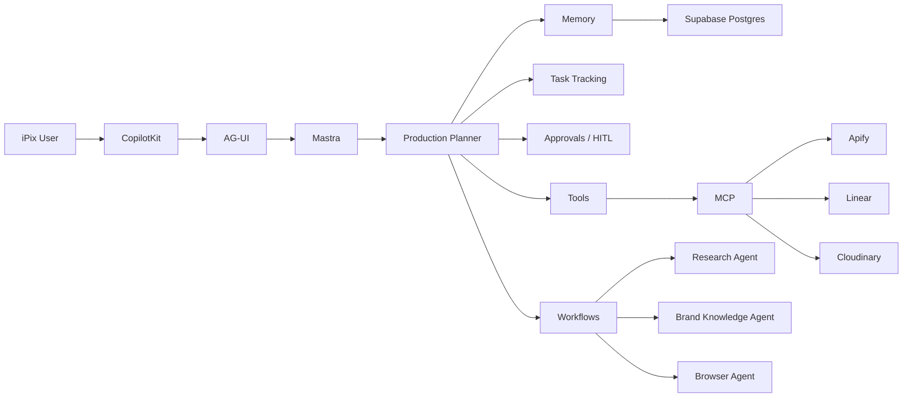

I reviewed the Mastra org/repositories you listed plus the CopilotKit Mastra examples. For iPix, the best strategy is the same as with CopilotKit: **one primary foundation, then selectively borrow patterns from specialized repos**.

The strongest new finding is that **`mastra-ai/template-agent-harness` is now one of the best Mastra references for iPix**. It already demonstrates memory, task tracking, web access, workspace tools, approval gates, recurring schedules, and observability in one clean Mastra starter. ([GitHub](https://github.com/mastra-ai/template-agent-harness?utm_source=chatgpt.com "GitHub - mastra-ai/template-agent-harness: A general-purpose Mastra agent with a local workspace, shell tools, memory, task tracking, web access, and recurring schedules. · GitHub"))

## Top 10 Mastra repos/examples for iPix

|Rank|Repo|Main feature|Real iPix use case|How to adapt|Score|
|--:|---|---|---|---|--:|
|**1**|**`mastra-ai/template-agent-harness`**|General-purpose agent foundation with memory, tasks, schedules, tools, approvals|Production Planner that remembers context, manages tasks, runs tools, asks approval|Borrow agent structure, memory/task/schedule/approval patterns; swap local storage for Supabase|**98/100 A+**|
|**2**|**CopilotKit `examples/integrations/mastra`**|Clean CopilotKit + Mastra integration|Core iPix AI runtime|Use as **frontend/runtime starter**; pair with Harness patterns for Mastra internals|**98/100 A+**|
|**3**|**CopilotKit `canvas/mastra-pm`**|Shared state + working memory + rich PM UI|Planner board, shoot tasks, team assignments|Adapt PM state to shoots/fittings/talent/deliverables|**95/100 A**|
|**4**|**`mastra-ai/workshops`**|Official examples for agents, guardrails, multi-agent networks, browser/channels|Learn correct current Mastra patterns before custom implementation|Use as pattern library, not production base|**94/100 A**|
|**5**|**`assistant-ui/mastra-hitl`**|HITL / approval experience|Producer approves booking, fitting, talent choice|Borrow approval/suspend/resume UX patterns|**92/100 A-**|
|**6**|**`mastra-ai/mastra-triage`**|Real production workflows + classification + automation|Auto-triage event tasks, CRM leads, support issues|Borrow workflow organization, agent decomposition, scheduled automation|**91/100 A-**|
|**7**|**`mastra-ai/template-company-knowledge`**|Company knowledge / RAG|Brand guidelines, contracts, SOPs, event docs|Adapt into Brand Knowledge agent backed by Supabase/Qdrant|**90/100 A-**|
|**8**|**`mastra-ai/template-browser-agent`**|Browser automation|Venue research, competitor research, supplier checks|Add only after core runtime is stable|**88/100 B+**|
|**9**|**`apify/actor-mastra-mcp-agent`**|Mastra + MCP + Apify automation|Search/scrape Eventbrite, Meetup, supplier sites|Use for external web/event-data tools|**87/100 B+**|
|**10**|**`mastra-ai/template-deep-research`**|Multi-step research|Event market research, sponsorship intelligence, venue comparison|Adapt as specialist research agent|**86/100 B+**|

## 1. `template-agent-harness` — the best Mastra reference

This is probably the most important repo on your list.

It already includes:

- conversation memory
    
- generated thread titles
    
- task tracking
    
- web search
    
- webpage fetching
    
- workspace/files
    
- shell commands
    
- approval gates
    
- recurring schedules
    
- storage
    
- observability. ([GitHub](https://github.com/mastra-ai/template-agent-harness?utm_source=chatgpt.com "GitHub - mastra-ai/template-agent-harness: A general-purpose Mastra agent with a local workspace, shell tools, memory, task tracking, web access, and recurring schedules. · GitHub"))
    

### Real iPix application

Instead of writing our own Planner infrastructure:

```text
Production Planner
├── remembers event context
├── maintains task list
├── searches current information
├── reads/writes approved workspace files
├── schedules follow-ups
└── asks permission before risky actions
```

Example:

> “Create the production plan for Fashion Week, research venues, prepare tasks, and remind me tomorrow if talent hasn't confirmed.”

The Harness already demonstrates most of the primitives needed for that.

### What to adapt

|Harness|iPix|
|---|---|
|local `workspace/`|Cloudinary/R2/project workspace|
|local memory|Supabase `mastra.*`|
|generic tasks|event/shoot tasks|
|recurring schedules|reminders/follow-ups|
|web search|Exa/Tavily/Apify|
|shell approvals|business-action approvals|
|local LibSQL|PostgresStore → Supabase|

Do **not** copy its local filesystem/security assumptions blindly. Its README explicitly warns that `LocalSandbox` is not OS isolation and should not be exposed unauthenticated. ([GitHub](https://github.com/mastra-ai/template-agent-harness?utm_source=chatgpt.com "GitHub - mastra-ai/template-agent-harness: A general-purpose Mastra agent with a local workspace, shell tools, memory, task tracking, web access, and recurring schedules. · GitHub"))

## 2. CopilotKit `examples/integrations/mastra`

This should remain the **application starter**.

Think of the division like this:

```text
CopilotKit integration/mastra
→ UI + transport + Copilot runtime

Mastra agent harness
→ agent capabilities + memory + tasks + approvals
```

Together:

```text
Next.js
   ↓
CopilotKit
   ↓
AG-UI
   ↓
Mastra Agent Harness patterns
   ↓
PostgresStore
   ↓
Supabase
```

That is a stronger foundation than starting from either repo alone.

## 3. `canvas/mastra-pm`

Still extremely useful for **shared state**.

Real iPix mapping:

|mastra-pm|iPix|
|---|---|
|projects|events|
|tasks|production tasks|
|team members|staff/vendors/talent|
|status|event lifecycle phase|
|board updates|Planner updates|
|working memory|campaign/event context|

Use this when the Planner needs to update the actual UI rather than simply reply in chat.

Example:

> “Move the fitting to Thursday.”

The AI changes structured state and the Planner board updates immediately.

## 4. `mastra-ai/workshops`

This is more valuable than it may appear.

The current workshop repo covers:

- Mastra fundamentals
    
- guardrails/processors
    
- advanced processor pipelines
    
- agent harnesses
    
- multi-agent networks
    
- Browser + Channels
    
- observational memory. ([GitHub](https://github.com/mastra-ai/workshops?utm_source=chatgpt.com "GitHub - mastra-ai/workshops: Collection of Workshops done by the Mastra Team · GitHub"))
    

For iPix, use it as the **official pattern library**.

Before we write custom logic for something like:

```text
guardrails
multi-agent delegation
browser automation
memory
channels
```

first inspect the relevant workshop and copy the official pattern.

### Real example

For an agent allowed to send supplier emails:

```text
agent proposes action
→ processor checks policy
→ human approval if required
→ tool executes
```

That is much safer than inventing our own middleware.

## 5. `assistant-ui/mastra-hitl`

This is very relevant for iPix because approval is central to event operations.

Potential workflows:

```text
AI suggests talent
→ producer reviews
→ approve/reject

AI prepares budget change
→ manager approves
→ update budget

AI schedules shoot
→ operator confirms
→ booking executes
```

Use it primarily as a **HITL UX and interaction reference**, while keeping Mastra workflows as the backend source of truth.

**92/100.**

## 6. `mastra-triage`

This repo is particularly useful because it is a **real operational Mastra application**, not just a demo.

It contains several workflows and agents for:

- classification
    
- effort/impact estimation
    
- Discord → GitHub synchronization
    
- scheduled follow-up
    
- analysis/reporting. ([GitHub](https://github.com/mastra-ai/mastra-triage?utm_source=chatgpt.com "GitHub - mastra-ai/mastra-triage · GitHub"))
    

Its project structure is also strong:

```text
src/mastra/
├── agents/
├── workflows/
├── helpers/
├── shared/
└── tools/
```

### Real iPix adaptation

Imagine incoming event requests:

```text
New lead
→ classify event type
→ estimate value
→ assign salesperson
→ create CRM task
→ schedule follow-up
```

or:

```text
New production issue
→ classify severity
→ assign team
→ estimate effort
→ notify stakeholder
```

That architecture maps very well to EventsOS/iPix.

## 7. `template-company-knowledge`

This is a strong fit for:

- brand guidelines
    
- campaign history
    
- contracts
    
- venue information
    
- SOPs
    
- previous event reports.
    

Example:

> “Can we use neon green in this campaign?”

Brand Knowledge agent searches the approved brand documents and responds based on real source material.

Possible architecture:

```text
Brand documents
→ extraction
→ embeddings
→ Supabase pgvector / Qdrant
→ Mastra knowledge agent
```

This should be an **MVP/Advanced feature**, not Core.

## 8. `template-browser-agent`

Use this for browser-based tasks when direct APIs are unavailable.

Real examples:

```text
research venue availability
compare supplier pages
inspect event listings
collect current sponsor information
```

However, browser automation is inherently less stable than APIs.

Use this priority:

```text
Official API
→ MCP
→ structured scraping
→ browser automation
```

Browser should be the fallback, not the default.

## 9. `actor-mastra-mcp-agent`

This is especially interesting given the event-discovery work.

Potential pipeline:

```text
Mastra
→ MCP
→ Apify Actor
→ Eventbrite / Meetup / public sites
→ structured event records
→ Supabase
```

Real example:

> “Find fashion and technology events happening in Medellín in the next 30 days.”

The agent could call an Apify actor, normalize the results, score relevance and save selected events.

This is a better place for scraping/external web automation than putting that complexity inside the main Planner agent.

## 10. `template-deep-research`

Use this for research-heavy specialists rather than making every agent a deep-research agent.

Real examples:

- sponsor research
    
- competitive event research
    
- destination intelligence
    
- fashion trend research
    
- venue comparisons
    
- market sizing.
    

Example:

> “Compare Bogotá, Medellín and Cartagena for a 500-person luxury fashion event.”

A research agent can:

```text
plan research
→ gather sources
→ compare
→ synthesize
→ cite evidence
→ produce recommendation
```

Keep this separate from everyday Planner chat.

---

# Other repos you listed

|Repo|Recommendation|Score|Why|
|---|---|--:|---|
|`template-agent-builder`|**Advanced**|84|Useful if iPix lets users create/configure new agents|
|`template-claw-assistant`|**Study only**|80|General assistant patterns may be useful, less directly tied to EventsOS|
|`template-docs-expert` / current docs chatbot equivalents|**Use later**|86|Strong for internal SOP/help agent|
|`shadcn-labs/agentcn`|**UI reference**|89|Strong agent UI/component inspiration; not core Mastra architecture|
|`template-coding-agent`|**Internal developer tool**|81|Useful for dev automation, not event operations|
|`template-meeting-scheduler`|**Useful feature reference**|89|Direct fit for fittings, calls, vendor meetings|
|`template-meeting-notes`|**Useful feature reference**|88|Post-meeting summaries/actions|
|`template-customer-feedback-summarization`|**Useful later**|84|Post-event feedback analysis|
|`template-github-review-agent`|**Developer workflow only**|83|Good for engineering, not core product|
|`template-slack-agent`|**Channels phase**|85|Useful if operator workflows move into Slack|

## What we should actually use

Don't combine all these projects.

Use them as modules/pattern libraries:

```text
CORE FOUNDATION

CopilotKit
examples/integrations/mastra
           +
Mastra
template-agent-harness
           +
Supabase
PostgresStore
```

Then selectively add:

```text
MVP

canvas/mastra-pm
→ shared state

assistant-ui/mastra-hitl
→ approvals

showcases/generative-ui
→ rich cards/UI

template-company-knowledge
→ brand knowledge

mastra-triage
→ operational workflows
```

Then:

```text
ADVANCED

actor-mastra-mcp-agent
→ external data / scraping

template-deep-research
→ research specialist

template-browser-agent
→ browser automation

multi-agent patterns from workshops
→ specialist agent teams

agent-builder
→ user-defined agents
```

## Recommended iPix architecture



## Best overall combination

If I were building the clean iPix v2 now, I would choose:

|Layer|Source|Score|
|---|---|--:|
|**Application foundation**|CopilotKit `examples/integrations/mastra`|**98**|
|**Mastra agent foundation**|`template-agent-harness`|**98**|
|**Shared application state**|`canvas/mastra-pm`|**95**|
|**Official Mastra patterns**|`mastra-ai/workshops`|**94**|
|**Human approvals**|`assistant-ui/mastra-hitl`|**92**|
|**Operational workflows**|`mastra-triage`|**91**|
|**Knowledge/RAG**|`template-company-knowledge`|**90**|
|**Agent UI components**|`agentcn` + CopilotKit shadcn example|**89**|
|**External data/MCP**|Apify Mastra MCP Agent|**87**|
|**Research**|`template-deep-research`|**86**|

### The key design principle

**Do not make the new app custom-first.**

For every feature:

> **Official CopilotKit example → official Mastra template/workshop → official Mastra API → existing open-source integration → custom code only if those cannot satisfy the requirement.**

That should dramatically reduce the amount of custom runtime glue and lower the risk of recreating the same integration problems.