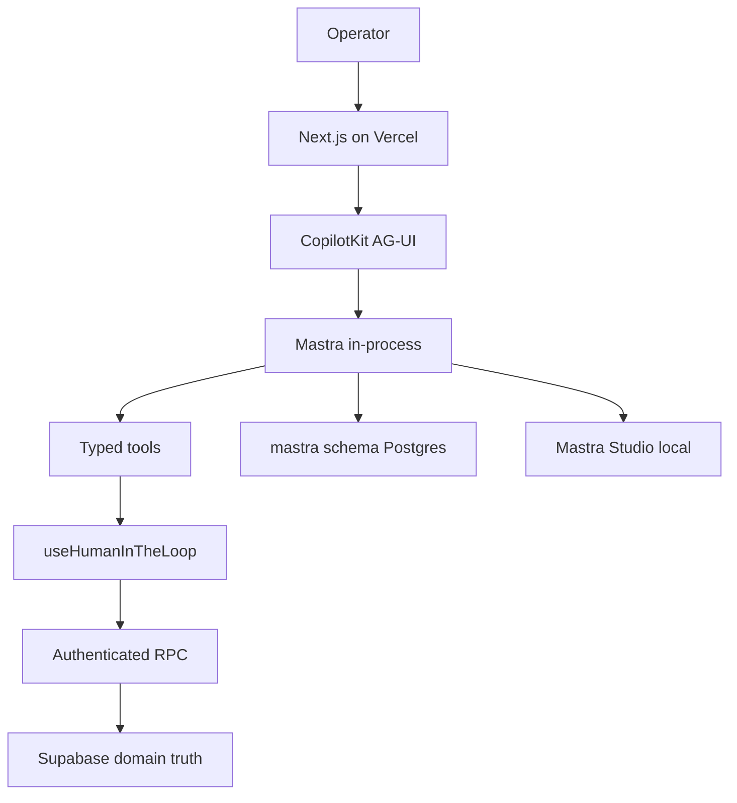
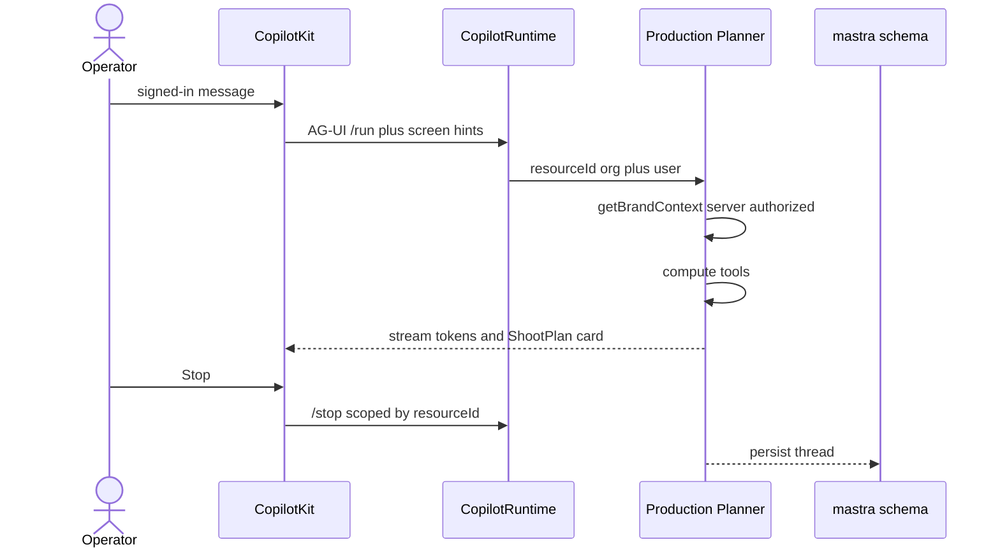
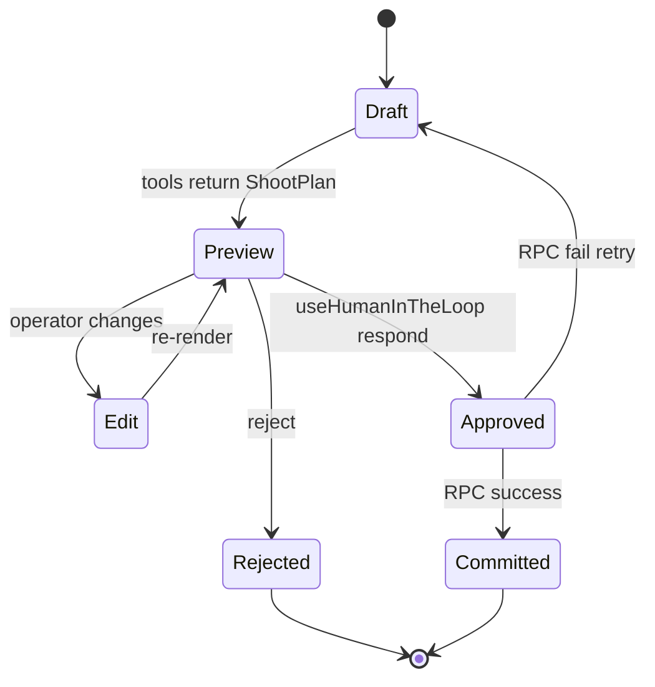
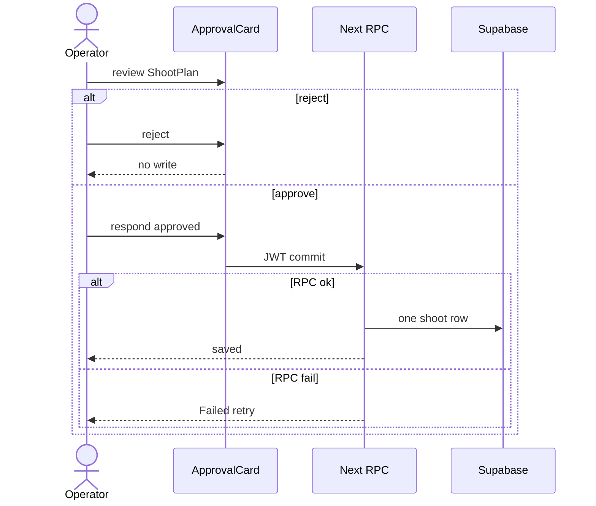
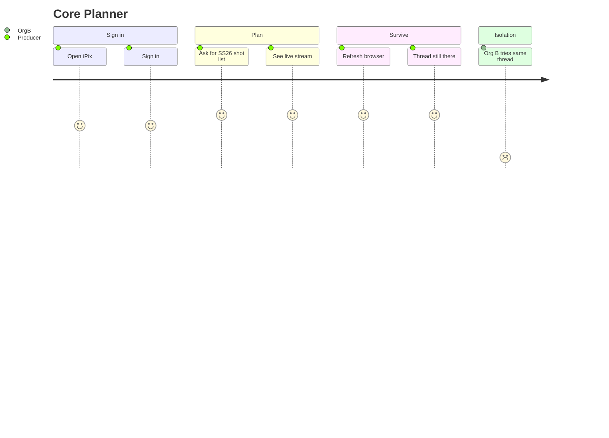
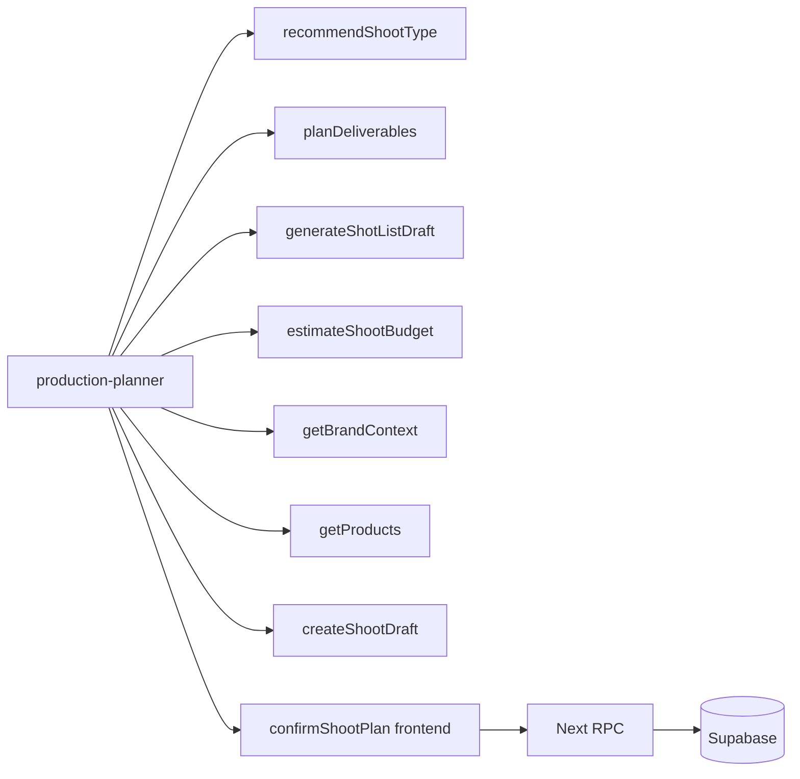

# iPix Mastra + CopilotKit — Product Requirements Document

Think of CopilotKit as the **studio intercom** (chat, cards, approval buttons). Mastra is the **production crew** (agents, tools, workflows, memory). Supabase is the **filing cabinet** (brands, shoots, approvals). Cloudinary is the **photo lab**.

This PRD answers:

> How should iPix use Mastra and CopilotKit to deliver an AI-native fashion production OS while minimizing custom code and maximizing reliability, reuse, security, and speed?

```text
What the operator sees
  → CopilotKit (chat, cards, shared state, HITL)
  → AG-UI stream
  → Mastra agent / tools / workflows
  → compute or draft only
  → operator reviews
  → authenticated RPC writes
  → Supabase records
  → evidence in tests / preview
```

**Status SSOT:** live Linear — [**IPI-1078 · IPI-EPIC · MASTRA COPILOTKIT — Secure Planner Runtime Sequence**](https://linear.app/amo100/issue/IPI-1078).  
**Product SSOT:** [docs/prd.md](../../prd.md). **Routes:** [docs/sitemap.md](../../sitemap.md).
**If this file disagrees with Linear or `package.json`, Linear and the lockfile win.**

Research date: 2026-09-02. Sources: this repo, installed packages, Mastra MCP, CopilotKit MCP, GitHub org templates, live Linear, and [mastra-prd-plan.md](./mastra-prd-plan.md). Where the plan disagrees with `src/` or Linear (in-memory persistence, `useInterrupt` as Mastra HITL, PLANNER after CORE exam), **this file + Linear + lockfile win.**

---

## 1. Executive Summary

iPix is rebuilding the Production Planner on the official CopilotKit + Mastra starter in `amoai-tech/ipixai` (Vercel + Next.js App Router). CopilotKit owns the operator AI experience. Mastra owns agents, typed tools, workflows, and conversation memory. Supabase owns durable business truth.

**Why Mastra:** it already provides Agent, `createTool`, workflows with suspend/resume, Memory, `@mastra/pg` PostgresStore, Studio, observability, and evals. iPix should not build a second agent runtime.

**Why CopilotKit:** it already provides authenticated AG-UI streaming, `useAgent`, `useFrontendTool`, `useHumanInTheLoop`, `useAgentContext`, generative UI, and threads. iPix should not build a second chat protocol.

**Core architecture (verified):**

```text
Browser / Next.js (Vercel)
  → CopilotKit v2 (`/api/copilotkit`)
  → AG-UI (`@ag-ui/mastra`)
  → Mastra in-process (`MastraAgent.getLocalAgents`)
  → PostgresStore (`schemaName: "mastra"`, `disableInit: true`)
  → domain writes only via SECURITY DEFINER RPCs + user JWT
```

**Business value:** a producer can plan an SS26 shoot in chat, refresh, and still see that thread. Org B cannot open Org A’s thread. After Core, the same intercom grows Brand Intelligence, HITL shoot save, and later campaign/publish.

**Shortest path to value:** finish the Core exam on the **existing** starter path. Do not replace weather with a swarm. Replace it with **one** Production Planner + compute-only shoot tools + proven persistence/replay.

---

## 2. Problem Statement

Fashion production is spread across spreadsheets, Slack, file storage, CRM, ecommerce, and asset racks. Those systems do not know approved Brand DNA, the current campaign, selected products, shoot deliverables, or who is allowed to commit a shoot.

A producer looking at a brand should be able to ask:

> Plan an ecommerce shoot for these eight products.

The AI should already know the current organization, brand, approved DNA, selected products, and permitted operations — then use deterministic tools where possible, reason only where necessary, show a structured proposal inside iPix, and require human approval before creating durable records.

Traditional chat is another disconnected surface. Static dashboards cannot draft a shot list from Brand DNA, pause for approval, then write one org-scoped shoot. A leaked `threadId` must never show another brand’s plan.

Engineering pain is the same problem in code: custom SSE, Worker shims, and “weather as the product agent” do not produce a tenant-safe Planner.

iPix needs:

1. **Context** — current org, brand, shoot, approved DNA (UI hints; server still authorizes).
2. **Tools** — typed, deterministic shoot math (deliverables, shot list, budget).
3. **Approvals** — humans decide; the app writes.
4. **Proof** — refresh, restart, Stop, Org B 403.

---

## 3. Product Goals

### Core (Foundation — until **IPI-1041 · CORE-001**)

| Goal | Measurable |
| --- | --- |
| Planner usable after refresh | Same thread messages reappear |
| Planner usable after restart | Hosted Postgres, not RAM |
| Cross-org leakage | Org B 403, empty body |
| Streaming | Authenticated AG-UI stream |
| Stop | Active generation terminates |
| Auth | Signed-out Planner is 401 before the model |
| One agent | Production Planner is `default`, not weather |

### MVP (after Core exam)

| Goal | Measurable |
| --- | --- |
| Brief → reviewable shoot plan | Typed ShootPlan card, schema-valid, target `<5 min` |
| Tool schemas reliable | Compute tools pass contract tests |
| Shared context | Planner understands the brand/shoot on the current screen |
| GenUI | Important output is a product card, not a prose wall |
| Approved writes auditable | HITL then one org RPC; duplicate approve ≠ duplicate shoot |
| Brand URL → reviewable DNA | Draft + citations; unsigned draft is not truth; target `<10 min` |
| Brand Knowledge | Approved evidence is retrievable with citations |
| Planner consumes DNA | Server-authorized approved DNA, not a pasted PDF only |
| Workspace follow | Same Planner experience follows the operator through `/app/*` |

### Post-MVP

Campaign canvas, asset-gap before shoot, Brand Check, CRM assistant, Postiz of **approved** payloads, analytics that are empty or real, learning/eval loops.

### Advanced

Subagents, Tool Search, Observational Memory, Agent Harness, browser automation, MCP orchestration, schedules, Mastra Platform as host.

---

## 4. Non-Goals

Do **not** build now:

- Agent swarm / supervisor for Core
- Custom model router (use Mastra model catalog / router later)
- Custom conversation database
- Custom workflow engine
- Custom tracing dashboard (use Mastra Studio + observability first)
- Custom crawler when Firecrawl covers Brand intake
- Browser automation when HTTP/extract works
- Replacing Vercel because Mastra Platform exists
- `@mastra/deployer-vercel` replacing the Next.js + CopilotKit app
- Cloudflare Workers / Hyperdrive / ALS / DurableAgent
- `resourceId: "default"` on the authenticated route
- Weather as the product agent
- Autonomous domain writes
- `useInterrupt` as the Mastra HITL path (official CopilotKit: **not supported** for Mastra)

---

## 5. Target Users

| Role | Problem | AI assistance | Requires approval |
| --- | --- | --- | --- |
| Studio owner | Season plan is tribal knowledge | Planner + Brand DNA | DNA save, spend, publish |
| Producer | Shot list / budget rebuilt every time | Deliverables, shot list, budget draft | Shoot create, budget commit |
| Creative director | Voice/visual drift | Brand Check, DNA draft | DNA and campaign lock |
| Brand operator | Website exists; Brain does not | Brand Intelligence draft | DNA persist |
| Sales / CRM | Notes disconnected from shoots | Later CRM assist | Deal writes |
| Photographer / crew | Need the brief, not a chatbot | Read approved plan | None for read |
| Administrator | Tenant leaks, secrets | None in chat | Secrets, env, RLS |

---

## 6. Architecture

### Beginner picture

The operator talks into the intercom (CopilotKit). The crew (Mastra) thinks and uses tools. The filing cabinet (Supabase) is the only place a shoot, brand, or approval becomes real. The photo lab (Cloudinary) stores binaries. Money and social stay in Stripe / Postiz after a human lock.

```text
User
  → CopilotKit
  → AG-UI
  → Mastra agent
  → tools / workflows
  → proposal
  → HITL (useHumanInTheLoop)
  → authenticated application / RPC
  → Supabase
```

### Layer ownership

| Layer | Owns | Must not own |
| --- | --- | --- |
| Next.js / Vercel | Auth cookies, signing, routes, RPCs | Model keys in the browser |
| CopilotKit | Stream, cards, shared state, HITL UI, threads | Domain truth, RLS, money |
| AG-UI | Event protocol | Persistence |
| Mastra | Agents, tools, workflows, `mastra.*` memory | Browser identity; silent `shoot.*` writes |
| Supabase | Users, orgs, brands, shoots, approvals, RLS | Conversation blobs as SoT |
| Cloudinary | Images / video | App DAM tables as binaries |
| Commerce / Postiz / Stripe | Commerce and publish | Chat-initiated charges |

### Mastra memory vs domain data

Mastra memory is the **conversation notebook**. Supabase is the **production ledger**.

- Threads, messages, working memory, workflow snapshots → `mastra.*` via `@mastra/pg`.
- Brands, DNA, shoots, assets, bookings → app schemas + RLS.
- `resourceId` is `org:{orgId}::user:{userId}` after membership proof. Storage RLS does **not** isolate orgs; `resourceId` is the partition.

### Model selection

Today `[VERIFIED]`: starter pin `openai("gpt-4o")` via `@ai-sdk/openai`. Do not port old Cloudflare `resolveAgentModel`. Later: Mastra model catalog / router, not a custom provider wrapper.

Do **not** create `OpenAIPlanner` and `GeminiPlanner` as two agents. Pick `provider/model` from config and evals. One Production Planner; swap the model string, not the product identity.

### Browser / extraction ladder

```text
Official API  →  HTTP fetch  →  Firecrawl  →  Agent Browser (last)
```

Do not open a browser session to fetch a public About page. Treat browser-supplied HTML as untrusted evidence, never as approved DNA.

### Authorization

1. Supabase session (cookie JWT).
2. `getVerifiedOperatorForRequest` — no user → 401.
3. `resolveRuntimeTenant` — membership → org.
4. `memoryResourceId` from **server** org + user, never from the browser.
5. Domain writes: SECURITY DEFINER RPC with that JWT.

### Hosting

Keep **Vercel + Next.js**. Use Mastra Studio locally (`npm run dev:agent` on `:4111`). Do not migrate the product to Mastra Platform hosting. Optional later: send traces to Mastra Platform via exporter without moving the app.

**Local vs remote Mastra agents:** iPix already uses **in-process** `MastraAgent.getLocalAgents({ mastra, resourceId })`. Official CopilotKit docs also support `getRemoteAgents` against `:4111`. Keep local for the authenticated Next route so `resourceId` is per-request. Studio remains a **dev** surface, not a second production runtime.

### Agent vs workflow (architecture rule)

Mastra’s current docs: **agents** when the sequence is open-ended; **workflows** when the sequence and control flow are known. That is an iPix rule:

```text
Open-ended (“what should this SS26 shoot be?”) → Production Planner agent
Known order (URL → evidence → DNA draft → HITL → RPC) → workflow
Deterministic math (budget, deliverable counts) → typed tool / code
```

---

## 7. Directory Structure / Routes

Actual repo (do not invent a generic tree):

```text
src/
  app/
    page.tsx                      # signed-in → PlannerApp (today’s Core surface)
    planner-app.tsx               # CopilotKit v2 UI (starter weather/proverbs)
    login/                        # AUTH-001
    app/page.tsx                  # DESIGN-001 stub, not Command Center
    api/copilotkit/[[...slug]]/   # CopilotRuntime + tenant abort runner
    auth/callback/                # Supabase auth
  agent.ts                        # MastraAgent.getLocalAgents
  mastra/
    index.ts                      # Mastra registry (default = weather today)
    agents/index.ts               # weatherAgent + Memory
    tools/index.ts                # weatherTool only
    pg-store.ts                   # PostgresStore guards + LibSQL local fallback
  lib/auth/
    verified-operator.ts         # memoryResourceId
    runtime-org.ts                # tenant resolution
    copilot-hooks.ts
tests/
  auth-001.test.ts
  auth-002.test.ts
  stream-001.test.ts
  pg-store-guard.test.ts
  runtime-family.test.ts
```

**Target after PLANNER-001 (same folders, different agents):**

```text
src/mastra/
  agents/production-planner.ts
  tools/recommend-shoot-type.ts
  tools/plan-deliverables.ts
  tools/generate-shot-list.ts
  tools/estimate-budget.ts
  tools/get-brand-context.ts       # MVP — approved DNA, server-authorized
  tools/get-products.ts            # MVP — selected product facts
  tools/create-shoot-draft.ts    # MVP — draft object, not a write
  workflows/                      # MVP+ — none in repo today
  scorers/                       # MVP+ evals — none in repo today
```

**Product routes (sitemap, not all shipped):**

| Route | Phase | Today in this repo |
| --- | --- | --- |
| `/` | Core Planner | `[VERIFIED]` PlannerApp |
| `/login` | Core | `[VERIFIED]` |
| `/app` | MVP Command Center | Design stub only |
| `/app/planner` | Core target | Proposed move from `/` (**IPI-1051**) |
| `/app/brand`, `/app/shoots`, `/app/campaigns`, `/app/assets` | MVP | Not built |
| `/app/plans` | Post-MVP workspace | Not built |

---

## 8. Core Features

| Feature | User value | Mastra | CopilotKit | Data | Reused official capability |
| --- | --- | --- | --- | --- | --- |
| Authenticated Planner | Only signed-in operators chat | Agent runs after auth | Provider mounts after handshake | Supabase Auth | CopilotKit runtime + iPix AUTH-001/002 |
| Streaming | Live tokens, not a frozen blob | Agent stream | AG-UI SSE | — | CopilotKit Mastra runtime |
| Stop | Cancel a bad run | abort / detachActiveRun | `/stop` | — | CopilotKit runner + iPix `TenantAbortRunner` |
| Threads | Continue SS26 chat | Memory threads | `CopilotThreadsDrawer` | `mastra_threads` | CopilotKit threads + Mastra Memory |
| Persistence | Survive restart | PostgresStore | Replay from saved messages | `mastra_messages` | `@mastra/pg` |
| Replay | Refresh keeps cards | Message history | Thread hydration | `mastra_messages` | **IPI-1088** + CopilotKit threads |
| Org context | No Org B leak | `resourceId` | Per-request agents | membership | AUTH-002 + ACCESS-001 |
| Tools | Reliable drafts | `createTool` | `useRenderTool` / GenUI | compute-only | Mastra tools |
| Structured output | ShootPlan object | `structuredOutput` | Cards bind fields | draft only | Mastra structured output |
| Observability | Why this tool? | Studio + traces | Inspector if licensed | traces | Mastra observability |
| Tests | Fail on regression | Tool/eval later | Route tests | — | Vitest already in repo |

Use Mastra CLI tool execution and Studio before writing temporary debug scripts.

---

## 8a. CopilotKit interaction layer

Do not treat CopilotKit as “the chatbot.” It is how iPix embeds AI in the product. Use the [which-hook](https://docs.copilotkit.ai/concepts/which-hook) guide; do not invent ad-hoc UI APIs.

### App context (`useAgentContext`)

Share **situation**, not authorization:

```text
current route · org (echo only) · role
current brand · shoot · campaign
selected products · selected asset
active tab · visible filters
```

Do not put secrets, JWTs, or authorization decisions in browser context. [Agent app context](https://docs.copilotkit.ai/integrations/mastra/agent-app-context).

### Shared state (`agent.state`)

Use when operator and agent **co-edit** a temporary object (`ShootPlanDraft`: deliverables, shotList, budget, notes). This is not a shoot row. [Mastra shared state](https://docs.copilotkit.ai/integrations/mastra/shared-state).

### Frontend tools (`useFrontendTool`)

Browser-only: select a tab, focus a product, open a panel, change local filters, preview an asset, highlight UI. Never money, publish, or domain writes. [Frontend tools](https://docs.copilotkit.ai/integrations/mastra/frontend-tools).

### Generative UI (controlled cards)

Prefer product components over unrestricted generated UI: `ShootPlanCard`, `BrandDNACard`, `BudgetCard`, `ApprovalCard`, `AssetQACard`, `TalentMatchCard`, `CampaignBriefCard`. Copy patterns from [generative-ui](https://github.com/CopilotKit/CopilotKit/tree/main/examples/showcases/generative-ui) and [canvas/mastra](https://github.com/CopilotKit/CopilotKit/tree/main/examples/canvas/mastra). Controlled React is easier to test.

---

## 9. Advanced / AI Features

| Capability | Phase | Needed? | Why |
| --- | --- | --- | --- |
| Shared state (`agent.state`) | MVP | Yes | ShootPlan / DNA draft on canvas |
| GenUI / tool rendering | MVP | Yes | Cards not prose walls |
| HITL `useHumanInTheLoop` | MVP | Yes | Official Mastra+CopilotKit path |
| Workflows + suspend/resume | MVP | Yes for ordered Brand/shoot save | Official Mastra HITL; **not** CopilotKit `useInterrupt` |
| Context engineering | MVP | Yes | Current brand/shoot only |
| Brand Intelligence | MVP | Yes | First real product loop after Planner |
| Deep research template | Post-MVP | Copy loop only | Citations / gap research |
| Firecrawl | MVP Brand | Yes | Official integration over custom crawl |
| Agent Browser | Advanced | No until HTTP fails | Fragile + costly |
| pgvector | Post-MVP | After RLS filters | Retrieval ≠ ACL |
| Working Memory | Core already on | Keep resource scope | Starter uses `scope: "resource"` |
| Observational Memory | Advanced | After ordinary threads work | Official research feature |
| Subagents | Advanced | No | One Planner first |
| Skills / Tool Search | Advanced | When tool catalog is large | 4 tools do not need search |
| MCP orchestration | Advanced | Dev accelerator only | Not on Core path |
| Dynamic workflows | Advanced | No | Static typed workflows first |
| Agent Harness | Advanced | Patterns only | Workspace/shell is not multi-tenant iPix |
| Schedules | Advanced | No | Operator-triggered first |
| Model routing | Post-MVP | Config, not architecture | Catalog + experiments |
| Mastra Platform host | Avoid | No | Vercel stays |
| CopilotKit Intelligence | Optional | License-gated | Threads/Inspector lock without license |

### Advanced — entry criteria (start only when)

Do not add these because Mastra ships them.

| Feature | Start only when |
| --- | --- |
| Subagents | One agent has a proven specialization / tool-selection failure |
| Supervisor | Multiple specialists measurably improve quality |
| Tool Search | Tool catalog is large enough to hurt the model |
| Observational Memory | Message-history cost is empirically a problem |
| Agent Browser | HTTP + Firecrawl cannot complete the required task |
| Dynamic workflows | Process shape genuinely changes at runtime |
| MCP in product | External MCP creates a named business outcome |
| Agent Harness | Long-running workspace tasks have a defined operator use case |
| Schedules | Recurring agent work has a named user |

---

## 10. Agent Catalog

**Rule:** one useful route agent first. A tool is not an agent.

| Agent | Purpose | Route | Model class | Context | Tools | Workflows | Writes | Phase |
| --- | --- | --- | --- | --- | --- | --- | --- | --- |
| **Production Planner** | Shoot type, deliverables, shot list, budget | `/` then `/app/planner` | Fast chat + structured | org, brand, shoot hints | 4 compute tools | Shoot save (MVP) | None until HITL RPC | Core → MVP |
| **Brand Intelligence** | Draft DNA + citations | `/app/brand/[id]` | Research / stronger | URL, pages, org | search evidence | Brand intake | Draft only | MVP |
| **Media / Asset DNA** | Match need-list; explain scores | `/app/assets` | Vision later | asset, brand | explainDnaScore | Asset review | None | Post-MVP |
| **Product Linking** | Match SKU to shot | Product surfaces | Fast + structured | catalog, asset | searchProducts | Product linking | HITL | Post-MVP |
| **Campaign / Creative** | Calendar + brief → Planner | `/app/campaigns` | Fast | approved DNA | none extra | Campaign plan | HITL | Post-MVP |
| **Analytics / Learn** | Propose DNA diffs from real metrics | `/app/analytics` | Cheap summarize | Stripe/Postiz ids | none | Learn | HITL DNA | Post-MVP |
| **Supervisor** | — | — | — | — | — | — | — | Advanced only if proven |

**Today `[VERIFIED]`:** registry is `default: weatherAgent`. **IPI-1048** replaces that. Do not register Brand agents on the operator route until CORE-001.

### Production Planner (first agent)

The Planner is the first iPix agent because shoot planning is the most valuable operator loop.

**Does:** recommend shoot type; plan deliverables; draft shot list; estimate budget; explain trade-offs; propose a reviewable ShootPlan.

**Does not:** create shoots, change DNA, publish, book talent, or send money.

**Example:** 8 products, ecommerce + TikTok, budget under $6,000 → typed proposal (type, looks, shots, budget, notes) → operator edits → approve → Next.js RPC creates the shoot.

Do not spawn a Brand Planner, Campaign Planner, and Shoot Planner as three agents. One Planner plus tools.

### CRM assistant (Post-MVP)

A later operator agent that can propose CRM updates (e.g. Closed Won) through HITL. Same rule: agent proposes; RPC writes.

---

## 11. Tool Catalog

Deterministic code should own math and lookups. The LLM should choose tools and explain, not invent prices.

| Tool | Agent | Input | Output | Reads | Writes | Approval? | Official primitive |
| --- | --- | --- | --- | --- | --- | --- | --- |
| `recommendShootType` | Planner | brief, channels | shootType | none | no | no | `createTool` |
| `planDeliverables` | Planner | shootType, channels | deliverables[] | none | no | no | `createTool` |
| `generateShotListDraft` | Planner | looks, deliverables | shots[] | none | no | no | `createTool` |
| `estimateShootBudget` | Planner | shots, locale | budget | none | no | no | `createTool` |
| `confirmShootPlan` | Planner via CopilotKit | ShootPlan | `{approved, edits}` | — | no | **yes** | `useHumanInTheLoop` |
| `commitShootPlan` | Next.js RPC | approved plan | shoot id | org JWT | `shoot.*` | already approved | SECURITY DEFINER RPC |
| `getBrandContext` | Planner | brandId hint | approved DNA summary | RLS | no | no | tool + server auth |
| `getProducts` | Planner | brandId + ids/query | selected product facts | RLS | no | no | `createTool` |
| `createShootDraft` | Planner | ShootPlan | draft object | none | no | no | `createTool` (not a write) |
| `searchBrandEvidence` | Brand Intel | URL | citations | Firecrawl | no | no | Firecrawl integration |
| `explainDnaScore` | Media | asset ids | scores + reasons | Cloudinary meta | no | no | later |
| `searchProducts` | Product | query | SKUs | catalog | no | no | later |
| `weatherTool` | weather (starter) | location | weather | Open-Meteo | no | no | **DROP from product route** |

---

## 12. Workflow Catalog

Use a workflow when the **order** matters. Do not workflow a single tool call.

| Workflow | Trigger | Steps | Agent/tool | HITL gate | Final write | Phase |
| --- | --- | --- | --- | --- | --- | --- |
| *(none in repo)* | — | — | — | — | — | Core |
| Shoot Planning | Producer asks | deliverables → shots → budget → confirm | Planner tools | `confirmShootPlan` then RPC | one shoot row | MVP |
| Brand Intelligence | Brand URL | crawl → draft DNA → citations → edit | Brand agent + Firecrawl | DNA approve | DNA RPC | MVP |
| Asset Review | Need-list | search rack → gap → Planner | Media tools | version lock | asset link | Post-MVP |
| Product Linking | Asset + catalog | match → confirm | searchProducts | confirm SKU | link RPC | Post-MVP |
| Campaign Planning | Strategy canvas | calendar → brief → Planner | shared state | approve calendar | campaign RPC | Post-MVP |

Mastra workflow suspend/resume is the **backend** pause. CopilotKit Mastra HITL is **frontend tools**. Do not assume CopilotKit `useInterrupt` will resume a Mastra workflow (official: interrupts **not supported** for Mastra).

---

## 13. Human-in-the-Loop Architecture

```text
AI proposes
  → preview (GenUI card)
  → operator edits
  → approve / reject
  → authenticated RPC commits
  → audit row
```

### Three HITL kinds (do not mix)

| Kind | Use | iPix |
| --- | --- | --- |
| CopilotKit **tool-based** `useHumanInTheLoop` | Operator approval in chat | **MVP default** — [tool-based HITL](https://docs.copilotkit.ai/integrations/mastra/human-in-the-loop/tool-based) |
| Mastra **workflow** `suspend` / `resume` | Multi-step backend process | Brand intake / shoot save **if** iPix adds a server resume path |
| CopilotKit `useInterrupt` | Native interrupt events | **Do not use for Mastra** — [Interrupts not supported](https://docs.copilotkit.ai/integrations/mastra/human-in-the-loop/interrupt-flow) |

Starter already imports `useHumanInTheLoop` for `go_to_moon`. Replace that demo with `confirmShootPlan`.

### Exact CopilotKit example (official pattern)

```tsx
useHumanInTheLoop({
  agentId: "default",
  name: "confirmShootPlan",
  description: "Ask the operator to approve or edit the shoot plan before save",
  parameters: ShootPlanSchema,
  render: ({ args, respond }) => {
    if (!respond) return null;
    return (
      <ShootPlanCard
        plan={args}
        onApprove={(edits) => respond({ approved: true, plan: edits })}
        onReject={() => respond({ approved: false })}
      />
    );
  },
});
```

`respond()` is **not** the database write. After approve, a Next.js server action / RPC with the user JWT commits. Duplicate approval must be idempotent.

### Approval card states

```text
Review   → operator can approve / edit / reject
Committing → RPC in flight; disable double-click
Failed   → retry; do not show “saved”
Saved    → shoot id visible
```

### Consequential operations (always HITL)

Shoot create/update · DNA approve · talent booking · media publish · budget change · refund · delete · CRM stage change · outbound message.

### Review gates on shoot planning

1. **Proposal** — agent shows typed ShootPlan.  
2. **Operator review** — edit or reject.  
3. **Commit** — JWT RPC only after approve.

Reject returns to chat with a reason. Do not auto-retry commit.

---

## 14. Context Engineering

Give the Planner **exactly** what this decision needs.

**Send (hints):**

- route
- org id (already on server; UI may echo)
- user role
- current brand id
- current shoot id
- current campaign id
- selected asset id
- active tab / filters
- **approved** Brand DNA summary (server-fetched)

**Do not send:**

- all brands, all shoots, whole CRM
- service-role keys
- other orgs’ ids
- raw JWT to the model
- untrusted website HTML as trusted DNA
- 150 messages when 8 will do

Official: [Mastra context engineering](https://mastra.ai/docs/guides/context-engineering) · CopilotKit [agent app context](https://docs.copilotkit.ai/integrations/mastra/agent-app-context) via `useAgentContext`. Browser `brandId` is a hint; session + RLS authorize.

### Three envelopes (do not mix)

| Envelope | Source | Trust | Example |
| --- | --- | --- | --- |
| **Trusted server** | JWT + membership RPC | Authorization | `orgId`, `userId`, role |
| **UI hints** | `useAgentContext` | Situation only | current brand, selected products |
| **Retrieved AI context** | Memory / later vector | Evidence, never ACL | prior thread, Brand Knowledge citations |

A browser `orgId` that disagrees with the session must be ignored. `threadId` is not authorization.

---

## 15. Memory Architecture

### Core

- Message history in Mastra Memory
- PostgresStore `schemaName: "mastra"`, `disableInit: true`
- Thread replay after refresh (**IPI-1088**)
- `resourceId` = `org:{orgId}::user:{userId}`
- Thread ownership = `threadId` + trusted user + trusted org. A leaked thread id is not enough to read another org’s chat.

CopilotKit threads (**IPI-1087**) are the UI list. Mastra Memory is the persistence backend. Do not store conversation twice.

### MVP+

Working memory already enabled in the starter (`scope: "resource"`) so CopilotKit can seed state without a pre-created thread. Keep that for ShootPlan / proverb-style shared state. Do not store the shoot row only in working memory.

### Advanced

Observational Memory after ordinary persistence is proven.

```text
Mastra memory  ≠  Supabase business truth
```

ADR 002 is accepted. Note: ADR text still says `@mastra/pg@1.20.0`; lockfile is **1.22.2**.

**Local fallback:** missing `MASTRA_DATABASE_URL` → in-memory LibSQL + warning. Hosted (`IPIX_MASTRA_HOSTED`) **throws**. Do not treat LibSQL as hosted SoT.

---

## 16. Model Architecture

Do not hardcode a multi-provider architecture. Pin one model until a provider ticket. Later use [Mastra models](https://mastra.ai/models) and experiments.

| Workload | Recommended class | Required | Fallback | Reason |
| --- | --- | --- | --- | --- |
| Planner chat | Fast / inexpensive | tools | same family | Default conversation |
| Tool selection | Same as chat | tools | — | Avoid extra hop |
| Structured ShootPlan | Reliable structured-output | schema + tools | jsonPromptInjection / second structurer | Official structured-output caveats (Gemini 2.5 + tools) |
| Brand research | Stronger reasoning | long context | cheaper summarize | Citations |
| Vision / DNA | Multimodal | image in | skip vision | Later |
| Embeddings | Mastra embeddings catalog | pgvector | none | Post-MVP |
| Outage | Configured fallback | — | second provider string | Router, not custom wrapper |

Today: `openai("gpt-4o")`. `@mastra/core` abstracts AI SDK provider differences; still verify against **installed** 1.63.2 types. Later pin via Mastra experiments / evals, not hardcoded SKUs in agent names.

---

## 17. Use Cases + Real-World Examples

For each: request → agent/context → tools → result → HITL → saved.

### Production Planner

1. **8-look ecommerce shoot (Maison Solène).** Producer: “8 looks, PDP + Instagram.” Planner calls `planDeliverables` + `generateShotListDraft`. Card shows 8 hero + detail shots. Operator edits 2 shots, approves. RPC creates shoot.
2. **TikTok + PDP from one shoot.** Tools add short-form deliverables without dropping PDP. HITL shows both. Save once.
3. **Budget $8,000 → $5,000.** `estimateShootBudget` recomputes. Planner does not silently cut looks; HITL shows the tradeoff.

### Brand Intelligence

1. **Website in.** Operator pastes brand URL. Firecrawl extracts home/about/collection. Draft DNA (voice, audience, visual tone, colors, typography cues, image style) + citations. Operator edits voice. Approve → DNA RPC.
2. **Competitor gap.** Research finds three lookbook patterns with sources. No DNA write until HITL.
3. **PDF lookbook.** Upload → extract → draft. Unsigned draft never used by Planner as truth.
4. **Extraction fails.** Do not fail the journey. Ask for uploaded guidelines, social links, or a short questionnaire, then continue to an editable draft.

### HITL

1. **$7,200 budget.** Tools estimate; no write until producer approves (or edits to $5,000).
2. **DNA approve.** Operator changes one field, then approves. Planner may read only the approved version.
3. **CRM Closed Won (Post-MVP).** Assistant proposes; HITL then RPC. Same pattern as shoot commit.

### Shoot save

1. **Create from Planner.** Confirm card → RPC → `/app/shoots/[id]` later.
2. **Reject.** Workflow/tool returns rejected; no row.
3. **Double-click Approve.** Idempotency key / unique constraint; one shoot.

---

## 18. User Stories

**As a producer,** I want to refresh mid-plan and see the same SS26 thread, **so that** I do not re-brief the crew.  
AC: **IPI-1088** + MEM-001; hosted restart keeps thread ids.

**As a studio owner,** I want Org B to get 403 on Org A’s `threadId`, **so that** tenants cannot leak plans.  
AC: ACCESS-001 hosted proof (Linear **Done**; recertify on CORE-001 SHA).

**As a producer,** I want typed deliverables/shot list/budget, **so that** I can trust the card.  
AC: TOOL-001 schema tests; no `shoot.*` write from the tool.

**As a brand operator,** I want a cited DNA draft from our site, **so that** Planner uses approved voice.  
AC: draft ≠ truth until HITL.

**As a producer,** I want to approve a plan before anything is saved, **so that** AI cannot book a studio by accident.  
AC: `useHumanInTheLoop` then RPC; duplicate approve is one row.

**As a producer,** I want recommendations grounded in approved Brand DNA, **so that** the shot list matches our look, not a generic fashion prompt.  
AC: `getBrandContext` is server-authorized; unsigned draft is never Planner truth.

**As a producer,** I want the Planner to know the brand and products on this screen, **so that** I do not re-paste the brief every message.  
AC: `useAgentContext` hints + server org; browser org that disagrees with the session is ignored.

---

## 19. User Journey

### Core Planner

```text
Login → Planner
  → conversation (stream)
  → Stop if needed
  → refresh
  → conversation restored
  → Org B same threadId → 403
```

### Brand Intelligence

```text
Brand URL → research → Brand DNA draft + citations
  → extraction fail → guidelines / social / questionnaire
  → operator edits → approves → DNA saved
  → Brand Knowledge may retrieve approved evidence
  → Planner may read approved DNA
```

### Shoot Planning

```text
1. Open brand / selected products
2. Ask for a shoot (channels + budget)
3. Planner reads approved DNA + products (server)
4. recommendShootType
5. planDeliverables
6. generateShotListDraft
7. estimateShootBudget
8. ShootPlan card (review / edit / reject)
9. Approve → JWT RPC (idempotent)
10. Shoot exists; thread still replayable
```

---

## 20. Workflows

### User workflow (operator)

Sign in → open Planner → ask for a plan → see cards while they stream → Stop if wrong → edit/approve → continue the same thread after refresh.

Failure: signed out → login. No org membership → denied. Model timeout → honest error, no fake plan. Approve without network → retry, no duplicate.

### System workflow

1. Cookie JWT → operator + org.
2. `createLocalAgents(resourceId)`.
3. CopilotRuntime AG-UI `/run`.
4. Mastra agent + tools (compute).
5. Frontend HITL tool if consequential.
6. RPC write + audit.
7. Memory persist in `mastra.*`.

Failure paths: 401 before model; ACCESS 403; hosted missing URL abort; tool schema fail → no write; webhook/RPC fail → 503, retryable, not “approved.”

---

## 21. Mermaid Diagrams

### System architecture



### Planner request



### HITL workflow



### Approval commit (reject / approve / RPC fail)



### User journey



### Agent / tool architecture



---

## 22. Website Pages

Do not invent public pages. Sitemap public set:

| Page | Route | Purpose | Main content | AI role | Core/MVP |
| --- | --- | --- | --- | --- | --- |
| Home | `/` | Today: Planner if signed in | PlannerApp | Planner | Core (temporary) |
| Login | `/login` | Sign in | Form | none | Core |
| Signup | `/signup` | Create account | Form | none | Core/onboard |
| Pricing | optional | Marketing | — | none | not MVP nav |

Marketing epic **IPI-1077** is parallel and out of this PRD’s Core path.

---

## 23. Dashboard / Operator Pages

Core does **not** include Command Center. Sitemap: Core = Planner only.

| Screen | Route | Purpose | Data shown | User actions | AI agent | CopilotKit | Mastra tools | Workflow | HITL | Phase |
| --- | --- | --- | --- | --- | --- | --- | --- | --- | --- | --- |
| Planner | `/` → `/app/planner` | Plan shoots in chat | Thread + cards | chat, Stop, approve later | production-planner | stream, threads, GenUI | compute 4 | none Core | later | Core |
| Login | `/login` | Identity | — | sign in | none | none | — | — | — | Core |
| Command Center | `/app` | Home | org summary | nav | none Core | later | — | — | — | MVP |
| Brands | `/app/brand` | List brands | brand rows | open | Brand Intel later | context | getBrandContext | — | — | MVP |
| Brand Detail | `/app/brand/[id]` | Profile + DNA | DNA if approved | edit, research | Brand Intel | HITL DNA | searchBrandEvidence | intake | yes | MVP |
| Brand Intelligence | same | Draft Brain | citations | approve DNA | Brand Intel | HITL, cards | Firecrawl | intake | yes | MVP |
| Shoots | `/app/shoots` | List | shoot rows | open, new | Planner | context | — | — | — | MVP |
| Shoot Detail | `/app/shoots/[id]` | Brief | plan, assets | edit | Planner | context, GenUI | compute | — | — | MVP |
| Shoot Wizard | `/app/shoots/new` | 3-gate create | wizard state | next/back | Planner | shared state | compute | shoot save | yes | MVP |
| Campaigns | `/app/campaigns` | Calendar | campaign | plan | Campaign later | shared state | — | campaign | yes | Post-MVP |
| Campaign Detail | `/app/campaigns/[id]` | One campaign | brief | approve | Campaign | canvas | — | — | yes | Post-MVP |
| Assets | `/app/assets` | Rack | Cloudinary meta | search, attach | Media later | context | explainDna | review | version lock | MVP+ |
| Product Linking | product surfaces | SKU ↔ shot | matches | confirm | Product | HITL | searchProducts | linking | yes | Post-MVP |
| Matching | `/app/matching/...` | Talent | talent | book | none Core | — | — | — | never auto-book | MVP |
| Booking | `/app/bookings/[id]` | Booking | offer | confirm | none | — | — | — | Stripe Checkout | MVP |
| CRM | `/app/crm/*` | Companies/contacts | CRM | notes | later | — | — | — | — | MVP not Core |
| Analytics | `/app/analytics` | Metrics | real or empty | filter | Learn later | — | — | — | — | Post-MVP |
| Settings | `/app/settings` | Org settings | members | invite | none | — | — | — | — | MVP |
| Inbox | `/app/inbox` | Ops | threads | reply | none Core | — | — | — | — | MVP |
| Plans workspace | `/app/plans` | Kanban/timeline | planner.* | schedule | none | — | — | — | — | Post-MVP |

### Planner (detail)

**Purpose:** one authenticated AI surface to draft production plans.  
**Data:** Mastra thread + (later) approved DNA summary.  
**Actions:** message, Stop, switch threads.  
**AI context:** org/user from server; later brand/shoot via `useAgentContext`.  
**Agent:** `default` → production-planner.  
**Tools:** compute-only until TOOL-001.  
**Workflow:** none in Core.  
**GenUI:** weather/proverbs today; ShootPlan later.  
**HITL:** moon demo today; shoot confirm MVP.  
**Example:** “8 looks, PDP + TikTok, $5k” → draft card.

---

## 24. Screen → AI Capability Matrix

| Screen | Context | Agent | Tools | Shared state | GenUI | HITL | Memory |
| --- | --- | --- | --- | --- | --- | --- | --- |
| Planner | org, brand, shoot hints | production-planner | 4 compute | ShootPlan | ShootPlan card | confirmShootPlan | thread |
| Brand Detail | brandId | Brand Intel | evidence | DNA draft | DNA card | DNA approve | thread per brand |
| Shoots list | org | none or Planner | none | no | no | no | no |
| Shoot Detail | shootId | Planner | compute | plan | cards | save | thread |
| Wizard | wizard step | Planner | compute | wizard | step cards | gate | working memory |
| Assets | assetId | Media later | explain | no | score | version | no |
| Campaigns | campaignId | Campaign later | none | canvas | board | approve | later |
| Analytics | date range | Learn later | none | no | no | DNA diff | no |
| Settings | — | none | none | no | no | no | no |

---

## 25. Official Reference Implementation Map

| iPix capability | Official reference | Exact pattern reused | Custom avoided |
| --- | --- | --- | --- |
| Planner agent | https://mastra.ai/docs/agents/overview | `new Agent({ id, tools, memory })` | Custom loop |
| Planning tools | https://mastra.ai/docs/agents/using-tools | `createTool` + zod | Custom dispatcher |
| Structured plan | https://mastra.ai/docs/agents/structured-output | `structuredOutput.schema` | JSON parse/retry |
| Approval UX | https://docs.copilotkit.ai/integrations/mastra/human-in-the-loop/tool-based | `useHumanInTheLoop` | `useInterrupt` for Mastra |
| Which hook | https://docs.copilotkit.ai/concepts/which-hook | context vs state vs frontend tools | Ad-hoc CopilotKit APIs |
| Mastra CopilotKit | https://mastra.ai/integrations/agentic-ui/copilotkit | official pairing | Custom AG-UI client |
| Workflow pause | https://mastra.ai/docs/workflows/human-in-the-loop | `suspend` / `resume` | Custom state machine |
| Shared shoot plan | https://docs.copilotkit.ai/integrations/mastra/shared-state | working memory → `agent.state` | Extra Redux |
| App context | https://docs.copilotkit.ai/integrations/mastra/agent-app-context | `useAgentContext` | Prompt stuffing |
| GenUI | https://docs.copilotkit.ai/mastra/generative-ui/tool-rendering | `useFrontendTool` render | Custom card protocol |
| Persistence | https://mastra.ai/integrations/databases/postgresql | PostgresStore `schemaName` | Duplicate chat DB |
| In-process wiring | https://docs.copilotkit.ai/integrations/mastra/copilot-runtime | `MastraAgent.getLocalAgents` | Remote-only extra hop |
| Starter | https://github.com/CopilotKit/CopilotKit/tree/main/examples/integrations/mastra | route + local agents | New framework |
| Multi-page later | https://github.com/CopilotKit/CopilotKit/tree/main/examples/multi-page | cross-route context | Custom nav protocol |
| Canvas later | https://github.com/CopilotKit/CopilotKit/tree/main/examples/canvas/mastra | shared state | Custom canvas kit |
| PM board later | https://github.com/CopilotKit/CopilotKit/tree/main/examples/canvas/mastra-pm | board UX | Custom PM engine |
| Brand research later | https://github.com/mastra-ai/template-deep-search | research loop + citations | Whole template app |
| Knowledge later | https://github.com/mastra-ai/template-company-knowledge | pgvector after RLS | Custom RAG platform |
| Browser later | https://github.com/mastra-ai/template-browser-agent | `@mastra/agent-browser` | Homegrown Playwright agent |
| Studio | https://mastra.ai/docs/develop | `npm run dev:agent` | Debug dashboard |
| Observability | https://mastra.ai/docs/observability/overview | built-in spans | `planner_traces` table |
| Evals | https://mastra.ai/docs/evals/overview | scorers + gates | Vibe checks only |
| Next.js | https://mastra.ai/integrations/frameworks/next-js | in-process call | Extra BFF |
| Vercel constraints | https://mastra.ai/integrations/deploy/vercel | external Postgres (already) | LibSQL file on Functions |
| Auth identity | https://mastra.ai/docs/guides/authentication-identity | request identity | Browser tenant |

---

## 26. Reuse Before Build Matrix

| Feature | Existing iPix | Official module | CLI / dashboard | Template / example | Custom work |
| --- | --- | --- | --- | --- | --- |
| Auth + org | AUTH-001/002 Done | Supabase Auth | Dashboard users | — | none |
| Stream | STREAM-001 In Progress | CopilotKit AG-UI | Inspector | mastra example | abort wrapper already exists |
| Persistence | pg-store.ts | `@mastra/pg` | Studio | — | allowlist already |
| Planner agent | weather only | Agent | Studio | — | instructions + id swap |
| Shoot tools | none | `createTool` | — | — | domain formulas |
| HITL | moon demo | `useHumanInTheLoop` | — | mastra HITL docs | ShootPlan card |
| Workflows | none | Mastra workflows | Studio | — | shoot/brand graphs |
| Brand crawl | none | Firecrawl integration | Firecrawl | deep-search loop | adapter only |
| Replay | ThreadsDrawer present | CopilotKit threads | — | — | hydration proof |
| Observability | logger only | Observability | Studio | — | wire exporter later |
| Multi-agent | no | subagents | — | harness | **do not** |
| Host | Vercel preview Done | Next on Vercel | Vercel | — | not Mastra Platform |

Classification: **REUSE** starter runtime. **CONFIGURE** Postgres + models. **ADAPT** CopilotKit example UI. **BUILD** fashion tools + Planner instructions. **DEFER** harness/browser/OM. **DROP** weather on product route, Workers, `useInterrupt` for Mastra.

---

## 27. Development Roadmap

### Now — Core Foundation

Live Linear (2026-09-02), not stale `todo.md` snapshots:

**Already Done:** RUNTIME-001, MASTRA-UPG-004, DB-001, PG-001, AUTH-001, AUTH-002, MASTRA-HOST-PG-001, QA-ORG-001, HOST-PREVIEW-001, ACCESS-001, STREAM-002.

**Active / remaining:**

```text
IPI-1045 STREAM-001 (In Progress)
  → IPI-1048 PLANNER-001
  → IPI-1049 TOOL-001
  → IPI-1050 MEM-001
  → IPI-1088 REPLAY-001
  → IPI-1051 UI-001
  → IPI-1041 CORE-001 exam
```

Parallel: **IPI-1117 · HOST-RUNNER-001** (Stop across Vercel instances). **IPI-1127** blocks Production release, not Core merge. **IPI-1089** onboard is Foundation but not a STREAM blocker. Dashboard **IPI-1076** / marketing **IPI-1077** stay parallel.

### Next — MVP product journeys

PLAN-001 structured ShootPlan → APPROVAL-001 HITL → shoot RPC → Brand UI + **IPI-1093 · BRAND-INTEL-001** → **IPI-1087 · PLANNER-CONTEXT-001** → **IPI-1128 · BRAND-KNOWLEDGE-001**. Cloudinary **IPI-1108…** parallel.

Do not mint new Foundation tickets. Use live Linear names; do not copy the research plan’s “NEXT starts at PLANNER-001 after CORE exam” order — Linear still sequences PLANNER before CORE-001.

### Later — Advanced intelligence

Deep search, pgvector knowledge, canvases, Postiz, Learn, Tool Search, Observational Memory, Agent Harness, browser agent. **IPI-1121 · HOST-CF-001** stays Later.

---

## 28. Implementation Strategy

### Runtime / Planner swap

**Current:** `default` = weatherAgent; tools = weather.  
**Target:** `production-planner` aliased as `default`.  
**Faster:** keep `MastraAgent.getLocalAgents`; change registry + instructions.  
**Verify:** `/info` lists Planner; weather gone from authenticated route.

### Persistence

**Current:** PostgresStore when URL set; LibSQL local fallback.  
**Target:** hosted golden already gated; MEM/REPLAY prove Planner threads.  
**Faster:** existing `pg-store.ts`.  
**Verify:** restart + SQL rows for the same `resourceId`.

### HITL

**Current:** `go_to_moon` demo.  
**Target:** `confirmShootPlan` + RPC.  
**Faster:** official tool-based HITL, not interrupt PoC (**IPI-1010** is the old interrupt path — do not make it Core).  
**Verify:** reject writes nothing; approve writes once.

### Brand Intelligence

**Current:** docs only.  
**Target:** Firecrawl draft + HITL.  
**Faster:** official Firecrawl + deep-search **loop**, not the whole template.  
**Verify:** unsigned draft unused by Planner; extraction failure offers guidelines / social / questionnaire.

---

## 29. Testing Strategy

```text
static inspection
  → unit (auth, pg-store, resourceId)
  → agent/tool tests
  → workflow integration (MVP)
  → typecheck
  → build (ports 3000/4111 free)
  → CopilotKit integration
  → Playwright Core journey
  → preview SHA verification
```

Must cover: tool selection, structured output, suspend/resume (MVP), memory persist, refresh, restart, Stop, unauthorized, Org B, duplicate approvals, malformed LLM JSON, provider outage.

**Mandatory scenarios (do not skip):**

| Area | Scenarios |
| --- | --- |
| Auth | signed-out 401; missing membership denied |
| Isolation | Org B on Org A `threadId`; browser-supplied org ignored |
| Stream | Stop; abort honored on tools |
| Persistence | refresh; reopen thread; hosted restart |
| Tools | schema-valid; invalid rejected; deterministic math |
| HITL | approve; reject; edit then approve; stale approval; duplicate; RPC fail after approve |
| Brand | normal site; extraction failure; conflicting evidence; citation preserved; edit before approve |

Existing tests to **keep:** `tests/auth-001.test.ts`, `auth-002.test.ts`, `stream-001.test.ts`, `pg-store-guard.test.ts`, `runtime-family.test.ts`.

Eval later: Mastra scorers in `src/mastra/scorers/` + gates (“must call planDeliverables, must not call write tool”).

---

## 30. Acceptance Criteria

### Core

- [ ] Planner streams for a signed-in operator.
- [ ] Signed-out `/api/copilotkit` is 401 before the model.
- [ ] Stop terminates the active generation.
- [ ] Conversation survives browser refresh.
- [ ] Conversation survives process restart on hosted Postgres.
- [ ] Org B cannot access Org A threads (403, empty).
- [ ] Authenticated route is Production Planner, not weather.
- [ ] `resourceId` is `org:{orgId}::user:{userId}`.
- [ ] Combined `npm run dev` stays blocked.
- [ ] **IPI-1041 · CORE-001** exam green on an exact Vercel Preview SHA.

### MVP

- [ ] Production tools return schema-valid results.
- [ ] ShootPlan renders as a product card, not a prose wall.
- [ ] Planner receives correct screen context (`useAgentContext`); browser org cannot override session.
- [ ] Approval required before consequential domain writes.
- [ ] Duplicate approval cannot create duplicate commits.
- [ ] Stale / failed RPC after approve does not look like “saved.”
- [ ] Brand Intelligence returns evidence/citations.
- [ ] Extraction failure still yields an editable draft path.
- [ ] Unsigned DNA is not Planner truth.
- [ ] Brand Knowledge retrieves approved evidence with citations.
- [ ] Critical journeys pass E2E.

---

## 31. Security

| Topic | Rule |
| --- | --- |
| Authentication | Cookie JWT; fail closed |
| Authorization | Membership before Planner |
| Org resolution | Server-only |
| RLS | Domain tables; not a substitute for `resourceId` |
| Thread ownership | ACCESS + later ACCESS-CLAIM for first-create race |
| Tool authorization | Compute tools only until RPC |
| Secrets | Never print; no client AI keys |
| HITL | Respond ≠ write; Review / Committing / Failed / Saved |
| Consequential ops | Shoot, DNA, booking, publish, budget, refund, delete, CRM stage, outbound message |
| Audit | RPC writes logged |
| Prompt injection | Untrusted web/PDF is evidence, not DNA |
| Browser / MCP | Advanced; treat as untrusted tools |
| Fail closed | Missing org/user/URL on hosted |

---

## 32. Observability

Reuse Mastra traces before custom tables. Local: Mastra Studio (`npm run dev:agent`). CopilotKit Inspector when license token is present. Optional: `MastraPlatformExporter` without moving host. Business telemetry (shoots created, DNA approved) stays in Supabase, not Mastra traces.

| Signal | Where |
| --- | --- |
| Agent runs, tool calls, workflow steps | Mastra traces / Studio |
| Latency, tokens, cost, errors | Mastra observability |
| Approval outcomes (approve / reject / fail) | traces + RPC audit |
| AG-UI events, frontend tools, context | CopilotKit Inspector |
| Shoots created, DNA approved | Supabase |

### Product metrics (targets, not achieved)

| KPI | Target |
| --- | --- |
| Cross-tenant leakage | **0** |
| Duplicate approved commits | **0** |
| Audited domain mutations | **100%** |
| Critical E2E journeys green | **100%** |
| Brand URL → approved DNA | `<10 min` target |
| Brief → reviewable plan | `<5 min` target |
| Manual planning reduction | `≥60%` target |
| AI proposal accepted or minor-edit | `≥70%` target |

---

## 33. Risks

| Risk | Mitigation |
| --- | --- |
| Framework/API churn | Installed types + MCP; upgrade CopilotKit+AG-UI+Mastra as one bundle (ADR 004) |
| Docs vs installed | Lockfile beats blogs; ADR pg version drift |
| Model instability | Structured output + tool tests |
| CopilotKit interrupt mismatch | Use `useHumanInTheLoop`; do not block on `useInterrupt` |
| Workflow resume vs UI | Server resume API if using Mastra suspend |
| Tenant leakage | ACCESS exam + claim before Production |
| Duplicate writes | Idempotent RPC |
| Agent soup | One Planner until Core |
| Browser fragility | Firecrawl first |
| Scraping cost | Cap pages; citations required |
| Token cost | Narrow context |
| Premature Platform / CF move | Vercel stays |
| Stale docs (`todo.md`, `docs/prd.md` storage paragraph) | Linear + `src/` win |

---

## 34. Cost / Efficiency

- **Models:** default cheap chat; escalate research only.
- **Context:** approved DNA summary, not whole org dump.
- **Tools:** deterministic budget/shot math is cheaper than LLM arithmetic.
- **Firecrawl / browser:** Brand intake only; browser last.
- **Hosted Mastra Platform:** optional traces, not a second billable runtime unless chosen later.
- **Postgres:** `mastra.*` snapshots grow; do not also duplicate messages in `public`.
- **CopilotKit license:** Intelligence/Inspector/threads features may require `COPILOTKIT_LICENSE_TOKEN`; SSE path still works without it (current route already branches).

Reduction order:

```text
deterministic calculation > LLM arithmetic
structured retrieval > dumping the org
Firecrawl > Agent Browser
one Planner > many agents
static workflow > autonomous planning when order is known
small approved context > unlimited memory replay
official infrastructure > custom framework
```

---

## 35. Deprecated / Avoid List

- Mastra v0 APIs / old 1.12 / 1.41 pins in archived convert docs
- `resourceId: "default"` on authenticated Planner
- Weather as product agent
- Duplicate conversation DB / `public.mastra_*`
- Custom workflow engine
- Custom model provider wrappers
- Autonomous domain writes
- Agent swarm
- Browser automation for simple fetch
- Replacing Vercel with Mastra Platform or Cloudflare Workers for Core
- `@mastra/deployer-vercel` as a replacement for this Next app
- `useInterrupt` / `emitInterruptOutcome` as the Mastra CopilotKit HITL path
- Combined `npm run dev`
- Implementing from `/home/sk/ipix` or Worker Mastra
- Treating `docs/prd.md` “in-memory LibSQL / demo-user” paragraph as current — **stale vs `src/`**
- Copying `mastra-prd-plan.md` HITL via `useInterrupt`, or its “current snapshot is in-memory / demo-user”
- `OpenAIPlanner` / `GeminiPlanner` as separate agents
- Frontend tools that write domain data
- Treating `threadId` as authorization

---

## 36. Source Verification Table

| Claim | Source | Verification | Confidence |
| --- | --- | --- | --- |
| Pins: `@mastra/core@1.63.2`, `@mastra/pg@1.22.2`, CopilotKit `1.68.1`, `@ag-ui/mastra@1.1.2` | `package.json` | current iPix fact | high |
| `default` is weatherAgent | `src/mastra/index.ts` | current iPix fact | high |
| In-process `getLocalAgents` + per-request `resourceId` | `src/agent.ts`, CopilotKit runtime docs | verified | high |
| `memoryResourceId` format | `src/lib/auth/verified-operator.ts` | current iPix fact | high |
| PostgresStore `schemaName: "mastra"`, `disableInit: true` | `src/mastra/pg-store.ts` + Mastra Postgres docs | verified | high |
| Hosted missing URL throws | `pg-store.ts` | current iPix fact | high |
| Mastra CopilotKit HITL = `useHumanInTheLoop` | CopilotKit MCP: interrupt-flow “Not Supported” | verified | high |
| Workflow suspend/resume exists | https://mastra.ai/docs/workflows/human-in-the-loop | verified | high |
| IPI-1078 remaining owners | Linear get_issue 2026-09-02 | live Linear | high |
| ACCESS-001 / HOST-PG / Preview Done | Linear IPI-1078 tracker | verified | high |
| STREAM-001 In Progress; PLANNER/TOOL/MEM/UI/CORE Backlog | Linear | verified | high |
| Do not replace Vercel | IPI-1078 hosting decision + this PRD | recommendation | high |
| Firecrawl for Brand | Mastra integrations + iPix brand PRD | recommendation | medium until implemented |
| Model router | https://mastra.ai/models | future option | medium |
| Observational Memory / Tool Search / Harness | Mastra docs + GitHub templates not archived | Advanced | medium |
| `docs/prd.md` still says in-memory + demo-user | `docs/prd.md` §1.2 | stale vs src | high (doc debt) |
| CopilotKit license needed for Inspector/some threads | CopilotKit quickstart MCP | verified design | medium (product UX TBD) |
| Plan file has stale persistence / HITL | `mastra-prd-plan.md` vs `src/` + CopilotKit interrupt-flow | plan is research; this PRD wins | high |

---

## 37. Architecture Score

```text
Product fit:                 92/100
Architecture correctness:    90/100
Security:                    86/100
Reuse:                       92/100
Development efficiency:      88/100
Maintainability:             84/100
Verification confidence:     84/100
Overall:                     88/100
```

**Deductions:** Planner is still weather (−product/maintainability). CORE-001 not exam-green (−verification). HITL/write path not productized (−security residual). Some Mastra 2026 eval/OM APIs not exercised in this repo. `docs/prd.md` / `todo.md` drift vs Linear. CopilotKit license vs SSE-only threads not fully product-specified.

Correctness confidence for **this research PRD:** **87/100**. Not 100: GitHub template internals not line-copied; hosted CORE exam not re-run this session; model catalog not pinned to a production SKU. Reviewed against `mastra-prd-plan.md` (product depth kept; stale HITL/persistence/roadmap order rejected).

---

## Summary

### Best architecture

**Keep the current iPix stack:** Next.js on Vercel → CopilotKit v2 AG-UI → in-process Mastra via `MastraAgent.getLocalAgents` → `@mastra/pg` in `mastra.*` → Supabase domain RPCs. One Production Planner, typed compute tools, CopilotKit `useHumanInTheLoop` for approvals, Mastra workflows only when stage order matters. CopilotKit context / shared state / frontend tools / GenUI are four different product capabilities — not one chatbot. Humans decide; the app writes.

### Biggest development accelerators

1. Existing starter + `pg-store.ts` + auth/ACCESS work already Done  
2. Mastra `createTool` + structured output + PostgresStore  
3. CopilotKit `useHumanInTheLoop` + `useAgentContext` + `useAgent` shared state  
4. Mastra Studio + observability instead of a debug UI  
5. Firecrawl + deep-search **loop** for Brand (not a new crawler)

### Core

Finish STREAM → swap weather for Planner → compute tools → memory/replay → one Planner screen → **IPI-1041 · CORE-001** on a Vercel Preview SHA.

### MVP

Structured ShootPlan, tool-based HITL, one shoot RPC, Brand Intelligence draft + DNA HITL (extraction-fail fallback), `useAgentContext` for brand/shoot, Brand Knowledge for approved evidence.

### Advanced

Subagents, Tool Search, Observational Memory, Agent Harness, browser agent, MCP product orchestration, Mastra Platform as host, Cloudflare Workers.

### Biggest risks

1. Treating weather + moon HITL as the product  
2. Using `useInterrupt` because older iPix docs said so  
3. Writing domain data from the agent  
4. Letting `todo.md` / master `docs/prd.md` override live Linear + `src/`  
5. Expanding to Brand/campaign agents before CORE-001

### Next action

Execute **[IPI-1045 · STREAM-001 — Let Authenticated iPix Users Stream Planner Responses Safely](https://linear.app/amo100/issue/IPI-1045)** to close, then **IPI-1048 · PLANNER-001** (replace weather with Production Planner on `default`). Do not mint new Foundation tickets.

---

## Quality gate (this document)

| Check | Result |
| --- | --- |
| Matches current repo | yes — weather still default; pg-store + Copilot route match |
| Matches installed Mastra 1.63.2 / pg 1.22.2 | yes |
| Matches current Mastra docs (MCP) | yes |
| Matches CopilotKit docs (MCP) | yes — HITL correction vs `links.md` `useInterrupt` |
| Reviewed vs mastra-prd-plan.md | yes — product depth merged; stale HITL/in-memory/roadmap order rejected |
| Reuses iPix code | yes |
| Official modules before custom | yes |
| Studio/CLI before debug UI | yes |
| Templates as patterns not wholesale | yes |
| Avoids unnecessary agents | yes |
| Supabase remains domain truth | yes |
| HITL for consequential writes | yes |
| Core minimal | yes |
| Advanced off critical path | yes |
| Evidence-traced | yes, with named gaps |
| Production journey | Core exam still required — not claimed Done |
