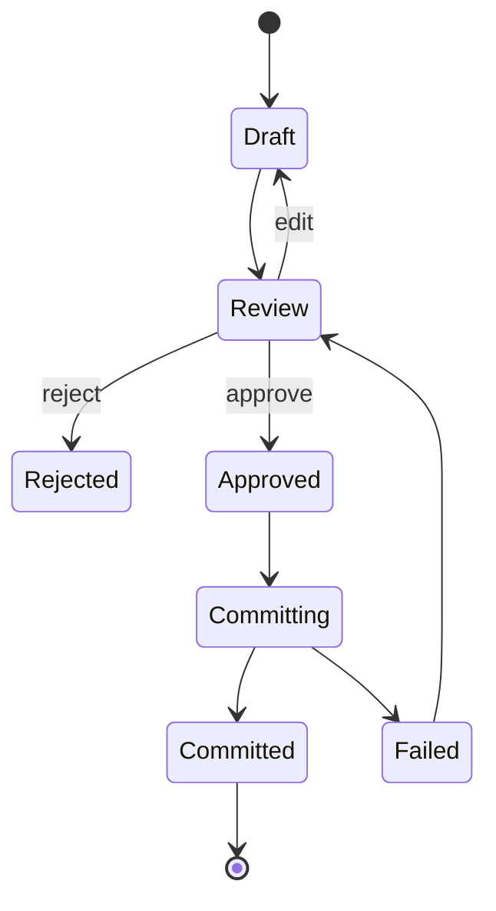
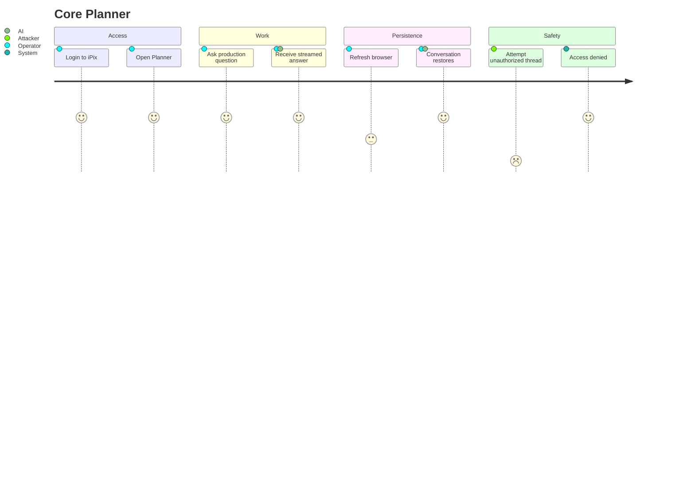
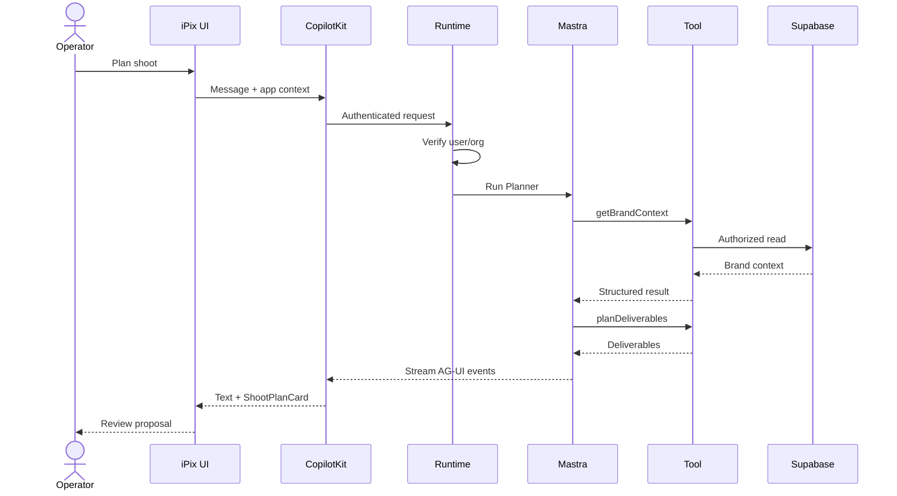
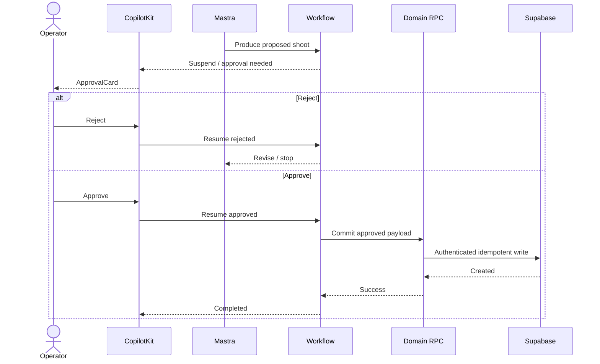

I completed the PRD against the current iPix V2 SSOT, current task/reference catalog, and current official Mastra/CopilotKit documentation and GitHub examples. The iPix source currently verifies Next.js + CopilotKit v2 + AG-UI + Mastra, while persistence/identity are still Foundation work; installed reference versions are CopilotKit `1.68.1`, `@mastra/core@1.63.2`, and `@ag-ui/mastra@1.1.2`.  

# iPix Mastra + CopilotKit Product Requirements Document

**Status:** Proposed companion PRD to iPix V2 master specification
**Date:** 2026-09-02
**Scope:** Mastra + CopilotKit AI product/runtime architecture
**Product:** iPix V2 — AI-native operating system for fashion brands and production teams

---

# 1. Executive Summary

iPix should use **CopilotKit + AG-UI as the human-facing AI interaction layer** and **Mastra as the server-side AI orchestration layer**.

The recommended architecture is:

```text
User
↓
Next.js iPix workspace
↓
CopilotKit
↓
AG-UI
↓
Mastra
├── Agents
├── Typed tools
├── Static workflows
├── Memory
└── Context
↓
Authenticated domain services / RPCs
↓
Supabase / Postgres
```

CopilotKit should handle:

* conversational UI
* application context
* shared UI/agent state
* tool rendering
* generative UI
* human approval surfaces
* threads
* agent interaction

Mastra should handle:

* agents
* model interaction
* typed tools
* deterministic workflows
* workflow suspend/resume
* runtime memory
* retrieval
* evaluations
* observability

Supabase/Postgres should remain the source of truth for:

* organizations
* brands
* shoots
* campaigns
* products
* assets
* CRM
* bookings
* approvals
* application audit records

This preserves the existing iPix architecture: **AI reads, reasons and proposes; humans approve; authenticated application paths perform consequential writes.** 

The shortest path to useful production value is:

```text
Core runtime
→ persistent Planner
→ Production Planner
→ typed production tools
→ contextual UI
→ structured Shoot Plan
→ HITL approval
→ Brand Intelligence
→ Brand Knowledge
→ broader iPix domains
```

Do not begin with subagents, autonomous browser agents, MCP orchestration, Agent Harness, schedules or dynamic workflows.

---

# 2. Problem Statement

Fashion production is spread across disconnected systems:

* spreadsheets
* messaging
* project-management tools
* file storage
* CRM
* ecommerce
* production planning
* asset systems

These systems generally do not understand:

* the brand's approved visual identity
* the current campaign
* the selected products
* shoot deliverables
* previous decisions
* the operator's current screen
* company permissions
* production status

Traditional AI chat adds another disconnected surface.

iPix needs an AI system that is embedded in the product itself.

A producer looking at a brand should be able to ask:

> Plan an ecommerce shoot for these eight products.

The AI should already know:

```text
current organization
+ current brand
+ approved Brand DNA
+ selected products
+ current campaign
+ permitted operations
```

It should then use deterministic tools where possible, reason only where necessary, generate a structured proposal, display that proposal inside iPix, and require human approval before creating durable business records.

---

# 3. Current iPix State

The current iPix V2 master specification identifies the following runtime as verified:

```text
Next.js App Router
→ CopilotKit v2
→ AG-UI @ag-ui/mastra
→ Mastra
```

The current repository snapshot still identifies in-memory Mastra persistence and a starter `demo-user` identity, while the required Core target moves persistence to PostgreSQL and resolves authentication/organization membership server-side. 

The official-link inventory records the currently installed reference family as:

| Package         | Current iPix reference |
| --------------- | ---------------------: |
| CopilotKit      |               `1.68.1` |
| `@mastra/core`  |               `1.63.2` |
| `@ag-ui/mastra` |                `1.1.2` |

Implementation should therefore prefer the matching installed source/types and the CopilotKit `v1.68.1` Mastra example when copying exact code. `main` is useful for research and upgrade planning, but should not silently define the API surface for the installed version. 

---

# 4. Product Goals

## Core Foundation

| Goal                    | Success condition                                              |
| ----------------------- | -------------------------------------------------------------- |
| Authenticated Planner   | Anonymous/untrusted users cannot enter agent runtime           |
| Tenant isolation        | Org B cannot read Org A conversations or application resources |
| Streaming               | Agent output streams progressively                             |
| Stop/cancel             | Active generation can be terminated reliably                   |
| Persistent conversation | Conversation survives browser refresh                          |
| Restart durability      | Conversation survives application/runtime restart              |
| Postgres persistence    | Production runtime does not depend on local/in-memory storage  |
| Thin Planner UI         | Operator can use real Planner in `/app/planner`                |
| Verification            | Core journey passes automated and hosted tests                 |

The existing execution backlog explicitly places memory, replay, hosted persistence proof and Planner UI before the final Core certification. 

## MVP

| Goal                  | Success condition                                             |
| --------------------- | ------------------------------------------------------------- |
| Production Planner    | Replaces demo/weather behavior                                |
| Production tools      | Shoot type, deliverables, shot list and budget are structured |
| Brand Intelligence    | URL → evidence → editable Brand DNA                           |
| Brand Knowledge       | Approved evidence becomes retrievable                         |
| Shared context        | Planner understands current brand/shoot/page                  |
| GenUI                 | Important AI output appears as useful product UI              |
| HITL                  | Consequential actions require explicit review                 |
| Shoot planning        | Brief → reviewable production plan                            |
| Workspace integration | Same AI experience follows operator through product           |

## Post-MVP

* campaign intelligence
* asset intelligence
* analytics assistant
* publishing assistance
* richer working memory
* learning/evaluation loops
* production knowledge retrieval

## Advanced

* subagents
* supervisor agents
* dynamic workflows
* Skills
* MCP orchestration
* schedules
* Agent Harness
* autonomous browser work
* Observational Memory
* large tool search/catalog systems

---

# 5. Non-Goals

Do not build during Core:

* multi-agent hierarchy
* custom agent framework
* custom model router
* custom conversation database
* custom workflow engine
* custom SSE/AG-UI protocol
* autonomous database writes
* custom browser agent
* custom tracing platform
* general MCP orchestration
* long-running autonomous agent workspace
* observational-memory optimization
* new Cloudflare AI runtime

The current iPix master specification explicitly keeps Vercel as the application/AI host and treats Workers as future work rather than the current CopilotKit/Mastra runtime. 

---

# 6. Target Users

| User              | Main problem                               | AI assistance                                   | Human control required         |
| ----------------- | ------------------------------------------ | ----------------------------------------------- | ------------------------------ |
| Studio owner      | Visibility across operations               | summaries, forecasts, exceptions                | budgets, contracts, publishing |
| Producer          | Production planning overhead               | schedules, deliverables, shot lists, costs      | commit shoot, bookings         |
| Creative director | Translating brand identity into production | creative direction, shot concepts, asset review | creative approval              |
| Brand operator    | Repetitive brand/campaign operations       | Brand DNA, briefs, research                     | approved Brand profile         |
| Sales             | Turning relationships into production      | CRM summaries, next action, shoot proposals     | outbound communication         |
| Photographer/crew | Production information scattered           | concise briefs, requirements, call details      | acceptance/confirmation        |
| Administrator     | Configuration/security                     | diagnostics and recommendations                 | permissions/security changes   |

---

# 7. Product Architecture

## 7.1 Plain-English architecture

CopilotKit is the **interaction system**.

Mastra is the **AI worker/orchestrator**.

Supabase is the **business database**.

Cloudinary is the **media system**.

The model is a replaceable reasoning engine inside Mastra.

## 7.2 Architecture diagram

```mermaid
flowchart TB
    U[Operator]

    subgraph Client["Next.js iPix"]
        UI[Operator Workspace]
        CK[CopilotKit]
        GU[Generative UI]
        CTX[App Context / Shared State]
    end

    subgraph Runtime["Vercel / Node"]
        API[/api/copilotkit]
        AGUI[AG-UI]
        M[Mastra]
        A[Agents]
        T[Typed Tools]
        W[Workflows]
        MEM[Memory]
    end

    subgraph Data["Application Truth"]
        SB[Supabase]
        PG[(Postgres)]
        RPC[Authenticated RPCs]
    end

    C[Cloudinary]
    EXT[External Services]

    U --> UI
    UI --> CK
    CK --> CTX
    CK --> GU
    CK --> API
    API --> AGUI
    AGUI --> M
    M --> A
    A --> T
    A --> W
    A --> MEM
    T --> RPC
    W --> RPC
    RPC --> SB
    SB --> PG
    T --> C
    T --> EXT
```

Mastra's current documentation distinguishes agents from workflows: agents are appropriate when the sequence is open-ended; workflows are appropriate when the sequence and control flow are known. ([Mastra][1])

That distinction should become an iPix architecture rule.

---

# 8. Ownership Boundaries

| System                       | Owns                                                                                |
| ---------------------------- | ----------------------------------------------------------------------------------- |
| CopilotKit                   | AI UX, agent interaction, context, shared state, GenUI, frontend tools, approval UX |
| AG-UI                        | Agent ↔ UI event protocol                                                           |
| Mastra                       | Agents, tools, workflows, memory, model access, reasoning, evaluations              |
| `mastra.*` Postgres          | Mastra runtime persistence                                                          |
| Supabase application schemas | Durable business/domain truth                                                       |
| Supabase Auth/RLS            | Identity and tenant/domain authorization                                            |
| Cloudinary                   | Image/video media workflows                                                         |
| Commerce platform            | Commerce truth                                                                      |
| External APIs                | Their respective external truth                                                     |

Mastra's PostgreSQL integration supports a configurable `schemaName`, pool reuse and disabling automatic initialization for CI/CD-controlled migrations. Those capabilities directly support the existing iPix decision to isolate Mastra storage in a private schema rather than creating a separate persistence framework. ([Mastra][2])

---

# 9. Security Model

## Principle

```text
AI proposes
→ human reviews
→ human approves
→ authenticated domain operation executes
→ system records result
```

No agent receives an unrestricted database write capability.

## Authentication

CopilotKit's current v2 authentication guidance places authentication in the runtime's `onRequest` hook before agent execution and explicitly identifies multi-tenant applications, tool gating and audit attribution as reasons to use it. ([docs.copilotkit.ai][3])

iPix must:

1. validate the Supabase session/JWT server-side;
2. resolve user membership and organization server-side;
3. create trusted runtime context;
4. reject missing/invalid identity with 401/403;
5. never accept browser-provided `organizationId` as authorization;
6. authorize every domain tool operation.

## Resource ownership

A thread identifier is not authorization.

Ownership must be derived from server-trusted records.

## Consequential operations requiring approval

* creating a shoot
* approving Brand DNA
* booking talent
* sending an external message
* changing a CRM stage
* publishing content
* modifying a budget
* issuing a refund/payment
* deleting business data

---

# 10. Directory Structure

Use the existing repository structure as the authority. The target logical structure should remain close to:

```text
src/
├── app/
│   ├── api/
│   │   └── copilotkit/
│   ├── app/
│   │   ├── planner/
│   │   ├── brand/
│   │   ├── shoots/
│   │   ├── campaigns/
│   │   ├── assets/
│   │   ├── matching/
│   │   ├── bookings/
│   │   ├── crm/
│   │   └── settings/
│   └── ...
│
├── mastra/
│   ├── agents/
│   ├── tools/
│   ├── workflows/
│   ├── memory/
│   ├── scorers/
│   └── index.ts
│
├── components/
│   ├── copilot/
│   ├── approval/
│   └── ...
│
├── lib/
│   ├── auth/
│   ├── supabase/
│   └── domain/
│
└── ...
```

Do not force this shape when current load-bearing repository paths differ.

---

# 11. Core Features

| Feature               | User value                      | Mastra responsibility           | CopilotKit responsibility    | Data                    | Official capability reused |
| --------------------- | ------------------------------- | ------------------------------- | ---------------------------- | ----------------------- | -------------------------- |
| Authenticated Planner | safe access                     | request/runtime context         | token forwarded to runtime   | Supabase Auth           | runtime authentication     |
| Streaming             | immediate feedback              | stream agent output             | render AG-UI events          | runtime                 | Mastra `.stream()` + AG-UI |
| Stop                  | regain control                  | abort active work               | Stop UX                      | runtime state           | AG-UI/CopilotKit runner    |
| Persistent memory     | no lost conversations           | Memory + storage                | thread interaction           | `mastra.*`              | Mastra Memory/Postgres     |
| Replay                | same conversation after refresh | persisted messages              | thread hydration             | `mastra.*`              | CopilotKit Threads         |
| Context               | understands current screen      | receive trusted/runtime context | `useAgentContext`            | UI state                | CopilotKit App Context     |
| Tools                 | useful actions                  | typed operations                | render progress/results      | domain APIs             | `createTool()`             |
| Structured result     | dependable product output       | schemas                         | components/cards             | transient/proposed data | structured output          |
| Observability         | diagnosable AI                  | traces/runs/tools               | Inspector during development | observability           | Mastra + CopilotKit tools  |

Mastra tools provide schema-defined inputs/outputs and the runtime passes request context and abort state into execution. Current docs also expose CLI tool execution, which should be used before writing temporary debug scripts. ([Mastra][4])

---

# 12. CopilotKit Product Capabilities

## 12.1 App Context

Use `useAgentContext` for information the Planner needs to understand the current product situation:

```text
current route
current org
current user role
current brand
current shoot
current campaign
selected products
selected asset
active filters
visible tab
```

CopilotKit specifically positions Agent App Context for sharing application-specific state such as current user and page with the agent. ([docs.copilotkit.ai][5])

Do not put secrets or authorization decisions into browser context.

---

## 12.2 Shared State

Use shared state when both the operator and agent are collaboratively editing the same temporary working object.

Example:

```text
ShootPlanDraft
├ deliverables
├ shotList
├ budget
└ notes
```

The operator can edit the draft while the agent also updates it.

CopilotKit's current Mastra documentation describes shared state as a two-way connection where agent state and UI state stay synchronized. ([docs.copilotkit.ai][6])

Do not confuse shared state with durable business truth.

---

## 12.3 Frontend Tools

Use frontend tools only for operations that genuinely belong in the browser:

* select a tab
* focus a product
* open a panel
* change local filters
* preview an asset
* animate/highlight UI

CopilotKit says frontend tools execute entirely in the browser and are suitable for React state, browser APIs and UI behavior. ([docs.copilotkit.ai][7])

Do not use frontend tools for authoritative domain writes.

---

## 12.4 Generative UI

Prefer controlled/product components:

```text
ShootPlanCard
BrandDNACard
BudgetCard
ApprovalCard
AssetQACard
TalentMatchCard
CampaignBriefCard
```

The current CopilotKit examples support static/controlled GenUI, tool rendering and broader generative patterns. ([GitHub][8])

For iPix MVP, controlled React components are safer and easier to test than unrestricted generated UI.

---

# 13. Agent Catalog

| Agent               | Purpose                                  | Primary route                     | Context                 | Tools                   | Workflows          | Direct domain writes | Phase    |
| ------------------- | ---------------------------------------- | --------------------------------- | ----------------------- | ----------------------- | ------------------ | -------------------- | -------- |
| Production Planner  | General fashion-production assistant     | `/app/planner` + contextual panel | org, brand, shoot, page | production tools        | shoot planning     | No                   | MVP      |
| Brand Intelligence  | Research and propose Brand DNA           | Brand workspace                   | brand URL/files         | research/evidence tools | Brand Intelligence | No                   | MVP      |
| Asset Intelligence  | Analyze assets/DNA/quality               | Assets                            | brand + asset           | image/metadata tools    | asset review       | No                   | Post-MVP |
| Campaign Assistant  | Develop campaign plans/content structure | Campaign                          | brand + campaign        | campaign tools          | campaign planning  | No                   | Post-MVP |
| CRM Assistant       | Summaries/next actions                   | CRM                               | company/contact/deal    | CRM read tools          | optional           | No                   | Post-MVP |
| Analytics Assistant | Explain performance                      | Analytics                         | metrics/filter state    | analytics tools         | optional           | No                   | Post-MVP |

### Explicit non-requirement

Do not create separate agents simply because separate domains exist.

A tool should be used when:

```text
input is known
→ operation is deterministic
→ output can be typed
```

Use an agent when the problem is open-ended.

Mastra's current agent guidance makes the same distinction. ([Mastra][1])

---

# 14. Production Planner

The Production Planner becomes the main AI entry point for operators.

## Responsibilities

* understand fashion-production requests
* identify missing requirements
* obtain approved Brand context
* call deterministic planning tools
* explain tradeoffs
* maintain the draft plan
* ask for approval at consequential gates

## Example

User:

> We have eight new products. Build an ecommerce + TikTok shoot for next Thursday under $6,000.

Planner:

```text
1. obtains current brand context
2. reads eight selected products
3. recommends shoot type
4. creates channel deliverables
5. generates structured shot requirements
6. calculates budget
7. renders ShootPlanCard
8. operator edits
9. requests approval
10. approved RPC creates shoot
```

---

# 15. Tool Catalog

| Tool                  | Purpose                              | Reads                   | Output         | Writes | Approval |
| --------------------- | ------------------------------------ | ----------------------- | -------------- | ------ | -------- |
| `getBrandContext`     | retrieve approved brand facts        | Brand domain            | BrandContext   | No     | No       |
| `recommendShootType`  | select production type               | inputs/rules            | recommendation | No     | No       |
| `planDeliverables`    | compute required deliverables        | brand/channels/products | Deliverable[]  | No     | No       |
| `generateShotList`    | produce structured shot requirements | deliverables/Brand DNA  | Shot[]         | No     | No       |
| `estimateBudget`      | deterministic cost estimate          | pricing/resources       | Budget         | No     | No       |
| `searchBrandEvidence` | retrieve cited evidence              | knowledge               | Evidence[]     | No     | No       |
| `getProducts`         | retrieve selected products           | commerce/domain         | Product[]      | No     | No       |
| `createShootDraft`    | prepare commit payload               | plan                    | Draft          | No     | No       |
| `commitApprovedShoot` | call authenticated RPC               | approved draft          | Shoot          | Yes    | **Yes**  |
| `explainDnaScore`     | explain brand/asset score            | evidence/analysis       | Explanation    | No     | No       |

## Design rule

Use code for arithmetic and business rules.

Use the model for:

* synthesis
* recommendations
* explanations
* ambiguity resolution
* creative reasoning

Mastra's `createTool()` supports typed schemas and structured execution, eliminating the need for a custom tool-dispatch framework. ([Mastra][4])

---

# 16. Workflow Catalog

| Workflow           | Trigger         | Main steps                                   | HITL             | Commit                | Phase    |
| ------------------ | --------------- | -------------------------------------------- | ---------------- | --------------------- | -------- |
| Brand Intelligence | submit URL      | extract → research → evidence → Brand DNA    | approve DNA      | `promote_brand_draft` | MVP      |
| Shoot Planning     | request plan    | context → deliverables → shot list → budget  | 3 review gates   | `commit_shoot_draft`  | MVP      |
| Asset Review       | new asset       | metadata → vision → Brand alignment → QA     | approve/reject   | asset state RPC       | Post-MVP |
| Product Linking    | approved assets | candidates → score → review                  | confirm links    | link RPC              | Post-MVP |
| Campaign Planning  | campaign brief  | brand context → concepts → channels → assets | approve campaign | campaign RPC          | Post-MVP |

Mastra workflows use typed steps and can execute code, agents or tools. This should replace any temptation to build a custom workflow DAG executor for ordinary iPix AI orchestration. ([Mastra][9])

---

# 17. HITL Architecture

## State model



## Rules

Use **tool/action approval** when one specific action is risky.

Use **workflow suspension** when the entire process must wait for user input before continuing.

Use **CopilotKit UI** to render the approval experience.

Typical iPix approval card:

```text
Create Shoot?

8 products
24 PDP images
6 social clips
Estimated budget: $5,820

[Edit]
[Reject]
[Approve & Create]
```

CopilotKit supports agent interruption and custom UI for resuming agent execution; Mastra supports agent/workflow HITL primitives. ([docs.copilotkit.ai][10])

---

# 18. Context Engineering

## Context envelope

```text
Trusted server context
├ user id
├ organization id
├ role / permissions
└ request identifiers

UI context
├ current route
├ current brand
├ current shoot
├ current campaign
├ selected item IDs
├ active tab
└ filters

Retrieved AI context
├ approved Brand DNA
├ relevant evidence
├ current production requirements
└ selected recent history
```

## Do not send

* entire database tables
* unrelated organizations
* raw secrets
* massive conversation histories
* all assets for every prompt
* service-role credentials
* authorization decisions from browser state

---

# 19. Memory Architecture

## Core

```text
Message history
+
stable resource identity
+
thread identity
+
Postgres storage
```

Mastra's current memory documentation identifies `resource` as the stable user/entity identifier and `thread` as the individual conversation/session identifier, and requires storage for persistent message history. ([Mastra][11])

## MVP+

Add Working Memory only when the product has a clear requirement for compact persistent facts.

## Advanced

Observational Memory only when real conversation length/cost measurements prove normal memory is insufficient.

## Boundary

```text
Mastra Memory
= conversational/runtime context

Supabase domain data
= application truth
```

---

# 20. Thread Architecture

CopilotKit Rich Threads can preserve conversation and associated UI/tool activity across sessions, and its official workflow includes reload/reopen persistence verification. ([docs.copilotkit.ai][12])

However, iPix should preserve its own authorization contract regardless of the persistence provider:

```text
thread id
+
trusted user
+
trusted org
+
ownership record
=
authorized thread
```

Current iPix Foundation work already contains explicit tasks for durable memory, replay, atomic thread ownership and multi-instance Stop behavior. 

---

# 21. Brand Intelligence

## User journey

```text
Brand URL
↓
extract brand website
↓
research gaps where necessary
↓
capture evidence/citations
↓
generate structured Brand DNA
↓
BrandDNACard
↓
operator edits
↓
approve
↓
authenticated RPC
↓
approved Brand profile
```

## Faster/better approach

Do not create a research framework from scratch.

Start:

```text
simple page extraction
→ Firecrawl/integration if needed
→ Deep Search pattern for iterative research
→ Agent Browser only for genuinely interactive sites
```

Mastra's official Deep Search template already demonstrates iterative gap detection, human suspend/resume, multiple specialized research steps and sourced answers. ([GitHub][13])

Do **not** copy its whole architecture into Planner.

Reuse the research-loop pattern only where Brand Intelligence needs it.

---

# 22. Browser Automation

Use only after cheaper approaches fail.

Order:

```text
existing API
→ direct HTTP
→ structured extraction / Firecrawl
→ Agent Browser
→ custom automation last
```

Mastra's official Browser Agent template uses `@mastra/agent-browser` with Playwright and a snapshot/reference scheme rather than brittle CSS-selector generation. ([GitHub][14])

Potential iPix use:

* inspect a dynamic brand navigation system
* view collection pages requiring JavaScript
* gather visual-merchandising evidence
* interact with gated tools when permitted

Not Core.

---

# 23. Model Architecture

Mastra's current agent API accepts model identifiers in `provider/model` form and centralizes provider selection through its model layer. ([Mastra][1])

## Architecture

```text
Production Planner
       ↓
model configuration
       ↓
provider/model
```

Not:

```text
OpenAIPlanner
GeminiPlanner
NvidiaPlanner
```

## Workload policy

| Workload             | Model class                 | Required capability      | Selection rule  |
| -------------------- | --------------------------- | ------------------------ | --------------- |
| Planner conversation | fast general model          | tools + streaming        | latency/cost    |
| Structured planning  | reliable general model      | schema/tool reliability  | eval score      |
| Brand research       | stronger reasoning/research | long context + citations | quality         |
| Asset analysis       | multimodal                  | vision                   | image quality   |
| Embeddings           | embedding model             | vectors                  | retrieval eval  |
| Difficult reasoning  | stronger model              | reasoning                | escalation only |

Do not hardcode a final model recommendation in this PRD.

Select models using:

```text
real iPix dataset
→ tool success
→ schema validity
→ output quality
→ latency
→ cost
```

The installed iPix master spec currently identifies OpenAI as the starter model path and Cloudflare AI Gateway/Gemini routing as proposed rather than a completed architectural fact. 

---

# 24. Real-World Use Cases

## Production Planner

### Example A — Ecommerce shoot

```text
8 selected products
→ Planner reads Brand DNA
→ planDeliverables
→ generateShotList
→ estimateBudget
→ ShootPlanCard
→ producer approves
→ shoot created
```

### Example B — Multi-channel shoot

```text
PDP + Instagram + TikTok
→ Planner deduplicates capture requirements
→ combines compatible shots
→ identifies unique video requirements
→ operator reviews
```

### Example C — Budget reduction

```text
Original budget: $8,000
New ceiling: $5,000
→ deterministic cost recomputation
→ AI proposes cuts
→ operator chooses tradeoff
→ approved plan updated
```

## Brand Intelligence

### Example A

Fashion startup enters its website.

AI creates:

* voice
* audience
* visual tone
* colors
* typography cues
* image style
* evidence citations

### Example B

Brand already exists but operator changes positioning.

AI compares current approved DNA against new public evidence and proposes differences.

### Example C

Website extraction fails.

System asks for:

* uploaded guidelines
* social links
* short manual questionnaire

and continues rather than failing the journey.

## HITL

### Example A

Planner recommends a $7,200 production budget.

No write occurs until producer approves.

### Example B

Brand Intelligence creates new Brand DNA.

Operator edits one value and approves.

### Example C

CRM assistant proposes moving a deal to Closed Won.

Sales rep approves before CRM mutation.

---

# 25. User Stories

| User story                                                                                   | Acceptance expectation                          |
| -------------------------------------------------------------------------------------------- | ----------------------------------------------- |
| As a producer, I want Planner to remember my conversation so I can resume work after refresh | Exact conversation restores                     |
| As a creative director, I want recommendations grounded in approved Brand DNA                | Recommendation shows relevant evidence          |
| As an operator, I want AI output rendered as useful cards                                    | Important structured results are not text blobs |
| As an owner, I want consequential AI changes approved first                                  | No write before approval                        |
| As a tenant admin, I need organization isolation                                             | Cross-org test always denies                    |
| As a producer, I want the AI to understand the brand I am currently viewing                  | Context updates when screen changes             |
| As a user, I want to stop a bad/long generation                                              | Stop reliably terminates execution              |

---

# 26. Core Planner User Journey



---

# 27. Planner Request Sequence



---

# 28. Approval Sequence



---

# 29. Website Pages

Public routes should remain largely independent from the AI runtime.

| Page              | Purpose                 | AI role            | Phase  |
| ----------------- | ----------------------- | ------------------ | ------ |
| Home              | product positioning     | optional demo only | M1/MVP |
| Features          | explain iPix workflows  | none required      | M1     |
| Solutions         | role/use-case marketing | none required      | MVP    |
| Login             | authenticated entry     | none               | Core   |
| Signup            | account creation        | none               | M1     |
| Password recovery | regain access           | none               | M1     |

Do not put agent runtime requirements on marketing pages.

---

# 30. Operator Dashboard Pages

| Screen                 | Purpose                 | Data                      | AI                           | CopilotKit           | Mastra              | HITL                   | Phase    |
| ---------------------- | ----------------------- | ------------------------- | ---------------------------- | -------------------- | ------------------- | ---------------------- | -------- |
| Planner `/app/planner` | main AI workspace       | threads/context           | Production Planner           | chat, threads, GenUI | agent/tools         | Yes where needed       | Core→MVP |
| Command Center `/app`  | org overview            | shoots, brands, tasks     | Planner summaries            | contextual panel     | read tools          | No                     | MVP      |
| Brands                 | browse brands           | brand records             | contextual Planner           | context              | brand reads         | No                     | MVP      |
| Brand Detail           | full Brand view         | profile/DNA/evidence      | Planner + Brand Intelligence | context/shared state | research/read tools | approve DNA            | MVP      |
| Brand Intelligence     | research/edit Brand DNA | draft + evidence          | Brand Intelligence           | GenUI/HITL           | workflow/tools      | Yes                    | MVP      |
| Shoots                 | browse shoots           | shoot records             | Planner                      | context              | shoot reads         | No                     | MVP      |
| Shoot Detail           | production control      | plan, crew, assets        | Planner                      | context/GenUI        | tools               | selected actions       | MVP      |
| Shoot Wizard           | create production       | draft plan                | Planner                      | shared state/cards   | planning workflow   | Yes                    | MVP      |
| Campaigns              | campaigns               | campaign records          | Campaign assistant           | context              | campaign reads      | No                     | Post-MVP |
| Campaign Detail        | campaign work           | brief/assets/status       | Campaign assistant           | GenUI                | campaign tools      | publish/commit         | Post-MVP |
| Assets                 | asset library           | Cloudinary/domain records | Asset Intelligence           | asset context/cards  | vision/tools        | review actions         | MVP/Post |
| Product Linking        | link assets/products    | product/link candidates   | Linking intelligence         | GenUI                | scoring tools       | confirm links          | Post-MVP |
| Matching               | talent matching         | talent/requirements       | Planner                      | GenUI                | match tools         | booking                | MVP      |
| Booking                | booking record          | dates/rates/status        | Planner                      | approval UI          | booking tools       | Yes                    | MVP      |
| CRM                    | relationships/pipeline  | CRM                       | CRM assistant                | contextual panel     | read/propose tools  | external/write actions | MVP      |
| Analytics              | performance             | metrics                   | Analytics assistant          | charts/context       | analytics tools     | No                     | Post-MVP |
| Settings               | configuration           | user/org settings         | limited helper               | contextual help      | none/minimal        | admin changes          | M1/MVP   |

---

# 31. Screen → AI Capability Matrix

| Screen             | App context  | Agent              | Tools          | Shared state | GenUI  | HITL     | Memory   |
| ------------------ | ------------ | ------------------ | -------------- | ------------ | ------ | -------- | -------- |
| Planner            | org/route    | Planner            | many           | optional     | Yes    | Yes      | Yes      |
| Brand              | brand        | Planner            | reads          | No           | Yes    | No       | Yes      |
| Brand Intelligence | brand/draft  | Brand Intelligence | research       | Yes          | Yes    | Yes      | thread   |
| Shoot Detail       | shoot/brand  | Planner            | shoot tools    | optional     | Yes    | selected | Yes      |
| Shoot Wizard       | shoot draft  | Planner            | planning tools | Yes          | Yes    | Yes      | Yes      |
| Assets             | asset/brand  | Asset AI           | analysis tools | No           | Yes    | selected | optional |
| CRM                | deal/company | CRM AI             | CRM tools      | No           | Yes    | writes   | optional |
| Analytics          | filters      | Analytics          | metric tools   | No           | charts | No       | optional |

---

# 32. Official Reference Implementation Map

| iPix capability     | Official reference                                                                                                                                                         | Reuse                                 | Avoid building                  |
| ------------------- | -------------------------------------------------------------------------------------------------------------------------------------------------------------------------- | ------------------------------------- | ------------------------------- |
| Mastra agents       | [https://mastra.ai/docs/agents/overview](https://mastra.ai/docs/agents/overview)                                                                                           | `Agent`, model/tools patterns         | custom agent loop               |
| Mastra tools        | [https://mastra.ai/docs/agents/tools](https://mastra.ai/docs/agents/tools)                                                                                                 | `createTool`, typed schemas           | custom tool dispatcher          |
| Workflows           | [https://mastra.ai/docs/workflows/overview](https://mastra.ai/docs/workflows/overview)                                                                                     | typed steps/control flow              | workflow engine                 |
| Memory              | [https://mastra.ai/docs/memory/overview](https://mastra.ai/docs/memory/overview)                                                                                           | message history/resource/thread       | conversation framework          |
| PostgreSQL          | [https://mastra.ai/integrations/databases/postgresql](https://mastra.ai/integrations/databases/postgresql)                                                                 | `PostgresStore`, schema/pool          | custom persistence layer        |
| Mastra + CopilotKit | [https://mastra.ai/integrations/agentic-ui/copilotkit](https://mastra.ai/integrations/agentic-ui/copilotkit)                                                               | supported bridge                      | bespoke agent protocol          |
| CopilotKit + Mastra | [https://docs.copilotkit.ai/mastra](https://docs.copilotkit.ai/mastra)                                                                                                     | frontend/runtime contract             | custom chat integration         |
| Hook selection      | [https://docs.copilotkit.ai/concepts/which-hook](https://docs.copilotkit.ai/concepts/which-hook)                                                                           | correct v2 hook per use               | ad-hoc UI APIs                  |
| App context         | [https://docs.copilotkit.ai/mastra/agent-app-context](https://docs.copilotkit.ai/mastra/agent-app-context)                                                                 | screen context                        | prompt concatenation framework  |
| Shared state        | [https://docs.copilotkit.ai/mastra/shared-state](https://docs.copilotkit.ai/mastra/shared-state)                                                                           | collaborative draft state             | custom sync protocol            |
| Frontend tools      | [https://docs.copilotkit.ai/mastra/frontend-tools](https://docs.copilotkit.ai/mastra/frontend-tools)                                                                       | client actions                        | homegrown browser action bus    |
| HITL                | [https://docs.copilotkit.ai/mastra/human-in-the-loop/useInterrupt](https://docs.copilotkit.ai/mastra/human-in-the-loop/useInterrupt)                                       | interruption UI                       | second approval framework       |
| Auth                | [https://docs.copilotkit.ai/auth](https://docs.copilotkit.ai/auth)                                                                                                         | runtime auth hook                     | auth inside individual agents   |
| Runtime             | [https://docs.copilotkit.ai/backend/runtime-endpoints](https://docs.copilotkit.ai/backend/runtime-endpoints)                                                               | standard routes/info                  | custom API protocol             |
| Threads             | [https://docs.copilotkit.ai/threads](https://docs.copilotkit.ai/threads)                                                                                                   | thread UX/persistence patterns        | custom thread UI prematurely    |
| Mastra source       | [https://github.com/mastra-ai/mastra](https://github.com/mastra-ai/mastra)                                                                                                 | types/tests/reference                 | guessed API behavior            |
| Mastra templates    | [https://github.com/mastra-ai/mastra/tree/main/templates](https://github.com/mastra-ai/mastra/tree/main/templates)                                                         | pattern discovery                     | greenfield boilerplate          |
| Deep Search         | [https://github.com/mastra-ai/template-deep-search](https://github.com/mastra-ai/template-deep-search)                                                                     | research loop/citations               | custom research engine          |
| Browser Agent       | [https://github.com/mastra-ai/template-browser-agent](https://github.com/mastra-ai/template-browser-agent)                                                                 | browser pattern                       | custom Playwright agent wrapper |
| Agent Harness       | [https://github.com/mastra-ai/template-agent-harness](https://github.com/mastra-ai/template-agent-harness)                                                                 | advanced workspace/approval/schedules | autonomous-agent control plane  |
| CopilotKit examples | [https://github.com/CopilotKit/CopilotKit/blob/main/examples/README.md](https://github.com/CopilotKit/CopilotKit/blob/main/examples/README.md)                             | discover supported examples           | copying obsolete legacy demos   |
| Mastra starter      | [https://github.com/CopilotKit/CopilotKit/tree/main/examples/integrations/mastra](https://github.com/CopilotKit/CopilotKit/tree/main/examples/integrations/mastra)         | baseline integration                  | custom bridge                   |
| Mastra canvas       | [https://github.com/CopilotKit/CopilotKit/tree/main/examples/canvas/mastra](https://github.com/CopilotKit/CopilotKit/tree/main/examples/canvas/mastra)                     | shared-state/visual card patterns     | bespoke canvas infrastructure   |
| Mastra PM           | [https://github.com/CopilotKit/CopilotKit/tree/main/examples/canvas/mastra-pm](https://github.com/CopilotKit/CopilotKit/tree/main/examples/canvas/mastra-pm)               | planning UX patterns                  | planner UI from zero            |
| Generative UI       | [https://github.com/CopilotKit/CopilotKit/tree/main/examples/showcases/generative-ui](https://github.com/CopilotKit/CopilotKit/tree/main/examples/showcases/generative-ui) | GenUI patterns                        | custom AI rendering protocol    |
| Multi-page          | [https://github.com/CopilotKit/CopilotKit/tree/main/examples/showcases/multi-page](https://github.com/CopilotKit/CopilotKit/tree/main/examples/showcases/multi-page)       | cross-route agent context             | route-specific copilots         |

CopilotKit's current examples catalog contains 52 consolidated demonstrations, including Mastra integration, Mastra canvas, Mastra PM, generative UI and multi-page patterns; the repo explicitly labels older top-level v1/v2 workspaces as legacy rather than part of the consolidated demo set. ([GitHub][15])

---

# 33. Reuse Before Build Matrix

| Requirement    | Existing/built-in first              | Template/example next | Custom work remaining      |
| -------------- | ------------------------------------ | --------------------- | -------------------------- |
| Chat runtime   | CopilotKit runtime                   | Mastra starter        | iPix auth/context          |
| Agent          | Mastra `Agent`                       | starter               | fashion instructions/tools |
| Tool execution | `createTool()`                       | examples              | domain functions           |
| Workflow       | Mastra Workflow                      | Deep Search patterns  | iPix business stages       |
| Persistence    | PostgresStore                        | official DB docs      | schema/security setup      |
| Threads        | CopilotKit Threads                   | starter UI            | ownership enforcement      |
| Context        | `useAgentContext`                    | multi-page            | map iPix screen state      |
| Shared drafts  | shared state                         | Mastra canvas         | ShootPlan schema           |
| GenUI          | CopilotKit render hooks              | Generative UI demo    | iPix components            |
| HITL           | Mastra + CopilotKit                  | enterprise examples   | approval policy/RPC        |
| Brand research | integrations                         | Deep Search           | Brand DNA schema           |
| Browser        | Agent Browser                        | browser template      | very limited iPix adapters |
| Debugging      | Mastra Studio + CopilotKit Inspector | —                     | app telemetry              |
| Model access   | Mastra model configuration           | model catalog         | evaluation policy          |

---

# 34. Development Roadmap

## NOW — Core Foundation

```text
IPI-1132 · STREAM-002 — Finish planner Stop cleanup and keep license-only Mastra persist

IPI-1045 · STREAM-001 — Let Authenticated iPix Users Stream Planner Responses Safely

IPI-1050 · MEM-001 — Let the Planner Remember the Conversation After Refresh and Restart

IPI-1088 · COPILOT-REPLAY-001 — Reload the Planner UI from the saved conversation after refresh

IPI-1031 · CORE-HOST-REF — Hosted synthetic Core proof on existing project

IPI-1051 · UI-001 — Let an iPix Operator Use the Planner in One Simple Authenticated Screen

IPI-1041 · CORE-001 — Prove the New iPix AI Foundation Survives Refresh, Restart, and Cross-Org Access Attempts
```

Release-safety work such as atomic ownership and multi-instance Stop remains Core because it protects the observable Foundation behavior. 

## NEXT — First Product Value

```text
IPI-1048 · PLANNER-001 — Make the Production Planner the Main iPix AI Assistant

IPI-1049 · TOOL-001 — Let the Planner Build Shoot Type, Deliverables, Shot List, and Budget Safely

IPI-1087 · PLANNER-CONTEXT-001

IPI-1081 · PLAN-001

IPI-1084 · APPROVAL-001

IPI-1093 · BRAND-INTEL-001 — Turn a Brand Website Into an Approved Brand DNA Profile

IPI-1128 · BRAND-KNOWLEDGE-001 — Give AI Decisions Approved Brand Evidence With Citations
```

## LATER

```text
Campaign assistant
Asset intelligence
Analytics
advanced memory
deep research expansion
browser automation
subagents
MCP
Skills
schedules
Agent Harness
dynamic workflows
```

---

# 35. Faster/Better Implementation Strategy

For every engineering task:

```text
1. Inspect existing iPix implementation.
2. Inspect installed package source/types.
3. Check Mastra Studio / CopilotKit Inspector.
4. Check official CLI capability.
5. Check official module/integration.
6. Check official template/example.
7. Copy the smallest proven pattern.
8. Write only iPix-specific code.
9. Run the cheapest targeted proof.
10. Expand testing only if that proof is insufficient.
```

### Examples

Need a tool?

```text
createTool()
→ direct CLI execution
→ agent integration
→ CopilotKit rendering
```

Do not start with a temporary API endpoint.

Need persistent memory?

```text
Mastra Memory
→ @mastra/pg
→ private mastra schema
```

Do not design a custom messages database.

Need approval?

```text
Mastra HITL
+
CopilotKit approval renderer
+
existing authenticated RPC
```

Do not design a second approval engine.

Need Brand research?

```text
simple extraction
→ official integration
→ Deep Search pattern
→ browser only if needed
```

---

# 36. Testing Strategy

Use the cheapest reliable proof:

```text
Static inspection
↓
pure/unit tests
↓
tool schema/execution
↓
agent tests
↓
workflow tests
↓
typecheck
↓
build
↓
CopilotKit integration
↓
Playwright
↓
hosted production-like proof
```

## Mandatory scenarios

### Runtime

* authenticated streaming
* unauthenticated rejection
* Stop
* provider error
* malformed tool result

### Persistence

* refresh
* reopen thread
* restart agent
* restart application instance

### Security

* Org A thread inaccessible to Org B
* Org A shoot inaccessible to Org B
* browser-supplied org ignored
* unauthorized tool denied
* missing membership denied

### Tools

* schema-valid inputs
* invalid inputs rejected
* deterministic math
* abort signals honored

### HITL

* approve
* reject
* edit then approve
* stale approval
* duplicate approval
* resumed workflow
* RPC failure after approval

### Brand Intelligence

* normal site
* extraction failure
* conflicting evidence
* no useful evidence
* citation preserved
* user edits before approval

---

# 37. Acceptance Criteria

## Core

* [ ] Authenticated user can access Planner.
* [ ] Unauthenticated user receives 401/403 before agent execution.
* [ ] Planner response streams.
* [ ] Stop terminates active generation.
* [ ] Conversation survives hard refresh.
* [ ] Conversation survives server restart.
* [ ] Hosted persistence uses Postgres.
* [ ] Thread ownership is organization-safe.
* [ ] Org B cannot access Org A resources.
* [ ] Thin `/app/planner` works in production-like environment.
* [ ] Core Playwright journey passes.

## MVP

* [ ] Production Planner replaces demo behavior.
* [ ] Planning tools have typed schemas.
* [ ] ShootPlan renders as structured UI.
* [ ] Planner receives correct screen context.
* [ ] Shared draft edits synchronize where required.
* [ ] Brand URL creates cited Brand DNA draft.
* [ ] User can edit/reject/approve AI proposal.
* [ ] Consequential domain writes require approval.
* [ ] Approval commits once.
* [ ] Every commit remains subject to application authorization.
* [ ] Critical journeys pass E2E.

---

# 38. Observability

Track:

| Signal           | Why                    |
| ---------------- | ---------------------- |
| Agent run        | overall AI execution   |
| Model calls      | latency/cost           |
| Tool selection   | behavior quality       |
| Tool duration    | performance            |
| Tool failure     | reliability            |
| Workflow step    | orchestration          |
| Suspend/resume   | HITL health            |
| Approval outcome | user acceptance        |
| Schema failure   | model/tool reliability |
| Token usage      | cost                   |
| Context size     | efficiency             |
| Business outcome | actual product value   |

Use Mastra's observability/Studio capabilities before creating custom AI tracing infrastructure.

Use CopilotKit Inspector for:

* agents
* state
* context
* frontend tools
* AG-UI events
* threads

The current Inspector exposes these classes of information directly. ([docs.copilotkit.ai][16])

---

# 39. Product Metrics

| KPI                             |           Target |
| ------------------------------- | ---------------: |
| Cross-tenant leakage            |            **0** |
| Duplicate approved commits      |            **0** |
| Audited domain mutations        |         **100%** |
| Critical E2E journeys green     |         **100%** |
| Brand URL → approved DNA        | `<10 min` target |
| Brief → reviewable plan         |  `<5 min` target |
| Manual planning reduction       |    `≥60%` target |
| AI proposal accepted/minor-edit |    `≥70%` target |

These targets are already represented in the current iPix master specification and should remain targets rather than being presented as already-achieved outcomes. 

---

# 40. Cost and Efficiency

## Primary costs

* model tokens
* large context
* repeated research
* browser sessions
* external extraction/search APIs
* embedding creation
* vector storage/querying
* hosted CopilotKit/Mastra services if adopted

## Reduction strategies

```text
deterministic calculation > LLM calculation

structured retrieval > dumping entire database

simple extraction > browser

single Planner > many agents

static workflow > autonomous planning when sequence is known

small approved context > unlimited memory replay

reuse official infrastructure > custom framework
```

---

# 41. Advanced Features — Entry Criteria

Do not implement simply because Mastra supports them.

| Feature              | Start only when                                                  |
| -------------------- | ---------------------------------------------------------------- |
| Subagents            | one agent has demonstrable specialization/tool-selection failure |
| Supervisor           | multiple independent specialists provide measurable quality gain |
| Tool Search          | tool catalog becomes large enough to hurt model behavior/context |
| Skills               | reusable runtime capability packages have real users             |
| Observational Memory | message-history cost/context is empirically problematic          |
| Agent Browser        | static extraction cannot complete required task                  |
| Dynamic workflows    | process shape genuinely changes at runtime                       |
| MCP                  | external MCP ecosystem creates concrete business value           |
| Agent Harness        | iPix needs long-running autonomous workspace tasks               |
| Schedules            | recurring agent activity has a defined user use case             |

Mastra's general-purpose Agent Harness already includes workspace, task tracking, memory, web access, approvals and schedules, so iPix should reuse that pattern later rather than creating its own autonomous-agent runtime. ([GitHub][17])

---

# 42. Deprecated / Avoid

Avoid:

* legacy Mastra v0 implementation guides for new code
* copying latest `main` APIs into pinned installed versions without verification
* obsolete CopilotKit examples
* custom SSE transport
* custom AG-UI protocol
* local SQLite as hosted production proof
* `resourceId: "default"`
* demo identities in production
* browser-chosen organization authorization
* service-role database tools for normal agents
* agent `INSERT` into canonical domain tables
* duplicated conversation store
* duplicated approval engine
* duplicated workflow engine
* provider-specific duplicate agents
* browser automation for ordinary extraction
* agent swarm before single-agent proof
* premature runtime migration from Vercel

---

# 43. Key Risks

| Risk                               | Severity | Mitigation                                    |
| ---------------------------------- | -------- | --------------------------------------------- |
| Mastra/CopilotKit version mismatch | P0       | pin family + installed types + contract tests |
| Tenant leakage                     | P0       | server membership + RLS + cross-org E2E       |
| Thread ID treated as authorization | P0       | explicit ownership mapping                    |
| Consequential autonomous writes    | P0       | HITL + authenticated RPC                      |
| Duplicate approval writes          | P0       | idempotency                                   |
| Stream/Stop fails across instances | P1       | distributed runner/ownership proof            |
| Workflow resume state lost         | P1       | Postgres persistence + restart tests          |
| Model output malformed             | P1       | typed schemas + retry/failure UI              |
| Research prompt injection          | P1       | external content treated as untrusted data    |
| Browser fragility                  | P2       | browser last                                  |
| Context/token growth               | P2       | context engineering + retrieval               |
| Agent complexity                   | P2       | one Planner first                             |

---

# 44. Source Verification

| Claim                                                                                | Verification                        | Confidence                   |
| ------------------------------------------------------------------------------------ | ----------------------------------- | ---------------------------- |
| Current iPix uses Next.js + CopilotKit v2 + AG-UI + Mastra                           | iPix V2 master PRD                  | High                         |
| Current snapshot still has in-memory persistence/demo identity                       | iPix V2 master PRD                  | High for referenced snapshot |
| Target is PostgresStore/private Mastra schema                                        | iPix master PRD                     | High                         |
| Installed reference family is CopilotKit 1.68.1 / Mastra 1.63.2 / AG-UI Mastra 1.1.2 | current official-links project file | High                         |
| Agents fit open-ended work                                                           | current Mastra docs                 | High                         |
| Workflows fit known control flow                                                     | current Mastra docs                 | High                         |
| Tools support typed schemas and runtime execution context                            | current Mastra docs                 | High                         |
| PostgresStore supports custom schema/pool and disabled init                          | current Mastra docs                 | High                         |
| CopilotKit supports app context                                                      | current CopilotKit docs             | High                         |
| CopilotKit supports two-way shared state                                             | current CopilotKit docs             | High                         |
| CopilotKit frontend tools run in browser                                             | current CopilotKit docs             | High                         |
| CopilotKit v2 runtime supports pre-agent auth hook                                   | current CopilotKit auth docs        | High                         |
| Official CopilotKit repo includes consolidated Mastra examples                       | current GitHub README               | High                         |
| Deep Search implements research loops/HITL/citations                                 | official Mastra template            | High                         |
| Browser template uses AgentBrowser/Playwright-style interaction                      | official Mastra template            | High                         |

---

# 45. Architecture Score

These scores assess the **proposed architecture**, not current implementation completeness.

| Category                 |      Score | Reason                                                                                       |
| ------------------------ | ---------: | -------------------------------------------------------------------------------------------- |
| Product fit              | **97/100** | Maps directly to real iPix production workflows                                              |
| Architecture correctness | **96/100** | Strong ownership separation; package-version execution still requires ongoing verification   |
| Security design          | **96/100** | Server identity + RLS + HITL; final proof depends on Core gates                              |
| Reuse                    | **98/100** | Mastra/CopilotKit primitives eliminate major custom systems                                  |
| Development efficiency   | **97/100** | One Planner, typed tools and static workflows minimize complexity                            |
| Maintainability          | **96/100** | Clear responsibilities and reusable patterns                                                 |
| Verification confidence  | **91/100** | Official docs + current project SSOT strong; full live production behavior not yet certified |
| **Overall**              | **96/100** | Recommended architecture                                                                     |

The score is provisional until **IPI-1041 · CORE-001 — Prove the New iPix AI Foundation Survives Refresh, Restart, and Cross-Org Access Attempts** provides the real hosted Foundation proof.

---

# 46. Final Architecture Decision

Use:

```text
Next.js / Vercel
↓
CopilotKit v2
↓
AG-UI
↓
Mastra
├ Agent
├ typed tools
├ static workflows
├ Postgres memory
└ evaluations / observability
↓
authenticated domain RPCs
↓
Supabase / Postgres
```

Build **one Production Planner first**.

Give it a small set of reliable typed production tools.

Use workflows for predictable production processes.

Use CopilotKit to make those capabilities visible and editable inside the iPix workspace.

Require human approval for consequential state changes.

Add specialized agents only after the single-Planner architecture has measurable limitations.

---

# 47. Summary

## Best architecture

**CopilotKit = AI user experience.
Mastra = AI orchestration.
Supabase = business truth.
Cloudinary = media.
Vercel = application/runtime host.**

## Biggest development accelerators

1. Mastra `Agent`
2. Mastra `createTool()`
3. Mastra Workflows
4. Mastra Memory + `@mastra/pg`
5. Mastra Studio
6. CopilotKit App Context
7. CopilotKit Shared State
8. CopilotKit tool rendering / GenUI
9. CopilotKit HITL
10. official Mastra/CopilotKit examples

## Core

```text
auth
→ streaming
→ Stop
→ Postgres memory
→ replay
→ tenant isolation
→ thin Planner UI
→ hosted Core certification
```

## MVP

```text
Production Planner
→ production tools
→ app context
→ structured Shoot Plan
→ HITL
→ Brand Intelligence
→ Brand Knowledge
→ Shoot workflow
```

## Advanced

Wait on:

```text
subagents
multi-agent supervisor
dynamic workflows
Skills
MCP orchestration
Tool Search
browser autonomy
Observational Memory
Agent Harness
schedules
```

## Biggest risks

1. package/runtime version drift
2. tenant/thread authorization errors
3. duplicate or unauthorized writes
4. unnecessary agent complexity
5. browser/model/external-service unreliability

## Next action

Finish the **M1 Foundation sequence and Core certification before expanding the AI product horizontally**.

The immediate product path remains:

```text
STREAM
→ Memory
→ Replay
→ hosted persistence proof
→ Planner UI
→ Core certification
→ Production Planner
→ Tools
→ Context
→ Structured Plan
→ HITL
→ Brand Intelligence
```

The main architectural change from a typical “AI chatbot” plan is important: **do not build a separate AI system for every screen.** Build one secure reusable runtime, then let each screen contribute context, tools, cards, and approval rules. That is the simplest route from Core to the full iPix operating system.

[1]: https://mastra.ai/docs/agents/overview "Agents | Mastra Docs"
[2]: https://mastra.ai/integrations/databases/postgresql "PostgreSQL | Database | Mastra Docs"
[3]: https://docs.copilotkit.ai/auth "Authentication"
[4]: https://mastra.ai/docs/agents/tools "Tools | Agents | Mastra Docs"
[5]: https://docs.copilotkit.ai/mastra/agent-app-context?utm_source=chatgpt.com "Agent App Context"
[6]: https://docs.copilotkit.ai/mastra/shared-state?utm_source=chatgpt.com "Shared State"
[7]: https://docs.copilotkit.ai/mastra/frontend-tools?utm_source=chatgpt.com "Frontend Tools"
[8]: https://github.com/CopilotKit/CopilotKit/blob/main/examples/showcases/generative-ui-playground/README.md?utm_source=chatgpt.com "CopilotKit/examples/showcases/generative-ui-playground/README.md at main · CopilotKit/CopilotKit · GitHub"
[9]: https://mastra.ai/docs/workflows/overview "Workflows | Mastra Docs"
[10]: https://docs.copilotkit.ai/mastra/human-in-the-loop/useInterrupt "Pausing the Agent for Input"
[11]: https://mastra.ai/docs/memory/overview "Memory | Mastra Docs"
[12]: https://docs.copilotkit.ai/threads "Rich Threads"
[13]: https://github.com/mastra-ai/template-deep-search?utm_source=chatgpt.com "GitHub - mastra-ai/template-deep-search: Template repository for template-deep-search · GitHub"
[14]: https://github.com/mastra-ai/template-browser-agent?utm_source=chatgpt.com "GitHub - mastra-ai/template-browser-agent: A browser-using agent built on @mastra/agent-browser (Playwright). Uses Mastra's Gateway for LLM calls, web search as a fallback, and persists state to Turso (libSQL). · GitHub"
[15]: https://github.com/CopilotKit/CopilotKit/blob/main/examples/README.md?utm_source=chatgpt.com "CopilotKit/examples/README.md at main · CopilotKit/CopilotKit · GitHub"
[16]: https://docs.copilotkit.ai/teams/mastra/inspector?utm_source=chatgpt.com "Inspector"
[17]: https://github.com/mastra-ai/template-agent-harness?utm_source=chatgpt.com "GitHub - mastra-ai/template-agent-harness: A general-purpose Mastra agent with a local workspace, shell tools, memory, task tracking, web access, and recurring schedules. · GitHub"
