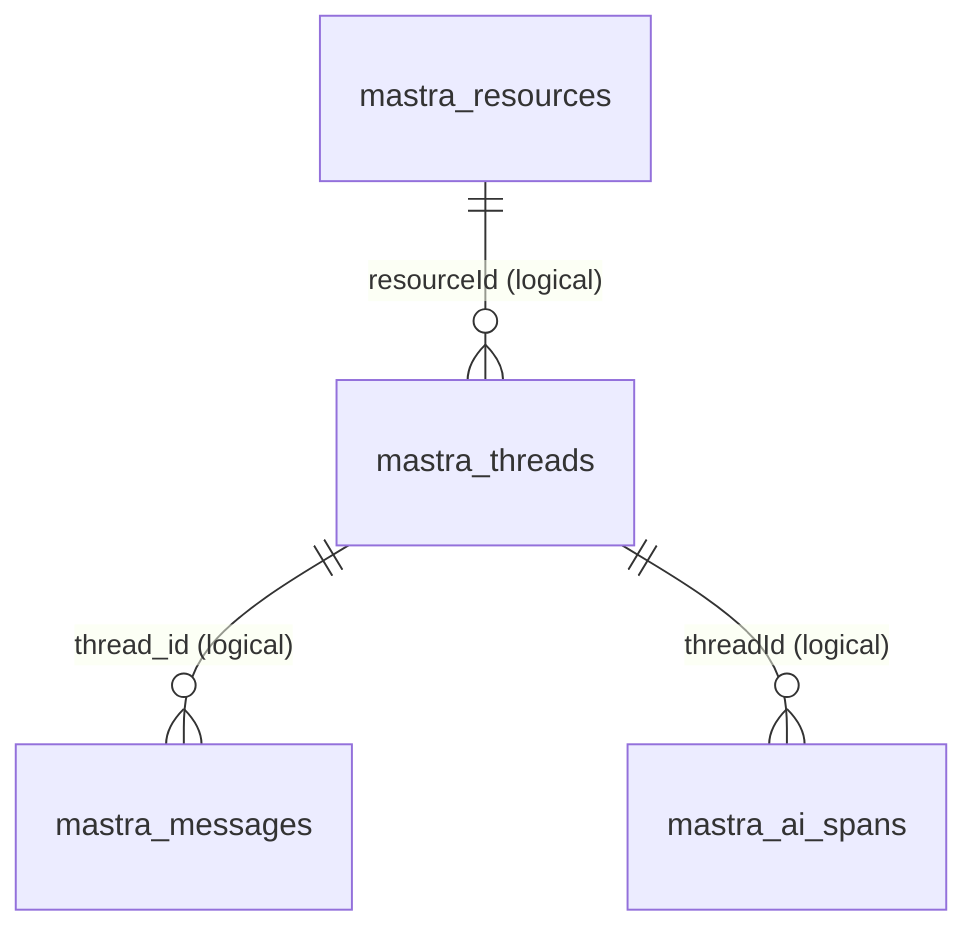
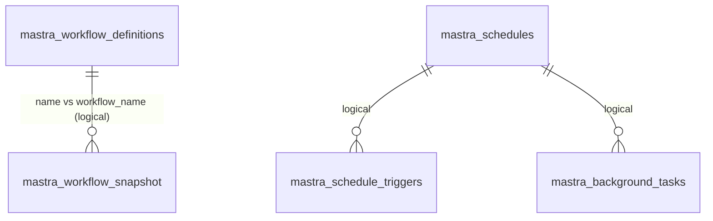
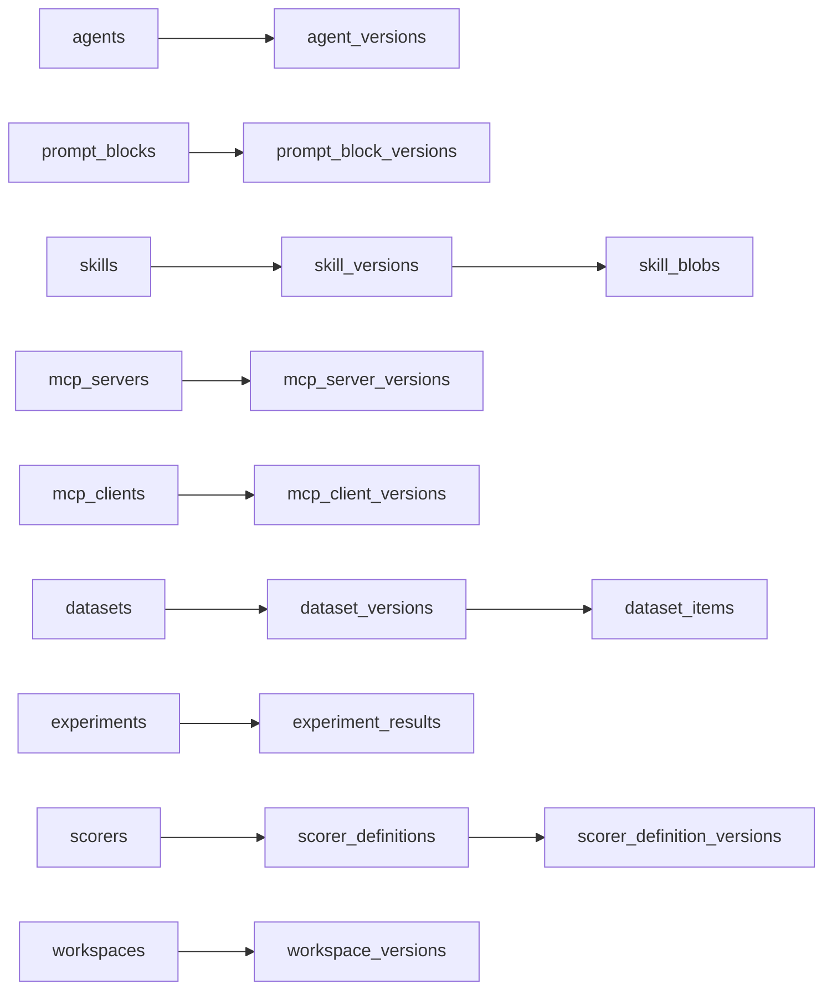
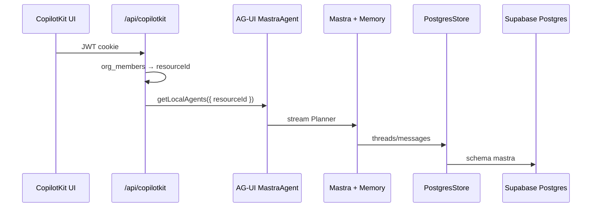

# Mastra-on-Supabase audit (live, read-only)

**Project:** `nvdlhrodvevgwdsneplk`  
**Verified:** 2026-08-24 via Supabase MCP SQL + Security grants + Mastra MCP docs + installed `app/` (`@mastra/pg@1.12.0`, `@mastra/core@1.41.0`). **No production writes.**

Like a lookbook archive: 34 labeled drawers already exist in the vault. Some hold real shoot chats. Some are empty but correctly labeled for later seasons. Do **not** throw empty drawers away. Do **not** let the new crew write into the live vault until they pass TEST-\<uuid\> in a preview studio.

**Official refs used:** [Storage](https://mastra.ai/docs/storage) · [PostgreSQL adapter](https://mastra.ai/integrations/databases/postgresql) · [Memory](https://mastra.ai/docs/memory/overview) · [MastraAuthSupabase](https://mastra.ai/reference/auth/supabase) · installed `@mastra/pg` constructor (`schemaName`, `disableInit`). **Installed types win over stale docs** (docs still mention `mastra_threads` / `disableInit` in places).

---

## 1. Executive verdict

| Question | Answer |
|----------|--------|
| Are all 34 tables valid? | **Yes.** All exist in schema `mastra`, RLS on, no `anon`/`authenticated` grants. |
| Any missing for Core? | **No missing Core tables.** Preview must still **diff columns** vs pinned `@mastra/pg` (IPI-V2-005B). |
| Any obsolete? | **None obsolete as a class.** Empty Studio/eval/MCP tables are **reserved**, not junk. |
| Should any be dropped? | **No.** Empty ≠ drop. Snapshot **bloat** is a retention/ops issue, not a DROP. |
| Core vs later | Core: threads/messages/resources/workflow_snapshot (+ optional ai_spans). MVP+: working memory + evals. Advanced: observational memory, channels, MCP, workspaces. |
| Compatible with new package family? | **Likely yes for Core names** (`mastra.mastra_threads` = `schemaName: "mastra"` + table `mastra_threads`). **Not proven** until preview `init`/introspect against the **pinned** `@mastra/pg`. Stale docs list `mastra_evals` / `mastra_traces` / `mastra_notifications` which **are not** live table names. |
| Reuse after preview? | **Yes, reuse the schema design.** **Do not** point the new app at production `mastra` on day one. |
| Will the rebuild plan succeed? | **Yes**, if Wave 0 preview + gold TEST-\<uuid\> + `disableInit: true` on prod. |
| **Grade** | **84/100** (schema+grants strong; prod thread `resourceId` hygiene + snapshot bloat + contract pin incomplete) |
| **Confidence** | **82%** (live SQL + grants confirmed; no preview write test; GitHub `@mastra/pg` table constants not fully dumped this pass) |

**P0 for new runtime:** do not connect PostgresStore to production `mastra` until preview gold test. Production already has **45 threads**, mixed `resourceId` shapes (including `dev-unauthenticated`), and **~6140 workflow snapshots** (mostly `__mastra_notification_dispatcher`).

---

## 2. Live 34-table inventory

Row counts = `pg_stat_get_live_tuples` / `list_tables` (2026-08-24). RLS enabled on **all**. Policy: `hyperdrive_mastra_runtime_all` **USING (true)** for role `hyperdrive_mastra_runtime` only. Grants: `postgres` + that runtime role. **Zero** grants to `anon` / `authenticated`. **Zero Postgres FKs** (logical relations only).

| Table | Purpose | Phase | PK | Important columns | Indexes (notable) | RLS | Grants | ~Rows | Used now? | Expected by `@mastra/pg` Core? | Action |
|-------|---------|-------|----|-------------------|-------------------|-----|--------|-------|-----------|--------------------------------|--------|
| mastra_threads | Chat threads | **Core** | `id` | `resourceId`, `title`, `metadata`, timestamps | `(resourceId, createdAt DESC)` | on | runtime+postgres | **45** | **Yes** | **Yes** (memory domain) | **KEEP + HARDEN** (`resourceId` hygiene on new app) |
| mastra_messages | Turns | **Core** | `id` | `thread_id`, `content`, `role`, `type`, `resourceId` | `(thread_id, createdAt DESC)` | on | runtime+postgres | **103** | **Yes** | **Yes** | **KEEP** |
| mastra_resources | Working memory blob per resource | **Core/MVP** | `id` | `workingMemory`, `metadata` | PK | on | runtime+postgres | **0** | Not yet | **Yes** | **KEEP** |
| mastra_workflow_snapshot | Suspend/resume | **Core** | unique `(workflow_name, run_id)` | `resourceId`, `snapshot` jsonb | unique name+run | on | runtime+postgres | **6140** | **Yes (noisy)** | **Yes** (workflows domain) | **KEEP + HARDEN** (retention; don’t port dispatcher) |
| mastra_workflow_definitions | Studio/dynamic graphs | Post-MVP | `id` | `graph`, schemas, `status`, `source` | `status` | on | runtime+postgres | **0** | No (code-registered wizards) | Platform | **DEFER** |
| mastra_ai_spans | Traces | Core (light) / MVP staging | `(traceId, spanId)` | `threadId`, `resourceId`, `organizationId`, `userId`, io jsonb | trace/parent/org indexes | on | runtime+postgres | **6** | Light | **Yes** (observability domain; docs alias `mastra_traces` is stale) | **KEEP** |
| mastra_observational_memory | Cross-thread facts | Advanced | *(not deep-audited)* | OM payload | — | on | runtime+postgres | **0** | No | Optional memory | **DEFER** |
| mastra_agents | Studio agent registry | Post-MVP | | | | on | runtime+postgres | 0 | No | Platform | **DEFER** |
| mastra_agent_versions | Agent pin/history | Post-MVP | | | | on | runtime+postgres | 0 | No | Platform | **DEFER** |
| mastra_prompt_blocks | Prompt CMS | Post-MVP | | | | on | runtime+postgres | 0 | No | Platform | **DEFER** |
| mastra_prompt_block_versions | Prompt history | Post-MVP | | | | on | runtime+postgres | 0 | No | Platform | **DEFER** |
| mastra_skills | Skill packs | Post-MVP | | | | on | runtime+postgres | 0 | No | Platform | **DEFER** |
| mastra_skill_versions | Skill history | Post-MVP | | | | on | runtime+postgres | 0 | No | Platform | **DEFER** |
| mastra_skill_blobs | Skill files | Post-MVP | | | | on | runtime+postgres | 0 | No | Platform | **DEFER** |
| mastra_mcp_servers | MCP server registry | Post-MVP | | | | on | runtime+postgres | 0 | No | Platform | **DEFER** |
| mastra_mcp_server_versions | MCP history | Post-MVP | | | | on | runtime+postgres | 0 | No | Platform | **DEFER** |
| mastra_mcp_clients | MCP clients | Post-MVP | | | | on | runtime+postgres | 0 | No | Platform | **DEFER** |
| mastra_mcp_client_versions | MCP client history | Post-MVP | | | | on | runtime+postgres | 0 | No | Platform | **DEFER** |
| mastra_datasets | Eval datasets | **MVP** | | | | on | runtime+postgres | 0 | No | scores/datasets domain | **DEFER** until evals |
| mastra_dataset_versions | Dataset pins | MVP | | | | on | runtime+postgres | 0 | No | | **DEFER** |
| mastra_dataset_items | Dataset rows | MVP | | | | on | runtime+postgres | 0 | No | | **DEFER** |
| mastra_experiments | Eval runs | MVP | | | | on | runtime+postgres | 0 | No | experiments domain | **DEFER** |
| mastra_experiment_results | Per-item scores | MVP | | | | on | runtime+postgres | 0 | No | | **DEFER** |
| mastra_scorers | Scorer registry | MVP | | | | on | runtime+postgres | 0 | No | scores domain (docs `mastra_scorers`) | **DEFER** |
| mastra_scorer_definitions | Scorer defs | MVP | | | | on | runtime+postgres | 0 | No | | **DEFER** |
| mastra_scorer_definition_versions | Scorer history | MVP | | | | on | runtime+postgres | 0 | No | | **DEFER** |
| mastra_schedules | Cron/job defs | Post-MVP | | | | on | runtime+postgres | **1** | Dispatcher leftover | schedules domain | **KEEP + HARDEN** (don’t enable in Core) |
| mastra_schedule_triggers | Fire history | Post-MVP | | | | on | runtime+postgres | **6078** | **Bloat** | | **KEEP + HARDEN** (prune on preview; never copy to v2) |
| mastra_background_tasks | Durable agent jobs | Post-MVP | | | | on | runtime+postgres | 0 | No | backgroundTasks domain | **DEFER** |
| mastra_channel_config | WhatsApp etc. | Advanced | | | | on | runtime+postgres | 0 | No | channels | **DEFER** |
| mastra_channel_installations | Channel installs | Advanced | | | | on | runtime+postgres | 0 | No | | **DEFER** |
| mastra_workspaces | Studio workspaces | Post-MVP | | | | on | runtime+postgres | 0 | No | workspace domain | **DEFER** |
| mastra_workspace_versions | Workspace history | Post-MVP | | | | on | runtime+postgres | 0 | No | | **DEFER** |
| mastra_favorites | Studio favorites | Post-MVP | | | | on | runtime+postgres | 0 | No | | **DEFER** |

**REMOVE:** none.  
**MIGRATE:** none required for rebuild (new app uses preview first).  
**UNKNOWN:** exact column parity vs `@mastra/pg@latest` until IPI-V2-005B.

---

## 3. LIVE 34 vs current `@mastra/pg` contract

**Installed in this repo (`app/package.json`):** `@mastra/pg@1.12.0`. Constructor (code + tests): `schemaName` (required `mastra`), `disableInit: true`. GitHub `stores/pg` (main) uses the same: `schemaName` default `public`, `disableInit`.

**Docs mismatch (do not implement from docs alone):**

| Docs still say | Live / installed |
|----------------|------------------|
| Tables `mastra_threads`, `mastra_messages`, `mastra_workflow_snapshot`, `mastra_evals`, `mastra_traces`, `mastra_scorers`, `mastra_resources`, `mastra_notifications` in default public | Live: `mastra.mastra_*` (34 names). No `mastra_evals`, `mastra_traces`, `mastra_notifications`. Observability = `mastra_ai_spans`. |
| `schema` / `disableInit` in some older pages | Installed: `schemaName` / `disableInit` |
| Auto-`init()` creates tables | Production **must** keep `disableInit: true` |

**Expected domains** ([docs/storage](https://mastra.ai/docs/storage)): memory, workflows, observability, scores, datasets, experiments, backgroundTasks, schedules, threadState. Live 34 tables **cover** those domains. Core iPix only **uses** memory + workflows (+ light spans).

**Init behavior:** if someone boots new `@mastra/pg` with `disableInit: false` against production, it may ALTER/CREATE. **Forbidden.** Preview only for init.

**Flag:** index names like `public_mastra_ai_spans_traceid_spanid_pk` on tables **in schema `mastra`** show these objects were **moved or created with a public-prefix leftover**. Cosmetic; keep. Contract check should ignore names, compare columns/types.

---

## 4. Core table deep audit

### Relationships (logical, **no FKs**)

```text
mastra_resources.id  ≈  mastra_threads.resourceId   (0 resource rows today)
mastra_threads.id    ←  mastra_messages.thread_id
mastra_threads.id    ≈  mastra_ai_spans.threadId
mastra_threads.resourceId ≈ messages.resourceId / spans.resourceId
```

**Orphans:** **0** messages without a thread. **7** threads with no messages (empty shells — OK).

### Ownership / `resourceId`

Live distinct `resourceId` on threads:

| Shape | n | Meaning |
|-------|---|---------|
| `dev-unauthenticated` | **23** | **P1 hygiene** — old/dev path leaked into prod catalog |
| `org:{uuid}::user:{uuid}` | 11 | **Current iPix convention** (`makeMemoryResourceId`) |
| bare UUID | 10 | Pre–org-scope |
| `qa@ipix.test` | 1 | Email used as id — do not repeat |

**New Core recommendation:** keep **`org:{orgId}::user:{userId}`** (already in `app/src/mastra/memory.ts` + tests). Do **not** switch to `org:{orgId}:user:{userId}` unless you migrate strings; double-colon is the live contract.

**Authorization is not in Mastra storage.** RLS is USING true for the **runtime DB role**. Org isolation = CopilotKit route + `org_members` + fail-closed factory. Browser never gets `DATABASE_URL`.

### Indexes for restore

- List threads by owner: `(resourceId, createdAt DESC)` — **good**.
- History: `(thread_id, createdAt DESC)` — **good**.
- Workflow unique `(workflow_name, run_id)` — **good**.
- Spans: trace/parent/org — **good** (over-indexed for 6 rows; fine).

### Workflow persistence

| workflow_name | snapshots |
|---------------|-----------|
| `__mastra_notification_dispatcher` | **6074** |
| `shoot-wizard` | 47 |
| `brand-intelligence` | 7 |
| `brand-approval` | 7 |
| durable/agentic loops | 5 |

**Do not port** the notification dispatcher into v2. Preview seed should have **zero** dispatcher rows.

### Compatibility

Core columns (`id`, `resourceId`, `thread_id`, `content`, `role`, workflow `snapshot` jsonb) match current PostgresStore memory/workflow usage. `createdAtZ` companion columns are Mastra’s timestamptz dual-write — **KEEP**.

---

## 5. Memory (what to enable)

| Mode | iPix use | Phase | Live table | Enable in Core? |
|------|----------|-------|------------|-----------------|
| Message history | Restore Production Planner after refresh | **Core** | threads + messages | **Yes** (`lastMessages`) |
| resourceId partition | Org A vs Org B | **Core** | `threads.resourceId` | **Yes** (server-set) |
| Working memory | Current brand / shoot / budget on the thread | **MVP** | `mastra_resources.workingMemory` | Planner schema already in repo; enable on preview |
| Observational memory | “This brand always shoots on film” across threads | **Advanced** | `mastra_observational_memory` | **Disabled** |
| Semantic recall | Vector search over old chats | Advanced | usually extra vector store | **Disabled** (no Core embeddings requirement) |

Real examples:

- Refresh Planner → same `threadId` + `resourceId` → lastMessages replay.
- Working memory: `{ brandName, shootType, pendingDecisions }` on that thread.
- Shared shoot thread later: **new** resourceId convention (`org:{org}:shoot:{shootId}`) — Post-MVP; still enforce in **app**, not RLS.

---

## 6. Advanced domains (feature → table)

| Domain | Created by | iPix need | Phase | Example |
|--------|------------|-----------|-------|---------|
| Agents + versions | Studio / registry | Optional prompt pin | Post-MVP | Pin “Planner v3” copy |
| Prompt blocks | Studio | Brand voice CMS | Post-MVP | Lookbook tone blocks |
| Skills | Skill packs | Later | Post-MVP | Cloudinary skill pack |
| MCP | MCP servers/clients | Linear / Cloudinary tools | Post-MVP | Ticket from Planner |
| Datasets / experiments / scorers | Evals | Planner quality | **MVP** | Gold TEST-\<uuid\> scoring |
| Schedules + triggers | Scheduler | Shoot reminders | Post-MVP | Call sheet T−1 day |
| Background tasks | Durable agents | Long brand crawl | Post-MVP | Overnight scrape |
| Channels | Channel adapters | WhatsApp talent | Advanced | Model confirm via WA |
| Workspaces / favorites | Studio UX | Optional | Post-MVP | Saved Planner views |

---

## 7. Security / grants

| Check | Live | Verdict |
|-------|------|---------|
| Schema on PostgREST | `supabase/config.toml` `schemas = ["public", "graphql_public", "planner"]` — **`mastra` not listed** | **Pass** |
| anon/authenticated table grants | **0** | **Pass** |
| Runtime role | `hyperdrive_mastra_runtime` DML only | **Pass** (name is Hyperdrive leftover; still a dedicated role) |
| RLS USING (true) | Yes, **only** for that role | **Acceptable** if JWT roles cannot connect |
| Browser DB creds | App uses user JWT for **domain** RPCs; Mastra uses server `DATABASE_URL` | **Pass** if env never `NEXT_PUBLIC_` |
| Org isolation | App-layer `resourceId` | **Required** — storage will not stop Org B if runtime role is used with a forged id |
| Red flags | 23 `dev-unauthenticated` threads; snapshot/trigger bloat; `postgres` superuser also used in some paths | **P1** hygiene + ops, not RLS hole |

**MastraAuthSupabase** is for **Mastra server HTTP auth**, not a substitute for CopilotKit cookie JWT. New iPix: Supabase Auth on the Next route → then Mastra `resourceId`.

---

## 8. ERDs (logical; dashed = no FK)







---

## 9. Data flows




Planner persist/restore: same `threadId` client-side + server `resourceId` → `lastMessages`.  
HITL: agent tool → **domain RPC** (`planner_*`) with **user JWT**, not service-role table writes.  
Workflow resume: `mastra_workflow_snapshot` by `(workflow_name, run_id)`.  
Observability: exporter → `mastra_ai_spans`.  
Evals (later): datasets → experiments → scorers.

---

## 10. Codebase wiring (current `app/`)

| Piece | Status | Action |
|-------|--------|--------|
| `getMastra()` / `new Mastra({ storage })` | Exists | **PORT** pattern; **REBUILD** tree in starter |
| `PostgresStore` `schemaName` + `disableInit: true` | Exists | **KEEP** contract |
| `Memory` lastMessages + Planner workingMemory schema | Exists | **PORT** |
| `MastraAgent.getLocalAgents` + `CopilotRuntime` + `createCopilotRuntimeHandler` | Exists; matches **current** CopilotKit Mastra quickstart | **REBUILD** on starter; **PORT** auth factory |
| `InMemoryAgentRunner` | Exists; **not** a substitute for Postgres memory | **KEEP** as runner; persistence is PostgresStore |
| `demo-user` / `dev-unauthenticated` | Auth fallbacks + **23 live threads** | **REMOVE** from prod paths |
| Cloudflare `MASTRA_STORAGE_MODE=noop` / pg stub | Worker hang mitigation | **REMOVE** from Node-first v2 |
| `public.mastra_*` | None | **KEEP** forbidden |
| Duplicate thread tables | Domain planner ≠ mastra threads | **KEEP** separation |
| Frontend thread restore | CopilotKit threads / intelligence flagged incomplete in route comments | **MISSING** in v2 until gold test |

---

## 11. Errors / blockers

| ID | Sev | Problem | Evidence | Why | Fix | Effort | Risk | Faster path |
|----|-----|---------|----------|-----|-----|--------|------|-------------|
| M-01 | **P0** | New app writing prod `mastra` | 45 threads, 6k snapshots | Data loss / mix tenants | Preview branch + `disableInit` on prod | S | Low | Empty `ipix-v2` seed |
| M-02 | **P1** | Dirty `resourceId`s | 23 `dev-unauthenticated` | Gold test pollution if reused | New app reject those ids; don’t copy rows | S | Low | Preview seed only Org A/B |
| M-03 | **P1** | Snapshot/trigger bloat | 6074 dispatcher snapshots | Cost; resume noise | Don’t port dispatcher; prune on preview | M | Low | Ignore prod; start empty |
| M-04 | **P1** | Package column drift unproven | Docs ≠ 34 names | Init could ALTER | IPI-V2-005B on preview | M | Med | Introspect installed types |
| M-05 | **P2** | USING (true) RLS | All 34 tables | Fine only for runtime role | Keep mastra off Data API | S | Low | Already off API schemas |
| M-06 | **P2** | No FKs | `fk_count=0` | Orphans possible | App-level checks; optional later FKs | L | Low | Don’t add FKs in Wave 0 |
| M-07 | **P3** | `public_*` index names | spans/snapshot indexes | Confusion | Leave | — | — | Ignore |

---

## 12. Fixes (smallest)

1. Wave 0.10–0.11 preview + seed (already in `data/supa-fix-plan.md`).
2. Pin CopilotKit+Mastra on starter; IPI-V2-005B column diff.
3. `schemaName: "mastra"`, `disableInit: true`, fail boot if schema missing.
4. Server-only `resourceId`; reject demo/unauthenticated.
5. Gold TEST-\<uuid\> on preview.
6. Do not DROP empty tables.

---

## 13. Tests run this pass

| Test | Result |
|------|--------|
| Live 34-table list + row estimates | **Pass** |
| Core columns/indexes | **Pass** |
| Grants anon/authenticated | **0 — Pass** |
| RLS + policy role | **Pass** (classified) |
| Orphan messages | **0 — Pass** |
| Config.toml API schemas | mastra **not** exposed |
| Preview write / typecheck / gold test | **Not run** (no prod writes; no v2 app yet) |

---

## 14. Production-ready checklist (new iPix)

- [ ] Preview DB, not prod `mastra`
- [ ] `disableInit: true` on any prod pointer
- [ ] `MASTRA_SCHEMA=mastra` required
- [ ] Org A persist / Org B deny
- [ ] No `demo-user` resourceId
- [ ] Domain writes via RLS RPCs
- [ ] Classifier: leftover advisor/Studio tables deferred, not dropped
- [ ] Dispatcher snapshots **not** copied

---

## 15. Scores

| Area | /100 |
|------|------|
| Catalog completeness | 95 |
| Core memory model | 88 |
| Security/exposure | 86 |
| Hygiene (resourceId, bloat) | 62 |
| Docs vs installed contract | 70 |
| **Overall audit** | **84** |
| **Confidence** | **82%** |
