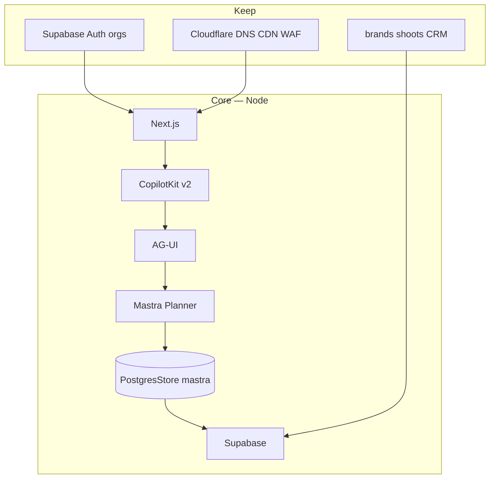

# 09 — New iPix AI build plan

**Date:** 2026-08-23 · **Parent:** PROPOSED IPI-1028 · MASTRA-V2-000  
**After:** [08-custom-code-reduction.md](./08-custom-code-reduction.md)
**Before:** [10-core-mvp-advanced.md](./10-core-mvp-advanced.md)

Keep production iPix live. Build v2 in parallel. Promote only after the golden journey.

---

## Architecture



```text
Next.js → CopilotKit → AG-UI → Mastra → PostgresStore → Supabase
```

Cloudflare Worker is **not** in Core. Optional later: **PROPOSED IPI-1047**.

---

## Golden user journey (blocking)

```text
User A authenticates (Supabase) → server derives org A
→ Production Planner → new thread UUID (locator, not a token)
→ send TEST-<uuid>
→ tokens stream
→ exact row in preview mastra (threadId + resourceId + marker)
→ hard refresh → marker visible
→ restart Node → marker still visible
→ User B same thread URL → 403, no User-A content
```

Like locking a lookbook chat so the producer can close the laptop, reopen, and still see the same shot-list conversation — while another brand cannot open that URL.

---

## CORE

| Source | Feature | Task | Test | Success |
| ------ | ------- | ---- | ---- | ------- |
| integrations/mastra | Starter | IPI-1029 | `pnpm dev` chat | Stream |
| v2/runtime/node + v2/react | Current APIs | IPI-1030 | Import from `/v2` | No Express shim |
| Mastra PostgresStore | Persist | IPI-V2-006 after **005B contract** | SQL + refresh + restart on **preview** | unique TEST-<uuid> |
| iPix auth | Session + org | IPI-1032 | 401/403 | Fail closed |
| iPix Planner | One agent | IPI-1033 | Agent id match | Planner replies |

Nothing else until the unique-marker golden test passes on preview storage.

---

## MVP

| Source | Feature | Task | Test | Success |
| ------ | ------- | ---- | ---- | ------- |
| mastra-pm | Shared state | IPI-1034 | AI updates board | Live fittings |
| canvas/mastra | Cards | IPI-1035 | CRUD via chat | Packet cards |
| generative-ui | GenUI + HITL | IPI-1036 | Approve card | Resume after approve |
| shadcn + agentcn | UI | IPI-1037 | Visual | Native look |
| agent-harness | Memory/tasks | IPI-1038 | Restart | Working memory |
| iPix + state-machine *ideas* | Shoot Wizard | IPI-1039 | Gate 1–3 | Resume |
| iPix + research-canvas *ideas* | Brand Intel | IPI-1040 | Crawl→profile | No JWT in snapshots |

---

## ADVANCED

| Source | Feature | Task |
| ------ | ------- | ---- |
| open-mcp-client | MCP | IPI-1041 |
| template-browser-agent | Browser | IPI-1042 |
| OpenBot | Coworker computer | IPI-1043 |
| multi-agent-canvas UX | Multi-agent | IPI-1044 |
| harness schedules | Cron | IPI-1045 |
| Intelligence compose | Threads drawer | IPI-1046 |
| v2/runtime/cf-workers | Worker | IPI-1047 |

---

## Migration sequence

1. Scaffold from integrations/mastra (worktree).  
2. Schema-contract diff (`@mastra/pg` vs preview DB), then PostgresStore on **preview** `mastra` (`schemaName` + `disableInit`).  
3. Thin auth + org `resourceId`.  
4. Golden unique `TEST-<uuid>`.  
5. Attach Planner tools.  
6. Shared state + GenUI.  
7. Wizard + Brand Intel.  
8. MCP / browser / multi-agent.  
9. Worker only if Node golden still passes on Workers.  
10. Retire old 681-line Copilot route.

**Copy:** prompts, tools, workflows, schema, auth model, UI.  
**Do not copy:** SSE wrappers, `runtime-v2-fetch`, HITL clone mutation, OpenNext PG stubs, `MASTRA_STORAGE_MODE=noop`.
