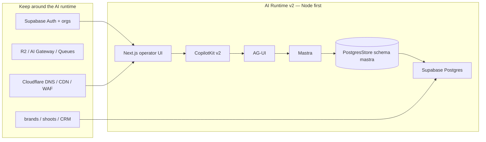

# 10 — Core / MVP / Advanced roadmap

**Date:** 2026-08-23  
**After:** [09-build-plan.md](./09-build-plan.md)
**Before:** [11-product-plan.md](./11-product-plan.md)
**Companion:** [01-current-state-audit.md](./01-current-state-audit.md) · [06-example-adoption.md](./06-example-adoption.md) · [12-task-roadmap.md](./12-task-roadmap.md)

Nothing else migrates until the **Core golden test** passes.

---

## Target architecture (phase 1 = Node)



**Not in Core:** OpenNext Worker as the Copilot host, Hyperdrive in the hot path, CopilotKit Intelligence Threads drawer, MCP, A2A.

Cloudflare **stays** for DNS, CDN, WAF, R2, AI Gateway, Queues. Re-evaluate Workers for the AI runtime **after** the golden journey is green on Node.

---

## Parallel migration (do not delete production)

```text
Current iPix runtime (Vercel + existing Copilot route)
        │
        ├── production stays live
        │
New AI Runtime v2 (preview URL / separate app or `app-v2/`)
        │
        └── golden Planner journey only
```

Then promote proven slices: Planner → Shoot Wizard → Brand Intelligence → other agents → HITL polish → Advanced.

**Copy:** prompts, tools, business workflows, `mastra` schema/data, auth/org model, operator UI, useful domain tests.  
**Do not copy:** SSE wrappers, package overrides, Cloudflare stubs, `runtime-v2-fetch`, `emitInterruptOutcome` clone patch, `MASTRA_STORAGE_MODE=noop`, env fallbacks that hide missing config.

---

## CORE

**Meaning:** smallest foundation that proves “chat lives in Postgres.”

Build only:

1. App from `examples/integrations/mastra`
2. Confirm APIs with `examples/v2/runtime` + `examples/v2/react`
3. Gemini (`@ai-sdk/google`, existing `GEMINI_API_KEY` / Infisical)
4. Mastra in-process
5. `PostgresStore` → **preview** DB; constructor from installed types (`schemaName` + `disableInit: true` in current iPix)
6. Supabase Auth (reuse operator login)
7. **One** agent: Production Planner (prompt+tools can be stubbed to echo until persist works — then attach real tools)
8. One thread, one message
9. Hard refresh restore

### Golden test (blocking)

```text
User A authenticates → server derives org A
→ new thread UUID (locator)
→ send TEST-<uuid>
→ stream completes
→ exact row: threadId + resourceId + marker (preview mastra)
→ hard refresh restores
→ Node restart still restores
→ User B same URL → 403, no User-A content
→ User B new thread works
```

Cross-org: Org B must **not** see Org A’s thread (403). Same rule as [IPI-146](https://linear.app/amo100/issue/IPI-146).

### Core success criteria

- Official Copilot handler: thin (auth included; no line-count AC)
- No Worker-only import shims
- `MASTRA_SCHEMA` required (fail closed); **preview** storage until gold
- Evidence: SQL/API row + screenshot + sanitized network
- Linear: treat as new issue (suggested **IPI-V2-018**) — do not mark production Copilot tickets Done from Core alone

---

## MVP (after Core)

| Feature | Source example | Adaptation | Test | Success |
| ------- | -------------- | ---------- | ---- | ------- |
| Planner tools | iPix `app/src/mastra/tools/*` | Attach to v2 Planner only | Tool once + used in reply | Same as [IPI-591](https://linear.app/amo100/issue/IPI-591) intent |
| Shared state | `canvas/mastra-pm` | Map tasks→shoots/fittings | AI updates board live | Board matches working memory |
| GenUI | `showcases/generative-ui` | Approval / talent cards | Card render + click | Not text-only |
| shadcn | `examples/shadcn` | Match iPix tokens | Visual QA | Chat looks native |
| Working memory | Mastra Memory schema (existing Zod) | Planner thread scope | Restart restores brandName/shootType | SQL + UI |
| HITL approval | GenUI + Mastra suspend | Drop clone hack; prove resume | Suspend → approve → continue | [IPI-1010 · COPILOT-HITL-002](https://linear.app/amo100/issue/IPI-1010) evidence |
| Tenant isolation | Keep iPix org `resourceId` | Verify RLS still not a substitute | Org B 403 | |
| Shoot Wizard | existing workflow | HTTP routes after persist | Snapshot resume | |
| Planner evals | Mastra eval CLI | deliverables → approval → shot list | Fail inverted order | IPI-V2-050 |
| Staging traces | Mastra observability | agent/model/tool/error + thread/request id | Screenshot no secrets | IPI-V2-049 |

---

## ADVANCED (after MVP proven)

| Feature | Reference |
| ------- | --------- |
| MCP tools | `open-mcp-client` + Mastra MCP docs |
| Multi-agent | `multi-agent-canvas` |
| Delegation | `claude-managed-agents` (ideas only) |
| A2A | `a2a-travel` |
| Channels / WhatsApp | CopilotKit channels in Mastra starter (optional) |
| Intelligence / Threads drawer | Official CopilotKit Intelligence client — **wire for real or leave off** |
| Observability | Mastra exporter in **MVP staging** (IPI-V2-049); Sentry sampling later |
| Schedules | **New** one-reminder proof — do not copy current dispatcher rows |
| Signals | Shared shoot thread (Post-MVP, before A2A) |
| Advanced memory | Observational / semantic recall |
| Cloudflare Worker eval | Same golden test on OpenNext + Hyperdrive |
| Queues / background | Cloudflare Queues — not Copilot request path |

---

## Migration order

1. Core greenfield + golden unique marker on preview storage  
2. Point Planner UI at v2 preview  
3. Tools + working memory + GenUI  
4. Shoot Wizard  
5. Brand Intelligence  
6. Remaining agents  
7. HITL proof (or keep gates as tool-level approvals)  
8. Intelligence threads UI  
9. Worker runtime **only if** Node ops cost or latency demands it  
10. Decommission old Copilot route after parity

---

## Production-ready gates

| Gate | Pass when |
| ---- | --------- |
| Core | Golden test + SQL + restart |
| Auth | Unauthed 401; no org 403 |
| Tenant | Cross-org forbidden |
| MVP | Planner tools + one HITL or GenUI approval |
| Advanced | Explicit Linear issues; no drive-by MCP |
| CF runtime | Repeat **entire** golden test on preview Worker — not `wrangler deploy` alone |
| Do not call Done | Because CI is green or a PR merged |

---

## Risks and blockers

| Severity | Problem | Why it matters | Best fix | Phase |
| -------- | ------- | -------------- | -------- | ----- |
| **P0** | `InMemoryAgentRunner` + unwired Intelligence | Refresh looks like the AI forgot the lookbook | Mastra PG + explicit threadId | Core |
| **P0** | Custom 681-line route | Every Copilot upgrade breaks iPix | Official handler | Core |
| **P0** | Package / AG-UI clone semantics | HITL strands ([IPI-1010 · COPILOT-HITL-002](https://linear.app/amo100/issue/IPI-1010)) | Prove official interrupt; don’t copy mutation | MVP |
| **P1** | Worker + Hyperdrive in the same rewrite | Two unproven variables | Node first | Core |
| **P1** | Snapshot bloat (6k+ rows) | Slow/confusing “history” | Retention; don’t migrate all snapshots | MVP |
| **P1** | RLS `USING true` for runtime role | DB is not the tenant wall | Keep app ACL; document | Core |
| **P2** | Secrets / Infisical env drift | Preview missing license/DB URL | Fail closed + required-secret check | Core |
| **P2** | Gemini dual-auth if Bearer forwarded | 400 from Google | Keep small header strip if still needed | Core |
| **P2** | `default` agent alias | Prebuilt UI blank page | Keep alias in registry | Core |

**Biggest blocker:** proving **refresh + process restart** on a **clean Node CopilotKit+Mastra** app — not another Worker compatibility patch on the current route.

---

## Next 5 tasks (recommended)

1. Scaffold v2 from `examples/integrations/mastra` (worktree, not `main`).  
2. Swap demo storage → existing Supabase `PostgresStore` (`mastra` schema).  
3. Wire Supabase Auth + org `resourceId` (copy the **policy**, not the 681-line route).  
4. Run golden persist test (stream + SQL + refresh + restart + Org B 403).  
5. Attach real Production Planner prompt/tools **only after** step 4 is green.
