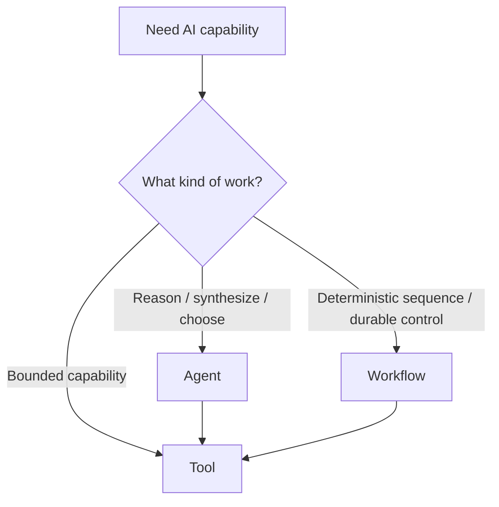
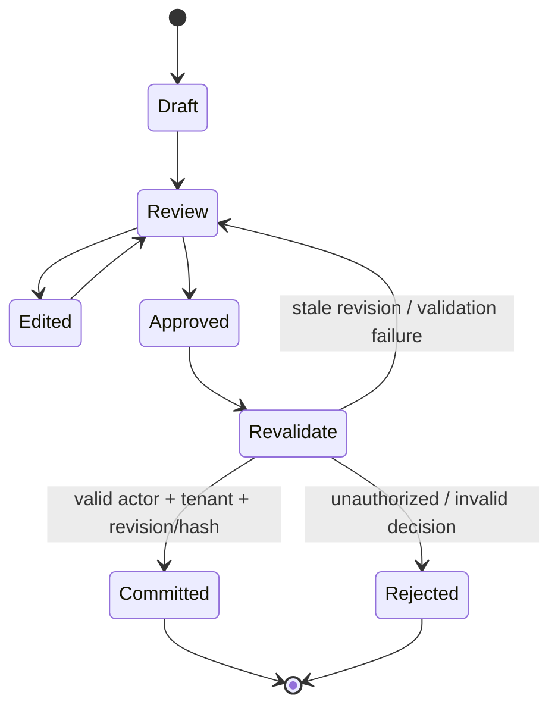
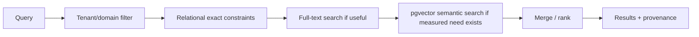
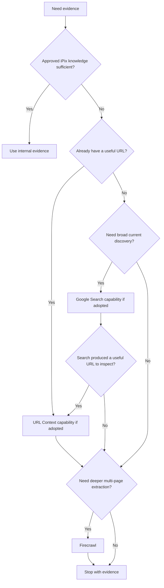

# iPix AI Feature Pattern

**Purpose:** the reusable implementation contract for AI-enabled iPix features. This document defines **how** a feature moves from user intent to an AI proposal, human review, trusted authorization, durable write, and measurable result. Platform ownership stays in [iPix Platform Architecture](./IPIX-PLATFORM-ARCHITECTURE.md).

**Verified baseline:** 2026-09-22 against merged `main` (`8086de52a2579cd7828c64eedb9e6635bb65e853`), installed iPix package versions, the current Planner/Shoot approval implementation, live Supabase read-only checks, official vendor docs/source, and pinned local working models.

## 30-second summary

Use one lifecycle across Brand, Campaign, Shoot, Asset, Commerce, Publishing, and Analytics:

```text
User request
→ trusted user/org context
→ Mastra domain agent
→ typed tools
→ approved iPix knowledge first
→ bounded external research only if needed
→ structured proposal
→ CopilotKit controlled GenUI
→ human review/edit
→ explicit approval
→ trusted server revalidation
→ atomic Supabase write
→ audit/provenance + measurable outcome
```

Core rule: **AI proposes → human reviews/edits → trusted server/database revalidates the exact approved artifact → authorized idempotent action executes → durable result is read back.**

Do not create a new architecture per domain. Prefer **few domain agents + many reusable tools + workflows only where deterministic control matters**.

## 1. Purpose and scope

This pattern answers five questions for every AI-enabled feature:

1. What trusted context reaches the model?
2. Does behavior belong in an Agent, Tool, or Workflow?
3. How are internal knowledge and external evidence selected?
4. Where does human review/approval happen?
5. What trusted boundary commits durable business truth?

It does **not** replace platform ownership, domain schemas, RLS policies, or domain-specific UX. Those remain defined by the shared architecture and domain docs.

## 2. Standard AI feature lifecycle


### Current iPix proof

The strongest current example is the Production Planner → ShootPlan approval path:

- `src/mastra/agents/index.ts` — Production Planner reasons and selects typed tools.
- `src/mastra/workflows/shoot-plan-review.ts` — stages a plan revision, suspends for review, resumes only after durable decision proof.
- `src/lib/auth/runtime-org.ts` — derives trusted organization scope from authenticated membership; client org hints do not create authority.
- `src/lib/shoot/decide-shoot-plan-revision.ts` — calls the bounded approval RPC from trusted application code.
- `public.decide_shoot_plan_revision(...)` — database validates actor, org role, exact revision/hash, current revision, status, expiry, idempotency, and concurrent staging before recording the decision.
- `public.get_shoot_plan_approval_proof(...)` — service-side durable readback recomputes the stored artifact hash before workflow continuation.

This is the model to reuse, not a parallel approval subsystem.

## 3. Trusted context model

A model receives the minimum context needed for the task. Authorization is derived **before** model/tool execution and rechecked at consequential write boundaries.

### Required context classes

| Context | Source | Rule |
| --- | --- | --- |
| User identity | verified Supabase session | Never infer from prompt/model text. |
| Organization | server-side membership resolution | Ignore browser `orgId`/metadata as authority. |
| Role/permissions | durable membership/authorization data | Revalidate before consequential writes. |
| Selected domain object | authorized server/database read | Verify it belongs to trusted tenant scope. |
| Approved knowledge | canonical records or provenance-linked projections | Prefer before external research. |
| Conversation/runtime state | Mastra memory/storage | Useful context, never business authority. |
| Interactive proposal state | CopilotKit/AG-UI | Editable UI state, not canonical truth. |

Current implementation reference: `src/lib/auth/runtime-org.ts` resolves the organization from authenticated membership rows and intentionally does not trust browser-provided tenant hints.

### Context rule

Do not dump whole tables or tenant corpora into prompts. Retrieve the smallest authorized slice that solves the task.

## 4. Agent pattern

Use an **Agent** when the feature needs reasoning, synthesis, or tool choice.

Good examples:

- synthesize a ShootPlan from Campaign + Brand context;
- choose which bounded research/read tools are needed;
- explain tradeoffs or draft recommendations.

Avoid agent sprawl. A provider/API is not an organizational role.



**Current iPix model:** `src/mastra/agents/index.ts` registers the Production Planner agent. Reuse the same architectural shape before introducing another agent.

**Official reference — MODEL / ADAPT**

- URL: https://mastra.ai/docs/agents/overview
- Source: current Mastra Agent APIs; compare with installed `@mastra/core 1.63.2` types.
- Use: Agent for reasoning/orchestration over bounded tools.
- Do not copy: generic example auth, persistence, or domain data assumptions.
- Apply to: `src/mastra/agents/**` and future domain-agent docs.
- Verify: agent has a clear domain responsibility and does not own durable business truth.

## 5. Tool pattern

Use a **Tool** for a small bounded capability with explicit input/output contracts.

Preferred classes:

| Class | Examples | Write authority? |
| --- | --- | --- |
| Read | `getBrandContext()`, `getProducts()` | No |
| Compute | `estimateBudget()`, `validateShootPlan()` | No |
| Research | `searchKnowledge()`, `crawlSite()` | No canonical write |
| Commit/write | `saveApprovedShootPlan()` | Only through trusted server/DB authorization |

Typed tools should validate inputs/outputs and return structured results instead of free-form side effects.

**Official reference — ADAPT**

- URL: https://mastra.ai/docs/agents/using-tools
- Source: https://github.com/mastra-ai/mastra/blob/main/packages/core/src/tools/hitl.md
- Use: typed bounded capabilities and explicit HITL/tool contracts.
- Do not copy: demo-side authorization or unvalidated write behavior.
- Apply to: existing `src/mastra/tools/**` before creating new capabilities.
- Verify: every write-capable tool reaches normal trusted authorization/RPC logic rather than bypassing it.

## 6. Workflow pattern

Use a **Workflow** when deterministic control is materially valuable:

- ordered stages;
- branching/parallelism;
- retries;
- long-running execution;
- suspend/resume;
- mandatory approval;
- durable run state;
- cancellation/recovery.

Do not wrap a trivial one-step tool call in a workflow.

**Current iPix proof:** `src/mastra/workflows/shoot-plan-review.ts` stages an exact revision/hash, suspends, and resumes only after durable decision verification.

**Official reference — ADAPT**

- URL: https://mastra.ai/docs/workflows/overview
- Source: https://github.com/mastra-ai/mastra/blob/main/workflows/README.md
- Use: ordered durable control and suspend/resume.
- Do not copy: example schemas or persistence assumptions without checking installed `@mastra/core 1.63.2` APIs.
- Apply to: `src/mastra/workflows/**` only where control requirements justify orchestration.
- Verify: resumption re-reads durable authority where the action is consequential; resume payload alone is never approval truth.

## 7. Controlled GenUI pattern

CopilotKit/AG-UI owns the interactive AI experience: proposal rendering, editable state, user feedback, and frontend-only actions.

Prefer controlled native iPix React components for consequential review surfaces, for example:

- Brand DNA proposal card;
- ShootPlan editor;
- budget/evidence review;
- source/provenance card;
- explicit approval card.

Frontend tools may update UI state or perform browser-local conveniences. They are **not an authorization boundary** and must not directly grant tenant/business authority.

**CopilotKit shared state — MODEL / ADAPT**

- URL: https://docs.copilotkit.ai/mastra/shared-state
- Source: current installed `@copilotkit/react-core 1.68.1` types + CopilotKit pinned at `5ffe92689c3322ccc90a5137db1c8f1a6ffd79f2`.
- Use: agent/UI collaboration around an editable proposal.
- Do not copy: shared state as durable business truth.
- Apply to: proposal/editing surfaces only.
- Verify: refresh/reconnect cannot silently convert UI state into an approved durable record.

**Controlled state rendering — ADAPT**

- URL: https://docs.copilotkit.ai/mastra/generative-ui/state-rendering
- Source: https://github.com/CopilotKit/CopilotKit/tree/5ffe92689c3322ccc90a5137db1c8f1a6ffd79f2/examples/showcases/generative-ui
- Use: structured React rendering around known proposal schemas.
- Do not copy: unconstrained generated application UI for consequential approvals.
- Apply to: domain-specific iPix review components.
- Verify: rendered controls call trusted application actions/RPCs for durable changes.

**Frontend tools — ADAPT, UI-only**

- URL: https://docs.copilotkit.ai/mastra/frontend-tools
- Source: https://github.com/CopilotKit/CopilotKit/blob/5ffe92689c3322ccc90a5137db1c8f1a6ffd79f2/packages/react-core/src/v2/hooks/use-frontend-tool.tsx
- Use: browser/UI-only capabilities.
- Do not copy: browser tool arguments as trusted tenant/auth data.
- Verify: privileged operations still derive identity/org server-side.

## 8. Human-in-the-loop pattern

Consequential actions require review of the **exact artifact/revision** being approved.



### Required approval sequence

1. AI creates a structured proposal.
2. Trusted application code stages a durable revision/hash if the workflow requires approval.
3. CopilotKit/native UI renders the exact proposal.
4. Human reviews/edits and explicitly decides.
5. Server/database derives current actor and tenant authority again.
6. Database validates the exact revision/hash and concurrency/idempotency state.
7. Authorized decision/action is committed atomically.
8. Workflow/server reads back durable result before continuation.

### Current live Supabase proof

Read-only verification for IPI-1300 against baseline `main` commit `8086de52a2579cd7828c64eedb9e6635bb65e853` on 2026-09-22 confirms `public.decide_shoot_plan_revision(uuid,integer,text,text,text,text)` is `SECURITY DEFINER`, has `search_path=''`, grants execute to `authenticated`, checks `auth.uid()`, requires editor-or-owner authority through `public.is_org_editor_or_above`, validates exact `revision` + `plan_hash`, rejects superseded revisions, uses transaction-scoped advisory locking, and protects replays with actor-bound idempotency/request hashes.

`public.get_shoot_plan_approval_proof(uuid)` is service-only and recomputes the stored plan hash before the workflow trusts the decision.

**CopilotKit HITL — MODEL / ADAPT**

- URL: https://docs.copilotkit.ai/mastra/human-in-the-loop/index
- URL: https://docs.copilotkit.ai/mastra/human-in-the-loop/interrupt-flow
- Source: https://github.com/CopilotKit/CopilotKit/blob/5ffe92689c3322ccc90a5137db1c8f1a6ffd79f2/packages/react-core/src/v2/hooks/use-human-in-the-loop.tsx
- Use: operator interaction/approval rendering and interrupt UX.
- Do not copy: UI decision payload as final durable authority.
- Apply to: exact-artifact review UI; current ShootPlan flow remains the server/database authority model.
- Verify: stale revision, unauthorized actor, duplicate decision, and replay cases are negative-tested.

## 9. Knowledge retrieval pattern

Use the smallest retrieval mechanism that solves the corpus.



Rules:

1. Apply tenant/domain constraints before returning knowledge to the agent.
2. Prefer exact SQL for small curated datasets.
3. Add Postgres FTS when keyword/text retrieval materially improves recall.
4. Add pgvector only when semantic similarity improves a measured journey.
5. Preserve source IDs, versions/timestamps where relevant, and provenance back to canonical records.
6. Never treat an embedding/chunk/vector hit as canonical business truth.
7. Do not add a second vector service until Postgres-native retrieval fails a measured requirement.

**Official references — REFERENCE / ADAPT**

- RLS: https://supabase.com/docs/guides/database/postgres/row-level-security
- Functions: https://supabase.com/docs/guides/database/functions
- Full-text search: https://supabase.com/docs/guides/database/full-text-search
- Semantic search: https://supabase.com/docs/guides/ai/semantic-search
- Hybrid search: https://supabase.com/docs/guides/ai/hybrid-search
- pgvector: https://github.com/pgvector/pgvector
- Use: Postgres-native tenant-safe retrieval before adding infrastructure.
- Do not copy: service-role access into browser/model code or vector indexing without corpus/latency evidence.
- Verify: cross-tenant negative tests and provenance/readback tests for any retrieval path.

## 10. Bounded external research

Current iPix already uses Firecrawl through Supabase Edge Functions. Gemini Google Search and URL Context are useful official future capabilities, but they are **not current iPix runtime dependencies** and remain reference/later until deliberately adopted.



Research output is evidence/draft material. It cannot silently overwrite approved Brand DNA, Campaign state, ShootPlan approvals, publication state, or other canonical records.

**Firecrawl — KEEP / REFERENCE**

- Docs: https://docs.firecrawl.dev/
- Repo: https://github.com/mendableai/firecrawl
- Current iPix: `supabase/functions/_shared/firecrawl.ts`, `start-brand-crawl`, `firecrawl-webhook`.
- Use: bounded deep/multi-page crawl with timeout, webhook verification, durable result handling, and idempotent processing.
- Do not copy: direct unverified webhook writes or unbounded crawling.
- Verify: signature failures, duplicate deliveries, timeout/retry, and tenant ownership paths.

**Gemini Search — REFERENCE / LATER**

- URL: https://ai.google.dev/gemini-api/docs/google-search
- Use if adopted: broad current-web discovery with citations.
- Do not copy: assume it is already installed/configured in iPix.
- Verify before adoption: provider package/version, auth, cost/rate limits, citation behavior, data handling, tests.

**Gemini URL Context — REFERENCE / LATER**

- URL: https://ai.google.dev/gemini-api/docs/url-context
- Use if adopted: understanding already-known URLs, optionally after Search.
- Do not copy: treat URL content as trusted business truth.
- Verify before adoption: same provider/security/citation constraints as above.

## 11. Trusted write pattern

Every consequential AI-assisted write follows this sequence:

```text
AI proposal
→ explicit human approval where required
→ server derives authenticated actor + org/role
→ server/database validates exact approved revision/input
→ authorized transaction/RPC executes idempotently
→ canonical record is committed
→ durable result is read back
→ audit/provenance is retained
```

### Security rules

- Browser `orgId`, thread ID, model output, user metadata, or tool arguments are never sufficient authorization.
- Service-role credentials never enter browser/model context.
- Prefer `SECURITY INVOKER`; use `SECURITY DEFINER` only for a deliberate privileged boundary with locked `search_path`, minimal execute grants, explicit actor/tenant validation, and regression tests.
- Validate stale revision/concurrency and idempotency separately from authentication.
- Publishing, payment, deletion, and other consequential actions remain approval-gated unless a domain explicitly proves a safer bounded policy.

## 12. Observability and audit

Capture the minimum signals needed to explain AI behavior and measure product value:

| Layer | Capture | Owner |
| --- | --- | --- |
| AI runtime | agent/run, model, tool calls, workflow steps, latency, errors | Mastra observability |
| Application | API/UI failures, operational diagnostics | app/Sentry/logging layer |
| Domain audit | who approved/changed/published what exact artifact | Supabase/Postgres domain truth |
| Outcome | completion rate, time saved, approval/rework rate, quality signal | domain analytics |

Do not log secrets, raw credentials, or unnecessary sensitive prompt/context data. Do not duplicate domain audit state into generic AI trace tables.

**Working model — ADAPT**

- Repo: https://github.com/hamchowderr/mastra-base
- Pinned local commit: `a065cea10599d8674b8b4b51e54fd281d92e3f68`
- Source: `src/mastra/lib/processors.ts`, `src/mastra/scorers/_example.scorers.ts`, `scripts/eval.ts`, `.github/workflows/ci.yml`, `src/lib/env.ts`.
- Use: observability filtering, eval/scorer organization, deterministic test gates, environment validation concepts.
- Do not copy: A2A/MCP/DuckDB/domain/auth choices wholesale.
- Apply to: future iPix eval/observability tasks, not as proof those capabilities already exist.

## 13. Testing ladder

Use the cheapest decisive proof first:

```text
static/type inspection
→ pure tool/unit tests
→ deterministic model/AG-UI tests where useful
→ Supabase/RLS/RPC integration proof
→ CopilotKit/Mastra integration proof
→ Playwright user journey
→ preview/live runtime certification
→ post-merge exact-main readback
```

Required negative cases for consequential features:

- Org B cannot inspect/act on Org A artifacts.
- viewer/insufficient role cannot approve/write.
- stale revision/hash cannot commit.
- duplicate idempotency key does not double-apply.
- same key from a different actor is not replayed as someone else's result.
- concurrent stage/decision cannot approve a superseded artifact.
- resume payload alone cannot bypass durable approval state.
- refresh/reconnect preserves correct durable state.

**AIMock — ADAPT**

- Repo: https://github.com/CopilotKit/aimock
- Pinned local commit: `a8773ddd6bdc9c9361c2b32bd16a5288cf5a8536`
- Use: deterministic model/AG-UI/tool/failure tests before expensive live-model testing.
- Do not copy: deterministic mocks as a replacement for final real-runtime certification.
- Verify: test captures the same structured events/contracts used by installed CopilotKit/AG-UI versions.

## 14. Campaign → Shoot reference implementation

```mermaid
flowchart LR
    C[Campaign] --> P[Production Planner]
    P --> K[Approved Brand / Product knowledge]
    K --> R[Optional bounded research]
    R --> S[ShootPlan proposal]
    S --> G[Editable controlled GenUI]
    G --> H[Operator review / approval]
    H --> V[Server + DB exact-revision validation]
    V --> DB[Atomic Supabase decision/save]
    DB --> W[Shoot workspace / durable readback]
```



### Concrete implementation mapping

| Journey step | Current / target iPix owner | Evidence / destination |
| --- | --- | --- |
| Campaign/brand context | Supabase + trusted server reads | existing domain tables/auth helpers |
| Reasoning | Production Planner agent | `src/mastra/agents/index.ts` |
| Bounded capabilities | Mastra typed tools | `src/mastra/tools/**` |
| Approval orchestration | Mastra workflow | `src/mastra/workflows/shoot-plan-review.ts` |
| Proposal/review UI | CopilotKit/native controlled React | domain review surface; frontend not authority |
| Staged exact artifact | Supabase/Postgres | `shoot.shoot_plan_approvals` |
| Decision | authenticated RPC | `public.decide_shoot_plan_revision(...)` |
| Resume proof | service-side durable readback | `public.get_shoot_plan_approval_proof(...)` |
| Canonical downstream state | Supabase/Postgres | Shoot/domain tables, not Mastra memory |

## 15. Feature adoption checklist

Every AI-enabled domain feature must declare:

- [ ] **Experience owner** — screen/component/CopilotKit surface.
- [ ] **Intelligence owner** — Agent and its responsibility.
- [ ] **Durable truth owner** — canonical Supabase/Postgres records.
- [ ] **Tenant boundary** — how authenticated user/org/role are derived and enforced.
- [ ] **Knowledge sources** — exact internal sources and provenance.
- [ ] **Agent / Tool / Workflow choice** — why each primitive is needed.
- [ ] **External research requirement** — provider, bounds, citations/provenance, stop condition.
- [ ] **GenUI surface** — controlled component/state contract.
- [ ] **Approval point** — exact artifact/revision being approved.
- [ ] **Trusted write boundary** — server/RPC/transaction and authorization checks.
- [ ] **Audit/provenance** — durable actor/artifact/result evidence.
- [ ] **Failure paths** — stale, unauthorized, duplicate, timeout, retry, cancellation/recovery.
- [ ] **Observability** — runtime diagnostics + business outcome signals.
- [ ] **Tests** — unit, RLS/RPC, integration, browser, preview/live as applicable.
- [ ] **Measurable user/business outcome** — time saved, completion, quality, rework, conversion, etc.

If these cannot be answered, the feature is not Ready for implementation.

## 16. Core / MVP / Later

### Core foundation

- reliable authenticated runtime;
- trusted user/org context;
- reusable typed tools;
- Supabase/Postgres durable truth;
- tenant isolation;
- observability/error evidence;
- approval/write contract for consequential changes.

### Core MVP

- Campaign → Shoot planning journey;
- controlled GenUI proposal/review;
- explicit approval;
- exact-revision durable save;
- internal knowledge retrieval;
- bounded research only where required;
- browser + RLS/RPC certification.

### Later / advanced

- multi-agent orchestration;
- MCP Apps;
- Tool Search;
- browser agents;
- generic workflow builder;
- additional vector database;
- automated consequential publishing/writes.

Only promote Later items when a measured product/runtime need justifies them.

## 17. Proven reference mapping

| Source | Pin/version | Classification | Exact source/pattern | Use in iPix | Do not copy | Verification |
| --- | --- | --- | --- | --- | --- | --- |
| Current iPix | merged `main` `8086de52…` | **KEEP** | Planner agent, trusted org, ShootPlan workflow/RPC | Baseline lifecycle/security | Do not replace working contracts | Code + live DB + tests |
| CopilotKit | iPix `1.68.1`; local ref `5ffe92689c3322ccc90a5137db1c8f1a6ffd79f2` | **ADAPT** | v2 frontend tool/HITL hooks; Mastra examples | Controlled GenUI/HITL concepts | Deprecated v1/browser auth | Installed types + official source |
| AIMock | `a8773ddd6bdc9c9361c2b32bd16a5288cf5a8536` | **ADAPT** | deterministic AG-UI/model testing | Cheap deterministic gates | Final live proof replacement | Contract/event compatibility |
| `mastra-base` | `a065cea10599d8674b8b4b51e54fd281d92e3f68` | **MODEL / ADAPT** | memory, processors, AIMock, scorers, eval CI | Testing/eval/observability structure | A2A/MCP/DuckDB/domain/auth wholesale | Compare with iPix Mastra `1.63.2` |
| `mastra-supabase-starter` | `7d33a505055f42530493cb5f3e047b5df6ba3d95` | **ADAPT** | auth→resource mapping, PostgresStore, PgVector, integration tests | Tenant-safe context/retrieval concepts | “all authenticated users allowed” | Keep iPix org/role model |
| `saas-starter-ai` | `d492f6eb2995f6c5365ff4027acdc55b3f2a84a2`; Mastra core `0.20.0` | **REFERENCE ONLY** | Next/Supabase/chat product shell | UI/product ideas | Old Mastra APIs/service shortcuts | Never API authority |

## 18. Anti-patterns / stop conditions

Stop or re-scope if a feature proposes:

- business truth in Mastra memory or CopilotKit shared state;
- browser/client tenant IDs as authorization;
- direct model access to service-role credentials;
- autonomous consequential publishing/payment/deletion/approval;
- one agent per provider/tool;
- workflows for trivial one-step logic;
- vector search for small curated data without evidence;
- a second vector DB without measured Postgres limitations;
- unbounded research without evidence/provenance capture;
- old starter APIs copied into current iPix without installed-version proof;
- UI approval that is not bound to the exact persisted revision/hash;
- resume payload treated as durable approval truth.

## 19. Definition of Done for an AI feature

A feature is Done only when the **real user journey** proves:

1. authorized context is correct;
2. model/tool behavior is bounded;
3. proposal is reviewable;
4. approval binds to the exact artifact when required;
5. trusted write succeeds atomically/idempotently;
6. unauthorized/stale/duplicate/concurrent failure paths are rejected;
7. durable state is read back correctly;
8. observability and business outcome evidence exist.

File exists ≠ Done. A demo response from a model ≠ Done. A green unit test alone ≠ Done.

## 20. Related docs

- [iPix Platform Architecture](./IPIX-PLATFORM-ARCHITECTURE.md)
- [Documentation Standards](./DOC-STANDARDS.md)
- [CopilotKit](../01-copilotkit/README.md)
- [Mastra](../02-mastra/README.md)
- [Architecture Decisions](../architecture-decisions/README.md)
- [Reference Index](../reference-index.md)

## 21. Next actions

1. Make domain docs reference this lifecycle instead of duplicating cross-cutting AI/auth/write rules.
2. Apply it first to the Campaign → Shoot documentation and implementation tasks.
3. Add new research/model/vector infrastructure only after current iPix evidence shows the existing stack cannot meet a measured requirement.
