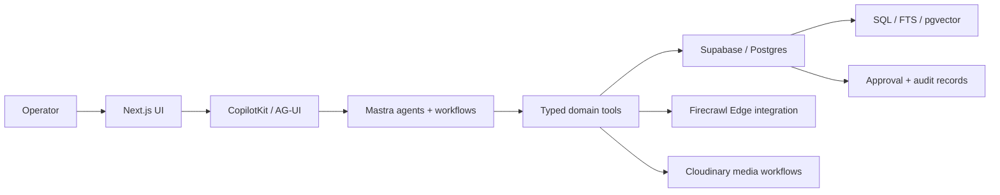
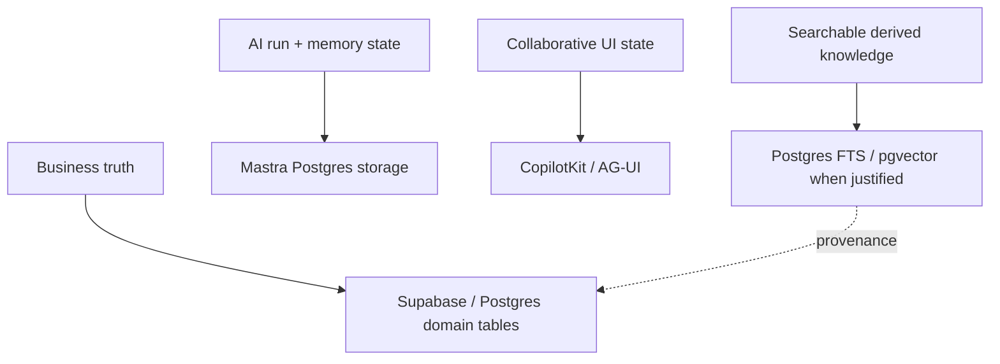
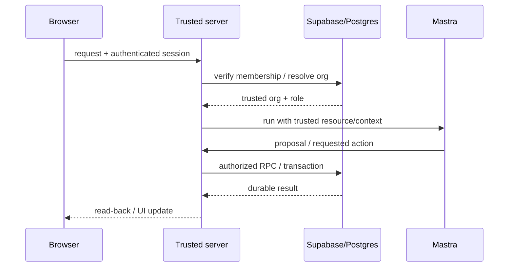
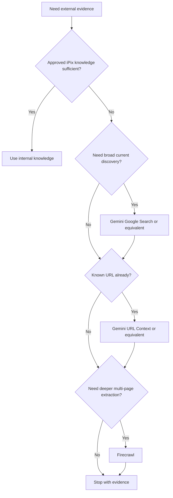

# iPix Platform Architecture

**Purpose:** the shared cross-domain architecture source of truth for iPix. Domain docs should link here for ownership, state, tenancy, AI runtime, search/retrieval, external research, media, and approval rules instead of redefining them.

**Verified baseline:** 2026-09-22 against the current iPix worktree, installed package versions, live Supabase read-only checks, official vendor docs, and pinned local reference repositories.

## 30-second summary

- **Next.js + CopilotKit/AG-UI** own the operator experience and interactive AI surface.
- **Mastra** owns agents, typed tools, workflows, runtime memory, suspend/resume, and AI execution orchestration.
- **Supabase/Postgres** owns durable application truth, tenant authorization, RLS, transactional writes, approval records, audit/provenance, and Postgres-native search capabilities.
- **Cloudinary** owns image/video media processing and provider identity; iPix stores governed metadata/relationships in Postgres.
- **Firecrawl** is already used for bounded site crawling through Supabase Edge Functions. Gemini Google Search / URL Context are useful future research capabilities, but they are **not current iPix runtime dependencies** and must not be described as already implemented.
- **Humans decide. AI assists.** Consequential writes require explicit review/approval and trusted server/database revalidation of the exact artifact or revision.

## 1. Goal and scope

This document answers four questions for every iPix product area:

1. Which system owns each responsibility?
2. Which state is canonical versus runtime/UI/search state?
3. Where are identity, tenant, approval, and write boundaries enforced?
4. What existing implementation or proven reference should be reused before custom work?

It does **not** define domain schemas, redesign the current runtime, or authorize new infrastructure by itself.

## 2. Current verified stack

| Layer | Current implementation | Verified owner / role | Evidence |
| --- | --- | --- | --- |
| Web application | Next.js `16.3.5`, React `19.2.1` | Routes, server actions, operator workspace | `package.json` |
| AI interaction | CopilotKit `1.68.1`, AG-UI/Mastra bridge | Chat, UI tools, rendered AI state, runtime endpoint | `src/app/api/copilotkit/[[...slug]]/route.ts` |
| AI orchestration | Mastra core `1.63.2` | Agents, tools, workflows, memory, run lifecycle | `src/mastra/**` |
| AI runtime persistence | `@mastra/pg 1.22.2`, `@mastra/memory 1.28.1` | Mastra threads/messages/workflow state only | `src/mastra/pg-store.ts`; live `mastra` schema |
| Durable business truth | Supabase/Postgres, `@supabase/supabase-js 2.112.4` | Org, Brand, Campaign, Shoot, CRM, approval/audit truth | migrations + RLS/RPC tests |
| Search primitives | Postgres SQL/FTS + installed `vector` extension | Tenant-filtered exact/text/semantic retrieval when justified | live extension check; Supabase docs |
| Media | Cloudinary Node SDK `^2.11.0` | Image/video upload, delivery, provider media identity | `src/lib/cloudinary/**` |
| Web crawling | Firecrawl HTTP API through Edge Functions | Deep/multi-page brand crawl/extraction | `supabase/functions/_shared/firecrawl.ts` |
| Current default planner model | `openai("gpt-5.6-luna")` | Production Planner reasoning/tool selection | `src/mastra/agents/index.ts` |

### Current runtime topology

The current Next.js Copilot route creates local Mastra agents and exposes them through `CopilotRuntime`. iPix currently supports a local custom runner path and a CopilotKit Intelligence path. A separate remote Mastra service is **not yet the canonical production runtime**; cross-instance run ownership/recovery is being proven separately and must not be presented here as completed architecture.

## 3. System boundaries



### Ownership rules

| Concern | Owner | Rule |
| --- | --- | --- |
| Operator UI / AI interaction | Next.js + CopilotKit | UI state is not durable business authority. |
| Agent reasoning | Mastra Agent | Few domain agents; do not create an agent per capability. |
| Bounded capability | Mastra Tool / trusted server helper | Typed input/output; read/compute/research/write classification. |
| Deterministic long-running control | Mastra Workflow | Use for ordered stages, retries, suspend/resume, approval, durable run state. |
| Durable business record | Supabase/Postgres | Canonical truth lives in domain tables/RPCs. |
| Tenant authorization | Server-derived membership + RLS/RPC checks | Never trust browser `orgId` or user metadata as authority. |
| Media binary/provider identity | Cloudinary | Postgres stores governed links, status, metadata, ownership. |
| AI runtime memory | Mastra storage | Conversation/runtime state only; never substitute for business truth. |

## 4. Durable truth vs runtime/shared/search state



The dotted arrow means **provenance back to canonical records**, not a vector index writing business truth.

### State classification

- **Canonical:** organizations, memberships, brands, campaigns, shoots, products, bookings, assets, approvals, publication/payment state, domain analytics records.
- **Runtime:** Mastra threads, messages, workflow snapshots, temporary working memory, run state.
- **Interactive:** CopilotKit/AG-UI mirrored state used to render/edit a proposal in the UI.
- **Derived/searchable:** embeddings, full-text indexes, summaries, research evidence, approved knowledge projections. These must retain source/provenance and never outrank the canonical record.

## 5. Tenant and security boundary

Current iPix code derives organization scope from server-verified membership rows. `src/lib/auth/runtime-org.ts` explicitly ignores client org hints and user metadata. Copilot thread access is additionally guarded by server hooks and thread ownership checks.



Security rules:

1. Browser-provided `org_id`, `brand_id`, user metadata, or tool arguments do not create authorization.
2. RLS is necessary but not the only boundary; sensitive RPCs and server tools must perform explicit authorization where their privilege model requires it.
3. `SECURITY DEFINER` functions must use a locked `search_path`, explicit grants, and server-side validation. Supabase recommends `SECURITY INVOKER` by default; definer is exceptional.
4. Service-role authority is server-only and must never be exposed to browser or model context.
5. Consequential actions require an explicit human decision on the exact artifact/revision/hash when the workflow is approval-gated.

### Verified example: ShootPlan approval

`shoot.shoot_plan_approvals` stores immutable revisions and database-computed hashes. The browser carries only a bounded locator. The database revalidates current revision, hash, org membership, status, idempotency, and concurrency before recording a decision. Mastra then resumes from durable decision state instead of trusting resume payload alone.

## 6. Mastra architecture

Current iPix registers one Production Planner agent and domain workflows in `src/mastra/runtime.ts`.

**Preferred rule:** **few domain agents + many reusable typed tools + workflows only where control matters.**

| Primitive | Use when | iPix example |
| --- | --- | --- |
| Agent | Reasoning, synthesis, tool selection | Production Planner |
| Tool | Bounded read/compute/research/write capability | `composeShootPlan`, planning tools, Brand Intelligence tools |
| Workflow | Ordered/durable control, suspend/resume, retries, approval | `brand-intelligence`, `shoot-plan-review` |
| Memory | Conversation continuity / working state | resource-scoped Planner working memory |

Mastra runtime persistence stays logically separate from domain truth even when both use the same Supabase Postgres project.

## 7. Knowledge and retrieval architecture

Use the smallest retrieval method that solves the corpus:


Rules:

- Apply tenant/domain constraints before returning knowledge to an agent.
- Prefer exact SQL for small/curated tables. Current `shot_type_references_view` is the public, RLS-safe read surface over the curated `shoot.shot_type_references` catalog (`src/lib/shoot/shot-type-references.ts`); it deliberately uses no pgvector because the catalog is small and curated.
- Add FTS when keyword/text matching improves recall.
- Add pgvector only when semantic retrieval is measured to improve the journey; the live project already has the `vector` extension available.
- Derived chunks/embeddings must carry source identifiers, timestamps/version where relevant, and enough provenance to trace back to canonical records.
- Do not add a second vector database unless Postgres-native retrieval fails a measured requirement.

## 8. External research architecture

Current iPix already uses Firecrawl for brand crawl/scrape through Supabase Edge Functions. It uses direct HTTP calls, webhook signature verification, retry/idempotency claims, and durable crawl/result rows.

Future research capabilities should follow this bounded order:



**Important current-state distinction:** Google Search grounding and URL Context are official Gemini capabilities, but iPix does not currently declare the Gemini SDK/provider packages inspected in `package.json`. They are reference options, not current production capabilities.

Research results are evidence/drafts. They cannot silently overwrite approved Brand DNA or other canonical records.

## 9. Media architecture

Cloudinary owns the image/video provider workflow; iPix owns tenant authorization, domain relationships, approval/status metadata, and audit records in Postgres.

Current server code signs uploads, normalizes/verifies webhooks, resolves authorized previews, and persists provider events through trusted server/RPC paths. Cloudinary context includes durable iPix identifiers such as `org_id`, `brand_id`, and asset identity, but those provider metadata fields are not accepted as standalone authorization.

## 10. Observability and audit

Use three distinct layers instead of one giant logging system:

| Layer | Purpose |
| --- | --- |
| Mastra runtime traces/evals | Model calls, tool calls, workflow steps, AI behavior quality |
| Application logs / error monitoring | API/UI/runtime failures and operational diagnostics |
| Domain audit/provenance | Who approved/changed/published what exact business artifact |

Do not invent domain audit tables merely to duplicate Mastra traces, and do not rely on Mastra traces as durable approval or business audit truth.

Current `mastra-base` reference demonstrates Mastra-native observability, sensitive-data filtering, eval datasets/scorers, and AIMock. These are **adaptation references**, not proof they are already fully configured in iPix.

## 11. Deployment and runtime constraints

- The current web/runtime integration is Next.js + CopilotKit with local Mastra agents in the app process.
- When the current in-process Mastra runtime is deployed in a hosted environment, its **persistence connection** uses a dedicated Postgres runtime role and guarded configuration in `src/mastra/pg-store.ts`; `IPIX_MASTRA_HOSTED` validates that database connection. This does **not** mean iPix currently runs a separate remote Mastra service.
- The live project currently has separate `mastra`, `planner`, `shoot`, and `public` schemas; read-only verification on **2026-09-22** found 34, 12, 10, and 85 tables respectively using a `pg_tables` count grouped by `schemaname` for those four schemas.
- RLS is enabled on verified `mastra.mastra_threads`, `mastra.mastra_messages`, `mastra.mastra_workflow_snapshot`, and `shoot.shoot_plan_approvals`.
- Remote/cross-instance run ownership is not declared solved here. That work remains behind separate runtime qualification tasks.

## 12. Proven reuse matrix

| Source | Pinned/version evidence | Exact pattern inspected | Action | iPix adaptation | Do not copy |
| --- | --- | --- | --- | --- | --- |
| Current iPix | CopilotKit `1.68.1`, Mastra `1.63.2` | Copilot route, auth hooks, runtime, pg-store, workflows, approval RPCs | **KEEP** | Make this the baseline | Do not replace working contracts from generic starters |
| CopilotKit monorepo | local HEAD `5ffe92689c3322ccc90a5137db1c8f1a6ffd79f2` | `packages/react-core/src/v2/hooks/use-frontend-tool.tsx`, `use-human-in-the-loop.tsx`, `examples/canvas/mastra/**` | **ADAPT** | Controlled UI tools/HITL/shared state concepts | Do not copy deprecated v1 APIs or treat browser tools as authorization |
| CopilotKit AIMock | local HEAD `a8773ddd6bdc9c9361c2b32bd16a5288cf5a8536` | deterministic model/AG-UI testing patterns | **ADAPT** | Use where it can replace expensive live-model tests | Do not replace final real-runtime certification |
| `mastra-base` | HEAD `a065cea10599d8674b8b4b51e54fd281d92e3f68`, core `^1.36.0` | `src/mastra/index.ts`, agent, memory, AIMock, processors, scorers, eval script | **MODEL / ADAPT** | Structure, evals, deterministic mocks, observability concepts | Do not copy A2A/MCP/DuckDB/auth wholesale |
| `mastra-supabase-starter` | HEAD `7d33a505055f42530493cb5f3e047b5df6ba3d95`, core `1.54.0` | Supabase auth mapping, PostgresStore, PgVector, ingestion/search tool | **ADAPT** | Trusted runtime identity, same-Postgres vector/search, idempotent ingestion | Do not copy “all authenticated users allowed” as tenant authorization |
| `saas-starter-ai` | HEAD `d492f6eb2995f6c5365ff4027acdc55b3f2a84a2`, core `0.20.0` | Next/Supabase server client, simple agent/product shell | **REFERENCE ONLY** | UI/SaaS product-shell ideas | Old Mastra APIs, generic admin/service-role shortcuts |
| Official Supabase docs | current | RLS, functions, FTS, semantic/hybrid search | **REFERENCE / ADAPT** | Security and Postgres-native retrieval rules | Do not assume RLS policies cancel broad grants |
| pgvector | current repo | vector extension / index patterns | **REFERENCE** | Semantic retrieval only where justified | Do not add semantic search to small curated data by default |
| Firecrawl | current docs/repo | crawl/scrape/webhook model | **KEEP / REFERENCE** | Existing Edge Function integration | Do not bypass webhook verification/idempotency |
| Gemini Search / URL Context | current Google AI docs | `google_search`, `url_context`, citations | **REFERENCE / LATER** | Future bounded research tools if adopted | Do not describe as current iPix runtime capability |

## 13. Reference-by-reference implementation instructions

Every implementation task that uses an external reference must record: **URL → exact file/example → COPY/ADAPT/MODEL/REFERENCE → destination → verification**.

### CopilotKit / AG-UI

1. **Shared state:** https://docs.copilotkit.ai/mastra/shared-state
   **Use:** model editable agent/UI collaboration.
   **Inspect:** installed `@copilotkit/react-core` types plus current Mastra canvas example.
   **Adapt to:** Brand/Shoot proposal state only.
   **Do not copy:** shared state as durable business truth.

2. **State rendering:** https://docs.copilotkit.ai/mastra/generative-ui/state-rendering
   **Use:** controlled React components for structured proposals.
   **Adapt to:** Brand DNA, ShootPlan, evidence and approval cards.
   **Verify:** rendered component state cannot commit durable records without the trusted write path.

3. **Frontend tools:** https://docs.copilotkit.ai/mastra/frontend-tools
   **Official source:** https://github.com/CopilotKit/CopilotKit/blob/main/packages/react-core/src/v2/hooks/use-frontend-tool.tsx
   **Use:** browser/UI-only actions.
   **Do not copy:** any browser handler as tenant authorization or privileged write boundary.

4. **HITL:** https://docs.copilotkit.ai/mastra/human-in-the-loop/index
   **Official source:** https://github.com/CopilotKit/CopilotKit/blob/main/packages/react-core/src/v2/hooks/use-human-in-the-loop.tsx
   **Use:** render operator interaction/approval UI.
   **Adapt to:** exact-revision server-side approval flow; CopilotKit collects intent, database remains authority.

5. **Mastra canvas example:** https://github.com/CopilotKit/CopilotKit/tree/main/examples/canvas/mastra
   **Use:** model shared-state + editable canvas structure.
   **Adapt only after:** comparing its package versions/API shape with iPix `1.68.1` installed source.

6. **Generative UI examples:** https://github.com/CopilotKit/CopilotKit/tree/main/examples/showcases/generative-ui
   **Use:** choose controlled rendering patterns first.
   **Do not copy:** open-ended generated application UI onto consequential approval surfaces.

7. **AIMock:** https://github.com/CopilotKit/aimock
   **Use:** deterministic AG-UI/model/tool/failure testing.
   **Adapt to:** unit/integration gates before real-model preview tests.

### Mastra

1. **Agents:** https://mastra.ai/docs/agents/overview
   **Use:** one domain agent when reasoning/tool choice is needed.
   **Current iPix model:** `src/mastra/agents/index.ts`.

2. **Tools:** https://mastra.ai/docs/agents/using-tools
   **Official source pattern:** https://github.com/mastra-ai/mastra/blob/main/packages/core/src/tools/hitl.md
   **Use:** typed bounded capabilities with Zod schemas.
   **Adapt to:** existing `src/mastra/tools/**`; do not create agents for simple capabilities.

3. **Workflows:** https://mastra.ai/docs/workflows/overview
   **Official source:** https://github.com/mastra-ai/mastra/blob/main/workflows/README.md
   **Use:** ordered control, retries, suspend/resume, durable approval.
   **Current iPix models:** `src/mastra/workflows/brand-intelligence.ts`, `shoot-plan-review.ts`.

4. **Memory:** https://mastra.ai/docs/memory/overview
   **Official source:** https://github.com/mastra-ai/mastra/blob/main/packages/memory/README.md
   **Use:** runtime conversation/working memory only.
   **Do not copy:** memory as Brand/Shoot/CRM business truth.

5. **Storage:** https://mastra.ai/docs/storage
   **Postgres:** https://mastra.ai/integrations/databases/postgresql
   **Use:** understand what Mastra persists before creating custom runtime tables.
   **Current iPix destination:** `src/mastra/pg-store.ts` and `mastra` schema.

6. **CopilotKit integration:** https://mastra.ai/integrations/agentic-ui/copilotkit
   **Use:** verify server-side Mastra/AG-UI integration behavior alongside CopilotKit docs.
   **Do not copy:** example auth/tenant assumptions.

7. **Source repository:** https://github.com/mastra-ai/mastra
   **Use:** resolve version-sensitive behavior after installed iPix source/types; upstream `main` is reference, not installed behavior proof.

### Supabase / Postgres retrieval

1. **RLS:** https://supabase.com/docs/guides/database/postgres/row-level-security
   **Use:** exposed-table tenant policies plus grants review.
   **Verify:** Org A/Org B negative tests for tenant-sensitive features.

2. **Functions:** https://supabase.com/docs/guides/database/functions
   **Use:** default `SECURITY INVOKER`; if definer is required, lock `search_path`, schema-qualify, revoke/regrant execute, and validate actor/tenant inside the function.

3. **Full-text search:** https://supabase.com/docs/guides/database/full-text-search
   **Use:** keyword search before adding a separate search service.

4. **Semantic search:** https://supabase.com/docs/guides/ai/semantic-search
   **Use:** Postgres-native embeddings only after a semantic-retrieval need is measured.

5. **Hybrid search:** https://supabase.com/docs/guides/ai/hybrid-search
   **Use:** combine FTS + vector only when both materially improve recall/precision.

6. **pgvector:** https://github.com/pgvector/pgvector
   **Use:** exact vector search first; add HNSW/IVFFlat only when corpus/latency measurements justify indexing.

### External research

1. **Firecrawl docs:** https://docs.firecrawl.dev/
   **GitHub:** https://github.com/mendableai/firecrawl
   **Current iPix implementation:** `supabase/functions/_shared/firecrawl.ts`, `start-brand-crawl`, `firecrawl-webhook`.
   **Use:** deep/multi-page crawl/extraction with verified webhook + idempotent processing.

2. **Gemini Google Search:** https://ai.google.dev/gemini-api/docs/google-search
   **Use:** future broad current-web discovery with citations.
   **Status:** reference only until an approved iPix provider package/tool exists.

3. **Gemini URL Context:** https://ai.google.dev/gemini-api/docs/url-context
   **Use:** future analysis of already-known URLs; can be combined with Search.
   **Status:** reference only until implemented and tested in iPix.

## 14. Anti-patterns

Do not introduce:

- business truth in Mastra memory or CopilotKit shared state;
- browser/client `orgId` as authorization;
- direct model access to service-role credentials;
- autonomous publishing, payment, deletion, or approval;
- an agent per tool/provider;
- a workflow for trivial one-step logic;
- a second vector DB without measured Postgres limitations;
- vector retrieval for small curated tables that exact SQL already serves well;
- unbounded web research without source/provenance capture;
- copied starter APIs whose package generation differs from current iPix;
- duplicate observability tables that add no domain/audit value.

## 15. Production verification contract

Before a change can claim conformance with this architecture, verify the classes relevant to that change:

```text
static/type proof
→ unit/contract proof
→ RLS/RPC/integration proof
→ AI/AG-UI deterministic proof where useful
→ browser user journey
→ preview/live proof when required
→ post-merge exact-main readback
```

Security, persistence, idempotency/concurrency, HITL exact-artifact binding, tenant isolation, cancellation/recovery, and production runtime behavior are independent proof classes; one green test cannot substitute for another.

## 16. Related source documents

- [Documentation standards](DOC-STANDARDS.md)
- [CopilotKit](../01-copilotkit/README.md)
- [Mastra](../02-mastra/README.md)
- [Architecture decisions](../architecture-decisions/README.md)
- [Reference index](../reference-index.md)

## 17. Next actions

1. Use this document as the dependency for **IPI-1300 · DOC-AI-PATTERN-001 — Define the Reusable iPix AI Feature Lifecycle**.
2. Keep runtime-recovery decisions in their dedicated CopilotKit/Mastra runtime tasks until live proof changes the current topology.
3. Add any future provider/search capability here only after code + version + security + user-journey proof exists.
