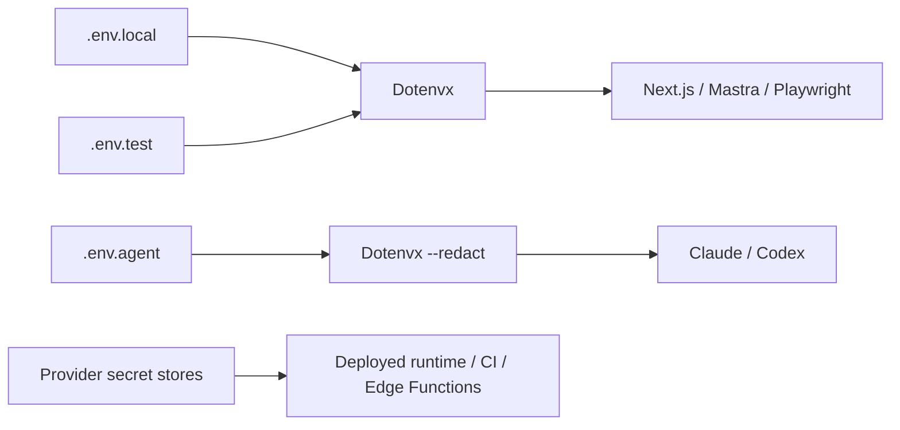

# Local Secrets and Dotenvx

## Decision

Dotenvx is the canonical **local** env injector. Production/deployment secrets remain in their owning provider secret stores. The legacy `/home/sk/ipix/prod.env` is reference-only and must never be copied wholesale into this repository.

## Local file ownership

| File | Owner | Rule |
|---|---|---|
| `.env.local` | Target local Next.js/Mastra runtime | Preferred home for local application values. Never launch a coding agent with this whole file. |
| `.env` | Transitional local compatibility | Existing values may remain until deliberately consolidated into `.env.local`; do not add new secrets here. |
| `.env.sentry-build-plugin` | Legacy Sentry build fallback | Currently only duplicates `SENTRY_AUTH_TOKEN`; `next.config.ts` reads the normal process env. Add no new secrets here and remove only after a real source-map upload smoke passes through Dotenvx. |
| `.env.test` | Playwright/E2E | QA accounts and test-only flags only. |
| `.env.agent` | Coding-agent process | Least privilege; starts empty. Add only a credential required for that session. |
| `.env.example` | Documentation | Names/examples only; tracked. |
| `.env.keys` | Dotenvx private keys | Local only, mode 600, never commit. |

## Legacy `prod.env` classification

This table is names-only. No value from the legacy file is authoritative merely because it exists there.

| Variable | Decision | Current reason |
|---|---|---|
| `CAPTURE_LEAD_PROXY_SECRET` | **DROP** | Archive-only; no current runtime consumer. |
| `CLOUDINARY_API_KEY` | **KEEP_RUNTIME** | Server-side Cloudinary SDK. |
| `CLOUDINARY_API_SECRET` | **KEEP_RUNTIME** | Server-only Cloudinary signing secret; never agent/browser. |
| `CLOUDINARY_CLOUD_NAME` | **KEEP_RUNTIME** | Cloudinary account identifier. |
| `CLOUDINARY_URL` | **DROP** | Current iPix config uses explicit CLOUDINARY_* names. |
| `CPK_INTELLIGENCE_API_KEY` | **KEEP_RUNTIME** | Canonical managed CopilotKit Intelligence key. |
| `DATABASE_URL` | **RENAME** | Do not use for Mastra; current contract is MASTRA_DATABASE_URL. |
| `E2E_TEST_EMAIL` | **TEST_ONLY** | .env.test / CI only. |
| `E2E_TEST_EMAIL_SHOOTS` | **TEST_ONLY** | .env.test / CI only. |
| `E2E_TEST_PASSWORD` | **TEST_ONLY** | .env.test / CI only. |
| `E2E_TEST_PASSWORD_SHOOTS` | **TEST_ONLY** | .env.test / CI only. |
| `FIRECRAWL_API_KEY` | **PLATFORM_SECRET** | Supabase Edge Function secret, not Next/Mastra local runtime truth. |
| `FIRECRAWL_WEBHOOK_SECRET` | **PLATFORM_SECRET** | Supabase Edge Function webhook verification. |
| `GEMINI_API_KEY` | **PLATFORM_SECRET** | Supabase Edge Function AI provider secret. |
| `GEMINI_MODEL` | **PLATFORM_SECRET** | Supabase Edge Function provider configuration. |
| `GITBOOK_API` | **TOOLING_ONLY** | GitBook tooling only. |
| `GOOGLE_CLIENT_ID` | **DROP** | No current iPix runtime consumer. |
| `GOOGLE_CLIENT_SECRET` | **DROP** | No current iPix runtime consumer; never migrate speculatively. |
| `GOOGLE_CLOUD_PROJECT_ID` | **DROP** | No current iPix runtime consumer. |
| `GRAFANA_SERVICE_ACCOUNT_TOKEN` | **TOOLING_ONLY** | External observability tooling; never coding-agent env. |
| `GRAFANA_URL` | **TOOLING_ONLY** | External observability tooling. |
| `INTELLIGENCE_API_KEY` | **RENAME** | Stale iPix alias; use CPK_INTELLIGENCE_API_KEY. |
| `IPIX_CF_INCLUDE_MASTRA_PG_SCOPE` | **DROP** | Legacy Cloudflare path only. |
| `IPIX_MASTRA_HOSTED` | **KEEP_RUNTIME** | Hosted Mastra fail-closed mode flag. |
| `LOG_LEVEL` | **KEEP_RUNTIME** | Optional local/runtime logging configuration. |
| `MASTRA_BASE_URL` | **KEEP_RUNTIME** | Next/CopilotKit route to standalone Mastra. |
| `MASTRA_DATABASE_URL` | **KEEP_RUNTIME** | Canonical Mastra Postgres connection; hosted mode requires it. |
| `MASTRA_PASSWORD` | **DROP** | No current runtime consumer. |
| `MASTRA_SCHEMA` | **DROP** | Current code fixes Mastra schema ownership in code. |
| `MASTRA_STORAGE_MODE` | **DROP** | No current runtime consumer. |
| `METICULOUS_API_KEY` | **TOOLING_ONLY** | Dev/preview tooling; not production runtime truth. |
| `MORPH_API_KEY` | **DROP** | No current runtime consumer. |
| `NEXT_CLOUDINARY_API_KEY` | **DROP** | Legacy Next-specific alias; current code uses CLOUDINARY_API_KEY. |
| `NEXT_CLOUDINARY_CLOUD_NAME` | **DROP** | Legacy alias; use NEXT_PUBLIC_CLOUDINARY_CLOUD_NAME for browser cloud name. |
| `NEXT_CLOUDINARY_UPLOAD_PRESET` | **DROP** | No current runtime consumer. |
| `NEXT_PUBLIC_GOOGLE_CLIENT_ID` | **DROP** | No current runtime consumer. |
| `NEXT_PUBLIC_MARKETING_CHAT_ENABLED` | **DROP** | No current runtime consumer. |
| `NEXT_PUBLIC_SUPABASE_ANON_KEY` | **RENAME** | Legacy browser key name; use NEXT_PUBLIC_SUPABASE_PUBLISHABLE_KEY. |
| `NEXT_PUBLIC_SUPABASE_PUBLISHABLE_KEY` | **KEEP_RUNTIME** | Canonical browser-safe Supabase key. |
| `NEXT_PUBLIC_SUPABASE_URL` | **KEEP_RUNTIME** | Canonical browser-safe Supabase URL. |
| `NVIDIA_API_KEY` | **TOOLING_ONLY** | Current GitHub PR-agent/Graphify tooling, not app runtime. |
| `OPENAI_API_KEY` | **KEEP_RUNTIME** | Mastra/OpenAI provider credential. |
| `OPENROUTER_API_KEY` | **DROP** | No current runtime consumer. |
| `OPERATOR_AUTH_ENABLED` | **DROP** | Legacy auth gate; current auth is not controlled by this flag. |
| `QA_DATABASE_URL` | **TEST_ONLY** | QA/staging only; never production/coding-agent env. |
| `QA_EMAIL` | **TEST_ONLY** | QA credential only. |
| `QA_PASSWORD` | **TEST_ONLY** | QA credential only. |
| `SENTRY_AUTH_TOKEN` | **TOOLING_ONLY** | Build/source-map upload credential; provider/CI managed. |
| `SOURCERY_API_KEY` | **DROP** | No current repository consumer. |
| `SUPABASE_ACCESS_TOKEN` | **TOOLING_ONLY** | Supabase CLI/management credential. |
| `SUPABASE_ANON_KEY` | **PLATFORM_SECRET** | Edge Function compatibility; platform-managed, not Node runtime truth. |
| `SUPABASE_DB_PASSWORD` | **TOOLING_ONLY** | Database administration only; never coding-agent env. |
| `SUPABASE_DB_URL` | **TOOLING_ONLY** | Database administration/legacy tooling only. |
| `SUPABASE_SERVICE_ROLE_KEY` | **PLATFORM_SECRET** | Privileged legacy compatibility for server/Edge tooling; never browser or coding-agent env. |
| `TESTOMATIO` | **TOOLING_ONLY** | CI test-reporting credential. |
| `TESTOMATIO_PROJECT_ID` | **TOOLING_ONLY** | Testomatio tooling metadata. |
| `VERCEL_AUTOMATION_BYPASS_SECRET` | **TEST_ONLY** | Preview E2E automation only. |
| `VERCEL_PROJECT_ID` | **TOOLING_ONLY** | Vercel deployment/governance tooling. |
| `VERCEL_TEAM_ID` | **TOOLING_ONLY** | Vercel CLI/project metadata when required. |
| `VERCEL_TOKEN` | **TOOLING_ONLY** | Vercel deployment/governance credential; never coding-agent env. |
| `VERCEL_URL` | **DROP** | Vercel supplies this at runtime; do not persist as secret truth. |
| `VERCEL_USER_ID` | **DROP** | No current repository consumer. |

## Current production gaps that legacy `prod.env` does not cover

- `SUPABASE_URL` + `SUPABASE_PUBLISHABLE_KEY` are required by hosted standalone Mastra auth. The legacy bundle does not contain them.
- `SUPABASE_SECRET_KEYS` is the preferred modern backend secret-key map; `SUPABASE_SERVICE_ROLE_KEY` is legacy compatibility only.
- Sentry runtime/build names such as `SENTRY_DSN`, `SENTRY_ORG`, and `SENTRY_PROJECT` belong in the deployment provider when required; they are not reasons to expand `.env.agent`.

## Coding-agent boundary

`--redact` protects exact secret matches in stdout/stderr; it does **not** stop the child process from reading injected values. Therefore coding agents use `.env.agent`, not `.env.local`, `.env.test`, or a production bundle. Secret-dependent app/test commands should be run through the repository npm scripts so secrets are injected into the child app/test process instead of the coding-agent process itself.

## Migration order

1. Keep deployment-provider secrets unchanged.
2. Use Dotenvx for local UI, Mastra, channel, and E2E dev-server injection.
3. Use Dotenvx directly inside Playwright config loading so encrypted `.env.test`/`.env` remain readable.
4. Keep `.env.agent` minimal and fail closed when it is missing.
5. Encrypt local files only after targeted tests, typecheck, build, and runtime smoke pass.
6. Verify a real Sentry source-map upload with `SENTRY_AUTH_TOKEN` injected through Dotenvx, then archive/remove `.env.sentry-build-plugin`.
7. Retain `.infisical.json` only as rollback metadata until names-only parity is independently verified; do not use it as local secret truth.
