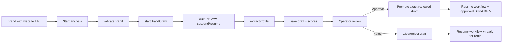
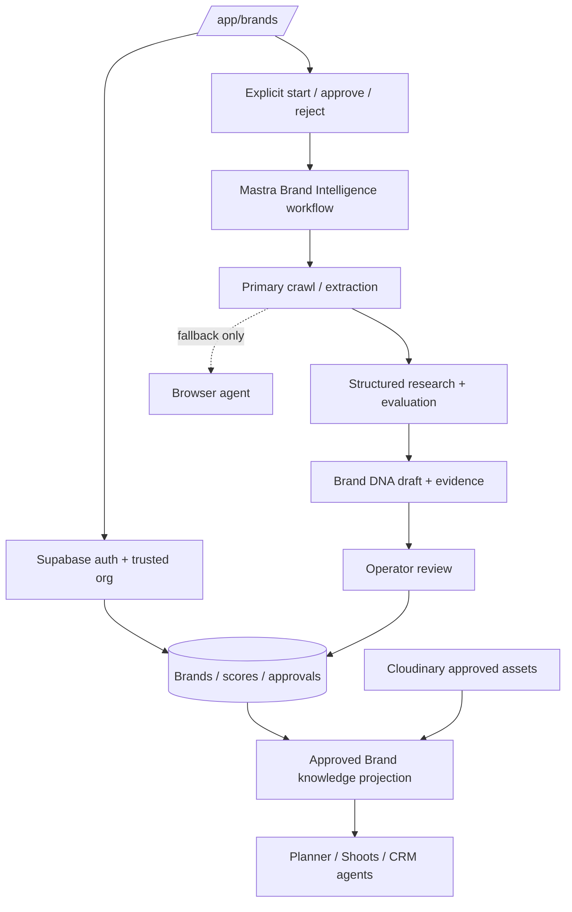

# iPix Brands — Current State, Reuse Matrix, and Implementation Plan

**Route:** https://www.ipix.co/app/brands  
**Status:** Current-state verified against `origin/main` baseline `4b0f15dde30800baf8d972d03c247ceee57f3fd5` on 2026-09-20.  
**Standard:** `../00-platform/DOC-STANDARDS.md`  
**Purpose:** document the current Brands implementation, the real user journeys it supports, what should be kept, and which external patterns are worth adapting before any replacement work is planned.

## 1. Current State

### 1.1 Routes and screens

| Area | Current implementation | Evidence |
| --- | --- | --- |
| Brands list | Authenticated, tenant-scoped browse page with count, cards, search, status filtering, empty/error states | `src/app/app/brands/page.tsx`; `src/components/brands/*` |
| Brand detail | Brand DNA state machine: no analysis, running, failed, review, parse error, approved | `src/app/app/brands/[brandId]/page.tsx`; `src/app/app/brands/[brandId]/select-view.ts` |
| Start analysis | Explicit operator action starts the durable Mastra Brand Intelligence workflow | `src/app/app/brands/[brandId]/actions.ts`; `src/components/brand/start-analysis-button.tsx` |
| Draft review | Exact rendered draft can be approved or rejected by owner/editor | `src/components/brand/brand-dna-review-card.tsx`; `src/app/app/brands/[brandId]/actions.ts` |
| Planner handoff | Authorized brand detail publishes `{id,name}` into Planner context | `src/app/app/brands/[brandId]/page.tsx`; `src/components/operator-panel/planner-context` |

### 1.2 Data and authorization

- `/app/brands` resolves the trusted organization server-side and explicitly scopes brand reads by `org_id`; RLS remains defense in depth.
- Brand detail treats RLS-protected `loadBrandDetail` as the authorization boundary; unknown, malformed, or foreign-org IDs render 404.
- Draft decisions use the operator session JWT, not a model-supplied identity.
- Approval/rejection is bound to the exact `draftHash` shown to the operator. The server RPC rejects stale or already-finalized drafts rather than approving unseen content.
- Analysis startup validates owner/editor membership before work begins and prevents duplicate active runs.
- Service-role access is used inside the durable workflow for system-side processing, while user decisions return to user-scoped RPC authorization.

### 1.3 Brand Intelligence workflow



Primary implementation: `src/mastra/workflows/brand-intelligence.ts` and `src/mastra/tools/brand-intelligence.ts`.

### 1.4 Current package baseline

| Package | Current repo version |
| --- | --- |
| Next.js | `16.3.5` |
| `@copilotkit/runtime` | `1.68.1` |
| `@copilotkit/react-core` | `1.68.1` |
| `@copilotkit/channels` | `0.9.0` |
| `@mastra/core` | `1.63.2` |
| `@mastra/pg` | `1.22.2` |
| `@supabase/supabase-js` | `2.112.4` |
| `cloudinary` | `^2.11.0` |

Do not copy example code that assumes newer APIs without first reconciling it with the installed package versions and IPI-1290's upgrade target.

## 2. Primary User Journeys

### Journey A — Browse and open a brand

`Sign in → resolve org → /app/brands → search/filter → open brand → tenant-authorized detail`

Success means the list shows only the operator's organization, status filters reflect the real persisted state, and direct foreign-org URLs remain inaccessible.

### Journey B — Generate Brand DNA

`Brand with URL → Start analysis → crawl → extraction → scores/profile draft → review state`

Success means duplicate starts are prevented, failures move the brand to a retryable failed state, and the operator can refresh/reconnect without losing durable progress.

### Journey C — Human approval

`Review exact draft → approve/reject → RPC validates role + exact draft hash → durable decision → workflow resume`

Success means stale drafts cannot be approved, viewer-only users cannot decide, and retries do not create a second decision.

### Journey D — Reanalyze an approved brand

`Approved Brand DNA → Run a new analysis → fresh draft → fresh operator decision`

The previous decision remains audit evidence; a new analysis must produce a new artifact/hash instead of mutating a finalized decision.

### Journey E — Use Brand context downstream

`Authorized brand → Planner context → shoot planning / research / campaign work`

The next architecture step should enrich this handoff without duplicating the Brands table as a second source of truth.

## 3. Existing iPix Capabilities to KEEP

| Capability | Action | Why |
| --- | --- | --- |
| Server-side tenant resolution | **KEEP** | Already enforces trusted org selection before reads |
| Supabase RLS + explicit org scoping | **KEEP** | Proven cross-tenant boundary and defense in depth |
| Durable Brand Intelligence workflow | **KEEP / ADAPT** | Correct fit for crawl/extract/review work that outlives a single chat turn |
| Exact `draftHash` approval contract | **KEEP** | Strong optimistic-concurrency and human-review boundary |
| Approval audit/recovery logic | **KEEP** | Handles committed-decision + failed-resume recovery |
| Duplicate analysis guard | **KEEP** | Prevents concurrent duplicate work |
| Brand profile Zod contract | **KEEP** | Existing schema is already product-specific |
| Planner brand context | **KEEP / EXPAND** | Correct downstream handoff point; expand data deliberately |
| Existing browser/unit/security tests | **KEEP** | Already cover real tenant and status behavior |

## 4. Brands Reuse Matrix

| Capability | Current iPix | Reference | Full URL | Local path / verified ref | Action | Reuse | Do not copy | Verification |
| --- | --- | --- | --- | --- | --- | --- | --- | --- |
| Brand/competitor research loop | Durable crawl + extraction exists | Mastra Deep Search | https://github.com/mastra-ai/template-deep-search | `/home/sk/ipixai/github/mastra/clones/template-deep-search` @ `c2c8fa478d5a25d3a9e188efe757b670d03d97fb` | **ADAPT** | Research decomposition, gap analysis, evaluation/citation loop | Whole starter app, provider/storage assumptions | **VERIFIED SOURCE PRESENT** |
| Browser fallback | Current crawl provider / Edge Functions | Mastra Browsing Agent | https://github.com/mastra-ai/template-browsing-agent | `/home/sk/ipixai/github/mastra/clones/template-browsing-agent` @ `fe841f7d12b82ce4de2eabf8e61d0fae5878ad96` | **ADAPT LATER** | Browser session, navigation, extraction fallback | Browser-first architecture, Browserbase dependency unless justified | **VERIFIED SOURCE PRESENT** |
| Approved knowledge retrieval | Brand profile and scores are canonical DB state | Mastra Company Knowledge | https://github.com/mastra-ai/template-company-knowledge | `/home/sk/ipixai/github/mastra/clones/template-company-knowledge` @ `6fc6a774ae13f97095a6e1d2288049c9e9ee1aab` | **ADAPT** | Index approved evidence for semantic recall; retrieval-first then fresh lookup | Neon-specific setup, duplicating canonical Brand truth | **VERIFIED SOURCE PRESENT** |
| Structured review UI | `BrandDNAReviewCard` exists | CopilotKit Generative UI | https://github.com/CopilotKit/CopilotKit/tree/main/examples/showcases/generative-ui | CopilotKit clone `/home/sk/ipixai/github/CopilotKit` @ `47c5510b4909f6728288ecf28d7b14cd14922d33` | **ADAPT** | Typed controlled GenUI patterns for evidence/scores/recommendations | Open-ended generated product chrome | **VERIFIED CURRENT MONOREPO LOCATION** |
| Shared editable planning state | Planner context is minimal today | CopilotKit Mastra PM Canvas | https://github.com/CopilotKit/CopilotKit/tree/main/examples/canvas/mastra-pm | CopilotKit clone @ `47c5510b4909f6728288ecf28d7b14cd14922d33` | **MODEL / ADAPT** | Shared structured planning state for Brand strategy/shoot handoff | Archived standalone repo or full PM product | **VERIFIED CURRENT MONOREPO LOCATION** |
| Mastra runtime/workflows | Existing Mastra implementation | Mastra core | https://github.com/mastra-ai/mastra | `/home/sk/ipixai/github/mastra/clones/mastra` | **KEEP / REFERENCE** | Current workflow/storage APIs and first-party tests | Latest `main` semantics without installed-version check | **VERIFIED LOCAL CLONE** |
| CopilotKit integration | Existing CopilotKit route/runtime | CopilotKit Mastra integration | https://github.com/CopilotKit/CopilotKit/tree/main/examples/integrations/mastra | CopilotKit clone @ `47c5510b4909f6728288ecf28d7b14cd14922d33` | **REFERENCE / ADAPT** | Runtime/agent registration and current AG-UI conventions | Treating an in-process demo as distributed-runner proof | **VERIFIED CURRENT MONOREPO LOCATION** |
| Product image/media evidence | Cloudinary already integrated elsewhere in iPix | Cloudinary | https://cloudinary.com/documentation | Existing iPix Cloudinary integration | **KEEP / ADAPT** | Link selected approved assets/products into Brand context | Replace Cloudinary storage with template-specific media handling | **CURRENT IPIX INTEGRATION; DOMAIN LINKAGE TO VERIFY** |

**Important:** the older standalone `https://github.com/CopilotKit/mastra-pm-canvas` is archived; the active reference is the CopilotKit monorepo path above.

## 5. Gaps / Blockers

| Priority | Gap | Why it matters | Recommended next move |
| --- | --- | --- | --- |
| P0 | Remote Mastra auth/context cannot rely on request-local `AsyncLocalStorage` if execution moves to another process/service | `requestToken` is currently process-local | Solve through the shared platform/IPI-1292 architecture before remote execution of these tools |
| P0 | Distributed run ownership/stop/reconnect is a platform concern, not a Brands-specific fix | Brand workflow is durable, but interactive run ownership remains separate | Keep IPI-1292 independent; do not rewrite Brand workflow to solve it |
| P1 | Brand research evidence is not yet modeled as a reusable approved knowledge corpus | Downstream agents may re-research instead of reusing approved evidence | Design approved-evidence indexing using Company Knowledge patterns |
| P1 | Competitor/product research orchestration can be more systematic | Existing extraction produces Brand DNA but does not yet expose a reusable deep-research loop | Spike Deep Search patterns against the current workflow before changing production |
| P1 | Planner handoff only carries brand ID/name | Shoots/Planner need richer approved context | Define a small versioned BrandContext projection from approved profile/scores |
| P1 | Browser fallback criteria are not explicit | Browser automation is expensive and operationally heavier | Use API/crawl/extract first; invoke browser only for specific unsupported pages/failures |
| P2 | Brand asset/media evidence linkage needs a current-state audit | Brand identity work should be able to reference approved product/editorial assets | Audit existing Cloudinary asset relations before adding schema |
| P2 | Analysis retry/timeout/observability policy is distributed across workflow code | Operational behavior should be measurable and consistent | Align with platform retry/SLO standards rather than invent Brands-only rules |

## 6. Recommended Architecture



### Architecture rules

1. `brands` and related approved-profile tables remain the business source of truth.
2. RAG/knowledge indexes are derived projections, never a competing authority.
3. Research may propose facts; approval determines what becomes reusable Brand truth.
4. Browser automation is fallback, not the default crawler.
5. Planner/Shoots consume an explicit approved `BrandContext` projection rather than raw unrestricted tables.
6. Human approval stays outside model autonomy. The model must never approve its own Brand DNA.
7. Shared platform runtime/auth/run-ownership decisions remain in `00-platform`, not duplicated here.

## 7. Implementation Order

### Phase 1 — Lock the current Brands baseline

1. Keep current list/detail/workflow/approval behavior unchanged.
2. Run the targeted Brands unit/component/E2E/security suites before feature work.
3. Record any current production gaps separately from reference-repo opportunities.

### Phase 2 — Define the downstream Brand context contract

1. Specify the minimum approved fields Shoots/Planner/CRM actually need.
2. Add contract tests for tenant scoping and approved-only data.
3. Reuse the existing Planner context handoff rather than adding another parallel context system.

### Phase 3 — Improve research quality

1. Inspect Deep Search's concrete research/evaluation loop against the current workflow.
2. ADAPT only missing orchestration primitives: query decomposition, evidence gathering, gap checks, citation/evidence binding.
3. Keep the current crawl, approval, Supabase, and Brand profile contracts unless a failing test proves they block the design.

### Phase 4 — Add approved Brand knowledge retrieval

1. Index only approved evidence/profile material into the existing Postgres/pgvector strategy.
2. Retrieval returns citations back to canonical records.
3. Re-index on a new approved Brand DNA version; never silently index a pending draft as approved truth.

### Phase 5 — Add browser fallback only where proven necessary

1. Define exact crawl/extraction failure classes that justify browser automation.
2. Prototype against representative brand/PDP sites.
3. Add timeout, abort, cost, and tenant-isolation tests before production use.

## 8. Tests / Success Criteria

### Existing proof to preserve

- `e2e/brands-journey.spec.ts`: authenticated load, live content/empty state, search, real status filtering, cross-org direct-URL denial, unknown/non-UUID denial.
- `tests/get-brands.test.ts`: list/count DAL behavior.
- `tests/get-brand-detail.test.ts`: detail read behavior.
- `tests/brand-detail-actions.test.ts`: server action behavior.
- `tests/brand-intelligence-tools.test.ts`: tool auth/approval/recovery behavior.
- `tests/brand-intelligence-resume-route.test.ts`: workflow resume path.
- `tests/brand-profile-contract.test.ts`: profile schema contract.
- component tests under `src/components/brand*`.
- Supabase security tests for Brand write boundaries, draft snapshot isolation, and crawl claim concurrency.

### Required acceptance for future Brands work

| Gate | Success criterion |
| --- | --- |
| Tenant isolation | Foreign-org brand/detail/draft/evidence remains inaccessible |
| Approval integrity | Stale or changed draft cannot be approved; one exact artifact has one durable final decision |
| Idempotency | Retry does not duplicate approved profile, scores, approval row, or workflow effects |
| Research evidence | Every reusable research claim links to stored evidence/source |
| Approved knowledge | Pending/rejected drafts never appear as approved downstream knowledge |
| Planner handoff | BrandContext contains only authorized approved fields and survives refresh/reconnect |
| Browser fallback | Failure of browser automation cannot corrupt canonical Brand state |
| Observability | Analysis failure identifies workflow/run/brand and leaves a retryable durable status |
| Regression | Existing targeted unit/component/E2E/security tests remain green |

### Verification commands

Run targeted tests before and after a Brands change:

```bash
npx vitest run \
  tests/get-brands.test.ts \
  tests/get-brand-detail.test.ts \
  tests/brand-detail-actions.test.ts \
  tests/brand-intelligence-tools.test.ts \
  tests/brand-intelligence-resume-route.test.ts \
  tests/brand-profile-contract.test.ts \
  src/components/brand/brand-dna-review-card.test.tsx \
  src/components/brands/brands-list-workspace.test.tsx

npx playwright test e2e/brands-journey.spec.ts
npm run docs:check
git diff --check
```

Supabase security checks should be run for any migration/RLS/RPC change affecting Brands; use the exact security tests touched by that change rather than assuming frontend tests prove database isolation.

## 9. References

### iPix

- Production Brands: https://www.ipix.co/app/brands
- iPix repository: https://github.com/amoai-tech/ipixai
- Platform issue: https://linear.app/amo100/issue/IPI-1293/ipix-agent-platform-agent-platform-001-rebuild-forward-from-proven
- Distributed runner spike: https://linear.app/amo100/issue/IPI-1292/ipi-1117-runner-spike-001-spike-3-candidate-architectures-for-cross

### CopilotKit

- Main repository: https://github.com/CopilotKit/CopilotKit
- Mastra integration: https://github.com/CopilotKit/CopilotKit/tree/main/examples/integrations/mastra
- Mastra PM Canvas: https://github.com/CopilotKit/CopilotKit/tree/main/examples/canvas/mastra-pm
- Generative UI: https://github.com/CopilotKit/CopilotKit/tree/main/examples/showcases/generative-ui
- Generative UI reference repository (consolidated into monorepo): https://github.com/CopilotKit/generative-ui

### Mastra

- Mastra core: https://github.com/mastra-ai/mastra
- Deep Search template: https://github.com/mastra-ai/template-deep-search
- Browsing Agent template: https://github.com/mastra-ai/template-browsing-agent
- Company Knowledge template: https://github.com/mastra-ai/template-company-knowledge

### Supporting platform references

- Cloudinary documentation: https://cloudinary.com/documentation
- Supabase RLS: https://supabase.com/docs/guides/database/postgres/row-level-security

## 10. Template rule for the remaining domains

Use this document's structure for `30-shoots`, `20-talent`, `40-assets`, `50-crm`, `60-operations`, `70-analytics`, and `80-plans`:

`Current State → User Journeys → Existing iPix to KEEP → Domain Reuse Matrix → Gaps/Blockers → Recommended Architecture → Implementation Order → Tests/Success Criteria → References`.

Do not copy Brands-specific architecture into another domain. Copy only the document structure and evidence discipline.
