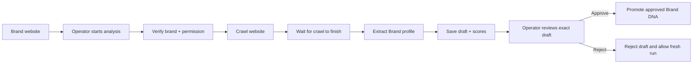
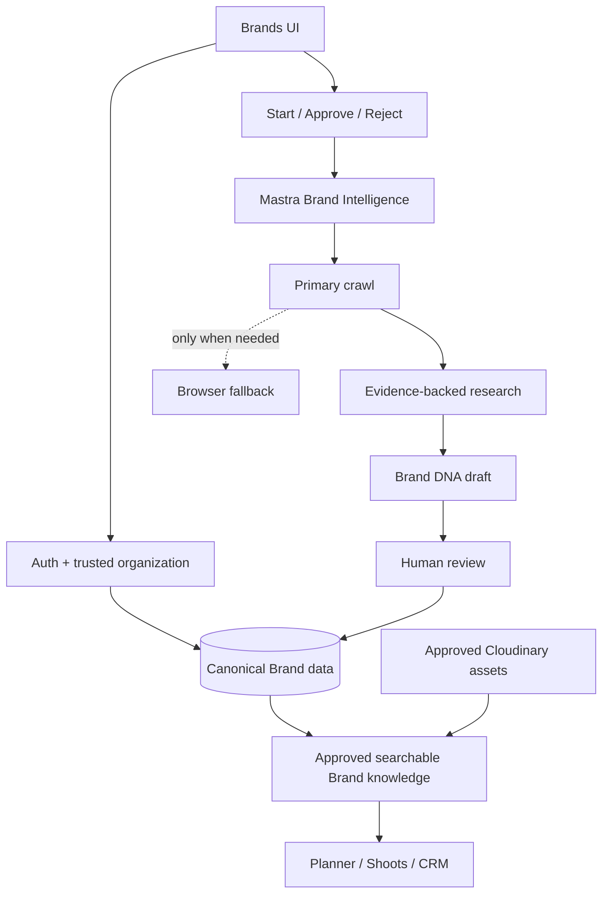

# iPix Brands — How It Works, What We Keep, and What We Improve

**Route:** https://www.ipix.co/app/brands
**Verified baseline:** `origin/main` at `4b0f15dde30800baf8d972d03c247ceee57f3fd5` on 2026-09-20
**Standard:** `../00-platform/DOC-STANDARDS.md`

## 30-second summary

Brands already works as a real product flow. An operator can open a brand, start AI research, review a Brand DNA draft, approve or reject the exact draft they saw, and pass approved Brand context into Planner.

We are **not rebuilding Brands**. We are keeping the parts that are already correct and adding proven patterns from specific Mastra and CopilotKit repos where they clearly improve the experience.

The main improvement path is:

`Brand website → deeper evidence-backed research → clear human review → approved Brand memory → reusable context for Shoots/Planner`

### What stays

- Supabase remains the business source of truth.
- Existing tenant isolation and RLS stay.
- The durable Mastra Brand Intelligence workflow stays.
- Human approval stays explicit.
- The exact reviewed draft must still be the one that gets approved.
- Existing tests stay as regression protection.

### What improves

**MVP rule:** improve the existing flow in small steps. Do not add browser automation, advanced knowledge indexing, or richer agent UI until the core Brand → review → Planner journey proves it needs them.

- Better multi-step research instead of one-pass extraction.
- Approved Brand knowledge can be reused later without re-researching the website.
- Review UI becomes easier to understand with structured cards and evidence.
- Planner/Shoots receive richer approved Brand context.
- Browser automation is added only as a fallback for hard-to-read sites.

## 1. Current State — what iPix already does today

### 1.1 Screens and routes

| User sees | What iPix does today | Main code |
| --- | --- | --- |
| Brands list | Shows only brands from the operator's organization, with search, status filters, count, empty/error states | `src/app/app/brands/page.tsx`; `src/components/brands/*` |
| Brand detail | Shows the correct state: no analysis, analyzing, failed, ready for review, invalid draft, or approved | `src/app/app/brands/[brandId]/page.tsx`; `select-view.ts` |
| Start analysis | Starts the existing durable Brand Intelligence workflow | `src/app/app/brands/[brandId]/actions.ts`; `start-analysis-button.tsx` |
| Review Brand DNA | Owner/editor reviews and approves or rejects the exact draft shown | `brand-dna-review-card.tsx`; server actions |
| Use Brand in Planner | Sends authorized Brand identity into Planner context | Brand detail page + `planner-context` |

### 1.2 Plain-English technical terms used in this document

| Term | Simple meaning in iPix |
| --- | --- |
| **RLS** | Supabase database rules that stop one organization from reading another organization's data |
| **Durable workflow** | Long-running work that can continue even if the browser closes or the user refreshes |
| **HITL** | Human-in-the-loop: AI proposes, but a person makes the final decision |
| **draftHash** | A fingerprint of the exact Brand DNA draft the operator reviewed; it prevents approving a newer unseen draft by mistake |
| **pgvector** | Searchable vector storage in Postgres used to retrieve approved Brand knowledge by meaning, not just exact words |
| **BrandContext** | A small approved package of Brand information that Planner/Shoots can safely reuse |

### 1.3 Security and authorization

In plain English: **a user should only see and change Brands they are allowed to access.**

Current protections already do this:

- `/app/brands` resolves the trusted organization on the server and scopes reads to that org.
- Brand detail relies on RLS-protected reads; invalid or foreign-org Brand IDs return 404.
- The AI/model never supplies the operator identity. The server uses the real authenticated session.
- Only owner/editor roles can approve or reject Brand DNA.
- Approval is tied to the exact `draftHash` shown to the operator.
- Duplicate active analyses are blocked.
- System-side workflow work can use service-role access, but human decisions still go through user-scoped authorization.

### 1.4 Current Brand Intelligence flow



Main implementation:
- `src/mastra/workflows/brand-intelligence.ts`
- `src/mastra/tools/brand-intelligence.ts`

### 1.5 Current package baseline

| Package | iPix version |
| --- | --- |
| Next.js | `16.3.5` |
| `@copilotkit/runtime` | `1.68.1` |
| `@copilotkit/react-core` | `1.68.1` |
| `@copilotkit/channels` | `0.9.0` |
| `@mastra/core` | `1.63.2` |
| `@mastra/pg` | `1.22.2` |
| `@supabase/supabase-js` | `2.112.4` |
| `cloudinary` | `^2.11.0` |

**Rule:** a GitHub example may use newer APIs. We adapt the pattern only after checking it against the versions iPix actually has installed and the IPI-1290 upgrade target.

## 2. Real user journeys

### Journey A — Browse and open a Brand

**What the user does**

`Sign in → Brands → search/filter → open Brand`

**What should happen**

The operator sees only Brands from their organization. Search and status filters match the real data. Copying another organization's Brand URL directly into the browser still does not reveal it.

**Real example**

An operator searches for **Maaji**, opens the Brand, and sees only Maaji data belonging to their workspace.

### Journey B — Generate Brand DNA

**What the user does**

`Open Brand → Start analysis → wait → review draft`

**What iPix does**

The workflow checks permission, crawls the site, extracts a profile, computes scores, saves a draft, and waits for human review.

**Real example**

For Maaji, iPix can extract product categories, visual direction, customer profile, tone, and competitor clues. Future improvements add deeper evidence-backed research before the draft is shown.

### Journey C — Human approval

**What the user does**

`Review draft → Approve or Reject`

**What iPix protects**

The system only approves the exact draft the user reviewed. If the draft changed after it was displayed, approval fails and the operator must review again.

**Real example**

The operator sees “Audience: resort-fashion customer” and approves that exact version. If AI generated a newer draft in the background, iPix does not silently approve the unseen version.

### Journey D — Reanalyze an approved Brand

`Approved Brand DNA → Run new analysis → new draft → new decision`

A previous approval remains historical evidence. A fresh analysis produces a new draft instead of rewriting the old decision.

### Journey E — Reuse Brand knowledge in Shoots

`Approved Brand → Planner/Shoots → shoot direction → shot list → talent/assets`

**Real example**

Planner asks: “What does Maaji look and sound like?” Instead of researching Maaji again, iPix should retrieve the approved Brand DNA and selected approved images, then use that context to build an ecommerce PDP shoot.

## 3. Existing iPix capabilities to KEEP

| Keep this | Why it is already valuable | Real-world effect |
| --- | --- | --- |
| Server-side tenant resolution | Trusted org is resolved before reads | User never chooses an org ID that grants extra access |
| Supabase RLS + explicit org filters | Strong tenant boundary | Org B cannot open Org A's Brand |
| Durable Brand Intelligence workflow | Correct for work that lasts longer than one chat turn | User can close/refresh while analysis continues |
| Exact `draftHash` approval | Prevents stale/unseen approval | User approves exactly what they reviewed |
| Approval audit/recovery | Handles “DB commit succeeded, workflow resume failed” cases | Retry can recover without a duplicate decision |
| Duplicate-run protection | Avoids two analyses racing on the same Brand | No accidental double crawl/double draft |
| Brand profile Zod contract | Product-specific schema already exists | New research enriches a known structure |
| Planner Brand context | Correct handoff point | We expand this instead of inventing a second context system |
| Existing tests | Already prove tenant and workflow behavior | Future changes have a safety net |

## 4. Repo reuse map — exactly what we adapt for iPix

Each row must answer: **which repo, what we take, what changes for iPix, where it goes, and what the user experiences.**

| Repo / example | Action | What we take | iPix target | Real iPix example |
| --- | --- | --- | --- | --- |
| Mastra Deep Search — https://github.com/mastra-ai/template-deep-search | **ADAPT** | Break research into smaller questions, gather evidence, detect gaps, evaluate quality | `brand-intelligence.ts` + research tools | Maaji research becomes audience + product + visual style + positioning + competitors instead of one-pass extraction |
| Mastra Company Knowledge — https://github.com/mastra-ai/template-company-knowledge | **ADAPT** | Approved knowledge index + retrieval-first behavior | Supabase pgvector projection of approved Brand DNA/evidence/assets | Planner asks for Maaji's visual rules weeks later and gets approved context immediately |
| Mastra Browsing Agent — https://github.com/mastra-ai/template-browsing-agent | **ADAPT LATER** | Browser navigation, observation, action, extraction, session handling | Fallback research tool only | Shopify PDP needs “Load more”; browser fallback extracts the missing details |
| CopilotKit Generative UI — https://github.com/CopilotKit/CopilotKit/tree/main/examples/showcases/generative-ui | **ADAPT** | Typed React cards + explicit human decisions | `BrandDNAReviewCard` and future evidence cards | Operator reviews Audience, Voice, Palette, Competitors, Evidence as cards instead of a wall of text |
| CopilotKit Mastra PM — https://github.com/CopilotKit/CopilotKit/tree/main/examples/canvas/mastra-pm | **MODEL / ADAPT** | Shared editable agent/human state | Brand → Planner/Shoots handoff | Operator changes “Editorial” to “Ecommerce PDP + 20% Editorial”; Planner immediately uses the new plan |
| CopilotKit Mastra integration — https://github.com/CopilotKit/CopilotKit/tree/main/examples/integrations/mastra | **REFERENCE / ADAPT** | Current CopilotKit ↔ Mastra integration pattern | Existing CopilotKit runtime | “Analyze this Brand” uses the same hardened Brand workflow, not a second backend |
| Mastra core — https://github.com/mastra-ai/mastra | **KEEP / REFERENCE** | Workflow suspend/resume and persisted state | Existing Brand workflow | Crawl can finish after browser closes and still reach review later |
| Cloudinary — https://cloudinary.com/documentation | **KEEP / ADAPT** | Existing media storage/transforms + approved asset references | BrandContext + current Cloudinary stack | Planner sees actual approved images that demonstrate “bright tropical prints” |

### 4.1 Mastra Deep Search → better Brand research

**Repo:** https://github.com/mastra-ai/template-deep-search
**Local clone:** `/home/sk/ipixai/github/mastra/clones/template-deep-search` @ `c2c8fa478d5a25d3a9e188efe757b670d03d97fb`

**What the repo teaches us**

Do not ask one giant research question and trust the first answer. Split the job, collect evidence, find missing information, and evaluate the result before finalizing it.

**What we adapt in iPix**

- research decomposition;
- multiple evidence passes;
- gap detection;
- evaluation before final draft;
- evidence attached to conclusions.

**Where it goes**

Extend the existing Brand Intelligence workflow. Do **not** replace crawl → extraction → approval.

**Real iPix example**

For Maaji, iPix investigates customer, product categories, visual language, pricing/positioning, sustainability claims, and competitors separately. Brand DNA can then explain *why* it concluded “colorful resort-fashion positioning” and show evidence.

**What we do not copy**

The starter app, its provider setup, storage choices, or blindly using its latest package versions.

### 4.2 Mastra Company Knowledge → approved Brand memory

**Repo:** https://github.com/mastra-ai/template-company-knowledge
**Local clone:** `/home/sk/ipixai/github/mastra/clones/template-company-knowledge` @ `6fc6a774ae13f97095a6e1d2288049c9e9ee1aab`

**What the repo teaches us**

Search approved internal knowledge first. Only do fresh external research when the trusted knowledge base cannot answer the question.

**What we adapt in iPix**

Approved Brand DNA, approved research evidence, and selected approved assets become a searchable pgvector projection in Supabase.

**Real iPix example**

Three weeks after onboarding, a stylist asks “What colors and tone define Maaji?” iPix retrieves the approved answer immediately instead of crawling Maaji again.

**What remains authoritative**

The actual `brands` data and approved Brand records. The vector index is a searchable copy, not a second source of truth.

**What we do not copy**

Neon-specific infrastructure, unrelated Linear/Notion connectors, or a separate competing database.

### 4.3 Mastra Browsing Agent → fallback for difficult websites

**Repo:** https://github.com/mastra-ai/template-browsing-agent
**Local clone:** `/home/sk/ipixai/github/mastra/clones/template-browsing-agent` @ `fe841f7d12b82ce4de2eabf8e61d0fae5878ad96`

**What we adapt**

Browser navigation, page observation, actions, structured extraction, timeout/session handling.

**When iPix uses it**

Only when the cheaper primary crawler cannot get the required data.

**Real iPix example**

A Shopify collection renders after JavaScript and needs “Load more.” The fallback browser performs that one difficult step and returns the extracted evidence to the same Brand workflow.

**What we do not copy**

A browser-first architecture or mandatory Browserbase usage for every Brand.

### 4.4 CopilotKit Generative UI → easier Brand review

**Repo:** https://github.com/CopilotKit/CopilotKit/tree/main/examples/showcases/generative-ui
**Local repo:** `/home/sk/ipixai/github/CopilotKit` @ `47c5510b4909f6728288ecf28d7b14cd14922d33`

**What we adapt**

Typed React renderers, structured agent output, and explicit human-in-the-loop controls.

**Where it goes**

Improve `src/components/brand/brand-dna-review-card.tsx` while preserving the current `draftHash` approval protection.

**Real iPix example**

The operator sees separate cards for Audience, Brand Voice, Visual Direction, Competitors, and Evidence, then approves the exact draft shown.

**What we do not copy**

Arbitrary AI-generated application UI or AI self-approval.

### 4.5 CopilotKit Mastra PM → shared Brand-to-Shoot plan

**Repo:** https://github.com/CopilotKit/CopilotKit/tree/main/examples/canvas/mastra-pm
**Local repo:** `/home/sk/ipixai/github/CopilotKit` @ `47c5510b4909f6728288ecf28d7b14cd14922d33`

**What we adapt**

One structured plan that both the human and agent can edit and see.

**How iPix uses it**

Approved Brand DNA remains read-only truth. The **shoot plan** is the editable shared state.

**Real iPix example**

AI proposes “editorial resort campaign.” The operator changes it to “ecommerce PDP + 20% editorial.” Planner immediately continues from that updated plan without changing Brand DNA.

**What we do not copy**

The project-management product itself or a second canonical Brand store.

### 4.6 CopilotKit Mastra integration → one path into Brand Intelligence

**Repo:** https://github.com/CopilotKit/CopilotKit/tree/main/examples/integrations/mastra

**What we adapt**

Current first-party patterns for exposing Mastra agents/workflows through CopilotKit/AG-UI.

**How iPix uses it**

The existing CopilotKit route stays the user-facing gateway and invokes the same Brand tools/workflow already used elsewhere.

**Real iPix example**

User types “analyze this Brand.” Chat calls `startBrandAnalysis`; auth, duplicate-run protection, and human review remain exactly the same.

**What we do not copy**

The demo assumption that one in-process runtime proves distributed production behavior. IPI-1292 remains the platform task for that problem.

### 4.7 Mastra core → keep durable workflow behavior

**Repo:** https://github.com/mastra-ai/mastra
**Installed iPix version:** `@mastra/core` `1.63.2`

**Decision:** **KEEP / REFERENCE**, not rewrite.

**Real iPix example**

A Brand crawl starts, the user closes the tab, and the workflow can still later reach draft review from persisted state.

### 4.8 Cloudinary → add visual evidence to Brand context

**Reference:** https://cloudinary.com/documentation

**Decision:** keep the existing iPix Cloudinary stack.

**What improves**

BrandContext can reference selected approved product/editorial assets and their existing delivery/transformation metadata.

**Real iPix example**

Brand DNA says “vivid tropical patterns.” Planner can show approved images that prove what that means visually.

### 4.9 Recommended adaptation order

| Order | Adaptation | Why first/next |
| --- | --- | --- |
| 1 | Deep Search → research quality | Biggest direct improvement to Brand DNA while keeping current workflow |
| 2 | Company Knowledge → approved Brand memory | Stops repeated research and feeds Shoots/Planner |
| 3 | Generative UI → clearer review | Makes evidence and approval easier for operators |
| 4 | Mastra PM → Brand-to-Shoot plan | Connects Brands to the next core product journey |
| 5 | Browsing Agent → fallback | Valuable only for difficult sites; higher complexity/cost |
| 6 | CopilotKit/Mastra integration alignment | Shared platform concern, not a Brands-only rewrite |

## 5. Gaps and blockers — Problem → Impact → Fix

| Priority | Problem | User/business impact | Fix |
| --- | --- | --- | --- |
| P0 | Remote execution cannot depend on request-local `AsyncLocalStorage` | Brand tools could lose authenticated user context if execution moves to another process/service | Solve in shared platform architecture through IPI-1292 before remote execution |
| P0 | Distributed run ownership/stop/reconnect is not a Brands-specific problem | Interactive AI runs can still fail across server instances even though Brand workflow state is durable | Keep IPI-1292 separate; do not rewrite Brand workflow as a workaround |
| P1 | Approved research is not yet reusable knowledge | Planner/Shoots may pay to research the same Brand again | Add approved Brand knowledge projection using Company Knowledge pattern |
| P1 | Research orchestration is still relatively one-pass | Brand DNA can miss evidence or weakly supported conclusions | Adapt Deep Search decomposition + gap/evaluation loop |
| P1 | Planner receives only Brand ID/name | Shoot planning lacks approved audience/style/voice context | Create a small versioned approved `BrandContext` |
| P1 | Browser fallback rules are undefined | Browser automation could become slow/expensive if overused | Define exact crawler failure cases that justify browser fallback |
| P2 | Brand ↔ approved asset linkage needs audit | Text Brand DNA lacks direct visual proof | Audit current Cloudinary/asset relationships before adding schema |
| P2 | Retry/timeout/observability rules are spread across workflow code | Failures are harder to operate consistently | Use shared platform retry/SLO rules instead of Brands-only rules |

## 6. Recommended architecture — simple view



### What the user experiences

1. Add/open a Brand.
2. Start analysis.
3. iPix researches the Brand and gathers evidence.
4. The operator reviews a structured Brand DNA draft.
5. The operator approves or rejects it.
6. Approved knowledge becomes reusable by Planner/Shoots.
7. Future work starts from approved Brand knowledge instead of researching from zero.

### Architecture rules

1. Supabase Brand records remain the business truth.
2. Vector/search indexes are derived copies, not competing truth.
3. AI can propose; only a human can approve.
4. Browser automation is fallback, not default.
5. Planner/Shoots receive only approved, authorized BrandContext.
6. Shared runtime/auth/run-ownership problems stay in `00-platform` and IPI-1292.

## 7. Implementation order — what becomes true after each phase

### Core / MVP boundary

The MVP is intentionally small:

`Brand website → current analysis → clearer reviewed Brand DNA → approved BrandContext → Planner/Shoots`

For MVP, **do not** require browser fallback, a full knowledge/RAG subsystem, multi-agent orchestration, or a large Generative UI redesign. Those are follow-up improvements only if the core journey shows a real need.


### Phase 1 — Protect what already works

**Outcome:** current Brands behavior stays stable while improvements are added.

- Keep list/detail/workflow/approval behavior unchanged.
- Run current Brands regression/security tests before feature changes.
- Separate real existing bugs from “nice reference repo ideas.”

### Phase 2 — Planner can safely reuse approved Brand context

**Outcome:** Shoots/Planner can consume useful Brand context without reading raw unrestricted Brand tables.

- Define the minimum approved fields needed by Planner/Shoots/CRM.
- Create a small versioned `BrandContext` contract.
- Add tenant + approved-only contract tests.
- Expand the existing Planner handoff instead of inventing another context system.

**Real example:** Planner receives Maaji audience, voice, visual direction and approved reference assets—not just `{id,name}`.

### Phase 3 — Brand research becomes evidence-backed

**Outcome:** Brand DNA conclusions come from a repeatable research loop, not just one-pass extraction.

- Adapt Deep Search question decomposition.
- Add multiple evidence gathering passes where useful.
- Add gap checks and evaluation before final draft.
- Keep current crawl, approval and profile contracts unless evidence shows they block the design.

**Real example:** “Maaji is colorful resort fashion” includes evidence from product/collection pages and competitor context.

### Phase 4 — Approved Brand knowledge becomes reusable memory

**Outcome:** downstream agents can retrieve approved Brand knowledge quickly.

- Index only approved Brand DNA/evidence/assets into Supabase pgvector.
- Return links/citations to canonical records.
- Re-index after a new approved Brand DNA version.
- Never index pending/rejected drafts as approved truth.

**Real example:** a new shoot three weeks later starts from approved Brand context in seconds instead of re-crawling the website.

### Phase 5 — Add browser fallback only where proven necessary

**Outcome:** difficult JavaScript-heavy sites can still be researched without making browser automation the default.

- Define the specific failure types that trigger browser fallback.
- Test representative PDP/collection sites.
- Add timeout, abort, cost, and tenant-isolation checks.

## 8. Tests and success criteria

### Existing tests we must preserve

- `e2e/brands-journey.spec.ts` — authenticated load, live/empty state, search, status filter, cross-org denial, invalid IDs.
- `tests/get-brands.test.ts` — list/count DAL.
- `tests/get-brand-detail.test.ts` — detail reads.
- `tests/brand-detail-actions.test.ts` — server actions.
- `tests/brand-intelligence-tools.test.ts` — tool auth, approval and recovery.
- `tests/brand-intelligence-resume-route.test.ts` — workflow resume.
- `tests/brand-profile-contract.test.ts` — Brand profile contract.
- Component tests under `src/components/brand*`.
- Supabase security tests covering Brand write boundary, draft snapshot isolation, and crawl claim concurrency.

### Future Brands work is successful when

| Gate | Plain-English success condition |
| --- | --- |
| Tenant isolation | Another organization still cannot access this Brand or its research |
| Approval integrity | User can only approve the exact draft they reviewed |
| Idempotency | Retrying does not create duplicate approval/profile/score effects |
| Evidence | Important research claims point to stored evidence/source |
| Approved memory | Pending/rejected drafts never appear as approved knowledge |
| Planner handoff | Planner receives only authorized approved BrandContext |
| Browser fallback | Browser failure cannot damage canonical Brand data |
| Observability | A failed analysis identifies Brand/run and leaves a safe retry state |
| Regression | Existing Brand tests remain green |

### Verification commands

```bash
npx vitest run   tests/get-brands.test.ts   tests/get-brand-detail.test.ts   tests/brand-detail-actions.test.ts   tests/brand-intelligence-tools.test.ts   tests/brand-intelligence-resume-route.test.ts   tests/brand-profile-contract.test.ts   src/components/brand/brand-dna-review-card.test.tsx   src/components/brands/brands-list-workspace.test.tsx

npx playwright test e2e/brands-journey.spec.ts
npm run docs:check
git diff --check
```

For any Brands migration/RLS/RPC change, run the exact affected Supabase security tests too. Frontend tests do not prove database isolation.

## 9. Next 3 actions

1. **Define `BrandContext`** — decide exactly what approved Brand data Planner/Shoots need.
2. **Adapt Deep Search research loop** — prototype decomposition/evidence/evaluation inside existing Brand Intelligence.
3. **Design approved Brand memory** — map approved Brand DNA/evidence/assets into Supabase pgvector without creating a second source of truth.

## 10. References

### iPix

- Production Brands: https://www.ipix.co/app/brands
- Repository: https://github.com/amoai-tech/ipixai
- Platform architecture issue: https://linear.app/amo100/issue/IPI-1293/ipix-agent-platform-agent-platform-001-rebuild-forward-from-proven
- Distributed runner spike: https://linear.app/amo100/issue/IPI-1292/ipi-1117-runner-spike-001-spike-3-candidate-architectures-for-cross

### CopilotKit

- Repository: https://github.com/CopilotKit/CopilotKit
- Mastra integration: https://github.com/CopilotKit/CopilotKit/tree/main/examples/integrations/mastra
- Mastra PM: https://github.com/CopilotKit/CopilotKit/tree/main/examples/canvas/mastra-pm
- Generative UI: https://github.com/CopilotKit/CopilotKit/tree/main/examples/showcases/generative-ui

### Mastra

- Core: https://github.com/mastra-ai/mastra
- Deep Search: https://github.com/mastra-ai/template-deep-search
- Browsing Agent: https://github.com/mastra-ai/template-browsing-agent
- Company Knowledge: https://github.com/mastra-ai/template-company-knowledge

### Supporting references

- Cloudinary: https://cloudinary.com/documentation
- Supabase RLS: https://supabase.com/docs/guides/database/postgres/row-level-security

## 11. Writing template for Shoots, Talent, and Assets

Use this same writing style, not Brands-specific content:

`30-second summary → Current State → Plain-English Terms → Real User Journeys → What We KEEP → Repo Reuse Map → Exact Adaptation Details → Problem/Impact/Fix → Simple Architecture → Outcome-based Implementation Phases → Tests/Success → Next 3 Actions → References`

Every external repo must answer:

`Repo → What it teaches → What iPix adapts → Where it goes → Real user example → What we do NOT copy`.
