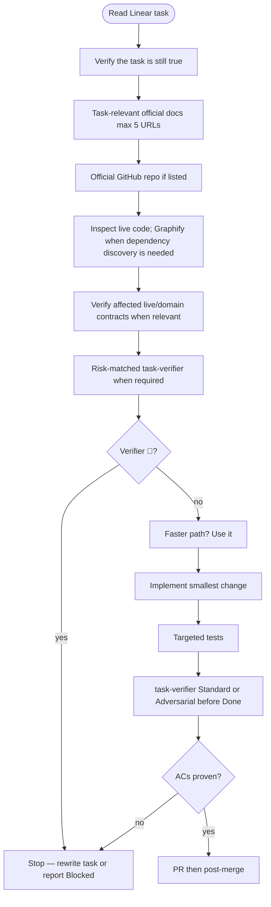

# Linear task format (iPixai)

**SSOT for how an IPI issue is written and how an agent must execute it.**
Cursor rule: `.cursor/rules/linear-task-format.mdc` (summary only — do not duplicate this file).

**This repo:** CopilotKit + Mastra at git root (`src/`). Split `dev:ui` / `dev:agent`. Never combined `npm run dev`. Never production Supabase writes. Hosting is **Vercel / Next.js**, not Cloudflare Workers.

Title: **`IPI-NNN · TASK-ID — Plain-English outcome`**. Never a tech-only title.

Immediately below the title:

```markdown
**What changes:** <2–4 plain-English lines>
**Real-world example:** <actor → action → visible/durable result>
**Faster/better approach:** <smallest safe proven path>
**Current status:** <state + verified progress %>
**Tech stack touched:** <only affected systems>
**Skills / MCPs / CLI / dashboards:** <only what is actually required + why>
**Production-ready when:** <one observable success sentence>
```

Unknown values are `Needs verification`, not guesses.

---

## Agent order (hard)

Start every Linear description with a **plain-English title + Top Task Snapshot** so a product/operator can understand the outcome immediately. Put the **Agent Contract / implementation instructions after that snapshot**. After the agent reads the task, the first work is verification. **No code until verification passes.**



---

## Agent Contract / implementation instructions (after the Top Task Snapshot)

```markdown
## Implementation prompt

You are implementing **IPI-NNN · TASK-ID — Full title** in the current iPixai repository root / active worktree.

**After you read this description, do not write product code yet.** Run **Verify-before-implement** first. Only implement if that gate is ✅.

### Verify-before-implement (mandatory, in order)

1. Read this issue, parent project, blockers, `AGENTS.md`, and `.cursor/rules/`.
2. **Official docs only** — no blogs. Use only the documentation tools relevant to the affected stack (for example Context7, Mastra MCP, CopilotKit MCP, Supabase `search_docs`, or the matching `.claude/skills/*/SKILL.md`). Open **at most 5** URLs listed in **Official references** below. Each URL must prove one **critical fact** for *this* task. Fetch/MCP-check every URL with the relevant tool; if a required link 404s, is a blog, or conflicts with installed package types, label it **Unverified** and stop. If no external contract is involved, record `Official docs: N/A — <reason>`.
3. If **Official GitHub repo** is set, fetch that path (official org only: `mastra-ai`, `CopilotKit`, `supabase`, `vercel`, `facebook/react` as applicable). Confirm the example is not archived.
4. **Live codebase:** inspect the current implementation and confirm the gap still exists. For substantial code tasks or cross-file dependency/blast-radius questions, run `PATH="$HOME/.local/bin:$PATH" graphify query "<this task>"` then Read/Grep and list `graphify` in **Skills / MCPs / CLI / dashboards**. For a narrow docs/config-only task where Graphify adds no useful proof, record `Graphify: N/A — <reason>` and use the cheapest direct inspection. Reuse what is already here (`ponytail`) when applicable.
5. **Affected live/domain contracts only:** if the task touches Supabase schema/RLS/RPC/data/auth, connect Supabase MCP **read-only** (preview / `list_tables` / `list_migrations` / advisors), list it in **Skills / MCPs / CLI / dashboards**, and confirm those claims against live preview. Never `db push`, never production writes. If Supabase is not touched, record `Supabase verification: N/A — <reason>`. Apply the same rule to other vendor dashboards/MCPs/CLIs: use and list them only when that system is authoritative for the task.
6. **Skills:** load every skill named in **Skills / MCPs / CLI / dashboards** below. Index: `.claude/skills/index-skills.md`.
7. **Verification depth:** substantial implementation tasks require **task-verifier Standard** and must list `task-verifier`; explicitly narrow docs/config checks may use Quick or record `task-verifier: N/A — <reason>` when no verifier proof is meaningful. Adversarial is automatic for security/tenant/HITL/data-integrity/production-risk triggers. Any BLOCKER → **do not implement**. Report blockers.
8. At every later step ask: *is there a better, faster, more efficient way?* Use it (`.cursor/rules/fastest.mdc`). Prefer managed dashboard → official CLI/SDK → official example → small adapter → custom last.

### Only then implement

9. Smallest change that meets ACs. One concern per PR/commit.
10. Targeted tests first; browser when UI changed (`dev:ui` + `dev:agent` split).
11. Compare to every AC. Do not mark Linear **Done** because code exists.
12. Before Done: run the **risk-matched task-verifier** required by step 7 — Standard for substantial implementation, Adversarial when its triggers apply, or the documented Quick/N/A path for an explicitly narrow docs/config task. After merge: `.claude/skills/tasks/references/post-merge.md`.
```

---

## Official references (max 5 — this task only)

On the issue, list **only** URLs the implementing agent can open and check. **Cap: 5.** Each row is one critical fact.

**Hard rule: review every important URL. Do not just list links.**

### Reference review table (required)

Include the **full URL** in the first column. Every row must answer: *What exactly should iPix use, where does it fit, and what does it prevent us from building?*

| Reference (full URL) | What it provides | Exact iPix use | What to reuse | Custom code avoided | Limits/cost |
| -------------------- | ---------------- | -------------- | ------------- | ------------------- | ----------- |
| https://… | Capability / API / pattern | Concrete iPix screen, route, or contract | Exact symbol, CLI, config, or example path | What we must not rebuild | Free/paid, plan, deprecated, security |

Optional tracking columns (keep in issue body or fold into “Exact iPix use”):

| # | Critical fact this URL must prove | MCP / skill to re-check |
|---|-----------------------------------|-------------------------|
| 1 | | Context7 / Mastra MCP / CopilotKit MCP / Supabase `search_docs` |
| 2 | | |
| 3 | | |
| 4 | | |
| 5 | | |

### Per-URL multi-step adapt prompt (required)

For **each** reference, the issue must include a short adapt block (copy and fill):

```markdown
### Use this URL — <short name>
**URL:** https://…

1. Fetch/MCP-check (Context7 / vendor MCP / Supabase `search_docs`). Confirm docs version matches **installed** package major/minor.
2. Extract the exact API, config key, CLI command, or example path iPix will use.
3. Map to implementation layers (check all that apply): Screen/route · Feature · Frontend · Backend · Supabase/data · Agent · Tool · Workflow · HITL · Testing · Deployment/operations.
4. Adapt: keep vendor defaults; change only tenancy (`org_id` / AUTH), DESIGN-001 tokens, and proven gaps. Prefer COPY+CLEAN over rewrite.
5. Name the proof: targeted test and/or browser AC that fails if this URL’s fact was wrong.
```

### Map each reference to implementation

For each URL, state **exactly** where it applies (at least one):

| Layer | Applies? | Where in iPix (path / route / RPC) |
|-------|:--------:|-------------------------------------|
| Screen/route | | |
| Feature | | |
| Frontend | | |
| Backend | | |
| Supabase/data | | |
| Agent | | |
| Tool | | |
| Workflow | | |
| HITL | | |
| Testing | | |
| Deployment/operations | | |

### Remaining custom gap (required after references)

After reviewing reusable solutions, the issue **must** state:

* **Already solved** — vendor feature or existing iPix code
* **Configurable** — dashboard, env, CLI, named transform, RLS policy
* **Copied/adapted** — official example or pinned Lumina COPY+CLEAN
* **Still requires custom code** — and **why** (proof earlier path is insufficient)
* **Must not rebuild** — forbidden duplicates (second auth, second shell, fake KPIs, etc.)

### Verify limitations (per reference)

Before implement, confirm for each URL:

* Current version / API matches installed types
* Free vs paid; plan restrictions
* Deprecated features
* Security requirements (no client secrets, RLS, no prod writes by default)
* Production limitations
* Licensing where relevant

Premium or optional capabilities must **not** block Core MVP unless essential to the AC.

**Official GitHub repo** (0 or 1): `https://github.com/<org>/<repo>/…` — agent must verify it is official and not archived.

**Forbidden:** blogs, Stack Overflow, unofficial gists, more than 5 URLs, generic “read all Mastra docs,” bare link dumps without the review table.

---

## Skills (every IPI task)

**Always use the canonical `tasks` rules, then name only the additional skills/tools actually required by this task.** Typical choices include `task-verifier`, `graphify`, `ipix-supabase`, `mastra`, `copilotkit`, `cloudinary`, `nextjs-developer`, Playwright, GitHub, Linear, Supabase, or other connected MCPs/CLIs.

For every named skill/MCP/CLI/dashboard, state **why it is needed** and verify it is available before relying on it. If the mandatory verification flow above makes a tool required for this task (for example Graphify on substantial cross-file code work, Supabase MCP on schema/RLS work, or task-verifier Standard on substantial implementation), that tool **must also appear in this list**. If a tool is not relevant, record the applicable `N/A — <reason>` in the verification step rather than naming or invoking it. Do not add deprecated `ipix-task-lifecycle` or `pr-workflow` to new task skill lists.

---

## Required Linear description (after the prompt)

Use the canonical `tasks` skill structure: purpose, real-world example, user outcome, user journey, current state/evidence, faster implementation review, scope, tech stack, skills/MCPs, implementation steps, acceptance criteria, dependencies, security/data, verification evidence, and post-merge Done gate.

UI / cross-system tasks must include the applicable Mermaid diagrams required by `.claude/skills/tasks/SKILL.md` and `.claude/skills/mermaid-diagrams/SKILL.md`.

---

## Ready / Done gates

**Ready (Todo):** outcome, journey, current-state evidence, ≤5 official URLs with review/adapt mapping, relevant skills/MCPs, reuse review, measurable ACs, security, and verification plan.

**Merged:** code on `origin/main`. **Verified:** real workflow probed. **Done:** risk-matched task-verifier + post-merge evidence. Merge ≠ Done.
