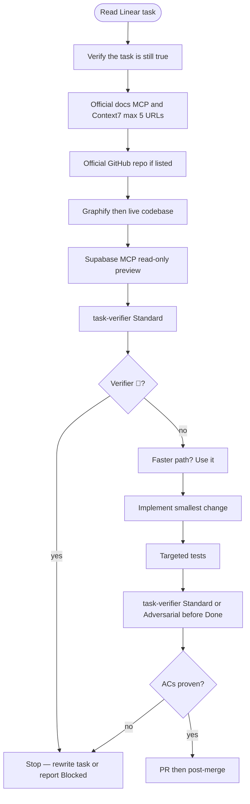
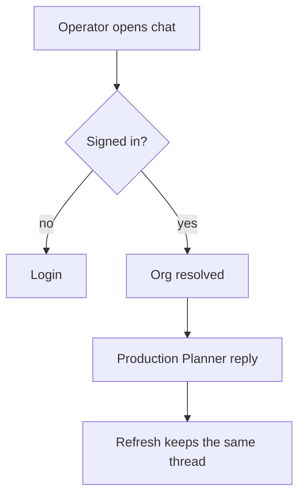

# Linear task format (iPixai)

**SSOT for how an IPI issue is written and how an agent must execute it.**
Cursor rule: `.cursor/rules/linear-task-format.mdc` (summary only — do not duplicate this file).

**This repo:** CopilotKit + Mastra at git root (`src/`). Split `dev:ui` / `dev:agent`. Never combined `npm run dev`. Never production Supabase writes. Hosting is **Vercel / Next.js**, not Cloudflare Workers.

Title: **`IPI-NNN · TASK-ID — Plain-English outcome`**. Never a tech-only title.

---

## Agent order (hard)

Paste the **Implementation prompt** at the **top** of every Linear description. After the agent reads the task, the **first work** is verification. **No code until verification passes.**



---

## Implementation prompt (paste at top of every issue)

```markdown
## Implementation prompt

You are implementing **IPI-NNN · TASK-ID — Full title** in iPixai (`/home/sk/ipixai`).

**After you read this description, do not write product code yet.** Run **Verify-before-implement** first. Only implement if that gate is ✅.

### Verify-before-implement (mandatory, in order)

1. Read this issue, parent project, blockers, `AGENTS.md`, and `.cursor/rules/`.
2. **Official docs only** — no blogs. Use **Context7**, **Mastra MCP**, **CopilotKit MCP**, **Supabase MCP** `search_docs`, and the matching `.claude/skills/*/SKILL.md`. Open **at most 5** URLs listed in **Official references** below. Each URL must prove one **critical fact** for *this* task. Fetch/MCP-check every URL; if a link 404s, is a blog, or does not match installed package types, label it **Unverified** and stop.
3. If **Official GitHub repo** is set, fetch that path (official org only: `mastra-ai`, `CopilotKit`, `supabase`, `vercel`, `facebook/react` as applicable). Confirm the example is not archived.
4. **Live codebase:** `PATH="$HOME/.local/bin:$PATH" graphify query "<this task>"` then Read/Grep. Confirm the gap still exists. Reuse what is already here (`ponytail`).
5. **Supabase:** connect Supabase MCP **read-only** (preview / `list_tables` / `list_migrations` / advisors). Never `db push`, never production writes. Confirm schema/RLS claims in this ticket against live preview — not memory.
6. **Skills:** load every skill in **Skills** below. Index: `.claude/skills/index-skills.md`.
7. Run **task-verifier Standard** for substantial tasks. Use Quick only for an explicitly narrow check; Adversarial is automatic for security/tenant/HITL/data-integrity/production-risk triggers. Any BLOCKER → **do not implement**. Report blockers.
8. At every later step ask: *is there a better, faster, more efficient way?* Use it (`.cursor/rules/fastest.mdc`). Prefer managed dashboard → official CLI/SDK → official example → small adapter → custom last.

### Only then implement

9. Smallest change that meets ACs. One concern per PR/commit.
10. Targeted tests first; browser when UI changed (`dev:ui` + `dev:agent` split).
11. Compare to every AC. Do not mark Linear **Done** because code exists.
12. Before Done: **task-verifier Standard**, or **Adversarial** when its risk triggers apply. After merge: `.claude/skills/tasks/references/post-merge.md`.
```

---

## Official references (max 5 — this task only)

On the issue, list **only** URLs the implementing agent can open and check. **Cap: 5.** Each row is one critical fact.

**Hard rule: review every important URL. Do not just list links.**

### Reference review table (required)

Include the **full URL** in the first column. Every row must answer: *What exactly should iPix use, where does it fit, and what does it prevent us from building?*

| Reference (full URL) | What it provides | Exact iPix use | What to reuse | Custom code avoided | Limits/cost |
| -------------------- | ---------------- | -------------- | ------------- | ------------------- | ----------- |
| https://… | Capability / API / pattern | Concrete iPix screen, route, or contract | Exact symbol, CLI, config, or example path | What we must not rebuild | Free/paid, plan, deprecated, security |

Optional tracking columns (keep in issue body or fold into “Exact iPix use”):

| # | Critical fact this URL must prove | MCP / skill to re-check |
|---|-----------------------------------|-------------------------|
| 1 | | Context7 / Mastra MCP / CopilotKit MCP / Supabase `search_docs` |
| 2 | | |
| 3 | | |
| 4 | | |
| 5 | | |

### Per-URL multi-step adapt prompt (required)

For **each** reference, the issue must include a short adapt block (copy and fill):

```markdown
### Use this URL — <short name>
**URL:** https://…

1. Fetch/MCP-check (Context7 / vendor MCP / Supabase `search_docs`). Confirm docs version matches **installed** package major/minor.
2. Extract the exact API, config key, CLI command, or example path iPix will use.
3. Map to implementation layers (check all that apply): Screen/route · Feature · Frontend · Backend · Supabase/data · Agent · Tool · Workflow · HITL · Testing · Deployment/operations.
4. Adapt: keep vendor defaults; change only tenancy (`org_id` / AUTH), DESIGN-001 tokens, and proven gaps. Prefer COPY+CLEAN over rewrite.
5. Name the proof: targeted test and/or browser AC that fails if this URL’s fact was wrong.
```

### Map each reference to implementation

For each URL, state **exactly** where it applies (at least one):

| Layer | Applies? | Where in iPix (path / route / RPC) |
|-------|:--------:|-------------------------------------|
| Screen/route | | |
| Feature | | |
| Frontend | | |
| Backend | | |
| Supabase/data | | |
| Agent | | |
| Tool | | |
| Workflow | | |
| HITL | | |
| Testing | | |
| Deployment/operations | | |

### Remaining custom gap (required after references)

After reviewing reusable solutions, the issue **must** state:

* **Already solved** — vendor feature or existing iPix code
* **Configurable** — dashboard, env, CLI, named transform, RLS policy
* **Copied/adapted** — official example or pinned Lumina COPY+CLEAN
* **Still requires custom code** — and **why** (proof earlier path is insufficient)
* **Must not rebuild** — forbidden duplicates (second auth, second shell, fake KPIs, etc.)

### Verify limitations (per reference)

Before implement, confirm for each URL:

* Current version / API matches installed types
* Free vs paid; plan restrictions
* Deprecated features
* Security requirements (no client secrets, RLS, no prod writes by default)
* Production limitations
* Licensing where relevant

Premium or optional capabilities must **not** block Core MVP unless essential to the AC.

**Official GitHub repo** (0 or 1): `https://github.com/<org>/<repo>/…` — agent must verify it is official and not archived.

**Forbidden:** blogs, Stack Overflow, unofficial gists, more than 5 URLs, generic “read all Mastra docs,” bare link dumps without the review table.

**Catalog (pick from, do not dump onto the issue):**

| When the task is about | Prefer these official sources |
|------------------------|-------------------------------|
| Mastra | https://mastra.ai/docs · https://github.com/mastra-ai/mastra · Mastra MCP |
| CopilotKit | https://docs.copilotkit.ai · https://github.com/CopilotKit/CopilotKit/tree/main/examples/integrations/mastra · CopilotKit MCP |
| Supabase | https://supabase.com/docs · https://github.com/supabase/cli · Supabase MCP `search_docs` |
| Next.js / Vercel | Context7 `/vercel/next.js` · https://nextjs.org/docs |
| Linear | https://linear.app/docs/mcp |

CopilotKit+Mastra starters: use the **active** monorepo example, not archived standalone repos:
https://github.com/CopilotKit/CopilotKit/tree/main/examples/integrations/mastra

---


## Skills (every IPI task)

**Always include** (must be on the issue):

| Skill / rule | Path | Why |
|--------------|------|-----|
| **task-verifier** | `.claude/skills/task-verifier/SKILL.md` | Standard for substantial task review/Done; Quick only for narrow checks; Adversarial auto-escalates on high-risk work |
| **graphify** | `.claude/skills/graphify/SKILL.md` | Query graph before spanning-file reads |
| **ponytail** | `.cursor/rules/ponytail.mdc` | Reuse / smallest change |
| **fastest** | `.cursor/rules/fastest.mdc` | Better/faster path each step — use it |
| **explain** | `.cursor/rules/explain.mdc` | Plain English |

**Always add the matching domain skill(s)** from `.claude/skills/index-skills.md`:

| If the task touches | Add |
|---------------------|-----|
| Agents / Memory / tools | `mastra` |
| Chat / AG-UI / CopilotKit route | `copilotkit` |
| Schema / RLS / RPC / Auth | `ipix-supabase` |
| App Router / `src/app` | `nextjs-developer` |
| UI components | `shadcn` · `vercel-react-best-practices` |
| Task execution / PRs / CI / post-merge | `tasks` |
| Independent verification / Done gate | `task-verifier` |
| UI journey diagram | `mermaid-diagrams` |

**Required MCP servers (when that layer is in scope):** `user-mastra` · CopilotKit docs MCP · `plugin-supabase-supabase` (read-only) · `user-context7` · `plugin-linear-linear`. Discover tools each session.

---

## Required Linear description (after the prompt)

## Purpose

Problem in simple language.

## Real-world example

How an operator, brand, or photographer hits this.

## User outcome

After completion, the user can:

## User journey

1. User starts at:
2. User performs:
3. System responds:
4. User confirms:
5. System saves or completes:

UI / cross-system tasks: include a Mermaid flowchart (skill `mermaid-diagrams`). Example:



## Current state and evidence

- What currently happens:
- Repository evidence (file:line, after graphify):
- Dashboard/runtime evidence:
- Supabase preview evidence (or **Unverified**):
- Source of truth:
- Date verified:

## Faster implementation review

- Existing iPix code to reuse:
- Official module / CLI / dashboard:
- Official GitHub example (verified not archived):
- Custom code still required:
- Why this is the smallest safe solution:

*(Must align with **Remaining custom gap** under Official references.)*

## Scope

### In scope

### Out of scope

## Tech stack

Keep only rows that apply. iPixai default:

| Layer | Technology | Purpose |
|-------|------------|---------|
| UI | Next.js App Router + CopilotKit | Operator chat |
| Agent | Mastra | Planner / tools |
| Data | Supabase / Postgres | Org-scoped system of record |
| Hosting | Vercel | Preview + production |
| Media | Cloudinary | Images when in scope |

## Skills and MCPs

- Required skills: *(must include `task-verifier`)*
- Required MCP: *(Mastra / CopilotKit / Supabase / Context7 / Linear as applicable)*
- Required dashboard / CLI:
- Browser verification:
- Why each is needed:

## Implementation steps

1. Verify-before-implement (prompt above)
2. Inspect / reuse
3. Implement
4. Test
5. Preview / browser
6. task-verifier Standard or Adversarial
7. Document only if user workflow/API/config/auth/schema changed

## Acceptance criteria

ACs must be **measurable** and prove the **real user outcome** (not “code exists”).

- [ ] Main user outcome works (name the operator action + expected UI/data)
- [ ] Expected failure behavior works
- [ ] Auth and tenant isolation preserved
- [ ] No regression of existing behavior
- [ ] Required automated tests pass
- [ ] Authenticated browser journey passes (or honest N/A)
- [ ] Preview or runtime evidence attached
- [ ] Rollback documented
- [ ] Each Official reference (full URL) was fetched/MCP-checked; review table + adapt prompt still match installed types
- [ ] Custom gap section remains true (no scope creep into “must not rebuild”)
- [ ] task-verifier Standard passed for substantial work; Adversarial passed when automatically required before Done

## Dependencies

- Blocks / Blocked by / Related / Parent / Milestone

## Security and data

- Source of truth · read/write auth · RLS · secrets · audit

## Verification evidence

- PR · SHA · CI · tests · browser · preview · dashboard · logs · follow-ups

---

## Ready / Done gates

**Ready (Todo):** outcome, journey, current-state evidence, ≤5 official URLs **with review table + per-URL adapt prompts + layer map + custom gap + limitations**, GitHub repo if needed, skills including **task-verifier**, MCPs, reuse review, measurable ACs, security, verification plan.

**Merged:** code on `origin/main`. **Verified:** real workflow probed. **Done:** task-verifier Standard or Adversarial (risk-matched) + post-merge evidence. Merge ≠ Done.

**Reuse before custom:** in-repo helper → installed dependency → vendor dashboard → official CLI → official SDK → official example → custom last. Maintained official GitHub only.
