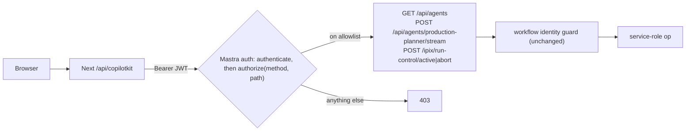

# Plan: IPI-1326 follow-up: deny-by-default Mastra HTTP allowlist (PR #267)


## Context

**What's wrong now:** any signed-in user can call about 400 built-in Mastra admin routes. The only thing blocked today is `/api/workflows/*`.
- Example: an Org B user could `POST /api/datasets` and create shared Mastra data that every tenant sees.
- The privileged workflows are still safe, because the workflow identity guard protects them.
- The real problem is least-privilege: every new Mastra route is exposed by default.

**Goal:** permit only the exact method + path pairs that iPix's Planner client actually calls. Everything else gets a 403.

**Out of scope:**
- The production `/api/copilotkit/info → 500`. That is a deployment problem: there is no reachable standalone Mastra and no `MASTRA_BASE_URL`, so `createRemoteAgents` throws. The Preview step proves it separately.
- The workflow identity guard (`src/mastra/workflow-identity.ts`). It stays unchanged.

**Verified current truth** (branch `claude/intelligent-bohr-bbqs1u`, head `5615178`, in sync with origin):
- Installed versions: `@mastra/server@1.63.2`, `@mastra/client-js@1.42.4`, `@ag-ui/mastra@1.1.4`.
- `authorize(path, method, user, ctx)` is called by `coreAuthMiddleware` (`@mastra/server/dist/helpers-DBAYsA50.js:311`).
  - `path` is Hono `c.req.path`, the pathname with no query string. `method` is `c.req.method`.
  - It runs only for protected paths (the default `/api/*` plus our `/ipix/*`).
  - Mastra's default public routes (`/api`, `/api/auth/*`) and `/health` skip it.
- The Planner's real remote client calls, traced in the `@ag-ui/mastra` bundle `mastra-Bw4VO09B.mjs` and the client-js `dist/index.js`:

| Call site | HTTP | Needed? |
|---|---|---|
| `MastraAgent.getRemoteAgents` → `listAgents()` | `GET /api/agents` | Yes: agent discovery (`src/agent.ts:66`) |
| `remoteAgent.stream()` | `POST /api/agents/production-planner/stream` | Yes: every chat turn, including `useHumanInTheLoop` frontend-tool results, which send a new stream call |
| `remoteAgent.resumeStream()` | `POST /api/agents/production-planner/resume-stream` | **No.** Only runs on a Mastra `suspend()` interrupt. No Planner agent or tool uses `suspend`/`requireApproval`, and HITL is a CopilotKit frontend tool (`shoot-plan-review-hitl.tsx`). |
| Remote `input.state` sync (`getWorkingMemory` / `updateWorkingMemory` / `createMemoryThread`) | `GET/POST /api/memory/threads/:id/working-memory`, `POST /api/memory/threads` | **No.** Only runs when `input.state` is non-empty. There are no `setState` or shared-state callers in `src`, and the adapter catches failures and just warns. The contract test proves this. |
| `MastraControlRunner` | `POST /ipix/run-control/active`, `POST /ipix/run-control/abort` | Yes: Stop (`mastra-control-runner.ts:78`) |
| History / reload | none on Mastra | Owned by CopilotKit Intelligence or the persist runner (`api/copilotkit/[[...slug]]/route.ts`), not Mastra memory HTTP |

- Planner agent id: `production-planner` (`src/mastra/agents/index.ts:92`).



## Implementation (smallest diff)

### 0. Bring #267 up to date with main first

- `git fetch origin main && git merge origin/main` into `claude/intelligent-bohr-bbqs1u`. Main is 41 commits ahead. Use a merge commit, not a rebase.
- Resolve any conflicts by intent.
- Re-check the installed versions, then re-run the route inventory above (the grep over the `@ag-ui/mastra` / client-js bundles) against the merged tree.
- Copy this plan to `docs/plans/2026-09-24-ipi-1326-mastra-route-allowlist.md`.

### 1. Allowlist in `src/mastra/server-auth.ts`

Replace `isDeniedMastraRoute` and its `authorize` with a single exported function:

```ts
/** IPI-1326 — deny-by-default: only the METHOD + path the Planner client uses. */
const ALLOWED_MASTRA_ROUTES = new Set([
  "GET /api/agents",
  "POST /api/agents/production-planner/stream",
  "POST /ipix/run-control/active",
  "POST /ipix/run-control/abort",
]);
export function isAllowedMastraRoute(method: string, path: string): boolean {
  // Strict: Hono supplies the uppercase method; no normalisation (fail closed).
  return ALLOWED_MASTRA_ROUTES.has(`${method} ${path}`);
}
// defineAuth: authorize: async (path, method) => isAllowedMastraRoute(method, path),
```

- **Exact match only.** Encoded, trailing-slash or case variants fail closed, and so does a lowercase method (`get /api/agents` → false).
- The `Set` stays private. Only `isAllowedMastraRoute` is exported.
- No generic `/api/agents/:id/*`.
- `/api/workflows*` is denied implicitly.

### 2. Keep the test probe route working

`tests/mastra-server-auth-http.test.ts` uses `/ipix/test/workflow-identity` as a probe.
- In the test's `Mastra` config only, wrap auth so it allows that probe path and then delegates to `plannerMastraAuth.authorize`.
- Production code is unchanged.
- Remove or replace any test import of `isDeniedMastraRoute`. None exist outside `server-auth.ts` today.

### 3. Denial tests in `tests/mastra-server-auth-http.test.ts`

Use the real `createNodeServer`, authenticated as Org B. Extend the static-URL `switch` helper so Codacy doesn't flag SSRF.

- **403 for admin routes:**
  - `POST /api/datasets`
  - `POST /api/stored/workflows`
  - `GET` and `POST /api/schedules`
  - `GET /api/agent-builder/x/runs` and `POST /api/agent-builder/x/start-async`
  - `GET /api/workflows` and `POST /api/workflows/brand-intelligence/start-async` (existing tests keep passing)
  - `GET` and `POST /api/stored/agents`
  - `GET /api/tools` and `POST /api/tools/x/execute`
  - `GET /api/mcp/v0/servers` and `POST /api/mcp/x/mcp`
- **403 for wrong methods:** `POST /api/agents`, `DELETE /api/agents`, `GET /ipix/run-control/abort`.
- **403 for other agent routes:**
  - `POST /api/agents/production-planner/resume-stream`
  - `POST /api/agents/production-planner/generate`
  - `GET /api/memory/threads`
- **401 is unchanged:** no token, or a bad token, still gets 401 before authorize runs.
- **Allowed paths still work:** `GET /api/agents` returns 200. The existing R1 stream plus the Org A/Org B run-control isolation test must keep passing.
- **Unit table test for `isAllowedMastraRoute`:** trailing slash, lowercase method, `%2F`-encoded path and `HEAD /api/agents` are all false.

### 4. SDK contract test (new `tests/mastra-route-allowlist-contract.test.ts`)

This test drives the **real** client stack and fails CI if a future Mastra/CopilotKit upgrade starts calling a route the allowlist doesn't have.

1. Reuse the harness pattern from step 3: fixture model, `createNodeServer`, the mocked Supabase `getUser`/`org_members`, and the real `plannerMastraAuth`. Register the agent under the id `production-planner`.
2. Record every `(method, path)` that reaches `authorize` by wrapping it in the test.
3. Drive the real clients:
   - `createRemoteAgents(resourceId, "org-a-token")` from `src/agent.ts`, with `MASTRA_BASE_URL` stubbed to the harness URL. This covers agent discovery.
   - `agent.runAgent(...)` with the `RunAgentInput` shape CopilotKit sends: messages, a frontend tool definition and `state: {}`. This covers the Planner stream.
   - Feed a tool result back with a second `runAgent`, the same way `useHumanInTheLoop` completes. This covers the HITL round trip.
   - `MastraControlRunner.getActiveRunId` / `abort` against the same server. This covers Stop.
4. Assert that `isAllowedMastraRoute(method, path)` is true for every observed route and that none got a 403. The `Set` is not exported.
   - If the contract test observes `resume-stream` or memory routes, only then add exactly that route.

**If the contract test shows a route the table above missed:** add exactly that method + path, record why in the plan and PR, and re-run.

### 5. Docs

- Update the `server-auth.ts` header comment.
- Add a short "Allowed Mastra routes" note to the PR #267 body. It is the source of truth for future upgrades.

## Verification

```bash
npx vitest run tests/mastra-server-auth-http.test.ts tests/mastra-route-allowlist-contract.test.ts \
  tests/remote-mastra-boundary.test.ts tests/remote-mastra-cross-process.test.ts \
  tests/intelligence-001.test.ts tests/mastra-control-runner.test.ts
npm test && npm run typecheck && npx --no-install mastra build && git diff --check
```

- `remote-mastra-cross-process` has a known timing failure under full-suite CPU load. It already reproduces on clean `origin/main` (tracked in task_8eda3a3b).
  - If it fails, re-confirm on `origin/main` and report it.
  - Do not touch run-control semantics.
- Run a mutation check: temporarily add `/api/datasets` to the allowlist and confirm the denial test fails.

**GitHub, at the exact head after pushing:**
- CI, Codacy and PR-Agent (`review / verify-review-result`; this may again need the owner to re-run the full PR Agent workflow) must pass.
- Fix only the review findings I can verify. Aim for 0 open BLOCKER/HIGH threads.
- Update the PR #267 body and title scope. Reply on and resolve the threads.

**Merge order (avoids a #267 ⇄ #263 loop):**
1. #267 merges once it is current with main, local proof passes, and exact-head CI and reviews are green.
2. Then #263: merge main, deploy one standalone Mastra Preview, set `MASTRA_BASE_URL`, redeploy the frontend, and run the certification below.
3. IPI-1308 and IPI-1326 are marked Done or production-certified only after the Preview proof passes. Merging is not Done.

**Preview production proof (needs you; it runs through #263 after #267 merges):**
1. Deploy one standalone Mastra on a stable HTTPS host with `IPIX_MASTRA_HOSTED=1`, `SUPABASE_URL`, `SUPABASE_PUBLISHABLE_KEY` and `MASTRA_DATABASE_URL`. No `127.0.0.1` or trycloudflare URL.
2. Set `MASTRA_BASE_URL` on Vercel Preview and redeploy the frontend.
3. Check each of these:
   - `/api/copilotkit/info` returns 200, and the `default` Planner is found.
   - Chat streams, and Brand Intelligence starts.
   - Stop works, and a stale Stop(R1) cannot stop R2.
   - Reload shows the history.
   - Org B cannot inspect or stop Org A's run.
   - `curl` with a valid JWT to `/api/datasets` and `/api/workflows` returns 403.

**Linear:** after #267 merges, update IPI-1326 and IPI-1308 with the route list and test evidence, and keep them "In Review" until the Preview proof passes.

## Critical files

- `src/mastra/server-auth.ts` (the only production change)
- `tests/mastra-server-auth-http.test.ts` (extended)
- `tests/mastra-route-allowlist-contract.test.ts` (new)
- `docs/plans/2026-09-24-ipi-1326-mastra-route-allowlist.md` (this plan)

**Reused as-is:** `createRemoteAgents` and `createMastraClientForRequest` (`src/agent.ts`), `MastraControlRunner` (`src/lib/copilotkit/mastra-control-runner.ts`), `plannerRunControlRoutes` (`src/mastra/run-control-routes.ts`), and the existing test harness mocks.
