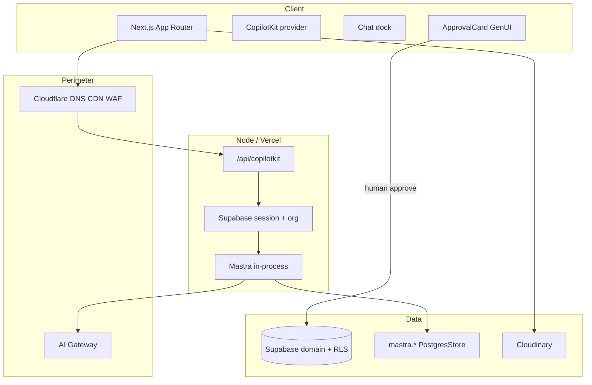

# iPix V2 — Product Requirements Document

**Status:** Master specification · Baseline V2
**Baseline date:** 2026-08-24
**Last verified against current repo:** 2026-09-17
**Author:** iPix Core Architecture Team
**Repository:** [amoai-tech/ipixai](https://github.com/amoai-tech/ipixai) (`this repository`)
**This file is the product SSOT.** Other PRDs are companions or drafts.

| Document | Role |
|---|---|
| **This page** (`docs/prd.md`) | Product requirements master |
| **[Product sitemap](./sitemap.md)** | Product routes and phases (not HTML prototype counts) |
| **[Live execution board](https://linear.app/amo100/project/v2-ipix-cd2f90b58cd2/issues)** | Task status, blockers, ownership, and current execution |
| **[Documentation map](./docs-index.md)** | Current documentation map and source-of-truth routing |
| **[ADR 001](./adr/001-node-first.md)** | Start of the accepted architecture decision set |
| internal architecture annex (not published) | Long-form architecture annex |
| internal alternate draft (not published) | Alternate draft — **do not treat as SSOT** |
| historical migration/rebuild plans | Preserved in Git as evidence; not current architecture authority |

The numbered rebuild guides (`docs/01`–`14`) remain historical. This PRD is the V2 product SSOT.

---

## 1. Source of truth

When docs, legacy code, and runtime disagree:

1. **Live Supabase production schema / data contracts** (system of record) — read/audit only until Wave 4 gold; do not mutate production during Core work.
2. **This PRD** (`docs/prd.md`) plus the [product sitemap](./sitemap.md) for routes.
3. **Accepted ADRs** in `docs/adr/` (001–004 today; 005+ proposed below).
4. **This repo** (`this repository`) implementation.
5. **Legacy** `legacy lumina-studio checkout` and lumina-studio — reference for UX and domain logic, **not** V2 architecture.

**Legacy policy:** Reuse proven business rules, schemas, prompts, and screen IA. Do not copy Worker/OpenNext, Hyperdrive, ALS, custom Copilot SSE shims, `MASTRA_STORAGE_MODE=noop`, `resourceId: "default"`, or combined `npm run dev`.

### 1.1 Requirement tags

| Tag | Meaning |
|---|---|
| `[VERIFIED]` | Confirmed against live schema, installed packages, or running code |
| `[REQUIRED]` | Must ship for the named phase |
| `[PROPOSED]` | Preferred design, not yet accepted as ADR |
| `[TARGET]` | KPI to measure, not a hard gate until instrumented |
| `[DEFERRED]` | Out of this phase |
| `[LEGACY]` | Reference only |

### 1.2 Stack truth (this repo)

**Today `[VERIFIED]`:** Next.js App Router + CopilotKit v2 (`/api/copilotkit`) + AG-UI + Mastra are implemented. The current package family is Next.js `16.1.2`, CopilotKit `1.68.1`, `@ag-ui/mastra` `1.1.4`, and `@mastra/core` `1.63.2`. Hosted Mastra uses guarded `PostgresStore` storage in the private `mastra` schema (`schemaName: "mastra"`, `disableInit: true`) when `MASTRA_DATABASE_URL` is configured; hosted mode fails closed if that database is missing or unapproved. Local development may fall back to in-memory LibSQL. CopilotKit identity/resource scope is derived server-side by the authenticated planner session; the old `demo-user` bootstrap path is gone.

**Production runtime shape `[REQUIRED]`:**

```text
Next.js App Router (Node / Vercel)
  → CopilotKit v2 runtime (`/api/copilotkit`)
  → AG-UI (`@ag-ui/mastra`)
  → Mastra agents / tools / static workflows
  → PostgresStore in private `mastra.*`
  → Existing Supabase (Auth, RLS, domain RPCs)
```

- **Chat/UI runtime:** CopilotKit (`@copilotkit/*`) — not a custom Worker Copilot SSE shim.
- **Dev:** `npm run dev:ui` (port 3000) and `npm run dev:agent` (port 4111) in **separate** terminals. Combined `npm run dev` is blocked (**DEV-STAB-001**).
- **Media:** Cloudinary is the media layer. The `cloudinary` Node SDK plus a server-only config module (`src/lib/cloudinary/`) drive signed uploads and webhooks, with the signing/webhook API routes under `src/app/api/cloudinary/`. `next-cloudinary` is **not** installed — the React SDK is deliberately not used; the client never holds the API secret. Remaining media task status belongs to Linear. Do not invent a second CDN pipeline.
- **Models:** OpenAI SDK in the starter today; production routing via Cloudflare AI Gateway (Gemini failover) `[PROPOSED]`.

---

## 2. Problem and solution

Fashion production runs on spreadsheets, email, and tools that do not know Brand DNA. Deals, shoots, casting, bookings, and assets are re-typed across silos.

**iPix V2** is an AI-native fashion production OS: a 3-panel operator workspace (nav, canvas, intelligence) plus in-process Mastra agents. AI drafts Brand DNA, deliverables, shot lists, 5-week DAG schedules, talent matches, booking offers, and CRM notes. **AI reads, computes, and proposes. Humans approve. Authenticated RPCs with the user JWT commit domain writes.**

### 2.1 Pillars

1. **Vercel + Node `[VERIFIED]`** — ADR-001. CopilotKit/Mastra host is **Vercel**. Cloudflare = DNS/CDN/WAF (and optional AI Gateway later). **Workers are not the AI host** — **IPI-1121** is future.
2. **Supabase tenancy `[REQUIRED]`** — ADR-003. Org from membership, server-side. Fail closed. The CopilotKit route now derives operator/resource identity from the verified session; cross-org release certification remains a test requirement.
3. **Mastra memory vs domain `[VERIFIED]`** — ADR-002. `mastra.*` is conversation/traces; `shoot.*` / `planner.*` / `talent.*` / `crm.*` are product truth.
4. **HITL writes `[REQUIRED]`** — Approval cards → RPC. No agent `INSERT` into domain tables.

---

## 3. Vision, principles, KPIs

**Vision:** A brand-aware digital crew that cuts operational grind without taking creative or commercial control from humans. (80% overhead cut is a **hypothesis**, not an MVP gate.)

**Principles:** stream, don’t spinner · every recommendation cites evidence · AI drafts / humans decide · canvas and chat share state · missing org/user → 401/403.

| KPI | MVP target | Tag | How |
|---|---|---|---|
| Brand URL → approved DNA | < 10 min | `[TARGET]` | Telemetry submit → approve |
| Brief → reviewable 3-gate plan | < 5 min | `[TARGET]` | Telemetry |
| Manual planning steps cut | ≥ 60% | `[TARGET]` | vs legacy baseline |
| AI proposals accepted with no major rewrite | ≥ 70% | `[TARGET]` | approve / minor-edit vs reject |
| Cross-tenant leakage | **0** | `[REQUIRED]` | CI isolation tests |
| Duplicate domain commits | **0** | `[REQUIRED]` | idempotency keys |
| Domain mutations audited | **100%** | `[REQUIRED]` | audit rows |
| Critical journeys E2E green | **100%** | `[REQUIRED]` | Playwright |

---

## 4. Goals and non-goals

### Goals

| ID | Goal | Phase |
|---|---|---|
| G-1 | Brand DNA from a public URL in < 2 min active operator time | **MVP** |
| G-2 | One action instantiates an 11-phase 5-week shoot DAG | MVP |
| G-3 | Chat + working memory survive hard refresh **and** agent restart (`PostgresStore`) | **Core** |
| G-4 | Org B cannot read Org A threads, shoots, assets, or CRM | **Core** |
| G-5 | Mastra/CopilotKit decoupled from domain DB and Cloudinary | Core |
| G-6 | Reuse proven domain logic; rebuild only the runtime | All |
| G-7 | One operator workspace (shell from MVP; Core is the thin Planner page) | Core→MVP |

### Non-goals

- Native iOS/Android (web ≥768px; phone after MVP).
- Two-way Google/Outlook calendar (read-only `.ics` only).
- In-house render farm / image generator (Cloudinary).
- Full PERT/CPM resource leveling (direct DAG links only).
- Custom storefront (Medusa/Mercur stays commerce).
- General-purpose shell agents, A2A/ACP, GraphRAG, extra vector DBs, observational memory in Core.
- Full WhatsApp automation, invoices/payments/contracts in Core.
- Cloudflare Workers as the CopilotKit/Mastra host (**IPI-1121**) — future only; current host is **Vercel**.
- Catalog / collections / PDP / events / `/app/model` / `/app/roster` in Core/MVP nav.

---

## 5. Personas and roles

| Persona | Role key | Phase | Needs |
|---|---|---|---|
| Executive / studio owner | `org_admin` | Core | Billing, team, final budget/contract |
| Senior producer | `producer` | Core | Timeline, call sheet, crew, budget variance |
| Creative director | `creative_director` | Core | Brand DNA, shot lists, asset QC |
| Sales / relationships | `sales_rep` | MVP | Pipeline, contacts, deal → shoot |
| External talent / crew | `collaborator` | Post-MVP | Call sheets, dates, uploads; **no** internals finance |

Planner ACL (ADR-008 `[PROPOSED]`): `owner > manager > contributor > viewer`.

---

## 6. Journeys

1. **Brand DNA `[MVP]`** — URL → crawl/vision → `BrandDNACard` → Approve → `promote_brand_draft` RPC. Fail: manual intake + upload. Not Core (Core is persist + the `/app` Production Copilot only; IPI-1225 · PLANNER-ROUTE-RETIRE-001 retired `/planner` to a compatibility redirect).
2. **3-gate shoot `[MVP]`** — Deliverables → shot list → budget → `commit_shoot_draft` → `shoot.*` + `planner.instances`. **Not** Core.
3. **Production DAG `[MVP UI; schema Core-ready]`** — Topological shift on slip; cycle detection before write.
4. **Talent + booking `[MVP]`** — Separate routes: `/app/matching/talent/[id]/book` and `/app/bookings/[id]`. **Not** Shoot Wizard `flow=booking`.
5. **CRM `[MVP]`** — Companies / contacts / pipeline; won deal → ApprovalCard → Brand. Legacy React is real; still **not** Core.

**Failures `[REQUIRED]`:** crawl fail → manual; LLM outage → AI Gateway failover; reject → edit/regenerate; concurrent edit → optimistic lock + diff; lost SSE → resume token + PostgresStore; double-click → idempotency key.

---

## 7. Product sitemap (summary)

Canonical routes: **[Product sitemap](./sitemap.md)**.

| Phase | Authenticated surfaces |
|---|---|
| **Core** | `/login` (minimal) + **`/app`** — Operator Shell with the Production Copilot embedded (`/planner` is now a compatibility redirect only) |
| **MVP** | Shell + `/app`, `/app/brands`, `/app/shoots`, campaigns, assets, preview, matching/book, bookings, CRM, inbox, settings, `/onboarding` |
| **Post-MVP** | `/app/analytics`, `/app/plans/*` (legacy production workspace), talent self-serve |
| **Advanced** | Catalog, collections, PDP, events, collab graph |

This repo today already includes marketing/auth/onboarding pages, authenticated operator routes, brands, shoots, plans, the Planner, and API routes. HTML in `Universal-design-prompt-4/Pages/` remains design reference; route files and verified runtime behavior determine what is actually implemented.

---

## 8. Architecture



**Write path `[REQUIRED]`:** Browser JWT → CopilotKit → Mastra **read/compute/propose** → GenUI → operator Approve → `SECURITY DEFINER` RPC (`REVOKE` from `anon`) → domain row + audit.

**Memory `[REQUIRED]`:** `resourceId` built **server-side** as `org:{orgId}::user:{userId}` (current server contract in `src/lib/auth/verified-operator.ts`). Do not switch to a single colon without migrating existing strings. `disableInit: true` in production; migrations own `mastra.*` DDL.

---

## 9. Agents (Mastra)

| Agent | Phase | May | Must not |
|---|---|---|---|
| `production-planner` (default) | Core | Pure compute: shoot type, deliverables, budget, shot-list draft, JWT reads | Domain INSERT/UPDATE |
| `creative-director` | MVP | DNA scoring, brief draft | Publish |
| `brand-intelligence` | MVP | Crawl/analyze/draft | `promote_brand_draft` without HITL |
| `crm-assistant` | MVP | Search, propose activity/stage | Won/lost without HITL |
| `booking-agent` / `model-match` | MVP | Rank, quote draft, offer draft | Confirm booking / send contract |

Tools are compute or authenticated reads. Mutations are RPCs after ApprovalCard.

---

## 10. Supabase `[REQUIRED]`

Existing iPix project — no greenfield DB.

- Schemas: `public`, `shoot`, `planner`, `talent`, `crm` vs private `mastra.*`.
- RLS on every exposed tenant table; `is_org_member(org_id)`; fail closed.
- Canonical shoots: `shoot.shoots`. Freeze `public.shoots`.
- Types: `supabase gen types typescript` → `src/types/database.ts`.
- Local baseline dumps must **not** be pending on `db push --linked`. Do not `GRANT` extra privileges on domain objects to `authenticated`/`anon`, and do not `TRUNCATE` tenant tables as a substitute for migrations.

---

## 11. HITL and audit `[REQUIRED]`

Agents **may:** RLS-scoped read, deterministic compute, GenUI proposal, Mastra memory write, request approval.
Agents **must not:** create shoots, send booking offers, sign budgets, move CRM stages, send external mail/WhatsApp.

Every approval + commit: `org_id`, `user_id`, `proposal_id`, `version`, `action_type`, `created_at`, target table/id.

---

## 12. Accessibility `[REQUIRED]`

WCAG 2.1 AA. Full keyboard. Semantic landmarks + `aria-live` on streams. Breakpoints: 3-panel ≥1440; collapsible intel 1024–1439; tablet 768–1023; **&lt;768 deferred**. Skeletons matching card layout; no blank flashes.

---

## 13. Phases (must match sitemap)

**Dependency:** Supabase harden → Auth/org → Mastra PostgresStore gold → CopilotKit → **`/app` Production Copilot** → Operator Shell → Brand/Shoots → Wizard/CRM/Booking.

| Phase | Name | In | Out |
|---|---|---|---|
| 0 / Core | Persistence + Planner proof | Pin CopilotKit/Mastra bundle; `PostgresStore`; `TEST-PERSIST-UUID`; Org B 403; `/planner` compute tools | Operator Shell, Command Center, CRM, booking writes |
| 1 / MVP spine | Shell + Brand + Shoots | Zeely tokens, nav, intel panel, chat **rebuilt** on CopilotKit, Brand, Shoots list/detail | Worker chat dock copy-paste |
| 2 / MVP complete | Wizard + CRM + booking + media | 3-gate wizard, Brand crawl, CRM six screens, matching + booking routes, Cloudinary signed upload | `/app/plans` mutations, talent two-sided |
| 3 / Post-MVP | Plans workspace + analytics + talent | `/app/plans`, analytics honesty, availability, role dashboards | Worker AI host unless gold exists |

---

## 14. Acceptance criteria

| ID | Criterion | Phase |
|---|---|---|
| AC-01 | `TEST-PERSIST-UUID` survives refresh **and** agent restart from `mastra` messages | Core |
| AC-02 | Org B + Org A `threadId` → **403** with a JSON error envelope and **no thread/message content** (clients still distinguish 401 vs 403) | Core |
| AC-03 | Brand URL → DNA card &lt; 120s; no domain write until Approve | MVP |
| AC-04 | 3-gate commit exact rows in `shoot.*` + `planner.instances` &lt; 1.5s | MVP |
| AC-05 | +3 business days on predecessor shifts successors &lt; 15ms; no cycles | MVP |
| AC-06 | 100% domain mutations audited | Core+ |
| AC-07 | Double-click commit → one row | Core+ |

---

## 15. Test strategy `[REQUIRED]`

| Layer | Scope | Gate |
|---|---|---|
| Unit | Budget math, DAG cycles, Zod | Every commit |
| Tool | Agent registry, fail-closed JWT | PR |
| pgTAP / RLS | Org isolation, DEFINER grants | Migration PRs |
| Stream | CopilotKit SSE / AG-UI shapes | CI |
| E2E | Persist + restart + 403 | PR required |

Do not claim production-ready without a labeled verification level (unit / build / local runtime / preview / production).

---

## 16. ADRs

**Accepted (files exist):**

| ADR | File | Decision |
|---|---|---|
| 001 | [001-node-first.md](./adr/001-node-first.md) | Node/Vercel first |
| 002 | [002-mastra-owns-ai-memory.md](./adr/002-mastra-owns-ai-memory.md) | `mastra.*` vs domain |
| 003 | [003-supabase-owns-tenancy.md](./adr/003-supabase-owns-tenancy.md) | Server-derived org |
| 004 | [004-compatibility-bundle.md](./adr/004-compatibility-bundle.md) | CopilotKit + AG-UI + Mastra one PR |

**Proposed (write ADR before coding):**

| ID | Topic |
|---|---|
| 005 | Cloudinary as sole transform/delivery; DB stores ids/URLs |
| 006 | HITL write gate (formalize §11) |
| 007 | Static Mastra workflows over dynamic graphs |
| 008 | Planner four-tier roles |
| 009 | Canonical `shoot.shoots` |
| 010 | Cloudflare AI Gateway model routing |

---

## 17. Risks

| ID | Risk | Sev | Mitigation |
|---|---|---|---|
| R-01 | CopilotKit/Mastra independent bump | P0 | ADR-004 + contract tests |
| R-02 | Wrong `resourceId` leaks threads | P0 | Server helper + 403 E2E |
| R-03 | `anon` EXECUTE on DEFINER RPCs | P1 | REVOKE/GRANT audit |
| R-04 | Mastra snapshot bloat | P1 | Retention job |
| R-05 | Code hits `public.shoots` | P1 | Freeze + types on `shoot.*` |
| R-06 | LLM rate limits | P2 | AI Gateway failover |
| R-07 | Cyclic planner DAG | P2 | `detectCycles` before shift |
| R-08 | SSE proxy timeout | P2 | Heartbeat + resume |
| R-09 | Unsigned Cloudinary uploads | P2 | Server-signed, short-lived |
| R-10 | Combined `npm run dev` | P2 | Keep script blocked |

---

## 18. Open decisions

1. Global Intelligence panel vs `/app/intelligence` page — **keep panel for MVP**.
2. Local default model: OpenAI starter vs Gemini — **OpenAI locally; Gateway Gemini in staging**.
3. Observational memory — **Phase 3**.
4. Brand vs CRM company naming — **keep both** (DNA vs relationship).

---

## 19. Linear tracks (one concern per issue)

| Epic | Canonical title (file Linear issues before scheduling) |
|---|---|
| Persistence | `IPI-TBD · CORE-001 — Pin bundle, PostgresStore, persist + restart gold` |
| Auth / tenancy | `IPI-TBD · AUTH-002 — Session/org, RLS/RPC, cross-tenant 403` |
| Planner agent | `IPI-TBD · AGENT-003 — Production Planner compute tools + JWT reads` |
| Operator UI | `IPI-TBD · UI-004 — Shell + CopilotKit dock rebuild + ApprovalCard` |
| Planner page | `IPI-TBD · PLAN-005 — /app Production Copilot Core surface; /app/plans later` |
| MVP flows | `IPI-TBD · FLOW-006 — 3-gate shoot, brand crawl, Cloudinary, booking routes` |

Replace `IPI-TBD` with the live Linear identifier when the issue exists. No bare `CORE-001` in roadmaps.

---

## 20. Legacy → V2

| Artifact | Decision | Phase |
|---|---|---|
| Zeely tokens + 3-panel shell | KEEP / COPY+CLEAN | MVP (not Core) |
| Planner prompts + 3-gate rules | PORT | Core/MVP |
| Pure shoot compute libs | PORT | Core |
| Shoot wizard workflow | REWRITE on static Mastra | MVP |
| Brand crawl | REWRITE; bounded payloads + RPC | MVP |
| CRM workspaces + tests | PORT | MVP |
| `planner.*` engine | KEEP schema; Hub UI later as `/app/plans` | Post-MVP |
| Custom Copilot route / Worker / ALS / in-memory runner | DROP | — |
| `public.shoots` | FREEZE | Core |
| HTML `Pages/*.dc.html` | REFERENCE only | — |

Reuse ~domain/UI; drop ~runtime glue. Do not rebuild 40 screens from blank.

---

## 21. Readiness

- **SSOT:** this file + `sitemap.md` + accepted ADRs.
- **Core gate:** AC-01 + AC-02 before Operator Shell.
- **Do not** `supabase db push --linked` with un-ledgered baseline dumps.
- Companion PRDs that treat HTML prototypes as shipped product (“31 screens built”) or that prescribe a custom Worker Copilot SSE runtime are **stale** relative to this repo.
