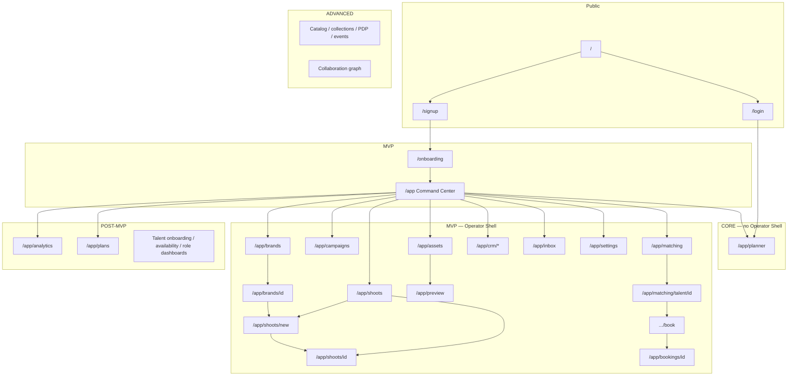

# iPix V2 — Product sitemap

**Status:** Product route SSOT (aligned with [Product requirements](./prd.md))
**Baseline date:** 2026-08-24
**Last verified against current repo:** 2026-09-17
**This file is the application map for V2.** HTML prototypes are design reference only.

| Source | Use for |
|---|---|
| **This file** | Routes, phases, nav, booking vs shoot |
| [Live execution board](https://linear.app/amo100/project/v2-ipix-cd2f90b58cd2/issues) | Task status, blockers, and current execution |
| [Documentation inventory](./DOCS-INDEX.md) | Current Keep / Update / Archive / Remove map; legacy route audits are historical evidence |
| `Universal-design-prompt-4/Pages/*.dc.html` | Visual SCR mockups (not “built in this repo”) |

**This repo today `[VERIFIED]`:** real Next.js routes exist for marketing/auth/onboarding, `/app`, `/app/brands`, `/app/shoots`, `/app/plans`, and `/app/planner`, plus API routes. HTML prototypes remain design reference; route files and verified runtime behavior determine what is shipped.

---

## 0. How to read

Two different “Planner” names:

| Name | What it is | Phase |
|---|---|---|
| **AI Production Planner** | CopilotKit + Mastra `production-planner` on `/app/planner` | **Core** (only authenticated product page) |
| **Production workspace** | Timeline / Kanban / Calendar around `planner.*` | **Post-MVP** as `/app/plans` (legacy `/app/planner` hub) |

**Core does not include** Operator Shell, Command Center, CRM, or booking writes.

---

## 1. Corrections vs the July HTML sitemap

The previous root `SITEMAP.md` (2026-07-06) was wrong as a product map. These rules replace it:

| Topic | Old (incorrect) | V2 (this file) |
|---|---|---|
| What “built” means | 31 HTML screens 🟢 | React routes and verified behavior in **this** repo; legacy/design files are reference only |
| Core surface | Implied full operator app | **`/app/planner` only** |
| Brand | `/app/brands` | `/app/brands` |
| Shoot create | `/app/shoots/new` | `/app/shoots/new` |
| Onboarding | `/onboarding` and `/onboarding` mixed | `/onboarding` |
| CRM | `/app/crm/companies` · `/contacts` · schema “not built” | `/app/crm/companies` · `/contacts` · **legacy React is real**; still **MVP not Core** |
| Booking | Shoot Wizard `flow=booking` | **`/app/matching/talent/[id]/book`** + **`/app/bookings/[id]`** |
| Talent profile | `/app/matching/talent/[id]` as live | Same path in V2; **rebuild** (legacy used `?talentId=` on `/app/talent/profile`) |
| Catalog / collections / events / `/app/model` / `/app/roster` | In nav or ⚪ | **Dropped from V2 nav** until Advanced |
| SCR-18 collab | 🟢 and ⚪ in the same doc | Advanced / Inbox covers MVP |
| Planner HTML SCR-32–35 | Missing from “complete” 31-row table | Core = AI page; workspace = `/app/plans` Post-MVP |
| Prototype path | `Pages/` at repo root | `Universal-design-prompt-4/Pages/` |
| Settings | Missing | `/app/settings` (MVP) |

**HITL still holds:** no AI auto-book, auto-confirm, or auto-publish.

---

## 2. Route tree

```text
PUBLIC
/
├── login                      # Core: minimal auth
├── signup
└── (optional) pricing         # not in MVP nav

/onboarding                    # MVP — brand DNA funnel
                               # drop duplicate /app/onboarding except redirect

APP
/app                           # MVP Command Center — skip in Core
├── planner                    # CORE — AI Production Planner (only Core page)
├── brand
│   └── [id]
├── shoots
│   ├── new                    # 3-gate wizard (MVP)
│   └── [id]
├── campaigns
├── assets
│   └── [id]
├── preview                    # Channel Preview
├── matching
│   └── talent/[id]
│       └── book               # booking wizard (not shoot flow=booking)
├── bookings/[id]
├── crm
│   ├── companies[/id]
│   ├── contacts[/id]
│   └── pipeline[/id]
├── analytics                  # Post-MVP
│   └── campaigns
├── inbox
├── settings                   # new; do not port Cloudflare env UI
└── plans                      # Post-MVP production workspace
    ├── dashboard
    └── [id]
        └── settings

TALENT (Post-MVP)
/app/talent/onboarding
/app/talent                    # self profile
```

Dropped from V2 nav: `/services/*`, `/app/catalog`, `/app/collections`, `/app/events`, `/app/model`, `/app/roster`.

---

## 3. Phased map



---

## 4. Screen inventory (product routes)

Status = V2 intent, not HTML completeness.

| Phase | Route | Job | Design SCR (HTML) |
|---|---|---|---|
| Core | `/login` | Auth | — |
| Core | `/app/planner` | AI Production Planner | SCR-32–35 (workspace visuals; Core UI is thin) |
| MVP | `/signup` | Signup | — |
| MVP | `/onboarding` | Brand DNA funnel | SCR-11 |
| MVP | `/app` | Command Center | SCR-01 |
| MVP | `/app/brands` · `/[id]` | Brand list/detail | SCR-02, 03 |
| MVP | `/app/shoots` · `/new` · `/[id]` | Shoots + 3-gate wizard | SCR-04, 06, 05 |
| MVP | `/app/campaigns` | Campaigns | SCR-07 |
| MVP | `/app/assets` · `/[id]` | Assets | SCR-08 |
| MVP | `/app/preview` | Channel preview | SCR-10 |
| MVP | `/app/matching` | Talent match (talent tab only) | SCR-09 |
| MVP | `/app/matching/talent/[id]` | Talent profile | SCR-20 |
| MVP | `.../book` | Booking wizard | SCR-21 **as own route** |
| MVP | `/app/bookings/[id]` | Booking detail | SCR-22 **as own route** |
| MVP | `/app/crm/companies[/id]` | Companies | SCR-26, 27 |
| MVP | `/app/crm/contacts[/id]` | Contacts | SCR-28, 29 |
| MVP | `/app/crm/pipeline[/id]` | Pipeline / deal | SCR-30, 31 |
| MVP | `/app/inbox` | Notifications | SCR-15 |
| MVP | `/app/settings` | Org/profile | — |
| Post-MVP | `/app/analytics` · `/campaigns` | Analytics (honest empty paid KPIs) | SCR-16, 17 |
| Post-MVP | `/app/plans/*` | Production DAG workspace | SCR-32–35 |
| Post-MVP | `/app/talent/*` | Talent self-serve | SCR-24 |
| Post-MVP | availability + role dashboards | Rebuild | SCR-23, 25 |
| Advanced | catalog / collections / PDP / events / collab route | Out of nav | SCR-12, 13, 14, 18, 19 |

---

## 5. Navigation

**Core:** no rail. Authenticated user lands on `/app/planner`.

**MVP desktop rail:** Home · Brands · Shoots · Matching · Assets · Campaigns · Inbox · CRM · Planner. CRM expands to Companies / Contacts / Pipeline. Settings in user menu.

**MVP chrome:** Nav │ Workspace │ Intelligence (read-only) + CopilotKit dock. Rebuild dock; do not copy Worker `dynamic()` chat.

**Mobile:** Core and MVP are desktop-first (≥768px). Rebuild bottom nav **Post-MVP** with phone support; do not put a mobile tab bar in MVP while sub-768 viewports are deferred.

**Talent Post-MVP rail:** Dashboard · Offers · Availability · Inbox.

---

## 6. Journeys (routes)

- **Brand:** `/onboarding` → `/app` → `/app/brands/[id]`
- **Shoot:** `/app/shoots` → `/app/shoots/new` → `/app/shoots/[id]` → `/app/assets`
- **Booking:** `/app/matching` → `/app/matching/talent/[id]` → `.../book` → `/app/bookings/[id]` → crew on shoot detail
- **CRM:** `/app/crm/companies/[id]` (`brand_id` → brand detail) · pipeline won → ApprovalCard → brand
- **Core proof:** `/login` → `/app/planner` → persist + restart + Org B 403 (PRD AC-01, AC-02)

---

## 7. AI surfaces

- **Intelligence panel:** read-only briefing. Never the chat.
- **CopilotKit dock:** only conversation UI.
- **Core assistant:** `production-planner` compute tools only.
- **MVP assistants:** brand, creative, matching, booking (draft only), CRM (draft only).

---

## 8. Design HTML (not product)

Prototypes live in `Universal-design-prompt-4/Pages/`. Useful for layout/HITL; **not** a route registry.

Do not cite `Pages/` at repo root, `docs/handoff/SCREEN-REGISTRY.md`, or July “15 verified / 31 production” as implementation truth.

---

## 9. Port order after Core gold

1. Tokens + empty/error/skeleton
2. Operator Shell + intelligence panel
3. CopilotKit dock rebuild
4. Brand list/detail → Shoots list/detail → Command Center (aggregator last)
5. Channel preview
6. CRM companies + detail
7. Matching talent tab

Do not port first: 10-step HTML wizard (code is ~6 steps), 13-screen onboarding HTML, paid analytics KPIs, `/app/plans` mutations, availability, role dashboards, SCR-18 as a route.
