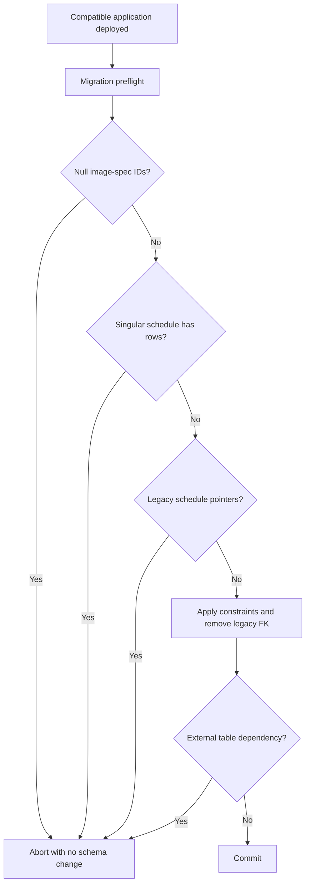
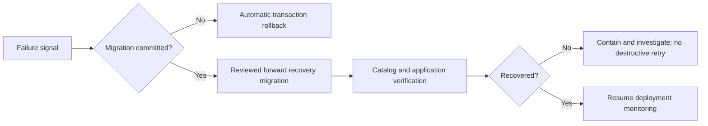

# IPI-1161 schema reconciliation deployment and recovery

This runbook covers `20260909124501_reconcile_public_schema_with_live.sql`. The normal production path is the reviewed Supabase GitHub Integration after merge; do not manually run `db push --linked`, `migration repair`, or `db reset --linked` against production.

## Compatibility and preflight

Deploy application compatibility before the migration. The current application already satisfies that order: `src/` has no use of singular `public.event_schedule` or `call_times.schedule_item_id`, its shared clients use the generated `Database` contract, and `src/lib/shoot/channel-specs.ts` treats both image-spec identifiers as required lookup keys.

The migration checks every data-sensitive prerequisite before DDL:

- `image_specs.platform_id` and `image_specs.image_type_id` contain no nulls;
- `public.event_schedule` is either absent or empty;
- `public.call_times.schedule_item_id` has no non-null legacy pointers;
- `drop table ... restrict` finds no unexpected external dependency after the known legacy foreign key is removed.

All statements run in one explicit transaction. A failed preflight, constraint change, or dependency check rolls the transaction back. Do not bypass a failing guard. Capture the target's read-only catalog and row counts, determine ownership of the unexpected state, and use a separate reviewed forward migration.



No backup is needed for the singular schedule table on the allowed path because only an absent or empty table can be dropped. If a target contains rows or legacy pointers, the migration makes no changes; preserve/export the unexpected data and reconcile it with the owning schedule model before retrying.

## Migration-ledger distinction

`public.supabase_migrations` is a legacy application audit table created by the reconciliation migration. It is **not** the Supabase CLI migration ledger.

The authoritative CLI ledger is:

```text
supabase_migrations.schema_migrations
```

Use the CLI ledger to verify whether migration `20260909124501` is deployed. Do not infer deployment state from `public.supabase_migrations`.

## Deployment verification

After the integration reports success, verify the exact deployed migration and read the catalog without mutating production:

```sql
select to_regclass('public.event_schedule') as retired_table;
select to_regclass('public.event_schedules') as active_plural_table;
select to_regclass('shoot.shoots') as private_shoot_table;

select column_name, is_nullable
from information_schema.columns
where table_schema = 'public'
  and table_name = 'image_specs'
  and column_name in ('platform_id', 'image_type_id')
order by column_name;

select conname
from pg_constraint
where conrelid = 'public.call_times'::regclass
  and conname = 'call_times_schedule_item_id_fkey';

select count(*) as legacy_schedule_pointers
from public.call_times
where schedule_item_id is not null;

select conname
from pg_constraint
where conrelid = 'shoot.shoots'::regclass
  and conname = 'shoots_brand_id_fkey';
```

Expected results: singular table `null`; plural schedule and private shoot tables present; both image-spec columns report `NO`; removed call-times constraint returns zero rows; legacy pointer count is `0`; private `shoot.shoots_brand_id_fkey` remains present.

Then verify migration `20260909124501` in `supabase_migrations.schema_migrations`, run exact-main fresh replay, and run `npm run supabase:types:check`; regeneration must leave `src/lib/supabase/database.types.ts` unchanged.

## Failure and forward recovery

Rollback triggers are a failed migration/integration, an unexpected application error involving schedule or image-spec reads, or any mismatch in the verification queries above.

- If deployment fails before commit, PostgreSQL rolls back the transaction. Investigate the guard/error and retry only through a reviewed replacement migration.
- If a post-commit application regression requires nullable image-spec identifiers, ship a reviewed forward migration with:

  ```sql
  alter table public.image_specs
    alter column platform_id drop not null,
    alter column image_type_id drop not null;
  ```

- If the legacy foreign key must be restored, first restore `public.event_schedule` and its RLS policies/indexes from `supabase/migrations/20250125000010_create_scheduling_availability.sql` in a new reviewed forward migration. Then validate existing pointers without blocking the table rewrite:

  ```sql
  alter table public.call_times
    add constraint call_times_schedule_item_id_fkey
    foreign key (schedule_item_id)
    references public.event_schedule(id)
    on delete cascade
    not valid;

  alter table public.call_times
    validate constraint call_times_schedule_item_id_fkey;
  ```

  Validation failure means existing pointers do not have matching restored schedule rows. Stop and reconcile those rows; do not delete or null them automatically.



Recovery is forward-only. Do not rewrite applied migration history, restore the retired table/FK through ad hoc production SQL, or use destructive linked reset commands on production.
