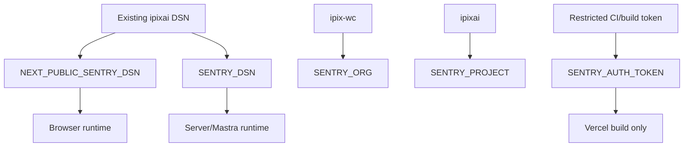
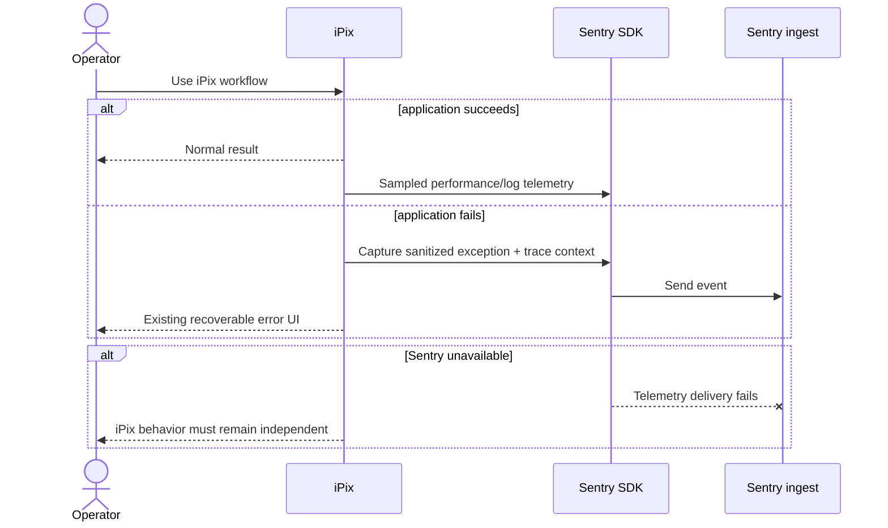
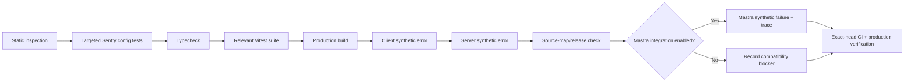

# iPix Sentry Observability Design

**Date:** 2026-09-23
**Branch:** `feat/sentry-observability`
**Base:** clean `origin/main` at `527caf41c030a63c575ec99aed3119b1b4236046`
**Linear:** IPI-71 · PLT-009 — Monitoring & Alerting (existing umbrella; Sentry is explicitly the managed application-observability service)

## Summary

**Outcome:** connect the current iPix Next.js + Mastra runtime to the existing Sentry project `ipix-wc/ipixai` so browser, server, release/source-map, and AI-agent failures become observable without exposing secrets or sensitive payloads.

**Faster/better approach:** use Sentry's official Next.js wizard and first-party SDK integrations. Reuse the existing Sentry project and existing local build token. Do not create another Sentry project, custom telemetry transport, or Internal Integration unless a later webhook/API use case proves it is needed.

## Verified current state

- `origin/main` uses Next.js `16.3.5` and Node `24.x`.
- `@sentry/nextjs` is absent from `origin/main`.
- No Sentry instrumentation files or `withSentryConfig()` exist on `origin/main`.
- `@mastra/core` is `1.63.2`; `@mastra/observability` is absent.
- Existing route error boundaries render retry UI but do not report exceptions.
- Existing Sentry project: `ipix-wc/ipixai`, project ID `4512055224827904`.
- Historical Sentry data proves an older SDK setup sent events, sessions, replays, logs, and releases.
- Current Vercel project `ipixai` has no `SENTRY_*` environment variables.
- `.env.sentry-build-plugin` exists locally, is ignored by Git, and contains a build auth token.
- Current Sentry issues are development/test events; no verified current production telemetry exists.

## Current → target architecture

```mermaid
flowchart LR
    U[Operator browser] --> N[Next.js 16 app]
    N --> M[Mastra runtime]
    M --> X[External tools/providers]
    N -. today: no current SDK .-> B[Blind spot]
    M -. today: no Sentry exporter .-> B

    U --> C[@sentry/nextjs client]
    N --> S[@sentry/nextjs server]
    M --> A[Sentry Mastra integration]
    C --> P[Sentry ipix-wc/ipixai]
    S --> P
    A --> P
    V[Vercel build] --> R[Release + source maps]
    R --> P
```

The target adds observability edges only. Sentry does not become a source of application truth and does not change authorization, tenant isolation, Supabase ownership, or human approval boundaries.

## Scope

In scope: Next.js browser/server error capture, tracing, release/source-map upload, error-boundary capture, conservative replay-on-error, safe environment/release tagging, Vercel deployment credentials, and first-party Mastra tracing if the installed package contract supports it.

Out of scope: Sentry webhooks, Internal Integration, automated incident-to-Linear creation, custom OpenTelemetry provider, product analytics replacement, Supabase platform monitoring, autonomous issue resolution, and storing business truth in Sentry.

## Security and privacy contract

Sentry may observe failures, performance spans, and selected operational metadata; it must not receive secrets or unnecessary business payloads.

- Never expose `SENTRY_AUTH_TOKEN` to browser code or model/tool payloads.
- `NEXT_PUBLIC_SENTRY_DSN` may be public; it identifies the ingestion destination, not an account-level API credential.
- Disable collection of HTTP bodies and user data by default until reviewed.
- Do not send Supabase JWTs, cookies, Authorization headers, passwords, provider keys, or raw AI prompts/responses.
- Prefer safe tags: environment, release, route, agent name, tool name, run ID, and non-sensitive stable resource IDs.
- Enable Sentry project IP-address scrubbing unless a concrete debugging requirement justifies retaining IP data.
- Sampling must be conservative in production; replay should prioritize errors rather than broad session capture.

## Environment ownership



`SENTRY_AUTH_TOKEN` is secret and server/build-only. DSNs are project ingestion credentials and can be used by the relevant SDK runtimes.

## Reference mappings

### Next.js SDK foundation — ADAPT

- URL: https://docs.sentry.io/platforms/javascript/guides/nextjs/
- Source: current Next.js guide → wizard setup, runtime initialization, `withSentryConfig`, global error capture.
- Use: generate the supported Next.js integration and preserve current iPix `next.config.ts` behavior.
- Do not copy: example DSNs, permissive sample rates, demo routes, or assumptions that conflict with iPix privacy/build constraints.
- Apply to: root Next.js instrumentation files, `next.config.ts`, and global error boundary.
- Verify: typecheck, tests, production build, browser/server synthetic errors, readable source-mapped TypeScript frames.

### Sentry JavaScript SDK — REFERENCE ONLY + ADAPT where exact APIs are needed

- URL: https://github.com/getsentry/sentry-javascript
- Source: `packages/nextjs/**`, v11 migration guidance, and server-utils Mastra integration.
- Use: exact installed SDK types/API behavior; first-party Mastra integration only after package compatibility is proven.
- Do not copy: SDK internals or custom OpenTelemetry plumbing that the public SDK already owns.
- Apply to: Next.js initialization and Mastra observability configuration.
- Verify: installed types, targeted integration test, connected Sentry trace/event.

### Wizard — COPY GENERATED SHAPE + CLEAN

- URL: https://github.com/getsentry/sentry-wizard
- Source: current Next.js wizard output for the installed/current Sentry SDK.
- Use: scaffold official files and config changes.
- Do not copy: generated demo/test page after verification or any embedded secret.
- Apply to: clean feature worktree only.
- Verify: inspect diff before accepting each generated file/change.

## Failure and recovery model



Sentry failure must never block core iPix behavior, auth, persistence, approval, publishing, or recovery paths. Observability is best-effort and side-effect-free with respect to business state.

## Acceptance criteria

1. Current iPix browser errors reach `ipix-wc/ipixai` in a non-development environment.
2. Current Next.js server errors reach the same project with correct environment and release.
3. Production stack frames resolve to original TypeScript through uploaded source maps.
4. Existing route error boundaries report the caught error before rendering their current retry UI.
5. No auth token, cookie, JWT, Authorization header, raw request body, or AI prompt/output is intentionally collected.
6. Vercel has the required Sentry runtime/build environment variables without exposing `SENTRY_AUTH_TOKEN` client-side.
7. Mastra tracing is added only if the installed Sentry/Mastra package contract passes compatibility verification.
8. A synthetic Mastra failure, when enabled, appears as an agent/tool trace or associated error in Sentry.
9. Generated Sentry demo/test routes are removed before merge.
10. Full typecheck, relevant tests, production build, exact-head CI, and live synthetic verification pass.

## Implementation boundaries

The implementation must preserve existing iPix behavior and keep Sentry additive.

- `next.config.ts`: wrap the existing `nextConfig` instead of replacing redirects, Turbopack root, worker limits, or build safety comments.
- Error boundaries: accept the standard `error` argument, call Sentry once when the boundary renders, preserve existing copy and retry behavior.
- Runtime initialization: use environment-driven DSN/config; no hard-coded secret credentials.
- Source maps/releases: build-time only; failure should fail the observability check clearly rather than silently claim success.
- Mastra: do not create a second agent/runtime instance solely for telemetry. Attach observability to the existing runtime construction path.
- No database migrations, RLS changes, new tables, webhooks, or application writes are needed.

## Verification path



Cheapest decisive proof runs first. A successful build does not substitute for live event ingestion, source-map resolution, or Mastra trace proof.

## STOP conditions

Stop implementation and update the design before continuing if any of the following is true:

- the current Sentry wizard conflicts with Next.js 16.3.5 or the installed TypeScript/Node versions;
- the generated SDK requires replacing existing iPix build/runtime behavior instead of wrapping it;
- the first-party Mastra integration requires a package-family upgrade that expands beyond this observability task;
- Sentry instrumentation captures sensitive payloads that cannot be safely disabled with supported configuration;
- the required Vercel credential cannot be scoped safely;
- production source-map upload or release association cannot be proven;
- telemetry changes alter auth, tenant authorization, persistence, or consequential-action behavior.

## Production-ready definition

A real browser/server failure in a new iPix deployment can be found in `ipix-wc/ipixai` with the correct environment, release, readable TypeScript location, and safe context; an enabled Mastra trace shows the relevant agent/tool failure without leaking secrets or sensitive AI/business payloads.
