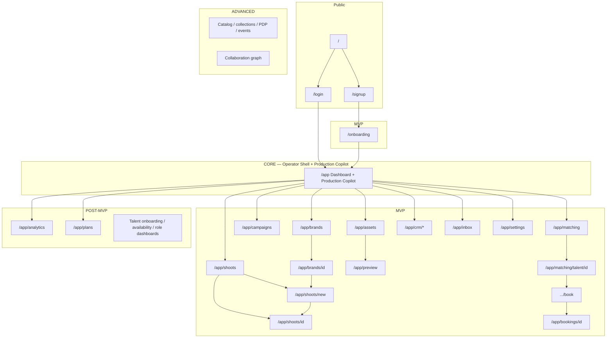

# Product Sitemap

**Status:** Product route SSOT (aligned with [Product requirements](prd.md)) **Baseline date:** 2026-08-24 **Last verified against current repo:** 2026-09-18 **This file is the application map for V2.** HTML prototypes are design reference only.

| Source                                                                                | Use for                                                                |
| ------------------------------------------------------------------------------------- | ---------------------------------------------------------------------- |
| **This file**                                                                         | Routes, phases, nav, booking vs shoot                                  |
| [Live execution board](https://linear.app/amo100/project/v2-ipix-cd2f90b58cd2/issues) | Task status, blockers, and current execution                           |
| [Documentation map](index-docs.md)                                                    | Current documentation map; legacy route audits are historical evidence |
| `Universal-design-prompt-4/Pages/*.dc.html`                                           | Visual SCR mockups (not “built in this repo”)                          |

**This repo today `[VERIFIED]`:** real Next.js routes exist for marketing/auth/onboarding, `/app`, `/app/brands`, `/app/shoots`, `/app/plans`, plus API routes. HTML prototypes remain design reference; route files and verified runtime behavior determine what is shipped.

***

## 0. How to read

Production planning now has one user-facing home:

| Name                     | What it is                                                  | Phase                        |
| ------------------------ | ----------------------------------------------------------- | ---------------------------- |
| **Production Copilot**   | CopilotKit + Mastra `production-planner` embedded in `/app` | **Core**                     |
| **Production workspace** | Timeline / Kanban / Calendar around `planner.*`             | **Post-MVP** as `/app/plans` |

`/app` is the single authenticated operator surface. The Production Copilot lives inside that shell; there is no separate planner product page in the V2 sitemap.

***

## 1. Corrections vs the July HTML sitemap

The previous root `SITEMAP.md` (2026-07-06) was wrong as a product map. These rules replace it:

| Topic                                                         | Old (incorrect)                                         | V2 (this file)                                                                              |
| ------------------------------------------------------------- | ------------------------------------------------------- | ------------------------------------------------------------------------------------------- |
| What “built” means                                            | 31 HTML screens 🟢                                      | React routes and verified behavior in **this** repo; legacy/design files are reference only |
| Core surface                                                  | Separate thin AI planning page                          | **`/app` only** — Operator Shell + Production Copilot                                       |
| Brand                                                         | `/app/brands`                                           | `/app/brands`                                                                               |
| Shoot create                                                  | `/app/shoots/new`                                       | `/app/shoots/new`                                                                           |
| Onboarding                                                    | `/onboarding` and `/onboarding` mixed                   | `/onboarding`                                                                               |
| CRM                                                           | `/app/crm/companies` · `/contacts` · schema “not built” | `/app/crm/companies` · `/contacts` · **legacy React is real**; still **MVP not Core**       |
| Booking                                                       | Shoot Wizard `flow=booking`                             | **`/app/matching/talent/[id]/book`** + **`/app/bookings/[id]`**                             |
| Talent profile                                                | `/app/matching/talent/[id]` as live                     | Same path in V2; **rebuild** (legacy used `?talentId=` on `/app/talent/profile`)            |
| Catalog / collections / events / `/app/model` / `/app/roster` | In nav or ⚪                                             | **Dropped from V2 nav** until Advanced                                                      |
| SCR-18 collab                                                 | 🟢 and ⚪ in the same doc                                | Advanced / Inbox covers MVP                                                                 |
| Planner HTML SCR-32–35                                        | Missing from “complete” 31-row table                    | Production workspace = `/app/plans` Post-MVP; Production Copilot is embedded in `/app`      |
| Prototype path                                                | `Pages/` at repo root                                   | `Universal-design-prompt-4/Pages/`                                                          |
| Settings                                                      | Missing                                                 | `/app/settings` (MVP)                                                                       |

**HITL still holds:** no AI auto-book, auto-confirm, or auto-publish.

***

## 2. Route tree

```
PUBLIC
/
├── login                      # Core: minimal auth
├── signup
└── (optional) pricing         # not in MVP nav

/onboarding                    # MVP — brand DNA funnel
                               # drop duplicate /app/onboarding except redirect

APP
/app                           # CORE — single authenticated operator surface + Production Copilot
├── brands
│   └── [id]
├── shoots
│   ├── new                    # 3-gate wizard (MVP)
│   └── [id]
├── campaigns
├── assets
│   └── [id]
├── preview                    # Channel Preview
├── matching
│   └── talent/[id]
│       └── book               # booking wizard (not shoot flow=booking)
├── bookings/[id]
├── crm
│   ├── companies[/id]
│   ├── contacts[/id]
│   └── pipeline[/id]
├── talent
├── operations
├── analytics                  # Post-MVP
│   └── campaigns
├── inbox
├── settings                   # new; do not port Cloudflare env UI
└── plans                      # Post-MVP production workspace
    ├── dashboard
    └── [id]
        └── settings

TALENT (Post-MVP)
/app/talent/onboarding
/app/talent                    # self profile
```

Dropped from V2 nav: `/services/*`, `/app/catalog`, `/app/collections`, `/app/events`, `/app/model`, `/app/roster`.

***

## 3. Phased map



***

## 4. Screen inventory (product routes)

Status = V2 intent, not HTML completeness.

| Phase    | Route                                               | Job                                | Design SCR (HTML)                       |
| -------- | --------------------------------------------------- | ---------------------------------- | --------------------------------------- |
| Core     | `/login`                                            | Auth                               | —                                       |
| Core     | `/app`                                              | Dashboard + Production Copilot     | SCR-01 + SCR-32–35 interaction patterns |
| MVP      | `/signup`                                           | Signup                             | —                                       |
| MVP      | `/onboarding`                                       | Brand DNA funnel                   | SCR-11                                  |
| MVP      | `/app/brands` · `/[id]`                             | Brand list/detail                  | SCR-02, 03                              |
| MVP      | `/app/shoots` · `/new` · `/[id]`                    | Shoots + 3-gate wizard             | SCR-04, 06, 05                          |
| MVP      | `/app/campaigns`                                    | Campaigns                          | SCR-07                                  |
| MVP      | `/app/assets` · `/[id]`                             | Assets                             | SCR-08                                  |
| MVP      | `/app/preview`                                      | Channel preview                    | SCR-10                                  |
| MVP      | `/app/matching`                                     | Talent match (talent tab only)     | SCR-09                                  |
| MVP      | `/app/matching/talent/[id]`                         | Talent profile                     | SCR-20                                  |
| MVP      | `.../book`                                          | Booking wizard                     | SCR-21 **as own route**                 |
| MVP      | `/app/bookings/[id]`                                | Booking detail                     | SCR-22 **as own route**                 |
| MVP      | `/app/crm/companies[/id]`                           | Companies                          | SCR-26, 27                              |
| MVP      | `/app/crm/contacts[/id]`                            | Contacts                           | SCR-28, 29                              |
| MVP      | `/app/crm/pipeline[/id]`                            | Pipeline / deal                    | SCR-30, 31                              |
| MVP      | `/app/inbox`                                        | Notifications                      | SCR-15                                  |
| MVP      | `/app/settings`                                     | Org/profile                        | —                                       |
| Post-MVP | `/app/analytics` · `/app/campaigns`                 | Analytics (honest empty paid KPIs) | SCR-16, 17                              |
| Post-MVP | `/app/plans/*`                                      | Production DAG workspace           | SCR-32–35                               |
| Post-MVP | `/app/talent/*`                                     | Talent self-serve                  | SCR-24                                  |
| Post-MVP | `/app/operations`                                   | Operations                         | —                                       |
| Post-MVP | availability + role dashboards                      | Rebuild                            | SCR-23, 25                              |
| Advanced | catalog / collections / PDP / events / collab route | Out of nav                         | SCR-12, 13, 14, 18, 19                  |

***

## 5. Navigation

**Core:** authenticated user lands on `/app`. The Production Copilot is part of the `/app` shell, not a separate destination.

**Current desktop rail (implemented shell):** Dashboard · Brands · Shoots · Assets · CRM · Talent · Operations · Analytics · Plans. Some rail destinations are intentionally placeholder or Post-MVP surfaces; appearing in the rail does **not** mean the product phase is complete. `src/components/operator-panel/nav.ts` owns the current shell navigation. Settings remains outside the primary rail until its dedicated task is delivered.

**V2 chrome:** Nav │ Workspace │ Production Copilot. Intelligence is a capability inside the Production Copilot/context panel, not a separate chat mode.

**Mobile:** Core and MVP are desktop-first (≥768px). Rebuild mobile navigation **Post-MVP** with phone support.

**Talent Post-MVP rail:** Dashboard · Offers · Availability · Inbox.

***

## 6. Journeys (routes)

* **Brand:** `/onboarding` → `/app` → `/app/brands/[id]`
* **Shoot:** `/app/shoots` → `/app/shoots/new` → `/app/shoots/[id]` → `/app/assets`
* **Booking:** `/app/matching` → `/app/matching/talent/[id]` → `.../book` → `/app/bookings/[id]` → crew on shoot detail
* **CRM:** `/app/crm/companies/[id]` (`brand_id` → brand detail) · pipeline won → ApprovalCard → brand
* **Core proof:** `/login` → `/app` → Production Copilot conversation persists across reload/restart → Org B cannot read Org A thread

***

## 7. AI surfaces

* **Production Copilot:** the single conversation surface inside `/app`.
* **Intelligence:** trusted read-only signals/evidence surfaced inside the Production Copilot and relevant workspace views; never a separate chat mode.
* **Core assistant:** `production-planner` compute tools inside the Production Copilot.
* **MVP assistants/capabilities:** brand, creative, matching, booking (draft only), CRM (draft only).

***

## 8. Design HTML (not product)

Prototypes live in `Universal-design-prompt-4/Pages/`. Useful for layout/HITL; **not** a route registry.

Do not cite `Pages/` at repo root, `docs/handoff/SCREEN-REGISTRY.md`, or July “15 verified / 31 production” as implementation truth.

***

## 9. Port order after Core gold

1. Tokens + empty/error/skeleton
2. Operator Shell + Production Copilot context panel
3. Brand list/detail → Shoots list/detail → Dashboard aggregation
4. Channel preview
5. CRM companies + detail
6. Matching talent tab
7. Production workspace under `/app/plans`

Do not port first: 10-step HTML wizard (code is \~6 steps), 13-screen onboarding HTML, paid analytics KPIs, `/app/plans` mutations, availability, role dashboards, SCR-18 as a route.
