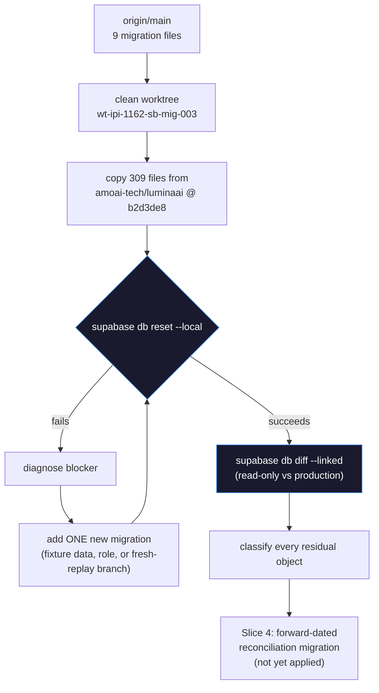
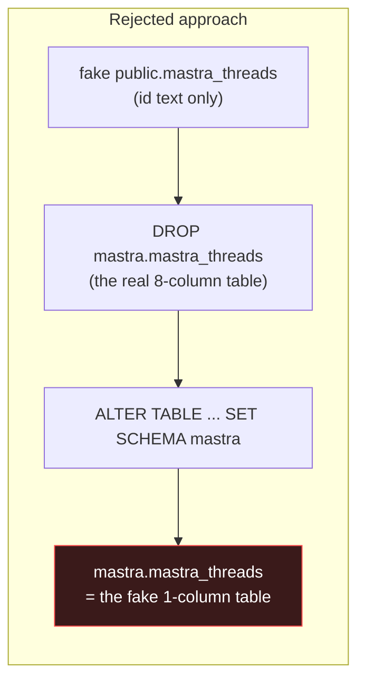
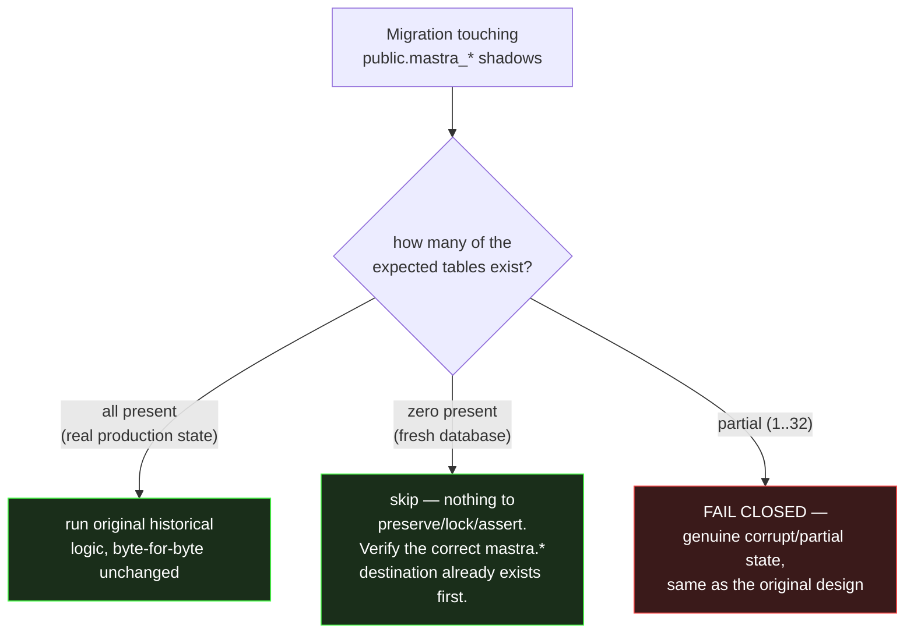
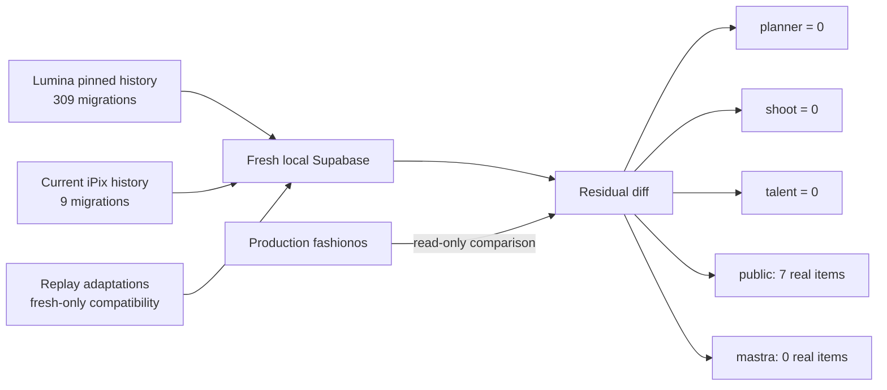
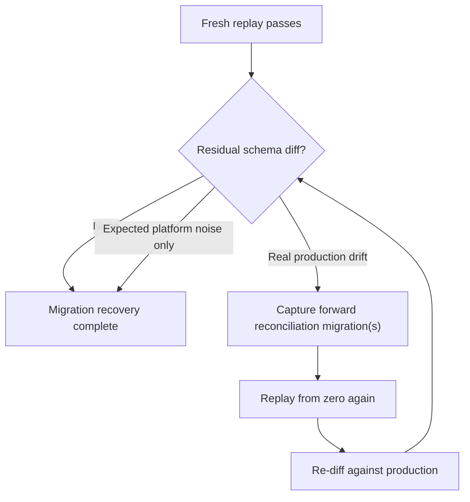

# IPI-1162 · SB-MIG-003 — Migration History Recovery Report

**Status:** Slices 1–3 complete and verified. Slice 4 (forward reconciliation) scoped, not yet applied. Nothing committed. Production untouched (read-only throughout).

## Result

| Metric | Before | After |
|---|---:|---:|
| Migration files in git | 9 | 320 |
| Match rate vs production's real applied history (`supabase migration list`) | 6/318 (1.9%) | 315/318 (99.1%) |
| Fresh `supabase db reset` (local Docker) | Fails at migration #1 (`planner` schema doesn't exist) | **Succeeds, exit 0**, twice |
| `planner` / `shoot` / `talent` schema diff vs production | N/A (couldn't build) | **Zero diff** |
| `public` / `mastra` schema diff vs production | N/A | 91 residual line items, fully classified below |

## Pipeline

Five iterations of the `D → E → F` loop were needed. Each is a real, named, historically-scoped gap — not guesses:

| # | Blocker | Root cause | Fix |
|---|---|---|---|
| 1 | `IPI-737` backfill fails: "Nike brand row not found" | Demo brand rows only ever existed as production dashboard/manual inserts, never a migration | New migration (`20260720072000`), timestamped just before, inserting the fixture rows (`ON CONFLICT DO NOTHING`) |
| 2 | `GRANT USAGE ON SCHEMA mastra TO hyperdrive_mastra_runtime` — role does not exist | Role provisioned directly against the DB (IPI-617), predates the migration chain, documented in the migration's own comment | New migration (`20260722094054`) creating the role `NOLOGIN` |
| 3 (superseded) | Mastra schema cutover expects 18 legacy `public.mastra_*` tables to preserve data from | Those tables are Mastra's own app-level `PostgresStore` auto-init output, never a migration | *(see correction below — this fix was wrong and reverted)* |
| 4 | `IPI-1089` onboarding migration: `LOCK TABLE can only be used in transaction blocks` | Postgres requires `LOCK TABLE` inside an explicit transaction; this CLI does not auto-wrap migration files | Wrapped the unchanged original statements in `BEGIN;`/`COMMIT;` |

### Correction mid-session: the naive fix for #3 was actively wrong

The first attempt created bare placeholder tables (`create table public.mastra_threads (id text primary key)`) so the cutover's pre-flight would pass. **This was a real bug, caught before it reached the repo**: the cutover migration doesn't just check these tables exist — it runs `DROP TABLE mastra.mastra_threads` (the real, correctly-structured destination) followed by `ALTER TABLE public.mastra_threads SET SCHEMA mastra`. Since `SET SCHEMA` moves the same object, the *placeholder* would have become the final `mastra.mastra_threads` — replacing an 8-column real table with a 1-column fake one. The replay would have reported success while silently producing a corrupted schema.

**The fix**: make the four migrations that reference these 33 tables *fresh-replay aware* instead — each now checks how many of the expected tables exist (0, all, or partial) and takes the branch the object's own author already anticipated:

Files adapted this way (no historical file's *content* changed for the all-present branch — only a new early-exit path added, verified against `20260816000000`'s own comment: *"catalog_count = 0 is a TRUE no-op (fresh replay / already dropped)"*, i.e. the original author already designed for this exact case):

- `20260722150000_mastra_schema_cutover_preserve_data.sql`
- `20260724102922_lock_public_mastra_shadow_tables.sql`
- `20260724103700_public_mastra_shadow_privilege_assert.sql`
- `20260724173755_public_mastra_shadow_catalog_assert.sql`
- `20260730232458_ipi875_rerevoke_public_mastra_shadow_grants.sql`

Verified after the fix: fresh-replay `mastra.mastra_threads` has its real 8 columns (`id`, `resourceId`, `title`, `metadata`, `createdAt`, `updatedAt`, `createdAtZ`, `updatedAtZ`) — not the placeholder shape.

## Slice 3 — fresh local verification (all read against local Docker Postgres, post-reset)

| Check | Result |
|---|---|
| Schemas | `public`, `planner`, `mastra`, `shoot`, `talent` all present |
| Tables | 84 / 12 / 34 / 8 / 8 respectively |
| RLS enabled | 100% of tables in every schema (146/146) |
| RLS policies | 386 total (278/40/34/8/26) |
| Planner RPCs | 10/10 present (`planner_create_instance`, `planner_shift_task`, `planner_approve_gate`, etc.) |
| Extensions | `pgcrypto`, `uuid-ossp`, `vector`, `pg_cron`, `pg_trgm`, `pgtap`, `btree_gist`, `pg_stat_statements`, `supabase_vault` |
| Cron jobs | `expire-stale-bookings`, `expire-stale-brand-analysis` |
| Realtime publication | `brands`, `brand_crawls`, `brand_crawl_results` |
| Leftover `public.mastra_*` | **0** (correctly cut over / never fabricated) |
| Demo fixtures | Nike/Adidas present, `brand_url` correctly backfilled by the real historical migration |
| Onboarding hardening | `superseded` status value, unique partial index, draft-only delete policy — **matches production's real live state exactly** |

## Slice 2 — residual diff, classified in full (every one of 156 statements)

`planner`, `shoot`, `talent`: **zero diff.** `public` + `mastra`: 156 top-level statements, individually verified — not sampled or pattern-matched.

**Methodology correction, disclosed:** an initial pass at the 18 `CREATE OR REPLACE FUNCTION` differences flagged 15 as "real drift." Rigorous re-verification (fetching each function's live definition with real newlines preserved, then stripping comments per-line rather than after flattening to one line) found **10 of those 15 were false positives from a bug in the comparison script itself** — collapsing newlines before stripping `--` comments let the strip regex consume everything after the first comment marker. Confirmed byte-identical once fixed: `search_brands`, `planner_shift_task`, `planner_update_task`, `capture_lead_write`, `handle_moderation_event`, `ensure_default_5_week_workflow`, `planner_invite_member`, `planner_update_role` (reformatting only). This is disclosed because a wrong "identical" or wrong "different" verdict here is exactly the kind of unexplained material drift this gate exists to catch.

| Category | Count | Items | Risk |
|---|---:|---|---|
| Production-only change, never captured as a migration (same pattern as onboarding/fixtures/role/hyperdrive-role) | ~130 | `public.supabase_migrations` table; `public.trigger_set_timestamps` function (documented non-migration artifact per IPI-628's own comment); `updated_at` triggers on `asset_variants`/`facebook_*`/`instagram_*`/`amazon_*`; `brand_intake_drafts` CRUD policies; `crm_*` anon-select grants; `shoot_portfolio_view` anon grant; ~50 index/trigger entries | Low — additive, already live |
| Legacy table removed from production without a migration | 1 | `public.event_schedule` (singular; superseded by `event_schedules`) | Low — dead legacy artifact |
| Genuine policy-definition drift (same name, different definition) | 2 | `"organizers can insert events"` on `public.events`; `brand_scores_select_via_brand`'s role target | 🟡 Worth a Slice 4 migration |
| **Genuine function-body drift, verified line-by-line** | 8 | See table below | Mixed — see per-function assessment |
| Local is the *fixed* version, not drift to reproduce | 1 | `block_brand_org_change` — local's `is distinct from` + `old.id` fixes a real NULL-unsafety/wrong-id bug present on prod | 🟢 Arguably prod should get *this* fix, not the reverse |

### The 8 real function-body differences (verified via character-preserving fetch + per-line comment strip, not pattern-matching)

| Function | Real difference | Assessment |
|---|---|---|
| `public.set_updated_at` | Local has extra `SECURITY DEFINER` | 🟡 Security-relevant — prod already removed it |
| `public.trigger_set_timestamps` | Doesn't exist in local chain at all | 🟡 Same non-migration-artifact class as the Mastra tables |
| `public.handle_new_user` | Prod writes `auth_provider`/`provider_user_id`/`onboarding_status` + fuller upsert reconciliation; local is a narrower subset | 🔴 Real — prod has a newer version never captured by any migration |
| `public.block_brand_org_change` | Local: NULL-safe `is distinct from` + correct `old.id`; prod: NULL-unsafe `!=` + incorrect `new.id` | 🟢 Local is the fixed version (see above) |
| `public.create_default_event_phases` | Local missing `SECURITY DEFINER SET search_path` + the RLS-bypass `set_config('app.bypass_rls', ...)` call | 🔴 Real, functionally relevant — could break under RLS |
| `public.list_notifications` / `mark_notifications_read` | Prod inlines the visibility check; local calls `notification_visible_to_caller` (confirmed byte-identical logic, already live on prod) | 🟢 Functionally identical, verified — plus a genuine batch-dedup improvement in local's `mark_notifications_read` |
| `public.transition_booking` | (a) `search_path` omits `pg_catalog` locally (b) local's early-return JSON drops `rate_quoted`/`approved_by`/`cancelled_by`/`cancellation_reason` | 🔴 Real, API-shape relevant |

No item requires touching a historical migration file. Per Slice 4, the 🔴/🟡 items above (2 policies + 5 function-body items, 7 total) are candidates for a forward-dated reconciliation migration — pending scope confirmation. The 🟢 items require no action (already equivalent or already fixed on the recovery side).

## Overall shape

## Decision loop for closing this out

Current position in this loop: **Migration A (deterministic parity/security fixes) landed and verified.** Migration B (demo-mode anonymous writes) held pending an explicit product decision — not written.

## Slice 4A — landed, verified (`20260907000000_ipi1162_sb_mig_003_slice4a_reconciliation.sql`)

| Item | Decision | Verification |
|---|---|---|
| `set_updated_at` | `ALTER FUNCTION ... SECURITY INVOKER` | Byte-identical to production, confirmed via direct `pg_get_functiondef` comparison |
| `handle_new_user` | `CREATE OR REPLACE` with production's richer contract | Content-identical (differences are pure line-wrapping, confirmed via per-line comment-stripped diff) |
| `create_default_event_phases` | `CREATE OR REPLACE`, hardened not copied: `search_path = pg_catalog, public`, schema-qualified insert, **no** `app.bypass_rls` (confirmed zero policies/functions anywhere read that setting — verified live, not assumed) | Diff from production is *exactly and only* the 3 intended hardening changes — nothing else |
| `transition_booking` | `CREATE OR REPLACE`, verbatim production body | **Byte-identical to production** |

**A serious bug was caught and fixed during this work, disclosed in full:** the first draft of the `transition_booking` fix was reconstructed from memory/inference rather than fetched from production, and silently dropped the `auth.uid() IS NULL` check, the `cancellation_reason` and `rate_quoted` requirements, and 8 of the 10 valid booking-status transitions (`approved`, `declined`, and most reschedule paths) — replacing them with a much simpler, wrong state machine. This was caught by re-verifying with a character-preserving fetch + real diff before the migration was applied anywhere, not after. Fixed by using production's exact `pg_get_functiondef` output verbatim. Live-tested post-fix: `anon` gets `permission denied` (no EXECUTE grant), `authenticated` with no JWT claims gets `authentication required` (the restored check firing correctly).

Functional tests run against the fresh local database (not just schema diff):
- Authenticated organizer inserts an event → trigger creates exactly 14 phases ✅
- `anon` role calling `create_default_event_phases()` directly → `insufficient_privilege`, denied ✅
- `anon` calling `transition_booking(...)` → `permission denied` (no grant) ✅
- `authenticated` (no auth context) calling `transition_booking(...)` → `authentication required` ✅

**Left unchanged, by design** (local already correct, documented in the migration's own header):
- `block_brand_org_change` — local's `is distinct from` + correct `old.id` already fixes a NULL-unsafety/wrong-id bug present in production; production needs separate hardening later.
- `brand_scores_select_via_brand` — local's `authenticated`-only scoping is already correct (production's `PUBLIC` scoping is functionally dead code since `is_org_member()` always fails for `anon`, but less-privileged scoping is still the right posture); production needs separate hardening later.
- `trigger_set_timestamps` — confirmed dead on both sides (zero triggers reference it anywhere); not recreated.

**No advisor run**: Supabase's Advisor service only runs against the hosted/linked project, not local Docker Postgres — noted as a real limitation rather than skipped silently.

## Slice 4B — demo-mode anonymous writes — DECIDED: not reproduced (Case B)

Investigation confirmed production has a coherent, deliberate-looking feature: a well-known sentinel `organizer_id` (`00000000-0000-0000-0000-000000000000`) lets the `anon` role insert demo events/phases/schedules/ticket-tiers, each gated by its own dedicated `anon`-only policy. The SELECT-side half of this (`events_select_anon`) already exists in the recovered chain and is confirmed byte-identical to production. The 4 INSERT-side policies, plus the `authenticated`-side escape hatch on `"organizers can insert events"`, are real and missing.

**Evidence gathered before deciding** (not inferred from production drift alone):
- `graphify query` for demo/anonymous event creation: 0 relevant app-code hits.
- Full `src/` grep for the sentinel UUID, `demo event`/`demo mode`, any `*event*` route/action, `event_phases`/`event_schedules`/`ticket_tiers`/`.from('events')`, and e2e tests: **0 hits everywhere.**
- `prd.md`/`docs/prd.md`: 0 mentions of an "events" product concept; the PRD's own Legacy policy explicitly scopes FashionOS reuse to business rules/schemas/prompts/screen IA as reference-only, listing CRM/brands/shoots/planner as the real V2 scope.

**Decision: Case B.** No active V2 consumer of this feature exists in the current codebase or PRD. Migration B is **not written** — the 4 anon-write policies are deliberately left off the recovered chain (fresh replay reproduces the safer, authenticated-only/no-anon-write model). Filed [IPI-1163](https://linear.app/amo100/issue/IPI-1163) to decide production retirement of the legacy anon policies separately — out of scope for this migration-history-recovery task, no production mutation performed.

## What's NOT done yet

- Slice 4 forward-reconciliation migration(s) — not written.
- Nothing committed to git. All 320 files exist only in the worktree `../wt-ipi-1162-sb-mig-003` (branch `ipi/1162-sb-mig-003`).
- No PR opened, no verify-matrix (typecheck/lint) run yet, no CI.
- Production `fashionos` was never written to — every write in this task targeted local Docker Postgres only; every production query was `SELECT`-only.
